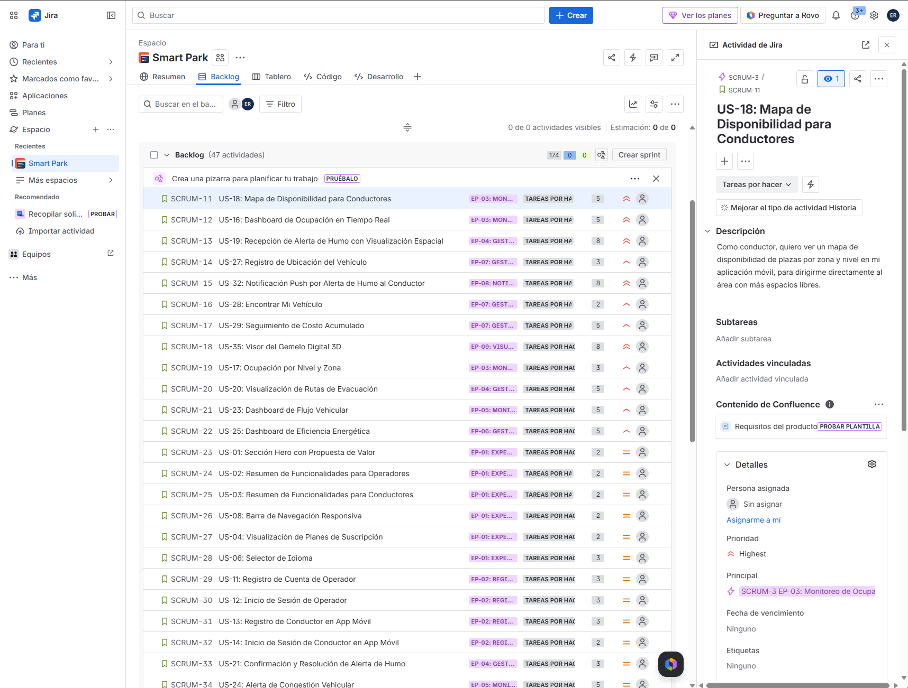
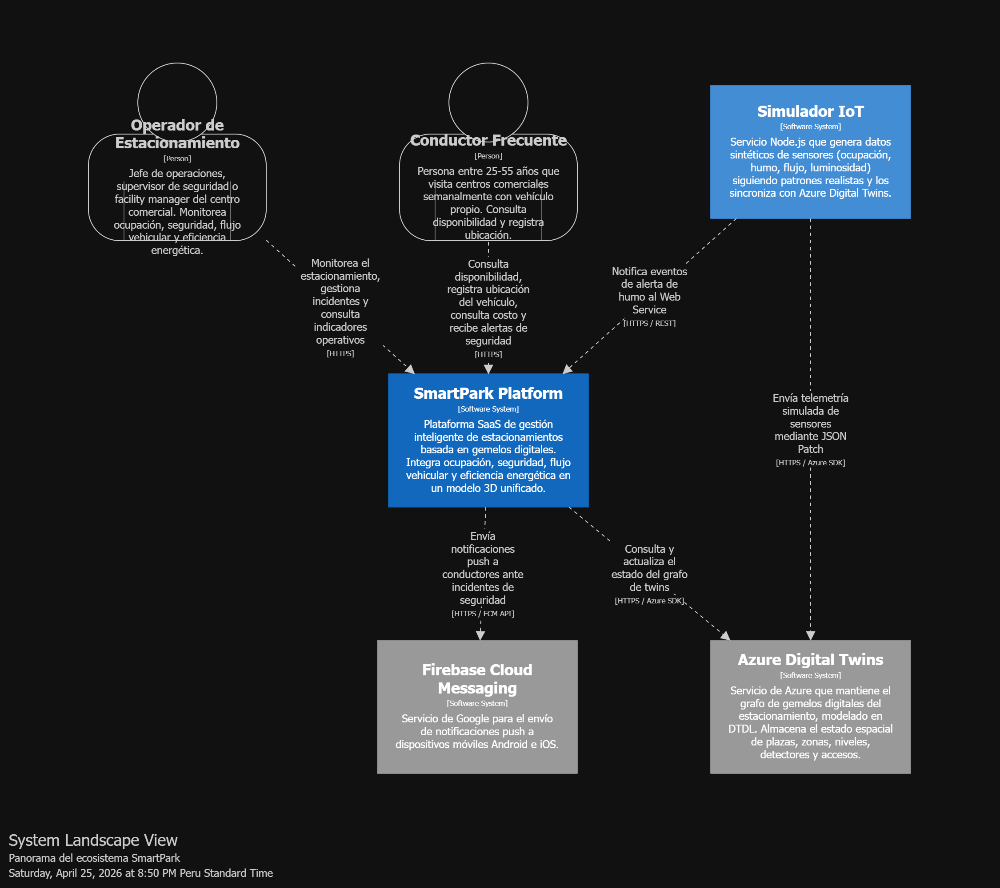
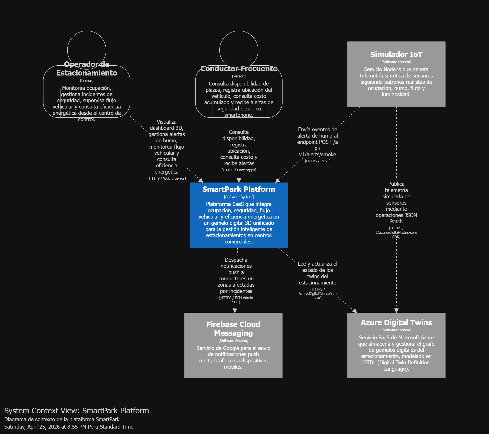
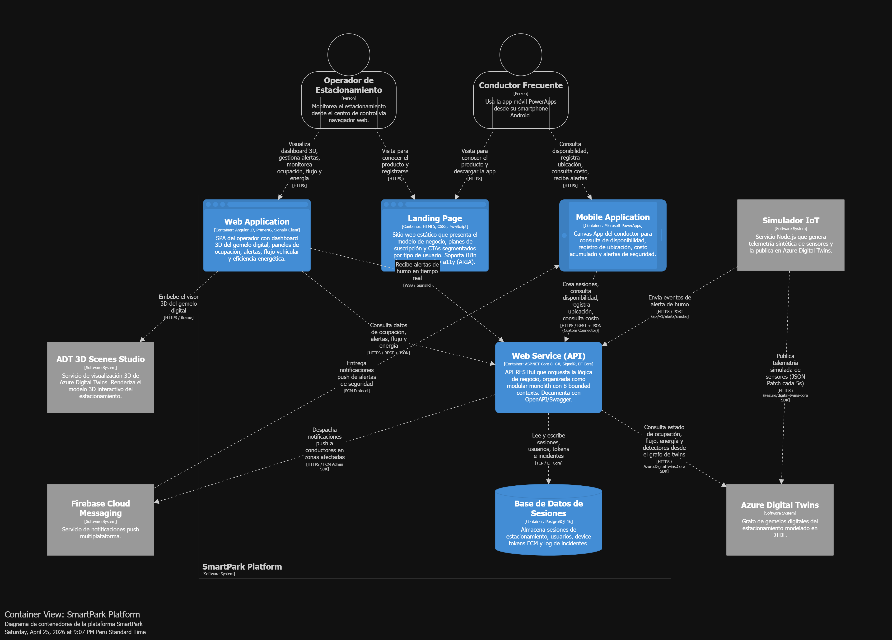
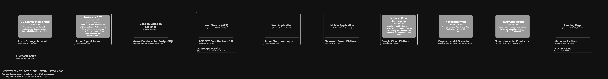

<div align="center">

# UNIVERSIDAD PERUANA DE CIENCIAS APLICADAS

## Facultad de Ingeniería
### Carrera de Ingeniería de Software

**CICLO:** 202601  
**CURSO:** Arquitecturas de Software Emergentes  
**SECCIÓN:** 10042  
**PROFESOR:** Royer Edelwer Rojas Malasquez

---

## INFORME DE TRABAJO FINAL

**Startup:** _Apex Twin_  
**Producto:** _SmartPark_

### Plataforma de gestión inteligente de estacionamientos en centros comerciales basada en Digital Twins

---

### Relación de Integrantes

| Código     | Apellidos y Nombres             |
|------------|---------------------------------|
| U202220829 | Riva Rodriguez, Elmer Augusto   |
| u202216263 | Morales Calderon, Hernan Emilio |
| U20211g671 | Qqueso Rodriguez, Britney Delhy |
| U202210973 | Sanchez Rios, Camila Cristina   |
| U202210297 | Valle Zuta, Abel Andrés         |

**Lima, Perú — Abril de 2026**

</div>

---

## Registro de Versiones del Informe

| Versión | Fecha      | Autor      | Descripción de modificación                                                      |
|---------|------------|------------|----------------------------------------------------------------------------------|
| 0.1.0   | YYYY-MM-DD | _(Nombre)_ | Versión inicial del informe para entrega TB1. Incluye Capítulos I, II, III y IV. |
|         |            |            |                                                                                  |
|         |            |            |                                                                                  |

---

## Project Report Collaboration Insights

**URL del repositorio del informe:** `https://github.com/upc-pre-202601-1ASI0728-10042-smartpark/report`

**URL de la organización GitHub:** `https://github.com/upc-pre-202601-1ASI0728-10042-smartpark`

### Repositorios de productos digitales

| Producto                   | Repositorio                                                                  |
|----------------------------|------------------------------------------------------------------------------|
| Landing Page               | `https://github.com/upc-pre-202601-1ASI0728-10042-smartpark/landing-page`    |
| Web Application (Operador) | `https://github.com/upc-pre-202601-1ASI0728-10042-smartpark/web-application` |
| Web Services (API)         | `https://github.com/upc-pre-202601-1ASI0728-10042-smartpark/web-services`    |
| IoT Simulator              | `https://github.com/upc-pre-202601-1ASI0728-10042-smartpark/iot-simulator`   |
| Mobile App (PowerApps)     | `https://github.com/upc-pre-202601-1ASI0728-10042-smartpark/mobile-app`      |

### Evidencias de colaboración

_(Para cada entrega, incluir: descripción de cómo se han desarrollado las actividades, capturas de los analíticos de colaboración de GitHub Insights mostrando commits por miembro del equipo, gráfico de contribuciones, y evidencia de la aplicación de GitFlow y Conventional Commits.)_

#### TB1
_(Pendiente)_

#### TP1
_(Pendiente)_

#### TB2
_(Pendiente)_

#### TF1
_(Pendiente)_

---

## Tabla de Contenidos

- [Registro de Versiones del Informe](#registro-de-versiones-del-informe)
- [Project Report Collaboration Insights](#project-report-collaboration-insights)
- [Student Outcome](#student-outcome)
- [Capítulo I: Introducción](#capítulo-i-introducción)
  - [1.1. Startup Profile](#11-startup-profile)
    - [1.1.1. Descripción de la Startup](#111-descripción-de-la-startup)
    - [1.1.2. Perfiles de integrantes del equipo](#112-perfiles-de-integrantes-del-equipo)
  - [1.2. Solution Profile](#12-solution-profile)
    - [1.2.1. Antecedentes y problemática](#121-antecedentes-y-problemática)
    - [1.2.2. Lean UX Process](#122-lean-ux-process)
      - [1.2.2.1. Lean UX Problem Statements](#1221-lean-ux-problem-statements)
      - [1.2.2.2. Lean UX Assumptions](#1222-lean-ux-assumptions)
      - [1.2.2.3. Lean UX Hypothesis Statements](#1223-lean-ux-hypothesis-statements)
      - [1.2.2.4. Lean UX Canvas](#1224-lean-ux-canvas)
  - [1.3. Segmentos objetivo](#13-segmentos-objetivo)
- [Capítulo II: Requirements Elicitation & Analysis](#capítulo-ii-requirements-elicitation--analysis)
  - [2.1. Competidores](#21-competidores)
    - [2.1.1. Análisis competitivo](#211-análisis-competitivo)
    - [2.1.2. Estrategias y tácticas frente a competidores](#212-estrategias-y-tácticas-frente-a-competidores)
  - [2.2. Entrevistas](#22-entrevistas)
    - [2.2.1. Diseño de entrevistas](#221-diseño-de-entrevistas)
    - [2.2.2. Registro de entrevistas](#222-registro-de-entrevistas)
    - [2.2.3. Análisis de entrevistas](#223-análisis-de-entrevistas)
  - [2.3. Needfinding](#23-needfinding)
    - [2.3.1. User Personas](#231-user-personas)
    - [2.3.2. User Task Matrix](#232-user-task-matrix)
    - [2.3.3. Empathy Mapping](#233-empathy-mapping)
    - [2.3.4. As-is Scenario Mapping](#234-as-is-scenario-mapping)
  - [2.4. Ubiquitous Language](#24-ubiquitous-language)
- [Capítulo III: Requirements Specification](#capítulo-iii-requirements-specification)
  - [3.1. To-Be Scenario Mapping](#31-to-be-scenario-mapping)
  - [3.2. User Stories](#32-user-stories)
  - [3.3. Impact Mapping](#33-impact-mapping)
  - [3.4. Product Backlog](#34-product-backlog)
- [Capítulo IV: Strategic-Level Software Design](#capítulo-iv-strategic-level-software-design)
  - [4.1. Strategic-Level Attribute-Driven Design](#41-strategic-level-attribute-driven-design)
    - [4.1.1. Design Purpose](#411-design-purpose)
    - [4.1.2. Attribute-Driven Design Inputs](#412-attribute-driven-design-inputs)
      - [4.1.2.1. Primary Functionality](#4121-primary-functionality)
      - [4.1.2.2. Quality Attribute Scenarios](#4122-quality-attribute-scenarios)
      - [4.1.2.3. Constraints](#4123-constraints)
    - [4.1.3. Architectural Drivers Backlog](#413-architectural-drivers-backlog)
    - [4.1.4. Architectural Design Decisions](#414-architectural-design-decisions)
    - [4.1.5. Quality Attribute Scenario Refinements](#415-quality-attribute-scenario-refinements)
  - [4.2. Strategic-Level Domain-Driven Design](#42-strategic-level-domain-driven-design)
    - [4.2.1. EventStorming](#421-eventstorming)
    - [4.2.2. Candidate Context Discovery](#422-candidate-context-discovery)
    - [4.2.3. Domain Message Flows Modeling](#423-domain-message-flows-modeling)
    - [4.2.4. Bounded Context Canvases](#424-bounded-context-canvases)
    - [4.2.5. Context Mapping](#425-context-mapping)
  - [4.3. Software Architecture](#43-software-architecture)
    - [4.3.1. Software Architecture System Landscape Diagram](#431-software-architecture-system-landscape-diagram)
    - [4.3.2. Software Architecture Context Level Diagram](#432-software-architecture-context-level-diagram)
    - [4.3.3. Software Architecture Container Level Diagram](#433-software-architecture-container-level-diagram)
    - [4.3.4. Software Architecture Deployment Diagrams](#434-software-architecture-deployment-diagrams)
- [Capítulo V: Tactical-Level Software Design](#capítulo-v-tactical-level-software-design)
  - [5.1. Bounded Context: Parking Occupancy](#51-bounded-context-parking-occupancy)
    - [5.1.1. Domain Layer](#511-domain-layer)
    - [5.1.2. Interface Layer](#512-interface-layer)
    - [5.1.3. Application Layer](#513-application-layer)
    - [5.1.4. Infrastructure Layer](#514-infrastructure-layer)
    - [5.1.5. Bounded Context Software Architecture Component Level Diagrams](#515-bounded-context-software-architecture-component-level-diagrams)
    - [5.1.6. Bounded Context Software Architecture Code Level Diagrams](#516-bounded-context-software-architecture-code-level-diagrams)
      - [5.1.6.1. Bounded Context Domain Layer Class Diagrams](#5161-bounded-context-domain-layer-class-diagrams)
      - [5.1.6.2. Bounded Context Database Design Diagram](#5162-bounded-context-database-design-diagram)
  - [5.2. Bounded Context: Safety & Incidents](#52-bounded-context-safety--incidents)
    - [5.2.1. Domain Layer](#521-domain-layer)
    - [5.2.2. Interface Layer](#522-interface-layer)
    - [5.2.3. Application Layer](#523-application-layer)
    - [5.2.4. Infrastructure Layer](#524-infrastructure-layer)
    - [5.2.5. Bounded Context Software Architecture Component Level Diagrams](#525-bounded-context-software-architecture-component-level-diagrams)
    - [5.2.6. Bounded Context Software Architecture Code Level Diagrams](#526-bounded-context-software-architecture-code-level-diagrams)
  - [5.3. Bounded Context: Traffic Flow](#53-bounded-context-traffic-flow)
  - [5.4. Bounded Context: Energy Management](#54-bounded-context-energy-management)
  - [5.5. Bounded Context: Parking Session](#55-bounded-context-parking-session)
  - [5.6. Bounded Context: Notifications](#56-bounded-context-notifications)
  - [5.7. Bounded Context: Identity & Access Management](#57-bounded-context-identity--access-management)
  - [5.8. Bounded Context: Digital Twin Synchronization](#58-bounded-context-digital-twin-synchronization)
- [Capítulo VI: Solution UX Design](#capítulo-vi-solution-ux-design)
  - [6.1. Style Guidelines](#61-style-guidelines)
    - [6.1.1. General Style Guidelines](#611-general-style-guidelines)
    - [6.1.2. Web, Mobile & Devices Style Guidelines](#612-web-mobile--devices-style-guidelines)
  - [6.2. Information Architecture](#62-information-architecture)
    - [6.2.1. Organization Systems](#621-organization-systems)
    - [6.2.2. Labeling Systems](#622-labeling-systems)
    - [6.2.3. SEO Tags and Meta Tags](#623-seo-tags-and-meta-tags)
    - [6.2.4. Searching Systems](#624-searching-systems)
    - [6.2.5. Navigation Systems](#625-navigation-systems)
  - [6.3. Landing Page UI Design](#63-landing-page-ui-design)
    - [6.3.1. Landing Page Wireframe](#631-landing-page-wireframe)
    - [6.3.2. Landing Page Mock-up](#632-landing-page-mock-up)
  - [6.4. Applications UX/UI Design](#64-applications-uxui-design)
    - [6.4.1. Applications Wireframes](#641-applications-wireframes)
    - [6.4.2. Applications Wireflow Diagrams](#642-applications-wireflow-diagrams)
    - [6.4.3. Applications Mock-ups](#643-applications-mock-ups)
    - [6.4.4. Applications User Flow Diagrams](#644-applications-user-flow-diagrams)
  - [6.5. Applications Prototyping](#65-applications-prototyping)
- [Capítulo VII: Product Implementation, Validation & Deployment](#capítulo-vii-product-implementation-validation--deployment)
  - [7.1. Software Configuration Management](#71-software-configuration-management)
    - [7.1.1. Software Development Environment Configuration](#711-software-development-environment-configuration)
    - [7.1.2. Source Code Management](#712-source-code-management)
    - [7.1.3. Source Code Style Guide & Conventions](#713-source-code-style-guide--conventions)
    - [7.1.4. Software Deployment Configuration](#714-software-deployment-configuration)
  - [7.2. Solution Implementation](#72-solution-implementation)
    - [7.2.1. Sprint 1](#721-sprint-1)
      - [7.2.1.1. Sprint Planning 1](#7211-sprint-planning-1)
      - [7.2.1.2. Sprint Backlog 1](#7212-sprint-backlog-1)
      - [7.2.1.3. Development Evidence for Sprint Review](#7213-development-evidence-for-sprint-review)
      - [7.2.1.4. Testing Suite Evidence for Sprint Review](#7214-testing-suite-evidence-for-sprint-review)
      - [7.2.1.5. Execution Evidence for Sprint Review](#7215-execution-evidence-for-sprint-review)
      - [7.2.1.6. Services Documentation Evidence for Sprint Review](#7216-services-documentation-evidence-for-sprint-review)
      - [7.2.1.7. Software Deployment Evidence for Sprint Review](#7217-software-deployment-evidence-for-sprint-review)
      - [7.2.1.8. Team Collaboration Insights during Sprint](#7218-team-collaboration-insights-during-sprint)
    - [7.2.2. Sprint 2](#722-sprint-2)
      - [7.2.2.1. Sprint Planning 2](#7221-sprint-planning-2)
      - [7.2.2.2. Sprint Backlog 2](#7222-sprint-backlog-2)
      - [7.2.2.3. Development Evidence for Sprint Review](#7223-development-evidence-for-sprint-review)
      - [7.2.2.4. Testing Suite Evidence for Sprint Review](#7224-testing-suite-evidence-for-sprint-review)
      - [7.2.2.5. Execution Evidence for Sprint Review](#7225-execution-evidence-for-sprint-review)
      - [7.2.2.6. Services Documentation Evidence for Sprint Review](#7226-services-documentation-evidence-for-sprint-review)
      - [7.2.2.7. Software Deployment Evidence for Sprint Review](#7227-software-deployment-evidence-for-sprint-review)
      - [7.2.2.8. Team Collaboration Insights during Sprint](#7228-team-collaboration-insights-during-sprint)
    - [7.2.3. Sprint 3](#723-sprint-3)
      - [7.2.3.1. Sprint Planning 3](#7231-sprint-planning-3)
      - [7.2.3.2. Sprint Backlog 3](#7232-sprint-backlog-3)
      - [7.2.3.3. Development Evidence for Sprint Review](#7233-development-evidence-for-sprint-review)
      - [7.2.3.4. Testing Suite Evidence for Sprint Review](#7234-testing-suite-evidence-for-sprint-review)
      - [7.2.3.5. Execution Evidence for Sprint Review](#7235-execution-evidence-for-sprint-review)
      - [7.2.3.6. Services Documentation Evidence for Sprint Review](#7236-services-documentation-evidence-for-sprint-review)
      - [7.2.3.7. Software Deployment Evidence for Sprint Review](#7237-software-deployment-evidence-for-sprint-review)
      - [7.2.3.8. Team Collaboration Insights during Sprint](#7238-team-collaboration-insights-during-sprint)
  - [7.3. Validation Interviews](#73-validation-interviews)
    - [7.3.1. Diseño de Entrevistas](#731-diseño-de-entrevistas)
    - [7.3.2. Registro de Entrevistas](#732-registro-de-entrevistas)
    - [7.3.3. Evaluaciones según heurísticas](#733-evaluaciones-según-heurísticas)
  - [7.4. Video About-the-Product](#74-video-about-the-product)
- [Conclusiones](#conclusiones)
  - [Conclusiones y recomendaciones](#conclusiones-y-recomendaciones)
  - [Video About-the-Team](#video-about-the-team)
- [Bibliografía](#bibliografía)
- [Anexos](#anexos)
  - [Anexo A: Videos de Exposiciones](#anexo-a-videos-de-exposiciones)
  - [Anexo B: Términos y Condiciones del Servicio](#anexo-b-términos-y-condiciones-del-servicio)
  - [Anexo C: Configuración de Internacionalización (i18n) y Accesibilidad (a11y)](#anexo-c-configuración-de-internacionalización-i18n-y-accesibilidad-a11y)
  - [Anexo D: DTDL Models de Azure Digital Twins](#anexo-d-dtdl-models-de-azure-digital-twins)

---

## Student Outcome

El curso contribuye al cumplimiento del Student Outcome ABET:

**ABET – EAC - Student Outcome 3:** Capacidad de comunicarse efectivamente con un rango de audiencias.

En el siguiente cuadro se describe las acciones realizadas y enunciados de conclusiones por parte del grupo, que permiten sustentar el haber alcanzado el logro del ABET – EAC - Student Outcome 3.

| Criterio específico                                                                                                                                                                       | Acciones realizadas                                                                                                                                                                                                                                                                                                                                                  | Conclusiones                                      |
|-------------------------------------------------------------------------------------------------------------------------------------------------------------------------------------------|----------------------------------------------------------------------------------------------------------------------------------------------------------------------------------------------------------------------------------------------------------------------------------------------------------------------------------------------------------------------|---------------------------------------------------|
| **Comunica oralmente sus ideas y/o resultados con objetividad a público de diferentes especialidades y niveles jerárquicos, en el marco del desarrollo de un proyecto en ingeniería.**    | **_(Apellidos, Nombres del integrante 1)_**<br>**TB1**<br>_(Acciones específicas realizadas)_<br><br>**TP1**<br>_(Acciones específicas realizadas)_<br><br>**TB2**<br>_(Acciones específicas realizadas)_<br><br>**TF1**<br>_(Acciones específicas realizadas)_<br><br>**_(Apellidos, Nombres del integrante 2)_**<br>**TB1**<br>_(Acciones específicas realizadas)_ | _(Conclusiones grupales acumulables por entrega)_ |
| **Comunica en forma escrita ideas y/o resultados con objetividad a público de diferentes especialidades y niveles jerárquicos, en el marco del desarrollo de un proyecto en ingeniería.** | **_(Apellidos, Nombres del integrante 1)_**<br>**TB1**<br>_(Acciones específicas realizadas)_<br><br>**TP1**<br>_(Acciones específicas realizadas)_                                                                                                                                                                                                                  | _(Conclusiones grupales acumulables por entrega)_ |

---

# Capítulo I: Introducción

## 1.1. Startup Profile

### 1.1.1. Descripción de la Startup

_(Descripción de la startup: nombre, misión, visión, valores, propuesta de valor única, mercado objetivo, modelo de negocio. Incluir logo de la startup.)_

### 1.1.2. Perfiles de integrantes del equipo

| Foto       | Nombre completo        | Código    | Carrera                | Aporte al equipo                                    |
|------------|------------------------|-----------|------------------------|-----------------------------------------------------|
| _(Imagen)_ | _(Apellidos, Nombres)_ | U20XXXXXX | Ingeniería de Software | _(Conocimientos técnicos y habilidades que aporta)_ |
| _(Imagen)_ | _(Apellidos, Nombres)_ | U20XXXXXX | Ingeniería de Software | _(Conocimientos técnicos y habilidades que aporta)_ |
| _(Imagen)_ | _(Apellidos, Nombres)_ | U20XXXXXX | Ingeniería de Software | _(Conocimientos técnicos y habilidades que aporta)_ |
| _(Imagen)_ | _(Apellidos, Nombres)_ | U20XXXXXX | Ingeniería de Software | _(Conocimientos técnicos y habilidades que aporta)_ |

## 1.2. Solution Profile

### 1.2.1. Antecedentes y problemática

_(Aplicar la técnica The 5 'W's & 2 'H's para describir antecedentes y problemática.)_

#### What (¿Qué?)
_(Descripción del problema central.)_

#### When (¿Cuándo?)
_(Cuándo ocurre el problema, frecuencia, momentos críticos.)_

#### Where (¿Dónde?)
_(Contexto físico, geográfico y digital donde ocurre.)_

#### Who (¿Quién?)
_(Actores afectados: operadores de estacionamientos, conductores, administradores de centros comerciales.)_

#### Why (¿Por qué?)
_(Causas raíz del problema.)_

#### How (¿Cómo?)
_(Cómo se manifiesta el problema en la operación diaria.)_

#### How Much (¿Cuánto?)
_(Magnitud cuantitativa del problema: pérdidas económicas, tiempos perdidos, incidentes, etc.)_

### 1.2.2. Lean UX Process

#### 1.2.2.1. Lean UX Problem Statements

**Problem Statement 1 — Operadores de Centros Comerciales**

_(Domain)_: La operación de estacionamientos en centros comerciales de gran escala...  
_(Customer Segments)_: Operadores de estacionamiento y administradores de seguridad...  
_(Pain Points)_: Falta de visibilidad integral en tiempo real, decisiones reactivas, ineficiencia energética...  
_(Gap)_: Las soluciones existentes no integran ocupación, seguridad, flujo y energía en una vista espacial unificada...  
_(Vision/Strategy)_: Construir un gemelo digital 3D operacional como single pane of glass...  
_(Initial Segment)_: Centros comerciales de Lima Metropolitana con más de 500 plazas de estacionamiento...

**Problem Statement 2 — Conductores frecuentes de centros comerciales**

_(Domain)_: La experiencia de estacionamiento en centros comerciales...  
_(Customer Segments)_: Conductores que visitan centros comerciales semanalmente...  
_(Pain Points)_: Tiempo perdido buscando espacio, dificultad para localizar vehículo al regresar, desconocimiento de costo acumulado, falta de información ante incidentes...  
_(Gap)_: Las apps existentes no ofrecen guía contextual ni alertas de seguridad georreferenciadas...  
_(Vision/Strategy)_: Aplicación móvil low-code que entregue disponibilidad en tiempo real, registro de ubicación y alertas de seguridad...  
_(Initial Segment)_: Conductores entre 25-55 años, NSE B/C, residentes en Lima...

#### 1.2.2.2. Lean UX Assumptions

**Business Assumptions**

| ID | Assumption |
|---|---|
| BA-01 | _(Los operadores de centros comerciales están dispuestos a invertir en una plataforma de gestión inteligente de estacionamientos.)_ |
| BA-02 | _(Los conductores adoptarán una app móvil que reduzca su tiempo de búsqueda de plaza.)_ |
| BA-03 | _(...)_ |

**User Assumptions**

| ID | ¿Quién es el usuario? | ¿Dónde encaja nuestro producto en su día? | ¿Qué problemas resuelve? | ¿Cuándo y cómo lo usa? | ¿Qué features son importantes? | ¿Cómo debería verse y comportarse? |
|---|---|---|---|---|---|---|
| UA-01 | _(Operador)_ | _(...)_ | _(...)_ | _(...)_ | _(...)_ | _(...)_ |
| UA-02 | _(Conductor)_ | _(...)_ | _(...)_ | _(...)_ | _(...)_ | _(...)_ |

#### 1.2.2.3. Lean UX Hypothesis Statements

**Hypothesis 1**  
We believe that **_(business outcome esperado)_**  
will be achieved if **_(usuarios objetivo)_**  
attain **_(beneficio para el usuario)_**  
with **_(feature propuesto)_**.

**Hypothesis 2**  
We believe that...

**Hypothesis 3**  
We believe that...

#### 1.2.2.4. Lean UX Canvas

_(Insertar imagen del Lean UX Canvas v2 elaborado en Miro o LucidChart.)_


## 1.3. Segmentos objetivo

### Segmento 1: Operadores de estacionamientos en centros comerciales

_(Características demográficas, perfil profesional, información estadística de sustento con citas.)_

### Segmento 2: Conductores frecuentes de centros comerciales

_(Características demográficas, hábitos de consumo, información estadística de sustento con citas.)_

---

# Capítulo II: Requirements Elicitation & Analysis

## 2.1. Competidores

_(Introducción identificando los competidores directos e indirectos seleccionados, mínimo 3.)_

| Competidor      | Tipo                | Logo       |
|-----------------|---------------------|------------|
| _(Parkopedia)_  | Directo / Indirecto | _(Imagen)_ |
| _(SpotHero)_    | Directo / Indirecto | _(Imagen)_ |
| _(Park Assist)_ | Directo / Indirecto | _(Imagen)_ |

### 2.1.1. Análisis competitivo

#### Competitive Analysis Landscape

|                                                         | **¿Por qué llevar a cabo este análisis?** _(Objetivo del análisis)_ |                  |                  |                  |
|---------------------------------------------------------|---------------------------------------------------------------------|------------------|------------------|------------------|
|                                                         | **Tu Startup**                                                      | **Competidor 1** | **Competidor 2** | **Competidor 3** |
| **Perfil**                                              |                                                                     |                  |                  |                  |
| Overview                                                |                                                                     |                  |                  |                  |
| Ventaja competitiva / ¿Qué valor ofrece a los clientes? |                                                                     |                  |                  |                  |
| **Perfil de Marketing**                                 |                                                                     |                  |                  |                  |
| Mercado objetivo                                        |                                                                     |                  |                  |                  |
| Estrategias de marketing                                |                                                                     |                  |                  |                  |
| **Perfil de Producto**                                  |                                                                     |                  |                  |                  |
| Productos & Servicios                                   |                                                                     |                  |                  |                  |
| Precios & Costos                                        |                                                                     |                  |                  |                  |
| Canales de distribución (Web y/o Móvil)                 |                                                                     |                  |                  |                  |
| **Análisis SWOT**                                       |                                                                     |                  |                  |                  |
| Fortalezas                                              |                                                                     |                  |                  |                  |
| Debilidades                                             |                                                                     |                  |                  |                  |
| Oportunidades                                           |                                                                     |                  |                  |                  |
| Amenazas                                                |                                                                     |                  |                  |                  |

### 2.1.2. Estrategias y tácticas frente a competidores

_(Estrategias y tácticas preliminares que aplicará la startup para afrontar las fortalezas y aprovechar las debilidades de la competencia, así como el contexto de oportunidades y amenazas.)_

## 2.2. Entrevistas

### 2.2.1. Diseño de entrevistas

#### Preguntas para Segmento 1: Operadores de estacionamiento

**Preguntas demográficas y de contexto**
1. ¿Cuál es su nombre, edad y cargo?
2. ¿En qué centro comercial trabaja y desde hace cuánto?
3. ¿Qué tan grande es el estacionamiento que opera (cantidad de plazas, niveles)?

**Preguntas principales**
1. _(¿Cómo monitorea actualmente el estado de ocupación del estacionamiento?)_
2. _(¿Qué herramientas tecnológicas utiliza día a día?)_
3. _(...)_

**Preguntas complementarias**
1. _(...)_

#### Preguntas para Segmento 2: Conductores

**Preguntas demográficas y de contexto**
1. ¿Cuál es su nombre, edad, distrito de residencia y ocupación?
2. ¿Con qué frecuencia visita centros comerciales?

**Preguntas principales**
1. _(¿Cuánto tiempo promedio invierte buscando estacionamiento?)_
2. _(¿Le ha pasado perder su vehículo dentro de un estacionamiento?)_
3. _(...)_

### 2.2.2. Registro de entrevistas

#### Segmento 1: Operadores

**Entrevista 1**

| Campo | Dato |
|---|---|
| Nombres y Apellidos | _(...)_ |
| Edad | _(...)_ |
| Distrito | _(...)_ |
| Cargo | _(...)_ |
| Fecha de entrevista | YYYY-MM-DD |
| URL del video (Microsoft Stream) | `https://...` |
| Timing inicio | HH:MM:SS |
| Duración | MM:SS |

_(Screenshot del video de entrevista)_


**Resumen de la entrevista:**  
_(Descripción detallada de las principales respuestas, incluyendo personalidad, marcas e influencias, tecnología, canales de interacción, browser, dispositivos.)_

**Entrevista 2 — Operador**  
_(Misma estructura)_

**Entrevista 3 — Operador**  
_(Misma estructura)_

#### Segmento 2: Conductores

**Entrevista 1 — Conductor**  
_(Misma estructura)_

**Entrevista 2 — Conductor**  
_(Misma estructura)_

**Entrevista 3 — Conductor**  
_(Misma estructura)_

### 2.2.3. Análisis de entrevistas

#### Segmento 1: Operadores

_(Análisis con sustento estadístico — porcentajes — de las características objetivas y subjetivas más comunes encontradas. Cada característica debe tener relación clara con las entrevistas registradas.)_

| Característica | % | Sustento (entrevistas) |
|---|---|---|
| _(Edad promedio entre 35-50 años)_ | _(80%)_ | _(E1, E2, E4)_ |
| _(Usa Excel para registro manual)_ | _(60%)_ | _(E1, E3, E5)_ |

#### Segmento 2: Conductores

_(Mismo formato de análisis para el segmento de conductores.)_

## 2.3. Needfinding

### 2.3.1. User Personas

_(Introducción explicando la relación entre los User Personas y las características identificadas en el análisis de entrevistas y competencia.)_

#### User Persona 1: Operador de Estacionamiento


#### User Persona 2: Conductor Frecuente


### 2.3.2. User Task Matrix

_(Introducción establecidiendo los segmentos considerados.)_

| Tarea | Operador (Frecuencia) | Operador (Importancia) | Conductor (Frecuencia) | Conductor (Importancia) |
|---|---|---|---|---|
| _(Verificar estado del estacionamiento)_ | Always | High | Often | Medium |
| _(Buscar plaza libre)_ | Never | N/A | Always | High |
| _(Atender alerta de incidente)_ | Sometimes | High | Sometimes | High |
| _(Ajustar iluminación por zona)_ | Often | Medium | Never | N/A |
| _(Recordar ubicación de vehículo)_ | Never | N/A | Always | High |
| _(...)_ | | | | |

_(Análisis post-tabla resaltando tareas con mayor frecuencia/importancia, diferencias y coincidencias entre User Personas.)_

### 2.3.3. Empathy Mapping

_(Resumen del proceso de elaboración. Capturas de los Empathy Maps elaborados en UXPressia para cada User Persona.)_

#### Empathy Map: Operador


#### Empathy Map: Conductor


### 2.3.4. As-is Scenario Mapping

_(Resumen del proceso. Capturas de los As-Is Scenario Maps elaborados en LucidChart/Miro, con filas Phases, Doing, Thinking, Feeling.)_

#### As-Is Scenario Map: Operador


#### As-Is Scenario Map: Conductor


## 2.4. Ubiquitous Language

_(Glosario de términos del business domain en inglés, sin ambigüedad. NO incluir términos técnicos de ingeniería de software.)_

| Term (English) | Término (Español) | Definición |
|---|---|---|
| **Parking Space** | Plaza de estacionamiento | Unidad individual designada para el estacionamiento de un vehículo, identificada por código único dentro de una zona y nivel. |
| **Parking Level** | Nivel de estacionamiento | División vertical del estacionamiento (sótano 1, sótano 2, primer piso, etc.) que agrupa zonas y plazas. |
| **Parking Zone** | Zona de estacionamiento | Subdivisión de un nivel agrupando plazas con características comunes (preferencial, discapacitados, mujeres, general). |
| **Occupancy State** | Estado de ocupación | Estado actual de una plaza: Free, Occupied, Reserved, OutOfService. |
| **Smoke Detector** | Detector de humo | Sensor IoT que monitorea presencia de humo en una zona específica. |
| **Smoke Alert** | Alerta de humo | Evento generado cuando un detector excede su umbral, con localización espacial. |
| **Evacuation Route** | Ruta de evacuación | Trayecto designado para evacuación segura, asociado a salidas de emergencia. |
| **Traffic Flow Counter** | Contador de flujo vehicular | Sensor que registra el paso de vehículos en accesos y rampas. |
| **Access Point** | Punto de acceso | Entrada o salida vehicular del estacionamiento. |
| **Ramp** | Rampa | Conexión inclinada entre niveles del estacionamiento. |
| **Luminosity Level** | Nivel de luminosidad | Intensidad lumínica medida en una zona, expresada en lux. |
| **Lighting Zone** | Zona de iluminación | Conjunto de luminarias controlables como unidad para gestión energética. |
| **Parking Session** | Sesión de estacionamiento | Período entre el ingreso y salida de un vehículo, asociado a un conductor y una plaza. |
| **Vehicle Location** | Ubicación de vehículo | Posición registrada (nivel, zona, plaza) donde un conductor estacionó. |
| **Fare Rate** | Tarifa | Costo por unidad de tiempo aplicado a una sesión de estacionamiento. |
| **Operator** | Operador | Personal del centro comercial responsable de la gestión del estacionamiento. |
| **Driver** | Conductor | Usuario final que utiliza el estacionamiento del centro comercial. |
| **Digital Twin** | Gemelo digital | Representación virtual sincronizada del estado físico del estacionamiento. |
| **Twin Model (DTDL)** | Modelo de gemelo | Definición de la estructura y propiedades de una entidad en el grafo de Azure Digital Twins. |
| **Telemetry** | Telemetría | Datos enviados por sensores (reales o simulados) hacia el gemelo digital. |
| **Incident** | Incidente | Evento anómalo que requiere atención del operador (humo, congestión, falla). |

---

# Capítulo III: Requirements Specification

## 3.1. To-Be Scenario Mapping

_(Resumen del proceso. Capturas de los To-Be Scenario Maps con identificación de cambios respecto al As-Is.)_

### To-Be Scenario Map: Operador


### To-Be Scenario Map: Conductor


## 3.2. User Stories

A continuación se presenta el conjunto completo de Epics, User Stories y Technical Stories identificados para la plataforma ParkSense. Cada User Story incluye criterios de aceptación redactados en formato Gherkin (Given/When/Then), contemplando escenarios de happy path, unhappy path y edge cases según corresponda. Se consideran los siguientes roles base: **Visitor** (visitante del Landing Page), **Operator** (operador del centro comercial que usa la Web Application), **Driver** (conductor frecuente que usa la Mobile Application en PowerApps) y **Developer** (para Technical Stories relacionadas con los Web Services RESTful).

| Epic / User Story ID | Título                                                 | Descripción                                                                                                                                                                                                                                                              | Criterios de Aceptación                                                                                                                                                                                                                                                                                                                                                                                                                                                                                                                                                                                                                                                                                                                                                                                                                                                                                                                                                                                                                                                                                                                                                                                                                                                                                                                                                                                                                                                                                                                                                                                                                                                                                                                                                                                                                                                                                                                                                       | Relacionado con (Epic ID) |
|----------------------|--------------------------------------------------------|--------------------------------------------------------------------------------------------------------------------------------------------------------------------------------------------------------------------------------------------------------------------------|-------------------------------------------------------------------------------------------------------------------------------------------------------------------------------------------------------------------------------------------------------------------------------------------------------------------------------------------------------------------------------------------------------------------------------------------------------------------------------------------------------------------------------------------------------------------------------------------------------------------------------------------------------------------------------------------------------------------------------------------------------------------------------------------------------------------------------------------------------------------------------------------------------------------------------------------------------------------------------------------------------------------------------------------------------------------------------------------------------------------------------------------------------------------------------------------------------------------------------------------------------------------------------------------------------------------------------------------------------------------------------------------------------------------------------------------------------------------------------------------------------------------------------------------------------------------------------------------------------------------------------------------------------------------------------------------------------------------------------------------------------------------------------------------------------------------------------------------------------------------------------------------------------------------------------------------------------------------------------|---------------------------|
| **EP-01**            | **Experiencia del Landing Page**                       | Como equipo de ParkSense, necesitamos un sitio web estático que presente el modelo de negocio a visitantes de ambos segmentos objetivo, con contenido diferenciado y llamadas a acción que dirijan a cada usuario hacia el producto digital correspondiente.             | —                                                                                                                                                                                                                                                                                                                                                                                                                                                                                                                                                                                                                                                                                                                                                                                                                                                                                                                                                                                                                                                                                                                                                                                                                                                                                                                                                                                                                                                                                                                                                                                                                                                                                                                                                                                                                                                                                                                                                                             | —                         |
| US-01                | Sección Hero con Propuesta de Valor                    | Como visitante, quiero ver una sección principal que comunique de forma clara y concisa la propuesta de valor de ParkSense, para entender rápidamente qué ofrece la plataforma y cómo puede beneficiarme.                                                                | **Escenario 1: El visitante accede a la página principal (Happy Path)**<br>Dado que el visitante accede a la URL del Landing Page<br>Cuando la página termina de cargar<br>Entonces se muestra una sección hero con el logo de ParkSense, un titular describiendo la propuesta de valor, un subtítulo con una descripción breve, y una imagen de fondo o animación relacionada con estacionamiento inteligente.<br><br>**Escenario 2: La página carga en un dispositivo móvil**<br>Dado que el visitante accede al Landing Page desde un navegador móvil<br>Cuando la página termina de cargar<br>Entonces la sección hero se adapta al ancho del viewport sin scroll horizontal<br>Y todo el texto permanece legible sin necesidad de hacer zoom.<br><br>**Escenario 3: Conexión de red lenta**<br>Dado que el visitante tiene una conexión a internet lenta (3G o inferior)<br>Cuando la página está cargando<br>Entonces se muestra un placeholder ligero mientras las imágenes cargan progresivamente<br>Y el contenido de texto principal es visible en menos de 3 segundos.                                                                                                                                                                                                                                                                                                                                                                                                                                                                                                                                                                                                                                                                                                                                                                                                                                                                                             | EP-01                     |
| US-02                | Resumen de Funcionalidades para Operadores             | Como visitante interesado en el segmento operador, quiero ver una sección que detalle las funcionalidades dirigidas a operadores de centros comerciales, para evaluar si la plataforma satisface mis necesidades de gestión.                                             | **Escenario 1: El visitante navega a la sección de funcionalidades para operadores (Happy Path)**<br>Dado que el visitante está en el Landing Page<br>Cuando el visitante hace scroll hasta la sección de funcionalidades para operadores<br>Entonces la sección muestra al menos cuatro tarjetas de funcionalidades que cubren: monitoreo de ocupación en tiempo real, alerta de humo con contexto espacial, visualización de flujo vehicular, y recomendaciones de eficiencia energética<br>Y cada tarjeta incluye un ícono, un título y una descripción breve.<br><br>**Escenario 2: El visitante hace clic en el CTA de operador**<br>Dado que el visitante está viendo la sección de funcionalidades para operadores<br>Cuando el visitante hace clic en el botón de llamada a la acción etiquetado "Solicitar una Demo" o equivalente<br>Entonces el visitante es redirigido a la página de registro para operadores o a un formulario de contacto.                                                                                                                                                                                                                                                                                                                                                                                                                                                                                                                                                                                                                                                                                                                                                                                                                                                                                                                                                                                                                     | EP-01                     |
| US-03                | Resumen de Funcionalidades para Conductores            | Como visitante interesado en el segmento conductor, quiero ver una sección que presente las funcionalidades de la aplicación móvil para conductores, para decidir si quiero descargarla.                                                                                 | **Escenario 1: El visitante visualiza la sección de funcionalidades para conductores (Happy Path)**<br>Dado que el visitante está en el Landing Page<br>Cuando el visitante hace scroll hasta la sección de funcionalidades para conductores<br>Entonces la sección muestra los puntos destacados de las funcionalidades que cubren: mapa de disponibilidad en tiempo real, registro de ubicación del vehículo, seguimiento de costo acumulado, y alertas de seguridad<br>Y cada funcionalidad incluye un mockup visual o ícono.<br><br>**Escenario 2: El visitante hace clic en el CTA de conductor**<br>Dado que el visitante está viendo la sección de funcionalidades para conductores<br>Cuando el visitante hace clic en el botón de llamada a la acción para la app móvil<br>Entonces el visitante es redirigido a la página de descarga de la app o a una sección con código QR que enlaza a la distribución de PowerApps.                                                                                                                                                                                                                                                                                                                                                                                                                                                                                                                                                                                                                                                                                                                                                                                                                                                                                                                                                                                                                                            | EP-01                     |
| US-04                | Visualización de Planes de Suscripción                 | Como visitante, quiero ver los planes de suscripción disponibles con sus precios y características, para comparar opciones y decidir cuál se ajusta a mi centro comercial.                                                                                               | **Escenario 1: El visitante visualiza la sección de precios (Happy Path)**<br>Dado que el visitante está en el Landing Page<br>Cuando el visitante hace scroll hasta la sección de precios<br>Entonces se muestran tres tarjetas de plan: Basic (hasta 500 plazas), Professional (hasta 1,500 plazas) y Enterprise (más de 1,500 plazas)<br>Y cada tarjeta muestra el precio mensual, las funcionalidades incluidas, y un botón de CTA.<br><br>**Escenario 2: El visitante selecciona un plan**<br>Dado que el visitante está viendo la sección de precios<br>Cuando el visitante hace clic en el botón de CTA de un plan específico<br>Entonces el visitante es redirigido a un formulario de registro o contacto prellenado con el nombre del plan seleccionado.                                                                                                                                                                                                                                                                                                                                                                                                                                                                                                                                                                                                                                                                                                                                                                                                                                                                                                                                                                                                                                                                                                                                                                                                            | EP-01                     |
| US-05                | Envío de Formulario de Contacto                        | Como visitante, quiero poder enviar mis datos de contacto a través de un formulario, para que el equipo de ParkSense se comunique conmigo y resuelva mis dudas.                                                                                                          | **Escenario 1: El visitante envía un formulario de contacto válido (Happy Path)**<br>Dado que el visitante está en la sección de contacto del Landing Page<br>Y el visitante ha completado todos los campos obligatorios (nombre, email, empresa, mensaje)<br>Cuando el visitante hace clic en el botón "Enviar"<br>Entonces se muestra un mensaje de confirmación indicando que el formulario fue enviado exitosamente<br>Y los campos del formulario se limpian.<br><br>**Escenario 2: El visitante envía el formulario con campos obligatorios vacíos (Unhappy Path)**<br>Dado que el visitante está en la sección de contacto<br>Y el visitante ha dejado uno o más campos obligatorios vacíos<br>Cuando el visitante hace clic en el botón "Enviar"<br>Entonces se muestran mensajes de error de validación junto a cada campo obligatorio vacío<br>Y el formulario no se envía.<br><br>**Escenario 3: El visitante envía el formulario con formato de email inválido**<br>Dado que el visitante ha ingresado un email sin el formato correcto (p. ej., sin "@")<br>Cuando el visitante hace clic en el botón "Enviar"<br>Entonces se muestra un mensaje de error indicando que el formato del email es inválido<br>Y el formulario no se envía.                                                                                                                                                                                                                                                                                                                                                                                                                                                                                                                                                                                                                                                                                                                         | EP-01                     |
| US-06                | Selector de Idioma                                     | Como visitante, quiero poder cambiar el idioma del Landing Page entre inglés y español, para navegar el contenido en mi idioma preferido.                                                                                                                                | **Escenario 1: El visitante cambia el idioma a español (Happy Path)**<br>Dado que el visitante está viendo el Landing Page en inglés (idioma por defecto)<br>Cuando el visitante hace clic en el selector de idioma y selecciona "Español"<br>Entonces todo el contenido de texto estático de la página se muestra en español<br>Y el indicador del selector de idioma se actualiza para mostrar "ES" como idioma activo.<br><br>**Escenario 2: El visitante cambia el idioma de vuelta a inglés**<br>Dado que el visitante está viendo el Landing Page en español<br>Cuando el visitante hace clic en el selector de idioma y selecciona "English"<br>Entonces todo el contenido de texto estático vuelve a inglés<br>Y el indicador del selector de idioma se actualiza para mostrar "EN" como idioma activo.<br><br>**Escenario 3: El idioma preferido del navegador es español**<br>Dado que la preferencia de idioma del navegador del visitante está configurada en español<br>Cuando el visitante accede al Landing Page por primera vez<br>Entonces la página carga en español por defecto<br>Y el selector de idioma muestra "ES" como activo.                                                                                                                                                                                                                                                                                                                                                                                                                                                                                                                                                                                                                                                                                                                                                                                                                       | EP-01                     |
| US-07                | Video Acerca del Producto                              | Como visitante, quiero ver un video introductorio sobre el producto embebido en el Landing Page, para comprender visualmente cómo funciona la plataforma.                                                                                                                | **Escenario 1: El visitante reproduce el video del producto (Happy Path)**<br>Dado que el visitante está en el Landing Page<br>Cuando el visitante hace scroll hasta la sección "Acerca del Producto"<br>Entonces se muestra un reproductor de video embebido con una miniatura de vista previa<br>Y el visitante puede reproducir el video haciendo clic en el botón de play.<br><br>**Escenario 2: El video no logra cargar**<br>Dado que el visitante está en el Landing Page<br>Y el servicio de alojamiento de video no está disponible temporalmente<br>Cuando el visitante hace scroll hasta la sección de video<br>Entonces se muestra un mensaje alternativo con un enlace directo para ver el video en YouTube.                                                                                                                                                                                                                                                                                                                                                                                                                                                                                                                                                                                                                                                                                                                                                                                                                                                                                                                                                                                                                                                                                                                                                                                                                                                     | EP-01                     |
| US-08                | Barra de Navegación Responsiva                         | Como visitante, quiero contar con una barra de navegación fija que me permita acceder rápidamente a cualquier sección del Landing Page, para orientarme sin esfuerzo.                                                                                                    | **Escenario 1: El visitante hace clic en un enlace de navegación (Happy Path)**<br>Dado que el visitante está en el Landing Page<br>Cuando el visitante hace clic en un enlace de navegación (p. ej., "Funcionalidades", "Precios", "Contacto")<br>Entonces la página realiza un scroll suave hasta la sección correspondiente.<br><br>**Escenario 2: Barra de navegación en móvil**<br>Dado que el visitante accede al Landing Page desde un dispositivo móvil<br>Cuando el visitante toca el ícono de menú hamburguesa<br>Entonces aparece un menú desplegable o lateral con todos los enlaces de navegación<br>Y al tocar un enlace, la página hace scroll a la sección y cierra el menú.<br><br>**Escenario 3: El visitante hace scroll hacia abajo en la página**<br>Dado que el visitante ha pasado la sección hero haciendo scroll<br>Cuando el visitante continúa haciendo scroll<br>Entonces la barra de navegación permanece fija en la parte superior del viewport.                                                                                                                                                                                                                                                                                                                                                                                                                                                                                                                                                                                                                                                                                                                                                                                                                                                                                                                                                                                                | EP-01                     |
| US-09                | Prueba Social y Testimonios                            | Como visitante, quiero ver testimonios de usuarios o datos que respalden la efectividad de ParkSense, para ganar confianza en la plataforma antes de contactarlos.                                                                                                       | **Escenario 1: El visitante visualiza los testimonios (Happy Path)**<br>Dado que el visitante está en el Landing Page<br>Cuando el visitante hace scroll hasta la sección de testimonios<br>Entonces se muestran al menos dos tarjetas de testimonio, cada una con el nombre de la persona, su cargo y una cita breve.<br><br>**Escenario 2: El visitante visualiza las métricas clave**<br>Dado que el visitante está en el Landing Page<br>Cuando el visitante hace scroll hasta la sección de prueba social<br>Entonces se muestran métricas clave de rendimiento (p. ej., "60% más rápido en respuesta a incidentes", "40% de reducción en tiempo de búsqueda").                                                                                                                                                                                                                                                                                                                                                                                                                                                                                                                                                                                                                                                                                                                                                                                                                                                                                                                                                                                                                                                                                                                                                                                                                                                                                                          | EP-01                     |
| US-10                | Footer con Términos y Accesibilidad                    | Como visitante, quiero ver un footer con enlaces a los términos y condiciones, política de privacidad e información de contacto, para acceder a información legal y de soporte.                                                                                          | **Escenario 1: El visitante hace clic en el enlace de Términos de Servicio (Happy Path)**<br>Dado que el visitante está en cualquier sección del Landing Page<br>Cuando el visitante hace scroll hasta el footer y hace clic en el enlace "Términos de Servicio"<br>Entonces el visitante es redirigido a una página que muestra el documento completo de Términos de Servicio.<br><br>**Escenario 2: El visitante visualiza el footer en móvil**<br>Dado que el visitante está en un dispositivo móvil<br>Cuando el visitante hace scroll hasta el footer<br>Entonces los enlaces del footer se apilan verticalmente y permanecen tocables con un espaciado adecuado.                                                                                                                                                                                                                                                                                                                                                                                                                                                                                                                                                                                                                                                                                                                                                                                                                                                                                                                                                                                                                                                                                                                                                                                                                                                                                                        | EP-01                     |
| **EP-02**            | **Registro y Autenticación de Usuarios**               | Como equipo de ParkSense, necesitamos un sistema de registro y autenticación que permita a operadores y conductores acceder de forma segura a sus respectivas aplicaciones, diferenciando roles y permisos.                                                              | —                                                                                                                                                                                                                                                                                                                                                                                                                                                                                                                                                                                                                                                                                                                                                                                                                                                                                                                                                                                                                                                                                                                                                                                                                                                                                                                                                                                                                                                                                                                                                                                                                                                                                                                                                                                                                                                                                                                                                                             | —                         |
| US-11                | Registro de Cuenta de Operador                         | Como operador, quiero registrarme en la plataforma proporcionando mis datos corporativos, para obtener acceso al dashboard de gestión del estacionamiento.                                                                                                               | **Escenario 1: El operador se registra exitosamente (Happy Path)**<br>Dado que el operador está en la página de registro<br>Y el operador ha completado todos los campos obligatorios (nombre completo, email corporativo, nombre de la empresa, nombre de la instalación de estacionamiento, contraseña)<br>Cuando el operador hace clic en "Crear Cuenta"<br>Entonces se crea una nueva cuenta de operador<br>Y se envía un email de confirmación a la dirección proporcionada<br>Y el operador es redirigido a una página indicando que se requiere verificación de email.<br><br>**Escenario 2: El operador se registra con un email ya utilizado (Unhappy Path)**<br>Dado que el operador está en la página de registro<br>Y el operador ingresa un email que ya está asociado a una cuenta existente<br>Cuando el operador hace clic en "Crear Cuenta"<br>Entonces se muestra un mensaje de error: "Ya existe una cuenta con este email"<br>Y la cuenta no se crea.<br><br>**Escenario 3: El operador ingresa una contraseña débil**<br>Dado que el operador está en la página de registro<br>Y el operador ingresa una contraseña menor a 8 caracteres o sin la complejidad requerida<br>Cuando el operador hace clic en "Crear Cuenta"<br>Entonces se muestra un mensaje de error indicando los requisitos de contraseña<br>Y la cuenta no se crea.                                                                                                                                                                                                                                                                                                                                                                                                                                                                                                                                                                                                                   | EP-02                     |
| US-12                | Inicio de Sesión de Operador                           | Como operador, quiero iniciar sesión con mis credenciales, para acceder al dashboard de gestión del estacionamiento.                                                                                                                                                     | **Escenario 1: El operador inicia sesión exitosamente (Happy Path)**<br>Dado que el operador está en la página de login<br>Y el operador ingresa un email registrado válido y la contraseña correcta<br>Cuando el operador hace clic en "Iniciar Sesión"<br>Entonces el operador es redirigido a la vista principal del dashboard<br>Y la barra de navegación muestra el nombre y rol del operador.<br><br>**Escenario 2: El operador ingresa una contraseña incorrecta (Unhappy Path)**<br>Dado que el operador está en la página de login<br>Y el operador ingresa un email válido pero una contraseña incorrecta<br>Cuando el operador hace clic en "Iniciar Sesión"<br>Entonces se muestra un mensaje de error: "Email o contraseña inválidos"<br>Y el operador permanece en la página de login.<br><br>**Escenario 3: La cuenta del operador no está verificada**<br>Dado que el operador se ha registrado pero no ha verificado su email<br>Cuando el operador intenta iniciar sesión con credenciales válidas<br>Entonces se muestra un mensaje: "Por favor verifique su email antes de iniciar sesión"<br>Y se proporciona un enlace para reenviar el email de verificación.<br><br>**Escenario 4: La cuenta del operador se bloquea tras múltiples intentos fallidos**<br>Dado que el operador ha ingresado una contraseña incorrecta 5 veces consecutivas<br>Cuando el operador intenta iniciar sesión nuevamente<br>Entonces la cuenta se bloquea temporalmente por 15 minutos<br>Y se muestra un mensaje indicando la duración del bloqueo.                                                                                                                                                                                                                                                                                                                                                                                                                       | EP-02                     |
| US-13                | Registro de Conductor en App Móvil                     | Como conductor, quiero registrarme en la aplicación móvil con mis datos básicos, para acceder a las funcionalidades de consulta de disponibilidad y registro de ubicación.                                                                                               | **Escenario 1: El conductor se registra exitosamente (Happy Path)**<br>Dado que el conductor abre la aplicación PowerApps por primera vez<br>Y el conductor completa los campos obligatorios (nombre completo, email, número de teléfono, contraseña)<br>Cuando el conductor toca "Crear Cuenta"<br>Entonces se crea una nueva cuenta de conductor<br>Y el conductor es redirigido a la pantalla principal con el mapa de disponibilidad.<br><br>**Escenario 2: El conductor se registra con un email existente (Unhappy Path)**<br>Dado que el conductor ingresa un email ya asociado a otra cuenta<br>Cuando el conductor toca "Crear Cuenta"<br>Entonces se muestra un mensaje de error: "Este email ya está registrado"<br>Y la cuenta no se crea.<br><br>**Escenario 3: El conductor se registra sin conexión a internet (Edge Case)**<br>Dado que el conductor no tiene una conexión a internet activa<br>Cuando el conductor toca "Crear Cuenta"<br>Entonces se muestra un mensaje de error: "Sin conexión a internet. Por favor intente más tarde."                                                                                                                                                                                                                                                                                                                                                                                                                                                                                                                                                                                                                                                                                                                                                                                                                                                                                                                   | EP-02                     |
| US-14                | Inicio de Sesión de Conductor en App Móvil             | Como conductor, quiero iniciar sesión en la aplicación móvil, para acceder a mis funcionalidades personalizadas.                                                                                                                                                         | **Escenario 1: El conductor inicia sesión exitosamente (Happy Path)**<br>Dado que el conductor está en la pantalla de login de la aplicación PowerApps<br>Y el conductor ingresa credenciales válidas<br>Cuando el conductor toca "Iniciar Sesión"<br>Entonces el conductor es redirigido a la pantalla principal mostrando el mapa de disponibilidad del estacionamiento.<br><br>**Escenario 2: El conductor ingresa credenciales incorrectas (Unhappy Path)**<br>Dado que el conductor ingresa un email o contraseña incorrectos<br>Cuando el conductor toca "Iniciar Sesión"<br>Entonces se muestra un mensaje de error: "Email o contraseña inválidos."<br><br>**Escenario 3: La sesión del conductor persiste entre aperturas de la app (Edge Case)**<br>Dado que el conductor ha iniciado sesión previamente y no ha cerrado sesión<br>Cuando el conductor abre la aplicación nuevamente<br>Entonces el conductor es llevado directamente a la pantalla principal sin necesidad de iniciar sesión de nuevo.                                                                                                                                                                                                                                                                                                                                                                                                                                                                                                                                                                                                                                                                                                                                                                                                                                                                                                                                                             | EP-02                     |
| US-15                | Cierre de Sesión de Operador                           | Como operador, quiero cerrar mi sesión de forma segura, para proteger el acceso al dashboard cuando no estoy presente.                                                                                                                                                   | **Escenario 1: El operador cierra sesión exitosamente (Happy Path)**<br>Dado que el operador ha iniciado sesión y está en cualquier página del dashboard<br>Cuando el operador hace clic en el menú de usuario y selecciona "Cerrar Sesión"<br>Entonces la sesión se termina<br>Y el operador es redirigido a la página de login.<br><br>**Escenario 2: La sesión del operador expira por inactividad**<br>Dado que el operador ha estado inactivo por más de 30 minutos<br>Cuando el operador realiza cualquier acción en el dashboard<br>Entonces el operador es redirigido a la página de login con un mensaje: "Su sesión ha expirado. Por favor inicie sesión nuevamente."                                                                                                                                                                                                                                                                                                                                                                                                                                                                                                                                                                                                                                                                                                                                                                                                                                                                                                                                                                                                                                                                                                                                                                                                                                                                                               | EP-02                     |
| **EP-03**            | **Monitoreo de Ocupación en Tiempo Real**              | Como equipo de ParkSense, necesitamos un sistema que permita visualizar en tiempo real el estado de ocupación de las plazas de estacionamiento, organizado por niveles y zonas, tanto para el operador como para el conductor.                                           | —                                                                                                                                                                                                                                                                                                                                                                                                                                                                                                                                                                                                                                                                                                                                                                                                                                                                                                                                                                                                                                                                                                                                                                                                                                                                                                                                                                                                                                                                                                                                                                                                                                                                                                                                                                                                                                                                                                                                                                             | —                         |
| US-16                | Dashboard de Ocupación en Tiempo Real                  | Como operador, quiero visualizar un dashboard con el estado de ocupación del estacionamiento en tiempo real, para tomar decisiones operativas informadas.                                                                                                                | **Escenario 1: El operador visualiza la ocupación general (Happy Path)**<br>Dado que el operador ha iniciado sesión y está en el dashboard principal<br>Cuando el dashboard carga<br>Entonces un panel resumen muestra el número total de plazas, plazas ocupadas, plazas disponibles, y el porcentaje de ocupación general<br>Y los datos se actualizan automáticamente cada 5 segundos.<br><br>**Escenario 2: Los datos de ocupación no están disponibles temporalmente (Unhappy Path)**<br>Dado que el servicio de Azure Digital Twins no está accesible temporalmente<br>Cuando el dashboard intenta actualizar los datos de ocupación<br>Entonces se muestra un banner de advertencia: "Datos en vivo temporalmente no disponibles. Mostrando el último estado conocido."<br>Y los últimos datos de ocupación conocidos permanecen visibles con una marca de tiempo indicando cuándo se actualizaron por última vez.<br><br>**Escenario 3: La ocupación alcanza la capacidad máxima (Edge Case)**<br>Dado que la ocupación general alcanza el 100%<br>Cuando el dashboard se actualiza<br>Entonces el indicador de ocupación cambia a un estado rojo con el texto "LLENO"<br>Y se muestra una notificación recomendando al operador activar los protocolos de capacidad máxima.                                                                                                                                                                                                                                                                                                                                                                                                                                                                                                                                                                                                                                                                                          | EP-03                     |
| US-17                | Ocupación por Nivel y Zona                             | Como operador, quiero ver la ocupación desglosada por nivel y zona del estacionamiento, para identificar qué áreas tienen mayor disponibilidad.                                                                                                                          | **Escenario 1: El operador visualiza la ocupación por nivel (Happy Path)**<br>Dado que el operador está en la sección de ocupación del dashboard<br>Cuando el operador selecciona un nivel de estacionamiento específico (p. ej., "Nivel B1")<br>Entonces la vista muestra todas las zonas dentro de ese nivel con sus conteos de ocupación y porcentajes respectivos<br>Y las zonas están codificadas por color: verde (menos del 60%), amarillo (60%-85%), rojo (más del 85%).<br><br>**Escenario 2: El operador visualiza la ocupación por zona**<br>Dado que el operador ha seleccionado un nivel específico<br>Cuando el operador hace clic en una zona específica (p. ej., "Zona A")<br>Entonces se muestra una vista detallada con las plazas individuales y su estado actual (ocupada, disponible, reservada)<br>Y cada plaza muestra su código identificador.<br><br>**Escenario 3: Un nivel no tiene datos de sensores disponibles (Edge Case)**<br>Dado que un nivel de estacionamiento no ha recibido datos de sensores en los últimos 60 segundos<br>Cuando el operador visualiza ese nivel<br>Entonces se muestra un ícono de advertencia junto al nombre del nivel<br>Y un tooltip indica "Sin datos recientes — última actualización: [marca de tiempo]".                                                                                                                                                                                                                                                                                                                                                                                                                                                                                                                                                                                                                                                                                                     | EP-03                     |
| US-18                | Mapa de Disponibilidad para Conductores                | Como conductor, quiero ver un mapa de disponibilidad de plazas por zona y nivel en mi aplicación móvil, para dirigirme directamente al área con más espacios libres.                                                                                                     | **Escenario 1: El conductor visualiza el mapa de disponibilidad (Happy Path)**<br>Dado que el conductor ha iniciado sesión y está en la pantalla principal de la aplicación PowerApps<br>Cuando la pantalla principal carga<br>Entonces se muestra un mapa simplificado o lista con cada nivel del estacionamiento y su porcentaje de disponibilidad<br>Y los niveles están ordenados de mayor a menor disponibilidad.<br><br>**Escenario 2: El conductor visualiza los detalles de zona dentro de un nivel**<br>Dado que el conductor está viendo el mapa de disponibilidad<br>Cuando el conductor toca un nivel específico<br>Entonces se muestran las zonas dentro de ese nivel con el conteo de plazas disponibles por zona<br>Y la zona con mayor disponibilidad está resaltada.<br><br>**Escenario 3: Todos los niveles están llenos (Edge Case)**<br>Dado que todos los niveles del estacionamiento reportan un 100% de ocupación<br>Cuando el conductor abre el mapa de disponibilidad<br>Entonces se muestra un mensaje: "No hay plazas disponibles en este momento. Por favor intente de nuevo en unos minutos."<br>Y se muestra la marca de tiempo de la última disponibilidad conocida.<br><br>**Escenario 4: El conductor no tiene conexión a internet (Unhappy Path)**<br>Dado que el conductor no tiene una conexión a internet activa<br>Cuando el conductor abre el mapa de disponibilidad<br>Entonces se muestra un mensaje: "No se pudieron cargar los datos de disponibilidad. Verifique su conexión."                                                                                                                                                                                                                                                                                                                                                                                                                                                    | EP-03                     |
| **EP-04**            | **Gestión de Seguridad e Incidentes**                  | Como equipo de ParkSense, necesitamos un sistema que detecte alertas de humo, las localice espacialmente en el gemelo digital 3D, notifique al operador con contexto de rutas de evacuación comprometidas, y alerte a los conductores con vehículos en la zona afectada. | —                                                                                                                                                                                                                                                                                                                                                                                                                                                                                                                                                                                                                                                                                                                                                                                                                                                                                                                                                                                                                                                                                                                                                                                                                                                                                                                                                                                                                                                                                                                                                                                                                                                                                                                                                                                                                                                                                                                                                                             | —                         |
| US-19                | Recepción de Alerta de Humo con Visualización Espacial | Como operador, quiero recibir alertas de humo con su localización exacta en el modelo 3D del estacionamiento, para identificar el foco del incidente sin necesidad de recorrido presencial.                                                                              | **Escenario 1: Se recibe y muestra una alerta de humo (Happy Path)**<br>Dado que el operador ha iniciado sesión y está viendo el dashboard<br>Y un detector de humo en la Zona B, Nivel B2 se activa<br>Cuando el evento de alerta es procesado<br>Entonces aparece una notificación de alerta de alta prioridad en el dashboard con un sonido de alarma audible<br>Y el visor 3D navega automáticamente a la ubicación del detector de humo activado<br>Y la zona afectada se resalta en rojo en el modelo.<br><br>**Escenario 2: Múltiples alertas de humo simultáneas (Edge Case)**<br>Dado que dos detectores de humo en diferentes zonas se activan con menos de 10 segundos de diferencia<br>Cuando ambos eventos de alerta son procesados<br>Entonces ambas alertas se muestran en el panel de alertas, ordenadas por hora de activación<br>Y el visor 3D muestra ambas zonas afectadas resaltadas<br>Y el operador puede hacer clic en cada alerta para centrar la vista en el detector respectivo.<br><br>**Escenario 3: Alerta de humo en una zona con alta ocupación**<br>Dado que se dispara una alerta de humo en una zona donde la ocupación supera el 70%<br>Cuando la alerta se muestra<br>Entonces el panel de alertas incluye un indicador de advertencia: "Alta ocupación en la zona afectada"<br>Y el conteo de vehículos en la zona afectada se muestra junto a la alerta.                                                                                                                                                                                                                                                                                                                                                                                                                                                                                                                                                                               | EP-04                     |
| US-20                | Visualización de Rutas de Evacuación                   | Como operador, quiero visualizar las rutas de evacuación comprometidas cuando se activa una alerta de humo, para coordinar la respuesta de seguridad de forma eficiente.                                                                                                 | **Escenario 1: El operador visualiza las rutas de evacuación comprometidas (Happy Path)**<br>Dado que se ha disparado una alerta de humo en la Zona C, Nivel B1<br>Cuando el operador abre la vista de detalle de la alerta<br>Entonces el modelo 3D resalta las rutas de evacuación cercanas a la zona afectada<br>Y las rutas que pasan por el área afectada por el humo se marcan como "comprometidas" en rojo<br>Y se sugieren rutas alternativas en verde.<br><br>**Escenario 2: No hay rutas alternativas disponibles (Edge Case)**<br>Dado que se dispara una alerta de humo en una zona que tiene una sola ruta de evacuación<br>Y esa ruta pasa por el área afectada<br>Cuando el operador visualiza las rutas de evacuación<br>Entonces se muestra una advertencia crítica: "No hay ruta de evacuación alternativa disponible para esta zona"<br>Y se solicita al operador activar los protocolos de emergencia.                                                                                                                                                                                                                                                                                                                                                                                                                                                                                                                                                                                                                                                                                                                                                                                                                                                                                                                                                                                                                                                    | EP-04                     |
| US-21                | Confirmación y Resolución de Alerta de Humo            | Como operador, quiero poder registrar que he tomado conocimiento de una alerta de humo y documentar las acciones tomadas, para mantener un registro auditable de la gestión de incidentes.                                                                               | **Escenario 1: El operador confirma la recepción de una alerta de humo (Happy Path)**<br>Dado que una alerta de humo está activa y se muestra en el panel de alertas<br>Cuando el operador hace clic en "Confirmar Recepción" en la alerta<br>Entonces el estado de la alerta cambia de "Activa" a "Confirmada"<br>Y se registra la marca de tiempo y el nombre del operador<br>Y se habilita un campo de notas para que el operador documente las acciones tomadas.<br><br>**Escenario 2: El operador resuelve una alerta de humo**<br>Dado que una alerta de humo ha sido confirmada<br>Y el operador ha documentado las acciones de resolución<br>Cuando el operador hace clic en "Resolver"<br>Entonces el estado de la alerta cambia a "Resuelta"<br>Y la alerta se mueve al historial de incidentes<br>Y el resaltado de la zona afectada se elimina del modelo 3D.<br><br>**Escenario 3: El operador intenta resolver sin confirmar primero (Unhappy Path)**<br>Dado que una alerta de humo está en estado "Activa"<br>Cuando el operador hace clic en "Resolver" directamente<br>Entonces se muestra un mensaje de error: "Debe confirmar la recepción de la alerta antes de resolverla."                                                                                                                                                                                                                                                                                                                                                                                                                                                                                                                                                                                                                                                                                                                                                                             | EP-04                     |
| US-22                | Historial de Incidentes                                | Como operador, quiero acceder a un historial de todos los incidentes de seguridad registrados, para analizar patrones y generar reportes.                                                                                                                                | **Escenario 1: El operador visualiza el historial de incidentes (Happy Path)**<br>Dado que el operador ha iniciado sesión<br>Cuando el operador navega a la sección "Historial de Incidentes"<br>Entonces se muestra una tabla con todos los incidentes pasados, incluyendo columnas para: fecha/hora, tipo, zona, nivel, estado, operador que confirmó, y notas de resolución<br>Y los incidentes están ordenados por fecha descendente por defecto.<br><br>**Escenario 2: El operador filtra incidentes por rango de fechas**<br>Dado que el operador está en la página del historial de incidentes<br>Cuando el operador establece un filtro de fecha de inicio y fecha de fin<br>Entonces solo se muestran los incidentes dentro del rango de fechas seleccionado.<br><br>**Escenario 3: No hay incidentes registrados (Edge Case)**<br>Dado que aún no se han registrado incidentes<br>Cuando el operador navega al historial de incidentes<br>Entonces se muestra un mensaje: "No se han registrado incidentes."                                                                                                                                                                                                                                                                                                                                                                                                                                                                                                                                                                                                                                                                                                                                                                                                                                                                                                                                                        | EP-04                     |
| **EP-05**            | **Monitoreo de Flujo Vehicular**                       | Como equipo de ParkSense, necesitamos un sistema que monitoree el flujo vehicular en accesos y rampas del estacionamiento para detectar congestiones y facilitar la gestión del tráfico interno.                                                                         | —                                                                                                                                                                                                                                                                                                                                                                                                                                                                                                                                                                                                                                                                                                                                                                                                                                                                                                                                                                                                                                                                                                                                                                                                                                                                                                                                                                                                                                                                                                                                                                                                                                                                                                                                                                                                                                                                                                                                                                             | —                         |
| US-23                | Dashboard de Flujo Vehicular                           | Como operador, quiero visualizar el flujo vehicular en los accesos y rampas del estacionamiento en tiempo real, para detectar congestiones y tomar acciones correctivas.                                                                                                 | **Escenario 1: El operador visualiza los indicadores de flujo vehicular (Happy Path)**<br>Dado que el operador ha iniciado sesión y navega a la sección de Flujo Vehicular<br>Cuando la sección carga<br>Entonces cada punto de acceso y rampa muestra un indicador de flujo mostrando vehículos por minuto<br>Y los indicadores están codificados por color: verde (flujo normal), amarillo (congestión moderada), rojo (congestión severa).<br><br>**Escenario 2: Una rampa alcanza congestión severa**<br>Dado que el conteo vehicular de una rampa excede el umbral de congestión definido<br>Cuando el indicador de flujo se actualiza<br>Entonces el indicador se pone en rojo<br>Y se agrega una notificación al panel de alertas: "Congestión severa detectada en [Nombre de Rampa]".<br><br>**Escenario 3: Un sensor de punto de acceso está fuera de línea (Edge Case)**<br>Dado que un contador de flujo vehicular en un punto de acceso deja de enviar datos por más de 120 segundos<br>Cuando el dashboard se actualiza<br>Entonces el punto de acceso correspondiente muestra un indicador gris de "Fuera de Línea"<br>Y se muestra el último valor de flujo conocido con un ícono de advertencia.                                                                                                                                                                                                                                                                                                                                                                                                                                                                                                                                                                                                                                                                                                                                                              | EP-05                     |
| US-24                | Alerta de Congestión Vehicular                         | Como operador, quiero recibir alertas cuando se detecte congestión vehicular severa en una rampa o acceso, para activar medidas de redistribución del flujo.                                                                                                             | **Escenario 1: Se dispara una alerta de congestión (Happy Path)**<br>Dado que el flujo vehicular en la Rampa R1 excede el 80% de su umbral de capacidad por más de 3 minutos consecutivos<br>Cuando el sistema evalúa la regla de congestión<br>Entonces se genera una alerta y se muestra en el panel de alertas del operador<br>Y la alerta incluye el nombre de la rampa, la tasa de flujo actual, y una acción sugerida (p. ej., "Considere redirigir el tráfico a la Rampa R2").<br><br>**Escenario 2: La congestión se resuelve antes de la acción del operador**<br>Dado que se ha disparado una alerta de congestión para la Rampa R1<br>Y la tasa de flujo baja por debajo del umbral de forma natural<br>Cuando el sistema re-evalúa<br>Entonces la alerta se actualiza automáticamente a "Auto-resuelta"<br>Y el indicador de la rampa vuelve a verde.                                                                                                                                                                                                                                                                                                                                                                                                                                                                                                                                                                                                                                                                                                                                                                                                                                                                                                                                                                                                                                                                                                             | EP-05                     |
| **EP-06**            | **Gestión de Eficiencia Energética**                   | Como equipo de ParkSense, necesitamos un sistema que correlacione la ocupación por zona con los niveles de iluminación, identificando oportunidades de atenuación para reducir el consumo energético del estacionamiento.                                                | —                                                                                                                                                                                                                                                                                                                                                                                                                                                                                                                                                                                                                                                                                                                                                                                                                                                                                                                                                                                                                                                                                                                                                                                                                                                                                                                                                                                                                                                                                                                                                                                                                                                                                                                                                                                                                                                                                                                                                                             | —                         |
| US-25                | Dashboard de Eficiencia Energética                     | Como operador, quiero visualizar un panel de eficiencia energética que muestre la ocupación y el nivel de iluminación por zona, para identificar áreas donde la iluminación puede atenuarse.                                                                             | **Escenario 1: El operador visualiza el dashboard de energía (Happy Path)**<br>Dado que el operador ha iniciado sesión y navega a la sección de Gestión Energética<br>Cuando la sección carga<br>Entonces un panel muestra cada zona de iluminación con su porcentaje de ocupación actual y nivel de luminosidad<br>Y las zonas con ocupación inferior al 20% y luminosidad superior al 50% se marcan como "Atenuación recomendada".<br><br>**Escenario 2: Todas las zonas tienen alta ocupación**<br>Dado que todas las zonas tienen ocupación superior al 50%<br>Cuando el operador visualiza el dashboard de energía<br>Entonces ninguna zona se marca para atenuación<br>Y se muestra un mensaje: "Todas las zonas tienen ocupación adecuada. Sin recomendaciones de atenuación en este momento."                                                                                                                                                                                                                                                                                                                                                                                                                                                                                                                                                                                                                                                                                                                                                                                                                                                                                                                                                                                                                                                                                                                                                                         | EP-06                     |
| US-26                | Visualización de Recomendaciones de Atenuación         | Como operador, quiero ver recomendaciones de atenuación de iluminación contextualizadas en el modelo 3D, para entender visualmente qué zonas pueden reducir consumo.                                                                                                     | **Escenario 1: El operador visualiza las recomendaciones de atenuación en el modelo 3D (Happy Path)**<br>Dado que el operador activa la capa de energía en el visor del gemelo digital 3D<br>Cuando la capa se aplica<br>Entonces las zonas recomendadas para atenuación se sombrean en azul en el modelo 3D<br>Y una leyenda explica la codificación por color: azul (atenuación recomendada), blanco (operación normal).<br><br>**Escenario 2: El operador hace clic en una zona recomendada**<br>Dado que una zona está resaltada como recomendada para atenuación en el modelo 3D<br>Cuando el operador hace clic en la zona<br>Entonces un panel de detalle muestra la ocupación actual (%), el nivel de luminosidad actual, el ahorro energético estimado si se atenúa, y la marca de tiempo de la última actualización.                                                                                                                                                                                                                                                                                                                                                                                                                                                                                                                                                                                                                                                                                                                                                                                                                                                                                                                                                                                                                                                                                                                                                | EP-06                     |
| **EP-07**            | **Gestión de Sesión de Estacionamiento**               | Como equipo de ParkSense, necesitamos un sistema que permita al conductor registrar la ubicación de su vehículo, consultar el costo acumulado de su estancia y revisar su historial de sesiones de estacionamiento.                                                      | —                                                                                                                                                                                                                                                                                                                                                                                                                                                                                                                                                                                                                                                                                                                                                                                                                                                                                                                                                                                                                                                                                                                                                                                                                                                                                                                                                                                                                                                                                                                                                                                                                                                                                                                                                                                                                                                                                                                                                                             | —                         |
| US-27                | Registro de Ubicación del Vehículo                     | Como conductor, quiero registrar la ubicación exacta donde estacioné mi vehículo con un solo toque, para encontrarlo fácilmente al regresar.                                                                                                                             | **Escenario 1: El conductor registra la ubicación del vehículo (Happy Path)**<br>Dado que el conductor ha iniciado sesión y ha estacionado su vehículo<br>Cuando el conductor toca el botón "Registrar Mi Ubicación"<br>Y selecciona el nivel del estacionamiento y la zona desde un menú desplegable (p. ej., Nivel B2, Zona A)<br>Y opcionalmente ingresa un código de plaza o referencia<br>Y toca "Confirmar"<br>Entonces la ubicación del vehículo se guarda<br>Y se muestra un mensaje de confirmación: "Ubicación guardada: Nivel B2, Zona A"<br>Y se inicia una nueva sesión de estacionamiento con la marca de tiempo actual.<br><br>**Escenario 2: El conductor intenta registrar sin seleccionar nivel (Unhappy Path)**<br>Dado que el conductor toca "Registrar Mi Ubicación"<br>Y el conductor no selecciona un nivel de estacionamiento<br>Cuando el conductor toca "Confirmar"<br>Entonces se muestra un mensaje de error: "Por favor seleccione un nivel de estacionamiento."<br><br>**Escenario 3: El conductor ya tiene una sesión activa (Edge Case)**<br>Dado que el conductor ya tiene una sesión de estacionamiento activa<br>Cuando el conductor toca "Registrar Mi Ubicación"<br>Entonces se muestra un mensaje: "Ya tiene una sesión activa en [ubicación anterior]. ¿Desea finalizarla e iniciar una nueva?"<br>Y el conductor puede elegir finalizar la sesión actual y registrar la nueva ubicación.                                                                                                                                                                                                                                                                                                                                                                                                                                                                                                                                              | EP-07                     |
| US-28                | Encontrar Mi Vehículo                                  | Como conductor, quiero consultar la ubicación registrada de mi vehículo, para saber exactamente dónde lo dejé al regresar de mis compras.                                                                                                                                | **Escenario 1: El conductor visualiza la ubicación guardada del vehículo (Happy Path)**<br>Dado que el conductor tiene una sesión de estacionamiento activa con una ubicación registrada<br>Cuando el conductor toca "Encontrar Mi Vehículo"<br>Entonces la pantalla muestra el nivel, zona y código de plaza donde se registró el vehículo<br>Y un indicador visual o mapa simple resalta el área registrada.<br><br>**Escenario 2: El conductor no tiene una sesión activa (Unhappy Path)**<br>Dado que el conductor no tiene una sesión de estacionamiento activa<br>Cuando el conductor toca "Encontrar Mi Vehículo"<br>Entonces se muestra un mensaje: "No hay sesión de estacionamiento activa. Registre su ubicación cuando estacione."<br><br>**Escenario 3: El conductor registró la ubicación hace más de 24 horas (Edge Case)**<br>Dado que el conductor registró una ubicación hace más de 24 horas sin finalizar la sesión<br>Cuando el conductor toca "Encontrar Mi Vehículo"<br>Entonces se muestra la ubicación registrada con una advertencia: "Esta sesión comenzó hace más de 24 horas. ¿Su vehículo sigue aquí?"                                                                                                                                                                                                                                                                                                                                                                                                                                                                                                                                                                                                                                                                                                                                                                                                                                          | EP-07                     |
| US-29                | Seguimiento de Costo Acumulado                         | Como conductor, quiero consultar el costo acumulado de mi estancia en tiempo real, para anticipar el monto a pagar al salir.                                                                                                                                             | **Escenario 1: El conductor visualiza el costo acumulado (Happy Path)**<br>Dado que el conductor tiene una sesión de estacionamiento activa<br>Cuando el conductor navega a la pantalla "Mi Sesión"<br>Entonces la pantalla muestra: hora de entrada, duración transcurrida, tarifa aplicable, y costo acumulado<br>Y el costo se actualiza automáticamente cada minuto.<br><br>**Escenario 2: El conductor no tiene una sesión activa**<br>Dado que el conductor no tiene una sesión activa<br>Cuando el conductor navega a "Mi Sesión"<br>Entonces se muestra un mensaje: "No hay sesión activa. Inicie una sesión registrando su ubicación de estacionamiento."<br><br>**Escenario 3: La tarifa cambia durante la sesión (Edge Case)**<br>Dado que el conductor ingresó durante un período de tarifa estándar<br>Y la hora actual ha transitado a un período de tarifa pico<br>Cuando el conductor visualiza el costo acumulado<br>Entonces el cálculo del costo refleja la tarifa estándar para el período inicial y la tarifa pico para el período actual<br>Y se muestra una nota: "La tarifa cambió a las [hora]."                                                                                                                                                                                                                                                                                                                                                                                                                                                                                                                                                                                                                                                                                                                                                                                                                                                     | EP-07                     |
| US-30                | Finalización de Sesión de Estacionamiento              | Como conductor, quiero finalizar mi sesión de estacionamiento manualmente, para registrar cuándo me retiro y consultar el costo total.                                                                                                                                   | **Escenario 1: El conductor finaliza la sesión (Happy Path)**<br>Dado que el conductor tiene una sesión de estacionamiento activa<br>Cuando el conductor toca "Finalizar Sesión"<br>Entonces se muestra un mensaje de confirmación: "¿Está seguro de que desea finalizar su sesión?"<br>Y al confirmar, la sesión se marca como completada con la marca de tiempo de salida<br>Y se muestra un resumen con: hora de entrada, hora de salida, duración total, y costo total.<br><br>**Escenario 2: El conductor cancela la finalización de sesión**<br>Dado que el conductor toca "Finalizar Sesión"<br>Cuando el conductor selecciona "Cancelar" en el mensaje de confirmación<br>Entonces la sesión permanece activa.                                                                                                                                                                                                                                                                                                                                                                                                                                                                                                                                                                                                                                                                                                                                                                                                                                                                                                                                                                                                                                                                                                                                                                                                                                                        | EP-07                     |
| US-31                | Historial de Sesiones de Estacionamiento               | Como conductor, quiero consultar el historial de mis sesiones de estacionamiento anteriores, para llevar un control de mis visitas y gastos.                                                                                                                             | **Escenario 1: El conductor visualiza el historial de sesiones (Happy Path)**<br>Dado que el conductor ha iniciado sesión<br>Cuando el conductor navega a la sección "Historial"<br>Entonces se muestra una lista de sesiones pasadas, cada una mostrando: fecha, nombre de la instalación, nivel/zona, duración y costo total<br>Y las sesiones están ordenadas por fecha descendente.<br><br>**Escenario 2: El conductor no tiene sesiones pasadas (Edge Case)**<br>Dado que el conductor nunca ha completado una sesión de estacionamiento<br>Cuando el conductor navega a "Historial"<br>Entonces se muestra un mensaje: "Aún no tiene sesiones de estacionamiento. Sus sesiones aparecerán aquí después de su primera visita."                                                                                                                                                                                                                                                                                                                                                                                                                                                                                                                                                                                                                                                                                                                                                                                                                                                                                                                                                                                                                                                                                                                                                                                                                                           | EP-07                     |
| **EP-08**            | **Notificaciones y Alertas de Seguridad**              | Como equipo de ParkSense, necesitamos un sistema de notificaciones que alerte proactivamente a los conductores ante incidentes de seguridad en la zona donde se encuentra su vehículo, mediante push notifications a través de Firebase Cloud Messaging.                 | —                                                                                                                                                                                                                                                                                                                                                                                                                                                                                                                                                                                                                                                                                                                                                                                                                                                                                                                                                                                                                                                                                                                                                                                                                                                                                                                                                                                                                                                                                                                                                                                                                                                                                                                                                                                                                                                                                                                                                                             | —                         |
| US-32                | Notificación Push por Alerta de Humo al Conductor      | Como conductor, quiero recibir una notificación push en mi celular cuando se detecte un incidente de humo en la zona donde estacioné mi vehículo, para tomar las precauciones necesarias.                                                                                | **Escenario 1: El conductor recibe una notificación de alerta de humo (Happy Path)**<br>Dado que el conductor tiene una sesión de estacionamiento activa en la Zona B, Nivel B2<br>Y una alerta de humo es disparada por un detector en la Zona B, Nivel B2<br>Cuando el sistema de notificaciones procesa la alerta<br>Entonces el conductor recibe una notificación push en su dispositivo móvil<br>Y el título de la notificación es "Alerta de Seguridad - Humo Detectado"<br>Y el cuerpo incluye la zona, nivel, y una acción recomendada (p. ej., "Diríjase a la salida más cercana").<br><br>**Escenario 2: El vehículo del conductor no está en la zona afectada**<br>Dado que el conductor tiene una sesión de estacionamiento activa en la Zona A, Nivel B1<br>Y una alerta de humo es disparada en la Zona C, Nivel B2<br>Cuando el sistema de notificaciones procesa la alerta<br>Entonces el conductor no recibe una notificación push<br>Porque su vehículo no está en la zona afectada.<br><br>**Escenario 3: El conductor ha desactivado las notificaciones push (Edge Case)**<br>Dado que el conductor ha desactivado las notificaciones push en su dispositivo<br>Y se dispara una alerta de humo en la zona donde está su vehículo estacionado<br>Cuando el conductor abre la aplicación<br>Entonces se muestra un banner de alerta dentro de la app con la información de la alerta de seguridad.                                                                                                                                                                                                                                                                                                                                                                                                                                                                                                                                                         | EP-08                     |
| US-33                | Vista de Alerta de Seguridad en la App                 | Como conductor, quiero ver el detalle de las alertas de seguridad activas en mi aplicación, para obtener más información sobre el incidente y las acciones recomendadas.                                                                                                 | **Escenario 1: El conductor visualiza el detalle de una alerta activa (Happy Path)**<br>Dado que el conductor recibió una notificación de alerta de humo<br>Cuando el conductor abre la aplicación y toca la alerta<br>Entonces se muestra una pantalla de detalle con: tipo de alerta, zona y nivel afectados, marca de tiempo, estado actual, y acciones recomendadas (p. ej., "Evite la Zona B. Use la Salida 3 para evacuación").<br><br>**Escenario 2: La alerta ha sido resuelta antes de que el conductor la consulte**<br>Dado que se disparó una alerta de humo y luego fue resuelta por el operador<br>Cuando el conductor abre el detalle de la alerta<br>Entonces el estado muestra "Resuelta" con la marca de tiempo de resolución<br>Y se muestra un mensaje: "Esta alerta ha sido resuelta. Las operaciones normales se han reanudado."                                                                                                                                                                                                                                                                                                                                                                                                                                                                                                                                                                                                                                                                                                                                                                                                                                                                                                                                                                                                                                                                                                                        | EP-08                     |
| US-34                | Preferencias de Notificación                           | Como conductor, quiero configurar mis preferencias de notificación, para controlar qué tipo de alertas recibo y cómo las recibo.                                                                                                                                         | **Escenario 1: El conductor activa las notificaciones de alertas de seguridad (Happy Path)**<br>Dado que el conductor está en la pantalla de Configuración<br>Cuando el conductor activa el toggle de "Alertas de Seguridad"<br>Entonces el conductor recibirá notificaciones push para alertas de humo en su zona de estacionamiento.<br><br>**Escenario 2: El conductor desactiva las notificaciones no críticas**<br>Dado que el conductor está en la pantalla de Configuración<br>Cuando el conductor desactiva el toggle de "Actualizaciones de Disponibilidad"<br>Entonces el conductor ya no recibirá notificaciones sobre cambios de disponibilidad<br>Pero las notificaciones de alertas de seguridad permanecen activas independientemente de esta configuración.                                                                                                                                                                                                                                                                                                                                                                                                                                                                                                                                                                                                                                                                                                                                                                                                                                                                                                                                                                                                                                                                                                                                                                                                   | EP-08                     |
| **EP-09**            | **Visualización del Gemelo Digital 3D**                | Como equipo de ParkSense, necesitamos integrar la visualización del gemelo digital 3D como panel central de operaciones para el operador, proporcionando contexto espacial a todas las dimensiones operativas (ocupación, seguridad, flujo, energía).                    | —                                                                                                                                                                                                                                                                                                                                                                                                                                                                                                                                                                                                                                                                                                                                                                                                                                                                                                                                                                                                                                                                                                                                                                                                                                                                                                                                                                                                                                                                                                                                                                                                                                                                                                                                                                                                                                                                                                                                                                             | —                         |
| US-35                | Visor del Gemelo Digital 3D                            | Como operador, quiero visualizar el gemelo digital 3D del estacionamiento en el dashboard, para tener contexto espacial de todas las dimensiones operativas en una sola vista.                                                                                           | **Escenario 1: El operador carga el visor 3D (Happy Path)**<br>Dado que el operador ha iniciado sesión y está en el dashboard principal<br>Cuando el componente del visor 3D carga<br>Entonces se renderiza un modelo 3D de la instalación de estacionamiento mostrando todos los niveles, zonas, puntos de acceso y rampas<br>Y el visor permite interacciones de zoom, desplazamiento y rotación.<br><br>**Escenario 2: El modelo 3D no logra cargar (Unhappy Path)**<br>Dado que el servicio de Azure Digital Twins 3D Scenes Studio no está disponible<br>Cuando el dashboard intenta cargar el visor 3D<br>Entonces se muestra un mensaje placeholder: "Modelo 3D temporalmente no disponible"<br>Y los paneles de datos del dashboard (ocupación, alertas, tráfico, energía) permanecen totalmente funcionales.<br><br>**Escenario 3: El operador cambia entre capas de datos en el modelo 3D**<br>Dado que el visor 3D está cargado<br>Cuando el operador selecciona una capa de datos desde la barra de herramientas (p. ej., "Ocupación", "Seguridad", "Energía")<br>Entonces el modelo 3D actualiza su codificación por color para reflejar la capa seleccionada<br>Y se muestra una leyenda explicando el esquema de colores para la capa activa.                                                                                                                                                                                                                                                                                                                                                                                                                                                                                                                                                                                                                                                                                                                  | EP-09                     |
| US-36                | Capa de Ocupación en el Modelo 3D                      | Como operador, quiero activar una capa de ocupación en el modelo 3D que coloree cada zona según su nivel de ocupación, para identificar visualmente las áreas congestionadas y las vacías.                                                                               | **Escenario 1: El operador activa la capa de ocupación (Happy Path)**<br>Dado que el visor 3D está cargado<br>Cuando el operador selecciona la capa "Ocupación"<br>Entonces cada zona en el modelo 3D se colorea según su ocupación: verde (menos del 60%), amarillo (60%-85%), rojo (más del 85%)<br>Y al pasar el cursor sobre una zona se muestra un tooltip con el conteo exacto de ocupación y porcentaje.<br><br>**Escenario 2: Los datos de ocupación están desactualizados para una zona específica (Edge Case)**<br>Dado que una zona no ha recibido actualizaciones de ocupación en los últimos 60 segundos<br>Cuando la capa de ocupación está activa<br>Entonces la zona se muestra con un patrón de rayas superpuesto indicando datos desactualizados<br>Y el tooltip incluye una advertencia: "Los datos pueden estar desactualizados — última actualización: [marca de tiempo]."                                                                                                                                                                                                                                                                                                                                                                                                                                                                                                                                                                                                                                                                                                                                                                                                                                                                                                                                                                                                                                                                               | EP-09                     |
| US-37                | Capa de Seguridad en el Modelo 3D                      | Como operador, quiero activar una capa de seguridad en el modelo 3D que resalte los detectores de humo activos y las rutas de evacuación, para gestionar incidentes con contexto espacial.                                                                               | **Escenario 1: El operador activa la capa de seguridad sin alertas activas (Happy Path)**<br>Dado que el visor 3D está cargado y no hay alertas de humo activas<br>Cuando el operador selecciona la capa "Seguridad"<br>Entonces todas las posiciones de detectores de humo se muestran como puntos verdes en el modelo<br>Y las rutas de evacuación se muestran como líneas punteadas.<br><br>**Escenario 2: Capa de seguridad con una alerta activa**<br>Dado que hay una alerta de humo activa en la Zona A, Nivel B1<br>Cuando el operador selecciona la capa "Seguridad"<br>Entonces el detector activado se muestra como un punto rojo pulsante<br>Y la zona afectada se resalta en rojo<br>Y las rutas de evacuación comprometidas se muestran en rojo mientras que las rutas alternativas se muestran en verde.                                                                                                                                                                                                                                                                                                                                                                                                                                                                                                                                                                                                                                                                                                                                                                                                                                                                                                                                                                                                                                                                                                                                                       | EP-09                     |
| **EP-10**            | **Desarrollo de API RESTful**                          | Como equipo de desarrollo, necesitamos un conjunto de Web Services RESTful que expongan la lógica de negocio del sistema, sirviendo como backend para las aplicaciones del operador y del conductor, con documentación OpenAPI.                                          | —                                                                                                                                                                                                                                                                                                                                                                                                                                                                                                                                                                                                                                                                                                                                                                                                                                                                                                                                                                                                                                                                                                                                                                                                                                                                                                                                                                                                                                                                                                                                                                                                                                                                                                                                                                                                                                                                                                                                                                             | —                         |
| TS-01                | Endpoint de Consulta de Ocupación                      | Como desarrollador, quiero implementar un endpoint RESTful que permita consultar el estado de ocupación del estacionamiento por nivel y zona, para que las aplicaciones cliente accedan a los datos de disponibilidad.                                                   | **Escenario 1: Consulta exitosa de todos los niveles (Happy Path)**<br>Dado que la API está en ejecución y conectada a Azure Digital Twins<br>Cuando se envía una solicitud GET a `/api/v1/occupancy/levels`<br>Entonces el código de respuesta es 200 OK<br>Y el cuerpo contiene un arreglo de niveles, cada uno con: levelId, levelName, totalSpaces, occupiedSpaces, availableSpaces y occupancyPercentage.<br><br>**Escenario 2: Consulta de ocupación para una zona específica**<br>Dado que la API está en ejecución<br>Cuando se envía una solicitud GET a `/api/v1/occupancy/levels/{levelId}/zones/{zoneId}`<br>Entonces el código de respuesta es 200 OK<br>Y el cuerpo contiene los detalles de la zona con los estados individuales de las plazas.<br><br>**Escenario 3: Consulta con ID de nivel inexistente (Unhappy Path)**<br>Dado que la API está en ejecución<br>Cuando se envía una solicitud GET a `/api/v1/occupancy/levels/INVALID_ID`<br>Entonces el código de respuesta es 404 Not Found<br>Y el cuerpo contiene un mensaje de error: "Level not found."<br><br>**Escenario 4: El servicio de Azure Digital Twins no está accesible (Unhappy Path)**<br>Dado que el servicio de Azure Digital Twins no está disponible temporalmente<br>Cuando se envía una solicitud GET a `/api/v1/occupancy/levels`<br>Entonces el código de respuesta es 503 Service Unavailable<br>Y el cuerpo contiene un mensaje: "Twin service temporarily unavailable. Please retry later."                                                                                                                                                                                                                                                                                                                                                                                                                                                                                  | EP-10                     |
| TS-02                | Endpoint de Actualización de Estado del Twin           | Como desarrollador, quiero implementar un endpoint que reciba actualizaciones de estado de los sensores simulados y las aplique al grafo de Azure Digital Twins, para mantener el gemelo digital sincronizado.                                                           | **Escenario 1: Actualización exitosa del twin (Happy Path)**<br>Dado que la API está en ejecución y autenticada<br>Cuando se envía una solicitud PATCH a `/api/v1/twins/{twinId}/state` con un cuerpo JSON Patch válido conteniendo el nuevo estado de ocupación<br>Entonces el código de respuesta es 200 OK<br>Y la propiedad del twin en Azure Digital Twins se actualiza.<br><br>**Escenario 2: Actualización con ID de twin inválido (Unhappy Path)**<br>Dado que la API está en ejecución<br>Cuando se envía una solicitud PATCH a `/api/v1/twins/INVALID_TWIN_ID/state`<br>Entonces el código de respuesta es 404 Not Found<br>Y el cuerpo contiene: "Twin not found."<br><br>**Escenario 3: Actualización con cuerpo JSON Patch mal formado**<br>Dado que la API está en ejecución<br>Cuando se envía una solicitud PATCH con un cuerpo que no cumple con la especificación JSON Patch<br>Entonces el código de respuesta es 400 Bad Request<br>Y el cuerpo contiene: "Invalid request body format."                                                                                                                                                                                                                                                                                                                                                                                                                                                                                                                                                                                                                                                                                                                                                                                                                                                                                                                                                                  | EP-10                     |
| TS-03                | Endpoint de Evento de Alerta de Humo                   | Como desarrollador, quiero implementar un endpoint que registre eventos de alerta de humo provenientes del simulador, para que el sistema procese la alerta, notifique al operador y dispare push notifications a los conductores afectados.                             | **Escenario 1: Evento de alerta de humo recibido exitosamente (Happy Path)**<br>Dado que la API está en ejecución<br>Cuando se envía una solicitud POST a `/api/v1/alerts/smoke` con un cuerpo conteniendo: detectorId, zoneId, levelId y timestamp<br>Entonces el código de respuesta es 201 Created<br>Y la alerta se persiste en el log de incidentes<br>Y se emite un mensaje SignalR a los dashboards de operadores conectados<br>Y se encolan notificaciones push para los conductores con sesiones activas en la zona afectada.<br><br>**Escenario 2: Alerta duplicada dentro de la ventana de supresión (Edge Case)**<br>Dado que ya se registró una alerta de humo para el mismo detector en los últimos 60 segundos<br>Cuando se recibe una nueva solicitud POST para el mismo detector<br>Entonces el código de respuesta es 200 OK<br>Y el cuerpo contiene: "Alert already active for this detector. Suppressed duplicate."<br>Y no se envían nuevas notificaciones.<br><br>**Escenario 3: Alerta para un detector desconocido (Unhappy Path)**<br>Dado que el detectorId en la solicitud no existe en el grafo de twins<br>Cuando se envía una solicitud POST a `/api/v1/alerts/smoke`<br>Entonces el código de respuesta es 404 Not Found<br>Y el cuerpo contiene: "Smoke detector not found in the twin graph."                                                                                                                                                                                                                                                                                                                                                                                                                                                                                                                                                                                                                                                | EP-10                     |
| TS-04                | Endpoints de Gestión de Sesión de Estacionamiento      | Como desarrollador, quiero implementar endpoints para crear, consultar y finalizar sesiones de estacionamiento, para que la aplicación del conductor gestione el ciclo completo de una visita.                                                                           | **Escenario 1: Crear una nueva sesión de estacionamiento (Happy Path)**<br>Dado que la API está en ejecución y el conductor está autenticado<br>Cuando se envía una solicitud POST a `/api/v1/sessions` con el cuerpo: driverId, levelId, zoneId, y opcionalmente spaceCode<br>Entonces el código de respuesta es 201 Created<br>Y el cuerpo contiene el sessionId, startTime, detalles de ubicación y fareRate aplicable.<br><br>**Escenario 2: Crear sesión cuando el conductor ya tiene una sesión activa (Unhappy Path)**<br>Dado que el conductor ya tiene una sesión de estacionamiento activa (no finalizada)<br>Cuando se envía una solicitud POST a `/api/v1/sessions`<br>Entonces el código de respuesta es 409 Conflict<br>Y el cuerpo contiene: "An active session already exists. End the current session before starting a new one."<br><br>**Escenario 3: Obtener detalles de la sesión activa**<br>Dado que el conductor tiene una sesión activa<br>Cuando se envía una solicitud GET a `/api/v1/sessions/active?driverId={driverId}`<br>Entonces el código de respuesta es 200 OK<br>Y el cuerpo contiene: sessionId, startTime, location, elapsedMinutes, currentFareRate y accumulatedCost.<br><br>**Escenario 4: Finalizar una sesión de estacionamiento**<br>Dado que el conductor tiene una sesión activa con sessionId<br>Cuando se envía una solicitud PUT a `/api/v1/sessions/{sessionId}/end`<br>Entonces el código de respuesta es 200 OK<br>Y el cuerpo contiene: sessionId, startTime, endTime, totalDuration y totalCost<br>Y el estado de la sesión se actualiza a "Completed".<br><br>**Escenario 5: Finalizar una sesión que ya está completada (Edge Case)**<br>Dado que el sessionId corresponde a una sesión ya marcada como "Completed"<br>Cuando se envía una solicitud PUT a `/api/v1/sessions/{sessionId}/end`<br>Entonces el código de respuesta es 409 Conflict<br>Y el cuerpo contiene: "This session has already been completed." | EP-10                     |
| TS-05                | Endpoint de Despacho de Notificaciones                 | Como desarrollador, quiero implementar un endpoint que registre device tokens de los dispositivos móviles y un servicio que despache notificaciones push vía Firebase Cloud Messaging, para alertar a los conductores ante incidentes de seguridad.                      | **Escenario 1: Registrar device token (Happy Path)**<br>Dado que la API está en ejecución y el conductor está autenticado<br>Cuando se envía una solicitud POST a `/api/v1/notifications/tokens` con el cuerpo: driverId y fcmToken<br>Entonces el código de respuesta es 200 OK<br>Y el token se almacena y asocia con el conductor.<br><br>**Escenario 2: Actualizar device token existente**<br>Dado que el conductor ya tiene un token registrado<br>Cuando se envía una solicitud POST con un nuevo fcmToken<br>Entonces el token anterior se reemplaza con el nuevo<br>Y el código de respuesta es 200 OK.<br><br>**Escenario 3: Despachar notificación a conductores en zona afectada**<br>Dado que se ha disparado una alerta de humo en la Zona B, Nivel B2<br>Y hay 3 conductores con sesiones activas en la Zona B, Nivel B2<br>Cuando el servicio de notificaciones procesa la alerta<br>Entonces se envían notificaciones push a los 3 tokens FCM registrados de los conductores<br>Y el payload de la notificación incluye: alertType, zone, level y recommendedAction.<br><br>**Escenario 4: El servicio FCM no está disponible (Unhappy Path)**<br>Dado que una alerta de humo dispara el despacho de notificaciones<br>Y el servicio FCM retorna un error<br>Cuando el servicio de notificaciones intenta enviar<br>Entonces las notificaciones fallidas se registran en el log con detalles del error<br>Y el sistema reintenta el envío hasta 3 veces con backoff exponencial.                                                                                                                                                                                                                                                                                                                                                                                                                                                                             | EP-10                     |
| TS-06                | Endpoint de Consulta de Flujo Vehicular                | Como desarrollador, quiero implementar un endpoint que exponga los datos de flujo vehicular por acceso y rampa, para que el dashboard del operador visualice el estado del tráfico interno.                                                                              | **Escenario 1: Consulta del flujo vehicular para todos los puntos de acceso (Happy Path)**<br>Dado que la API está en ejecución<br>Cuando se envía una solicitud GET a `/api/v1/traffic/access-points`<br>Entonces el código de respuesta es 200 OK<br>Y el cuerpo contiene un arreglo de puntos de acceso, cada uno con: accessPointId, name, currentFlowRate (vehículos/min), status (normal, moderate, congested) y lastUpdated.<br><br>**Escenario 2: Consulta del flujo vehicular para rampas**<br>Dado que la API está en ejecución<br>Cuando se envía una solicitud GET a `/api/v1/traffic/ramps`<br>Entonces el código de respuesta es 200 OK<br>Y el cuerpo contiene un arreglo de rampas con campos análogos.                                                                                                                                                                                                                                                                                                                                                                                                                                                                                                                                                                                                                                                                                                                                                                                                                                                                                                                                                                                                                                                                                                                                                                                                                                                       | EP-10                     |
| TS-07                | Endpoint de Consulta de Gestión Energética             | Como desarrollador, quiero implementar un endpoint que exponga la correlación entre ocupación y luminosidad por zona, para que el dashboard muestre las recomendaciones de atenuación.                                                                                   | **Escenario 1: Consulta de datos energéticos para todas las zonas (Happy Path)**<br>Dado que la API está en ejecución<br>Cuando se envía una solicitud GET a `/api/v1/energy/zones`<br>Entonces el código de respuesta es 200 OK<br>Y el cuerpo contiene un arreglo de zonas, cada una con: zoneId, levelId, occupancyPercentage, currentLuminosity, dimmingRecommended (booleano) y estimatedSavingsPercentage.<br><br>**Escenario 2: Ninguna zona califica para atenuación**<br>Dado que todas las zonas tienen ocupación por encima del umbral de atenuación (20%)<br>Cuando se envía una solicitud GET a `/api/v1/energy/zones`<br>Entonces la respuesta contiene todas las zonas con dimmingRecommended establecido en false.                                                                                                                                                                                                                                                                                                                                                                                                                                                                                                                                                                                                                                                                                                                                                                                                                                                                                                                                                                                                                                                                                                                                                                                                                                            | EP-10                     |
| TS-08                | Endpoint de Consulta de Historial de Incidentes        | Como desarrollador, quiero implementar un endpoint que permita consultar el historial de incidentes con filtros por fecha, tipo y estado, para que el dashboard del operador presente el log de incidentes.                                                              | **Escenario 1: Consulta de todos los incidentes (Happy Path)**<br>Dado que la API está en ejecución<br>Cuando se envía una solicitud GET a `/api/v1/incidents`<br>Entonces el código de respuesta es 200 OK<br>Y el cuerpo contiene un arreglo paginado de incidentes con: incidentId, type, zoneId, levelId, status, detectedAt, acknowledgedAt, resolvedAt y operatorNotes.<br><br>**Escenario 2: Filtrar incidentes por rango de fechas**<br>Dado que la API está en ejecución<br>Cuando se envía una solicitud GET a `/api/v1/incidents?from=2026-01-01&to=2026-01-31`<br>Entonces solo se retornan los incidentes dentro de ese rango de fechas.<br><br>**Escenario 3: Filtrar por estado**<br>Dado que la API está en ejecución<br>Cuando se envía una solicitud GET a `/api/v1/incidents?status=active`<br>Entonces solo se retornan los incidentes con estado "Active".<br><br>**Escenario 4: Ningún incidente coincide con los filtros (Edge Case)**<br>Dado que no existen incidentes en el rango de fechas solicitado<br>Cuando se ejecuta la consulta<br>Entonces el código de respuesta es 200 OK<br>Y el cuerpo contiene un arreglo vacío con totalCount igual a 0.                                                                                                                                                                                                                                                                                                                                                                                                                                                                                                                                                                                                                                                                                                                                                                                             | EP-10                     |
| TS-09                | Endpoints de Autenticación de Usuarios                 | Como desarrollador, quiero implementar endpoints de autenticación y registro de usuarios con JWT, para que las aplicaciones cliente gestionen el acceso seguro de operadores y conductores.                                                                              | **Escenario 1: Registro exitoso de usuario (Happy Path)**<br>Dado que la API está en ejecución<br>Cuando se envía una solicitud POST a `/api/v1/auth/register` con: fullName, email, password y role (operator o driver)<br>Entonces el código de respuesta es 201 Created<br>Y el cuerpo contiene el userId y un mensaje: "Registration successful. Please verify your email."<br><br>**Escenario 2: Login exitoso**<br>Dado que existe un usuario registrado y verificado<br>Cuando se envía una solicitud POST a `/api/v1/auth/login` con email y contraseña válidos<br>Entonces el código de respuesta es 200 OK<br>Y el cuerpo contiene: accessToken (JWT), refreshToken, expiresIn y el rol del usuario.<br><br>**Escenario 3: Login con credenciales inválidas (Unhappy Path)**<br>Dado que se envía una solicitud POST con una contraseña incorrecta<br>Cuando la API procesa la solicitud<br>Entonces el código de respuesta es 401 Unauthorized<br>Y el cuerpo contiene: "Invalid email or password."<br><br>**Escenario 4: Renovación de token**<br>Dado que existe un refresh token válido<br>Cuando se envía una solicitud POST a `/api/v1/auth/refresh` con el refreshToken<br>Entonces el código de respuesta es 200 OK<br>Y se retorna un nuevo accessToken.<br><br>**Escenario 5: Refresh token expirado (Edge Case)**<br>Dado que el refresh token ha expirado<br>Cuando se envía una solicitud POST a `/api/v1/auth/refresh`<br>Entonces el código de respuesta es 401 Unauthorized<br>Y el cuerpo contiene: "Refresh token expired. Please log in again."                                                                                                                                                                                                                                                                                                                                                                                                 | EP-10                     |
| TS-10                | Sincronización del Simulador IoT con el Twin           | Como desarrollador, quiero implementar un servicio Node.js que genere datos de sensores simulados y los sincronice con Azure Digital Twins mediante JSON Patch, para validar el comportamiento del sistema sin hardware físico.                                          | **Escenario 1: El simulador actualiza los twins de ocupación (Happy Path)**<br>Dado que el servicio simulador está en ejecución y conectado a Azure Digital Twins<br>Cuando el ciclo de simulación se ejecuta<br>Entonces cada twin de ParkingSpace recibe un JSON Patch actualizando su propiedad occupancyState<br>Y la frecuencia de actualización es configurable (por defecto: cada 5 segundos).<br><br>**Escenario 2: El simulador genera un evento de humo**<br>Dado que el ciclo de simulación está en ejecución con eventos de humo habilitados<br>Cuando se dispara un evento de humo aleatorio (probabilidad configurable, por defecto: 0.1% por ciclo por detector)<br>Entonces el alertState del twin SmokeDetector correspondiente se actualiza a "active"<br>Y se envía una solicitud POST al endpoint de alerta de humo del Web Service.<br><br>**Escenario 3: Azure Digital Twins no está accesible (Unhappy Path)**<br>Dado que el simulador está en ejecución<br>Y el servicio de Azure Digital Twins no está accesible<br>Cuando el simulador intenta enviar una operación de patch<br>Entonces el error se registra en el log con marca de tiempo e ID del twin<br>Y el simulador reintenta la operación después de un intervalo de backoff configurable<br>Y se escribe una alerta en la consola: "ADT connection failed. Retrying in [N] seconds."                                                                                                                                                                                                                                                                                                                                                                                                                                                                                                                                                                                                     | EP-10                     |

## 3.3. Impact Mapping

_(Resumen del proceso de elaboración. Capturas del Impact Map en UXPressia.)_


**Business Goals (SMART):**

- **BG-01:** Alcanzar 5 contratos con centros comerciales de Lima Metropolitana en un lapso de 12 meses tras el lanzamiento.
- **BG-02:** Lograr 10,000 descargas activas de la aplicación móvil del conductor en un lapso de 8 meses.
- **BG-03:** Reducir en 30% el tiempo promedio de búsqueda de plaza para conductores en estacionamientos contratantes en un lapso de 6 meses.
- **BG-04:** _(...)_

## 3.4. Product Backlog

**URL del Product Backlog en herramienta:** https://smart-parkk.atlassian.net/jira/software/projects/SCRUM/boards/1/backlog?selectedIssue=SCRUM-11&atlOrigin=eyJpIjoiZmMzNjE4YzE3YzA4NDkyNGFmNmYyNjdhODE3YTYwMDIiLCJwIjoiaiJ9




El Product Backlog prioriza los User Stories según el valor que aportan al negocio. Los User Stories relacionados con el Landing Page se incluyen desde el primer sprint por ser el primer punto de contacto con los segmentos objetivo. Los Story Points se estiman usando la secuencia de Fibonacci (1, 2, 3, 5, 8) donde 1 representa una tarea trivial y 8 una tarea de alta complejidad.

| # Orden   | User Story Id   | Título                                                 | Descripción                                                                                                                                                                                                       | Story Points |
|-----------|-----------------|--------------------------------------------------------|-------------------------------------------------------------------------------------------------------------------------------------------------------------------------------------------------------------------|--------------|
| 1         | US-18           | Mapa de Disponibilidad para Conductores                | Como conductor, quiero ver un mapa de disponibilidad de plazas por zona y nivel en mi aplicación móvil, para dirigirme directamente al área con más espacios libres.                                              | 5            |
| 2         | US-16           | Dashboard de Ocupación en Tiempo Real                  | Como operador, quiero visualizar un dashboard con el estado de ocupación del estacionamiento en tiempo real, para tomar decisiones operativas informadas.                                                         | 5            |
| 3         | US-19           | Recepción de Alerta de Humo con Visualización Espacial | Como operador, quiero recibir alertas de humo con su localización exacta en el modelo 3D del estacionamiento, para identificar el foco del incidente sin necesidad de recorrido presencial.                       | 8            |
| 4         | US-27           | Registro de Ubicación del Vehículo                     | Como conductor, quiero registrar la ubicación exacta donde estacioné mi vehículo con un solo toque, para encontrarlo fácilmente al regresar.                                                                      | 3            |
| 5         | US-32           | Notificación Push por Alerta de Humo al Conductor      | Como conductor, quiero recibir una notificación push en mi celular cuando se detecte un incidente de humo en la zona donde estacioné mi vehículo, para tomar las precauciones necesarias.                         | 8            |
| 6         | US-28           | Encontrar Mi Vehículo                                  | Como conductor, quiero consultar la ubicación registrada de mi vehículo, para saber exactamente dónde lo dejé al regresar de mis compras.                                                                         | 2            |
| 7         | US-29           | Seguimiento de Costo Acumulado                         | Como conductor, quiero consultar el costo acumulado de mi estancia en tiempo real, para anticipar el monto a pagar al salir.                                                                                      | 5            |
| 8         | US-35           | Visor del Gemelo Digital 3D                            | Como operador, quiero visualizar el gemelo digital 3D del estacionamiento en el dashboard, para tener contexto espacial de todas las dimensiones operativas en una sola vista.                                    | 8            |
| 9         | US-17           | Ocupación por Nivel y Zona                             | Como operador, quiero ver la ocupación desglosada por nivel y zona del estacionamiento, para identificar qué áreas tienen mayor disponibilidad.                                                                   | 3            |
| 10        | US-20           | Visualización de Rutas de Evacuación                   | Como operador, quiero visualizar las rutas de evacuación comprometidas cuando se activa una alerta de humo, para coordinar la respuesta de seguridad de forma eficiente.                                          | 5            |
| 11        | US-23           | Dashboard de Flujo Vehicular                           | Como operador, quiero visualizar el flujo vehicular en los accesos y rampas del estacionamiento en tiempo real, para detectar congestiones y tomar acciones correctivas.                                          | 5            |
| 12        | US-25           | Dashboard de Eficiencia Energética                     | Como operador, quiero visualizar un panel de eficiencia energética que muestre la ocupación y el nivel de iluminación por zona, para identificar áreas donde la iluminación puede atenuarse.                      | 5            |
| 13        | US-01           | Sección Hero con Propuesta de Valor                    | Como visitante, quiero ver una sección principal que comunique de forma clara y concisa la propuesta de valor de ParkSense, para entender rápidamente qué ofrece la plataforma.                                   | 2            |
| 14        | US-02           | Resumen de Funcionalidades para Operadores             | Como visitante interesado en el segmento operador, quiero ver una sección que detalle las funcionalidades dirigidas a operadores de centros comerciales, para evaluar si la plataforma satisface mis necesidades. | 2            |
| 15        | US-03           | Resumen de Funcionalidades para Conductores            | Como visitante interesado en el segmento conductor, quiero ver una sección que presente las funcionalidades de la aplicación móvil, para decidir si quiero descargarla.                                           | 2            |
| 16        | US-08           | Barra de Navegación Responsiva                         | Como visitante, quiero contar con una barra de navegación fija que me permita acceder rápidamente a cualquier sección del Landing Page, para orientarme sin esfuerzo.                                             | 2            |
| 17        | US-04           | Visualización de Planes de Suscripción                 | Como visitante, quiero ver los planes de suscripción disponibles con precios y características, para comparar opciones y decidir cuál se ajusta a mi centro comercial.                                            | 2            |
| 18        | US-06           | Selector de Idioma                                     | Como visitante, quiero poder cambiar el idioma del Landing Page entre inglés y español, para navegar el contenido en mi idioma preferido.                                                                         | 3            |
| 19        | US-11           | Registro de Cuenta de Operador                         | Como operador, quiero registrarme proporcionando mis datos corporativos, para obtener acceso al dashboard de gestión del estacionamiento.                                                                         | 3            |
| 20        | US-12           | Inicio de Sesión de Operador                           | Como operador, quiero iniciar sesión con mis credenciales, para acceder al dashboard de gestión.                                                                                                                  | 3            |
| 21        | US-13           | Registro de Conductor en App Móvil                     | Como conductor, quiero registrarme en la aplicación móvil con mis datos básicos, para acceder a las funcionalidades de consulta y registro de ubicación.                                                          | 3            |
| 22        | US-14           | Inicio de Sesión de Conductor en App Móvil             | Como conductor, quiero iniciar sesión en la aplicación móvil, para acceder a mis funcionalidades personalizadas.                                                                                                  | 2            |
| 23        | US-21           | Confirmación y Resolución de Alerta de Humo            | Como operador, quiero registrar que he tomado conocimiento de una alerta de humo y documentar las acciones tomadas, para mantener un registro auditable.                                                          | 3            |
| 24        | US-24           | Alerta de Congestión Vehicular                         | Como operador, quiero recibir alertas cuando se detecte congestión vehicular severa, para activar medidas de redistribución del flujo.                                                                            | 5            |
| 25        | US-36           | Capa de Ocupación en el Modelo 3D                      | Como operador, quiero activar una capa de ocupación en el modelo 3D que coloree cada zona según su nivel de ocupación, para identificar visualmente áreas congestionadas y vacías.                                | 5            |
| 26        | US-37           | Capa de Seguridad en el Modelo 3D                      | Como operador, quiero activar una capa de seguridad en el modelo 3D que resalte los detectores de humo activos y las rutas de evacuación, para gestionar incidentes con contexto espacial.                        | 5            |
| 27        | US-26           | Visualización de Recomendaciones de Atenuación         | Como operador, quiero ver recomendaciones de atenuación de iluminación contextualizadas en el modelo 3D, para entender visualmente qué zonas pueden reducir consumo.                                              | 3            |
| 28        | US-30           | Finalización de Sesión de Estacionamiento              | Como conductor, quiero finalizar mi sesión de estacionamiento manualmente, para registrar cuándo me retiro y consultar el costo total.                                                                            | 2            |
| 29        | US-33           | Vista de Alerta de Seguridad en la App                 | Como conductor, quiero ver el detalle de las alertas de seguridad activas en mi aplicación, para obtener más información sobre el incidente.                                                                      | 3            |
| 30        | US-34           | Preferencias de Notificación                           | Como conductor, quiero configurar mis preferencias de notificación, para controlar qué tipo de alertas recibo.                                                                                                    | 2            |
| 31        | US-22           | Historial de Incidentes                                | Como operador, quiero acceder a un historial de todos los incidentes de seguridad registrados, para analizar patrones y generar reportes.                                                                         | 3            |
| 32        | US-31           | Historial de Sesiones de Estacionamiento               | Como conductor, quiero consultar el historial de mis sesiones de estacionamiento anteriores, para llevar un control de mis visitas y gastos.                                                                      | 3            |
| 33        | US-05           | Envío de Formulario de Contacto                        | Como visitante, quiero enviar mis datos de contacto a través de un formulario, para que el equipo de ParkSense se comunique conmigo.                                                                              | 3            |
| 34        | US-07           | Video Acerca del Producto                              | Como visitante, quiero ver un video introductorio sobre el producto embebido en el Landing Page, para comprender visualmente cómo funciona la plataforma.                                                         | 1            |
| 35        | US-09           | Prueba Social y Testimonios                            | Como visitante, quiero ver testimonios de usuarios o datos que respalden la efectividad de ParkSense, para ganar confianza en la plataforma.                                                                      | 1            |
| 36        | US-10           | Footer con Términos y Accesibilidad                    | Como visitante, quiero ver un footer con enlaces a los términos y condiciones, política de privacidad e información de contacto.                                                                                  | 1            |
| 37        | US-15           | Cierre de Sesión de Operador                           | Como operador, quiero cerrar mi sesión de forma segura, para proteger el acceso al dashboard.                                                                                                                     | 1            |
| 38        | TS-01           | Endpoint de Consulta de Ocupación                      | Como desarrollador, quiero implementar un endpoint RESTful que permita consultar el estado de ocupación del estacionamiento por nivel y zona.                                                                     | 5            |
| 39        | TS-02           | Endpoint de Actualización de Estado del Twin           | Como desarrollador, quiero implementar un endpoint que reciba actualizaciones de estado de los sensores simulados y las aplique al grafo de Azure Digital Twins.                                                  | 5            |
| 40        | TS-03           | Endpoint de Evento de Alerta de Humo                   | Como desarrollador, quiero implementar un endpoint que registre eventos de alerta de humo provenientes del simulador.                                                                                             | 5            |
| 41        | TS-04           | Endpoints de Gestión de Sesión de Estacionamiento      | Como desarrollador, quiero implementar endpoints para crear, consultar y finalizar sesiones de estacionamiento.                                                                                                   | 5            |
| 42        | TS-05           | Endpoint de Despacho de Notificaciones                 | Como desarrollador, quiero implementar un endpoint que registre device tokens y despache notificaciones push vía FCM.                                                                                             | 5            |
| 43        | TS-06           | Endpoint de Consulta de Flujo Vehicular                | Como desarrollador, quiero implementar un endpoint que exponga los datos de flujo vehicular por acceso y rampa.                                                                                                   | 3            |
| 44        | TS-07           | Endpoint de Consulta de Gestión Energética             | Como desarrollador, quiero implementar un endpoint que exponga la correlación entre ocupación y luminosidad por zona.                                                                                             | 3            |
| 45        | TS-08           | Endpoint de Consulta de Historial de Incidentes        | Como desarrollador, quiero implementar un endpoint que permita consultar el historial de incidentes con filtros.                                                                                                  | 3            |
| 46        | TS-09           | Endpoints de Autenticación de Usuarios                 | Como desarrollador, quiero implementar endpoints de autenticación y registro de usuarios con JWT.                                                                                                                 | 5            |
| 47        | TS-10           | Sincronización del Simulador IoT con el Twin           | Como desarrollador, quiero implementar un servicio Node.js que genere datos simulados y los sincronice con Azure Digital Twins.                                                                                   | 8            |

# Capítulo IV: Strategic-Level Software Design

## 4.1. Strategic-Level Attribute-Driven Design

### 4.1.1. Design Purpose

_(Explicación del propósito del proceso de diseño, evidenciando relación con la problemática y orientación a satisfacer las necesidades de los segmentos objetivo y el negocio.)_

El propósito del diseño arquitectónico de la plataforma es habilitar una solución que combine visibilidad operativa unificada para el operador del centro comercial con experiencias móviles ágiles para el conductor, sustentada por un gemelo digital como single source of truth del estado del estacionamiento. Las decisiones arquitectónicas buscan satisfacer simultáneamente requisitos de baja latencia para alertas de seguridad, alta modificabilidad para incorporar nuevos tipos de sensores en el futuro, y costo operativo controlado consistente con un modelo SaaS dirigido a centros comerciales medianos.

### 4.1.2. Attribute-Driven Design Inputs

#### 4.1.2.1. Primary Functionality

_(Resumen de los requisitos funcionales seleccionados como Primary, por su impacto en la arquitectura.)_

| Epic / User Story ID | Título | Descripción | Criterios de Aceptación | Relacionado con (Epic ID) |
|---|---|---|---|---|
| US-01 | View 3D Parking Occupancy Map | _(...)_ | _(...)_ | EP-01 |
| US-02 | Receive Smoke Alert with Spatial Context | _(...)_ | _(...)_ | EP-02 |
| US-05 | Receive Safety Alerts Near Vehicle | _(...)_ | _(...)_ | EP-03 |
| TS-01 | Twin State Update Endpoint | _(...)_ | _(...)_ | EP-06 |
| TS-03 | Push Notification Trigger | _(...)_ | _(...)_ | EP-06 |

#### 4.1.2.2. Quality Attribute Scenarios

| Atributo | Fuente | Estímulo | Artefacto | Entorno | Respuesta | Medida |
|---|---|---|---|---|---|---|
| Performance (Latency) | Smoke detector sensor | Smoke detection event | Notifications service & Operator dashboard | Normal operation | System processes telemetry, updates twin and propagates alert | Alert visible in dashboard within 2 seconds; push notification delivered within 5 seconds |
| Availability | Mall operator | Dashboard query during business hours | Web Application + Web Services | Production environment | Dashboard returns occupancy data | 99.5% monthly uptime during operating hours (8am-11pm) |
| Scalability | IoT Simulator | 500 sensors emitting at 1 update/second | Web Services + Azure Digital Twins | Peak hours (mall full) | System processes all updates without data loss | Sustained throughput ≥ 500 msg/s with end-to-end latency < 500ms |
| Modifiability | Product Owner | Request to add a new sensor type (e.g., air quality) | Twin Models (DTDL) + Simulator + Web Services | Development environment | Team integrates new sensor type | Integration completed within ≤ 3 person-days |
| Security | External attacker | Unauthorized access attempt to Web Services | Web Services API | Production environment | System rejects request and logs the attempt | 100% of unauthenticated requests return HTTP 401; audit log generated |
| Usability | Driver (first-time user) | Driver opens mobile app for the first time | PowerApps mobile application | Public deployment | User registers and views available spaces | First successful availability view within ≤ 60 seconds from app open |
| Interoperability | IoT Simulator | Telemetry message in JSON Patch format | Azure Digital Twins via SDK | Continuous operation | Twin state updated successfully | 100% of valid JSON Patch operations applied with HTTP 204 |

#### 4.1.2.3. Constraints

_(Restricciones impuestas por el cliente o el negocio, no negociables.)_

| Technical Story ID | Título | Descripción | Criterios de Aceptación | Relacionado con (Epic ID) |
|---|---|---|---|---|
| CON-01 | Use of Azure Digital Twins | El gemelo digital debe construirse sobre Azure Digital Twins por requerimiento del modelo de negocio basado en transformación digital. | El sistema utiliza Azure Digital Twins como repositorio del grafo del gemelo digital. | — |
| CON-02 | Low-code Mobile App | La aplicación móvil del conductor debe desarrollarse con tecnología low-code. | La app móvil se construye con Microsoft PowerApps. | — |
| CON-03 | Web Services Framework | Los Web Services deben implementarse en ASP.NET Core con C#. | Todos los servicios REST se construyen con ASP.NET Core 8. | — |
| CON-04 | Web Application Framework | La aplicación web del operador debe implementarse en Angular. | El dashboard del operador se construye con Angular y Angular Material o PrimeNG. | — |
| CON-05 | Default Language English | El idioma por defecto en todos los productos digitales debe ser inglés (en_US), con soporte a español latinoamericano (es_419). | Todas las interfaces, mensajes y documentación API están en inglés por defecto. | — |
| CON-06 | Cost Containment | El presupuesto operativo debe ajustarse a Azure for Students ($100 USD). | Se evita el uso de Event Grid e IoT Hub; el simulador alimenta ADT directamente vía SDK. | — |
| CON-07 | RESTful API Style | Los Web Services deben seguir el estilo arquitectónico RESTful. | Endpoints diseñados con verbos HTTP semánticos y recursos como sustantivos. | — |
| CON-08 | Documentation with OpenAPI | La documentación de APIs debe seguir OpenAPI Specification vía Swagger. | Cada endpoint cuenta con su especificación Swagger publicada. | — |
| CON-09 | Source Control with GitFlow | El control de versiones aplica GitFlow y Conventional Commits. | Todos los repos siguen el branching model definido. | — |

### 4.1.3. Architectural Drivers Backlog

_(Introducción al proceso seguido en el Quality Attribute Workshop iterativo.)_

| Driver ID | Título de Driver | Descripción | Importancia para Stakeholders | Impacto en Architecture Technical Complexity |
|---|---|---|---|---|
| QA-01 | Low Latency for Safety Alerts | Las alertas de humo deben propagarse del sensor al operador y conductor en menos de 5 segundos. | High | High |
| QA-02 | Sensor Type Modifiability | Incorporar nuevos tipos de sensores debe ser posible en menos de 3 días-desarrollador. | High | High |
| QA-03 | Cost Containment | Costo operativo dentro del crédito de Azure for Students. | High | Medium |
| FR-01 | 3D Spatial Visualization | Visualización 3D del estacionamiento con estado en tiempo real. | High | High |
| FR-02 | Real-time Driver Notifications | Push notifications ante incidentes de seguridad. | High | Medium |
| QA-04 | Throughput at Peak | Sostener 500 msg/s en horas pico. | Medium | High |
| QA-05 | Availability | 99.5% uptime en horario operativo. | High | Medium |
| CON-01 | Azure Digital Twins as Twin Store | Restricción tecnológica del gemelo digital. | High | Medium |
| CON-02 | PowerApps for Mobile | Restricción de tecnología low-code. | High | Medium |
| CON-03 | ASP.NET Core for Backend | Restricción de framework backend. | High | Low |
| CON-04 | Angular for Web Frontend | Restricción de framework web. | High | Low |
| CON-05 | English as Default Language | Restricción de internacionalización. | Medium | Low |

### 4.1.4. Architectural Design Decisions

_(Explicación del proceso siguiendo los stages del Quality Attribute Workshop. Para cada iteración: drivers considerados, tácticas y patrones evaluados, criterios de decisión.)_

#### Iteración 1: Decomposition Strategy
**Drivers considerados:** QA-02 (Modifiability), QA-04 (Throughput), CON-01

| Driver ID | Título | Patrón 1: Modular Monolith | Patrón 2: Microservices | Patrón 3: Serverless Functions |
|---|---|---|---|---|
| QA-02 | Sensor Type Modifiability | **Pro:** Cambios localizados en módulo. **Con:** Recompilación total. | **Pro:** Despliegue independiente. **Con:** Sobrecarga de coordinación. | **Pro:** Funciones específicas por sensor. **Con:** Cold starts, fragmentación. |
| QA-04 | Throughput | **Pro:** Sin overhead de red entre módulos. **Con:** Escalado vertical. | **Pro:** Escalado horizontal selectivo. **Con:** Latencia de red. | **Pro:** Auto-scaling. **Con:** Costo por invocación. |
| CON-03 | ASP.NET Core | **Pro:** Encaja naturalmente. | **Pro:** Encaja, pero overhead. | **Pro:** Azure Functions C#. **Con:** Cambio de paradigma. |

**Decisión:** Modular Monolith en ASP.NET Core con módulos por Bounded Context. Justificación: alcance académico, restricción de costo (CON-06), simplicidad de despliegue, modularidad interna suficiente para satisfacer modificabilidad.

#### Iteración 2: Real-time Data Propagation
**Drivers considerados:** QA-01 (Latency), QA-04 (Throughput)

| Driver ID | Título | Patrón 1: Polling | Patrón 2: WebSockets/SignalR | Patrón 3: Event-driven via FCM |
|---|---|---|---|---|
| QA-01 | Latency for Alerts | **Con:** Latencia variable según intervalo. | **Pro:** Push inmediato. **Con:** Mantener conexiones. | **Pro:** Push nativo. **Con:** Dependencia de servicio externo. |

**Decisión:** SignalR para dashboard del operador (web) + FCM para push a PowerApps móvil. Justificación: cada canal usa la tecnología más adecuada por tipo de cliente.

#### Iteración 3: Twin Synchronization
_(Continuar con más iteraciones según necesidades del proyecto.)_

### 4.1.5. Quality Attribute Scenario Refinements

#### Scenario Refinement for Scenario 1: Low Latency for Smoke Alerts

| Campo | Valor |
|---|---|
| **Scenario(s):** | A smoke detector triggers an alert; the system propagates it to the operator dashboard and to drivers with active sessions in the affected zone. |
| **Business Goals:** | Ensure rapid response to safety incidents to protect lives and property; differentiate the platform from reactive parking systems. |
| **Relevant Quality Attributes:** | Performance (latency), Reliability |
| **Stimulus:** | Smoke detection event |
| **Stimulus Source:** | Smoke detector sensor (simulated) |
| **Environment:** | Normal operation, business hours |
| **Artifact:** | Web Services + Azure Digital Twins + SignalR Hub + FCM |
| **Response:** | Twin state updated; alert pushed to operator dashboard via SignalR; FCM message sent to drivers with active session in zone |
| **Response Measure:** | Operator dashboard alert visible ≤ 2 seconds; driver push notification delivered ≤ 5 seconds |
| **Questions:** | Is the SignalR Hub colocated with the Web Services? How is FCM rate-limited? |
| **Issues:** | Need to validate end-to-end latency under load; FCM delivery is best-effort |

#### Scenario Refinement for Scenario 2: Sensor Type Modifiability
_(Misma estructura)_

#### Scenario Refinement for Scenario 3: Cost Containment
_(Misma estructura)_

## 4.2. Strategic-Level Domain-Driven Design

### 4.2.1. EventStorming

_(Introducción y explicación de las actividades realizadas en la sesión de EventStorming, con duración aproximada de 1-2 horas. Capturas del EventStorm elaborado en Miro o Lucidchart.)_


**Eventos de dominio identificados (Domain Events):**
- ParkingSpaceOccupied
- ParkingSpaceFreed
- SmokeDetected
- SmokeAlertTriggered
- VehicleEnteredAccessPoint
- VehicleExitedAccessPoint
- TrafficCongestionDetected
- LuminosityLevelChanged
- LightingDimmingRecommended
- ParkingSessionStarted
- VehicleLocationRegistered
- ParkingSessionEnded
- FareCalculated
- DriverNotificationSent
- _(...)_

### 4.2.2. Candidate Context Discovery

_(Explicación del proceso de identificación de bounded contexts a partir del EventStorming, aplicando técnicas como start-with-value, start-with-simple o look-for-pivotal-events.)_


**Bounded Contexts candidatos identificados:**

1. **Parking Occupancy Context** — Estado de plazas, niveles, zonas
2. **Safety & Incidents Context** — Detección de humo, alertas, evacuación
3. **Traffic Flow Context** — Accesos, rampas, contadores
4. **Energy Management Context** — Iluminación, luminosidad, reglas de atenuación
5. **Parking Session Context** — Sesiones de conductor, ubicación, tarifa
6. **Notifications Context** — Push, FCM, in-app
7. **Identity & Access Management Context** — Autenticación de operadores y conductores
8. **Digital Twin Synchronization Context** — Capa anti-corrupción hacia Azure Digital Twins

### 4.2.3. Domain Message Flows Modeling

_(Explicación del proceso de Domain Storytelling para visualizar la colaboración entre bounded contexts.)_

#### Flow 1: Smoke Alert End-to-End


#### Flow 2: Driver Parking Session


#### Flow 3: Energy Adjustment Recommendation


### 4.2.4. Bounded Context Canvases

#### Bounded Context Canvas 1: Parking Occupancy

| Sección | Contenido |
|---|---|
| **Name** | Parking Occupancy |
| **Purpose** | Track and expose the real-time occupancy state of every parking space, organized by zone and level. |
| **Strategic Classification** | Core Domain |
| **Domain Roles** | Operator (consumer), IoT Simulator (producer) |
| **Inbound Communication** | Receives PATCH requests from Digital Twin Synchronization Context with new occupancy state. |
| **Outbound Communication** | Publishes domain events: ParkingSpaceOccupied, ParkingSpaceFreed. |
| **Ubiquitous Language** | ParkingSpace, ParkingZone, ParkingLevel, OccupancyState |
| **Business Rules** | A space transitions Free→Occupied only via valid sensor event. OutOfService overrides any sensor reading. |
| **Dependencies** | Depends on Digital Twin Synchronization Context (downstream). |

#### Bounded Context Canvas 2: Safety & Incidents
_(Misma estructura)_

#### Bounded Context Canvas 3: Traffic Flow
_(Misma estructura)_

#### Bounded Context Canvas 4: Energy Management
_(Misma estructura)_

#### Bounded Context Canvas 5: Parking Session
_(Misma estructura)_

#### Bounded Context Canvas 6: Notifications
_(Misma estructura)_

#### Bounded Context Canvas 7: Identity & Access Management
_(Misma estructura)_

#### Bounded Context Canvas 8: Digital Twin Synchronization
_(Misma estructura)_

### 4.2.5. Context Mapping

_(Explicación del proceso de elaboración del Context Map, indicando los patrones de relación aplicados.)_


**Relaciones entre Bounded Contexts:**

| Upstream | Downstream | Patrón | Justificación |
|---|---|---|---|
| Digital Twin Synchronization | Parking Occupancy | Customer/Supplier | Occupancy depende del estado actualizado del twin. |
| Digital Twin Synchronization | Safety & Incidents | Customer/Supplier | Las alertas de humo dependen del estado del twin del SmokeDetector. |
| Safety & Incidents | Notifications | Published Language | Eventos de SmokeAlertTriggered consumidos por Notifications. |
| Parking Session | Notifications | Customer/Supplier | Notifications consulta sesiones activas para identificar destinatarios. |
| Identity & Access Management | All others | Shared Kernel | Token de autenticación compartido. |
| Energy Management | Parking Occupancy | Conformist | Energy consume estado de ocupación sin influir en su modelo. |

## 4.3. Software Architecture

En esta sección se presenta la representación de la arquitectura de software de la plataforma SmartPark, aplicando el C4 Model y utilizando Structurizr como herramienta de modelado. La arquitectura refleja las decisiones de diseño tomadas durante el proceso de Attribute-Driven Design y Domain-Driven Design documentados en las secciones previas de este capítulo, y responde a los Quality Attribute Scenarios priorizados —en particular latencia sub-segundo para alertas de humo, disponibilidad del 99.5% para el dashboard del operador y escalabilidad para el procesamiento continuo de telemetría de sensores IoT.

Los diagramas se organizan en cuatro niveles de abstracción: System Landscape (contexto global del ecosistema), Context (interacciones del sistema con usuarios y sistemas externos), Container (componentes de alto nivel y sus tecnologías) y Deployment (distribución física sobre la infraestructura cloud).

---

### 4.3.1. Software Architecture System Landscape Diagram

El diagrama de System Landscape muestra el ecosistema completo en el que opera la plataforma SmartPark, incluyendo los sistemas de software, los usuarios que interactúan con ellos y las relaciones entre todos los elementos del panorama tecnológico. Este nivel de vista permite comprender cómo SmartPark se inserta en el contexto más amplio de la operación de un centro comercial.

El ecosistema se compone de tres actores principales y tres sistemas. Los **operadores de estacionamiento** —jefes de operaciones, supervisores de seguridad y facility managers— interactúan con la plataforma SmartPark a través de la aplicación web para monitorear el estado integral del estacionamiento. Los **conductores frecuentes** utilizan la aplicación móvil para consultar disponibilidad, registrar la ubicación de su vehículo y recibir alertas de seguridad. El **simulador IoT** actúa como fuente de datos que alimenta al sistema con telemetría sintética de sensores de ocupación, detectores de humo, contadores de flujo vehicular y sensores de luminosidad.

La plataforma SmartPark constituye el sistema central del landscape, encargada de procesar la telemetría, mantener el gemelo digital sincronizado, exponer la lógica de negocio a través de APIs RESTful y servir las experiencias de usuario para ambos segmentos. El sistema interactúa con dos sistemas externos: **Azure Digital Twins**, que actúa como single source of truth del estado espacial del estacionamiento mediante un grafo de twins modelado en DTDL, y **Firebase Cloud Messaging (FCM)**, que gestiona el envío de notificaciones push a los dispositivos móviles de los conductores cuando se detectan incidentes de seguridad en la zona donde se encuentra su vehículo.



**Código Structurizr DSL:**

```dsl
workspace "SmartPark - System Landscape" {

    model {
        // Personas
        operator = person "Operador de Estacionamiento" "Jefe de operaciones, supervisor de seguridad o facility manager del centro comercial. Monitorea ocupación, seguridad, flujo vehicular y eficiencia energética." "Operator"
        driver = person "Conductor Frecuente" "Persona entre 25-55 años que visita centros comerciales semanalmente con vehículo propio. Consulta disponibilidad y registra ubicación." "Driver"

        // Sistema principal
        parkSenseSystem = softwareSystem "SmartPark Platform" "Plataforma SaaS de gestión inteligente de estacionamientos basada en gemelos digitales. Integra ocupación, seguridad, flujo vehicular y eficiencia energética en un modelo 3D unificado." "SmartPark"

        // Sistemas externos
        azureDigitalTwins = softwareSystem "Azure Digital Twins" "Servicio de Azure que mantiene el grafo de gemelos digitales del estacionamiento, modelado en DTDL. Almacena el estado espacial de plazas, zonas, niveles, detectores y accesos." "External"
        firebaseCM = softwareSystem "Firebase Cloud Messaging" "Servicio de Google para el envío de notificaciones push a dispositivos móviles Android e iOS." "External"

        // Componente de simulación
        iotSimulator = softwareSystem "Simulador IoT" "Servicio Node.js que genera datos sintéticos de sensores (ocupación, humo, flujo, luminosidad) siguiendo patrones realistas y los sincroniza con Azure Digital Twins." "IoTSimulator"

        // Relaciones
        operator -> parkSenseSystem "Monitorea el estacionamiento, gestiona incidentes y consulta indicadores operativos" "HTTPS"
        driver -> parkSenseSystem "Consulta disponibilidad, registra ubicación del vehículo, consulta costo y recibe alertas de seguridad" "HTTPS"
        parkSenseSystem -> azureDigitalTwins "Consulta y actualiza el estado del grafo de twins" "HTTPS / Azure SDK"
        parkSenseSystem -> firebaseCM "Envía notificaciones push a conductores ante incidentes de seguridad" "HTTPS / FCM API"
        iotSimulator -> azureDigitalTwins "Envía telemetría simulada de sensores mediante JSON Patch" "HTTPS / Azure SDK"
        iotSimulator -> parkSenseSystem "Notifica eventos de alerta de humo al Web Service" "HTTPS / REST"
    }

    views {
        systemLandscape "SystemLandscape" "Panorama del ecosistema SmartPark" {
            include *
            autoLayout
        }

        styles {
            element "Person" {
                shape Person
            }
            element "SmartPark" {
                background #1168bd
                color #ffffff
            }
            element "External" {
                background #999999
                color #ffffff
            }
            element "IoTSimulator" {
                background #438dd5
                color #ffffff
            }
        }
    }
}
```

---

### 4.3.2. Software Architecture Context Level Diagram

El diagrama de contexto presenta la plataforma SmartPark como un único recuadro central, rodeada por los usuarios y sistemas externos con los que interactúa. Este nivel de abstracción permite comprender los límites del sistema y las dependencias externas sin entrar en el detalle de su composición interna.

El operador de estacionamiento accede a la plataforma mediante un navegador web (Google Chrome, desde una estación de trabajo con monitor grande en el centro de control del estacionamiento) para visualizar el gemelo digital 3D, monitorear la ocupación en tiempo real, gestionar alertas de humo, supervisar el flujo vehicular y consultar las recomendaciones de eficiencia energética. La comunicación se establece sobre HTTPS.

El conductor frecuente accede a la plataforma mediante la aplicación móvil construida en Microsoft PowerApps, instalada en su smartphone Android. A través de esta aplicación consulta la disponibilidad de plazas por nivel y zona, registra la ubicación de su vehículo, consulta el costo acumulado de su estancia y recibe alertas de seguridad. La comunicación con el backend se realiza sobre HTTPS mediante un conector HTTP custom de PowerApps.

La plataforma SmartPark se comunica con Azure Digital Twins para consultar y actualizar el estado del grafo de gemelos digitales que representa la estructura espacial del estacionamiento (plazas, zonas, niveles, detectores de humo, puntos de acceso, rampas y zonas de iluminación). El simulador IoT alimenta directamente a Azure Digital Twins con telemetría simulada y notifica al Web Service de SmartPark cuando se producen eventos de alerta de humo. Firebase Cloud Messaging recibe solicitudes del Web Service para despachar notificaciones push a los conductores cuyos vehículos se encuentran en zonas afectadas por un incidente de seguridad.



**Código Structurizr DSL:**

```dsl
workspace "SmartPark - Context Diagram" {

    model {
        operator = person "Operador de Estacionamiento" "Monitorea ocupación, gestiona incidentes de seguridad, supervisa flujo vehicular y consulta eficiencia energética desde el centro de control." "Operator"
        driver = person "Conductor Frecuente" "Consulta disponibilidad de plazas, registra ubicación del vehículo, consulta costo acumulado y recibe alertas de seguridad desde su smartphone." "Driver"

        parkSenseSystem = softwareSystem "SmartPark Platform" "Plataforma SaaS que integra ocupación, seguridad, flujo vehicular y eficiencia energética en un gemelo digital 3D unificado para la gestión inteligente de estacionamientos en centros comerciales." {
            // Containers se definen en el siguiente diagrama
        }

        azureDigitalTwins = softwareSystem "Azure Digital Twins" "Servicio PaaS de Microsoft Azure que almacena y gestiona el grafo de gemelos digitales del estacionamiento, modelado en DTDL (Digital Twin Definition Language)." "External"
        firebaseCM = softwareSystem "Firebase Cloud Messaging" "Servicio de Google para el envío de notificaciones push multiplataforma a dispositivos móviles." "External"
        iotSimulator = softwareSystem "Simulador IoT" "Servicio Node.js que genera telemetría sintética de sensores siguiendo patrones realistas de ocupación, humo, flujo y luminosidad." "External"

        // Relaciones
        operator -> parkSenseSystem "Visualiza dashboard 3D, gestiona alertas de humo, monitorea flujo vehicular y consulta eficiencia energética" "HTTPS / Web Browser"
        driver -> parkSenseSystem "Consulta disponibilidad, registra ubicación, consulta costo y recibe alertas" "HTTPS / PowerApps"
        parkSenseSystem -> azureDigitalTwins "Lee y actualiza el estado de los twins del estacionamiento" "HTTPS / Azure.DigitalTwins.Core SDK"
        parkSenseSystem -> firebaseCM "Despacha notificaciones push a conductores en zonas afectadas por incidentes" "HTTPS / FCM Admin SDK"
        iotSimulator -> azureDigitalTwins "Publica telemetría simulada de sensores mediante operaciones JSON Patch" "HTTPS / @azure/digital-twins-core SDK"
        iotSimulator -> parkSenseSystem "Envía eventos de alerta de humo al endpoint POST /api/v1/alerts/smoke" "HTTPS / REST"
    }

    views {
        systemContext parkSenseSystem "ContextDiagram" "Diagrama de contexto de la plataforma SmartPark" {
            include *
            autoLayout
        }

        styles {
            element "Person" {
                shape Person
            }
            element "Software System" {
                background #1168bd
                color #ffffff
            }
            element "External" {
                background #999999
                color #ffffff
            }
        }
    }
}
```

---

### 4.3.3. Software Architecture Container Level Diagram

El diagrama de contenedores muestra los elementos de alto nivel de la arquitectura de software de SmartPark, cómo se distribuyen las responsabilidades entre ellos, las principales decisiones de tecnología y cómo los containers se comunican entre sí. Un container en el modelo C4 representa una unidad ejecutable o desplegable por separado: una aplicación, un almacén de datos, un servicio.

La plataforma SmartPark se descompone en seis containers principales:

El **Landing Page** es un sitio web estático construido con HTML5, CSS3 y JavaScript vanilla, desplegado en GitHub Pages. Presenta el modelo de negocio de SmartPark a visitantes de ambos segmentos objetivo (operadores y conductores), con contenido diferenciado, planes de suscripción, testimonios y llamadas a acción que redirigen al registro de la Web Application o a la descarga de la Mobile Application. Implementa internacionalización (i18n) con soporte para inglés (en_US) como idioma por defecto y español latinoamericano (es_419), y accesibilidad (a11y) mediante atributos ARIA.

La **Web Application del Operador** es una Single Page Application desarrollada en Angular con PrimeNG como biblioteca de componentes de UI, siguiendo el lenguaje de diseño Material Design. Su funcionalidad central es la visualización del gemelo digital 3D del estacionamiento, embebido mediante un iframe de Azure Digital Twins 3D Scenes Studio, complementada con paneles de datos para ocupación en tiempo real, alertas de seguridad con localización espacial, flujo vehicular en accesos y rampas, y recomendaciones de eficiencia energética. Se comunica con el Web Service vía HTTPS/REST para datos tabulares y vía SignalR (WebSocket) para la recepción de alertas en tiempo real. Se despliega en Azure Static Web Apps.

La **Mobile Application del Conductor** es una Canvas App construida en Microsoft PowerApps como solución low-code. Permite al conductor consultar la disponibilidad de plazas por nivel y zona, registrar la ubicación de su vehículo con un toque, monitorear el costo acumulado de su estancia, consultar su historial de sesiones y recibir alertas de seguridad. Se comunica con el Web Service a través de un conector HTTP custom configurado en PowerApps. Las notificaciones push se reciben vía Firebase Cloud Messaging.

El **Web Service (API)** es una aplicación RESTful construida con ASP.NET Core 8 y C#, organizada como modular monolith siguiendo los bounded contexts identificados en el proceso de Domain-Driven Design: Parking Occupancy, Safety & Incidents, Traffic Flow, Energy Management, Parking Session, Notifications, Identity & Access Management y Digital Twin Synchronization. Expone endpoints RESTful documentados con OpenAPI/Swagger, implementa autenticación basada en JWT, comunica alertas en tiempo real al dashboard del operador mediante SignalR, y orquesta el despacho de notificaciones push vía Firebase Cloud Messaging. El contexto de Digital Twin Synchronization actúa como capa anti-corrupción que abstrae las llamadas al SDK de Azure Digital Twins, de modo que los demás bounded contexts no interactúan directamente con el servicio externo. Se despliega en Azure App Service (tier F1/B1).

La **Base de Datos de Sesiones** es una instancia de PostgreSQL alojada en Azure Database for PostgreSQL (tier flexible). Almacena los datos transaccionales que no pertenecen al gemelo digital: sesiones de estacionamiento de los conductores (con hora de entrada, hora de salida, ubicación registrada, tarifa aplicada y costo total), credenciales de usuarios (operadores y conductores), device tokens de FCM y el log de incidentes de seguridad. El Web Service accede a esta base de datos mediante Entity Framework Core.

El **Simulador IoT** es un servicio Node.js independiente que genera datos sintéticos de cuatro tipos de sensores: ocupación por plaza (variando según hora del día y patrones de demanda), detección de humo (eventos aleatorios de baja probabilidad), conteo de flujo vehicular en accesos y rampas (correlacionado con horarios pico), y luminosidad ambiental por zona. Utiliza el SDK `@azure/digital-twins-core` con autenticación `DefaultAzureCredential` para enviar operaciones JSON Patch directamente a Azure Digital Twins. Cuando genera un evento de humo, adicionalmente envía una solicitud POST al endpoint `/api/v1/alerts/smoke` del Web Service para disparar la cadena de notificación. Se ejecuta localmente durante el desarrollo y puede desplegarse en Azure Container Apps para demostraciones.



**Código Structurizr DSL:**

```dsl
workspace "SmartPark - Container Diagram" {

    model {
        operator = person "Operador de Estacionamiento" "Monitorea el estacionamiento desde el centro de control vía navegador web." "Operator"
        driver = person "Conductor Frecuente" "Usa la app móvil PowerApps desde su smartphone Android." "Driver"

        parkSenseSystem = softwareSystem "SmartPark Platform" "Plataforma SaaS de gestión inteligente de estacionamientos basada en gemelos digitales." {

            landingPage = container "Landing Page" "Sitio web estático que presenta el modelo de negocio, planes de suscripción y CTAs segmentados por tipo de usuario. Soporta i18n (en_US, es_419) y a11y (ARIA)." "HTML5, CSS3, JavaScript" "WebBrowser"
            webApp = container "Web Application" "SPA del operador con dashboard 3D del gemelo digital, paneles de ocupación, alertas, flujo vehicular y eficiencia energética." "Angular 17, PrimeNG, SignalR Client" "WebBrowser"
            mobileApp = container "Mobile Application" "Canvas App del conductor para consulta de disponibilidad, registro de ubicación, costo acumulado y alertas de seguridad." "Microsoft PowerApps" "MobileApp"
            webService = container "Web Service (API)" "API RESTful que orquesta la lógica de negocio, organizada como modular monolith con 8 bounded contexts. Documenta con OpenAPI/Swagger." "ASP.NET Core 8, C#, SignalR, EF Core" "API"
            database = container "Base de Datos de Sesiones" "Almacena sesiones de estacionamiento, usuarios, device tokens FCM y log de incidentes." "PostgreSQL 16" "Database"
        }

        // Sistemas externos
        azureDigitalTwins = softwareSystem "Azure Digital Twins" "Grafo de gemelos digitales del estacionamiento modelado en DTDL." "External"
        adt3dScenes = softwareSystem "ADT 3D Scenes Studio" "Servicio de visualización 3D de Azure Digital Twins. Renderiza el modelo 3D interactivo del estacionamiento." "External"
        firebaseCM = softwareSystem "Firebase Cloud Messaging" "Servicio de notificaciones push multiplataforma." "External"
        iotSimulator = softwareSystem "Simulador IoT" "Servicio Node.js que genera telemetría sintética de sensores y la publica en Azure Digital Twins." "External"

        // Relaciones: Personas → Containers
        operator -> landingPage "Visita para conocer el producto y registrarse" "HTTPS"
        operator -> webApp "Visualiza dashboard 3D, gestiona alertas, monitorea ocupación, flujo y energía" "HTTPS"
        driver -> landingPage "Visita para conocer el producto y descargar la app" "HTTPS"
        driver -> mobileApp "Consulta disponibilidad, registra ubicación, consulta costo, recibe alertas" "HTTPS"

        // Relaciones: Containers internos
        webApp -> webService "Consulta datos de ocupación, alertas, flujo y energía" "HTTPS / REST + JSON"
        webApp -> webService "Recibe alertas de humo en tiempo real" "WSS / SignalR"
        webApp -> adt3dScenes "Embebe el visor 3D del gemelo digital" "HTTPS / iframe"
        mobileApp -> webService "Crea sesiones, consulta disponibilidad, registra ubicación, consulta costo" "HTTPS / REST + JSON (Custom Connector)"
        webService -> database "Lee y escribe sesiones, usuarios, tokens e incidentes" "TCP / EF Core"

        // Relaciones: Containers → Sistemas externos
        webService -> azureDigitalTwins "Consulta estado de ocupación, flujo, energía y detectores desde el grafo de twins" "HTTPS / Azure.DigitalTwins.Core SDK"
        webService -> firebaseCM "Despacha notificaciones push a conductores en zonas afectadas" "HTTPS / FCM Admin SDK"

        // Relaciones: Simulador → Externos
        iotSimulator -> azureDigitalTwins "Publica telemetría simulada de sensores (JSON Patch cada 5s)" "HTTPS / @azure/digital-twins-core SDK"
        iotSimulator -> webService "Envía eventos de alerta de humo" "HTTPS / POST /api/v1/alerts/smoke"

        // Relaciones: FCM → Conductor
        firebaseCM -> mobileApp "Entrega notificaciones push de alertas de seguridad" "FCM Protocol"
    }

    views {
        container parkSenseSystem "ContainerDiagram" "Diagrama de contenedores de la plataforma SmartPark" {
            include *
            autoLayout
        }

        styles {
            element "Person" {
                shape Person
            }
            element "Container" {
                background #438dd5
                color #ffffff
            }
            element "WebBrowser" {
                shape WebBrowser
            }
            element "MobileApp" {
                shape MobileDeviceLandscape
            }
            element "Database" {
                shape Cylinder
            }
            element "API" {
                shape RoundedBox
            }
            element "External" {
                background #999999
                color #ffffff
            }
        }
    }
}
```

---

### 4.3.4. Software Architecture Deployment Diagrams

El diagrama de despliegue muestra cómo los containers de la plataforma SmartPark se distribuyen sobre la infraestructura de ejecución. La estrategia de despliegue se organiza en torno a Microsoft Azure como cloud provider principal, complementado con GitHub Pages para el hosting del Landing Page y Firebase (Google Cloud) para las notificaciones push.

La decisión de utilizar Azure como proveedor principal responde a la coherencia arquitectónica con Azure Digital Twins, que constituye el núcleo del sistema. Esta elección minimiza la latencia entre el Web Service y el grafo de twins, simplifica la gestión de identidad mediante Azure Active Directory y permite aprovechar el crédito de Azure for Students (USD 100) sin requerir tarjeta de crédito.

El despliegue se organiza en los siguientes nodos:

**GitHub Pages** aloja el Landing Page como sitio estático. Se despliega automáticamente desde el branch `main` del repositorio `landing-page` en la organización de GitHub del equipo, lo que integra el despliegue con el flujo de GitFlow establecido.

**Azure Static Web Apps** aloja la Web Application del operador (Angular SPA). El servicio sirve los archivos estáticos de la aplicación Angular compilada y gestiona el enrutamiento de la SPA. El despliegue se realiza mediante GitHub Actions desde el repositorio `web-application`.

**Azure App Service (Tier B1)** aloja el Web Service (ASP.NET Core 8). Este nodo ejecuta la API RESTful y el hub de SignalR para comunicación en tiempo real con los dashboards de operadores. Se despliega mediante GitHub Actions desde el repositorio `web-services`. El tier B1 proporciona 1.75 GB de RAM y soporte para custom domains con SSL, suficiente para la carga del proyecto académico.

**Azure Database for PostgreSQL (Flexible Server)** aloja la base de datos de sesiones. Se configura con el tier Burstable B1ms (1 vCore, 2 GB RAM) que incluye 32 GB de almacenamiento. La conexión desde el Web Service se establece mediante una cadena de conexión con SSL enforced.

**Azure Digital Twins** aloja la instancia del gemelo digital del estacionamiento. El grafo de twins se modela en DTDL con interfaces para ParkingSpace, ParkingZone, ParkingLevel, SmokeDetector, AccessPoint, Ramp, LightingZone y LuminositySensor. Un Azure Storage Account asociado almacena los archivos de escena 3D utilizados por ADT 3D Scenes Studio.

**Microsoft Power Platform** aloja la Mobile Application del conductor como Canvas App de PowerApps. La distribución se realiza mediante el mecanismo de compartición de PowerApps, donde los conductores acceden a la app mediante un enlace directo o código QR publicado en el Landing Page.

**Firebase (Google Cloud)** aloja el proyecto de Firebase Cloud Messaging que gestiona el envío de notificaciones push. El Web Service se autentica con FCM mediante una service account key almacenada como secreto en la configuración de Azure App Service.

**Entorno local del desarrollador** ejecuta el Simulador IoT durante las sesiones de desarrollo y demostración. El servicio Node.js se conecta a la instancia de Azure Digital Twins en la nube mediante DefaultAzureCredential (que resuelve automáticamente las credenciales del desarrollador autenticado en Azure CLI). Para demostraciones automatizadas, el simulador puede desplegarse opcionalmente en Azure Container Apps.



**Código Structurizr DSL:**

```dsl
workspace "SmartPark - Deployment Diagram" {

    model {
        parkSenseSystem = softwareSystem "SmartPark Platform" {
            landingPage = container "Landing Page" "" "HTML5, CSS3, JavaScript"
            webApp = container "Web Application" "" "Angular 17, PrimeNG"
            mobileApp = container "Mobile Application" "" "Microsoft PowerApps"
            webService = container "Web Service (API)" "" "ASP.NET Core 8, C#"
            database = container "Base de Datos de Sesiones" "" "PostgreSQL 16"
        }
        iotSimulatorSystem = softwareSystem "Simulador IoT" "" "External" {
            iotSimService = container "IoT Simulator Service" "" "Node.js 20"
        }

        // Deployment - Producción
        production = deploymentEnvironment "Producción" {

            deploymentNode "GitHub Pages" "" "GitHub" {
                deploymentNode "Servidor Estático" "" "CDN Global" {
                    containerInstance landingPage
                }
            }

            deploymentNode "Microsoft Azure" "" "Azure Cloud" {

                deploymentNode "Azure Static Web Apps" "" "PaaS" {
                    containerInstance webApp
                }

                deploymentNode "Azure App Service" "" "Plan B1 (1.75 GB RAM, 1 vCPU)" {
                    deploymentNode "ASP.NET Core Runtime 8.0" "" "Linux" {
                        containerInstance webService
                    }
                }

                deploymentNode "Azure Database for PostgreSQL" "" "Flexible Server, Burstable B1ms" {
                    containerInstance database
                }

                deploymentNode "Azure Digital Twins" "" "PaaS" {
                    infrastructureNode "Instancia ADT" "Grafo de twins del estacionamiento modelado en DTDL. Interfaces: ParkingSpace, ParkingZone, ParkingLevel, SmokeDetector, AccessPoint, Ramp, LightingZone, LuminositySensor."
                }

                deploymentNode "Azure Storage Account" "" "Blob Storage" {
                    infrastructureNode "3D Scenes Studio Files" "Archivos de escena 3D (.glb) y configuración de escena para el visor embebido del gemelo digital."
                }
            }

            deploymentNode "Microsoft Power Platform" "" "Cloud" {
                containerInstance mobileApp
            }

            deploymentNode "Google Cloud Platform" "" "Firebase" {
                infrastructureNode "Firebase Cloud Messaging" "Servicio de notificaciones push. Proyecto configurado con service account key para autenticación server-to-server desde el Web Service."
            }

            deploymentNode "Dispositivo del Operador" "" "PC con monitor grande, Google Chrome" {
                infrastructureNode "Navegador Web" "Google Chrome. Accede a la Web Application y al visor 3D embebido."
            }

            deploymentNode "Smartphone del Conductor" "" "Android, PowerApps Client" {
                infrastructureNode "PowerApps Mobile" "Cliente de PowerApps que ejecuta la Canvas App del conductor y recibe push notifications vía FCM."
            }

            deploymentNode "Entorno Local del Desarrollador" "" "Windows/macOS/Linux" {
                deploymentNode "Node.js 20 Runtime" "" "" {
                    containerInstance iotSimService
                }
            }
        }
    }

    views {
        deployment parkSenseSystem production "DeploymentDiagram" "Diagrama de despliegue de la plataforma SmartPark en producción" {
            include *
            autoLayout
        }

        styles {
            element "Infrastructure Node" {
                shape RoundedBox
                background #999999
                color #ffffff
            }
        }
    }
}
```

---

### Resumen de decisiones tecnológicas reflejadas en la arquitectura

| Decisión                                         | Justificación                                                                                                                                                                                       |
|--------------------------------------------------|-----------------------------------------------------------------------------------------------------------------------------------------------------------------------------------------------------|
| Azure como cloud provider principal              | Coherencia con Azure Digital Twins (core del sistema). Minimiza latencia entre Web Service y grafo de twins. Crédito Azure for Students disponible.                                                 |
| ASP.NET Core 8 + C# para Web Service             | SDK nativo de Azure Digital Twins (`Azure.DigitalTwins.Core`) en C#. Soporte nativo de SignalR para comunicación en tiempo real. Entity Framework Core para acceso a PostgreSQL.                    |
| Angular + PrimeNG para Web Application           | Requerimiento del enunciado (Angular Framework con PrimeNG). Integración con iframe de 3D Scenes Studio. Lenguaje de diseño Material Design.                                                        |
| Microsoft PowerApps para Mobile Application      | Plataforma low-code permitida por el enunciado. Coherencia con el ecosistema Microsoft/Azure. Conector HTTP custom para consumo de API REST.                                                        |
| PostgreSQL para persistencia transaccional       | Datos de sesiones, usuarios e incidentes son transaccionales y no pertenecen al grafo del gemelo digital. PostgreSQL es open-source y tiene tier gratuito en Azure.                                 |
| Node.js para Simulador IoT                       | SDK `@azure/digital-twins-core` disponible en JavaScript. Naturaleza asíncrona de Node.js adecuada para un loop de generación de telemetría con I/O hacia Azure. Ejecución ligera en entorno local. |
| GitHub Pages para Landing Page                   | Despliegue gratuito, integrado con el repositorio Git del equipo, automático desde branch `main`.                                                                                                   |
| Firebase Cloud Messaging para push notifications | Servicio gratuito para el volumen del proyecto. Servicio externo de terceros requerido por el enunciado. Integrable con PowerApps mediante registro de device token en el backend.                  |
| iframe para visor 3D                             | Ruta pragmática para integrar Azure Digital Twins 3D Scenes Studio en Angular sin necesidad de reescribir el componente React nativo. Permite enfocar el esfuerzo en la lógica de negocio.          |
| SignalR para alertas en tiempo real              | Protocolo WebSocket gestionado, nativo de ASP.NET Core. Permite que las alertas de humo lleguen al dashboard del operador en menos de 2 segundos end-to-end sin polling.                            |

# Capítulo V: Tactical-Level Software Design

_(En este capítulo se incluye una sección por cada Bounded Context con el detalle táctico de su diseño. La numeración usa 5.1, 5.2, etc. por cada BC.)_

## 5.1. Bounded Context: Parking Occupancy

### 5.1.1. Domain Layer

_(Clases que representan el core del bounded context y las reglas de negocio.)_

**Entities:**
- `ParkingSpace` — Entidad raíz del agregado de ocupación. Atributos: `Id`, `Code`, `Type`, `OccupancyState`, `LastUpdated`. Métodos: `MarkAsOccupied()`, `MarkAsFreed()`, `MarkOutOfService()`.
- `ParkingZone` — Atributos: `Id`, `Name`, `LevelId`. Métodos: `GetOccupancyRate()`.
- `ParkingLevel` — Atributos: `Id`, `Name`, `Floor`.

**Value Objects:**
- `OccupancyState` — Free, Occupied, Reserved, OutOfService.
- `SpaceCode` — Código identificador de plaza con validación de formato.

**Aggregates:**
- `ParkingSpaceAggregate` (raíz: ParkingSpace).

**Domain Services:**
- `OccupancyCalculationService` — Calcula tasas de ocupación agregadas.

**Repositories (interfaces):**
- `IParkingSpaceRepository`
- `IParkingZoneRepository`

### 5.1.2. Interface Layer

_(Clases del Interface/Presentation Layer.)_

**Controllers:**
- `OccupancyController` — Expone `GET /api/v1/occupancy`, `GET /api/v1/occupancy/levels/{levelId}`, `GET /api/v1/occupancy/spaces/{spaceId}`.

### 5.1.3. Application Layer

**Commands:**
- `UpdateOccupancyStateCommand`

**Command Handlers:**
- `UpdateOccupancyStateCommandHandler`

**Queries:**
- `GetOccupancyByLevelQuery`
- `GetOccupancyByZoneQuery`

**Event Handlers:**
- `TwinOccupancyChangedEventHandler` — Reacciona a eventos del Digital Twin Sync Context.

### 5.1.4. Infrastructure Layer

**Repository Implementations:**
- `ParkingSpaceRepository` (EF Core sobre PostgreSQL para metadata, lectura desde ADT para estado en tiempo real).

**Adapters:**
- `AzureDigitalTwinsAdapter` — Consume el SDK de Azure.DigitalTwins.Core.

### 5.1.5. Bounded Context Software Architecture Component Level Diagrams

_(C4 Level 3: Component Diagram para los containers de este bounded context.)_


### 5.1.6. Bounded Context Software Architecture Code Level Diagrams

#### 5.1.6.1. Bounded Context Domain Layer Class Diagrams

_(Diagrama UML de las clases del Domain Layer, con atributos, métodos, scope, relaciones, multiplicidad.)_


#### 5.1.6.2. Bounded Context Database Design Diagram

_(Diagrama de base de datos con tablas, columnas, constraints, relaciones.)_


---

## 5.2. Bounded Context: Safety & Incidents

### 5.2.1. Domain Layer
_(Misma estructura)_

### 5.2.2. Interface Layer
_(Misma estructura)_

### 5.2.3. Application Layer
_(Misma estructura)_

### 5.2.4. Infrastructure Layer
_(Misma estructura)_

### 5.2.5. Bounded Context Software Architecture Component Level Diagrams
_(Misma estructura)_

### 5.2.6. Bounded Context Software Architecture Code Level Diagrams
_(Misma estructura)_

---

## 5.3. Bounded Context: Traffic Flow

_(Misma estructura)_

---

## 5.4. Bounded Context: Energy Management

_(Misma estructura)_

---

## 5.5. Bounded Context: Parking Session

_(Misma estructura)_

---

## 5.6. Bounded Context: Notifications

_(Misma estructura)_

---

## 5.7. Bounded Context: Identity & Access Management

_(Misma estructura)_

---

## 5.8. Bounded Context: Digital Twin Synchronization

_(Misma estructura)_

---

# Capítulo VI: Solution UX Design

## 6.1. Style Guidelines

### 6.1.1. General Style Guidelines

_(Decisiones sobre Branding, Typography, Colors, Spacing y tono de comunicación: Formal/Casual, Respetuoso/Irreverente, etc.)_

**Branding:**
- Nombre del producto: _(...)_
- Logotipo: _(insertar)_
- Tagline: _(...)_

**Typography:**
- Fuente primaria: _(Roboto / Inter / etc.)_
- Fuente secundaria: _(...)_
- Escala tipográfica: _(...)_

**Colors:**
| Token | Color | Uso |
|---|---|---|
| Primary | #_(hex)_ | _(...)_ |
| Secondary | #_(hex)_ | _(...)_ |
| Accent | #_(hex)_ | _(...)_ |
| Alert/Danger | #_(hex)_ | _(...)_ |
| Success | #_(hex)_ | _(...)_ |

**Spacing:** Sistema basado en múltiplos de 8px (8, 16, 24, 32, 48, 64).

**Tono de comunicación:** Profesional, claro, orientado a acción. Formal pero accesible.

### 6.1.2. Web, Mobile & Devices Style Guidelines

_(Decisiones sobre estándares visuales y de interacción para responsive web e interfaces móviles.)_

## 6.2. Information Architecture

### 6.2.1. Organization Systems

_(Esquemas de organización aplicados: jerárquica, secuencial, matricial. Esquemas de categorización: alfabético, cronológico, por tópicos, según audiencia.)_

### 6.2.2. Labeling Systems

_(Etiquetas a utilizar para representar conjuntos de información, con el mínimo número de palabras.)_

### 6.2.3. SEO Tags and Meta Tags

| Página | Title | Description | Keywords | Author |
|---|---|---|---|---|
| Landing Home | _(...)_ | _(...)_ | _(...)_ | _(...)_ |
| Landing For Operators | _(...)_ | _(...)_ | _(...)_ | _(...)_ |
| Landing For Drivers | _(...)_ | _(...)_ | _(...)_ | _(...)_ |
| Web App Dashboard | _(...)_ | _(...)_ | _(...)_ | _(...)_ |

**ASO Elements (PowerApps):**
| Field | Value |
|---|---|
| App Title | _(...)_ |
| App Subtitle | _(...)_ |
| App Keywords | _(...)_ |
| App Description | _(...)_ |

### 6.2.4. Searching Systems

_(Opciones de búsqueda, filtros disponibles, presentación de resultados.)_

### 6.2.5. Navigation Systems

_(Acciones y técnicas de navegación a través del Landing Page y aplicaciones.)_

## 6.3. Landing Page UI Design

### 6.3.1. Landing Page Wireframe

#### Desktop Web Browser


#### Mobile Web Browser


### 6.3.2. Landing Page Mock-up

#### Desktop Web Browser


#### Mobile Web Browser


## 6.4. Applications UX/UI Design

### 6.4.1. Applications Wireframes

#### Web Application (Operador)


#### Mobile Application (Conductor — PowerApps)


### 6.4.2. Applications Wireflow Diagrams

#### Wireflow: Operator views smoke alert and locates affected zone
**User Goal:** Identificar la ubicación exacta de un incidente de humo para coordinar respuesta.


#### Wireflow: Driver finds and registers a parking space
**User Goal:** Localizar un espacio libre y registrar la ubicación del vehículo.


### 6.4.3. Applications Mock-ups

#### Web Application (Operador)


#### Mobile Application (Conductor)


### 6.4.4. Applications User Flow Diagrams

#### User Flow: Operator manages an active smoke incident
**User Goal:** Gestionar un incidente de humo desde detección hasta resolución.


#### User Flow: Driver completes a parking session
**User Goal:** Completar una sesión de estacionamiento desde ingreso hasta pago de salida.


## 6.5. Applications Prototyping

_(Prototipos de UI con simulación de interacción y navegación. Para cada aplicación: 1 screenshot del video y enlace al video subido en Microsoft Stream.)_

### Prototype: Web Application (Operador)


**URL del video:** `https://web.microsoftstream.com/...`

### Prototype: Mobile Application (Conductor)


**URL del video:** `https://web.microsoftstream.com/...`

---

# Capítulo VII: Product Implementation, Validation & Deployment

## 7.1. Software Configuration Management

### 7.1.1. Software Development Environment Configuration

| Categoría | Producto | Propósito | Ruta de referencia/descarga |
|---|---|---|---|
| Project Management | Pivotal Tracker | Product Backlog y Sprint tracking | `https://www.pivotaltracker.com/` |
| Requirements Management | UXPressia | User Personas, Empathy Maps, Impact Maps | `https://uxpressia.com/` |
| Domain Modeling | Miro / LucidChart | EventStorming, Bounded Context Canvases, Domain Storytelling | `https://miro.com/` |
| Software Architecture (C4) | Structurizr | C4 Model diagrams | `https://structurizr.com/` |
| UML Design | LucidChart | UML class diagrams | `https://lucidchart.com/` |
| Database Design | Vertabelo | DB design diagrams | `https://vertabelo.com/` |
| UI/UX Design | Figma | Wireframes, mockups, prototypes | `https://figma.com/` |
| IDE Backend | Visual Studio 2022 / JetBrains Rider | ASP.NET Core 8 development | `https://visualstudio.microsoft.com/` |
| IDE Frontend | Visual Studio Code | Angular, Node.js, HTML/CSS/JS | `https://code.visualstudio.com/` |
| Mobile Development | Microsoft PowerApps Studio | Low-code mobile app | `https://make.powerapps.com/` |
| API Documentation | Swagger UI | OpenAPI documentation | Embebido en ASP.NET Core |
| Source Control | Git + GitHub | Version control con GitFlow | `https://github.com/` |
| Cloud Provider | Microsoft Azure | Web Services hosting, Digital Twins, Storage | `https://portal.azure.com/` |
| Notifications | Firebase Cloud Messaging | Push notifications | `https://firebase.google.com/` |
| Video Hosting | Microsoft Stream + YouTube | Videos de entrevistas y producto | — |

### 7.1.2. Source Code Management

**Repositorios:**

| Producto | Repositorio | Branches base |
|---|---|---|
| Report | `https://github.com/<org>/report` | main, develop |
| Landing Page | `https://github.com/<org>/landing-page` | main, develop |
| Web Application | `https://github.com/<org>/web-application` | main, develop |
| Web Services | `https://github.com/<org>/web-services` | main, develop |
| IoT Simulator | `https://github.com/<org>/iot-simulator` | main, develop |
| Mobile App | `https://github.com/<org>/mobile-app` | main, develop |

**GitFlow Workflow:**

- `main`: rama principal con releases estables. Protected, solo merges desde `release/*` o `hotfix/*`.
- `develop`: rama de integración. Default branch.
- `feature/*`: una rama por feature/user story. Naming: `feature/<chapter-or-module>-<short-description>` para el report; `feature/us-<id>-<short-description>` para productos digitales.
- `release/*`: ramas de preparación de release. Naming con semantic versioning: `release/v0.1.0-tb1`, `release/v0.2.0-tp1`, `release/v0.3.0-tb2`, `release/v1.0.0-tf1`.
- `hotfix/*`: correcciones urgentes post-entrega. Naming: `hotfix/<short-description>`.

**Conventional Commits:** Se aplica `https://www.conventionalcommits.org/`.

| Tipo | Uso |
|---|---|
| `feat` | Nueva funcionalidad |
| `fix` | Corrección de bug |
| `docs` | Cambios de documentación |
| `style` | Formato, sin cambios de lógica |
| `refactor` | Refactorización sin cambio funcional |
| `test` | Añadir o corregir tests |
| `chore` | Tareas auxiliares |
| `perf` | Mejoras de performance |

**Semantic Versioning:** Se aplica `https://semver.org/` (MAJOR.MINOR.PATCH).

### 7.1.3. Source Code Style Guide & Conventions

| Lenguaje | Guía adoptada | Referencia |
|---|---|---|
| C# (ASP.NET Core) | Microsoft C# Coding Conventions | `https://learn.microsoft.com/en-us/dotnet/csharp/fundamentals/coding-style/coding-conventions` |
| TypeScript (Angular) | Google TypeScript Style Guide | `https://google.github.io/styleguide/tsguide.html` |
| JavaScript (Node, Landing) | Airbnb JavaScript Style Guide | `https://github.com/airbnb/javascript` |
| HTML5 / CSS3 | Google HTML/CSS Style Guide | `https://google.github.io/styleguide/htmlcssguide.html` |
| Gherkin (.feature) | Gherkin Conventions for Readable Specifications | `https://specflow.org/gherkin/gherkin-conventions-for-readable-specifications/` |

Toda nomenclatura en inglés.

### 7.1.4. Software Deployment Configuration

_(Pasos para desplegar cada producto digital desde sus repositorios.)_

#### Landing Page → Azure Static Web Apps
1. Push a `main` dispara GitHub Actions workflow.
2. Azure Static Web Apps build & deploy.

#### Web Application (Angular) → Azure Static Web Apps
1. `ng build --configuration production`.
2. Deploy automatizado vía GitHub Actions.

#### Web Services (ASP.NET Core) → Azure App Service
1. `dotnet publish -c Release`.
2. Deploy vía Azure Pipelines o GitHub Actions.

#### IoT Simulator (Node.js) → Azure Container Apps
1. `docker build -t iot-simulator .`.
2. Push a Azure Container Registry.
3. Deploy a Container Apps.

#### Mobile App (PowerApps)
1. Export & Import via PowerApps Solution.

#### Azure Digital Twins
1. Deploy via ARM template / Bicep.
2. Upload DTDL models via CLI.

**Deployment Diagram (C4):**


## 7.2. Solution Implementation

### 7.2.1. Sprint 1

#### 7.2.1.1. Sprint Planning 1

| Sprint Planning Background | |
|---|---|
| **Sprint #** | Sprint 1 |
| **Date** | YYYY-MM-DD |
| **Time** | HH:MM AM/PM |
| **Location** | _(Virtual / Física)_ |
| **Prepared By** | _(Team Leader)_ |
| **Attendees** | _(Lista de asistentes)_ |
| **Sprint 0 Review Summary** | N/A (primer sprint) |
| **Sprint 0 Retrospective Summary** | N/A (primer sprint) |

| Sprint Goal & User Stories | |
|---|---|
| **Sprint 1 Goal** | _(Definir el goal y la métrica de cumplimiento.)_ |
| **Sprint 1 Velocity** | _(N story points)_ |
| **Sum of Story Points** | _(N)_ |

#### 7.2.1.2. Sprint Backlog 1

**URL del Board:** `https://trello.com/b/...` _(o herramienta equivalente)_


| Sprint # | Sprint 1 | | | | | | |
|---|---|---|---|---|---|---|---|
| **User Story** | | | **Work-Item / Task** | | | | |
| Id | Title | Id | Title | Description | Estimation (Hours) | Assigned To | Status |
| US-07 | View Landing Page as Mall Operator | T-01 | Setup landing page repo | _(...)_ | 2 | _(Nombre)_ | Done |
| US-07 | View Landing Page as Mall Operator | T-02 | Build hero section | _(...)_ | 4 | _(Nombre)_ | Done |
| US-08 | View Landing Page as Driver | T-03 | Build "For Drivers" section | _(...)_ | 4 | _(Nombre)_ | Done |
| TS-01 | Twin State Update Endpoint | T-04 | Setup ASP.NET Core project | _(...)_ | 3 | _(Nombre)_ | Done |
| TS-01 | Twin State Update Endpoint | T-05 | Implement PATCH /api/v1/twins/{id} | _(...)_ | 6 | _(Nombre)_ | Done |
| _(...)_ | | | | | | | |

#### 7.2.1.3. Development Evidence for Sprint Review

_(Resumen de avances en implementación. Tabla de commits por repositorio.)_

| Repository | Branch | Commit Id | Commit Message | Commit Message Body | Committed on |
|---|---|---|---|---|---|
| `<org>/landing-page` | `feature/hero-section` | `abc1234` | feat: add hero section | Implements landing page hero with primary CTA | YYYY-MM-DD |
| `<org>/web-services` | `feature/ts-01-twin-update` | `def5678` | feat(twins): add PATCH endpoint for twin state updates | Implements UpdateOccupancyStateCommand and handler | YYYY-MM-DD |
| _(...)_ | | | | | |

#### 7.2.1.4. Testing Suite Evidence for Sprint Review

_(Conjunto de Unit Tests, Integration Tests y Acceptance Tests automatizados, para Web Services.)_

**Unit Tests implementados:**
- `ParkingSpaceTests` — valida transiciones de estado.
- `OccupancyCalculationServiceTests` — valida cálculos agregados.

**Acceptance Tests (.feature):**

```gherkin
Feature: Twin State Update
  As a developer
  I want to update twin state via PATCH endpoint
  So that the simulator can send telemetry

  Scenario: Successful twin update
    Given a valid twin with id "space-001"
    When I send PATCH /api/v1/twins/space-001 with valid JSON Patch
    Then the response status is 204

  Scenario: Twin not found
    Given a twin id "nonexistent" does not exist
    When I send PATCH /api/v1/twins/nonexistent
    Then the response status is 404
```

| Repository | Branch | Commit Id | Commit Message | Commit Message Body | Committed on |
|---|---|---|---|---|---|
| `<org>/web-services` | `feature/ts-01-tests` | `ghi9012` | test(twins): add acceptance tests for twin update | Includes successful and not-found scenarios | YYYY-MM-DD |

#### 7.2.1.5. Execution Evidence for Sprint Review

_(Screenshots de las principales vistas implementadas + enlace a video demo.)_


**URL del video demo:** `https://web.microsoftstream.com/...`

#### 7.2.1.6. Services Documentation Evidence for Sprint Review

_(Endpoints documentados con OpenAPI relacionados con el alcance del sprint.)_

| Endpoint | HTTP Verb | Description | Parameters | Example Response |
|---|---|---|---|---|
| `/api/v1/twins/{id}` | PATCH | Updates a twin state | `id` (path), JSON Patch (body) | `204 No Content` |
| `/api/v1/occupancy/levels/{levelId}` | GET | Returns occupancy by level | `levelId` (path) | `200 OK` with JSON array |


#### 7.2.1.7. Software Deployment Evidence for Sprint Review

_(Capturas de procesos de deployment ejecutados durante el sprint.)_


**URLs desplegadas:**
- Landing Page: `https://...`
- Web Services: `https://...`
- Web App: `https://...`

#### 7.2.1.8. Team Collaboration Insights during Sprint


_(Análisis de la colaboración de cada miembro durante el sprint.)_

---

### 7.2.2. Sprint 2

#### 7.2.2.1. Sprint Planning 2

| Sprint Planning Background | |
|---|---|
| **Sprint #** | Sprint 2 |
| **Date** | YYYY-MM-DD |
| **Time** | HH:MM AM/PM |
| **Location** | _(Virtual / Física)_ |
| **Prepared By** | _(Team Leader)_ |
| **Attendees** | _(Lista de asistentes)_ |
| **Sprint 1 Review Summary** | _(Resumen del Sprint 1: resultados a nivel de productos de software, opiniones de miembros y feedback del product owner.)_ |
| **Sprint 1 Retrospective Summary** | _(Resumen del Sprint 1: opiniones del equipo sobre aciertos y oportunidades de mejora en su forma de trabajo.)_ |

| Sprint Goal & User Stories | |
|---|---|
| **Sprint 2 Goal** | _(Definir el goal y la métrica de cumplimiento.)_ |
| **Sprint 2 Velocity** | _(N story points)_ |
| **Sum of Story Points** | _(N)_ |

#### 7.2.2.2. Sprint Backlog 2

**URL del Board:** `https://trello.com/b/...` _(o herramienta equivalente)_


| Sprint # | Sprint 2 | | | | | | |
|---|---|---|---|---|---|---|---|
| **User Story** | | | **Work-Item / Task** | | | | |
| Id | Title | Id | Title | Description | Estimation (Hours) | Assigned To | Status |
| US-01 | View 3D Parking Occupancy Map | T-01 | Setup Angular project with Material | _(...)_ | 3 | _(Nombre)_ | Done |
| US-01 | View 3D Parking Occupancy Map | T-02 | Embed 3D Scenes Studio viewer via iframe | _(...)_ | 5 | _(Nombre)_ | Done |
| US-03 | View Available Spaces by Zone | T-03 | Build PowerApps availability screen | _(...)_ | 4 | _(Nombre)_ | Done |
| US-04 | Register Vehicle Location | T-04 | Implement vehicle location registration | _(...)_ | 5 | _(Nombre)_ | Done |
| TS-02 | Occupancy Query Endpoint | T-05 | Implement GET /api/v1/occupancy | _(...)_ | 4 | _(Nombre)_ | Done |
| _(...)_ | | | | | | | |

#### 7.2.2.3. Development Evidence for Sprint Review

_(Resumen de avances en implementación. Tabla de commits por repositorio.)_

| Repository | Branch | Commit Id | Commit Message | Commit Message Body | Committed on |
|---|---|---|---|---|---|
| `<org>/web-application` | `feature/us-01-3d-viewer` | `a1b2c3d` | feat(dashboard): embed 3D Scenes Studio viewer | Adds iframe-based viewer for the parking digital twin | YYYY-MM-DD |
| `<org>/mobile-app` | `feature/us-04-location-register` | `e4f5g6h` | feat(driver): add vehicle location registration screen | Implements zone/level selector and confirmation flow | YYYY-MM-DD |
| `<org>/web-services` | `feature/ts-02-occupancy-query` | `i7j8k9l` | feat(occupancy): add GET endpoint for occupancy aggregation | Implements GetOccupancyByLevelQuery and handler | YYYY-MM-DD |
| _(...)_ | | | | | |

#### 7.2.2.4. Testing Suite Evidence for Sprint Review

_(Conjunto de Unit Tests, Integration Tests y Acceptance Tests automatizados, para Web Services.)_

**Unit Tests implementados:**
- `OccupancyControllerTests` — valida respuesta de endpoint de ocupación.
- `GetOccupancyByLevelQueryHandlerTests` — valida lógica de agregación.

**Acceptance Tests (.feature):**

```gherkin
Feature: Occupancy Query
  As an operator
  I want to query parking occupancy by level
  So that I can see the current state of each level

  Scenario: Successful occupancy query
    Given I am authenticated as an operator
    When I send GET /api/v1/occupancy/levels/B1
    Then the response status is 200
    And the response contains the count of free, occupied, and reserved spaces

  Scenario: Level not found
    Given level "Z9" does not exist
    When I send GET /api/v1/occupancy/levels/Z9
    Then the response status is 404
```

| Repository | Branch | Commit Id | Commit Message | Commit Message Body | Committed on |
|---|---|---|---|---|---|
| `<org>/web-services` | `feature/ts-02-tests` | `m1n2o3p` | test(occupancy): add acceptance tests for occupancy query | Includes successful and not-found scenarios | YYYY-MM-DD |

#### 7.2.2.5. Execution Evidence for Sprint Review

_(Screenshots de las principales vistas implementadas + enlace a video demo.)_


**URL del video demo:** `https://web.microsoftstream.com/...`

#### 7.2.2.6. Services Documentation Evidence for Sprint Review

_(Endpoints documentados con OpenAPI relacionados con el alcance del sprint.)_

| Endpoint | HTTP Verb | Description | Parameters | Example Response |
|---|---|---|---|---|
| `/api/v1/occupancy/levels/{levelId}` | GET | Returns aggregated occupancy by level | `levelId` (path) | `200 OK` with JSON object |
| `/api/v1/occupancy/zones/{zoneId}` | GET | Returns aggregated occupancy by zone | `zoneId` (path) | `200 OK` with JSON object |
| `/api/v1/sessions` | POST | Registers a new parking session | Body (driver, location) | `201 Created` |


#### 7.2.2.7. Software Deployment Evidence for Sprint Review

_(Capturas de procesos de deployment ejecutados durante el sprint.)_


**URLs desplegadas:**
- Web Services: `https://...`
- Web Application: `https://...`
- IoT Simulator: `https://...`

#### 7.2.2.8. Team Collaboration Insights during Sprint


_(Análisis de la colaboración de cada miembro durante el sprint.)_

---

### 7.2.3. Sprint 3

#### 7.2.3.1. Sprint Planning 3

| Sprint Planning Background | |
|---|---|
| **Sprint #** | Sprint 3 |
| **Date** | YYYY-MM-DD |
| **Time** | HH:MM AM/PM |
| **Location** | _(Virtual / Física)_ |
| **Prepared By** | _(Team Leader)_ |
| **Attendees** | _(Lista de asistentes)_ |
| **Sprint 2 Review Summary** | _(Resumen del Sprint 2: resultados a nivel de productos de software, opiniones de miembros y feedback del product owner.)_ |
| **Sprint 2 Retrospective Summary** | _(Resumen del Sprint 2: opiniones del equipo sobre aciertos y oportunidades de mejora en su forma de trabajo.)_ |

| Sprint Goal & User Stories | |
|---|---|
| **Sprint 3 Goal** | _(Definir el goal y la métrica de cumplimiento. Foco en cierre: integración de alertas en tiempo real, push notifications, gestión energética y refinamiento UX.)_ |
| **Sprint 3 Velocity** | _(N story points)_ |
| **Sum of Story Points** | _(N)_ |

#### 7.2.3.2. Sprint Backlog 3

**URL del Board:** `https://trello.com/b/...` _(o herramienta equivalente)_


| Sprint # | Sprint 3 | | | | | | |
|---|---|---|---|---|---|---|---|
| **User Story** | | | **Work-Item / Task** | | | | |
| Id | Title | Id | Title | Description | Estimation (Hours) | Assigned To | Status |
| US-02 | Receive Smoke Alert with Spatial Context | T-01 | Implement SignalR Hub for real-time alerts | _(...)_ | 6 | _(Nombre)_ | Done |
| US-02 | Receive Smoke Alert with Spatial Context | T-02 | Subscribe operator dashboard to alert channel | _(...)_ | 4 | _(Nombre)_ | Done |
| US-05 | Receive Safety Alerts Near Vehicle | T-03 | Integrate Firebase Cloud Messaging in backend | _(...)_ | 5 | _(Nombre)_ | Done |
| US-05 | Receive Safety Alerts Near Vehicle | T-04 | Configure FCM device token registration in PowerApps | _(...)_ | 4 | _(Nombre)_ | Done |
| TS-03 | Push Notification Trigger | T-05 | Implement notifications service for active sessions | _(...)_ | 5 | _(Nombre)_ | Done |
| US-06 | Identify Low-Occupancy Zones for Lighting Adjustment | T-06 | Implement energy view in dashboard | _(...)_ | 4 | _(Nombre)_ | Done |
| _(...)_ | | | | | | | |

#### 7.2.3.3. Development Evidence for Sprint Review

_(Resumen de avances en implementación. Tabla de commits por repositorio.)_

| Repository | Branch | Commit Id | Commit Message | Commit Message Body | Committed on |
|---|---|---|---|---|---|
| `<org>/web-services` | `feature/us-02-signalr-alerts` | `q1r2s3t` | feat(alerts): add SignalR Hub for real-time smoke alerts | Implements push channel for operator dashboard | YYYY-MM-DD |
| `<org>/web-services` | `feature/ts-03-fcm-integration` | `u4v5w6x` | feat(notifications): integrate Firebase Cloud Messaging | Implements FcmNotificationService and device token registry | YYYY-MM-DD |
| `<org>/web-application` | `feature/us-02-alert-overlay` | `y7z8a9b` | feat(dashboard): subscribe to SignalR alert channel | Renders alert overlay on 3D viewer when smoke detected | YYYY-MM-DD |
| `<org>/mobile-app` | `feature/us-05-push-alerts` | `c1d2e3f` | feat(driver): handle FCM push notifications for safety alerts | Displays in-app evacuation instructions on alert receipt | YYYY-MM-DD |
| `<org>/web-application` | `feature/us-06-energy-view` | `g4h5i6j` | feat(dashboard): add energy management view | Highlights low-occupancy zones with dimming recommendations | YYYY-MM-DD |
| _(...)_ | | | | | | | |

#### 7.2.3.4. Testing Suite Evidence for Sprint Review

_(Conjunto de Unit Tests, Integration Tests y Acceptance Tests automatizados, para Web Services.)_

**Unit Tests implementados:**
- `FcmNotificationServiceTests` — valida envío correcto a FCM.
- `SmokeAlertHandlerTests` — valida detección de sesiones afectadas por zona.
- `EnergyRecommendationServiceTests` — valida lógica de recomendación de atenuación.

**Acceptance Tests (.feature):**

```gherkin
Feature: Smoke Alert End-to-End
  As an operator
  I want to receive smoke alerts with spatial context in real time
  So that I can coordinate the response immediately

  Scenario: Alert reaches operator dashboard within 2 seconds
    Given a smoke detector "SD-001" in zone "B1-A"
    When the simulator emits a smoke detection event
    Then within 2 seconds the operator dashboard receives the alert
    And the affected zone is highlighted on the 3D viewer

  Scenario: Driver with active session receives push notification
    Given a driver with an active parking session in zone "B1-A"
    When a smoke alert is triggered in zone "B1-A"
    Then within 5 seconds the driver receives a push notification
    And the notification includes evacuation instructions
```

| Repository | Branch | Commit Id | Commit Message | Commit Message Body | Committed on |
|---|---|---|---|---|---|
| `<org>/web-services` | `feature/us-02-tests` | `k7l8m9n` | test(alerts): add end-to-end tests for smoke alerts | Validates 2s latency for dashboard and 5s for FCM push | YYYY-MM-DD |

#### 7.2.3.5. Execution Evidence for Sprint Review

_(Screenshots de las principales vistas implementadas + enlace a video demo.)_


**URL del video demo:** `https://web.microsoftstream.com/...`

#### 7.2.3.6. Services Documentation Evidence for Sprint Review

_(Endpoints documentados con OpenAPI relacionados con el alcance del sprint.)_

| Endpoint | HTTP Verb | Description | Parameters | Example Response |
|---|---|---|---|---|
| `/api/v1/alerts` | GET | Returns active alerts | Query: `zoneId`, `levelId` | `200 OK` with JSON array |
| `/api/v1/alerts/{id}/acknowledge` | POST | Acknowledges an alert by operator | `id` (path) | `204 No Content` |
| `/api/v1/notifications/devices` | POST | Registers a device token for push notifications | Body: `driverId`, `token` | `201 Created` |
| `/api/v1/energy/recommendations` | GET | Returns lighting dimming recommendations by zone | Query: `levelId` | `200 OK` with JSON array |
| `/hubs/alerts` | WebSocket | SignalR Hub for real-time alert channel | — | Real-time alert events |


#### 7.2.3.7. Software Deployment Evidence for Sprint Review

_(Capturas de procesos de deployment ejecutados durante el sprint. Esta es la versión final desplegada de los productos digitales.)_


**URLs desplegadas (versión final):**
- Landing Page: `https://...`
- Web Application: `https://...`
- Web Services: `https://...`
- IoT Simulator: `https://...`
- Swagger Docs: `https://.../swagger`

**Configuración de Firebase Cloud Messaging:**
- FCM Project: `<project-id>`
- Server Key configurado en App Service settings.

**Configuración de Azure Digital Twins:**
- ADT Instance: `<instance-name>.api.<region>.digitaltwins.azure.net`
- 3D Scenes Storage Container: `<container-name>`

#### 7.2.3.8. Team Collaboration Insights during Sprint


_(Análisis de la colaboración de cada miembro durante el sprint final.)_

## 7.3. Validation Interviews

### 7.3.1. Diseño de Entrevistas

_(Elementos a validar por segmento objetivo, incluyendo Landing Page y aplicaciones. User flows que formarán parte de la validación.)_

### 7.3.2. Registro de Entrevistas

#### Entrevista de Validación 1 — Operador
| Campo | Dato |
|---|---|
| Nombres y Apellidos | _(...)_ |
| Edad | _(...)_ |
| Distrito | _(...)_ |
| Cargo | _(...)_ |
| Fecha de entrevista | YYYY-MM-DD |
| URL del video | `https://web.microsoftstream.com/...` |
| Timing inicio | HH:MM:SS |
| Duración | MM:SS |


**Resumen:** _(Apreciaciones del entrevistado respecto a las tareas asignadas.)_

_(Repetir para todas las entrevistas de validación, 3-5 por segmento.)_

### 7.3.3. Evaluaciones según heurísticas

**UX Heuristics & Principles Evaluation**  
**Usability – Inclusive Design – Information Architecture**

| Campo | Valor |
|---|---|
| **CARRERA** | Ingeniería de Software |
| **CURSO** | Arquitecturas de Software Emergentes |
| **SECCIÓN** | _(...)_ |
| **PROFESORES** | _(...)_ |
| **AUDITOR** | _(Nombre del Grupo)_ |
| **CLIENTE(S)** | _(Nombres de los participantes)_ |

**SITE/APP A EVALUAR:** _(Web Application del Operador / Mobile App del Conductor)_

**TAREAS A EVALUAR:**
1. _(Login del operador)_
2. _(Visualización de mapa 3D de ocupación)_
3. _(Atención de alerta de humo)_
4. _(Registro de ubicación de vehículo en app móvil)_
5. _(Recepción de alerta de seguridad en app móvil)_
6. _(...)_

**TAREAS NO INCLUIDAS:**
1. _(...)_

**ESCALA DE SEVERIDAD:**

| Nivel | Descripción |
|---|---|
| 1 | Problema superficial: puede ser fácilmente superado por el usuario o ocurre con muy poca frecuencia. |
| 2 | Problema menor: ocurre un poco más frecuentemente o es más difícil de superar. Prioridad baja. |
| 3 | Problema mayor: ocurre frecuentemente o los usuarios no pueden resolverlo. Prioridad alta. |
| 4 | Problema muy grave: error de gran impacto que impide el uso. Imperativo corregir antes del lanzamiento. |

**TABLA RESUMEN:**

| # | Problema | Escala de severidad | Heurística/Principio violada(o) |
|---|---|---|---|
| 1 | _(Descripción del problema)_ | _(1-4)_ | _(Heurística violada)_ |
| 2 | _(...)_ | _(...)_ | _(...)_ |

**DESCRIPCIÓN DE PROBLEMAS:**

**PROBLEMA #1:** _(Título)_

- **Severidad:** _(1-4)_
- **Heurística violada:** _(...)_
- **Problema:** _(Descripción detallada con captura)_
- **Recomendación:** _(...)_

_(Repetir para cada problema identificado.)_

## 7.4. Video About-the-Product

_(Introducción y descripción del contenido del video. Tono consistente con el producto. Incluye al menos un testimonio positivo de un usuario que haya participado en las entrevistas de validación.)_


- **URL Microsoft Stream:** `https://web.microsoftstream.com/...`
- **URL YouTube:** `https://youtube.com/...`
- **Duración:** MM:SS

---

# Conclusiones

## Conclusiones y recomendaciones

_(Conclusiones sobre el trabajo, contrastando con los Problem Statements, Assumptions, Hypothesis Statements y criterios de éxito definidos en el proceso Lean UX. Recomendaciones sobre roadmap futuro de los productos digitales.)_

### Conclusiones por entrega

#### TB1
_(Conclusiones acumulables.)_

#### TP1
_(Conclusiones acumulables.)_

#### TB2
_(Conclusiones acumulables.)_

#### TF1
_(Conclusiones finales del proyecto.)_

### Recomendaciones de roadmap

_(Próximos pasos para escalar la solución: integración con sensores IoT reales, expansión a múltiples centros comerciales, pasarela de pagos, integración con sistemas de gestión del centro comercial, analítica predictiva, etc.)_

## Video About-the-Team

_(Resumen del proceso de trabajo, pauta de secuencias con timing, screenshot del video.)_


**Pauta de secuencias:**

| Inicio (hh:mm:ss) | Sección |
|---|---|
| 00:00:00 | Introducción |
| 00:00:30 | Sesiones de trabajo del equipo |
| 00:02:00 | Testimonio integrante 1 |
| 00:03:00 | Testimonio integrante 2 |
| 00:04:00 | Testimonio integrante 3 |
| 00:05:00 | Testimonio integrante 4 |
| 00:06:00 | Conclusiones grupales |

- **URL Microsoft Stream:** `https://web.microsoftstream.com/...`
- **URL YouTube:** `https://youtube.com/...`

---

# Bibliografía

_(Referencias en formato APA.)_

- Brown, S. (2018). _The C4 model for visualising software architecture_. C4 Model. https://c4model.com/
- Cervantes, H., & Kazman, R. (2016). _Designing Software Architectures: A Practical Approach_. Addison-Wesley.
- Driessen, V. (2010). _A successful Git branching model_. https://nvie.com/posts/a-successful-git-branching-model/
- Evans, E. (2003). _Domain-Driven Design: Tackling Complexity in the Heart of Software_. Addison-Wesley.
- Fowler, M. (2006). _UbiquitousLanguage_. martinfowler.com. https://martinfowler.com/bliki/UbiquitousLanguage.html
- Gothelf, J., & Seiden, J. (2021). _Lean UX: Designing Great Products with Agile Teams_ (3rd ed.). O'Reilly Media.
- Microsoft. (2025). _Azure Digital Twins documentation_. https://learn.microsoft.com/en-us/azure/digital-twins/
- Microsoft. (2025). _3D Scenes Studio (preview) for Azure Digital Twins_. https://learn.microsoft.com/en-us/azure/digital-twins/concepts-3d-scenes-studio
- Microsoft. (2025). _Microsoft Power Apps documentation_. https://learn.microsoft.com/en-us/power-apps/
- Nielsen, J. (1994). _10 Usability Heuristics for User Interface Design_. Nielsen Norman Group. https://www.nngroup.com/articles/ten-usability-heuristics/
- Preston-Werner, T. (2013). _Semantic Versioning 2.0.0_. https://semver.org/

_(Continuar con todas las referencias utilizadas.)_

---

# Anexos

## Anexo A: Videos de Exposiciones

| Entrega | URL del video |
|---|---|
| TB1 | `https://web.microsoftstream.com/...` |
| TP1 | `https://web.microsoftstream.com/...` |
| TB2 | `https://web.microsoftstream.com/...` |
| TF1 | `https://web.microsoftstream.com/...` |

## Anexo B: Términos y Condiciones del Servicio

_(Texto completo de los Terms of Service expuestos en el footer del Landing Page y aplicaciones, redactados con responsabilidad ética y profesional según los principios del código de ética de software engineering de ACM/IEEE y del CIP.)_

## Anexo C: Configuración de Internacionalización (i18n) y Accesibilidad (a11y)

_(Detalle de la configuración de i18n para English (en_US) y Latin American Spanish (es_419), y configuración de ARIA attributes en Landing Page y Web Application.)_

## Anexo D: DTDL Models de Azure Digital Twins

_(Listado de los Twin Models definidos en DTDL para el grafo del estacionamiento.)_

```json
{
  "@id": "dtmi:smartpark:ParkingSpace;1",
  "@type": "Interface",
  "@context": "dtmi:dtdl:context;2",
  "displayName": "Parking Space",
  "contents": [
    {
      "@type": "Property",
      "name": "code",
      "schema": "string"
    },
    {
      "@type": "Property",
      "name": "occupancyState",
      "schema": "string"
    },
    {
      "@type": "Property",
      "name": "lastUpdated",
      "schema": "dateTime"
    }
  ]
}
```

_(Continuar con los modelos de ParkingZone, ParkingLevel, SmokeDetector, etc.)_
