<div align="center">

# UNIVERSIDAD PERUANA DE CIENCIAS APLICADAS

## Facultad de Ingeniería
### Carrera de Ingeniería de Software

**CICLO:** 202601  
**CURSO:** Arquitecturas de Software Emergentes  
**SECCIÓN:** 10042  
**PROFESOR:** Royer Edelwer Rojas Malasquez

---

## INFORME DE TRABAJO FINAL

**Startup:** _Apex Twin_  
**Producto:** _SmartPark_

### Plataforma de gestión inteligente de estacionamientos en centros comerciales basada en Digital Twins

---

### Relación de Integrantes

| Código     | Apellidos y Nombres             |
|------------|---------------------------------|
| U202220829 | Riva Rodriguez, Elmer Augusto   |
| u202216263 | Morales Calderon, Hernan Emilio |
| U20211g671 | Qqueso Rodriguez, Britney Delhy |
| U202210973 | Sanchez Rios, Camila Cristina   |
| U202210297 | Valle Zuta, Abel Andrés         |

**Lima, Perú — Abril de 2026**

</div>

---

## Registro de Versiones del Informe

| Versión | Fecha      | Autor      | Descripción de modificación                                                      |
|---------|------------|------------|----------------------------------------------------------------------------------|
| TB1   | 24-04-2026 | <li>Riva Rodriguez, Elmer Augusto</li>  <li>Morales Calderon, Hernan Emilio</li> <li>Qqueso Rodriguez, Britney Delhy</li>  <li>Sanchez Rios, Camila Cristina</li> <li>Valle Zuta, Abel Andrés</li>| Versión inicial del informe para entrega TB1. Incluye Capítulos I, II, III y IV. |
|         |            |            |                                                                                  |
|         |            |            |                                                                                  |

---

## Project Report Collaboration Insights

**URL del repositorio del informe:** `https://github.com/upc-pre-202601-1ASI0728-10042-smartpark/report`

**URL de la organización GitHub:** `https://github.com/upc-pre-202601-1ASI0728-10042-smartpark`

### Repositorios de productos digitales

| Producto                   | Repositorio                                                                  |
|----------------------------|------------------------------------------------------------------------------|
| Landing Page               | `https://github.com/upc-pre-202601-1ASI0728-10042-smartpark/landing-page`    |
| Web Application (Operador) | `https://github.com/upc-pre-202601-1ASI0728-10042-smartpark/web-application` |
| Web Services (API)         | `https://github.com/upc-pre-202601-1ASI0728-10042-smartpark/web-services`    |
| IoT Simulator              | `https://github.com/upc-pre-202601-1ASI0728-10042-smartpark/iot-simulator`   |
| Mobile App (PowerApps)     | `https://github.com/upc-pre-202601-1ASI0728-10042-smartpark/mobile-app`      |

### Evidencias de colaboración

_(Para cada entrega, incluir: descripción de cómo se han desarrollado las actividades, capturas de los analíticos de colaboración de GitHub Insights mostrando commits por miembro del equipo, gráfico de contribuciones, y evidencia de la aplicación de GitFlow y Conventional Commits.)_

#### TB1
_(Pendiente)_

#### TP1
_(Pendiente)_

#### TB2
_(Pendiente)_

#### TF1
_(Pendiente)_

---

## Tabla de Contenidos

- [UNIVERSIDAD PERUANA DE CIENCIAS APLICADAS](#universidad-peruana-de-ciencias-aplicadas)
  - [Facultad de Ingeniería](#facultad-de-ingeniería)
    - [Carrera de Ingeniería de Software](#carrera-de-ingeniería-de-software)
  - [INFORME DE TRABAJO FINAL](#informe-de-trabajo-final)
    - [Plataforma de gestión inteligente de estacionamientos en centros comerciales basada en Digital Twins](#plataforma-de-gestión-inteligente-de-estacionamientos-en-centros-comerciales-basada-en-digital-twins)
    - [Relación de Integrantes](#relación-de-integrantes)
  - [Registro de Versiones del Informe](#registro-de-versiones-del-informe)
  - [Project Report Collaboration Insights](#project-report-collaboration-insights)
    - [Repositorios de productos digitales](#repositorios-de-productos-digitales)
    - [Evidencias de colaboración](#evidencias-de-colaboración)
      - [TB1](#tb1)
      - [TP1](#tp1)
      - [TB2](#tb2)
      - [TF1](#tf1)
  - [Tabla de Contenidos](#tabla-de-contenidos)
  - [Student Outcome](#student-outcome)
- [Capítulo I: Introducción](#capítulo-i-introducción)
  - [1.1. Startup Profile](#11-startup-profile)
    - [1.1.1. Descripción de la Startup](#111-descripción-de-la-startup)
    - [1.1.2. Perfiles de integrantes del equipo](#112-perfiles-de-integrantes-del-equipo)
  - [1.2. Solution Profile](#12-solution-profile)
    - [1.2.1. Antecedentes y problemática](#121-antecedentes-y-problemática)
      - [What (¿Qué?)](#what-qué)
      - [When (¿Cuándo?)](#when-cuándo)
      - [Where (¿Dónde?)](#where-dónde)
      - [Who (¿Quién?)](#who-quién)
      - [Why (¿Por qué?)](#why-por-qué)
      - [How (¿Cómo?)](#how-cómo)
      - [How Much (¿Cuánto?)](#how-much-cuánto)
    - [1.2.2. Lean UX Process](#122-lean-ux-process)
      - [1.2.2.1. Lean UX Problem Statements](#1221-lean-ux-problem-statements)
      - [1.2.2.2. Lean UX Assumptions](#1222-lean-ux-assumptions)
      - [1.2.2.3. Lean UX Hypothesis Statements](#1223-lean-ux-hypothesis-statements)
      - [1.2.2.4. Lean UX Canvas](#1224-lean-ux-canvas)
  - [1.3. Segmentos objetivo](#13-segmentos-objetivo)
    - [Segmento 1: Operadores de estacionamientos en centros comerciales](#segmento-1-operadores-de-estacionamientos-en-centros-comerciales)
    - [Segmento 2: Conductores frecuentes de centros comerciales](#segmento-2-conductores-frecuentes-de-centros-comerciales)
- [Capítulo II: Requirements Elicitation \& Analysis](#capítulo-ii-requirements-elicitation--analysis)
  - [2.1. Competidores](#21-competidores)
    - [2.1.1. Análisis competitivo](#211-análisis-competitivo)
    - [2.1.2. Estrategias y tácticas frente a competidores](#212-estrategias-y-tácticas-frente-a-competidores)
  - [2.2. Entrevistas](#22-entrevistas)
    - [2.2.1. Diseño de entrevistas](#221-diseño-de-entrevistas)
      - [Preguntas para Segmento 1: Operadores de estacionamientos en centros comerciales](#preguntas-para-segmento-1-operadores-de-estacionamientos-en-centros-comerciales)
      - [Preguntas para Segmento 2: Conductores frecuentes de centros comerciales](#preguntas-para-segmento-2-conductores-frecuentes-de-centros-comerciales)
    - [2.2.2. Registro de entrevistas](#222-registro-de-entrevistas)
      - [Segmento 1: Operadores de estacionamientos en centros comerciales](#segmento-1-operadores-de-estacionamientos-en-centros-comerciales-1)
      - [Segmento 2: Conductores frecuentes de centros comerciales](#segmento-2-conductores-frecuentes-de-centros-comerciales-1)
    - [2.2.3. Análisis de entrevistas](#223-análisis-de-entrevistas)
      - [Segmento 1: Operadores de estacionamientos en centros comerciales](#segmento-1-operadores-de-estacionamientos-en-centros-comerciales-2)
      - [Segmento 2: Conductores frecuentes de centros comerciales](#segmento-2-conductores-frecuentes-de-centros-comerciales-2)
  - [2.3. Needfinding](#23-needfinding)
    - [2.3.1. User Personas](#231-user-personas)
      - [User Persona 1: Operador de Estacionamiento](#user-persona-1-operador-de-estacionamiento)
      - [User Persona 2: Conductor Frecuente](#user-persona-2-conductor-frecuente)
    - [2.3.2. User Task Matrix](#232-user-task-matrix)
    - [2.3.3. Empathy Mapping](#233-empathy-mapping)
      - [Empathy Map: Operador](#empathy-map-operador)
      - [Empathy Map: Conductor](#empathy-map-conductor)
    - [2.3.4. As-is Scenario Mapping](#234-as-is-scenario-mapping)
      - [As-Is Scenario Map: Operador](#as-is-scenario-map-operador)
      - [As-Is Scenario Map: Conductor](#as-is-scenario-map-conductor)
  - [2.4. Ubiquitous Language](#24-ubiquitous-language)
- [Capítulo III: Requirements Specification](#capítulo-iii-requirements-specification)
  - [3.1. To-Be Scenario Mapping](#31-to-be-scenario-mapping)
    - [To-Be Scenario Map: Operador](#to-be-scenario-map-operador)
    - [To-Be Scenario Map: Conductor](#to-be-scenario-map-conductor)
  - [3.2. User Stories](#32-user-stories)
  - [3.3. Impact Mapping](#33-impact-mapping)
  - [3.4. Product Backlog](#34-product-backlog)
- [Capítulo IV: Strategic-Level Software Design](#capítulo-iv-strategic-level-software-design)
  - [4.1. Strategic-Level Attribute-Driven Design](#41-strategic-level-attribute-driven-design)
    - [4.1.1. Design Purpose](#411-design-purpose)
    - [4.1.2. Attribute-Driven Design Inputs](#412-attribute-driven-design-inputs)
      - [4.1.2.1. Primary Functionality](#4121-primary-functionality)
      - [4.1.2.2. Quality Attribute Scenarios](#4122-quality-attribute-scenarios)
      - [4.1.2.3. Constraints](#4123-constraints)
    - [4.1.3. Architectural Drivers Backlog](#413-architectural-drivers-backlog)
    - [4.1.4. Architectural Design Decisions](#414-architectural-design-decisions)
      - [Iteración 1: Decomposition Strategy](#iteración-1-decomposition-strategy)
      - [Iteración 2: Real-time Data Propagation](#iteración-2-real-time-data-propagation)
      - [Iteración 3: Twin Synchronization](#iteración-3-twin-synchronization)
    - [4.1.5. Quality Attribute Scenario Refinements](#415-quality-attribute-scenario-refinements)
      - [Scenario Refinement for Scenario 1: Low Latency for Smoke Alerts](#scenario-refinement-for-scenario-1-low-latency-for-smoke-alerts)
      - [Scenario Refinement for Scenario 2: Sensor Type Modifiability](#scenario-refinement-for-scenario-2-sensor-type-modifiability)
      - [Scenario Refinement for Scenario 3: Cost Containment](#scenario-refinement-for-scenario-3-cost-containment)
  - [4.2. Strategic-Level Domain-Driven Design](#42-strategic-level-domain-driven-design)
    - [4.2.1. EventStorming](#421-eventstorming)
    - [4.2.2. Candidate Context Discovery](#422-candidate-context-discovery)
    - [4.2.3. Domain Message Flows Modeling](#423-domain-message-flows-modeling)
      - [Flow 1: Smoke Alert End-to-End](#flow-1-smoke-alert-end-to-end)
      - [Flow 2: Driver Parking Session](#flow-2-driver-parking-session)
      - [Flow 3: Energy Adjustment Recommendation](#flow-3-energy-adjustment-recommendation)
    - [4.2.4. Bounded Context Canvases](#424-bounded-context-canvases)
      - [Bounded Context Canvas 1: Parking Occupancy](#bounded-context-canvas-1-parking-occupancy)
      - [Bounded Context Canvas 2: Safety \& Incidents](#bounded-context-canvas-2-safety--incidents)
      - [Bounded Context Canvas 3: Traffic Flow](#bounded-context-canvas-3-traffic-flow)
      - [Bounded Context Canvas 4: Energy Management](#bounded-context-canvas-4-energy-management)
      - [Bounded Context Canvas 5: Parking Session](#bounded-context-canvas-5-parking-session)
      - [Bounded Context Canvas 6: Notifications](#bounded-context-canvas-6-notifications)
      - [Bounded Context Canvas 7: Identity \& Access Management](#bounded-context-canvas-7-identity--access-management)
      - [Bounded Context Canvas 8: Digital Twin Synchronization](#bounded-context-canvas-8-digital-twin-synchronization)
    - [4.2.5. Context Mapping](#425-context-mapping)
  - [4.3. Software Architecture](#43-software-architecture)
    - [4.3.1. Software Architecture System Landscape Diagram](#431-software-architecture-system-landscape-diagram)
    - [4.3.2. Software Architecture Context Level Diagram](#432-software-architecture-context-level-diagram)
    - [4.3.3. Software Architecture Container Level Diagram](#433-software-architecture-container-level-diagram)
    - [4.3.4. Software Architecture Deployment Diagrams](#434-software-architecture-deployment-diagrams)
- [Capítulo V: Tactical-Level Software Design](#capítulo-v-tactical-level-software-design)
  - [5.1. Bounded Context: Parking Occupancy](#51-bounded-context-parking-occupancy)
    - [5.1.1. Domain Layer](#511-domain-layer)
    - [5.1.2. Interface Layer](#512-interface-layer)
    - [5.1.3. Application Layer](#513-application-layer)
    - [5.1.4. Infrastructure Layer](#514-infrastructure-layer)
    - [5.1.5. Bounded Context Software Architecture Component Level Diagrams](#515-bounded-context-software-architecture-component-level-diagrams)
    - [5.1.6. Bounded Context Software Architecture Code Level Diagrams](#516-bounded-context-software-architecture-code-level-diagrams)
      - [5.1.6.1. Bounded Context Domain Layer Class Diagrams](#5161-bounded-context-domain-layer-class-diagrams)
      - [5.1.6.2. Bounded Context Database Design Diagram](#5162-bounded-context-database-design-diagram)
  - [5.2. Bounded Context: Safety \& Incidents](#52-bounded-context-safety--incidents)
    - [5.2.1. Domain Layer](#521-domain-layer)
    - [5.2.2. Interface Layer](#522-interface-layer)
    - [5.2.3. Application Layer](#523-application-layer)
    - [5.2.4. Infrastructure Layer](#524-infrastructure-layer)
    - [5.2.5. Bounded Context Software Architecture Component Level Diagrams](#525-bounded-context-software-architecture-component-level-diagrams)
    - [5.2.6. Bounded Context Software Architecture Code Level Diagrams](#526-bounded-context-software-architecture-code-level-diagrams)
  - [5.3. Bounded Context: Traffic Flow](#53-bounded-context-traffic-flow)
  - [5.4. Bounded Context: Energy Management](#54-bounded-context-energy-management)
  - [5.5. Bounded Context: Parking Session](#55-bounded-context-parking-session)
  - [5.6. Bounded Context: Notifications](#56-bounded-context-notifications)
  - [5.7. Bounded Context: Identity \& Access Management](#57-bounded-context-identity--access-management)
  - [5.8. Bounded Context: Digital Twin Synchronization](#58-bounded-context-digital-twin-synchronization)
- [Capítulo VI: Solution UX Design](#capítulo-vi-solution-ux-design)
  - [6.1. Style Guidelines](#61-style-guidelines)
    - [6.1.1. General Style Guidelines](#611-general-style-guidelines)
    - [6.1.2. Web, Mobile \& Devices Style Guidelines](#612-web-mobile--devices-style-guidelines)
  - [6.2. Information Architecture](#62-information-architecture)
    - [6.2.1. Organization Systems](#621-organization-systems)
    - [6.2.2. Labeling Systems](#622-labeling-systems)
    - [6.2.3. SEO Tags and Meta Tags](#623-seo-tags-and-meta-tags)
    - [6.2.4. Searching Systems](#624-searching-systems)
    - [6.2.5. Navigation Systems](#625-navigation-systems)
  - [6.3. Landing Page UI Design](#63-landing-page-ui-design)
    - [6.3.1. Landing Page Wireframe](#631-landing-page-wireframe)
      - [Desktop Web Browser](#desktop-web-browser)
      - [Mobile Web Browser](#mobile-web-browser)
    - [6.3.2. Landing Page Mock-up](#632-landing-page-mock-up)
      - [Desktop Web Browser](#desktop-web-browser-1)
      - [Mobile Web Browser](#mobile-web-browser-1)
  - [6.4. Applications UX/UI Design](#64-applications-uxui-design)
    - [6.4.1. Applications Wireframes](#641-applications-wireframes)
      - [Web Application (Operador)](#web-application-operador)
      - [Mobile Application (Conductor — PowerApps)](#mobile-application-conductor--powerapps)
    - [6.4.2. Applications Wireflow Diagrams](#642-applications-wireflow-diagrams)
      - [Wireflow: Operator views smoke alert and locates affected zone](#wireflow-operator-views-smoke-alert-and-locates-affected-zone)
      - [Wireflow: Driver finds and registers a parking space](#wireflow-driver-finds-and-registers-a-parking-space)
    - [6.4.3. Applications Mock-ups](#643-applications-mock-ups)
      - [Web Application (Operador)](#web-application-operador-1)
      - [Mobile Application (Conductor)](#mobile-application-conductor)
    - [6.4.4. Applications User Flow Diagrams](#644-applications-user-flow-diagrams)
      - [User Flow: Operator manages an active smoke incident](#user-flow-operator-manages-an-active-smoke-incident)
      - [User Flow: Driver completes a parking session](#user-flow-driver-completes-a-parking-session)
  - [6.5. Applications Prototyping](#65-applications-prototyping)
    - [Prototype: Web Application (Operador)](#prototype-web-application-operador)
    - [Prototype: Mobile Application (Conductor)](#prototype-mobile-application-conductor)
- [Capítulo VII: Product Implementation, Validation \& Deployment](#capítulo-vii-product-implementation-validation--deployment)
  - [7.1. Software Configuration Management](#71-software-configuration-management)
    - [7.1.1. Software Development Environment Configuration](#711-software-development-environment-configuration)
    - [7.1.2. Source Code Management](#712-source-code-management)
    - [7.1.3. Source Code Style Guide \& Conventions](#713-source-code-style-guide--conventions)
    - [7.1.4. Software Deployment Configuration](#714-software-deployment-configuration)
      - [Landing Page → Azure Static Web Apps](#landing-page--azure-static-web-apps)
      - [Web Application (Angular) → Azure Static Web Apps](#web-application-angular--azure-static-web-apps)
      - [Web Services (ASP.NET Core) → Azure App Service](#web-services-aspnet-core--azure-app-service)
      - [IoT Simulator (Node.js) → Azure Container Apps](#iot-simulator-nodejs--azure-container-apps)
      - [Mobile App (PowerApps)](#mobile-app-powerapps)
      - [Azure Digital Twins](#azure-digital-twins)
  - [7.2. Solution Implementation](#72-solution-implementation)
    - [7.2.1. Sprint 1](#721-sprint-1)
      - [7.2.1.1. Sprint Planning 1](#7211-sprint-planning-1)
      - [7.2.1.2. Sprint Backlog 1](#7212-sprint-backlog-1)
      - [7.2.1.3. Development Evidence for Sprint Review](#7213-development-evidence-for-sprint-review)
      - [7.2.1.4. Testing Suite Evidence for Sprint Review](#7214-testing-suite-evidence-for-sprint-review)
      - [7.2.1.5. Execution Evidence for Sprint Review](#7215-execution-evidence-for-sprint-review)
      - [7.2.1.6. Services Documentation Evidence for Sprint Review](#7216-services-documentation-evidence-for-sprint-review)
      - [7.2.1.7. Software Deployment Evidence for Sprint Review](#7217-software-deployment-evidence-for-sprint-review)
      - [7.2.1.8. Team Collaboration Insights during Sprint](#7218-team-collaboration-insights-during-sprint)
    - [7.2.2. Sprint 2](#722-sprint-2)
      - [7.2.2.1. Sprint Planning 2](#7221-sprint-planning-2)
      - [7.2.2.2. Sprint Backlog 2](#7222-sprint-backlog-2)
      - [7.2.2.3. Development Evidence for Sprint Review](#7223-development-evidence-for-sprint-review)
      - [7.2.2.4. Testing Suite Evidence for Sprint Review](#7224-testing-suite-evidence-for-sprint-review)
      - [7.2.2.5. Execution Evidence for Sprint Review](#7225-execution-evidence-for-sprint-review)
      - [7.2.2.6. Services Documentation Evidence for Sprint Review](#7226-services-documentation-evidence-for-sprint-review)
      - [7.2.2.7. Software Deployment Evidence for Sprint Review](#7227-software-deployment-evidence-for-sprint-review)
      - [7.2.2.8. Team Collaboration Insights during Sprint](#7228-team-collaboration-insights-during-sprint)
    - [7.2.3. Sprint 3](#723-sprint-3)
      - [7.2.3.1. Sprint Planning 3](#7231-sprint-planning-3)
      - [7.2.3.2. Sprint Backlog 3](#7232-sprint-backlog-3)
      - [7.2.3.3. Development Evidence for Sprint Review](#7233-development-evidence-for-sprint-review)
      - [7.2.3.4. Testing Suite Evidence for Sprint Review](#7234-testing-suite-evidence-for-sprint-review)
      - [7.2.3.5. Execution Evidence for Sprint Review](#7235-execution-evidence-for-sprint-review)
      - [7.2.3.6. Services Documentation Evidence for Sprint Review](#7236-services-documentation-evidence-for-sprint-review)
      - [7.2.3.7. Software Deployment Evidence for Sprint Review](#7237-software-deployment-evidence-for-sprint-review)
      - [7.2.3.8. Team Collaboration Insights during Sprint](#7238-team-collaboration-insights-during-sprint)
  - [7.3. Validation Interviews](#73-validation-interviews)
    - [7.3.1. Diseño de Entrevistas](#731-diseño-de-entrevistas)
    - [7.3.2. Registro de Entrevistas](#732-registro-de-entrevistas)
      - [Entrevista de Validación 1 — Operador](#entrevista-de-validación-1--operador)
    - [7.3.3. Evaluaciones según heurísticas](#733-evaluaciones-según-heurísticas)
  - [7.4. Video About-the-Product](#74-video-about-the-product)
- [Conclusiones](#conclusiones)
  - [Conclusiones y recomendaciones](#conclusiones-y-recomendaciones)
    - [Conclusiones por entrega](#conclusiones-por-entrega)
      - [TB1](#tb1-1)
      - [TP1](#tp1-1)
      - [TB2](#tb2-1)
      - [TF1](#tf1-1)
    - [Recomendaciones de roadmap](#recomendaciones-de-roadmap)
  - [Video About-the-Team](#video-about-the-team)
- [Bibliografía](#bibliografía)
- [Anexos](#anexos)
  - [Anexo A: Videos de Exposiciones](#anexo-a-videos-de-exposiciones)
  - [Anexo B: Términos y Condiciones del Servicio](#anexo-b-términos-y-condiciones-del-servicio)
  - [Anexo C: Configuración de Internacionalización (i18n) y Accesibilidad (a11y)](#anexo-c-configuración-de-internacionalización-i18n-y-accesibilidad-a11y)
  - [Anexo D: DTDL Models de Azure Digital Twins](#anexo-d-dtdl-models-de-azure-digital-twins)

---

## Student Outcome

El curso contribuye al cumplimiento del Student Outcome ABET:

**ABET – EAC - Student Outcome 3:** Capacidad de comunicarse efectivamente con un rango de audiencias.

En el siguiente cuadro se describe las acciones realizadas y enunciados de conclusiones por parte del grupo, que permiten sustentar el haber alcanzado el logro del ABET – EAC - Student Outcome 3.

| Criterio específico                                                                                                                                                                       | Acciones realizadas                                                                                                                                                                                                                                                                                                                                                  | Conclusiones                                      |
|-------------------------------------------------------------------------------------------------------------------------------------------------------------------------------------------|----------------------------------------------------------------------------------------------------------------------------------------------------------------------------------------------------------------------------------------------------------------------------------------------------------------------------------------------------------------------|---------------------------------------------------|
| **Comunica oralmente sus ideas y/o resultados con objetividad a público de diferentes especialidades y niveles jerárquicos, en el marco del desarrollo de un proyecto en ingeniería.**    | **_(Apellidos, Nombres del integrante 1)_**<br>**TB1**<br>_(Acciones específicas realizadas)_<br><br>**TP1**<br>_(Acciones específicas realizadas)_<br><br>**TB2**<br>_(Acciones específicas realizadas)_<br><br>**TF1**<br>_(Acciones específicas realizadas)_<br><br>**_(Apellidos, Nombres del integrante 2)_**<br>**TB1**<br>_(Acciones específicas realizadas)_ | _(Conclusiones grupales acumulables por entrega)_ |
| **Comunica en forma escrita ideas y/o resultados con objetividad a público de diferentes especialidades y niveles jerárquicos, en el marco del desarrollo de un proyecto en ingeniería.** | **_(Apellidos, Nombres del integrante 1)_**<br>**TB1**<br>_(Acciones específicas realizadas)_<br><br>**TP1**<br>_(Acciones específicas realizadas)_                                                                                                                                                                                                                  | _(Conclusiones grupales acumulables por entrega)_ |

---

# Capítulo I: Introducción

## 1.1. Startup Profile

### 1.1.1. Descripción de la Startup

_(Descripción de la startup: nombre, misión, visión, valores, propuesta de valor única, mercado objetivo, modelo de negocio. Incluir logo de la startup.)_

### 1.1.2. Perfiles de integrantes del equipo

| Foto       | Nombre completo        | Código    | Carrera                | Aporte al equipo                                    |
|------------|------------------------|-----------|------------------------|-----------------------------------------------------|
| _(Imagen)_ | _(Apellidos, Nombres)_ | U20XXXXXX | Ingeniería de Software | _(Conocimientos técnicos y habilidades que aporta)_ |
| _(Imagen)_ | _(Apellidos, Nombres)_ | U20XXXXXX | Ingeniería de Software | _(Conocimientos técnicos y habilidades que aporta)_ |
| _(Imagen)_ | _(Apellidos, Nombres)_ | U20XXXXXX | Ingeniería de Software | _(Conocimientos técnicos y habilidades que aporta)_ |
| _(Imagen)_ | _(Apellidos, Nombres)_ | U20XXXXXX | Ingeniería de Software | _(Conocimientos técnicos y habilidades que aporta)_ |

## 1.2. Solution Profile

### 1.2.1. Antecedentes y problemática

_(Aplicar la técnica The 5 'W's & 2 'H's para describir antecedentes y problemática.)_

#### What (¿Qué?)
_(Descripción del problema central.)_

#### When (¿Cuándo?)
_(Cuándo ocurre el problema, frecuencia, momentos críticos.)_

#### Where (¿Dónde?)
_(Contexto físico, geográfico y digital donde ocurre.)_

#### Who (¿Quién?)
_(Actores afectados: operadores de estacionamientos, conductores, administradores de centros comerciales.)_

#### Why (¿Por qué?)
_(Causas raíz del problema.)_

#### How (¿Cómo?)
_(Cómo se manifiesta el problema en la operación diaria.)_

#### How Much (¿Cuánto?)
_(Magnitud cuantitativa del problema: pérdidas económicas, tiempos perdidos, incidentes, etc.)_

### 1.2.2. Lean UX Process

#### 1.2.2.1. Lean UX Problem Statements

**Problem Statement 1 — Operadores de Centros Comerciales**

_(Domain)_: La operación de estacionamientos en centros comerciales de gran escala...  
_(Customer Segments)_: Operadores de estacionamiento y administradores de seguridad...  
_(Pain Points)_: Falta de visibilidad integral en tiempo real, decisiones reactivas, ineficiencia energética...  
_(Gap)_: Las soluciones existentes no integran ocupación, seguridad, flujo y energía en una vista espacial unificada...  
_(Vision/Strategy)_: Construir un gemelo digital 3D operacional como single pane of glass...  
_(Initial Segment)_: Centros comerciales de Lima Metropolitana con más de 500 plazas de estacionamiento...

**Problem Statement 2 — Conductores frecuentes de centros comerciales**

_(Domain)_: La experiencia de estacionamiento en centros comerciales...  
_(Customer Segments)_: Conductores que visitan centros comerciales semanalmente...  
_(Pain Points)_: Tiempo perdido buscando espacio, dificultad para localizar vehículo al regresar, desconocimiento de costo acumulado, falta de información ante incidentes...  
_(Gap)_: Las apps existentes no ofrecen guía contextual ni alertas de seguridad georreferenciadas...  
_(Vision/Strategy)_: Aplicación móvil low-code que entregue disponibilidad en tiempo real, registro de ubicación y alertas de seguridad...  
_(Initial Segment)_: Conductores entre 25-55 años, NSE B/C, residentes en Lima...

#### 1.2.2.2. Lean UX Assumptions

**Business Assumptions**

| ID | Assumption |
|---|---|
| BA-01 | _(Los operadores de centros comerciales están dispuestos a invertir en una plataforma de gestión inteligente de estacionamientos.)_ |
| BA-02 | _(Los conductores adoptarán una app móvil que reduzca su tiempo de búsqueda de plaza.)_ |
| BA-03 | _(...)_ |

**User Assumptions**

| ID | ¿Quién es el usuario? | ¿Dónde encaja nuestro producto en su día? | ¿Qué problemas resuelve? | ¿Cuándo y cómo lo usa? | ¿Qué features son importantes? | ¿Cómo debería verse y comportarse? |
|---|---|---|---|---|---|---|
| UA-01 | _(Operador)_ | _(...)_ | _(...)_ | _(...)_ | _(...)_ | _(...)_ |
| UA-02 | _(Conductor)_ | _(...)_ | _(...)_ | _(...)_ | _(...)_ | _(...)_ |

#### 1.2.2.3. Lean UX Hypothesis Statements

**Hypothesis 1**  
We believe that **_(business outcome esperado)_**  
will be achieved if **_(usuarios objetivo)_**  
attain **_(beneficio para el usuario)_**  
with **_(feature propuesto)_**.

**Hypothesis 2**  
We believe that...

**Hypothesis 3**  
We believe that...

#### 1.2.2.4. Lean UX Canvas

_(Insertar imagen del Lean UX Canvas v2 elaborado en Miro o LucidChart.)_

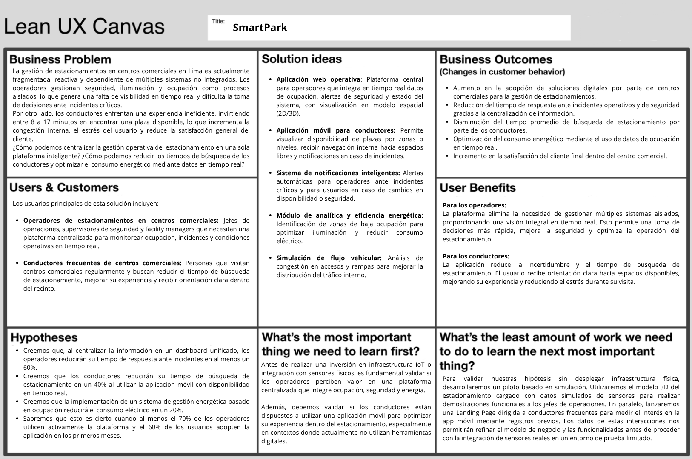

## 1.3. Segmentos objetivo

### Segmento 1: Operadores de estacionamientos en centros comerciales

_(Características demográficas, perfil profesional, información estadística de sustento con citas.)_

### Segmento 2: Conductores frecuentes de centros comerciales

_(Características demográficas, hábitos de consumo, información estadística de sustento con citas.)_

---

# Capítulo II: Requirements Elicitation & Analysis

## 2.1. Competidores

### 2.1.1. Análisis competitivo

<table border="1" cellspacing="0" cellpadding="6">
  <tr>
    <th colspan="5">
      <b>Objetivo del análisis:</b> Identificar el posicionamiento competitivo de SmartPark en el mercado de soluciones tecnológicas para la gestión de estacionamientos en centros comerciales, entendiendo las ventajas diferenciales y oportunidades de mejora frente a alternativas tradicionales y modernas.
    </th>
  </tr>
  <tr>
    <th></th>
    <th>SmartPark (Apex Twin) 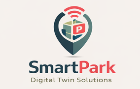</th>
    <th>ParkingSoft (Perú) </th>
    <th>Parkimovil (Latinoamérica) </th>
    <th>TIBA Parking Systems (Global) </th>
  </tr>
  <tr>
    <th colspan="5"><b>PERFIL</b></th>
  </tr>
  <tr>
    <td><b>Overview</b></td>
    <td>Plataforma SaaS con gemelo digital 3D en tiempo real que integra ocupación, seguridad contra incendios, flujo vehicular y eficiencia energética en una visualización unificada. Solución nativa de nube sobre Azure Digital Twins.</td>
    <td>Sistema tradicional de control de acceso y gestión de estacionamientos con hardware propietario (barreras, lectores de tickets y contadores). Su foco principal está en el control de entrada y salida.</td>
    <td>Solución mobile-first para conductores que muestra disponibilidad de plazas y permite reservas. Está orientada al usuario final y no al operador del centro comercial.</td>
    <td>Multinacional con hardware y software integrado para estacionamientos automatizados (LPR, guiado por luces LED y cámaras). Tiene presencia sólida en centros comerciales de alta gama, pero no incorpora gemelo digital ni analítica predictiva.</td>
  </tr>
  <tr>
    <td><b>Ventaja competitiva</b></td>
    <td>Especialización en gemelo digital, visualización espacial en tiempo real, enfoque dual operador-conductor y modelo SaaS de menor barrera de entrada.</td>
    <td>Robustez operativa, base instalada local y soporte presencial para proyectos tradicionales,integración con sistemas de facturación electrónica peruanos (Sunat).</td>
    <td>Experiencia centrada en el conductor, fuerte adopción móvil y reserva anticipada de plazas.</td>
    <td>Infraestructura madura, alta confiabilidad y reconocimiento de marca en el segmento premium.</td>
  </tr>
  <tr>
    <th colspan="5"><b>PERFIL DE MARKETING</b></th>
  </tr>
  <tr>
    <td><b>Mercado objetivo</b></td>
    <td>Centros comerciales de gran escala en Lima, con proyección a Perú, Colombia y Chile hacia 2029. Segmento primario: operadores; segmento secundario: conductores frecuentes.</td>
    <td>Centros comerciales medianos y grandes en Perú. Clientes actuales: Real Plaza, MegaPlaza, Mall Aventura. Foco exclusivo en operadores.</td>
    <td>Centros comerciales y estacionamientos públicos en México, Colombia y Chile. Foco casi exclusivo en conductores.</td>
    <td>Centros comerciales de lujo, aeropuertos y hospitales a nivel global. En Perú: Jockey Plaza, Larcomar. Segmento premium con alta inversión en hardware.</td>
  </tr>
  <tr>
    <td><b>Estrategias de marketing</b></td>
    <td>Marketing digital B2B, demostraciones del gemelo digital, alianzas con integradores IoT y participación en eventos de PropTech y Smart Buildings.</td>
    <td>Fuerza de ventas directa, presencia en ferias de seguridad y tecnología para retail, y relaciones de largo plazo con constructoras.</td>
    <td>Marketing B2C agresivo, alianzas con marcas de autos y estaciones de servicio, y fuerte presencia en tiendas de aplicaciones.</td>
    <td>Marketing B2B tradicional con demostración técnica, presencia internacional en ferias especializadas y red global de partners.</td>
  </tr>
  <tr>
    <th colspan="5"><b>PERFIL DE PRODUCTO</b></th>
  </tr>
  <tr>
    <td><b>Productos &amp; Servicios</b></td>
    <td><b>SmartPark Web (Operador):</b> gemelo digital 3D, mapa de ocupación en tiempo real, geolocalización de alertas de humo, mapa de calor de flujo vehicular y recomendaciones de eficiencia energética.<br><b>SmartPark App (Conductor):</b> consulta de plazas libres, registro de ubicación vía QR, monitoreo de costo acumulado y notificaciones push de seguridad.</td>
    <td><b>ParkingSoft Core:</b> control de acceso, contadores por nivel, reportes históricos y facturación electrónica.<br><b>ParkingSoft Lite:</b> versión reducida para estacionamientos pequeños sin integración de sensores.</td>
    <td><b>Parkimovil Driver:</b> mapa de disponibilidad, reserva de plazas, navegación interna e historial de estacionamientos.<br><b>Parkimovil Manager:</b> panel web simple con ocupación agregada por nivel.</td>
    <td><b>TIBA ParCS:</b> control de acceso con LPR, emisión de tickets e integración con guiado por luces LED.<br><b>TIBA Fleet:</b> módulo para flotas corporativas.<br><b>TIBA Analytics:</b> reportes históricos de ocupación sin tiempo real ni gemelo digital.</td>
  </tr>
  <tr>
    <td><b>Precios &amp; Costos</b></td>
    <td>Modelo SaaS por suscripción mensual por centro comercial:<br>- <b>Basic</b> (hasta 500 plazas): USD 499/mes<br>- <b>Professional</b> (hasta 1,500): USD 999/mes<br>- <b>Enterprise</b> (&gt;1,500): USD 1,999/mes<br>App conductores: freemium o USD 2.99/mes sin anuncios y con reservas prioritarias.</td>
    <td>Licenciamiento perpetuo más mantenimiento anual (15-20% del valor de licencia):<br>- <b>Pequeño</b> (hasta 300 plazas): USD 8,000 - 12,000<br>- <b>Mediano</b> (300-1,000): USD 15,000 - 25,000<br>- <b>Grande</b> (&gt;1,000): USD 30,000 - 50,000<br>Hardware adicional por acceso: USD 5,000 - 15,000.</td>
    <td>Modelo freemium para conductores. Ingresos por reservas pagadas, plan premium y panel manager para operadores.</td>
    <td>Licenciamiento perpetuo con hardware y software. Costos elevados por plaza monitoreada, mantenimiento anual y módulos de analítica adicionales.</td>
  </tr>
  <tr>
    <td><b>Canales de distribución</b></td>
    <td>Web (Angular) y móvil (PowerApps + Firebase) vía Microsoft AppSource y Google Play Store. Despliegue en Azure con opción on-premise controlada. Implementación remota asistida en 2-3 semanas.</td>
    <td>Software instalado en servidores locales del cliente, con hardware propietario. Implementación presencial en 4-8 semanas por integrador certificado.</td>
    <td>Móvil (iOS/Android) vía App Store y Google Play. Panel web accesible desde cualquier navegador. Implementación en 1 semana.</td>
    <td>Hardware y software integrado instalado por personal técnico o partners certificados. Implementación presencial en 8-16 semanas.</td>
  </tr>
  <tr>
    <th colspan="5"><b>Análisis SWOT</b></th>
  </tr>
  <tr>
    <td><b>Fortalezas</b></td>
    <td>- Único con gemelo digital 3D en tiempo real.<br>- Contexto espacial para alertas de humo.<br>- Modelo SaaS de bajo costo inicial.<br>- Proyección a eficiencia energética.<br>- Dos productos en uno.</td>
    <td>- Amplia base instalada en Perú.<br>- Relaciones consolidadas con constructoras.<br>- Soporte local presencial.<br>- Integración con facturación electrónica peruana.</td>
    <td>- Gran base de usuarios conductores.<br>- Modelo freemium efectivo.<br>- UI/UX pulida y gamificada.<br>- Reserva anticipada de plazas.</td>
    <td>- Liderazgo tecnológico global.<br>- Estabilidad y confiabilidad probada.<br>- Capacidad de manejar altos volúmenes.<br>- Marca reconocida a nivel mundial.</td>
  </tr>
  <tr>
    <td><b>Debilidades</b></td>
    <td>- Marca desconocida en el mercado peruano.<br>- Dependencia de sensores IoT simulados.<br>- Curva de aprendizaje para operadores.<br>- Sin integración con facturación electrónica.</td>
    <td>- Tecnología legacy.<br>- Sin visualización 3D ni gemelo digital.<br>- Alertas de seguridad sin contexto espacial.<br>- Alto costo inicial de licencia.</td>
    <td>- Sin solución avanzada para operadores.<br>- No integra sensores de humo ni eficiencia energética.<br>- Dependencia de la instalación de la app.<br>- Sin gemelo digital ni visualización espacial para el operador.</td>
    <td>- Costo de inversión inicial extremadamente alto.<br>- Dependencia de hardware propietario.<br>- Sin eficiencia energética ni recomendaciones de iluminación.<br>- Tiempos de implementación largos.</td>
  </tr>
  <tr>
    <td><b>Oportunidades</b></td>
    <td>- Crecimiento del mercado de centros comerciales en Perú.<br>- Alta demanda post-pandemia de digitalización.<br>- Posible integración con sistemas de facturación electrónica.<br>- Alianzas con integradores IoT locales.<br>- Expansión a otros verticales.</td>
    <td>- Migración de centros comerciales pequeños a la nube.<br>- Adopción de sensores IoT de bajo costo.<br>- Alianzas con startups tecnológicas.</td>
    <td>- Convertirse en plataforma B2B completa.<br>- Expansión a centros comerciales de primer nivel.<br>- Ofrecer módulo de eficiencia energética.</td>
    <td>- Desarrollar una versión SaaS más accesible.<br>- Integrar gemelo digital como servicio adicional.<br>- Expandirse a mercados de menor poder adquisitivo.</td>
  </tr>
  <tr>
    <td><b>Amenazas</b></td>
    <td>- Competidores tradicionales con relaciones consolidadas.<br>- Competidores B2C capturando la relación con el conductor.<br>- Entrada de grandes tecnológicas al mercado de gemelos digitales.<br>- Escepticismo de operadores sobre la propuesta.<br>- Ciclos de decisión largos.</td>
    <td>- SmartPark y soluciones SaaS nativas de nube.<br>- Parkimovil capturando la relación con el conductor.<br>- TIBA ofreciendo módulos de analítica más avanzados.<br>- Startups locales con gemelos digitales más económicos.</td>
    <td>- SmartPark ofreciendo funcionalidades de reserva similares.<br>- Centros comerciales desarrollando sus propias apps.<br>- Integración de reservas en sistemas tradicionales.<br>- Regulaciones de protección de datos.</td>
    <td>- SmartPark y startups con gemelos digitales a menor costo.<br>- Centros comerciales optando por sensores IoT genéricos + desarrollo propio.<br>- Crisis económica que reduzca inversiones.<br>- Competidores chinos con hardware más económico.</td>
  </tr>
</table>

### 2.1.2. Estrategias y tácticas frente a competidores

A continuación, se presentan las estrategias y tácticas preliminares que Apex Twin aplicará para enfrentar a los competidores identificados (ParkingSoft, Parkimovil y TIBA), aprovechando sus debilidades y las oportunidades del mercado, mientras se mitigan las amenazas externas.

**Estrategia 1: Diferenciación tecnológica basada en gemelo digital**

Objetivo: Posicionar a SmartPark como la única solución en el mercado peruano que integra un gemelo digital 3D en tiempo real con cuatro dimensiones operativas (ocupación, seguridad, flujo vehicular, eficiencia energética).

**Táctica**

- Demostraciones técnicas gratuitas: Ofrecer pilotos de 30 días sin costo para centros comerciales interesados, donde se despliegue el gemelo digital con sensores simulados para que el operador experimente el valor antes de comprar.
- Video de caso de uso comparativo: Producir un video de 3 minutos que muestre lado a lado cómo se gestiona una alerta de humo en SmartPark (geolocalización exacta en 3D) vs. ParkingSoft (señal genérica sin contexto).
- Webinar "Gemelo digital vs. sistemas tradicionales": Realizar webinars mensuales dirigidos a facility managers, explicando las limitaciones de los sistemas legacy y cómo SmartPark resuelve problemas que ellos ya normalizaron (ej. tiempo de respuesta ante humo).
  
**Estrategia 2: Ataque al modelo de precios de competidores tradicionales**

Objetivo: Capitalizar la principal debilidad de ParkingSoft y TIBA (alto costo de inversión inicial) mediante un modelo SaaS de bajo riesgo y pago por uso.

**Táctica**

- Plan de migración desde legacy: Ofrecer un descuento del 50% en los primeros 6 meses para centros comercionales que provengan de ParkingSoft o TIBA, cubriendo parcialmente el costo de romper contratos de mantenimiento anual.
- Modelo "paga por plaza monitoreada": Flexibilizar aún más el pricing: permitir que centros comerciales paguen solo por las plazas que realmente monitorean (ej. USD 0.50 por plaza/día), sin compromiso de plan anual. Esto es imposible de replicar para TIBA por su modelo de hardware.

**Estrategia 3: Integración rápida de requerimientos locales**

Objetivo: Cerrar la brecha frente a ParkingSoft en integración con sistemas peruanos (facturación electrónica Sunat) y posicionarse como la solución "hecha para Perú".

**Táctica**

- Certificación como proveedor de software de gestión: Obtener certificaciones locales (ej. registro de software de la Sunat) que generen confianza en los operadores peruanos, quienes asocian "startup" con "poco confiable".
- Alianza con integradores locales: Firmar acuerdos con empresas peruanas de instalación de sensores IoT (ej. Soltec Peru, DataCom) para ofrecer un paquete completo: SmartPark + sensores reales + instalación certificada.

**Estrategia 4: Neutralización de Parkimovil en el segmento conductores**

Objetivo: Impedir que Parkimovil capte a los conductores como "propios", ofreciendo funcionalidades similares (reservas, navegación) pero integradas directamente con el operador del centro comercial.

**Táctica**

- Funcionalidad de reserva de plazas: Incorporar en la app del conductor (SmartPark App) la opción de reservar una plaza con pago anticipado, igual que Parkimovil, pero con la ventaja de que el operador ve la reserva en su gemelo digital en tiempo real.
- Notificaciones de seguridad como diferenciador: Destacar en la comunicación de la app que SmartPark es la única que alerta al conductor sobre humo en su zona específica (Parkimovil no tiene acceso a sensores de humo del estacionamiento).
- Programa de fidelización conjunto con el centro comercial: Ofrecer al centro comercial la posibilidad de lanzar "SmartPark Rewards": minutos gratis por cada visita, canjeables desde la app. Parkimovil no puede hacer esto porque no tiene relación contractual directa con el operador.

**Estrategia 5: Aprovechamiento de oportunidades de mercado**

Objetivo: Capitalizar el crecimiento del sector de centros comerciales en Perú y la tendencia post-pandemia de digitalización.

**Táctica**

- Landing page específica para cada nuevo proyecto: Crear páginas personalizadas como "SmartPark para Mall del Sur 2" o "SmartPark para el nuevo Real Plaza de Chorrillos", demostrando cómo el gemelo digital resuelve problemas específicos de esa zona.
- Paquete "Digitalización post-pandemia": Ofrecer un descuento del 30% por 12 meses para centros comerciales que aún operan con sistemas manuales o legacy, posicionando a SmartPark como la solución de "transformación digital rápida".

## 2.2. Entrevistas

### 2.2.1. Diseño de entrevistas

#### Preguntas para Segmento 1: Operadores de estacionamientos en centros comerciales

**Preguntas demográficas y de contexto**
1. ¿Cuál es su nombre, edad y cargo?
2. ¿Cuál es su cargo actual y cuánto tiempo lleva trabajando en la gestión de estacionamientos?
3. ¿Cuántas plazas de estacionamiento tiene aproximadamente el centro comercial donde trabaja?
4. Descríbame un día típico de trabajo. ¿Cuáles son sus responsabilidades principales?
5. ¿Qué herramientas o sistemas tecnológicos utiliza actualmente para gestionar el estacionamiento?

**Preguntas principales**
1. ¿Cómo monitorean actualmente el nivel de ocupación del estacionamiento?
2. ¿Con qué frecuencia se presentan errores o discrepancias en el conteo de vehículos? ¿Qué impacto tienen?
3. ¿Pueden saber en tiempo real cuáles son las zonas o niveles más ocupados y cuáles tienen mayor disponibilidad?
4. ¿Qué tan rápido pueden identificar si se ha alcanzado la capacidad máxima del estacionamiento?
5. ¿Qué tipo de incidentes de seguridad han enfrentado en el estacionamiento? (humo, accidentes, vandalismo, etc.)
6. Cuando reciben una alerta de seguridad, ¿cómo saben exactamente dónde está ocurriendo el incidente?
7. ¿Cuánto tiempo transcurre, en promedio, desde que reciben una alerta hasta que confirman visualmente la ubicación del problema?
8. ¿Cómo coordinan la evacuación o el cierre de zonas cuando hay un incidente de seguridad?
9. ¿En qué momentos del día o de la semana se presentan las mayores congestiones vehiculares dentro del estacionamiento?
10. ¿Tienen visibilidad sobre los cuellos de botella en rampas o accesos? ¿Cómo los detectan?
11. ¿Qué medidas toman cuando identifican una congestión interna?
12. ¿Cómo gestionan actualmente la iluminación del estacionamiento?
13. ¿Existe algún esquema de atenuación o apagado de luces en zonas desocupadas?
14. ¿Han medido el consumo energético del estacionamiento? ¿Qué porcentaje representa del consumo total del centro comercial?

**Preguntas complementarias**
1. ¿Cuál es el mayor dolor de cabeza que enfrenta en su trabajo diario relacionado con la gestión del estacionamiento?
2. Si pudiera tener una herramienta ideal para gestionar el estacionamiento, ¿qué funcionalidad no podría faltar?
3. ¿Qué información le gustaría poder consultar en tiempo real que hoy no tiene disponible?
4. ¿Considera que las herramientas actuales le permiten tomar decisiones proactivas o solo reaccionar ante problemas ya manifiestos?
5. ¿Qué tan abierto estaría a implementar una nueva plataforma tecnológica si esta le brindara visibilidad integral del estacionamiento?
6. ¿Cuáles serían sus principales preocupaciones al evaluar una solución de este tipo? (costo, complejidad, integración, capacitación, etc.)
7. ¿Preferiría una solución que requiera inversión en sensores desde el inicio, o una que permita empezar con datos simulados para evaluar el valor antes de invertir en hardware?

#### Preguntas para Segmento 2: Conductores frecuentes de centros comerciales

**Preguntas demográficas y de contexto**
1. ¿Cuál es su nombre, edad, distrito de residencia y ocupación?
2. ¿Con qué frecuencia visita centros comerciales en su vehículo propio?
3. ¿Cuáles son los centros comerciales que frecuenta habitualmente?
4. ¿En qué días y horarios suele visitarlos?
5. ¿Cuánto tiempo permanece en el centro comercial en una visita típica?
6. ¿Qué actividades realiza principalmente? (compras, gastronomía, entretenimiento, servicios, etc.)

**Preguntas principales**
1. Cuénteme sobre su experiencia la última vez que fue a estacionar en un centro comercial. ¿Cómo fue el proceso de encontrar una plaza?
2. ¿Cuánto tiempo le toma habitualmente encontrar una plaza libre cuando llega al estacionamiento?
3. ¿Ese tiempo varía según el día u horario? ¿En qué momentos es más difícil encontrar espacio?
4. ¿Qué estrategia sigue para buscar estacionamiento? (¿va directo a un nivel específico, recorre todos los niveles, sigue señalización, etc.?)
5. ¿Alguna vez ha considerado no visitar un centro comercial o cambiar de destino por dificultades para estacionar?
6. ¿Cómo recuerda dónde dejó su vehículo cuando regresa de sus compras?
7. ¿Alguna vez ha tenido dificultad para encontrar su vehículo al regresar? ¿Qué hizo?
8. ¿Toma alguna fotografía, nota mental o utiliza alguna app para recordar la ubicación?
9. ¿Cómo se entera del costo total de su estadía en el estacionamiento?
10. ¿Le gustaría poder consultar el costo acumulado en tiempo real mientras está en el centro comercial?
11. ¿Qué tan importante es para usted conocer las tarifas antes de ingresar al estacionamiento?
12. ¿Alguna vez ha presenciado o ha sido informado de un incidente de seguridad (humo, alarma, accidente) mientras estaba en el estacionamiento?
13. En caso de un incidente de seguridad, ¿cómo le gustaría ser notificado? (altavoces, mensaje en su celular, señalización digital, etc.)
14. ¿Qué tan importante es para usted recibir información sobre la seguridad de la zona donde dejó su vehículo?

**Preguntas complementarias**
1. ¿Utiliza aplicaciones móviles en su día a día? ¿Cuáles son las que más usa? (Waze, Yape, Rappi, etc.)
2. ¿Estaría dispuesto a descargar una app que le ayude a encontrar estacionamiento disponible y a localizar su vehículo?
3. ¿Qué características debería tener esa app para que la use regularmente?
4. ¿Qué tan importante es que la app sea rápida y simple de usar?
5. ¿Cuál es el aspecto más frustrante de su experiencia de estacionamiento en centros comerciales?
6. Si pudiera mejorar algo sobre la forma en que funcionan los estacionamientos de centros comerciales, ¿qué sería?
7. ¿Qué haría que su experiencia de estacionamiento pasara de frustrante a satisfactoria?
8. Si existiera una app gratuita que le mostrara en tiempo real dónde hay espacios disponibles, ¿la usaría?
9. ¿Estaría dispuesto a registrar su ubicación de estacionamiento con un botón en la app para poder encontrar su vehículo después?
10. ¿Qué tan valioso sería para usted recibir alertas de seguridad en su celular si hay un incidente cerca de donde está su vehículo?

### 2.2.2. Registro de entrevistas

#### Segmento 1: Operadores de estacionamientos en centros comerciales

**Entrevista 1**

<table>
  <tr>
    <td><strong>Entrevista</strong></td>
    <td>[N° de entrevista]</td>
    <td><strong>Nombre</strong></td>
    <td>[Nombre completo]</td>
  </tr>
  <tr>
    <td><strong>Edad</strong></td>
    <td>[Edad]</td>
    <td><strong>Distrito</strong></td>
    <td>[Distrito]</td>
  </tr>
  <tr>
    <td><strong>Captura de la entrevista:</strong><br><br></td>
    <td colspan="3">[Resumen de la entrevista]</td>
  </tr>
  <tr>
    <td><strong>URL de la grabación</strong></td>
    <td colspan="3"><a href="[URL-de-la-grabación]">Ver grabación</a></td>
  </tr>
  <tr>
    <td><strong>Timing</strong></td>
    <td colspan="3">[mm:ss]</td>
  </tr>
  <tr>
    <td><strong>Entrevistador(a)</strong></td>
    <td colspan="3">[Entrevistador(a)]</td>
  </tr>
</table>

**Entrevista 2 — Operador**  
_(Misma estructura)_

**Entrevista 3 — Operador**  
<table>
  <tr>
    <td><strong>Entrevista</strong></td>
    <td>3</td>
    <td><strong>Nombre</strong></td>
    <td>Juan Alarcon Ramirez</td>
  </tr>
  <tr>
    <td><strong>Edad</strong></td>
    <td>25</td>
    <td><strong>Distrito</strong></td>
    <td>Wanchaq, Cusco</td>
  </tr>
  <tr>
    <td><strong>Captura de la entrevista:</strong><br><br></td>
    <td colspan="3">Juan es técnico de operaciones con tres años de experiencia, gestiona un estacionamiento de entre 30 y 50 plazas donde se encarga del mantenimiento de maquinaria y la fluidez del tráfico. A pesar de contar con cámaras de vigilancia, barreras y sensores, Juan identifica limitaciones tecnológicas, como errores en el conteo de vehículos que generan molestias en los usuarios y la falta de visibilidad en tiempo real sobre la ocupación específica de cada pasillo. Ante incidentes de seguridad o congestiones en rampas que suelen ocurrir en fines de semana y feriados, el equipo depende del monitoreo manual por CCTV y la intervención directa de personal con señales manuales. Finalmente, destaca una gestión energética ineficiente, ya que la iluminación opera bajo horarios fijos sin sistemas de ahorro para zonas desocupadas, lo que resulta en un consumo elevado de electricidad.</td>
  </tr>
  <tr>
    <td><strong>URL de la grabación</strong></td>
    <td colspan="3"><a href="https://upcedupe-my.sharepoint.com/:v:/g/personal/u20211g671_upc_edu_pe/IQAMlLdlmF2pT75rc_E783gEAZ1O58GkQJQbV1O8t3DN02U?e=f1yiAz&nav=eyJyZWZlcnJhbEluZm8iOnsicmVmZXJyYWxBcHAiOiJTdHJlYW1XZWJBcHAiLCJyZWZlcnJhbFZpZXciOiJTaGFyZURpYWxvZy1MaW5rIiwicmVmZXJyYWxBcHBQbGF0Zm9ybSI6IldlYiIsInJlZmVycmFsTW9kZSI6InZpZXcifX0%3D">Ver grabación</a></td>
  </tr>
  <tr>
    <td><strong>Timing</strong></td>
    <td colspan="3">4 minutos con 40 segundos</td>
  </tr>
  <tr>
    <td><strong>Entrevistador</strong></td>
    <td colspan="3">Britney Qqueso Rodriguez</td>
  </tr>
</table>

#### Segmento 2: Conductores frecuentes de centros comerciales

**Entrevista 1 — Conductor**  
_(Misma estructura)_

**Entrevista 2 — Conductor**

<table>
  <tr>
    <td><strong>Entrevista</strong></td>
    <td>2</td>
    <td><strong>Nombre</strong></td>
    <td>Luis Chinchihualpa Saldarriaga</td>
  </tr>
  <tr>
    <td><strong>Edad</strong></td>
    <td>25</td>
    <td><strong>Distrito</strong></td>
    <td>La Molina</td>
  </tr>
  <tr>
    <td><strong>Captura de la entrevista:</strong><br><br></td>
    <td colspan="3">Luis es un conductor frecuente de centros comerciales, a los que asiste todos los fines de semana debido a que durante la semana está ocupado con sus estudios universitarios y trabajo; suele ir en horarios de almuerzo o entre las 5 y 6 de la tarde, generalmente acompañado, con el objetivo de comer, ir al cine o realizar compras en lugares como el Mall de Puruchuco, el nuevo mall del Parque La Molina y el Jockey Plaza. Siempre utiliza su auto porque lo considera más seguro, pero enfrenta múltiples dificultades al estacionar: desconoce el precio hasta después de ingresar, encuentra pocos espacios disponibles y desconfía de los indicadores de luz, ya que no reflejan correctamente la disponibilidad; además, el proceso de búsqueda le toma entre 15 y 30 minutos, especialmente en tardes de fin de semana, donde el tráfico es alto. Su comportamiento consiste en dar vueltas sin una estrategia definida hasta encontrar un lugar, lo cual le genera frustración y estrés por la pérdida de tiempo y el costo. En cuanto a seguridad, la considera vital, ya que ha sufrido rayones y abolladuras en su vehículo, incluso un caso donde encontró ambas puertas dañadas, y también ha tenido dificultades para recordar la ubicación de su auto dentro del estacionamiento. A nivel tecnológico, está familiarizado con el uso de aplicaciones debido a su formación en ingeniería de software, aunque actualmente solo usa Google Maps, el cual no le resulta útil para este contexto; muestra interés en funcionalidades como visualización del costo acumulado, alertas de seguridad, mapas interactivos con disponibilidad de espacios y registro de ubicación del vehículo. Finalmente, identifica como principales problemas la falta de seguridad, la poca transparencia en los costos y la escasez de espacios, y considera ideal una solución que integre todas estas funcionalidades para mejorar su experiencia.</td>
  </tr>
  <tr>
    <td><strong>URL de la grabación</strong></td>
    <td colspan="3"><a href="https://upcedupe-my.sharepoint.com/:v:/g/personal/u202210297_upc_edu_pe/IQBwF8-wNd6GT4icNCBDmTLBAZoUCIvODFg4ZUDDZFs4shQ?nav=eyJyZWZlcnJhbEluZm8iOnsicmVmZXJyYWxBcHAiOiJTdHJlYW1XZWJBcHAiLCJyZWZlcnJhbFZpZXciOiJTaGFyZURpYWxvZy1MaW5rIiwicmVmZXJyYWxBcHBQbGF0Zm9ybSI6IldlYiIsInJlZmVycmFsTW9kZSI6InZpZXcifX0%3D&e=klWNvR">Ver grabación</a></td>
  </tr>
  <tr>
    <td><strong>Timing</strong></td>
    <td colspan="3">16 minutos con 46 segundos</td>
  </tr>
  <tr>
    <td><strong>Entrevistador</strong></td>
    <td colspan="3">Abel Andrés Valle Zuta</td>
  </tr>
</table>


**Entrevista 3 — Conductor**  

<table>
  <tr>
    <td><strong>Entrevista</strong></td>
    <td>3</td>
    <td><strong>Nombre</strong></td>
    <td>Edward Rodriguez</td>
  </tr>
  <tr>
    <td><strong>Edad</strong></td>
    <td>28</td>
    <td><strong>Distrito</strong></td>
    <td>Yanahuara, Arequipa</td>
  </tr>
  <tr>
    <td><strong>Captura de la entrevista:</strong><br><br></td>
    <td colspan="3">Edward Rodríguez Alarcón, un ingeniero de 28 años residente en Yanahuara, describe su experiencia de estacionamiento en centros comerciales como un proceso frustrante y congestionado, especialmente en horas pico, lo que a menudo la lleva a optar por servicios de delivery para evitar el estrés de buscar una plaza. Para gestionar la ubicación de su vehículo y evitar confusiones previas que le han tomado hasta 20 minutos resolver, utiliza una combinación de memoria visual, fotografías y Google Maps. Finalmente, Edward destaca la necesidad de soluciones tecnológicas que le permitan consultar el costo acumulado en tiempo real y recibir notificaciones directas al celular ante cualquier incidente de seguridad, priorizando la vigilancia y la información inmediata para su tranquilidad.</td>
  </tr>
  <tr>
    <td><strong>URL de la grabación</strong></td>
    <td colspan="3"><a href="https://upcedupe-my.sharepoint.com/:v:/g/personal/u20211g671_upc_edu_pe/IQDN3psHgYEbSJJE8h4T0B3HASpKNaqWqCPhXezHu2zqDPo?e=ky3NJO&nav=eyJyZWZlcnJhbEluZm8iOnsicmVmZXJyYWxBcHAiOiJTdHJlYW1XZWJBcHAiLCJyZWZlcnJhbFZpZXciOiJTaGFyZURpYWxvZy1MaW5rIiwicmVmZXJyYWxBcHBQbGF0Zm9ybSI6IldlYiIsInJlZmVycmFsTW9kZSI6InZpZXcifX0%3D">Ver grabación</a></td>
  </tr>
  <tr>
    <td><strong>Timing</strong></td>
    <td colspan="3">5 minutos con 55 segundos</td>
  </tr>
  <tr>
    <td><strong>Entrevistador</strong></td>
    <td colspan="3">Britney Qqueso Rodriguez</td>
  </tr>
</table>

### 2.2.3. Análisis de entrevistas

#### Segmento 1: Operadores de estacionamientos en centros comerciales

_(Análisis con sustento estadístico — porcentajes — de las características objetivas y subjetivas más comunes encontradas. Cada característica debe tener relación clara con las entrevistas registradas.)_

| Característica | % | Sustento (entrevistas) |
|---|---|---|
| _(Edad promedio entre 35-50 años)_ | _(80%)_ | _(E1, E2, E4)_ |
| _(Usa Excel para registro manual)_ | _(60%)_ | _(E1, E3, E5)_ |

#### Segmento 2: Conductores frecuentes de centros comerciales

_(Mismo formato de análisis para el segmento de conductores.)_

## 2.3. Needfinding

### 2.3.1. User Personas

Los User Personas son perfiles representativos que sintetizan las características, motivaciones y frustraciones de los usuarios finales. A partir de los segmentos identificados en los Problem Statements, se construyeron dos personas, un operador de estacionamiento y una conductora frecuente, que humanizan los datos recogidos y sirven como referencia transversal para guiar las decisiones de diseño a lo largo del proyecto.

#### User Persona 1: Operador de Estacionamiento

<div align="center">
  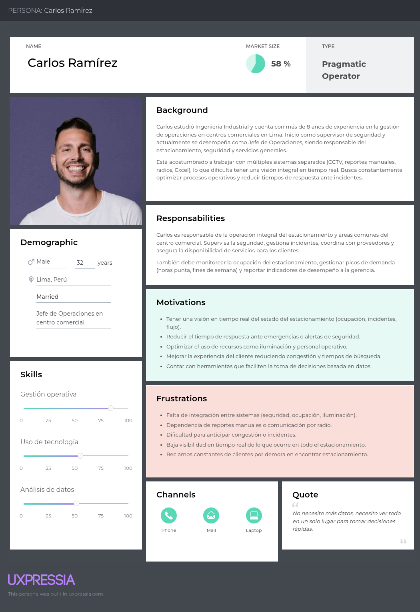
  <p><i>Figura: User Persona - Operador</i></p>
</div>

#### User Persona 2: Conductor Frecuente

<div align="center">
  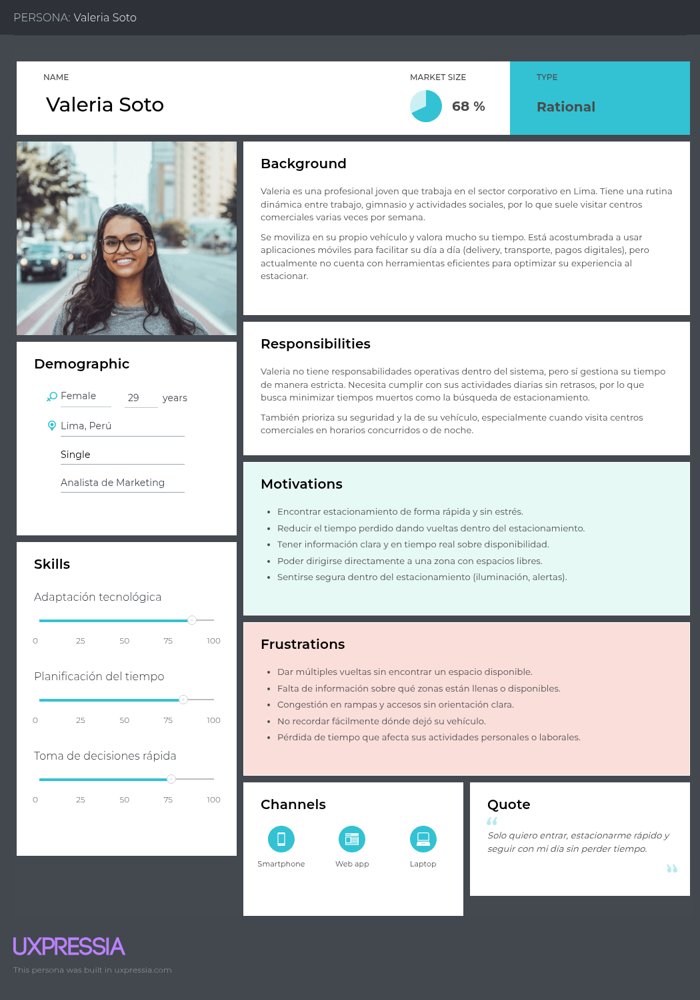
  <p><i>Figura: User Persona - Conductor</i></p>
</div>

### 2.3.2. User Task Matrix
La User Task Matrix es una herramienta comparativa que mapea las tareas que realiza cada tipo de usuario dentro del sistema, junto con su frecuencia e importancia. Este ejercicio permite identificar tareas compartidas, tareas exclusivas y actividades críticas de cada segmento, facilitando la priorización de funcionalidades y el diseño diferenciado de interfaces para el operador y el conductor.

| **Tarea**                                                         | **Operador (S1) Frecuencia** | **Operador (S1) Importancia** | **Conductor (S2) Frecuencia** | **Conductor (S2) Importancia** |
| ----------------------------------------------------------------- | ---------------------------- | ----------------------------- | ----------------------------- | ------------------------------ |
| Monitorear la ocupación del estacionamiento en tiempo real        | Alta                         | Alta                          | Baja                          | Media                          |
| Identificar zonas disponibles para estacionamiento                | Alta                         | Alta                          | Alta                          | Alta                           |
| Detectar incidentes (seguridad, congestión, fallas)               | Alta                         | Alta                          | Baja                          | Alta                           |
| Gestionar alertas y coordinar respuesta operativa                 | Alta                         | Alta                          | Baja                          | Media                          |
| Visualizar el flujo vehicular en accesos y rampas                 | Alta                         | Alta                          | Media                         | Media                          |
| Optimizar la distribución de vehículos dentro del estacionamiento | Media                        | Alta                          | Baja                          | Baja                           |
| Consultar disponibilidad antes de ingresar al estacionamiento     | Baja                         | Media                         | Alta                          | Alta                           |
| Navegar hacia una zona con espacios disponibles                   | Baja                         | Media                         | Alta                          | Alta                           |
| Buscar un espacio libre dentro del estacionamiento                | Baja                         | Media                         | Alta                          | Alta                           |
| Recordar la ubicación del vehículo estacionado                    | Baja                         | Baja                          | Alta                          | Media                          |
| Recibir notificaciones sobre disponibilidad o incidentes          | Media                        | Alta                          | Media                         | Alta                           |
| Supervisar indicadores operativos (KPIs)                          | Media                        | Alta                          | Baja                          | Baja                           |
| Optimizar consumo energético basado en ocupación                  | Media                        | Alta                          | Baja                          | Baja                           |
| Analizar patrones históricos de uso del estacionamiento           | Baja                         | Media                         | Baja                          | Baja                           |
| Reducir congestión en horas punta                                 | Media                        | Alta                          | Media                         | Alta                           |
| Tomar decisiones operativas basadas en datos en tiempo real       | Alta                         | Alta                          | Baja                          | Baja                           |


El análisis comparativo de las tareas identificadas revela patrones claros sobre cómo cada segmento interactúa con la plataforma y dónde se concentra el valor del producto.

**Tareas de alta frecuencia e importancia:** En el caso de Carlos Ramírez, las tareas críticas se concentran en el monitoreo continuo de ocupación, la supervisión de alertas de seguridad y la coordinación con el personal de campo, actividades que ejecuta durante toda su jornada laboral y que son determinantes para la operación del estacionamiento. En el caso de Valeria Soto, las tareas de mayor relevancia son la consulta de disponibilidad antes de ingresar, el registro de la ubicación del vehículo y la localización del mismo al regresar; si bien son de corta duración, se repiten en cada visita al centro comercial y definen directamente la calidad de su experiencia.

**Diferencias entre User Personas:** Las diferencias más notables radican en el perfil de uso y la profundidad funcional que cada segmento requiere. Carlos necesita una plataforma robusta de monitoreo continuo, con capacidades analíticas, generación de reportes y visualización espacial en 3D desde una estación de trabajo. Valeria, en cambio, requiere una aplicación móvil ligera, con interacciones breves y de alto impacto, priorizando rapidez, claridad visual y notificaciones oportunas. Mientras Carlos opera en un contexto profesional y técnico, Valeria lo hace en un contexto cotidiano donde el producto debe integrarse con la misma fluidez que otras apps de uso diario.

**Coincidencias entre User Personas:** A pesar de las diferencias, ambos segmentos convergen en la necesidad de información en tiempo real y en la importancia de las alertas de seguridad contextualizadas espacialmente. Tanto el operador como la conductora se benefician de un sistema que ofrezca visibilidad inmediata sobre el estado del estacionamiento, aunque cada uno consuma esta información con un nivel de detalle distinto. Esta coincidencia confirma que el gemelo digital funciona como una única fuente de verdad que alimenta dos experiencias diferenciadas pero complementarias, maximizando el valor de la inversión tecnológica subyacente.

### 2.3.3. Empathy Mapping

El Empathy Mapping es una técnica que busca comprender al usuario desde sus dimensiones emocionales, cognitivas y sociales, explorando lo que piensa, siente, ve, escucha, dice y hace, así como sus dolores y ganancias. Se elaboró un mapa para cada segmento, lo que permitió revelar tensiones y motivaciones menos visibles que sirven de base para diseñar una propuesta de valor que conecte genuinamente con las necesidades humanas de los usuarios.

#### Empathy Map: Operador

<div align="center">
  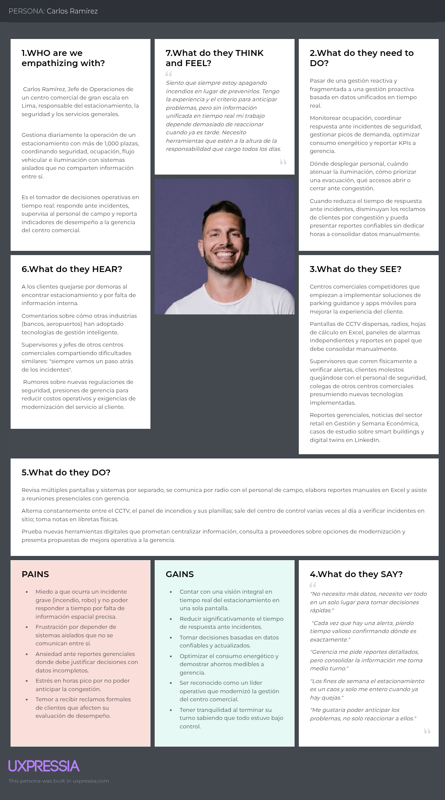
  <p><i>Figura: Empathy Map - Operador</i></p>
</div>

#### Empathy Map: Conductor

<div align="center">
  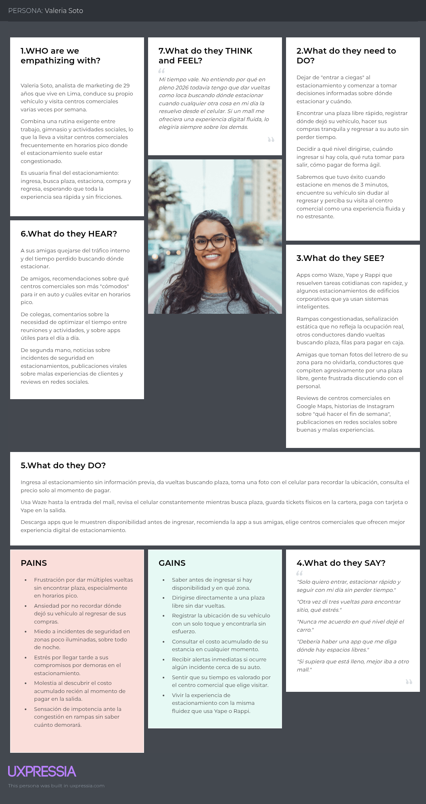
  <p><i>Figura: Empathy Map - Conductor</i></p>
</div>


### 2.3.4. As-is Scenario Mapping

El As-Is Scenario Mapping documenta la experiencia actual del usuario, desglosando su recorrido en fases y registrando qué hace, qué piensa y qué siente en cada una. Se construyeron dos escenarios, el del operador en una jornada típica y el de la conductora en una visita habitual, lo que permite visualizar los puntos de fricción actuales y justificar la necesidad de la solución propuesta.

#### As-Is Scenario Map: Operador

<div align="center">
  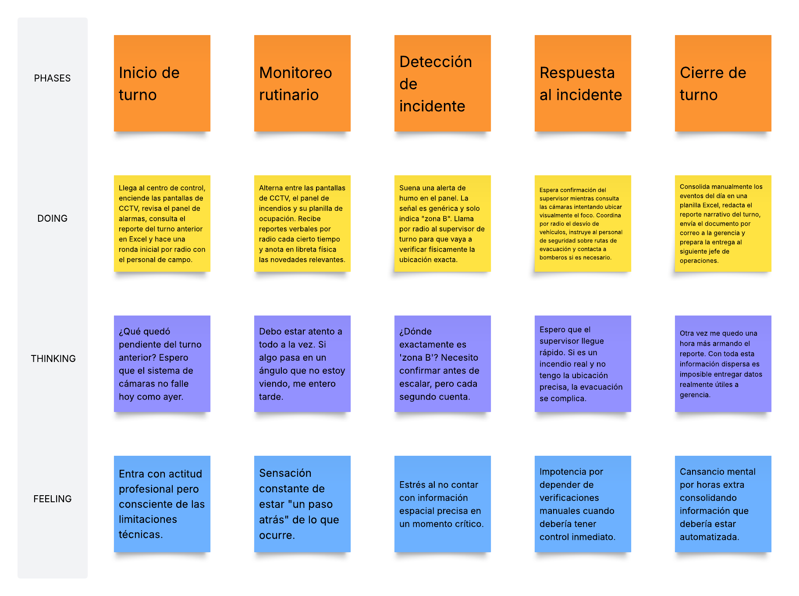
  <p><i>Figura: As-Is Process Diagram - Operador</i></p>
</div>

#### As-Is Scenario Map: Conductor

<div align="center">
  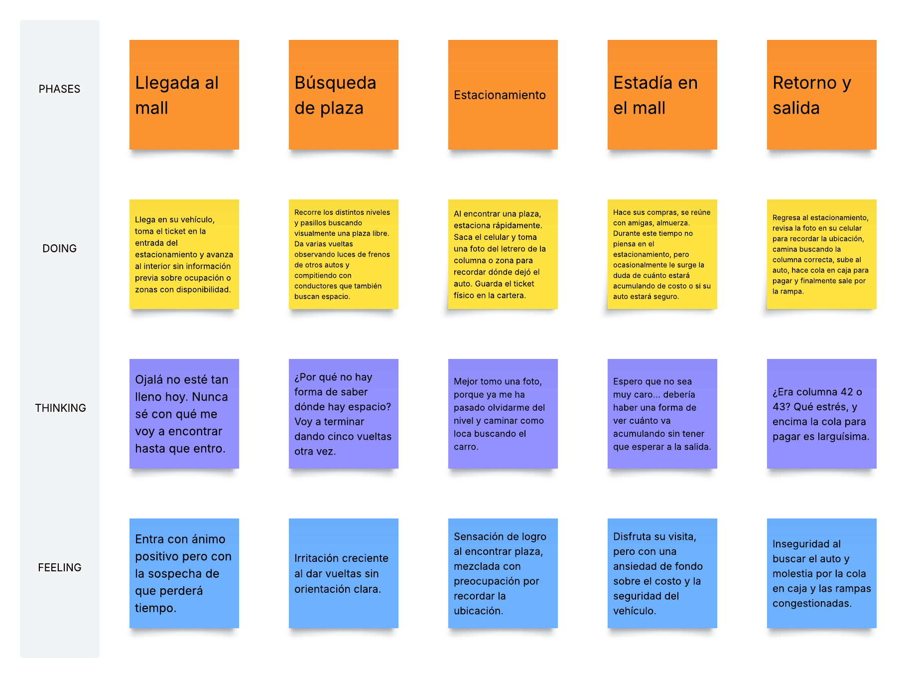
  <p><i>Figura: As-Is Process Diagram - Conductor</i></p>
</div>

## 2.4. Ubiquitous Language

_(Glosario de términos del business domain en inglés, sin ambigüedad. NO incluir términos técnicos de ingeniería de software.)_

| Term (English) | Término (Español) | Definición |
|---|---|---|
| **Parking Space** | Plaza de estacionamiento | Unidad individual designada para el estacionamiento de un vehículo, identificada por código único dentro de una zona y nivel. |
| **Parking Level** | Nivel de estacionamiento | División vertical del estacionamiento (sótano 1, sótano 2, primer piso, etc.) que agrupa zonas y plazas. |
| **Parking Zone** | Zona de estacionamiento | Subdivisión de un nivel agrupando plazas con características comunes (preferencial, discapacitados, mujeres, general). |
| **Occupancy State** | Estado de ocupación | Estado actual de una plaza: Free, Occupied, Reserved, OutOfService. |
| **Smoke Detector** | Detector de humo | Sensor IoT que monitorea presencia de humo en una zona específica. |
| **Smoke Alert** | Alerta de humo | Evento generado cuando un detector excede su umbral, con localización espacial. |
| **Evacuation Route** | Ruta de evacuación | Trayecto designado para evacuación segura, asociado a salidas de emergencia. |
| **Traffic Flow Counter** | Contador de flujo vehicular | Sensor que registra el paso de vehículos en accesos y rampas. |
| **Access Point** | Punto de acceso | Entrada o salida vehicular del estacionamiento. |
| **Ramp** | Rampa | Conexión inclinada entre niveles del estacionamiento. |
| **Luminosity Level** | Nivel de luminosidad | Intensidad lumínica medida en una zona, expresada en lux. |
| **Lighting Zone** | Zona de iluminación | Conjunto de luminarias controlables como unidad para gestión energética. |
| **Parking Session** | Sesión de estacionamiento | Período entre el ingreso y salida de un vehículo, asociado a un conductor y una plaza. |
| **Vehicle Location** | Ubicación de vehículo | Posición registrada (nivel, zona, plaza) donde un conductor estacionó. |
| **Fare Rate** | Tarifa | Costo por unidad de tiempo aplicado a una sesión de estacionamiento. |
| **Operator** | Operador | Personal del centro comercial responsable de la gestión del estacionamiento. |
| **Driver** | Conductor | Usuario final que utiliza el estacionamiento del centro comercial. |
| **Digital Twin** | Gemelo digital | Representación virtual sincronizada del estado físico del estacionamiento. |
| **Twin Model (DTDL)** | Modelo de gemelo | Definición de la estructura y propiedades de una entidad en el grafo de Azure Digital Twins. |
| **Telemetry** | Telemetría | Datos enviados por sensores (reales o simulados) hacia el gemelo digital. |
| **Incident** | Incidente | Evento anómalo que requiere atención del operador (humo, congestión, falla). |

---

# Capítulo III: Requirements Specification

## 3.1. To-Be Scenario Mapping

_(Resumen del proceso. Capturas de los To-Be Scenario Maps con identificación de cambios respecto al As-Is.)_

### To-Be Scenario Map: Operador


### To-Be Scenario Map: Conductor


## 3.2. User Stories

_(Introducción al conjunto de Epics y User Stories. Recordar incluir: User Stories del Landing Page con rol "Visitor", User Stories de aplicaciones por User Persona, y Technical Stories con rol "Developer" para servicios técnicos como APIs.)_

| Epic / Story ID | Título | Descripción | Criterios de Aceptación | Relacionado con (Epic ID) |
|---|---|---|---|---|
| EP-01 | Real-time Parking Occupancy Visualization | _(Como operador deseo visualizar el estado de ocupación en tiempo real para tomar decisiones operativas.)_ | _(N/A — agrupa US relacionadas)_ | — |
| US-01 | View 3D Parking Occupancy Map | Como operador deseo visualizar un mapa 3D del estacionamiento con el estado de ocupación de cada plaza para identificar visualmente los niveles de ocupación. | **Scenario 1: Visualization on dashboard load**<br>Given the operator is authenticated<br>When the operator navigates to the dashboard<br>Then the 3D map renders showing all parking spaces with color-coded occupancy state<br><br>**Scenario 2: Real-time update**<br>Given the 3D map is displayed<br>When a parking space changes its occupancy state<br>Then the 3D map updates the corresponding space color within 5 seconds | EP-01 |
| EP-02 | Smoke Incident Management | _(Como operador deseo gestionar alertas de humo con localización espacial.)_ | — | — |
| US-02 | Receive Smoke Alert with Spatial Context | Como operador deseo recibir alertas de humo con la ubicación exacta en el modelo 3D para responder inmediatamente. | **Scenario 1: Smoke detected**<br>Given a smoke detector exceeds its threshold<br>When the system processes the telemetry<br>Then an alert is displayed within 2 seconds highlighting the affected zone in red on the 3D model | EP-02 |
| EP-03 | Parking Session Management for Drivers | _(Como conductor deseo gestionar mi sesión de estacionamiento.)_ | — | — |
| US-03 | View Available Spaces by Zone | Como conductor deseo consultar la disponibilidad de espacios por zona o nivel para dirigirme al área con mayor disponibilidad. | **Scenario 1: View availability**<br>Given the driver is in the mobile app<br>When the driver opens the "Availability" view<br>Then the app displays the count of free spaces per zone and level updated within the last 30 seconds | EP-03 |
| US-04 | Register Vehicle Location | Como conductor deseo registrar la ubicación exacta donde estacioné mi vehículo para localizarlo fácilmente al regresar. | **Scenario 1: Registration**<br>Given the driver has parked<br>When the driver taps "Register location" and confirms the level and zone<br>Then the location is stored and associated with the driver's session | EP-03 |
| US-05 | Receive Safety Alerts Near Vehicle | Como conductor deseo recibir alertas de seguridad en la zona donde está mi vehículo con indicaciones de evacuación si fuera necesario. | **Scenario 1: Push notification on smoke alert**<br>Given the driver has an active session in zone Z<br>When a smoke alert is triggered in zone Z<br>Then the app receives a push notification with evacuation instructions within 5 seconds | EP-03 |
| EP-04 | Energy Management | _(Como operador deseo optimizar el consumo energético basado en ocupación.)_ | — | — |
| US-06 | Identify Low-Occupancy Zones for Lighting Adjustment | Como operador deseo identificar zonas sin vehículos donde la iluminación pueda atenuarse para reducir consumo energético. | **Scenario 1**<br>Given the dashboard is loaded<br>When the operator selects "Energy view"<br>Then zones with occupancy below 20% are highlighted with a recommendation to reduce lighting | EP-04 |
| EP-05 | Landing Page Communication | _(Como visitante deseo conocer la propuesta de valor.)_ | — | — |
| US-07 | View Landing Page as Mall Operator | Como visitante segmento operador deseo conocer cómo la plataforma resuelve la gestión de mi estacionamiento para evaluar contratarla. | **Scenario 1**<br>Given the visitor lands on the home page<br>When the visitor scrolls to the "For Mall Operators" section<br>Then a CTA button "Request a Demo" is visible and clickable | EP-05 |
| US-08 | View Landing Page as Driver | Como visitante segmento conductor deseo conocer los beneficios de la app móvil para decidir descargarla. | **Scenario 1**<br>Given the visitor lands on the home page<br>When the visitor scrolls to the "For Drivers" section<br>Then a CTA button "Download the App" links to the PowerApps installation page | EP-05 |
| EP-06 | Technical APIs for Digital Twin Integration | — | — | — |
| TS-01 | Twin State Update Endpoint | Como developer deseo exponer un endpoint que actualice el estado de un twin en Azure Digital Twins para que el simulador IoT pueda enviar telemetría. | **Scenario 1: Successful update**<br>Given a valid twin ID and JSON Patch payload<br>When the simulator sends PATCH /api/v1/twins/{id}<br>Then the system applies the patch and returns 204 No Content within 500ms<br><br>**Scenario 2: Invalid twin ID**<br>Given an unknown twin ID<br>When the simulator sends PATCH /api/v1/twins/{id}<br>Then the system returns 404 Not Found | EP-06 |
| TS-02 | Occupancy Query Endpoint | Como developer deseo exponer un endpoint que consulte ocupación agregada por zona/nivel para alimentar las apps. | **Scenario 1**<br>Given the operator is authenticated<br>When GET /api/v1/occupancy?level={n} is called<br>Then the response returns aggregated occupancy data with HTTP 200 | EP-06 |
| TS-03 | Push Notification Trigger | Como developer deseo integrar Firebase Cloud Messaging para enviar push notifications a la app PowerApps cuando se generen alertas. | **Scenario 1**<br>Given a smoke alert is generated in zone Z<br>When the notifications service identifies drivers with active sessions in Z<br>Then FCM messages are dispatched to all corresponding device tokens | EP-06 |

_(Continuar con el resto de User Stories y Technical Stories.)_

## 3.3. Impact Mapping

_(Resumen del proceso de elaboración. Capturas del Impact Map en UXPressia.)_


**Business Goals (SMART):**
         
- **BG-01:** Alcanzar 5 contratos con centros comerciales de Lima Metropolitana en un lapso de 12 meses tras el lanzamiento.
- **BG-02:** Lograr 10,000 descargas activas de la aplicación móvil del conductor en un lapso de 8 meses.
- **BG-03:** Reducir en 30% el tiempo promedio de búsqueda de plaza para conductores en estacionamientos contratantes en un lapso de 6 meses.
- **BG-04:** _(...)_

## 3.4. Product Backlog

**URL del Product Backlog en herramienta:** `https://www.pivotaltracker.com/...` _(o Trello / Jira / YouTrack)_

_(Captura del Product Backlog en la herramienta seleccionada.)_


| # Orden | User Story Id | Título | Descripción | Story Points (1/2/3/5/8) |
|---|---|---|---|---|
| 1 | US-07 | View Landing Page as Mall Operator | Como visitante segmento operador deseo conocer cómo la plataforma resuelve la gestión de mi estacionamiento... | 3 |
| 2 | US-08 | View Landing Page as Driver | Como visitante segmento conductor deseo conocer los beneficios de la app móvil... | 3 |
| 3 | US-01 | View 3D Parking Occupancy Map | Como operador deseo visualizar un mapa 3D del estacionamiento... | 8 |
| 4 | US-03 | View Available Spaces by Zone | Como conductor deseo consultar la disponibilidad de espacios por zona... | 5 |
| 5 | US-04 | Register Vehicle Location | Como conductor deseo registrar la ubicación exacta... | 3 |
| 6 | TS-01 | Twin State Update Endpoint | Como developer deseo exponer un endpoint que actualice el estado de un twin... | 5 |
| 7 | TS-02 | Occupancy Query Endpoint | Como developer deseo exponer un endpoint que consulte ocupación... | 3 |
| 8 | US-02 | Receive Smoke Alert with Spatial Context | Como operador deseo recibir alertas de humo con la ubicación exacta... | 5 |
| 9 | US-05 | Receive Safety Alerts Near Vehicle | Como conductor deseo recibir alertas de seguridad en la zona donde está mi vehículo... | 5 |
| 10 | TS-03 | Push Notification Trigger | Como developer deseo integrar Firebase Cloud Messaging... | 5 |
| 11 | US-06 | Identify Low-Occupancy Zones for Lighting Adjustment | Como operador deseo identificar zonas sin vehículos donde la iluminación pueda atenuarse... | 3 |
| ... | ... | ... | ... | ... |

---

# Capítulo IV: Strategic-Level Software Design

## 4.1. Strategic-Level Attribute-Driven Design

### 4.1.1. Design Purpose

_(Explicación del propósito del proceso de diseño, evidenciando relación con la problemática y orientación a satisfacer las necesidades de los segmentos objetivo y el negocio.)_

El propósito del diseño arquitectónico de la plataforma es habilitar una solución que combine visibilidad operativa unificada para el operador del centro comercial con experiencias móviles ágiles para el conductor, sustentada por un gemelo digital como single source of truth del estado del estacionamiento. Las decisiones arquitectónicas buscan satisfacer simultáneamente requisitos de baja latencia para alertas de seguridad, alta modificabilidad para incorporar nuevos tipos de sensores en el futuro, y costo operativo controlado consistente con un modelo SaaS dirigido a centros comerciales medianos.

### 4.1.2. Attribute-Driven Design Inputs

#### 4.1.2.1. Primary Functionality

_(Resumen de los requisitos funcionales seleccionados como Primary, por su impacto en la arquitectura.)_

| Epic / User Story ID | Título | Descripción | Criterios de Aceptación | Relacionado con (Epic ID) |
|---|---|---|---|---|
| US-01 | View 3D Parking Occupancy Map | _(...)_ | _(...)_ | EP-01 |
| US-02 | Receive Smoke Alert with Spatial Context | _(...)_ | _(...)_ | EP-02 |
| US-05 | Receive Safety Alerts Near Vehicle | _(...)_ | _(...)_ | EP-03 |
| TS-01 | Twin State Update Endpoint | _(...)_ | _(...)_ | EP-06 |
| TS-03 | Push Notification Trigger | _(...)_ | _(...)_ | EP-06 |

#### 4.1.2.2. Quality Attribute Scenarios

| Atributo | Fuente | Estímulo | Artefacto | Entorno | Respuesta | Medida |
|---|---|---|---|---|---|---|
| Performance (Latency) | Smoke detector sensor | Smoke detection event | Notifications service & Operator dashboard | Normal operation | System processes telemetry, updates twin and propagates alert | Alert visible in dashboard within 2 seconds; push notification delivered within 5 seconds |
| Availability | Mall operator | Dashboard query during business hours | Web Application + Web Services | Production environment | Dashboard returns occupancy data | 99.5% monthly uptime during operating hours (8am-11pm) |
| Scalability | IoT Simulator | 500 sensors emitting at 1 update/second | Web Services + Azure Digital Twins | Peak hours (mall full) | System processes all updates without data loss | Sustained throughput ≥ 500 msg/s with end-to-end latency < 500ms |
| Modifiability | Product Owner | Request to add a new sensor type (e.g., air quality) | Twin Models (DTDL) + Simulator + Web Services | Development environment | Team integrates new sensor type | Integration completed within ≤ 3 person-days |
| Security | External attacker | Unauthorized access attempt to Web Services | Web Services API | Production environment | System rejects request and logs the attempt | 100% of unauthenticated requests return HTTP 401; audit log generated |
| Usability | Driver (first-time user) | Driver opens mobile app for the first time | PowerApps mobile application | Public deployment | User registers and views available spaces | First successful availability view within ≤ 60 seconds from app open |
| Interoperability | IoT Simulator | Telemetry message in JSON Patch format | Azure Digital Twins via SDK | Continuous operation | Twin state updated successfully | 100% of valid JSON Patch operations applied with HTTP 204 |

#### 4.1.2.3. Constraints

_(Restricciones impuestas por el cliente o el negocio, no negociables.)_

| Technical Story ID | Título | Descripción | Criterios de Aceptación | Relacionado con (Epic ID) |
|---|---|---|---|---|
| CON-01 | Use of Azure Digital Twins | El gemelo digital debe construirse sobre Azure Digital Twins por requerimiento del modelo de negocio basado en transformación digital. | El sistema utiliza Azure Digital Twins como repositorio del grafo del gemelo digital. | — |
| CON-02 | Low-code Mobile App | La aplicación móvil del conductor debe desarrollarse con tecnología low-code. | La app móvil se construye con Microsoft PowerApps. | — |
| CON-03 | Web Services Framework | Los Web Services deben implementarse en ASP.NET Core con C#. | Todos los servicios REST se construyen con ASP.NET Core 8. | — |
| CON-04 | Web Application Framework | La aplicación web del operador debe implementarse en Angular. | El dashboard del operador se construye con Angular y Angular Material o PrimeNG. | — |
| CON-05 | Default Language English | El idioma por defecto en todos los productos digitales debe ser inglés (en_US), con soporte a español latinoamericano (es_419). | Todas las interfaces, mensajes y documentación API están en inglés por defecto. | — |
| CON-06 | Cost Containment | El presupuesto operativo debe ajustarse a Azure for Students ($100 USD). | Se evita el uso de Event Grid e IoT Hub; el simulador alimenta ADT directamente vía SDK. | — |
| CON-07 | RESTful API Style | Los Web Services deben seguir el estilo arquitectónico RESTful. | Endpoints diseñados con verbos HTTP semánticos y recursos como sustantivos. | — |
| CON-08 | Documentation with OpenAPI | La documentación de APIs debe seguir OpenAPI Specification vía Swagger. | Cada endpoint cuenta con su especificación Swagger publicada. | — |
| CON-09 | Source Control with GitFlow | El control de versiones aplica GitFlow y Conventional Commits. | Todos los repos siguen el branching model definido. | — |

### 4.1.3. Architectural Drivers Backlog

_(Introducción al proceso seguido en el Quality Attribute Workshop iterativo.)_

| Driver ID | Título de Driver | Descripción | Importancia para Stakeholders | Impacto en Architecture Technical Complexity |
|---|---|---|---|---|
| QA-01 | Low Latency for Safety Alerts | Las alertas de humo deben propagarse del sensor al operador y conductor en menos de 5 segundos. | High | High |
| QA-02 | Sensor Type Modifiability | Incorporar nuevos tipos de sensores debe ser posible en menos de 3 días-desarrollador. | High | High |
| QA-03 | Cost Containment | Costo operativo dentro del crédito de Azure for Students. | High | Medium |
| FR-01 | 3D Spatial Visualization | Visualización 3D del estacionamiento con estado en tiempo real. | High | High |
| FR-02 | Real-time Driver Notifications | Push notifications ante incidentes de seguridad. | High | Medium |
| QA-04 | Throughput at Peak | Sostener 500 msg/s en horas pico. | Medium | High |
| QA-05 | Availability | 99.5% uptime en horario operativo. | High | Medium |
| CON-01 | Azure Digital Twins as Twin Store | Restricción tecnológica del gemelo digital. | High | Medium |
| CON-02 | PowerApps for Mobile | Restricción de tecnología low-code. | High | Medium |
| CON-03 | ASP.NET Core for Backend | Restricción de framework backend. | High | Low |
| CON-04 | Angular for Web Frontend | Restricción de framework web. | High | Low |
| CON-05 | English as Default Language | Restricción de internacionalización. | Medium | Low |

### 4.1.4. Architectural Design Decisions

_(Explicación del proceso siguiendo los stages del Quality Attribute Workshop. Para cada iteración: drivers considerados, tácticas y patrones evaluados, criterios de decisión.)_

#### Iteración 1: Decomposition Strategy
**Drivers considerados:** QA-02 (Modifiability), QA-04 (Throughput), CON-01

| Driver ID | Título | Patrón 1: Modular Monolith | Patrón 2: Microservices | Patrón 3: Serverless Functions |
|---|---|---|---|---|
| QA-02 | Sensor Type Modifiability | **Pro:** Cambios localizados en módulo. **Con:** Recompilación total. | **Pro:** Despliegue independiente. **Con:** Sobrecarga de coordinación. | **Pro:** Funciones específicas por sensor. **Con:** Cold starts, fragmentación. |
| QA-04 | Throughput | **Pro:** Sin overhead de red entre módulos. **Con:** Escalado vertical. | **Pro:** Escalado horizontal selectivo. **Con:** Latencia de red. | **Pro:** Auto-scaling. **Con:** Costo por invocación. |
| CON-03 | ASP.NET Core | **Pro:** Encaja naturalmente. | **Pro:** Encaja, pero overhead. | **Pro:** Azure Functions C#. **Con:** Cambio de paradigma. |

**Decisión:** Modular Monolith en ASP.NET Core con módulos por Bounded Context. Justificación: alcance académico, restricción de costo (CON-06), simplicidad de despliegue, modularidad interna suficiente para satisfacer modificabilidad.

#### Iteración 2: Real-time Data Propagation
**Drivers considerados:** QA-01 (Latency), QA-04 (Throughput)

| Driver ID | Título | Patrón 1: Polling | Patrón 2: WebSockets/SignalR | Patrón 3: Event-driven via FCM |
|---|---|---|---|---|
| QA-01 | Latency for Alerts | **Con:** Latencia variable según intervalo. | **Pro:** Push inmediato. **Con:** Mantener conexiones. | **Pro:** Push nativo. **Con:** Dependencia de servicio externo. |

**Decisión:** SignalR para dashboard del operador (web) + FCM para push a PowerApps móvil. Justificación: cada canal usa la tecnología más adecuada por tipo de cliente.

#### Iteración 3: Twin Synchronization
_(Continuar con más iteraciones según necesidades del proyecto.)_

### 4.1.5. Quality Attribute Scenario Refinements

#### Scenario Refinement for Scenario 1: Low Latency for Smoke Alerts

| Campo | Valor |
|---|---|
| **Scenario(s):** | A smoke detector triggers an alert; the system propagates it to the operator dashboard and to drivers with active sessions in the affected zone. |
| **Business Goals:** | Ensure rapid response to safety incidents to protect lives and property; differentiate the platform from reactive parking systems. |
| **Relevant Quality Attributes:** | Performance (latency), Reliability |
| **Stimulus:** | Smoke detection event |
| **Stimulus Source:** | Smoke detector sensor (simulated) |
| **Environment:** | Normal operation, business hours |
| **Artifact:** | Web Services + Azure Digital Twins + SignalR Hub + FCM |
| **Response:** | Twin state updated; alert pushed to operator dashboard via SignalR; FCM message sent to drivers with active session in zone |
| **Response Measure:** | Operator dashboard alert visible ≤ 2 seconds; driver push notification delivered ≤ 5 seconds |
| **Questions:** | Is the SignalR Hub colocated with the Web Services? How is FCM rate-limited? |
| **Issues:** | Need to validate end-to-end latency under load; FCM delivery is best-effort |

#### Scenario Refinement for Scenario 2: Sensor Type Modifiability
_(Misma estructura)_

#### Scenario Refinement for Scenario 3: Cost Containment
_(Misma estructura)_

## 4.2. Strategic-Level Domain-Driven Design

### 4.2.1. EventStorming

_(Introducción y explicación de las actividades realizadas en la sesión de EventStorming, con duración aproximada de 1-2 horas. Capturas del EventStorm elaborado en Miro o Lucidchart.)_


**Eventos de dominio identificados (Domain Events):**
- ParkingSpaceOccupied
- ParkingSpaceFreed
- SmokeDetected
- SmokeAlertTriggered
- VehicleEnteredAccessPoint
- VehicleExitedAccessPoint
- TrafficCongestionDetected
- LuminosityLevelChanged
- LightingDimmingRecommended
- ParkingSessionStarted
- VehicleLocationRegistered
- ParkingSessionEnded
- FareCalculated
- DriverNotificationSent
- _(...)_

### 4.2.2. Candidate Context Discovery

_(Explicación del proceso de identificación de bounded contexts a partir del EventStorming, aplicando técnicas como start-with-value, start-with-simple o look-for-pivotal-events.)_


**Bounded Contexts candidatos identificados:**

1. **Parking Occupancy Context** — Estado de plazas, niveles, zonas
2. **Safety & Incidents Context** — Detección de humo, alertas, evacuación
3. **Traffic Flow Context** — Accesos, rampas, contadores
4. **Energy Management Context** — Iluminación, luminosidad, reglas de atenuación
5. **Parking Session Context** — Sesiones de conductor, ubicación, tarifa
6. **Notifications Context** — Push, FCM, in-app
7. **Identity & Access Management Context** — Autenticación de operadores y conductores
8. **Digital Twin Synchronization Context** — Capa anti-corrupción hacia Azure Digital Twins

### 4.2.3. Domain Message Flows Modeling

_(Explicación del proceso de Domain Storytelling para visualizar la colaboración entre bounded contexts.)_

#### Flow 1: Smoke Alert End-to-End


#### Flow 2: Driver Parking Session


#### Flow 3: Energy Adjustment Recommendation


### 4.2.4. Bounded Context Canvases

#### Bounded Context Canvas 1: Parking Occupancy

| Sección | Contenido |
|---|---|
| **Name** | Parking Occupancy |
| **Purpose** | Track and expose the real-time occupancy state of every parking space, organized by zone and level. |
| **Strategic Classification** | Core Domain |
| **Domain Roles** | Operator (consumer), IoT Simulator (producer) |
| **Inbound Communication** | Receives PATCH requests from Digital Twin Synchronization Context with new occupancy state. |
| **Outbound Communication** | Publishes domain events: ParkingSpaceOccupied, ParkingSpaceFreed. |
| **Ubiquitous Language** | ParkingSpace, ParkingZone, ParkingLevel, OccupancyState |
| **Business Rules** | A space transitions Free→Occupied only via valid sensor event. OutOfService overrides any sensor reading. |
| **Dependencies** | Depends on Digital Twin Synchronization Context (downstream). |

#### Bounded Context Canvas 2: Safety & Incidents
_(Misma estructura)_

#### Bounded Context Canvas 3: Traffic Flow
_(Misma estructura)_

#### Bounded Context Canvas 4: Energy Management
_(Misma estructura)_

#### Bounded Context Canvas 5: Parking Session
_(Misma estructura)_

#### Bounded Context Canvas 6: Notifications
_(Misma estructura)_

#### Bounded Context Canvas 7: Identity & Access Management
_(Misma estructura)_

#### Bounded Context Canvas 8: Digital Twin Synchronization
_(Misma estructura)_

### 4.2.5. Context Mapping

_(Explicación del proceso de elaboración del Context Map, indicando los patrones de relación aplicados.)_


**Relaciones entre Bounded Contexts:**

| Upstream | Downstream | Patrón | Justificación |
|---|---|---|---|
| Digital Twin Synchronization | Parking Occupancy | Customer/Supplier | Occupancy depende del estado actualizado del twin. |
| Digital Twin Synchronization | Safety & Incidents | Customer/Supplier | Las alertas de humo dependen del estado del twin del SmokeDetector. |
| Safety & Incidents | Notifications | Published Language | Eventos de SmokeAlertTriggered consumidos por Notifications. |
| Parking Session | Notifications | Customer/Supplier | Notifications consulta sesiones activas para identificar destinatarios. |
| Identity & Access Management | All others | Shared Kernel | Token de autenticación compartido. |
| Energy Management | Parking Occupancy | Conformist | Energy consume estado de ocupación sin influir en su modelo. |

## 4.3. Software Architecture

### 4.3.1. Software Architecture System Landscape Diagram

_(Diagrama de paisaje del sistema mostrando la solución completa en su contexto empresarial.)_


### 4.3.2. Software Architecture Context Level Diagram

_(C4 Level 1: Context Diagram. El sistema como recuadro central, rodeado por usuarios y sistemas externos.)_


**Actores externos:**
- Mall Operator (usuario)
- Driver (usuario)
- Visitor (usuario del Landing Page)
- Azure Digital Twins (sistema externo)
- Firebase Cloud Messaging (sistema externo)
- _(Pasarela de pago si aplica)_

### 4.3.3. Software Architecture Container Level Diagram

_(C4 Level 2: Container Diagram. Containers de alto nivel y cómo se distribuyen las responsabilidades, decisiones de tecnología y comunicación.)_


**Containers principales:**
- Landing Page (HTML5/CSS3/JS estático, hosteado en Azure Static Web Apps)
- Web Application (Angular SPA, Azure Static Web Apps)
- Mobile App (Microsoft PowerApps)
- Web Services API (ASP.NET Core 8, Azure App Service)
- IoT Simulator (Node.js, Azure Container Apps)
- Sessions Database (PostgreSQL, Azure Database)
- Azure Digital Twins (servicio gestionado)
- 3D Scenes Storage (Azure Storage Account)

### 4.3.4. Software Architecture Deployment Diagrams

_(Diagrama de deployment mostrando cómo se despliegan los containers en infraestructura física/cloud.)_


---

# Capítulo V: Tactical-Level Software Design

_(En este capítulo se incluye una sección por cada Bounded Context con el detalle táctico de su diseño. La numeración usa 5.1, 5.2, etc. por cada BC.)_

## 5.1. Bounded Context: Parking Occupancy

### 5.1.1. Domain Layer

_(Clases que representan el core del bounded context y las reglas de negocio.)_

**Entities:**
- `ParkingSpace` — Entidad raíz del agregado de ocupación. Atributos: `Id`, `Code`, `Type`, `OccupancyState`, `LastUpdated`. Métodos: `MarkAsOccupied()`, `MarkAsFreed()`, `MarkOutOfService()`.
- `ParkingZone` — Atributos: `Id`, `Name`, `LevelId`. Métodos: `GetOccupancyRate()`.
- `ParkingLevel` — Atributos: `Id`, `Name`, `Floor`.

**Value Objects:**
- `OccupancyState` — Free, Occupied, Reserved, OutOfService.
- `SpaceCode` — Código identificador de plaza con validación de formato.

**Aggregates:**
- `ParkingSpaceAggregate` (raíz: ParkingSpace).

**Domain Services:**
- `OccupancyCalculationService` — Calcula tasas de ocupación agregadas.

**Repositories (interfaces):**
- `IParkingSpaceRepository`
- `IParkingZoneRepository`

### 5.1.2. Interface Layer

_(Clases del Interface/Presentation Layer.)_

**Controllers:**
- `OccupancyController` — Expone `GET /api/v1/occupancy`, `GET /api/v1/occupancy/levels/{levelId}`, `GET /api/v1/occupancy/spaces/{spaceId}`.

### 5.1.3. Application Layer

**Commands:**
- `UpdateOccupancyStateCommand`

**Command Handlers:**
- `UpdateOccupancyStateCommandHandler`

**Queries:**
- `GetOccupancyByLevelQuery`
- `GetOccupancyByZoneQuery`

**Event Handlers:**
- `TwinOccupancyChangedEventHandler` — Reacciona a eventos del Digital Twin Sync Context.

### 5.1.4. Infrastructure Layer

**Repository Implementations:**
- `ParkingSpaceRepository` (EF Core sobre PostgreSQL para metadata, lectura desde ADT para estado en tiempo real).

**Adapters:**
- `AzureDigitalTwinsAdapter` — Consume el SDK de Azure.DigitalTwins.Core.

### 5.1.5. Bounded Context Software Architecture Component Level Diagrams

_(C4 Level 3: Component Diagram para los containers de este bounded context.)_


### 5.1.6. Bounded Context Software Architecture Code Level Diagrams

#### 5.1.6.1. Bounded Context Domain Layer Class Diagrams

_(Diagrama UML de las clases del Domain Layer, con atributos, métodos, scope, relaciones, multiplicidad.)_


#### 5.1.6.2. Bounded Context Database Design Diagram

_(Diagrama de base de datos con tablas, columnas, constraints, relaciones.)_


---

## 5.2. Bounded Context: Safety & Incidents

### 5.2.1. Domain Layer
_(Misma estructura)_

### 5.2.2. Interface Layer
_(Misma estructura)_

### 5.2.3. Application Layer
_(Misma estructura)_

### 5.2.4. Infrastructure Layer
_(Misma estructura)_

### 5.2.5. Bounded Context Software Architecture Component Level Diagrams
_(Misma estructura)_

### 5.2.6. Bounded Context Software Architecture Code Level Diagrams
_(Misma estructura)_

---

## 5.3. Bounded Context: Traffic Flow

_(Misma estructura)_

---

## 5.4. Bounded Context: Energy Management

_(Misma estructura)_

---

## 5.5. Bounded Context: Parking Session

_(Misma estructura)_

---

## 5.6. Bounded Context: Notifications

_(Misma estructura)_

---

## 5.7. Bounded Context: Identity & Access Management

_(Misma estructura)_

---

## 5.8. Bounded Context: Digital Twin Synchronization

_(Misma estructura)_

---

# Capítulo VI: Solution UX Design

## 6.1. Style Guidelines

### 6.1.1. General Style Guidelines

_(Decisiones sobre Branding, Typography, Colors, Spacing y tono de comunicación: Formal/Casual, Respetuoso/Irreverente, etc.)_

**Branding:**
- Nombre del producto: _(...)_
- Logotipo: _(insertar)_
- Tagline: _(...)_

**Typography:**
- Fuente primaria: _(Roboto / Inter / etc.)_
- Fuente secundaria: _(...)_
- Escala tipográfica: _(...)_

**Colors:**
| Token | Color | Uso |
|---|---|---|
| Primary | #_(hex)_ | _(...)_ |
| Secondary | #_(hex)_ | _(...)_ |
| Accent | #_(hex)_ | _(...)_ |
| Alert/Danger | #_(hex)_ | _(...)_ |
| Success | #_(hex)_ | _(...)_ |

**Spacing:** Sistema basado en múltiplos de 8px (8, 16, 24, 32, 48, 64).

**Tono de comunicación:** Profesional, claro, orientado a acción. Formal pero accesible.

### 6.1.2. Web, Mobile & Devices Style Guidelines

_(Decisiones sobre estándares visuales y de interacción para responsive web e interfaces móviles.)_

## 6.2. Information Architecture

### 6.2.1. Organization Systems

_(Esquemas de organización aplicados: jerárquica, secuencial, matricial. Esquemas de categorización: alfabético, cronológico, por tópicos, según audiencia.)_

### 6.2.2. Labeling Systems

_(Etiquetas a utilizar para representar conjuntos de información, con el mínimo número de palabras.)_

### 6.2.3. SEO Tags and Meta Tags

| Página | Title | Description | Keywords | Author |
|---|---|---|---|---|
| Landing Home | _(...)_ | _(...)_ | _(...)_ | _(...)_ |
| Landing For Operators | _(...)_ | _(...)_ | _(...)_ | _(...)_ |
| Landing For Drivers | _(...)_ | _(...)_ | _(...)_ | _(...)_ |
| Web App Dashboard | _(...)_ | _(...)_ | _(...)_ | _(...)_ |

**ASO Elements (PowerApps):**
| Field | Value |
|---|---|
| App Title | _(...)_ |
| App Subtitle | _(...)_ |
| App Keywords | _(...)_ |
| App Description | _(...)_ |

### 6.2.4. Searching Systems

_(Opciones de búsqueda, filtros disponibles, presentación de resultados.)_

### 6.2.5. Navigation Systems

_(Acciones y técnicas de navegación a través del Landing Page y aplicaciones.)_

## 6.3. Landing Page UI Design

### 6.3.1. Landing Page Wireframe

#### Desktop Web Browser


#### Mobile Web Browser


### 6.3.2. Landing Page Mock-up

#### Desktop Web Browser


#### Mobile Web Browser


## 6.4. Applications UX/UI Design

### 6.4.1. Applications Wireframes

#### Web Application (Operador)


#### Mobile Application (Conductor — PowerApps)


### 6.4.2. Applications Wireflow Diagrams

#### Wireflow: Operator views smoke alert and locates affected zone
**User Goal:** Identificar la ubicación exacta de un incidente de humo para coordinar respuesta.


#### Wireflow: Driver finds and registers a parking space
**User Goal:** Localizar un espacio libre y registrar la ubicación del vehículo.


### 6.4.3. Applications Mock-ups

#### Web Application (Operador)


#### Mobile Application (Conductor)


### 6.4.4. Applications User Flow Diagrams

#### User Flow: Operator manages an active smoke incident
**User Goal:** Gestionar un incidente de humo desde detección hasta resolución.


#### User Flow: Driver completes a parking session
**User Goal:** Completar una sesión de estacionamiento desde ingreso hasta pago de salida.


## 6.5. Applications Prototyping

_(Prototipos de UI con simulación de interacción y navegación. Para cada aplicación: 1 screenshot del video y enlace al video subido en Microsoft Stream.)_

### Prototype: Web Application (Operador)


**URL del video:** `https://web.microsoftstream.com/...`

### Prototype: Mobile Application (Conductor)


**URL del video:** `https://web.microsoftstream.com/...`

---

# Capítulo VII: Product Implementation, Validation & Deployment

## 7.1. Software Configuration Management

### 7.1.1. Software Development Environment Configuration

| Categoría | Producto | Propósito | Ruta de referencia/descarga |
|---|---|---|---|
| Project Management | Pivotal Tracker | Product Backlog y Sprint tracking | `https://www.pivotaltracker.com/` |
| Requirements Management | UXPressia | User Personas, Empathy Maps, Impact Maps | `https://uxpressia.com/` |
| Domain Modeling | Miro / LucidChart | EventStorming, Bounded Context Canvases, Domain Storytelling | `https://miro.com/` |
| Software Architecture (C4) | Structurizr | C4 Model diagrams | `https://structurizr.com/` |
| UML Design | LucidChart | UML class diagrams | `https://lucidchart.com/` |
| Database Design | Vertabelo | DB design diagrams | `https://vertabelo.com/` |
| UI/UX Design | Figma | Wireframes, mockups, prototypes | `https://figma.com/` |
| IDE Backend | Visual Studio 2022 / JetBrains Rider | ASP.NET Core 8 development | `https://visualstudio.microsoft.com/` |
| IDE Frontend | Visual Studio Code | Angular, Node.js, HTML/CSS/JS | `https://code.visualstudio.com/` |
| Mobile Development | Microsoft PowerApps Studio | Low-code mobile app | `https://make.powerapps.com/` |
| API Documentation | Swagger UI | OpenAPI documentation | Embebido en ASP.NET Core |
| Source Control | Git + GitHub | Version control con GitFlow | `https://github.com/` |
| Cloud Provider | Microsoft Azure | Web Services hosting, Digital Twins, Storage | `https://portal.azure.com/` |
| Notifications | Firebase Cloud Messaging | Push notifications | `https://firebase.google.com/` |
| Video Hosting | Microsoft Stream + YouTube | Videos de entrevistas y producto | — |

### 7.1.2. Source Code Management

**Repositorios:**

| Producto | Repositorio | Branches base |
|---|---|---|
| Report | `https://github.com/<org>/report` | main, develop |
| Landing Page | `https://github.com/<org>/landing-page` | main, develop |
| Web Application | `https://github.com/<org>/web-application` | main, develop |
| Web Services | `https://github.com/<org>/web-services` | main, develop |
| IoT Simulator | `https://github.com/<org>/iot-simulator` | main, develop |
| Mobile App | `https://github.com/<org>/mobile-app` | main, develop |

**GitFlow Workflow:**

- `main`: rama principal con releases estables. Protected, solo merges desde `release/*` o `hotfix/*`.
- `develop`: rama de integración. Default branch.
- `feature/*`: una rama por feature/user story. Naming: `feature/<chapter-or-module>-<short-description>` para el report; `feature/us-<id>-<short-description>` para productos digitales.
- `release/*`: ramas de preparación de release. Naming con semantic versioning: `release/v0.1.0-tb1`, `release/v0.2.0-tp1`, `release/v0.3.0-tb2`, `release/v1.0.0-tf1`.
- `hotfix/*`: correcciones urgentes post-entrega. Naming: `hotfix/<short-description>`.

**Conventional Commits:** Se aplica `https://www.conventionalcommits.org/`.

| Tipo | Uso |
|---|---|
| `feat` | Nueva funcionalidad |
| `fix` | Corrección de bug |
| `docs` | Cambios de documentación |
| `style` | Formato, sin cambios de lógica |
| `refactor` | Refactorización sin cambio funcional |
| `test` | Añadir o corregir tests |
| `chore` | Tareas auxiliares |
| `perf` | Mejoras de performance |

**Semantic Versioning:** Se aplica `https://semver.org/` (MAJOR.MINOR.PATCH).

### 7.1.3. Source Code Style Guide & Conventions

| Lenguaje | Guía adoptada | Referencia |
|---|---|---|
| C# (ASP.NET Core) | Microsoft C# Coding Conventions | `https://learn.microsoft.com/en-us/dotnet/csharp/fundamentals/coding-style/coding-conventions` |
| TypeScript (Angular) | Google TypeScript Style Guide | `https://google.github.io/styleguide/tsguide.html` |
| JavaScript (Node, Landing) | Airbnb JavaScript Style Guide | `https://github.com/airbnb/javascript` |
| HTML5 / CSS3 | Google HTML/CSS Style Guide | `https://google.github.io/styleguide/htmlcssguide.html` |
| Gherkin (.feature) | Gherkin Conventions for Readable Specifications | `https://specflow.org/gherkin/gherkin-conventions-for-readable-specifications/` |

Toda nomenclatura en inglés.

### 7.1.4. Software Deployment Configuration

_(Pasos para desplegar cada producto digital desde sus repositorios.)_

#### Landing Page → Azure Static Web Apps
1. Push a `main` dispara GitHub Actions workflow.
2. Azure Static Web Apps build & deploy.

#### Web Application (Angular) → Azure Static Web Apps
1. `ng build --configuration production`.
2. Deploy automatizado vía GitHub Actions.

#### Web Services (ASP.NET Core) → Azure App Service
1. `dotnet publish -c Release`.
2. Deploy vía Azure Pipelines o GitHub Actions.

#### IoT Simulator (Node.js) → Azure Container Apps
1. `docker build -t iot-simulator .`.
2. Push a Azure Container Registry.
3. Deploy a Container Apps.

#### Mobile App (PowerApps)
1. Export & Import via PowerApps Solution.

#### Azure Digital Twins
1. Deploy via ARM template / Bicep.
2. Upload DTDL models via CLI.

**Deployment Diagram (C4):**


## 7.2. Solution Implementation

### 7.2.1. Sprint 1

#### 7.2.1.1. Sprint Planning 1

| Sprint Planning Background | |
|---|---|
| **Sprint #** | Sprint 1 |
| **Date** | YYYY-MM-DD |
| **Time** | HH:MM AM/PM |
| **Location** | _(Virtual / Física)_ |
| **Prepared By** | _(Team Leader)_ |
| **Attendees** | _(Lista de asistentes)_ |
| **Sprint 0 Review Summary** | N/A (primer sprint) |
| **Sprint 0 Retrospective Summary** | N/A (primer sprint) |

| Sprint Goal & User Stories | |
|---|---|
| **Sprint 1 Goal** | _(Definir el goal y la métrica de cumplimiento.)_ |
| **Sprint 1 Velocity** | _(N story points)_ |
| **Sum of Story Points** | _(N)_ |

#### 7.2.1.2. Sprint Backlog 1

**URL del Board:** `https://trello.com/b/...` _(o herramienta equivalente)_

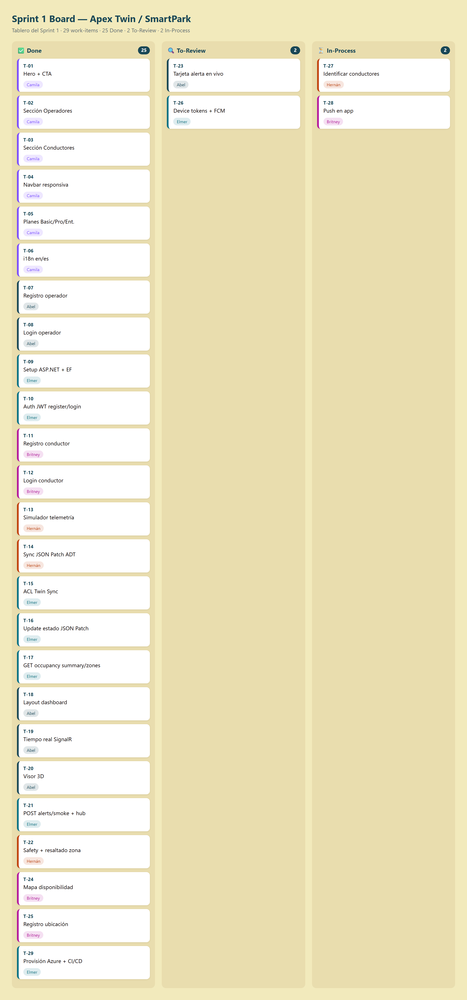

| Sprint # | Sprint 1 | | | | | | |
|---|---|---|---|---|---|---|---|
| **User Story** | | | **Work-Item / Task** | | | | |
| Id | Title | Id | Title | Description | Estimation (Hours) | Assigned To | Status |
| US-07 | View Landing Page as Mall Operator | T-01 | Setup landing page repo | _(...)_ | 2 | _(Nombre)_ | Done |
| US-07 | View Landing Page as Mall Operator | T-02 | Build hero section | _(...)_ | 4 | _(Nombre)_ | Done |
| US-08 | View Landing Page as Driver | T-03 | Build "For Drivers" section | _(...)_ | 4 | _(Nombre)_ | Done |
| TS-01 | Twin State Update Endpoint | T-04 | Setup ASP.NET Core project | _(...)_ | 3 | _(Nombre)_ | Done |
| TS-01 | Twin State Update Endpoint | T-05 | Implement PATCH /api/v1/twins/{id} | _(...)_ | 6 | _(Nombre)_ | Done |
| _(...)_ | | | | | | | |

#### 7.2.1.3. Development Evidence for Sprint Review

_(Resumen de avances en implementación. Tabla de commits por repositorio.)_

| Repository | Branch | Commit Id | Commit Message | Commit Message Body | Committed on |
|---|---|---|---|---|---|
| `<org>/landing-page` | `feature/hero-section` | `abc1234` | feat: add hero section | Implements landing page hero with primary CTA | YYYY-MM-DD |
| `<org>/web-services` | `feature/ts-01-twin-update` | `def5678` | feat(twins): add PATCH endpoint for twin state updates | Implements UpdateOccupancyStateCommand and handler | YYYY-MM-DD |
| _(...)_ | | | | | |

#### 7.2.1.4. Testing Suite Evidence for Sprint Review

_(Conjunto de Unit Tests, Integration Tests y Acceptance Tests automatizados, para Web Services.)_

**Unit Tests implementados:**
- `ParkingSpaceTests` — valida transiciones de estado.
- `OccupancyCalculationServiceTests` — valida cálculos agregados.

**Acceptance Tests (.feature):**

```gherkin
Feature: Twin State Update
  As a developer
  I want to update twin state via PATCH endpoint
  So that the simulator can send telemetry

  Scenario: Successful twin update
    Given a valid twin with id "space-001"
    When I send PATCH /api/v1/twins/space-001 with valid JSON Patch
    Then the response status is 204

  Scenario: Twin not found
    Given a twin id "nonexistent" does not exist
    When I send PATCH /api/v1/twins/nonexistent
    Then the response status is 404
```

| Repository | Branch | Commit Id | Commit Message | Commit Message Body | Committed on |
|---|---|---|---|---|---|
| `<org>/web-services` | `feature/ts-01-tests` | `ghi9012` | test(twins): add acceptance tests for twin update | Includes successful and not-found scenarios | YYYY-MM-DD |

#### 7.2.1.5. Execution Evidence for Sprint Review

_(Screenshots de las principales vistas implementadas + enlace a video demo.)_


**URL del video demo:** `https://web.microsoftstream.com/...`

#### 7.2.1.6. Services Documentation Evidence for Sprint Review

_(Endpoints documentados con OpenAPI relacionados con el alcance del sprint.)_

| Endpoint | HTTP Verb | Description | Parameters | Example Response |
|---|---|---|---|---|
| `/api/v1/twins/{id}` | PATCH | Updates a twin state | `id` (path), JSON Patch (body) | `204 No Content` |
| `/api/v1/occupancy/levels/{levelId}` | GET | Returns occupancy by level | `levelId` (path) | `200 OK` with JSON array |

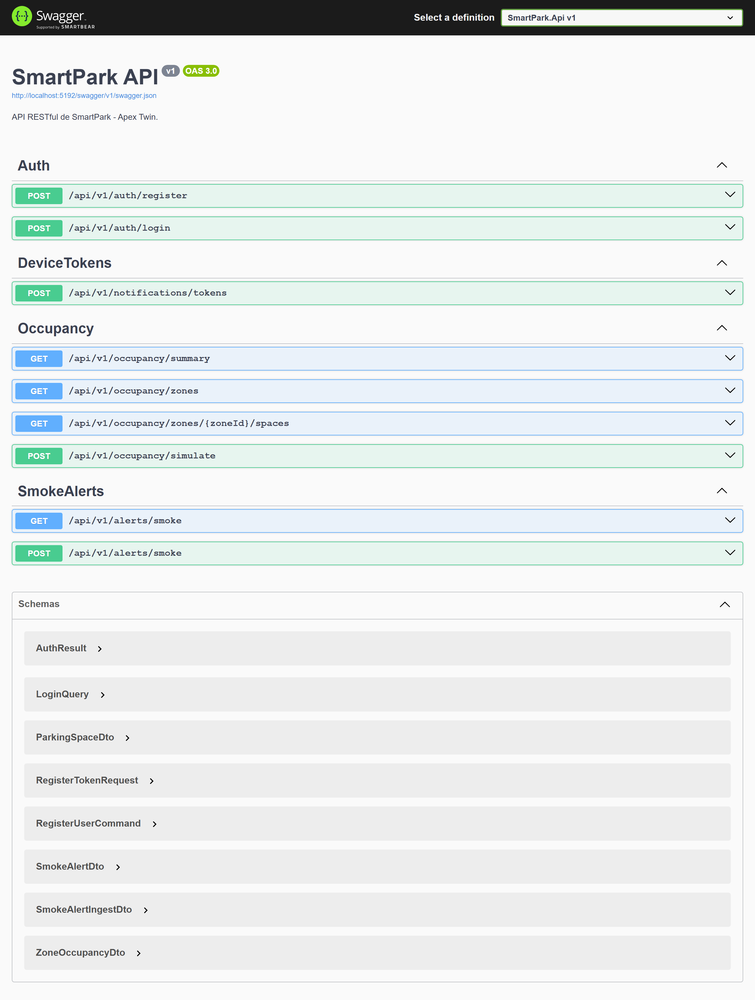

#### 7.2.1.7. Software Deployment Evidence for Sprint Review

_(Capturas de procesos de deployment ejecutados durante el sprint.)_


**URLs desplegadas:**
- Landing Page: `https://...`
- Web Services: `https://...`
- Web App: `https://...`

#### 7.2.1.8. Team Collaboration Insights during Sprint

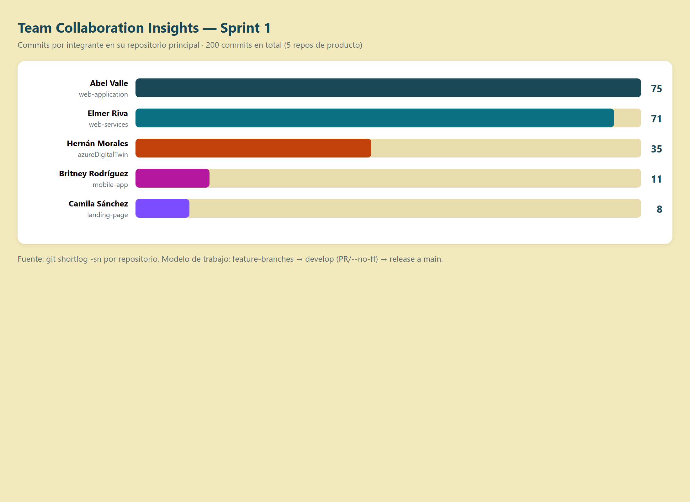

_(Análisis de la colaboración de cada miembro durante el sprint.)_

---

### 7.2.2. Sprint 2

#### 7.2.2.1. Sprint Planning 2

| Sprint Planning Background | |
|---|---|
| **Sprint #** | Sprint 2 |
| **Date** | YYYY-MM-DD |
| **Time** | HH:MM AM/PM |
| **Location** | _(Virtual / Física)_ |
| **Prepared By** | _(Team Leader)_ |
| **Attendees** | _(Lista de asistentes)_ |
| **Sprint 1 Review Summary** | _(Resumen del Sprint 1: resultados a nivel de productos de software, opiniones de miembros y feedback del product owner.)_ |
| **Sprint 1 Retrospective Summary** | _(Resumen del Sprint 1: opiniones del equipo sobre aciertos y oportunidades de mejora en su forma de trabajo.)_ |

| Sprint Goal & User Stories | |
|---|---|
| **Sprint 2 Goal** | _(Definir el goal y la métrica de cumplimiento.)_ |
| **Sprint 2 Velocity** | _(N story points)_ |
| **Sum of Story Points** | _(N)_ |

#### 7.2.2.2. Sprint Backlog 2

**URL del Board:** `https://trello.com/b/...` _(o herramienta equivalente)_


| Sprint # | Sprint 2 | | | | | | |
|---|---|---|---|---|---|---|---|
| **User Story** | | | **Work-Item / Task** | | | | |
| Id | Title | Id | Title | Description | Estimation (Hours) | Assigned To | Status |
| US-01 | View 3D Parking Occupancy Map | T-01 | Setup Angular project with Material | _(...)_ | 3 | _(Nombre)_ | Done |
| US-01 | View 3D Parking Occupancy Map | T-02 | Embed 3D Scenes Studio viewer via iframe | _(...)_ | 5 | _(Nombre)_ | Done |
| US-03 | View Available Spaces by Zone | T-03 | Build PowerApps availability screen | _(...)_ | 4 | _(Nombre)_ | Done |
| US-04 | Register Vehicle Location | T-04 | Implement vehicle location registration | _(...)_ | 5 | _(Nombre)_ | Done |
| TS-02 | Occupancy Query Endpoint | T-05 | Implement GET /api/v1/occupancy | _(...)_ | 4 | _(Nombre)_ | Done |
| _(...)_ | | | | | | | |

#### 7.2.2.3. Development Evidence for Sprint Review

_(Resumen de avances en implementación. Tabla de commits por repositorio.)_

| Repository | Branch | Commit Id | Commit Message | Commit Message Body | Committed on |
|---|---|---|---|---|---|
| `<org>/web-application` | `feature/us-01-3d-viewer` | `a1b2c3d` | feat(dashboard): embed 3D Scenes Studio viewer | Adds iframe-based viewer for the parking digital twin | YYYY-MM-DD |
| `<org>/mobile-app` | `feature/us-04-location-register` | `e4f5g6h` | feat(driver): add vehicle location registration screen | Implements zone/level selector and confirmation flow | YYYY-MM-DD |
| `<org>/web-services` | `feature/ts-02-occupancy-query` | `i7j8k9l` | feat(occupancy): add GET endpoint for occupancy aggregation | Implements GetOccupancyByLevelQuery and handler | YYYY-MM-DD |
| _(...)_ | | | | | |

#### 7.2.2.4. Testing Suite Evidence for Sprint Review

_(Conjunto de Unit Tests, Integration Tests y Acceptance Tests automatizados, para Web Services.)_

**Unit Tests implementados:**
- `OccupancyControllerTests` — valida respuesta de endpoint de ocupación.
- `GetOccupancyByLevelQueryHandlerTests` — valida lógica de agregación.

**Acceptance Tests (.feature):**

```gherkin
Feature: Occupancy Query
  As an operator
  I want to query parking occupancy by level
  So that I can see the current state of each level

  Scenario: Successful occupancy query
    Given I am authenticated as an operator
    When I send GET /api/v1/occupancy/levels/B1
    Then the response status is 200
    And the response contains the count of free, occupied, and reserved spaces

  Scenario: Level not found
    Given level "Z9" does not exist
    When I send GET /api/v1/occupancy/levels/Z9
    Then the response status is 404
```

| Repository | Branch | Commit Id | Commit Message | Commit Message Body | Committed on |
|---|---|---|---|---|---|
| `<org>/web-services` | `feature/ts-02-tests` | `m1n2o3p` | test(occupancy): add acceptance tests for occupancy query | Includes successful and not-found scenarios | YYYY-MM-DD |

#### 7.2.2.5. Execution Evidence for Sprint Review

_(Screenshots de las principales vistas implementadas + enlace a video demo.)_


**URL del video demo:** `https://web.microsoftstream.com/...`

#### 7.2.2.6. Services Documentation Evidence for Sprint Review

_(Endpoints documentados con OpenAPI relacionados con el alcance del sprint.)_

| Endpoint | HTTP Verb | Description | Parameters | Example Response |
|---|---|---|---|---|
| `/api/v1/occupancy/levels/{levelId}` | GET | Returns aggregated occupancy by level | `levelId` (path) | `200 OK` with JSON object |
| `/api/v1/occupancy/zones/{zoneId}` | GET | Returns aggregated occupancy by zone | `zoneId` (path) | `200 OK` with JSON object |
| `/api/v1/sessions` | POST | Registers a new parking session | Body (driver, location) | `201 Created` |


#### 7.2.2.7. Software Deployment Evidence for Sprint Review

_(Capturas de procesos de deployment ejecutados durante el sprint.)_


**URLs desplegadas:**
- Web Services: `https://...`
- Web Application: `https://...`
- IoT Simulator: `https://...`

#### 7.2.2.8. Team Collaboration Insights during Sprint


_(Análisis de la colaboración de cada miembro durante el sprint.)_

---

### 7.2.3. Sprint 3

#### 7.2.3.1. Sprint Planning 3

| Sprint Planning Background | |
|---|---|
| **Sprint #** | Sprint 3 |
| **Date** | YYYY-MM-DD |
| **Time** | HH:MM AM/PM |
| **Location** | _(Virtual / Física)_ |
| **Prepared By** | _(Team Leader)_ |
| **Attendees** | _(Lista de asistentes)_ |
| **Sprint 2 Review Summary** | _(Resumen del Sprint 2: resultados a nivel de productos de software, opiniones de miembros y feedback del product owner.)_ |
| **Sprint 2 Retrospective Summary** | _(Resumen del Sprint 2: opiniones del equipo sobre aciertos y oportunidades de mejora en su forma de trabajo.)_ |

| Sprint Goal & User Stories | |
|---|---|
| **Sprint 3 Goal** | _(Definir el goal y la métrica de cumplimiento. Foco en cierre: integración de alertas en tiempo real, push notifications, gestión energética y refinamiento UX.)_ |
| **Sprint 3 Velocity** | _(N story points)_ |
| **Sum of Story Points** | _(N)_ |

#### 7.2.3.2. Sprint Backlog 3

**URL del Board:** `https://trello.com/b/...` _(o herramienta equivalente)_


| Sprint # | Sprint 3 | | | | | | |
|---|---|---|---|---|---|---|---|
| **User Story** | | | **Work-Item / Task** | | | | |
| Id | Title | Id | Title | Description | Estimation (Hours) | Assigned To | Status |
| US-02 | Receive Smoke Alert with Spatial Context | T-01 | Implement SignalR Hub for real-time alerts | _(...)_ | 6 | _(Nombre)_ | Done |
| US-02 | Receive Smoke Alert with Spatial Context | T-02 | Subscribe operator dashboard to alert channel | _(...)_ | 4 | _(Nombre)_ | Done |
| US-05 | Receive Safety Alerts Near Vehicle | T-03 | Integrate Firebase Cloud Messaging in backend | _(...)_ | 5 | _(Nombre)_ | Done |
| US-05 | Receive Safety Alerts Near Vehicle | T-04 | Configure FCM device token registration in PowerApps | _(...)_ | 4 | _(Nombre)_ | Done |
| TS-03 | Push Notification Trigger | T-05 | Implement notifications service for active sessions | _(...)_ | 5 | _(Nombre)_ | Done |
| US-06 | Identify Low-Occupancy Zones for Lighting Adjustment | T-06 | Implement energy view in dashboard | _(...)_ | 4 | _(Nombre)_ | Done |
| _(...)_ | | | | | | | |

#### 7.2.3.3. Development Evidence for Sprint Review

_(Resumen de avances en implementación. Tabla de commits por repositorio.)_

| Repository | Branch | Commit Id | Commit Message | Commit Message Body | Committed on |
|---|---|---|---|---|---|
| `<org>/web-services` | `feature/us-02-signalr-alerts` | `q1r2s3t` | feat(alerts): add SignalR Hub for real-time smoke alerts | Implements push channel for operator dashboard | YYYY-MM-DD |
| `<org>/web-services` | `feature/ts-03-fcm-integration` | `u4v5w6x` | feat(notifications): integrate Firebase Cloud Messaging | Implements FcmNotificationService and device token registry | YYYY-MM-DD |
| `<org>/web-application` | `feature/us-02-alert-overlay` | `y7z8a9b` | feat(dashboard): subscribe to SignalR alert channel | Renders alert overlay on 3D viewer when smoke detected | YYYY-MM-DD |
| `<org>/mobile-app` | `feature/us-05-push-alerts` | `c1d2e3f` | feat(driver): handle FCM push notifications for safety alerts | Displays in-app evacuation instructions on alert receipt | YYYY-MM-DD |
| `<org>/web-application` | `feature/us-06-energy-view` | `g4h5i6j` | feat(dashboard): add energy management view | Highlights low-occupancy zones with dimming recommendations | YYYY-MM-DD |
| _(...)_ | | | | | | | |

#### 7.2.3.4. Testing Suite Evidence for Sprint Review

_(Conjunto de Unit Tests, Integration Tests y Acceptance Tests automatizados, para Web Services.)_

**Unit Tests implementados:**
- `FcmNotificationServiceTests` — valida envío correcto a FCM.
- `SmokeAlertHandlerTests` — valida detección de sesiones afectadas por zona.
- `EnergyRecommendationServiceTests` — valida lógica de recomendación de atenuación.

**Acceptance Tests (.feature):**

```gherkin
Feature: Smoke Alert End-to-End
  As an operator
  I want to receive smoke alerts with spatial context in real time
  So that I can coordinate the response immediately

  Scenario: Alert reaches operator dashboard within 2 seconds
    Given a smoke detector "SD-001" in zone "B1-A"
    When the simulator emits a smoke detection event
    Then within 2 seconds the operator dashboard receives the alert
    And the affected zone is highlighted on the 3D viewer

  Scenario: Driver with active session receives push notification
    Given a driver with an active parking session in zone "B1-A"
    When a smoke alert is triggered in zone "B1-A"
    Then within 5 seconds the driver receives a push notification
    And the notification includes evacuation instructions
```

| Repository | Branch | Commit Id | Commit Message | Commit Message Body | Committed on |
|---|---|---|---|---|---|
| `<org>/web-services` | `feature/us-02-tests` | `k7l8m9n` | test(alerts): add end-to-end tests for smoke alerts | Validates 2s latency for dashboard and 5s for FCM push | YYYY-MM-DD |

#### 7.2.3.5. Execution Evidence for Sprint Review

_(Screenshots de las principales vistas implementadas + enlace a video demo.)_


**URL del video demo:** `https://web.microsoftstream.com/...`

#### 7.2.3.6. Services Documentation Evidence for Sprint Review

_(Endpoints documentados con OpenAPI relacionados con el alcance del sprint.)_

| Endpoint | HTTP Verb | Description | Parameters | Example Response |
|---|---|---|---|---|
| `/api/v1/alerts` | GET | Returns active alerts | Query: `zoneId`, `levelId` | `200 OK` with JSON array |
| `/api/v1/alerts/{id}/acknowledge` | POST | Acknowledges an alert by operator | `id` (path) | `204 No Content` |
| `/api/v1/notifications/devices` | POST | Registers a device token for push notifications | Body: `driverId`, `token` | `201 Created` |
| `/api/v1/energy/recommendations` | GET | Returns lighting dimming recommendations by zone | Query: `levelId` | `200 OK` with JSON array |
| `/hubs/alerts` | WebSocket | SignalR Hub for real-time alert channel | — | Real-time alert events |


#### 7.2.3.7. Software Deployment Evidence for Sprint Review

_(Capturas de procesos de deployment ejecutados durante el sprint. Esta es la versión final desplegada de los productos digitales.)_


**URLs desplegadas (versión final):**
- Landing Page: `https://...`
- Web Application: `https://...`
- Web Services: `https://...`
- IoT Simulator: `https://...`
- Swagger Docs: `https://.../swagger`

**Configuración de Firebase Cloud Messaging:**
- FCM Project: `<project-id>`
- Server Key configurado en App Service settings.

**Configuración de Azure Digital Twins:**
- ADT Instance: `<instance-name>.api.<region>.digitaltwins.azure.net`
- 3D Scenes Storage Container: `<container-name>`

#### 7.2.3.8. Team Collaboration Insights during Sprint


_(Análisis de la colaboración de cada miembro durante el sprint final.)_

## 7.3. Validation Interviews

### 7.3.1. Diseño de Entrevistas

_(Elementos a validar por segmento objetivo, incluyendo Landing Page y aplicaciones. User flows que formarán parte de la validación.)_

### 7.3.2. Registro de Entrevistas

#### Entrevista de Validación 1 — Operador
| Campo | Dato |
|---|---|
| Nombres y Apellidos | _(...)_ |
| Edad | _(...)_ |
| Distrito | _(...)_ |
| Cargo | _(...)_ |
| Fecha de entrevista | YYYY-MM-DD |
| URL del video | `https://web.microsoftstream.com/...` |
| Timing inicio | HH:MM:SS |
| Duración | MM:SS |


**Resumen:** _(Apreciaciones del entrevistado respecto a las tareas asignadas.)_

_(Repetir para todas las entrevistas de validación, 3-5 por segmento.)_

### 7.3.3. Evaluaciones según heurísticas

**UX Heuristics & Principles Evaluation**  
**Usability – Inclusive Design – Information Architecture**

| Campo | Valor |
|---|---|
| **CARRERA** | Ingeniería de Software |
| **CURSO** | Arquitecturas de Software Emergentes |
| **SECCIÓN** | _(...)_ |
| **PROFESORES** | _(...)_ |
| **AUDITOR** | _(Nombre del Grupo)_ |
| **CLIENTE(S)** | _(Nombres de los participantes)_ |

**SITE/APP A EVALUAR:** _(Web Application del Operador / Mobile App del Conductor)_

**TAREAS A EVALUAR:**
1. _(Login del operador)_
2. _(Visualización de mapa 3D de ocupación)_
3. _(Atención de alerta de humo)_
4. _(Registro de ubicación de vehículo en app móvil)_
5. _(Recepción de alerta de seguridad en app móvil)_
6. _(...)_

**TAREAS NO INCLUIDAS:**
1. _(...)_

**ESCALA DE SEVERIDAD:**

| Nivel | Descripción |
|---|---|
| 1 | Problema superficial: puede ser fácilmente superado por el usuario o ocurre con muy poca frecuencia. |
| 2 | Problema menor: ocurre un poco más frecuentemente o es más difícil de superar. Prioridad baja. |
| 3 | Problema mayor: ocurre frecuentemente o los usuarios no pueden resolverlo. Prioridad alta. |
| 4 | Problema muy grave: error de gran impacto que impide el uso. Imperativo corregir antes del lanzamiento. |

**TABLA RESUMEN:**

| # | Problema | Escala de severidad | Heurística/Principio violada(o) |
|---|---|---|---|
| 1 | _(Descripción del problema)_ | _(1-4)_ | _(Heurística violada)_ |
| 2 | _(...)_ | _(...)_ | _(...)_ |

**DESCRIPCIÓN DE PROBLEMAS:**

**PROBLEMA #1:** _(Título)_

- **Severidad:** _(1-4)_
- **Heurística violada:** _(...)_
- **Problema:** _(Descripción detallada con captura)_
- **Recomendación:** _(...)_

_(Repetir para cada problema identificado.)_

## 7.4. Video About-the-Product

_(Introducción y descripción del contenido del video. Tono consistente con el producto. Incluye al menos un testimonio positivo de un usuario que haya participado en las entrevistas de validación.)_

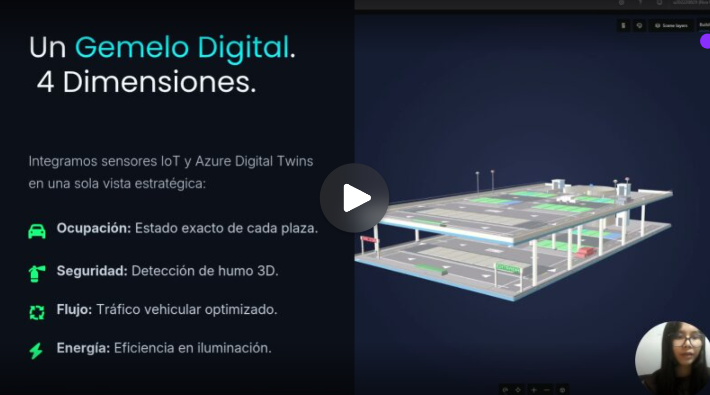

- **URL Microsoft Stream:** `https://web.microsoftstream.com/...`
- **URL YouTube:** `https://youtube.com/...`
- **Duración:** MM:SS

---

# Conclusiones

## Conclusiones y recomendaciones

_(Conclusiones sobre el trabajo, contrastando con los Problem Statements, Assumptions, Hypothesis Statements y criterios de éxito definidos en el proceso Lean UX. Recomendaciones sobre roadmap futuro de los productos digitales.)_

### Conclusiones por entrega

#### TB1
_(Conclusiones acumulables.)_

#### TP1
_(Conclusiones acumulables.)_

#### TB2
_(Conclusiones acumulables.)_

#### TF1
_(Conclusiones finales del proyecto.)_

### Recomendaciones de roadmap

_(Próximos pasos para escalar la solución: integración con sensores IoT reales, expansión a múltiples centros comerciales, pasarela de pagos, integración con sistemas de gestión del centro comercial, analítica predictiva, etc.)_

## Video About-the-Team

_(Resumen del proceso de trabajo, pauta de secuencias con timing, screenshot del video.)_


**Pauta de secuencias:**

| Inicio (hh:mm:ss) | Sección |
|---|---|
| 00:00:00 | Introducción |
| 00:00:30 | Sesiones de trabajo del equipo |
| 00:02:00 | Testimonio integrante 1 |
| 00:03:00 | Testimonio integrante 2 |
| 00:04:00 | Testimonio integrante 3 |
| 00:05:00 | Testimonio integrante 4 |
| 00:06:00 | Conclusiones grupales |

- **URL Microsoft Stream:** `https://web.microsoftstream.com/...`
- **URL YouTube:** `https://youtube.com/...`

---

# Bibliografía

_(Referencias en formato APA.)_

- Brown, S. (2018). _The C4 model for visualising software architecture_. C4 Model. https://c4model.com/
- Cervantes, H., & Kazman, R. (2016). _Designing Software Architectures: A Practical Approach_. Addison-Wesley.
- Driessen, V. (2010). _A successful Git branching model_. https://nvie.com/posts/a-successful-git-branching-model/
- Evans, E. (2003). _Domain-Driven Design: Tackling Complexity in the Heart of Software_. Addison-Wesley.
- Fowler, M. (2006). _UbiquitousLanguage_. martinfowler.com. https://martinfowler.com/bliki/UbiquitousLanguage.html
- Gothelf, J., & Seiden, J. (2021). _Lean UX: Designing Great Products with Agile Teams_ (3rd ed.). O'Reilly Media.
- Microsoft. (2025). _Azure Digital Twins documentation_. https://learn.microsoft.com/en-us/azure/digital-twins/
- Microsoft. (2025). _3D Scenes Studio (preview) for Azure Digital Twins_. https://learn.microsoft.com/en-us/azure/digital-twins/concepts-3d-scenes-studio
- Microsoft. (2025). _Microsoft Power Apps documentation_. https://learn.microsoft.com/en-us/power-apps/
- Nielsen, J. (1994). _10 Usability Heuristics for User Interface Design_. Nielsen Norman Group. https://www.nngroup.com/articles/ten-usability-heuristics/
- Preston-Werner, T. (2013). _Semantic Versioning 2.0.0_. https://semver.org/

_(Continuar con todas las referencias utilizadas.)_

---

# Anexos

## Anexo A: Videos de Exposiciones

| Entrega | URL del video |
|---|---|
| TB1 | `https://web.microsoftstream.com/...` |
| TP1 | `https://web.microsoftstream.com/...` |
| TB2 | `https://web.microsoftstream.com/...` |
| TF1 | `https://web.microsoftstream.com/...` |

## Anexo B: Términos y Condiciones del Servicio

_(Texto completo de los Terms of Service expuestos en el footer del Landing Page y aplicaciones, redactados con responsabilidad ética y profesional según los principios del código de ética de software engineering de ACM/IEEE y del CIP.)_

## Anexo C: Configuración de Internacionalización (i18n) y Accesibilidad (a11y)

_(Detalle de la configuración de i18n para English (en_US) y Latin American Spanish (es_419), y configuración de ARIA attributes en Landing Page y Web Application.)_

## Anexo D: DTDL Models de Azure Digital Twins

_(Listado de los Twin Models definidos en DTDL para el grafo del estacionamiento.)_

```json
{
  "@id": "dtmi:smartpark:ParkingSpace;1",
  "@type": "Interface",
  "@context": "dtmi:dtdl:context;2",
  "displayName": "Parking Space",
  "contents": [
    {
      "@type": "Property",
      "name": "code",
      "schema": "string"
    },
    {
      "@type": "Property",
      "name": "occupancyState",
      "schema": "string"
    },
    {
      "@type": "Property",
      "name": "lastUpdated",
      "schema": "dateTime"
    }
  ]
}
```

_(Continuar con los modelos de ParkingZone, ParkingLevel, SmokeDetector, etc.)_
