<strong>
<p align="center">
Universidad Peruana de Ciencias Aplicadas - Ingeniería de Software<br>
<br>
<br>SI728 - Arquitecturas de Software Emergentes<br>
Ciclo 202601 - Sección 10042<br>
Rojas Malasquez, Royer Edelwer<br>
<br>Informe de Trabajo Final<br>
Startup: Apex Twin<br>Producto: SmartPark<br>
<br>Plataforma de gestión inteligente de estacionamientos en centros comerciales basada en Digital Twins
</p>
</strong>

<div align="center">
<h3 align="center">Team Members:</h3>
<table align="center" style="margin-left: auto; margin-right: auto;">
<tr>
<th align="center">Estudiante</th>
<th align="center">Código</th>
</tr>
<tr>
<td align="center">Riva Rodríguez, Elmer Augusto</td>
<td align="center">U202220829</td>
</tr>
<tr>
<td align="center">Morales Calderón, Hernan Emilio</td>
<td align="center">u202216263</td>
</tr>
<tr>
<td align="center">Qqueso Rodríguez, Britney Delhy</td>
<td align="center">U20211g671</td>
</tr>
<tr>
<td align="center">Sánchez Ríos, Camila Cristina</td>
<td align="center">U202210973</td>
</tr>
<tr>
<td align="center">Valle Zuta, Abel Andrés</td>
<td align="center">U202210297</td>
</tr>
</table>
</div>

<p align="center">Lima, Perú — Abril de 2026</p>

<div style="page-break-after: always;"></div>

---

## Registro de Versiones del Informe

| Versión | Fecha      | Autor                           | Descripción de modificación                                                                                                                                                                                                                                                                                                       |
|---------|------------|---------------------------------|-----------------------------------------------------------------------------------------------------------------------------------------------------------------------------------------------------------------------------------------------------------------------------------------------------------------------------------|
| 0.1.0   | 2026-04-16 | Riva Rodriguez, Elmer Augusto   | Configuración inicial del repositorio: estructura de directorios del informe, carátula con información del curso (SI728 — 2026-01) y datos del proyecto SmartPark.                                                                                                                                                                |
| 0.2.0   | 2026-04-19 | Riva Rodriguez, Elmer Augusto   | Incorporación del Capítulo I completo: Startup Profile (descripción de la startup, misión, visión y perfiles del equipo), Solution Profile con análisis 5W1H, y Lean UX Process (Problem Statements, Assumptions, Hypothesis Statements y perfiles de segmentos objetivo).                                                        |
| 0.3.0   | 2026-04-19 | Sánchez Ríos, Camila Cristina   | Incorporación de la sección 2.1 Análisis Competitivo: Competitive Analysis Landscape y estrategias y tácticas frente a competidores. Incorporación de la sección 2.2.1 Diseño de Entrevistas para ambos segmentos objetivo.                                                                                                       |
| 0.4.0   | 2026-04-22 | Qqueso Rodriguez, Britney Delhy | Incorporación de la sección 1.2.2.4 Lean UX Canvas. Incorporación de la sección 2.3 Needfinding completa: User Personas (2.3.1), User Task Matrix (2.3.2), Empathy Maps (2.3.3) y As-Is Scenario Maps (2.3.4).                                                                                                                    |
| 0.5.0   | 2026-04-22 | Riva Rodriguez, Elmer Augusto   | Incorporación de la sección 3.2 User Stories: definición de épicas (landing page, autenticación, monitoreo de ocupación, gestión de incidentes, eficiencia energética, flujo vehicular y notificaciones a conductores) con criterios de aceptación en formato Gherkin.                                                            |
| 0.6.0   | 2026-04-24 | Riva Rodriguez, Elmer Augusto   | Incorporación de Technical Stories para desarrollo de APIs RESTful, notificaciones, tráfico, energía, autenticación y simulador IoT (EP-10). Revisión y ampliación de User Stories existentes. Incorporación de la sección 3.4 Product Backlog con enlace a tablero Jira.                                                         |
| 0.7.0   | 2026-04-24 | Sánchez Ríos, Camila Cristina   | Incorporación de la sección 3.1 To-Be Scenario Mapping para ambos segmentos, registro de entrevistas del Segmento 2 — conductores (sección 2.2.2) e incorporación de la sección 3.3 Impact Mapping.                                                                                                                               |
| 0.8.0   | 2026-04-26 | Valle Zuta, Abel Andrés         | Incorporación de la sección 4.1 Strategic-Level Attribute-Driven Design completa: Design Purpose (4.1.1), Primary Functionality (4.1.2), Constraints y Quality Attribute Scenarios (4.1.2 cont.), Architectural Drivers Backlog (4.1.3), Architectural Design Decisions (4.1.4) y Quality Attribute Scenario Refinements (4.1.5). |
| 0.9.0   | 2026-04-25 | Riva Rodriguez, Elmer Augusto   | Incorporación de la sección 4.3 Software Architecture: visión general del modelo C4 y diagramas System Landscape, Context Level, Container Level y Deployment con código Structurizr DSL.                                                                                                                                         |
| 0.10.0  | 2026-04-26 | Morales Calderón, Hernan Emilio | Incorporación de la sección 4.2 Strategic-Level Domain-Driven Design completa: EventStorming (4.2.1), Candidate Context Discovery (4.2.2), Domain Message Flows Modeling (4.2.3), Bounded Context Canvases para los 9 contextos (4.2.4) y Context Mapping (4.2.5).                                                                |
| 0.11.0  | 2026-04-26 | Sánchez Ríos, Camila Cristina   | Incorporación del registro de entrevistas del Segmento 1 — operadores (sección 2.2.2) y análisis de entrevistas de ambos segmentos (sección 2.2.3). Actualización de perfiles de integrantes del equipo con fotografías.                                                                                                          |
| 1.0.0   | 2026-04-26 | Riva Rodriguez, Elmer Augusto   | Versión final para entrega TB1: refinamiento de la sección 4.1 (tabla de Primary Functionality), correcciones en flujos de dominio, Bounded Context Canvases y Context Map (sección 4.2). Formato y correcciones de la sección 2.4 Ubiquitous Language. Revisión general de coherencia y consistencia del informe.                |
| 1.1.0   | 2026-05-12 | Valle Zuta, Abel Andrés         | Inicio del Capítulo V Tactical-Level Software Design: incorporación del diseño táctico de los bounded contexts Parking Occupancy, Traffic Flow, Energy Management y Landing & Subscription, documentando para cada uno las capas Domain, Application, Interface e Infrastructure, junto con sus Component, Class y Database Diagrams. |
| 1.2.0   | 2026-05-12 | Morales Calderón, Hernan Emilio | Continuación del Capítulo V Tactical-Level Software Design: incorporación del diseño táctico de los bounded contexts Safety & Incidents, Parking Session, Notifications, Identity & Access Management y Digital Twin Synchronization, documentando para cada uno las capas Domain, Application, Interface e Infrastructure, junto con sus Component, Class y Database Diagrams. |
| 1.3.0   | 2026-05-12 | Sánchez Ríos, Camila Cristina   | Incorporación del Capítulo VI: sección 6.1 Style Guidelines (lineamientos generales y de Web, Mobile & Devices) y sección 6.2 Information Architecture completa (Organization Systems, Labeling Systems, SEO Tags and Meta Tags, Searching Systems y Navigation Systems).                                                          |
| 1.4.0   | 2026-05-13 | Sánchez Ríos, Camila Cristina   | Incorporación de la sección 6.3 Landing Page UI Design: elaboración del wireframe (6.3.1) y del mock-up (6.3.2) del Landing Page.                                                                                                                                                                                                 |
| 1.5.0   | 2026-05-14 | Qqueso Rodriguez, Britney Delhy | Incorporación de las secciones 6.4.1 Applications Wireframes y 6.4.2 Applications Wireflow Diagrams correspondientes a la aplicación móvil del conductor desarrollada en PowerApps.                                                                                                                                                |
| 1.6.0   | 2026-05-14 | Riva Rodriguez, Elmer Augusto   | Incorporación de las secciones 6.4.1 Applications Wireframes y 6.4.2 Applications Wireflow Diagrams correspondientes a la aplicación web del operador.                                                                                                                                                                             |
| 1.7.0   | 2026-05-15 | Qqueso Rodriguez, Britney Delhy | Avance de las secciones de Conclusiones, Bibliografía y Anexos del informe.                                                                                                                                                                                                                                                       |
| 2.0.0   | 2026-05-15 | Riva Rodriguez, Elmer Augusto   | Versión final para entrega TP1: incorporación del Participant Performance Report, el Project Report Collaboration Insights y el Student Outcome, aplicación de las correcciones del TB1 según la retroalimentación del docente y actualización del Registro de Versiones del Informe.                                              |

---

## Project Report Collaboration Insights

**URL del repositorio del informe:** `https://github.com/upc-pre-202601-1ASI0728-10042-smartpark/report`

**URL de la organización GitHub:** `https://github.com/upc-pre-202601-1ASI0728-10042-smartpark`

### Repositorios de productos digitales

| Producto                   | Repositorio                                                                  |
|----------------------------|------------------------------------------------------------------------------|
| Landing Page               | `https://github.com/upc-pre-202601-1ASI0728-10042-smartpark/landing-page`    |
| Web Application (Operador) | `https://github.com/upc-pre-202601-1ASI0728-10042-smartpark/web-application` |
| Web Services (API)         | `https://github.com/upc-pre-202601-1ASI0728-10042-smartpark/web-services`    |
| IoT Simulator              | `https://github.com/upc-pre-202601-1ASI0728-10042-smartpark/iot-simulator`   |
| Mobile App (PowerApps)     | `https://github.com/upc-pre-202601-1ASI0728-10042-smartpark/mobile-app`      |

### Evidencias de colaboración

#### TB1

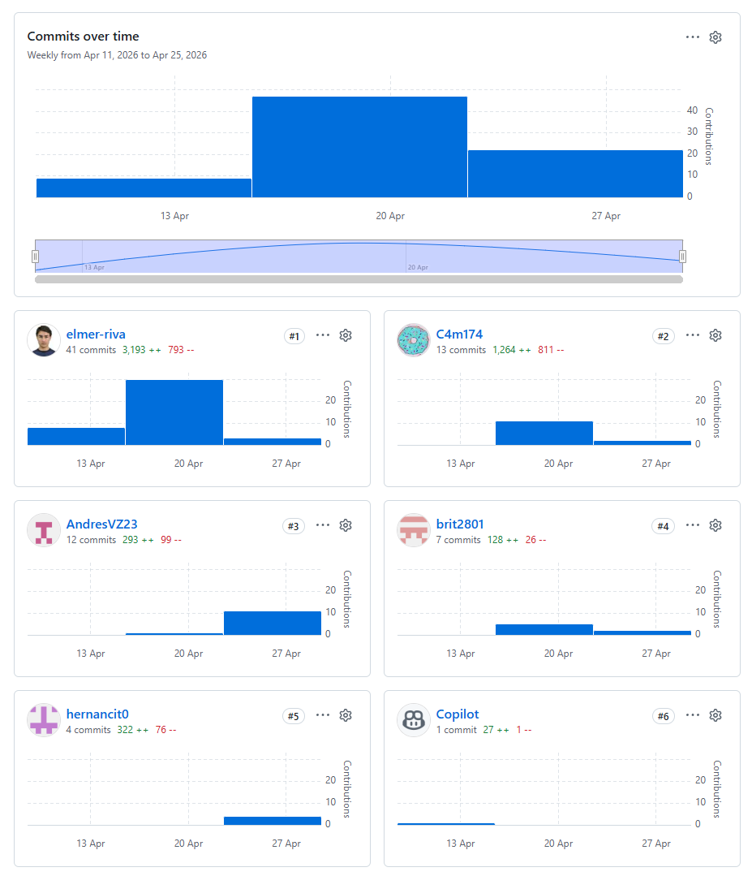

#### TP1
_(Pendiente)_

#### TB2
_(Pendiente)_

#### TF1
_(Pendiente)_

---

## Tabla de Contenidos

- [UNIVERSIDAD PERUANA DE CIENCIAS APLICADAS](#universidad-peruana-de-ciencias-aplicadas)
  - [Facultad de Ingeniería](#facultad-de-ingeniería)
    - [Carrera de Ingeniería de Software](#carrera-de-ingeniería-de-software)
  - [INFORME DE TRABAJO FINAL](#informe-de-trabajo-final)
    - [Plataforma de gestión inteligente de estacionamientos en centros comerciales basada en Digital Twins](#plataforma-de-gestión-inteligente-de-estacionamientos-en-centros-comerciales-basada-en-digital-twins)
    - [Relación de Integrantes](#relación-de-integrantes)
  - [Registro de Versiones del Informe](#registro-de-versiones-del-informe)
  - [Project Report Collaboration Insights](#project-report-collaboration-insights)
    - [Repositorios de productos digitales](#repositorios-de-productos-digitales)
    - [Evidencias de colaboración](#evidencias-de-colaboración)
      - [TB1](#tb1)
      - [TP1](#tp1)
      - [TB2](#tb2)
      - [TF1](#tf1)
  - [Tabla de Contenidos](#tabla-de-contenidos)
  - [Student Outcome](#student-outcome)
- [Capítulo I: Introducción](#capítulo-i-introducción)
  - [1.1. Startup Profile](#11-startup-profile)
    - [1.1.1. Descripción de la Startup](#111-descripción-de-la-startup)
    - [1.1.2. Perfiles de integrantes del equipo](#112-perfiles-de-integrantes-del-equipo)
  - [1.2. Solution Profile](#12-solution-profile)
    - [1.2.1. Antecedentes y problemática](#121-antecedentes-y-problemática)
      - [What (¿Qué?)](#what-qué)
      - [When (¿Cuándo?)](#when-cuándo)
      - [Where (¿Dónde?)](#where-dónde)
      - [Who (¿Quién?)](#who-quién)
      - [Why (¿Por qué?)](#why-por-qué)
      - [How (¿Cómo?)](#how-cómo)
      - [How Much (¿Cuánto?)](#how-much-cuánto)
    - [1.2.2. Lean UX Process](#122-lean-ux-process)
      - [1.2.2.1. Lean UX Problem Statements](#1221-lean-ux-problem-statements)
      - [1.2.2.2. Lean UX Assumptions](#1222-lean-ux-assumptions)
      - [1.2.2.3. Lean UX Hypothesis Statements](#1223-lean-ux-hypothesis-statements)
      - [1.2.2.4. Lean UX Canvas](#1224-lean-ux-canvas)
  - [1.3. Segmentos objetivo](#13-segmentos-objetivo)
    - [Segmento 1: Operadores de estacionamientos en centros comerciales](#segmento-1-operadores-de-estacionamientos-en-centros-comerciales)
    - [Segmento 2: Conductores frecuentes de centros comerciales](#segmento-2-conductores-frecuentes-de-centros-comerciales)
- [Capítulo II: Requirements Elicitation \& Analysis](#capítulo-ii-requirements-elicitation--analysis)
  - [2.1. Competidores](#21-competidores)
    - [2.1.1. Análisis competitivo](#211-análisis-competitivo)
      - [Competitive Analysis Landscape](#competitive-analysis-landscape)
    - [2.1.2. Estrategias y tácticas frente a competidores](#212-estrategias-y-tácticas-frente-a-competidores)
  - [2.2. Entrevistas](#22-entrevistas)
    - [2.2.1. Diseño de entrevistas](#221-diseño-de-entrevistas)
      - [Preguntas para Segmento 1: Operadores de estacionamientos en centros comerciales](#preguntas-para-segmento-1-operadores-de-estacionamientos-en-centros-comerciales)
      - [Preguntas para Segmento 2: Conductores frecuentes de centros comerciales](#preguntas-para-segmento-2-conductores-frecuentes-de-centros-comerciales)
    - [2.2.2. Registro de entrevistas](#222-registro-de-entrevistas)
      - [Segmento 1: Operadores de estacionamientos en centros comerciales](#segmento-1-operadores-de-estacionamientos-en-centros-comerciales-1)
      - [Segmento 2: Conductores frecuentes de centros comerciales](#segmento-2-conductores-frecuentes-de-centros-comerciales-1)
    - [2.2.3. Análisis de entrevistas](#223-análisis-de-entrevistas)
      - [Segmento 1: Operadores de estacionamientos en centros comerciales](#segmento-1-operadores-de-estacionamientos-en-centros-comerciales-2)
      - [Segmento 2: Conductores frecuentes de centros comerciales](#segmento-2-conductores-frecuentes-de-centros-comerciales-2)
  - [2.3. Needfinding](#23-needfinding)
    - [2.3.1. User Personas](#231-user-personas)
      - [User Persona 1: Operador de Estacionamiento](#user-persona-1-operador-de-estacionamiento)
      - [User Persona 2: Conductor Frecuente](#user-persona-2-conductor-frecuente)
    - [2.3.2. User Task Matrix](#232-user-task-matrix)
    - [2.3.3. Empathy Mapping](#233-empathy-mapping)
      - [Empathy Map: Operador](#empathy-map-operador)
      - [Empathy Map: Conductor](#empathy-map-conductor)
    - [2.3.4. As-is Scenario Mapping](#234-as-is-scenario-mapping)
      - [As-Is Scenario Map: Operador](#as-is-scenario-map-operador)
      - [As-Is Scenario Map: Conductor](#as-is-scenario-map-conductor)
  - [2.4. Ubiquitous Language](#24-ubiquitous-language)
- [Capítulo III: Requirements Specification](#capítulo-iii-requirements-specification)
  - [3.1. To-Be Scenario Mapping](#31-to-be-scenario-mapping)
    - [To-Be Scenario Map: Operador](#to-be-scenario-map-operador)
    - [To-Be Scenario Map: Conductor](#to-be-scenario-map-conductor)
  - [3.2. User Stories](#32-user-stories)
  - [3.3. Impact Mapping](#33-impact-mapping)
  - [3.4. Product Backlog](#34-product-backlog)
- [Capítulo IV: Strategic-Level Software Design](#capítulo-iv-strategic-level-software-design)
  - [4.1. Strategic-Level Attribute-Driven Design](#41-strategic-level-attribute-driven-design)
    - [4.1.1. Design Purpose](#411-design-purpose)
    - [4.1.2. Attribute-Driven Design Inputs](#412-attribute-driven-design-inputs)
      - [4.1.2.1. Primary Functionality](#4121-primary-functionality)
      - [4.1.2.2. Quality Attribute Scenarios](#4122-quality-attribute-scenarios)
      - [4.1.2.3. Constraints](#4123-constraints)
    - [4.1.3. Architectural Drivers Backlog](#413-architectural-drivers-backlog)
    - [4.1.4. Architectural Design Decisions](#414-architectural-design-decisions)
      - [Iteración 1: Decomposition Strategy](#iteración-1-decomposition-strategy)
      - [Iteración 2: Real-time Data Propagation](#iteración-2-real-time-data-propagation)
      - [Iteración 3: Twin Synchronization](#iteración-3-twin-synchronization)
    - [4.1.5. Quality Attribute Scenario Refinements](#415-quality-attribute-scenario-refinements)
      - [Scenario Refinement for Scenario 1: Low Latency for Smoke Alerts](#scenario-refinement-for-scenario-1-low-latency-for-smoke-alerts)
      - [Scenario Refinement for Scenario 2: Sensor Type Modifiability](#scenario-refinement-for-scenario-2-sensor-type-modifiability)
      - [Scenario Refinement for Scenario 3: Cost Containment](#scenario-refinement-for-scenario-3-cost-containment)
  - [4.2. Strategic-Level Domain-Driven Design](#42-strategic-level-domain-driven-design)
    - [4.2.1. EventStorming](#421-eventstorming)
    - [4.2.2. Candidate Context Discovery](#422-candidate-context-discovery)
    - [4.2.3. Domain Message Flows Modeling](#423-domain-message-flows-modeling)
      - [Flow 1: Smoke Alert End-to-End](#flow-1-smoke-alert-end-to-end)
      - [Flow 2: Driver Parking Session](#flow-2-driver-parking-session)
      - [Flow 3: Energy Adjustment Recommendation](#flow-3-energy-adjustment-recommendation)
    - [4.2.4. Bounded Context Canvases](#424-bounded-context-canvases)
      - [Bounded Context Canvas 1: Parking Occupancy](#bounded-context-canvas-1-parking-occupancy)
      - [Bounded Context Canvas 2: Safety \& Incidents](#bounded-context-canvas-2-safety--incidents)
      - [Bounded Context Canvas 3: Traffic Flow](#bounded-context-canvas-3-traffic-flow)
      - [Bounded Context Canvas 4: Energy Management](#bounded-context-canvas-4-energy-management)
      - [Bounded Context Canvas 5: Parking Session](#bounded-context-canvas-5-parking-session)
      - [Bounded Context Canvas 6: Notifications](#bounded-context-canvas-6-notifications)
      - [Bounded Context Canvas 7: Identity \& Access Management](#bounded-context-canvas-7-identity--access-management)
      - [Bounded Context Canvas 8: Digital Twin Synchronization](#bounded-context-canvas-8-digital-twin-synchronization)
    - [4.2.5. Context Mapping](#425-context-mapping)
  - [4.3. Software Architecture](#43-software-architecture)
    - [4.3.1. Software Architecture System Landscape Diagram](#431-software-architecture-system-landscape-diagram)
    - [4.3.2. Software Architecture Context Level Diagram](#432-software-architecture-context-level-diagram)
    - [4.3.3. Software Architecture Container Level Diagram](#433-software-architecture-container-level-diagram)
    - [4.3.4. Software Architecture Deployment Diagrams](#434-software-architecture-deployment-diagrams)
- [Capítulo V: Tactical-Level Software Design](#capítulo-v-tactical-level-software-design)
  - [5.1. Bounded Context: Parking Occupancy](#51-bounded-context-parking-occupancy)
    - [5.1.1. Domain Layer](#511-domain-layer)
    - [5.1.2. Interface Layer](#512-interface-layer)
    - [5.1.3. Application Layer](#513-application-layer)
    - [5.1.4. Infrastructure Layer](#514-infrastructure-layer)
    - [5.1.5. Bounded Context Software Architecture Component Level Diagrams](#515-bounded-context-software-architecture-component-level-diagrams)
    - [5.1.6. Bounded Context Software Architecture Code Level Diagrams](#516-bounded-context-software-architecture-code-level-diagrams)
      - [5.1.6.1. Bounded Context Domain Layer Class Diagrams](#5161-bounded-context-domain-layer-class-diagrams)
      - [5.1.6.2. Bounded Context Database Design Diagram](#5162-bounded-context-database-design-diagram)
  - [5.2. Bounded Context: Safety \& Incidents](#52-bounded-context-safety--incidents)
    - [5.2.1. Domain Layer](#521-domain-layer)
    - [5.2.2. Interface Layer](#522-interface-layer)
    - [5.2.3. Application Layer](#523-application-layer)
    - [5.2.4. Infrastructure Layer](#524-infrastructure-layer)
    - [5.2.5. Bounded Context Software Architecture Component Level Diagrams](#525-bounded-context-software-architecture-component-level-diagrams)
    - [5.2.6. Bounded Context Software Architecture Code Level Diagrams](#526-bounded-context-software-architecture-code-level-diagrams)
  - [5.3. Bounded Context: Traffic Flow](#53-bounded-context-traffic-flow)
  - [5.4. Bounded Context: Energy Management](#54-bounded-context-energy-management)
  - [5.5. Bounded Context: Parking Session](#55-bounded-context-parking-session)
  - [5.6. Bounded Context: Notifications](#56-bounded-context-notifications)
  - [5.7. Bounded Context: Identity \& Access Management](#57-bounded-context-identity--access-management)
  - [5.8. Bounded Context: Digital Twin Synchronization](#58-bounded-context-digital-twin-synchronization)
- [Capítulo VI: Solution UX Design](#capítulo-vi-solution-ux-design)
  - [6.1. Style Guidelines](#61-style-guidelines)
    - [6.1.1. General Style Guidelines](#611-general-style-guidelines)
    - [6.1.2. Web, Mobile \& Devices Style Guidelines](#612-web-mobile--devices-style-guidelines)
    - [**Web Platform (Operadores)**](#web-platform-operadores)
    - [**Mobile Platform (Conductores)**](#mobile-platform-conductores)
  - [6.2. Information Architecture](#62-information-architecture)
    - [6.2.1. Organization Systems](#621-organization-systems)
    - [6.2.2. Labeling Systems](#622-labeling-systems)
    - [**Sistema de Iconografía**](#sistema-de-iconografía)
    - [**Etiquetas por Módulo y Plataforma**](#etiquetas-por-módulo-y-plataforma)
    - [6.2.3. SEO Tags and Meta Tags](#623-seo-tags-and-meta-tags)
    - [**SEO Tags para Landing Pages**](#seo-tags-para-landing-pages)
    - [**Header Tags Estructurados**](#header-tags-estructurados)
    - [**Meta Tags Optimizadas**](#meta-tags-optimizadas)
    - [6.2.4. Searching Systems](#624-searching-systems)
    - [**Sistema de Búsqueda para Operadores (Web)**](#sistema-de-búsqueda-para-operadores-web)
    - [**Sistema de Búsqueda para Conductores (Móvil)**](#sistema-de-búsqueda-para-conductores-móvil)
    - [6.2.5. Navigation Systems](#625-navigation-systems)
    - [**Patrones de Navegación - Plataforma Web (Operadores)**](#patrones-de-navegación---plataforma-web-operadores)
    - [**Patrones de Navegación - Aplicación Móvil (Conductores - PowerApps)**](#patrones-de-navegación---aplicación-móvil-conductores---powerapps)
    - [**Patrones de Navegación - Landing Page (Web Pública)**](#patrones-de-navegación---landing-page-web-pública)
  - [6.3. Landing Page UI Design](#63-landing-page-ui-design)
    - [6.3.1. Landing Page Wireframe](#631-landing-page-wireframe)
      - [Desktop Web Browser](#desktop-web-browser)
      - [Mobile Web Browser](#mobile-web-browser)
    - [6.3.2. Landing Page Mock-up](#632-landing-page-mock-up)
      - [Desktop Web Browser](#desktop-web-browser-1)
      - [Mobile Web Browser](#mobile-web-browser-1)
  - [6.4. Applications UX/UI Design](#64-applications-uxui-design)
    - [6.4.1. Applications Wireframes](#641-applications-wireframes)
      - [Web Application (Operador)](#web-application-operador)
      - [Mobile Application (Conductor — PowerApps)](#mobile-application-conductor--powerapps)
    - [6.4.2. Applications Wireflow Diagrams](#642-applications-wireflow-diagrams)
      - [Wireflow: Operator views smoke alert and locates affected zone](#wireflow-operator-views-smoke-alert-and-locates-affected-zone)
      - [Wireflow: Driver finds and registers a parking space](#wireflow-driver-finds-and-registers-a-parking-space)
    - [6.4.3. Applications Mock-ups](#643-applications-mock-ups)
      - [Web Application (Operador)](#web-application-operador-1)
      - [Mobile Application (Conductor)](#mobile-application-conductor)
    - [6.4.4. Applications User Flow Diagrams](#644-applications-user-flow-diagrams)
      - [User Flow: Operator manages an active smoke incident](#user-flow-operator-manages-an-active-smoke-incident)
      - [User Flow: Driver completes a parking session](#user-flow-driver-completes-a-parking-session)
  - [6.5. Applications Prototyping](#65-applications-prototyping)
    - [Prototype: Web Application (Operador)](#prototype-web-application-operador)
    - [Prototype: Mobile Application (Conductor)](#prototype-mobile-application-conductor)
- [Capítulo VII: Product Implementation, Validation \& Deployment](#capítulo-vii-product-implementation-validation--deployment)
  - [7.1. Software Configuration Management](#71-software-configuration-management)
    - [7.1.1. Software Development Environment Configuration](#711-software-development-environment-configuration)
    - [7.1.2. Source Code Management](#712-source-code-management)
    - [7.1.3. Source Code Style Guide \& Conventions](#713-source-code-style-guide--conventions)
    - [7.1.4. Software Deployment Configuration](#714-software-deployment-configuration)
      - [Landing Page → Azure Static Web Apps](#landing-page--azure-static-web-apps)
      - [Web Application (Angular) → Azure Static Web Apps](#web-application-angular--azure-static-web-apps)
      - [Web Services (ASP.NET Core) → Azure App Service](#web-services-aspnet-core--azure-app-service)
      - [IoT Simulator (Node.js) → Azure Container Apps](#iot-simulator-nodejs--azure-container-apps)
      - [Mobile App (PowerApps)](#mobile-app-powerapps)
      - [Azure Digital Twins](#azure-digital-twins)
  - [7.2. Solution Implementation](#72-solution-implementation)
    - [7.2.1. Sprint 1](#721-sprint-1)
      - [7.2.1.1. Sprint Planning 1](#7211-sprint-planning-1)
      - [7.2.1.2. Sprint Backlog 1](#7212-sprint-backlog-1)
      - [7.2.1.3. Development Evidence for Sprint Review](#7213-development-evidence-for-sprint-review)
      - [7.2.1.4. Testing Suite Evidence for Sprint Review](#7214-testing-suite-evidence-for-sprint-review)
      - [7.2.1.5. Execution Evidence for Sprint Review](#7215-execution-evidence-for-sprint-review)
      - [7.2.1.6. Services Documentation Evidence for Sprint Review](#7216-services-documentation-evidence-for-sprint-review)
      - [7.2.1.7. Software Deployment Evidence for Sprint Review](#7217-software-deployment-evidence-for-sprint-review)
      - [7.2.1.8. Team Collaboration Insights during Sprint](#7218-team-collaboration-insights-during-sprint)
    - [7.2.2. Sprint 2](#722-sprint-2)
      - [7.2.2.1. Sprint Planning 2](#7221-sprint-planning-2)
      - [7.2.2.2. Sprint Backlog 2](#7222-sprint-backlog-2)
      - [7.2.2.3. Development Evidence for Sprint Review](#7223-development-evidence-for-sprint-review)
      - [7.2.2.4. Testing Suite Evidence for Sprint Review](#7224-testing-suite-evidence-for-sprint-review)
      - [7.2.2.5. Execution Evidence for Sprint Review](#7225-execution-evidence-for-sprint-review)
      - [7.2.2.6. Services Documentation Evidence for Sprint Review](#7226-services-documentation-evidence-for-sprint-review)
      - [7.2.2.7. Software Deployment Evidence for Sprint Review](#7227-software-deployment-evidence-for-sprint-review)
      - [7.2.2.8. Team Collaboration Insights during Sprint](#7228-team-collaboration-insights-during-sprint)
    - [7.2.3. Sprint 3](#723-sprint-3)
      - [7.2.3.1. Sprint Planning 3](#7231-sprint-planning-3)
      - [7.2.3.2. Sprint Backlog 3](#7232-sprint-backlog-3)
      - [7.2.3.3. Development Evidence for Sprint Review](#7233-development-evidence-for-sprint-review)
      - [7.2.3.4. Testing Suite Evidence for Sprint Review](#7234-testing-suite-evidence-for-sprint-review)
      - [7.2.3.5. Execution Evidence for Sprint Review](#7235-execution-evidence-for-sprint-review)
      - [7.2.3.6. Services Documentation Evidence for Sprint Review](#7236-services-documentation-evidence-for-sprint-review)
      - [7.2.3.7. Software Deployment Evidence for Sprint Review](#7237-software-deployment-evidence-for-sprint-review)
      - [7.2.3.8. Team Collaboration Insights during Sprint](#7238-team-collaboration-insights-during-sprint)
  - [7.3. Validation Interviews](#73-validation-interviews)
    - [7.3.1. Diseño de Entrevistas](#731-diseño-de-entrevistas)
    - [7.3.2. Registro de Entrevistas](#732-registro-de-entrevistas)
      - [Entrevista de Validación 1 — Operador](#entrevista-de-validación-1--operador)
    - [7.3.3. Evaluaciones según heurísticas](#733-evaluaciones-según-heurísticas)
  - [7.4. Video About-the-Product](#74-video-about-the-product)
- [Conclusiones](#conclusiones)
  - [Conclusiones y recomendaciones](#conclusiones-y-recomendaciones)
    - [Conclusiones por entrega](#conclusiones-por-entrega)
      - [TB1](#tb1-1)
      - [TP1](#tp1-1)
      - [TB2](#tb2-1)
      - [TF1](#tf1-1)
    - [Recomendaciones de roadmap](#recomendaciones-de-roadmap)
  - [Video About-the-Team](#video-about-the-team)
- [Bibliografía](#bibliografía)
- [Anexos](#anexos)
  - [Anexo A: Videos de Exposiciones](#anexo-a-videos-de-exposiciones)
  - [Anexo B: Términos y Condiciones del Servicio](#anexo-b-términos-y-condiciones-del-servicio)
  - [Anexo C: Configuración de Internacionalización (i18n) y Accesibilidad (a11y)](#anexo-c-configuración-de-internacionalización-i18n-y-accesibilidad-a11y)
  - [Anexo D: DTDL Models de Azure Digital Twins](#anexo-d-dtdl-models-de-azure-digital-twins)

---

## Student Outcome

El curso contribuye al cumplimiento del Student Outcome ABET:

**ABET – EAC - Student Outcome 3:** Capacidad de comunicarse efectivamente con un rango de audiencias.

En el siguiente cuadro se describe las acciones realizadas y enunciados de conclusiones por parte del grupo, que permiten sustentar el haber alcanzado el logro del ABET – EAC - Student Outcome 3.

| Criterio específico                                                                                                                                                                       | Acciones realizadas                                                                                                                                                                                                                                                                                                                                                                                                                                                                                                                                                                                                                                                                                                                                                                                                                                                                                                                                                                                                                                                                                                                                                                                                                                                                                                                                                                                                                                                                                                                                                                                                                                                                                                                                                                                                                                                                                                                                                                                                                                                                                                                                                                                                                                                                                                                                                                                                                                                                                                                                                                                                                                                                                                                                                                                                                                                                                                                                                                                                                                                                                                                                                                                                                                                                                                                                                                                                                                                                                                                                                                                                                                                                                                                                                                                                                                                                                                                                                                                                                                                                                                                                                                                                                                                                                                                                                                         | Conclusiones                                                                                                                                                                                                                                                                                                                                                                                                                                                                                                                                                                                                                                                                                                                                                            |
|-------------------------------------------------------------------------------------------------------------------------------------------------------------------------------------------|---------------------------------------------------------------------------------------------------------------------------------------------------------------------------------------------------------------------------------------------------------------------------------------------------------------------------------------------------------------------------------------------------------------------------------------------------------------------------------------------------------------------------------------------------------------------------------------------------------------------------------------------------------------------------------------------------------------------------------------------------------------------------------------------------------------------------------------------------------------------------------------------------------------------------------------------------------------------------------------------------------------------------------------------------------------------------------------------------------------------------------------------------------------------------------------------------------------------------------------------------------------------------------------------------------------------------------------------------------------------------------------------------------------------------------------------------------------------------------------------------------------------------------------------------------------------------------------------------------------------------------------------------------------------------------------------------------------------------------------------------------------------------------------------------------------------------------------------------------------------------------------------------------------------------------------------------------------------------------------------------------------------------------------------------------------------------------------------------------------------------------------------------------------------------------------------------------------------------------------------------------------------------------------------------------------------------------------------------------------------------------------------------------------------------------------------------------------------------------------------------------------------------------------------------------------------------------------------------------------------------------------------------------------------------------------------------------------------------------------------------------------------------------------------------------------------------------------------------------------------------------------------------------------------------------------------------------------------------------------------------------------------------------------------------------------------------------------------------------------------------------------------------------------------------------------------------------------------------------------------------------------------------------------------------------------------------------------------------------------------------------------------------------------------------------------------------------------------------------------------------------------------------------------------------------------------------------------------------------------------------------------------------------------------------------------------------------------------------------------------------------------------------------------------------------------------------------------------------------------------------------------------------------------------------------------------------------------------------------------------------------------------------------------------------------------------------------------------------------------------------------------------------------------------------------------------------------------------------------------------------------------------------------------------------------------------------------------------------------------------------------------------|-------------------------------------------------------------------------------------------------------------------------------------------------------------------------------------------------------------------------------------------------------------------------------------------------------------------------------------------------------------------------------------------------------------------------------------------------------------------------------------------------------------------------------------------------------------------------------------------------------------------------------------------------------------------------------------------------------------------------------------------------------------------------|
| **Comunica oralmente sus ideas y/o resultados con objetividad a público de diferentes especialidades y niveles jerárquicos, en el marco del desarrollo de un proyecto en ingeniería.**    | **_Sanchez Rios, Camila Cristina_**<br>**TB1**<br>Conduje las entrevistas de diseño correspondientes a ambos segmentos objetivo del proyecto (operadores de estacionamiento y conductores frecuentes de centros comerciales), adaptando el lenguaje técnico del dominio a un vocabulario accesible para cada perfil de entrevistado. Presenté oralmente ante el equipo el análisis de los resultados de las entrevistas, explicando los patrones identificados en el comportamiento de los segmentos y su impacto sobre los artefactos de needfinding. Expuse durante las reuniones internas la propuesta de Lean UX Canvas, articulando de manera clara la relación entre los problem statements, los assumptions y las hypothesis statements, respondiendo a las observaciones del equipo con argumentos sustentados en los hallazgos del trabajo de campo.<br><br>**TP1**<br>Presenté ante el equipo las Style Guidelines y la Information Architecture de la solución (secciones 6.1 y 6.2), explicando oralmente los criterios de organización, etiquetado, búsqueda y navegación adoptados. Expuse el diseño del Landing Page UI durante las sesiones internas de revisión, articulando las decisiones de wireframe y mock-up. Asimismo, coordiné oralmente la elaboración de la keynote del TP1 y participé en la grabación del video de exposición, comunicando ante cámara las decisiones de diseño UX/UI del proyecto.<br><br>**_Valle Zuta, Abel Andrés_**<br>**TB1**<br>Realicé la entrevista correspondiente al Segmento 2 del proyecto (conductores frecuentes de centros comerciales), cuidando adaptar el lenguaje al perfil del entrevistado y traduciendo los conceptos técnicos del proyecto a situaciones cotidianas para que las respuestas resultaran aprovechables por el equipo. Asimismo, participé activamente en las reuniones internas de coordinación, donde expuse oralmente los avances de mi sección del Capítulo IV, recibí observaciones de mis compañeros con apertura y propuse cómo distribuir las tareas según las fortalezas de cada integrante, argumentando las prioridades del entregable y los plazos pertinentes.<br><br>**TP1**<br>Expuse ante el equipo el diseño táctico del Capítulo V correspondiente a los bounded contexts Parking Occupancy, Traffic Flow, Energy Management y Landing & Subscription, explicando oralmente la organización en capas Domain, Application, Interface e Infrastructure y la lógica de los Component, Class y Database Diagrams. Participé en las reuniones de coordinación argumentando la distribución del trabajo del Capítulo V y respondiendo observaciones de mis compañeros durante la validación interna del entregable.<br><br>**_Riva Rodriguez, Elmer Augusto_**<br>**TB1**<br>Lideré las reuniones de coordinación del equipo durante el ciclo TB1, comunicando oralmente los objetivos de cada sesión de trabajo, el estado de avance por integrante y las decisiones de priorización del backlog. Expuse ante el equipo la propuesta de User Stories y Product Backlog de SmartPark, explicando los criterios de priorización por valor de negocio y el uso de story points bajo la secuencia de Fibonacci, respondiendo consultas de mis compañeros sobre los criterios de aceptación Gherkin. También presenté los diagramas C4 de la plataforma —System Landscape, Context, Container y Deployment— explicando las decisiones tecnológicas reflejadas en cada nivel de abstracción a una audiencia con distintos niveles de familiaridad con el modelo C4.<br><br>**TP1**<br>Lideré las reuniones de coordinación del equipo durante el ciclo TP1, comunicando oralmente la distribución de los Capítulos V y VI, el estado de avance por integrante y la estrategia de integración de ramas en el repositorio. Presenté ante el equipo los wireframes y wireflows de la aplicación web del operador (sección 6.4) y expliqué oralmente las correcciones aplicadas al TB1 a partir de la retroalimentación del docente.<br><br>**_Morales Calderón, Hernan Emilio_**<br>**TB1**<br>Realicé la entrevista correspondiente al Segmento 1 del proyecto (operadores de estacionamientos en centros comerciales), adaptando las preguntas y el lenguaje al perfil del entrevistado para obtener información útil sobre operación, seguridad, congestión y necesidades tecnológicas. Asimismo, participé activamente en las reuniones grupales exponiendo los avances del Capítulo IV, explicando la lógica de EventStorming, Candidate Context Discovery, Domain Message Flows, Bounded Context Canvases y Context Mapping para alinear criterios técnicos con el equipo. También sustenté oralmente la propuesta de bounded contexts y relaciones entre dominios, explicando de manera clara cómo cada módulo aporta valor al sistema y respondiendo observaciones de mis compañeros durante la validación interna del entregable.<br><br>**TP1**<br>Expuse ante el equipo el diseño táctico del Capítulo V correspondiente a los bounded contexts Safety & Incidents, Parking Session, Notifications, Identity & Access Management y Digital Twin Synchronization, explicando oralmente la estructura de cada capa y la justificación de los diagramas de componentes, clases y base de datos. Participé en las reuniones de validación interna sustentando las decisiones de diseño táctico de mis bounded contexts y respondiendo las observaciones del equipo.<br><br>**_Qqueso Rodriguez, Britney Delhy_**<br>**TB1**<br>Presenté oralmente ante el equipo los artefactos de needfinding elaborados para el proyecto —User Personas, User Task Matrix, Empathy Maps y As-Is Scenario Maps— explicando la metodología aplicada y la relación directa entre cada artefacto y los datos recolectados en las entrevistas. Expuse el Impact Mapping de SmartPark durante una sesión interna de revisión, comunicando de forma clara los business goals, los actores involucrados y los deliverables asociados a cada hipótesis del modelo de negocio digital. Asimismo, participé en la sustentación del video de exposición del TB1, describiendo ante cámara las actividades realizadas y los artefactos de los que fui responsable.<br><br>**TP1**<br>Presenté ante el equipo los wireframes y wireflows de la aplicación móvil del conductor desarrollada en PowerApps (sección 6.4), explicando oralmente la estructura de navegación de cada pantalla y los flujos modelados. Asimismo, participé en la grabación del video de exposición del TP1, describiendo ante cámara los artefactos UX/UI de los que fui responsable.                                                                                                                                                                                                                                                                            | **TB1**<br>Durante el desarrollo del TB1, los integrantes del equipo demostraron capacidad para comunicar oralmente resultados de ingeniería a audiencias diversas: desde entrevistados sin formación técnica hasta compañeros con conocimiento especializado en arquitectura de software. La distribución de roles expositivos dentro del equipo permitió que cada integrante desarrollara habilidades de comunicación oral en contextos distintos: trabajo de campo con usuarios reales, presentaciones técnicas internas y sustentación en video. En conjunto, el equipo logró articular de manera coherente la visión del producto, las decisiones arquitectónicas y los artefactos de análisis, adaptando el nivel de detalle y el vocabulario según la audiencia.<br><br>**TP1**<br>Durante el TP1, el equipo consolidó sus habilidades de comunicación oral al exponer artefactos de mayor complejidad técnica —el diseño táctico por capas de los bounded contexts, los wireframes y los wireflows— ante una audiencia interna especializada, sustentando las decisiones de diseño táctico y de UX/UI en las reuniones de validación. La grabación del video de exposición exigió adaptar el discurso a una audiencia evaluadora, manteniendo claridad y objetividad en la presentación de los avances. |
| **Comunica en forma escrita ideas y/o resultados con objetividad a público de diferentes especialidades y niveles jerárquicos, en el marco del desarrollo de un proyecto en ingeniería.** | **_Sanchez Rios, Camila Cristina_**<br>**TB1**<br>Redacté el perfil de integrantes del equipo (sección 1.1.2) y el Lean UX Canvas (sección 1.2.2.4), cuidando la precisión del lenguaje para que los artefactos resultaran comprensibles tanto para evaluadores académicos como para stakeholders del dominio. Elaboré el Competitive Analysis Landscape (sección 2.1), documentando de forma estructurada las fortalezas, debilidades, oportunidades y amenazas de SmartPark frente a sus competidores, con sustento en fuentes verificables. Desarrollé el análisis de entrevistas (sección 2.2.3) y el To-Be Scenario Mapping (sección 3.1), redactando los hallazgos con objetividad y trazabilidad hacia los datos recolectados. También elaboré el Registro de Versiones del Informe y las notas de la keynote del TB1, garantizando coherencia entre el documento escrito y la presentación.<br><br>**TP1**<br>Redacté la sección 6.1 Style Guidelines, con los lineamientos generales y los específicos para Web, Mobile & Devices, y la sección 6.2 Information Architecture completa (Organization Systems, Labeling Systems, SEO Tags and Meta Tags, Searching Systems y Navigation Systems), cuidando una redacción clara y estructurada. Documenté la sección 6.3 Landing Page UI Design con el wireframe y el mock-up del Landing Page. También elaboré las notas de la keynote del TP1, garantizando coherencia entre el documento escrito y la presentación.<br><br>**_Valle Zuta, Abel Andrés_**<br>**TB1**<br>Redacté la sección 4.1 del Capítulo IV, correspondiente al Strategic-Level Attribute-Driven Design, cuidando la trazabilidad escrita entre los drivers arquitectónicos identificados y las decisiones de diseño adoptadas. Coordiné por escrito, a través del grupo de WhatsApp del equipo y de comentarios en los documentos compartidos, la organización de las tareas de cada integrante para el TB1, dejando registro permanente de los acuerdos, plazos y responsables. Asimismo, participé activamente en la recolección y validación de las fuentes bibliográficas del informe, verificando que cada referencia citada estuviera correctamente documentada en formato APA 7 y que los enlaces apuntaran a fuentes accesibles y confiables.<br><br>**TP1**<br>Redacté el Capítulo V Tactical-Level Software Design correspondiente a los bounded contexts Parking Occupancy, Traffic Flow, Energy Management y Landing & Subscription, documentando por escrito las capas Domain, Application, Interface e Infrastructure de cada contexto, junto con la descripción de sus Component, Class y Database Diagrams, manteniendo trazabilidad escrita con el diseño estratégico del Capítulo IV.<br><br>**_Riva Rodriguez, Elmer Augusto_**<br>**TB1**<br>Redacté el Capítulo I completo del informe, incluyendo la descripción del startup y misión/visión de Apex Twin, los antecedentes y problemática bajo la técnica 5W+2H con sustento en fuentes cuantitativas verificadas (INRIX, BID, ACCEP, APEIM), el Lean UX Process completo y los segmentos objetivo con datos estadísticos de respaldo (secciones 1.1.1, 1.2.1, 1.2.2.1–1.2.2.3, 1.3). Elaboré la sección 3.2 con las 47 User Stories y Technical Stories de SmartPark, incluyendo criterios de aceptación en formato Gherkin con happy paths, unhappy paths y edge cases, y la sección 3.4 con el Product Backlog priorizado por valor de negocio. Redacté la sección 4.3 con los diagramas de arquitectura de software bajo C4 Model (System Landscape, Context, Container y Deployment), documentando cada decisión tecnológica con su justificación. También elaboré el Participant Performance Report y el Project Report Collaboration Insights del TB1.<br><br>**TP1**<br>Redacté las secciones 6.4.1 Applications Wireframes y 6.4.2 Applications Wireflow Diagrams correspondientes a la aplicación web del operador. Elaboré el Participant Performance Report, el Project Report Collaboration Insights y la sección Student Outcome del TP1, actualicé el Registro de Versiones del Informe e incorporé por escrito las correcciones del TB1 a partir de la retroalimentación del docente.<br><br>**_Morales Calderón, Hernan Emilio_**<br>**TB1**<br>Redacté la sección 4.2 del Capítulo IV correspondiente al Strategic-Level Domain-Driven Design, desarrollando los apartados de EventStorming, Candidate Context Discovery, Domain Message Flows Modeling, Bounded Context Canvases y Context Mapping, manteniendo coherencia técnica y trazabilidad con la arquitectura definida previamente. Asimismo, elaboré tablas comparativas, relaciones entre bounded contexts y descripciones formales de patrones DDD aplicados, cuidando una redacción profesional orientada tanto a lectores técnicos como académicos. También participé en la revisión final del documento verificando consistencia de formato, estructura y calidad general del entregable.<br><br>**TP1**<br>Redacté el Capítulo V Tactical-Level Software Design correspondiente a los bounded contexts Safety & Incidents, Parking Session, Notifications, Identity & Access Management y Digital Twin Synchronization, documentando por escrito las capas Domain, Application, Interface e Infrastructure de cada contexto, junto con sus Component, Class y Database Diagrams, con una redacción técnica precisa orientada a lectores especializados.<br><br>**_Qqueso Rodriguez, Britney Delhy_**<br>**TB1**<br>Redacté la sección 2.3 completa de Needfinding, elaborando las fichas de User Persona para ambos segmentos objetivo con base en los datos recolectados en las entrevistas, el User Task Matrix con análisis de frecuencia e importancia, los Empathy Maps y los As-Is Scenario Maps, garantizando que cada característica de los arquetipos tuviera trazabilidad hacia las entrevistas registradas. Desarrollé el registro de entrevistas (sección 2.2.2), redactando resúmenes descriptivos por entrevistado que incluyeron características objetivas y subjetivas de los segmentos. Elaboré el Impact Mapping (sección 3.3), documentando los business goals SMART, actores, impactos y deliverables del modelo de negocio digital de SmartPark, con la redacción de User Stories asociadas en el formato estándar.<br><br>**TP1**<br>Redacté las secciones 6.4.1 Applications Wireframes y 6.4.2 Applications Wireflow Diagrams correspondientes a la aplicación móvil del conductor desarrollada en PowerApps, describiendo por escrito cada pantalla y flujo modelado. Asimismo, avancé la redacción de las secciones de Conclusiones, Bibliografía y Anexos del informe. | **TB1**<br>A lo largo del TB1, el equipo demostró capacidad para comunicar por escrito resultados de ingeniería con distintos niveles de formalidad y complejidad técnica. Los artefactos redactados —desde User Personas y Empathy Maps hasta drivers arquitectónicos, Quality Attribute Scenarios y diagramas C4— evidencian que cada integrante adaptó el registro escrito a su audiencia: lenguaje accesible para artefactos de needfinding orientados al dominio, y lenguaje técnico preciso para las secciones de diseño arquitectónico. La práctica de dejar registro escrito de acuerdos, asignaciones y plazos en los canales del equipo contribuyó a la trazabilidad del proceso y facilitó la coherencia del informe final.<br><br>**TP1**<br>En el TP1, el equipo evidenció dominio de la comunicación escrita técnica al documentar el diseño táctico de los nueve bounded contexts con notación por capas y diagramas de componentes, clases y base de datos, así como las secciones de diseño UX/UI del Capítulo VI. La incorporación de las correcciones del TB1, la actualización del Registro de Versiones del Informe y la redacción del Performance Report reflejan una práctica de escritura trazable y adaptada a distintas audiencias académicas y técnicas.                                  |

---

# Capítulo I: Introducción

## 1.1. Startup Profile

### 1.1.1. Descripción de la Startup

**Apex Twin** es una startup tecnológica fundada en 2026 por estudiantes de Ingeniería de Software de la Universidad Peruana de Ciencias Aplicadas (UPC), orientada a la transformación digital de la gestión de estacionamientos en centros comerciales de gran escala. Su origen responde a una observación directa y recurrente: la ausencia de una plataforma unificada que permita monitorear, analizar y actuar sobre el estado integral de un estacionamiento en tiempo real perjudica tanto a los operadores que lo gestionan como a los conductores que lo utilizan.

**Misión:**
Democratizar el acceso a tecnologías de Digital Twin para la gestión operativa de estacionamientos, transformando espacios físicos en entornos inteligentes que optimicen la experiencia del conductor, la eficiencia operativa y la seguridad.

**Visión:**
Convertirnos en el referente tecnológico de Latinoamérica en soluciones de gestión inteligente de estacionamientos basadas en gemelos digitales, con presencia en los principales centros comerciales de Perú, Colombia y Chile hacia 2029.

**Producto: SmartPark**

SmartPark ofrece una plataforma SaaS (Software as a Service) que integra cuatro dimensiones operativas normalmente gestionadas como silos independientes: ocupación de plazas, seguridad contra incendios, flujo vehicular y eficiencia energética. El núcleo de la solución es un gemelo digital construido sobre Azure Digital Twins, que reproduce el estacionamiento en un modelo 3D interactivo y lo sincroniza continuamente con datos provenientes de sensores IoT.

La plataforma se materializa en dos productos digitales diferenciados por perfil de usuario. El primero es una aplicación web desarrollada en Angular, orientada al operador del centro comercial, que presenta el gemelo digital 3D como panel central de operaciones: mapas de ocupación en tiempo real, alertas de humo con localización espacial, indicadores de flujo vehicular y recomendaciones de eficiencia energética. El segundo es una aplicación móvil low-code construida con Microsoft PowerApps, orientada al conductor, que le permite consultar la disponibilidad de plazas, registrar la ubicación de su vehículo, monitorear el costo acumulado de su sesión y recibir alertas de seguridad vía push notifications a través de Firebase Cloud Messaging.

El modelo de negocio se sustenta en una suscripción mensual por centro comercial, con tres planes escalonados según la cantidad de plazas monitoreadas (Basic hasta 500 plazas, Professional hasta 1 500 plazas, Enterprise por encima de 1 500 plazas), complementado con un esquema freemium para la aplicación del conductor.

### 1.1.2. Perfiles de integrantes del equipo

| Foto                                                                                | Nombre completo                  | Código     | Carrera                | Aporte al equipo                                                                                                                                                                                                                                                                                                                                                                                                                                                                                                                                                                                                                                                                                                                                                                                                                                                                                                                                                                                                                                 |
|-------------------------------------------------------------------------------------|----------------------------------|------------|------------------------|--------------------------------------------------------------------------------------------------------------------------------------------------------------------------------------------------------------------------------------------------------------------------------------------------------------------------------------------------------------------------------------------------------------------------------------------------------------------------------------------------------------------------------------------------------------------------------------------------------------------------------------------------------------------------------------------------------------------------------------------------------------------------------------------------------------------------------------------------------------------------------------------------------------------------------------------------------------------------------------------------------------------------------------------------|
| 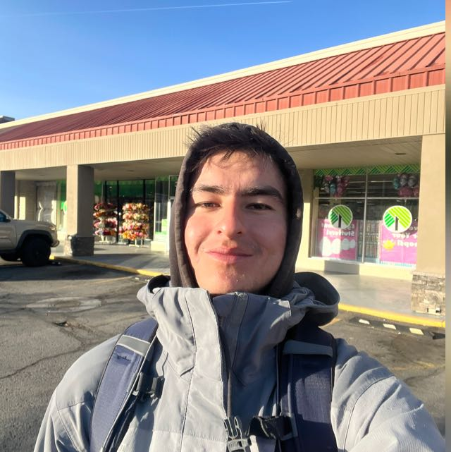         | Riva Rodriguez, Elmer Augusto    | U202220829 | Ingeniería de Software | Soy estudiante de Ingeniería de Software con experiencia en desarrollo backend con Java y Spring Boot, y C# con ASP.NET Core, así como en frontend con Angular. Manejo bases de datos relacionales como MySQL y PostgreSQL, y cuento con experiencia en soluciones cloud sobre Microsoft Azure, incluyendo despliegue y configuración de servicios. Tengo familiaridad con IoT y desarrollo mobile con Flutter. En lo arquitectónico, aplico principios de Domain-Driven Design para estructurar soluciones en bounded contexts bien definidos. A nivel de equipo, asumo roles de liderazgo técnico, contribuyendo a las decisiones arquitectónicas y a la coordinación del grupo a lo largo del ciclo de vida del proyecto.                                                                                                                                                                                                                                                                                                                     |
|                | Morales Calderon, Hernan Emilio  | u202216263 | Ingeniería de Software | Cuento con formación en Universidad Peruana de Ciencias Aplicadas dentro de la carrera de Ingeniería de Software, lo que me ha permitido desarrollar competencias en diseño, desarrollo e implementación de soluciones tecnológicas. Tengo experiencia en aplicaciones web y móviles, aplicando buenas prácticas de programación y enfoque centrado en el usuario. Además, poseo conocimientos en Internet de las Cosas (IoT), automatización mediante RPA y creación de Agentes de IA, integrando tecnologías modernas para optimizar procesos e innovar en proyectos. También manejo fundamentos de gestión de proyectos, lo que me permite organizar tareas, priorizar actividades y trabajar orientado a resultados y cumplimiento de plazos. Me adapto con facilidad a nuevas herramientas y tecnologías según las necesidades del proyecto. En cuanto a habilidades blandas, destaco por mi capacidad para resolver problemas, trabajar en equipo y fortalecer la integración del grupo mediante una comunicación positiva y colaborativa. |
|  | Qqueso Rodriguez, Britney Delhy  | U20211g671 | Ingeniería de Software | Soy estudiante de Ingeniería de Software en la UPC, enfocada en el desarrollo de soluciones creativas y eficientes. Me considero una persona autodidacta y organizada, con conocimientos en desarrollo web y ciencia de datos, lo que me permite adaptarme rápido a distintas tecnologías y metodologías de trabajo. Me comprometo con el equipo a trabajar de forma proactiva, aportar en el desarrollo técnico y apoyar constantemente en la gestión de las tareas para asegurar que alcancemos nuestras metas y el éxito del proyecto.                                                                                                                                                                                                                                                                                                                                                                                                                                                                                                        |
|             | Sanchez Rios, Camila Cristina    | U202210973 | Ingeniería de Software | Soy estudiante de la carrera de Ingeniería de Software en la Universidad Peruana de Ciencias Aplicadas, actualmente me encuentro en el octavo ciclo. Poseo conocimientos sólidos en el desarrollo de aplicaciones web y de escritorio utilizando lenguajes como HTML, Java y C#, aplicando principios de diseño orientados al dominio (Domain Driven Design) y metodologías de desarrollo modernas. Además, tengo experiencia en diseño de interfaces y prototipado con Figma, lo que me permite aportar al equipo en la creación de soluciones visualmente coherentes, funcionales y centradas en la experiencia del usuario (UI/UX)._                                                                                                                                                                                                                                                                                                                                                                                                          |
|    | Valle Zuta, Abel Andrés          | U202210297 | Ingeniería de Software | Soy estudiante de la carrera de Ingeniería de Software en la Universidad Peruana de Ciencias Aplicadas (UPC), tengo 21 años y actualmente estoy cursando el 8vo ciclo en la sede de Monterrico. Sé desarrollar aplicaciones web, móviles, tengo conocimientos de IoT, RPA, creación de Agentes de IA y Gestión de Proyectos. Además, sé resolver problemas, trabajar en equipo y lograr unir más al grupo. Mis hobbies son jugar básquet, fútbol, tenis, videojuegos, escuchar música, salir a pasear con mis amigos, ver películas, nadar, hacer ejercicio, pasear a mis mascotas y pasar tiempo con mi familia. Finalmente, siempre estoy dispuesto a trabajar y terminar a tiempo los deberes, esforzándome para aprender y comprender lo máximo posible y finalizar con éxito todos mis objetivos, por lo que considero que puedo aportar al equipo en lograr terminar a tiempo nuestros deberes, alcanzar nuestras metas y aportar en el desarrollo tecnológico del proyecto.                                                               |

## 1.2. Solution Profile

### 1.2.1. Antecedentes y problemática

La gestión de estacionamientos en centros comerciales de gran escala constituye una tarea operativa compleja que demanda coordinación simultánea entre múltiples variables: ocupación de plazas, seguridad, flujo vehicular e iluminación. En Lima, este reto se agrava por la dimensión que ha alcanzado el sector: la Asociación de Centros Comerciales y Entretenimiento del Perú (ACCEP) agrupa actualmente a 88 centros comerciales a nivel nacional, 48 de los cuales se ubican en Lima y 40 en provincias, según declaraciones de su presidente citadas por el diario Gestión (2025). A esta base ya consolidada se suman nuevas aperturas proyectadas, lo que presupone una demanda creciente de soluciones operativas más eficientes. A continuación se describe la problemática aplicando la técnica de las 5 W's y 2 H's.

#### What (¿Qué?)

El problema central radica en la ausencia de visibilidad integral y en tiempo real sobre el estado operativo del estacionamiento como un sistema unificado. Según Parklio (2023), "la principal dificultad en la gestión de los estacionamientos de los centros comerciales es la falta de informes en tiempo real sobre la ocupación de los mismos"; una limitación que se extiende igualmente a la seguridad, el flujo vehicular y el consumo energético. En la práctica, los operadores gestionan cada una de estas dimensiones con herramientas aisladas que no intercambian datos ni los contextualizan en un modelo espacial común.

Esta fragmentación tiene consecuencias concretas. No es posible, por ejemplo, identificar de forma inmediata que una alerta de humo se está produciendo en una zona con alta ocupación de vehículos y personas, lo cual comprometería las rutas de evacuación disponibles. Del mismo modo, resulta inviable correlacionar los datos de ocupación por zona con los niveles de iluminación para tomar decisiones de ahorro energético en tiempo real. Del lado del conductor, el problema se traduce en una experiencia marcada por la incertidumbre: tiempo perdido buscando plazas libres, dificultad para localizar el vehículo al salir y falta de información ante incidentes en la zona donde se encuentra estacionado.

#### When (¿Cuándo?)

La problemática se intensifica en los momentos de mayor afluencia vehicular: fines de semana, feriados, campañas navideñas, Cyber Days y las franjas horarias de almuerzo y salida laboral (12:00–14:00 y 18:00–21:00). Durante estos períodos pico, los estacionamientos de centros comerciales grandes pueden superar el 90% de su capacidad, y el tiempo invertido en buscar una plaza puede extenderse considerablemente.

En cuanto a la magnitud del fenómeno, un análisis comparativo de 16 estudios realizados en 11 ciudades del mundo —llevado a cabo por Shoup (2006, citado en BID, 2020)— concluye que encontrar un espacio de estacionamiento tarda en promedio 8,1 minutos y contribuye con hasta el 30% de la congestión vehicular urbana. Por su parte, INRIX Research (2017), en un estudio que combinó datos de su base de más de 100 000 ubicaciones en 8 700 ciudades con encuestas a cerca de 18 000 conductores en Estados Unidos, Reino Unido y Alemania, calculó que el conductor promedio en zonas urbanas destina 17 horas al año a la búsqueda de estacionamiento, con un costo de USD 345 en tiempo perdido, combustible y emisiones. En estacionamientos subterráneos de múltiples niveles, estas estimaciones tienden a agravarse por la ausencia de señalización dinámica que oriente al conductor hacia las zonas disponibles.

En lo que respecta a la seguridad, los incidentes como alertas de humo son poco frecuentes pero de naturaleza impredecible. Un esquema de detección manual, en el que el operador recibe únicamente una señal genérica sin contexto espacial, puede derivar en tiempos de reacción que superan los 5 minutos desde la activación de la alarma hasta la confirmación visual del foco; un margen crítico en un espacio cerrado con presencia simultánea de vehículos y personas.

#### Where (¿Dónde?)

El problema se presenta en los estacionamientos subterráneos y de superficie de centros comerciales de gran escala en Lima. Según datos del Instituto de Economía y Desarrollo Empresarial (IEDEP) de la Cámara de Comercio de Lima, citados por el diario Gestión (2024), el Perú proyectó la apertura de siete nuevos centros comerciales para el periodo 2023-2025, lo que evidencia un mercado en expansión sostenida. Estableciminetos como el Jockey Plaza, Mall del Sur —que cuenta con más de 2 000 plazas distribuidas en dos niveles subterráneos (Intellisoft Parking, s.f.)—, Plaza Norte, MegaPlaza y Real Plaza Puruchuco son ejemplos de complejos donde la extensión del estacionamiento, combinada con la baja visibilidad natural y la alta rotación vehicular, hace que el seguimiento manual del estado operativo resulte estructuralmente insuficiente.

#### Who (¿Quién?)

Dos segmentos se ven directamente afectados. El primero está compuesto por los **operadores de estacionamientos de centros comerciales** —jefes de operaciones, supervisores de seguridad y facility managers—, quienes coordinan la ocupación, gestionan incidentes, supervisan el flujo vehicular y controlan el consumo energético, hoy con herramientas reactivas y desconectadas entre sí. El segundo segmento lo conforman los **conductores frecuentes de centros comerciales**, personas que visitan regularmente estos espacios en vehículo propio y cuya experiencia de estacionamiento condiciona su percepción general del servicio del establecimiento.

#### Why (¿Por qué?)

Las causas raíz de la problemática son múltiples y se refuerzan entre sí. La primera es una **fragmentación tecnológica estructural**: los sistemas de control de acceso vehicular, los paneles de detección de incendios, los contadores de flujo y los sistemas de iluminación operan con protocolos propietarios que no intercambian información. La segunda causa es la **ausencia de contexto espacial**: aunque el operador reciba una alerta de humo, no puede visualizar de inmediato su ubicación exacta en relación con las plazas ocupadas, las rutas de evacuación o los accesos vehiculares. En tercer lugar, la **gestión predominantemente reactiva** hace que los problemas —congestión en rampas, iluminación innecesaria, concentración vehicular en un sector— sean atendidos después de que ya se manifiestan. Para el conductor, la causa de fondo es la **inexistencia de un canal digital** entre el sistema de gestión del estacionamiento y quien lo utiliza.

#### How (¿Cómo?)

A nivel operativo, el problema se manifiesta de varias formas. Las alertas de humo llegan al panel centralizado como señales genéricas sin localización precisa, obligando al personal de seguridad a recorrer físicamente la zona afectada antes de poder coordinar una respuesta. La ocupación se estima por diferencia entre entradas y salidas, un método que acumula errores a lo largo del día y no refleja la distribución real por zona ni por nivel. El flujo en rampas internas no se monitorea en tiempo real, de modo que las congestiones solo se detectan cuando ya son evidentes. La iluminación permanece al 100% durante todo el horario operativo sin atender si hay zonas vacías donde podría atenuarse. Todo ello confluye, como apunta Parklio (2023), en que los propios visitantes tampoco disponen de información sobre el estado del estacionamiento antes de ingresar, lo que genera recorridos innecesarios y congestión en espacios cerrados.

#### How Much (¿Cuánto?)

La magnitud económica y operativa del problema es significativa. INRIX Research (2017), en su estudio sobre el costo del estacionamiento en las diez mayores ciudades de Estados Unidos, calculó que los conductores de ese país pierden en promedio 17 horas al año buscando dónde estacionar, con un costo total de USD 345 por persona en tiempo perdido, combustible y emisiones. Aunque los valores unitarios en Lima son distintos, el estudio resulta una referencia válida para dimensionar el orden de magnitud del problema en entornos urbanos con alta densidad vehicular.

Desde una perspectiva más amplia, investigaciones referenciadas por el BID (2020) indican que gestionar los estacionamientos con una meta de ocupación de entre 80% y 85% podría prácticamente eliminar el tiempo destinado a encontrar una plaza (Millard-Ball et al., 2014; Shoup, 2005, citados en BID, 2020). El programa SFPark de San Francisco ofrece evidencia empírica al respecto: al incorporar sensores de ocupación y tarifas dinámicas, el tiempo de búsqueda de estacionamiento se redujo en un 43% y el volumen de tráfico en las zonas piloto, en un 8% (SFMTA, 2014, citado en BID, 2020). Estos resultados demuestran que la tecnología de monitoreo en tiempo real genera un retorno operativo medible. En cuanto a la dimensión energética, mantener la iluminación al 100% en zonas con ocupación inferior al 20% puede representar un sobrecosto de entre el 15% y el 25% del consumo total de iluminación del estacionamiento, conforme a estimaciones propias basadas en los estándares de la norma técnica EM.010 del Reglamento Nacional de Edificaciones (2006).

### 1.2.2. Lean UX Process

#### 1.2.2.1. Lean UX Problem Statements

**Problem Statement 1 — Operadores de centros comerciales**

Nuestro contexto de negocio se sitúa en la gestión operativa de estacionamientos de centros comerciales de gran escala en Lima Metropolitana, un entorno donde la seguridad, la ocupación, el flujo vehicular y la eficiencia energética deben coordinarse en tiempo real.

Hemos observado que los operadores de estacionamiento —jefes de operaciones, supervisores de seguridad y facility managers— enfrentan los siguientes pain points: gestionan la ocupación mediante conteo vehicular manual propenso a errores; reciben alertas de seguridad sin contexto espacial que permita localizar inmediatamente el foco del incidente; no cuentan con visibilidad sobre los cuellos de botella en rampas y accesos; y mantienen la iluminación encendida uniformemente sin considerar la ocupación real por zona. Estas limitaciones son consecuencia directa de que los sistemas de monitoreo existentes operan como silos tecnológicos que no comparten información ni la contextualizan en un modelo espacial unificado.

¿Cómo podríamos proporcionar a los operadores una plataforma que integre ocupación, seguridad, flujo vehicular y eficiencia energética en una visualización 3D unificada y en tiempo real, que les permita tomar decisiones operativas proactivas en lugar de reactivas?

**Problem Statement 2 — Conductores frecuentes de centros comerciales**

Nuestro contexto de negocio se sitúa en la experiencia de estacionamiento del conductor que visita centros comerciales regularmente, un momento que condiciona la percepción general del servicio del establecimiento.

Hemos observado que los conductores frecuentes —personas entre 25 y 55 años, NSE B/C, que visitan centros comerciales al menos semanalmente con vehículo propio— experimentan frustraciones recurrentes: invierten tiempo excesivo buscando plazas sin orientación; tienen dificultad para recordar la ubicación exacta donde dejaron su vehículo al regresar de sus compras; desconocen el costo acumulado de su estancia hasta el momento de pagar en la salida; y no reciben información oportuna ante incidentes de seguridad que puedan afectar la zona donde se encuentra su vehículo. El origen de todas estas fricciones es, en esencia, la inexistencia de un canal de comunicación digital entre el sistema de gestión del estacionamiento y el conductor.

¿Cómo podríamos ofrecer al conductor una herramienta móvil accesible que le brinde visibilidad sobre disponibilidad de plazas, le permita registrar su ubicación, le informe sobre costos y le alerte proactivamente ante incidentes de seguridad relevantes para su zona?

---

#### 1.2.2.2. Lean UX Assumptions

**Business Assumptions**

1. **Creemos que nuestros clientes necesitan** una plataforma que unifique en una sola vista las dimensiones operativas del estacionamiento (ocupación, seguridad, flujo, energía), contextualizadas espacialmente en un modelo 3D.
2. **Estas necesidades se pueden resolver con** una solución basada en Azure Digital Twins que reproduzca el estacionamiento como gemelo digital, alimentado por datos de sensores IoT y consumido por una aplicación web para el operador y una aplicación móvil para el conductor.
3. **Nuestros clientes iniciales son** operadores de estacionamientos de centros comerciales de Lima Metropolitana con más de 500 plazas, y conductores entre 25 y 55 años de NSE B/C que los frecuentan semanalmente con vehículo propio.
4. **El valor número 1 que un cliente quiere de nuestro servicio es** visibilidad unificada en tiempo real con contexto espacial para el operador, y reducción del tiempo de búsqueda de plaza para el conductor.
5. **El cliente también puede obtener estos beneficios adicionales:** reducción de costos energéticos por atenuación inteligente de iluminación, mejora del tiempo de respuesta ante incidentes de seguridad, y datos históricos de ocupación para planificación operativa.
6. **Vamos a adquirir la mayoría de nuestros clientes a través de** demostraciones presenciales a administraciones de centros comerciales y del Landing Page con contenido segmentado y llamadas a acción diferenciadas por tipo de usuario.
7. **Haremos dinero a través de** un modelo de suscripción mensual por centro comercial con planes diferenciados según cantidad de plazas monitoreadas (Plan Basic: hasta 500 plazas, Plan Professional: hasta 1 500 plazas, Plan Enterprise: más de 1 500 plazas), complementado con modelo freemium para la app del conductor.
8. **Nuestra competencia principal en el mercado será** soluciones de parking guidance como ParkHelp/Cleverciti, plataformas de reserva como SpotHero, y sistemas de gestión integral como Park Assist. Nuestra ventaja competitiva radica en la integración de múltiples dimensiones operativas bajo un gemelo digital 3D.
9. **Los venceremos debido a** que las soluciones existentes se enfocan exclusivamente en guía de ocupación sin contextualizar seguridad, flujo y energía en un modelo espacial unificado. Ningún competidor ofrece un gemelo digital accesible como SaaS para centros comerciales de mercados emergentes.
10. **Nuestro mayor riesgo de producto es** que los operadores de centros comerciales consideren que la inversión en un gemelo digital no justifica el retorno frente a soluciones puntuales más simples.
11. **Resolveremos esto a través de** una prueba piloto con datos simulados que demuestre el valor de la correlación espacial sin requerir inversión inicial en hardware IoT, reduciendo la barrera de entrada.
12. **Sabremos que tenemos éxito cuando veamos** que al menos 3 centros comerciales solicitan acceso a la plataforma tras la demostración piloto, y que los conductores de prueba reportan una reducción percibida de al menos el 50% en el tiempo de búsqueda de plaza.

**User Assumptions**

**¿Quién es el usuario?**
Los usuarios primarios son dos: (a) operadores de estacionamientos de centros comerciales, profesionales de entre 30 y 55 años con experiencia en gestión de facilities o seguridad, familiaridad tecnológica intermedia y uso cotidiano de dashboards y sistemas de monitoreo; y (b) conductores frecuentes de centros comerciales, personas de 25 a 55 años, NSE B/C, con smartphone Android o iOS y alta familiaridad con aplicaciones móviles de uso diario como Yape, Rappi o Waze.

**¿Dónde encaja nuestro producto en su vida o trabajo?**
Para el operador, la plataforma se integra en su rutina diaria como panel central de operaciones, reemplazando la consulta fragmentada de múltiples sistemas y reportes manuales. Se usaría durante toda la jornada laboral, con mayor intensidad en horarios pico y ante incidentes. Para el conductor, la aplicación se activa en momentos específicos y breves: al ingresar al estacionamiento para buscar plaza, al estacionar para registrar la ubicación, durante su estadía para consultar el costo y al regresar para localizar el vehículo.

**¿Qué problemas tiene nuestro producto que resolver?**
Para el operador: eliminar la fragmentación entre sistemas, proporcionar contexto espacial a las alertas y habilitar decisiones proactivas de flujo y energía. Para el conductor: reducir el tiempo de búsqueda de plaza, eliminar la incertidumbre sobre la ubicación del vehículo y brindar seguridad mediante alertas oportunas.

**¿Cuándo y cómo es usado nuestro producto?**
El dashboard web del operador es utilizado durante todo el horario operativo del estacionamiento (8 a. m. - 11 p. m.), desde una estación de trabajo con monitor grande en el centro de control. La app del conductor se utiliza en cada visita al centro comercial, con sesiones muy cortas —de 30 segundos a 2 minutos— pero de alto valor.

**¿Qué características son importantes?**
Para el operador: visualización 3D con estado en tiempo real, alertas con localización espacial precisa, indicadores de flujo por acceso y rampa, y recomendaciones de atenuación de iluminación. Para el conductor: mapa de disponibilidad por zona y nivel, registro rápido de ubicación con un toque, consulta de costo acumulado y push notifications ante incidentes en su zona.

**¿Cómo debe verse y comportarse nuestro producto?**
El dashboard del operador debe transmitir profesionalismo y confianza técnica, con un lenguaje de diseño basado en Material Design y gama cromática sobria con acentos de alerta (rojo para humo, ámbar para congestión, verde para disponibilidad). La app del conductor, en cambio, debe ser visualmente simple, con interacciones mínimas y tiempos de carga inferiores a 3 segundos, priorizando la legibilidad en condiciones de baja iluminación propias de los estacionamientos subterráneos.

---

#### 1.2.2.3. Lean UX Hypothesis Statements

**Hypothesis Statement 1: Reducción del tiempo de respuesta ante incidentes**

Creemos que lograremos una **reducción del 60% en el tiempo de respuesta del operador ante alertas de humo** si los **operadores de estacionamientos de centros comerciales** obtienen **localización espacial inmediata del foco de la alerta en el modelo 3D, con visualización simultánea de las plazas ocupadas y rutas de evacuación comprometidas en la zona afectada** con la funcionalidad de **alerta de humo con contexto espacial en el dashboard 3D del gemelo digital**.

**Hypothesis Statement 2: Reducción del tiempo de búsqueda de plaza**

Creemos que lograremos una **reducción del 40% en el tiempo promedio que un conductor invierte buscando una plaza libre** si los **conductores frecuentes de centros comerciales** obtienen **información en tiempo real sobre la disponibilidad de espacios por zona y nivel, con orientación hacia el área de mayor disponibilidad** con la funcionalidad de **mapa de disponibilidad en la aplicación móvil PowerApps**.

**Hypothesis Statement 3: Optimización del consumo energético**

Creemos que lograremos una **reducción del 20% en el consumo energético de iluminación del estacionamiento** si los **operadores de estacionamientos de centros comerciales** obtienen **identificación automática de zonas con ocupación inferior al 20% donde la iluminación puede atenuarse, presentada como recomendación visual en el dashboard** con la funcionalidad de **vista de gestión energética basada en la correlación de datos de ocupación y luminosidad**.

**Hypothesis Statement 4: Mejora en la localización del vehículo**

Creemos que lograremos que el **90% de los conductores localicen su vehículo en menos de 2 minutos tras regresar de sus compras** si los **conductores frecuentes de centros comerciales** obtienen **un registro digital de la ubicación exacta donde estacionaron (nivel, zona, plaza), accesible con un toque en la app** con la funcionalidad de **registro de ubicación de vehículo en la aplicación móvil**.

**Hypothesis Statement 5: Seguridad proactiva del conductor**

Creemos que lograremos un **incremento del 80% en la percepción de seguridad del conductor durante su estancia** si los **conductores frecuentes de centros comerciales** obtienen **notificaciones push inmediatas ante incidentes de seguridad en la zona donde se encuentra su vehículo, con indicaciones claras de evacuación si fuera necesario** con la funcionalidad de **alertas de seguridad vía Firebase Cloud Messaging integrado con la app PowerApps**.

**Hypothesis Statement 6: Adopción de la plataforma por centros comerciales**

Creemos que lograremos **5 contratos de suscripción con centros comerciales de Lima Metropolitana en los primeros 12 meses** si los **administradores y gerentes de operaciones de centros comerciales** obtienen **una demostración funcional del gemelo digital con datos simulados que evidencie el valor de la correlación espacial entre ocupación, seguridad, flujo y energía, sin requerir inversión inicial en hardware IoT** con la funcionalidad del **piloto basado en simulación de sensores y modelo 3D del estacionamiento**.

---

#### 1.2.2.4. Lean UX Canvas


<div align="center">
  
  <p><i>Figura: Lean UX Canvas de la plataforma SmartPark</i></p>
</div>


## 1.3. Segmentos objetivo

### Segmento 1: Operadores de estacionamientos en centros comerciales

Este segmento agrupa a los profesionales responsables de la gestión operativa de estacionamientos en centros comerciales de gran escala en Lima Metropolitana.

**Características demográficas y profesionales:**
Tienen entre 30 y 55 años, con una composición predominantemente masculina —aunque con creciente participación femenina en roles de facility management— y formación técnica o universitaria en administración, ingeniería industrial, seguridad o carreras afines. Sus cargos típicos incluyen Jefe de Operaciones de Estacionamiento, Supervisor de Seguridad, Facility Manager y Coordinador de Mantenimiento. Trabajan en turnos rotativos de 8 a 12 horas que cubren el horario operativo del centro comercial (8 a. m. - 11 p. m.) y acumulan al menos 3 años de experiencia en operaciones o mantenimiento de edificaciones comerciales.

**Perfil tecnológico:**
Su familiaridad con la tecnología es intermedia: manejan cotidianamente circuitos cerrados de cámaras (CCTV), paneles de detección de incendios y sistemas de control de acceso vehicular. El dispositivo principal de trabajo es una PC de escritorio con monitor grande ubicada en el centro de control del estacionamiento, complementada con un smartphone Android para coordinación vía WhatsApp. Su browser habitual es Google Chrome y sus canales digitales preferidos son el correo corporativo y WhatsApp Business.

**Necesidades operativas:**
Los miembros de este segmento buscan, ante todo, visibilidad consolidada del estado del estacionamiento sin depender de recorridos presenciales. Les interesa también responder rápida y coordinadamente ante incidentes de seguridad, contar con datos que justifiquen inversiones ante la administración del centro comercial y reducir costos operativos, especialmente en consumo energético.

**Sustento estadístico:**
Según el presidente de ACCEP, citado por el diario Gestión (2025), el sector agrupa actualmente 88 centros comerciales a nivel nacional, 48 de ellos en Lima. Los de mayor escala —como el Jockey Plaza, Mall del Sur, Plaza Norte y MegaPlaza— operan estacionamientos con más de 1 000 plazas, que demandan equipos de operación de entre 5 y 15 personas por turno. De acuerdo con datos del IEDEP de la Cámara de Comercio de Lima, citados por Gestión (2024), el sector proyectó la apertura de siete nuevos centros comerciales para el periodo 2023-2025, lo que confirma la tendencia de crecimiento y la demanda futura de soluciones de gestión operativa más avanzadas.

---

### Segmento 2: Conductores frecuentes de centros comerciales

Este segmento comprende a las personas que visitan centros comerciales de Lima Metropolitana al menos una vez por semana con vehículo propio.

**Características demográficas:**
Tienen entre 25 y 55 años, con una distribución equilibrada por género. Pertenecen a los niveles socioeconómicos B y C de Lima Metropolitana, que en conjunto concentran el 64,9% de los hogares limeños según datos de APEIM (2023): el NSE B representa el 20,9% de los hogares y el NSE C el 44,0%. En cuanto a ingresos, el hogar promedio del NSE B percibe S/ 6 700 mensuales y el del NSE C alrededor de S/ 3 700 mensuales, según cifras del propio APEIM reportadas por Perú21 (2023). En términos de composición familiar, el segmento incluye tanto solteros de 25 a 35 años como parejas con hijos de 35 a 55 años, para quienes la visita al centro comercial es con frecuencia una actividad familiar de fin de semana. Su ocupación habitual corresponde a empleados dependientes del sector privado, profesionales independientes y emprendedores de Lima Moderna, Lima Norte, Lima Este y Lima Sur.

**Perfil tecnológico y de consumo:**
El smartphone es el dispositivo central de su vida cotidiana, con predominancia del sistema operativo Android. Su familiaridad con aplicaciones móviles es alta; emplean con naturalidad Yape o Plin para pagos, Rappi o PedidosYa para delivery, Waze o Google Maps para navegación y WhatsApp para comunicación. Esta experiencia previa con aplicaciones orientadas a resolver problemas inmediatos configura una expectativa de interfaces simples, tiempos de carga inferiores a 3 segundos e interacciones de mínimo esfuerzo.

**Comportamiento de visita:**
Frecuentan los centros comerciales entre 1 y 3 veces por semana, con estadías de entre 1,5 y 3 horas. Sus motivaciones principales son las compras en retail o supermercado, la gastronomía, el entretenimiento y los servicios bancarios o de salud. El tiempo que invierten buscando estacionamiento en horarios regulares oscila entre 8 y 15 minutos, cifra que en horarios pico puede superar los 20 minutos; estimación coherente con los hallazgos de Shoup (2006, citado en BID, 2020) y con los datos del estudio de INRIX Research (2017).

**Frustraciones relacionadas con el estacionamiento:**
Los conductores de este segmento han experimentado, en algún momento, al menos una de las siguientes situaciones: circular por múltiples niveles sin saber dónde hay plazas disponibles; no recordar en qué zona o nivel dejaron el vehículo al regresar; conocer el costo total de la estadía únicamente al llegar a la salida; y no recibir ninguna información ante un incidente de seguridad en la zona donde está su vehículo. Estas fricciones reflejan la brecha estructural entre la gestión del estacionamiento y la experiencia del usuario final.

**Sustento estadístico:**
De acuerdo con INRIX Research (2017), los conductores en Estados Unidos pierden en promedio 17 horas al año buscando estacionamiento, con un costo de USD 345 por persona en tiempo, combustible y emisiones —un estudio basado en encuestas a cerca de 6 000 conductores en 10 ciudades y datos de más de 100 000 ubicaciones de estacionamiento en todo el mundo. Por otro lado, el programa SFPark de San Francisco demostró que la implementación de sensores de ocupación y gestión dinámica puede reducir el tiempo de búsqueda de estacionamiento en un 43% (SFMTA, 2014, citado en BID, 2020), lo que subraya tanto la magnitud del problema como el potencial de mejora que la solución propuesta puede ofrecer a este segmento.

---

# Capítulo II: Requirements Elicitation & Analysis

## 2.1. Competidores

### 2.1.1. Análisis competitivo

<table border="1" cellspacing="0" cellpadding="6">
  <tr>
    <th colspan="5">
      <b>Objetivo del análisis:</b> Identificar el posicionamiento competitivo de SmartPark en el mercado de soluciones tecnológicas para la gestión de estacionamientos en centros comerciales, entendiendo las ventajas diferenciales y oportunidades de mejora frente a alternativas tradicionales y modernas.
    </th>
  </tr>
  <tr>
    <th></th>
    <th>SmartPark (Apex Twin) </th>
    <th>ParkingSoft (Perú) </th>
    <th>Parkimovil (Latinoamérica) </th>
    <th>TIBA Parking Systems (Global) </th>
  </tr>
  <tr>
    <th colspan="5"><b>PERFIL</b></th>
  </tr>
  <tr>
    <td><b>Overview</b></td>
    <td>Plataforma SaaS con gemelo digital 3D en tiempo real que integra ocupación, seguridad contra incendios, flujo vehicular y eficiencia energética en una visualización unificada. Solución nativa de nube sobre Azure Digital Twins.</td>
    <td>Sistema tradicional de control de acceso y gestión de estacionamientos con hardware propietario (barreras, lectores de tickets y contadores). Su foco principal está en el control de entrada y salida.</td>
    <td>Solución mobile-first para conductores que muestra disponibilidad de plazas y permite reservas. Está orientada al usuario final y no al operador del centro comercial.</td>
    <td>Multinacional con hardware y software integrado para estacionamientos automatizados (LPR, guiado por luces LED y cámaras). Tiene presencia sólida en centros comerciales de alta gama, pero no incorpora gemelo digital ni analítica predictiva.</td>
  </tr>
  <tr>
    <td><b>Ventaja competitiva</b></td>
    <td>Especialización en gemelo digital, visualización espacial en tiempo real, enfoque dual operador-conductor y modelo SaaS de menor barrera de entrada.</td>
    <td>Robustez operativa, base instalada local y soporte presencial para proyectos tradicionales,integración con sistemas de facturación electrónica peruanos (Sunat).</td>
    <td>Experiencia centrada en el conductor, fuerte adopción móvil y reserva anticipada de plazas.</td>
    <td>Infraestructura madura, alta confiabilidad y reconocimiento de marca en el segmento premium.</td>
  </tr>
  <tr>
    <th colspan="5"><b>PERFIL DE MARKETING</b></th>
  </tr>
  <tr>
    <td><b>Mercado objetivo</b></td>
    <td>Centros comerciales de gran escala en Lima, con proyección a Perú, Colombia y Chile hacia 2029. Segmento primario: operadores; segmento secundario: conductores frecuentes.</td>
    <td>Centros comerciales medianos y grandes en Perú. Clientes actuales: Real Plaza, MegaPlaza, Mall Aventura. Foco exclusivo en operadores.</td>
    <td>Centros comerciales y estacionamientos públicos en México, Colombia y Chile. Foco casi exclusivo en conductores.</td>
    <td>Centros comerciales de lujo, aeropuertos y hospitales a nivel global. En Perú: Jockey Plaza, Larcomar. Segmento premium con alta inversión en hardware.</td>
  </tr>
  <tr>
    <td><b>Estrategias de marketing</b></td>
    <td>Marketing digital B2B, demostraciones del gemelo digital, alianzas con integradores IoT y participación en eventos de PropTech y Smart Buildings.</td>
    <td>Fuerza de ventas directa, presencia en ferias de seguridad y tecnología para retail, y relaciones de largo plazo con constructoras.</td>
    <td>Marketing B2C agresivo, alianzas con marcas de autos y estaciones de servicio, y fuerte presencia en tiendas de aplicaciones.</td>
    <td>Marketing B2B tradicional con demostración técnica, presencia internacional en ferias especializadas y red global de partners.</td>
  </tr>
  <tr>
    <th colspan="5"><b>PERFIL DE PRODUCTO</b></th>
  </tr>
  <tr>
    <td><b>Productos &amp; Servicios</b></td>
    <td><b>SmartPark Web (Operador):</b> gemelo digital 3D, mapa de ocupación en tiempo real, geolocalización de alertas de humo, mapa de calor de flujo vehicular y recomendaciones de eficiencia energética.<br><b>SmartPark App (Conductor):</b> consulta de plazas libres, registro de ubicación vía QR, monitoreo de costo acumulado y notificaciones push de seguridad.</td>
    <td><b>ParkingSoft Core:</b> control de acceso, contadores por nivel, reportes históricos y facturación electrónica.<br><b>ParkingSoft Lite:</b> versión reducida para estacionamientos pequeños sin integración de sensores.</td>
    <td><b>Parkimovil Driver:</b> mapa de disponibilidad, reserva de plazas, navegación interna e historial de estacionamientos.<br><b>Parkimovil Manager:</b> panel web simple con ocupación agregada por nivel.</td>
    <td><b>TIBA ParCS:</b> control de acceso con LPR, emisión de tickets e integración con guiado por luces LED.<br><b>TIBA Fleet:</b> módulo para flotas corporativas.<br><b>TIBA Analytics:</b> reportes históricos de ocupación sin tiempo real ni gemelo digital.</td>
  </tr>
  <tr>
    <td><b>Precios &amp; Costos</b></td>
    <td>Modelo SaaS por suscripción mensual por centro comercial:<br>- <b>Basic</b> (hasta 500 plazas): USD 499/mes<br>- <b>Professional</b> (hasta 1,500): USD 999/mes<br>- <b>Enterprise</b> (&gt;1,500): USD 1,999/mes<br>App conductores: freemium o USD 2.99/mes sin anuncios y con reservas prioritarias.</td>
    <td>Licenciamiento perpetuo más mantenimiento anual (15-20% del valor de licencia):<br>- <b>Pequeño</b> (hasta 300 plazas): USD 8,000 - 12,000<br>- <b>Mediano</b> (300-1,000): USD 15,000 - 25,000<br>- <b>Grande</b> (&gt;1,000): USD 30,000 - 50,000<br>Hardware adicional por acceso: USD 5,000 - 15,000.</td>
    <td>Modelo freemium para conductores. Ingresos por reservas pagadas, plan premium y panel manager para operadores.</td>
    <td>Licenciamiento perpetuo con hardware y software. Costos elevados por plaza monitoreada, mantenimiento anual y módulos de analítica adicionales.</td>
  </tr>
  <tr>
    <td><b>Canales de distribución</b></td>
    <td>Web (Angular) y móvil (PowerApps + Firebase) vía Microsoft AppSource y Google Play Store. Despliegue en Azure con opción on-premise controlada. Implementación remota asistida en 2-3 semanas.</td>
    <td>Software instalado en servidores locales del cliente, con hardware propietario. Implementación presencial en 4-8 semanas por integrador certificado.</td>
    <td>Móvil (iOS/Android) vía App Store y Google Play. Panel web accesible desde cualquier navegador. Implementación en 1 semana.</td>
    <td>Hardware y software integrado instalado por personal técnico o partners certificados. Implementación presencial en 8-16 semanas.</td>
  </tr>
  <tr>
    <th colspan="5"><b>Análisis SWOT</b></th>
  </tr>
  <tr>
    <td><b>Fortalezas</b></td>
    <td>- Único con gemelo digital 3D en tiempo real.<br>- Contexto espacial para alertas de humo.<br>- Modelo SaaS de bajo costo inicial.<br>- Proyección a eficiencia energética.<br>- Dos productos en uno.</td>
    <td>- Amplia base instalada en Perú.<br>- Relaciones consolidadas con constructoras.<br>- Soporte local presencial.<br>- Integración con facturación electrónica peruana.</td>
    <td>- Gran base de usuarios conductores.<br>- Modelo freemium efectivo.<br>- UI/UX pulida y gamificada.<br>- Reserva anticipada de plazas.</td>
    <td>- Liderazgo tecnológico global.<br>- Estabilidad y confiabilidad probada.<br>- Capacidad de manejar altos volúmenes.<br>- Marca reconocida a nivel mundial.</td>
  </tr>
  <tr>
    <td><b>Debilidades</b></td>
    <td>- Marca desconocida en el mercado peruano.<br>- Dependencia de sensores IoT simulados.<br>- Curva de aprendizaje para operadores.<br>- Sin integración con facturación electrónica.</td>
    <td>- Tecnología legacy.<br>- Sin visualización 3D ni gemelo digital.<br>- Alertas de seguridad sin contexto espacial.<br>- Alto costo inicial de licencia.</td>
    <td>- Sin solución avanzada para operadores.<br>- No integra sensores de humo ni eficiencia energética.<br>- Dependencia de la instalación de la app.<br>- Sin gemelo digital ni visualización espacial para el operador.</td>
    <td>- Costo de inversión inicial extremadamente alto.<br>- Dependencia de hardware propietario.<br>- Sin eficiencia energética ni recomendaciones de iluminación.<br>- Tiempos de implementación largos.</td>
  </tr>
  <tr>
    <td><b>Oportunidades</b></td>
    <td>- Crecimiento del mercado de centros comerciales en Perú.<br>- Alta demanda post-pandemia de digitalización.<br>- Posible integración con sistemas de facturación electrónica.<br>- Alianzas con integradores IoT locales.<br>- Expansión a otros verticales.</td>
    <td>- Migración de centros comerciales pequeños a la nube.<br>- Adopción de sensores IoT de bajo costo.<br>- Alianzas con startups tecnológicas.</td>
    <td>- Convertirse en plataforma B2B completa.<br>- Expansión a centros comerciales de primer nivel.<br>- Ofrecer módulo de eficiencia energética.</td>
    <td>- Desarrollar una versión SaaS más accesible.<br>- Integrar gemelo digital como servicio adicional.<br>- Expandirse a mercados de menor poder adquisitivo.</td>
  </tr>
  <tr>
    <td><b>Amenazas</b></td>
    <td>- Competidores tradicionales con relaciones consolidadas.<br>- Competidores B2C capturando la relación con el conductor.<br>- Entrada de grandes tecnológicas al mercado de gemelos digitales.<br>- Escepticismo de operadores sobre la propuesta.<br>- Ciclos de decisión largos.</td>
    <td>- SmartPark y soluciones SaaS nativas de nube.<br>- Parkimovil capturando la relación con el conductor.<br>- TIBA ofreciendo módulos de analítica más avanzados.<br>- Startups locales con gemelos digitales más económicos.</td>
    <td>- SmartPark ofreciendo funcionalidades de reserva similares.<br>- Centros comerciales desarrollando sus propias apps.<br>- Integración de reservas en sistemas tradicionales.<br>- Regulaciones de protección de datos.</td>
    <td>- SmartPark y startups con gemelos digitales a menor costo.<br>- Centros comerciales optando por sensores IoT genéricos + desarrollo propio.<br>- Crisis económica que reduzca inversiones.<br>- Competidores chinos con hardware más económico.</td>
  </tr>
</table>

### 2.1.2. Estrategias y tácticas frente a competidores

A continuación, se presentan las estrategias y tácticas preliminares que Apex Twin aplicará para enfrentar a los competidores identificados (ParkingSoft, Parkimovil y TIBA), aprovechando sus debilidades y las oportunidades del mercado, mientras se mitigan las amenazas externas.

**Estrategia 1: Diferenciación tecnológica basada en gemelo digital**

Objetivo: Posicionar a SmartPark como la única solución en el mercado peruano que integra un gemelo digital 3D en tiempo real con cuatro dimensiones operativas (ocupación, seguridad, flujo vehicular, eficiencia energética).

**Táctica**

- Demostraciones técnicas gratuitas: Ofrecer pilotos de 30 días sin costo para centros comerciales interesados, donde se despliegue el gemelo digital con sensores simulados para que el operador experimente el valor antes de comprar.
- Video de caso de uso comparativo: Producir un video de 3 minutos que muestre lado a lado cómo se gestiona una alerta de humo en SmartPark (geolocalización exacta en 3D) vs. ParkingSoft (señal genérica sin contexto).
- Webinar "Gemelo digital vs. sistemas tradicionales": Realizar webinars mensuales dirigidos a facility managers, explicando las limitaciones de los sistemas legacy y cómo SmartPark resuelve problemas que ellos ya normalizaron (ej. tiempo de respuesta ante humo).
  
**Estrategia 2: Ataque al modelo de precios de competidores tradicionales**

Objetivo: Capitalizar la principal debilidad de ParkingSoft y TIBA (alto costo de inversión inicial) mediante un modelo SaaS de bajo riesgo y pago por uso.

**Táctica**

- Plan de migración desde legacy: Ofrecer un descuento del 50% en los primeros 6 meses para centros comercionales que provengan de ParkingSoft o TIBA, cubriendo parcialmente el costo de romper contratos de mantenimiento anual.
- Modelo "paga por plaza monitoreada": Flexibilizar aún más el pricing: permitir que centros comerciales paguen solo por las plazas que realmente monitorean (ej. USD 0.50 por plaza/día), sin compromiso de plan anual. Esto es imposible de replicar para TIBA por su modelo de hardware.

**Estrategia 3: Integración rápida de requerimientos locales**

Objetivo: Cerrar la brecha frente a ParkingSoft en integración con sistemas peruanos (facturación electrónica Sunat) y posicionarse como la solución "hecha para Perú".

**Táctica**

- Certificación como proveedor de software de gestión: Obtener certificaciones locales (ej. registro de software de la Sunat) que generen confianza en los operadores peruanos, quienes asocian "startup" con "poco confiable".
- Alianza con integradores locales: Firmar acuerdos con empresas peruanas de instalación de sensores IoT (ej. Soltec Peru, DataCom) para ofrecer un paquete completo: SmartPark + sensores reales + instalación certificada.

**Estrategia 4: Neutralización de Parkimovil en el segmento conductores**

Objetivo: Impedir que Parkimovil capte a los conductores como "propios", ofreciendo funcionalidades similares (reservas, navegación) pero integradas directamente con el operador del centro comercial.

**Táctica**

- Funcionalidad de reserva de plazas: Incorporar en la app del conductor (SmartPark App) la opción de reservar una plaza con pago anticipado, igual que Parkimovil, pero con la ventaja de que el operador ve la reserva en su gemelo digital en tiempo real.
- Notificaciones de seguridad como diferenciador: Destacar en la comunicación de la app que SmartPark es la única que alerta al conductor sobre humo en su zona específica (Parkimovil no tiene acceso a sensores de humo del estacionamiento).
- Programa de fidelización conjunto con el centro comercial: Ofrecer al centro comercial la posibilidad de lanzar "SmartPark Rewards": minutos gratis por cada visita, canjeables desde la app. Parkimovil no puede hacer esto porque no tiene relación contractual directa con el operador.

**Estrategia 5: Aprovechamiento de oportunidades de mercado**

Objetivo: Capitalizar el crecimiento del sector de centros comerciales en Perú y la tendencia post-pandemia de digitalización.

**Táctica**

- Landing page específica para cada nuevo proyecto: Crear páginas personalizadas como "SmartPark para Mall del Sur 2" o "SmartPark para el nuevo Real Plaza de Chorrillos", demostrando cómo el gemelo digital resuelve problemas específicos de esa zona.
- Paquete "Digitalización post-pandemia": Ofrecer un descuento del 30% por 12 meses para centros comerciales que aún operan con sistemas manuales o legacy, posicionando a SmartPark como la solución de "transformación digital rápida".

## 2.2. Entrevistas

### 2.2.1. Diseño de entrevistas

#### Preguntas para Segmento 1: Operadores de estacionamientos en centros comerciales

**Preguntas demográficas y de contexto**
1. ¿Cuál es su nombre, edad y cargo?
2. ¿Cuál es su cargo actual y cuánto tiempo lleva trabajando en la gestión de estacionamientos?
3. ¿Cuántas plazas de estacionamiento tiene aproximadamente el centro comercial donde trabaja?
4. Descríbame un día típico de trabajo. ¿Cuáles son sus responsabilidades principales?
5. ¿Qué herramientas o sistemas tecnológicos utiliza actualmente para gestionar el estacionamiento?

**Preguntas principales**
1. ¿Cómo monitorean actualmente el nivel de ocupación del estacionamiento?
2. ¿Con qué frecuencia se presentan errores o discrepancias en el conteo de vehículos? ¿Qué impacto tienen?
3. ¿Pueden saber en tiempo real cuáles son las zonas o niveles más ocupados y cuáles tienen mayor disponibilidad?
4. ¿Qué tan rápido pueden identificar si se ha alcanzado la capacidad máxima del estacionamiento?
5. ¿Qué tipo de incidentes de seguridad han enfrentado en el estacionamiento? (humo, accidentes, vandalismo, etc.)
6. Cuando reciben una alerta de seguridad, ¿cómo saben exactamente dónde está ocurriendo el incidente?
7. ¿Cuánto tiempo transcurre, en promedio, desde que reciben una alerta hasta que confirman visualmente la ubicación del problema?
8. ¿Cómo coordinan la evacuación o el cierre de zonas cuando hay un incidente de seguridad?
9. ¿En qué momentos del día o de la semana se presentan las mayores congestiones vehiculares dentro del estacionamiento?
10. ¿Tienen visibilidad sobre los cuellos de botella en rampas o accesos? ¿Cómo los detectan?
11. ¿Qué medidas toman cuando identifican una congestión interna?
12. ¿Cómo gestionan actualmente la iluminación del estacionamiento?
13. ¿Existe algún esquema de atenuación o apagado de luces en zonas desocupadas?
14. ¿Han medido el consumo energético del estacionamiento? ¿Qué porcentaje representa del consumo total del centro comercial?

**Preguntas complementarias**
1. ¿Cuál es el mayor dolor de cabeza que enfrenta en su trabajo diario relacionado con la gestión del estacionamiento?
2. Si pudiera tener una herramienta ideal para gestionar el estacionamiento, ¿qué funcionalidad no podría faltar?
3. ¿Qué información le gustaría poder consultar en tiempo real que hoy no tiene disponible?
4. ¿Considera que las herramientas actuales le permiten tomar decisiones proactivas o solo reaccionar ante problemas ya manifiestos?
5. ¿Qué tan abierto estaría a implementar una nueva plataforma tecnológica si esta le brindara visibilidad integral del estacionamiento?
6. ¿Cuáles serían sus principales preocupaciones al evaluar una solución de este tipo? (costo, complejidad, integración, capacitación, etc.)
7. ¿Preferiría una solución que requiera inversión en sensores desde el inicio, o una que permita empezar con datos simulados para evaluar el valor antes de invertir en hardware?

#### Preguntas para Segmento 2: Conductores frecuentes de centros comerciales

**Preguntas demográficas y de contexto**
1. ¿Cuál es su nombre, edad, distrito de residencia y ocupación?
2. ¿Con qué frecuencia visita centros comerciales en su vehículo propio?
3. ¿Cuáles son los centros comerciales que frecuenta habitualmente?
4. ¿En qué días y horarios suele visitarlos?
5. ¿Cuánto tiempo permanece en el centro comercial en una visita típica?
6. ¿Qué actividades realiza principalmente? (compras, gastronomía, entretenimiento, servicios, etc.)

**Preguntas principales**
1. Cuénteme sobre su experiencia la última vez que fue a estacionar en un centro comercial. ¿Cómo fue el proceso de encontrar una plaza?
2. ¿Cuánto tiempo le toma habitualmente encontrar una plaza libre cuando llega al estacionamiento?
3. ¿Ese tiempo varía según el día u horario? ¿En qué momentos es más difícil encontrar espacio?
4. ¿Qué estrategia sigue para buscar estacionamiento? (¿va directo a un nivel específico, recorre todos los niveles, sigue señalización, etc.?)
5. ¿Alguna vez ha considerado no visitar un centro comercial o cambiar de destino por dificultades para estacionar?
6. ¿Cómo recuerda dónde dejó su vehículo cuando regresa de sus compras?
7. ¿Alguna vez ha tenido dificultad para encontrar su vehículo al regresar? ¿Qué hizo?
8. ¿Toma alguna fotografía, nota mental o utiliza alguna app para recordar la ubicación?
9. ¿Cómo se entera del costo total de su estadía en el estacionamiento?
10. ¿Le gustaría poder consultar el costo acumulado en tiempo real mientras está en el centro comercial?
11. ¿Qué tan importante es para usted conocer las tarifas antes de ingresar al estacionamiento?
12. ¿Alguna vez ha presenciado o ha sido informado de un incidente de seguridad (humo, alarma, accidente) mientras estaba en el estacionamiento?
13. En caso de un incidente de seguridad, ¿cómo le gustaría ser notificado? (altavoces, mensaje en su celular, señalización digital, etc.)
14. ¿Qué tan importante es para usted recibir información sobre la seguridad de la zona donde dejó su vehículo?

**Preguntas complementarias**
1. ¿Utiliza aplicaciones móviles en su día a día? ¿Cuáles son las que más usa? (Waze, Yape, Rappi, etc.)
2. ¿Estaría dispuesto a descargar una app que le ayude a encontrar estacionamiento disponible y a localizar su vehículo?
3. ¿Qué características debería tener esa app para que la use regularmente?
4. ¿Qué tan importante es que la app sea rápida y simple de usar?
5. ¿Cuál es el aspecto más frustrante de su experiencia de estacionamiento en centros comerciales?
6. Si pudiera mejorar algo sobre la forma en que funcionan los estacionamientos de centros comerciales, ¿qué sería?
7. ¿Qué haría que su experiencia de estacionamiento pasara de frustrante a satisfactoria?
8. Si existiera una app gratuita que le mostrara en tiempo real dónde hay espacios disponibles, ¿la usaría?
9. ¿Estaría dispuesto a registrar su ubicación de estacionamiento con un botón en la app para poder encontrar su vehículo después?
10. ¿Qué tan valioso sería para usted recibir alertas de seguridad en su celular si hay un incidente cerca de donde está su vehículo?

### 2.2.2. Registro de entrevistas

#### Segmento 1: Operadores de estacionamientos en centros comerciales

**Entrevista 1 — Operador**

<table border="1">
  <tr>
    <th>Entrevista</th>
    <td>1</td>
    <th>Nombre</th>
    <td>Sebastian Silva</td>
  </tr>
  <tr>
    <th>Edad</th>
    <td>25</td>
    <th>Distrito</th>
    <td>Surco</td>
  </tr>
  <tr>
    <th>Captura de la entrevista: </th>
    <td colspan="3">
        El entrevistado, operador de estacionamientos con un año de experiencia, trabaja en la gestión y control de un estacionamiento de aproximadamente 100 plazas distribuidas en dos sótanos. Sus principales funciones son supervisar el ingreso y salida de vehículos, mantener el orden en horas pico y coordinar incidentes de seguridad mediante cámaras, sirenas y comunicación por radio. Señala que el sistema actual de sensores presenta errores al detectar espacios libres y existe un pequeño retraso en la actualización de datos, lo que dificulta la gestión eficiente. Considera importante contar con una plataforma tecnológica más precisa que permita asignar espacios automáticamente, mostrar disponibilidad en tiempo real y mejorar la experiencia del usuario. También destaca que sus mayores preocupaciones al implementar una nueva solución serían el costo, la integración con el sistema actual y la capacitación del personal.
    </td>
  </tr>
  <tr>
    <th>URL de la grabación</th>
    <td colspan="3">
      <a href="https://upcedupe-my.sharepoint.com/:v:/g/personal/u202210973_upc_edu_pe/IQC-7VJgcFQ7SqAUpkX0d2a7AVgYj6Xm8-epfEkyVjptlTc?nav=eyJyZWZlcnJhbEluZm8iOnsicmVmZXJyYWxBcHAiOiJTdHJlYW1XZWJBcHAiLCJyZWZlcnJhbFZpZXciOiJTaGFyZURpYWxvZy1MaW5rIiwicmVmZXJyYWxBcHBQbGF0Zm9ybSI6IldlYiIsInJlZmVycmFsTW9kZSI6InZpZXcifX0%3D&e=Kw4mkf">
        Ver grabación
      </a>
    </td>
  </tr>
  <tr>
   <th>Timing</th>
    <td colspan="3">
         9:37
    </td>
  </tr>
</table>

**Entrevista 2 — Operador**

<table>
  <tr>
    <td><strong>Entrevista</strong></td>
    <td>2</td>
    <td><strong>Nombre</strong></td>
    <td>Jeremy Joel Quispe Andia</td>
  </tr>
  <tr>
    <td><strong>Edad</strong></td>
    <td>25</td>
    <td><strong>Distrito</strong></td>
    <td>San Juan de Lurigancho, Lima</td>
  </tr>
  <tr>
    <td><strong>Captura de la entrevista:</strong><br><br></td>
    <td colspan="3">Jeremy es jefe de operaciones con cuatro años de experiencia y gestiona un estacionamiento de aproximadamente 1,200 plazas en un centro comercial. Supervisa ocupación, flujo vehicular, seguridad y personal operativo, apoyándose en cámaras CCTV, radios, barreras automáticas y reportes manuales. Sin embargo, identifica limitaciones importantes, como errores frecuentes en el conteo de vehículos y falta de visibilidad en tiempo real sobre la disponibilidad exacta por zonas.Ante incidentes como accidentes, humo o robos, el equipo depende de reportes del personal y revisión de cámaras, lo que retrasa la ubicación del problema entre tres y siete minutos. Asimismo, las mayores congestiones ocurren en fines de semana y feriados, resolviéndose mediante redirección manual y apoyo de orientadores.Finalmente, Jeremy señala una gestión energética poco eficiente, ya que la iluminación funciona mayormente con horarios fijos y sin automatización en zonas vacías. Considera clave implementar una plataforma que permita monitorear ocupación, alertas y congestión en tiempo real para tomar decisiones más proactivas.</td>
  </tr>
  <tr>
    <td><strong>URL de la grabación</strong></td>
    <td colspan="3"><a href="https://upcedupe-my.sharepoint.com/:v:/g/personal/u202216263_upc_edu_pe/IQB2AaFWtAp3TL58UwEXAlu2ARz4YzAm_o1UZWJrDLK0XGI?e=poyF6t&nav=eyJyZWZlcnJhbEluZm8iOnsicmVmZXJyYWxBcHAiOiJTdHJlYW1XZWJBcHAiLCJyZWZlcnJhbFZpZXciOiJTaGFyZURpYWxvZy1MaW5rIiwicmVmZXJyYWxBcHBQbGF0Zm9ybSI6IldlYiIsInJlZmVycmFsTW9kZSI6InZpZXcifX0%3D">Ver grabación</a></td>
  </tr>
  <tr>
    <td><strong>Timing</strong></td>
    <td colspan="3">6 minutos con 56 segundos</td>
  </tr>
  <tr>
    <td><strong>Entrevistador</strong></td>
    <td colspan="3">Hernan Morales Calderón</td>
  </tr>
</table>

**Entrevista 3 — Operador**

<table>
  <tr>
    <td><strong>Entrevista</strong></td>
    <td>3</td>
    <td><strong>Nombre</strong></td>
    <td>Juan Alarcon Ramirez</td>
  </tr>
  <tr>
    <td><strong>Edad</strong></td>
    <td>25</td>
    <td><strong>Distrito</strong></td>
    <td>Wanchaq, Cusco</td>
  </tr>
  <tr>
    <td><strong>Captura de la entrevista:</strong><br><br></td>
    <td colspan="3">Juan es técnico de operaciones con tres años de experiencia, gestiona un estacionamiento de entre 30 y 50 plazas donde se encarga del mantenimiento de maquinaria y la fluidez del tráfico. A pesar de contar con cámaras de vigilancia, barreras y sensores, Juan identifica limitaciones tecnológicas, como errores en el conteo de vehículos que generan molestias en los usuarios y la falta de visibilidad en tiempo real sobre la ocupación específica de cada pasillo. Ante incidentes de seguridad o congestiones en rampas que suelen ocurrir en fines de semana y feriados, el equipo depende del monitoreo manual por CCTV y la intervención directa de personal con señales manuales. Finalmente, destaca una gestión energética ineficiente, ya que la iluminación opera bajo horarios fijos sin sistemas de ahorro para zonas desocupadas, lo que resulta en un consumo elevado de electricidad.</td>
  </tr>
  <tr>
    <td><strong>URL de la grabación</strong></td>
    <td colspan="3"><a href="https://upcedupe-my.sharepoint.com/:v:/g/personal/u20211g671_upc_edu_pe/IQAMlLdlmF2pT75rc_E783gEAZ1O58GkQJQbV1O8t3DN02U?e=f1yiAz&nav=eyJyZWZlcnJhbEluZm8iOnsicmVmZXJyYWxBcHAiOiJTdHJlYW1XZWJBcHAiLCJyZWZlcnJhbFZpZXciOiJTaGFyZURpYWxvZy1MaW5rIiwicmVmZXJyYWxBcHBQbGF0Zm9ybSI6IldlYiIsInJlZmVycmFsTW9kZSI6InZpZXcifX0%3D">Ver grabación</a></td>
  </tr>
  <tr>
    <td><strong>Timing</strong></td>
    <td colspan="3">4 minutos con 40 segundos</td>
  </tr>
  <tr>
    <td><strong>Entrevistador</strong></td>
    <td colspan="3">Britney Qqueso Rodriguez</td>
  </tr>
</table>

#### Segmento 2: Conductores frecuentes de centros comerciales

**Entrevista 1 — Conductor**

<table border="1">
  <tr>
    <th>Entrevista</th>
    <td>1</td>
    <th>Nombre</th>
    <td>Sebastian Rubio</td>
  </tr>
  <tr>
    <th>Edad</th>
    <td>20</td>
    <th>Distrito</th>
    <td>Surco</td>
  </tr>
  <tr>
    <th>Captura de la entrevista: </th>
    <td colspan="3">
        El entrevistado, de 20 años, visita centros comerciales como Jockey Plaza entre 1 y 2 veces por semana, principalmente los fines de semana, para ir al cine, comer o comprar ropa. Señala que encontrar estacionamiento suele ser complicado en horas pico, demorando entre 5 y 10 minutos, por lo que prefiere ir directamente a los niveles superiores, donde hay más espacios disponibles. También considera importante conocer el costo acumulado del estacionamiento en tiempo real y recibir alertas de seguridad ante incidentes. Además, estaría dispuesto a usar una aplicación móvil que le permita ubicar espacios libres, registrar dónde dejó su vehículo y acceder a un mapa interactivo con información precisa sobre la disponibilidad de estacionamientos.
    </td>
  </tr>
  <tr>
    <th>URL de la grabación</th>
    <td colspan="3">
      <a href="https://upcedupe-my.sharepoint.com/:v:/g/personal/u202210973_upc_edu_pe/IQDczbI-ti9ARrdbBQuNVIxDAUpsh_TZarox-GgCpR_0Tbs?nav=eyJyZWZlcnJhbEluZm8iOnsicmVmZXJyYWxBcHAiOiJTdHJlYW1XZWJBcHAiLCJyZWZlcnJhbFZpZXciOiJTaGFyZURpYWxvZy1MaW5rIiwicmVmZXJyYWxBcHBQbGF0Zm9ybSI6IldlYiIsInJlZmVycmFsTW9kZSI6InZpZXcifX0%3D&e=fyFeXn">
        Ver grabación
      </a>
    </td>
  </tr>
  <tr>
   <th>Timing</th>
    <td colspan="3">
         7:51
    </td>
  </tr>
</table>

**Entrevista 2 — Conductor**

<table>
  <tr>
    <td><strong>Entrevista</strong></td>
    <td>2</td>
    <td><strong>Nombre</strong></td>
    <td>Luis Chinchihualpa Saldarriaga</td>
  </tr>
  <tr>
    <td><strong>Edad</strong></td>
    <td>25</td>
    <td><strong>Distrito</strong></td>
    <td>La Molina</td>
  </tr>
  <tr>
    <td><strong>Captura de la entrevista:</strong><br><br></td>
    <td colspan="3">Luis es un conductor frecuente de centros comerciales, a los que asiste todos los fines de semana debido a que durante la semana está ocupado con sus estudios universitarios y trabajo; suele ir en horarios de almuerzo o entre las 5 y 6 de la tarde, generalmente acompañado, con el objetivo de comer, ir al cine o realizar compras en lugares como el Mall de Puruchuco, el nuevo mall del Parque La Molina y el Jockey Plaza. Siempre utiliza su auto porque lo considera más seguro, pero enfrenta múltiples dificultades al estacionar: desconoce el precio hasta después de ingresar, encuentra pocos espacios disponibles y desconfía de los indicadores de luz, ya que no reflejan correctamente la disponibilidad; además, el proceso de búsqueda le toma entre 15 y 30 minutos, especialmente en tardes de fin de semana, donde el tráfico es alto. Su comportamiento consiste en dar vueltas sin una estrategia definida hasta encontrar un lugar, lo cual le genera frustración y estrés por la pérdida de tiempo y el costo. En cuanto a seguridad, la considera vital, ya que ha sufrido rayones y abolladuras en su vehículo, incluso un caso donde encontró ambas puertas dañadas, y también ha tenido dificultades para recordar la ubicación de su auto dentro del estacionamiento. A nivel tecnológico, está familiarizado con el uso de aplicaciones debido a su formación en ingeniería de software, aunque actualmente solo usa Google Maps, el cual no le resulta útil para este contexto; muestra interés en funcionalidades como visualización del costo acumulado, alertas de seguridad, mapas interactivos con disponibilidad de espacios y registro de ubicación del vehículo. Finalmente, identifica como principales problemas la falta de seguridad, la poca transparencia en los costos y la escasez de espacios, y considera ideal una solución que integre todas estas funcionalidades para mejorar su experiencia.</td>
  </tr>
  <tr>
    <td><strong>URL de la grabación</strong></td>
    <td colspan="3"><a href="https://upcedupe-my.sharepoint.com/:v:/g/personal/u202210297_upc_edu_pe/IQBwF8-wNd6GT4icNCBDmTLBAZoUCIvODFg4ZUDDZFs4shQ?nav=eyJyZWZlcnJhbEluZm8iOnsicmVmZXJyYWxBcHAiOiJTdHJlYW1XZWJBcHAiLCJyZWZlcnJhbFZpZXciOiJTaGFyZURpYWxvZy1MaW5rIiwicmVmZXJyYWxBcHBQbGF0Zm9ybSI6IldlYiIsInJlZmVycmFsTW9kZSI6InZpZXcifX0%3D&e=klWNvR">Ver grabación</a></td>
  </tr>
  <tr>
    <td><strong>Timing</strong></td>
    <td colspan="3">16 minutos con 46 segundos</td>
  </tr>
  <tr>
    <td><strong>Entrevistador</strong></td>
    <td colspan="3">Abel Andrés Valle Zuta</td>
  </tr>
</table>

**Entrevista 3 — Conductor**

<table>
  <tr>
    <td><strong>Entrevista</strong></td>
    <td>3</td>
    <td><strong>Nombre</strong></td>
    <td>Edward Rodriguez</td>
  </tr>
  <tr>
    <td><strong>Edad</strong></td>
    <td>28</td>
    <td><strong>Distrito</strong></td>
    <td>Yanahuara, Arequipa</td>
  </tr>
  <tr>
    <td><strong>Captura de la entrevista:</strong><br><br></td>
    <td colspan="3">Edward Rodríguez Alarcón, un ingeniero de 28 años residente en Yanahuara, describe su experiencia de estacionamiento en centros comerciales como un proceso frustrante y congestionado, especialmente en horas pico, lo que a menudo la lleva a optar por servicios de delivery para evitar el estrés de buscar una plaza. Para gestionar la ubicación de su vehículo y evitar confusiones previas que le han tomado hasta 20 minutos resolver, utiliza una combinación de memoria visual, fotografías y Google Maps. Finalmente, Edward destaca la necesidad de soluciones tecnológicas que le permitan consultar el costo acumulado en tiempo real y recibir notificaciones directas al celular ante cualquier incidente de seguridad, priorizando la vigilancia y la información inmediata para su tranquilidad.</td>
  </tr>
  <tr>
    <td><strong>URL de la grabación</strong></td>
    <td colspan="3"><a href="https://upcedupe-my.sharepoint.com/:v:/g/personal/u20211g671_upc_edu_pe/IQDN3psHgYEbSJJE8h4T0B3HASpKNaqWqCPhXezHu2zqDPo?e=ky3NJO&nav=eyJyZWZlcnJhbEluZm8iOnsicmVmZXJyYWxBcHAiOiJTdHJlYW1XZWJBcHAiLCJyZWZlcnJhbFZpZXciOiJTaGFyZURpYWxvZy1MaW5rIiwicmVmZXJyYWxBcHBQbGF0Zm9ybSI6IldlYiIsInJlZmVycmFsTW9kZSI6InZpZXcifX0%3D">Ver grabación</a></td>
  </tr>
  <tr>
    <td><strong>Timing</strong></td>
    <td colspan="3">5 minutos con 55 segundos</td>
  </tr>
  <tr>
    <td><strong>Entrevistador</strong></td>
    <td colspan="3">Britney Qqueso Rodriguez</td>
  </tr>
</table>

### 2.2.3. Análisis de entrevistas

#### Segmento 1: Operadores de estacionamientos en centros comerciales

Las entrevistas reflejan que el principal problema para los operadores es la falta de precisión y visibilidad en tiempo real sobre la disponibilidad de espacios, debido a fallas en sensores, errores en el conteo de vehículos y retrasos en la actualización de datos. Esto genera congestión, desorden en horas pico y molestias frecuentes en los usuarios, obligando al personal a depender del monitoreo manual mediante cámaras, radio y supervisión presencial. Además, se evidencia una gestión energética poco eficiente por el uso continuo de iluminación sin automatización en zonas vacías. Como punto fuerte, ambos entrevistados destacan la necesidad de una plataforma tecnológica más precisa que permita asignación automática de espacios, monitoreo en tiempo real, mejor control de seguridad y optimización operativa, aunque consideran importante evaluar el costo, la integración con sistemas actuales y la capacitación del personal.

#### Segmento 2: Conductores frecuentes de centros comerciales

Las entrevistas muestran que los conductores experimentan frustración principalmente por la dificultad para encontrar estacionamiento, la falta de información clara sobre espacios disponibles y la poca confianza en los sistemas actuales de señalización. El tiempo de búsqueda puede variar entre 5 y 30 minutos, especialmente en fines de semana y horas pico, generando estrés, pérdida de tiempo e incluso cambios de destino. También se identifican problemas relacionados con la seguridad del vehículo, como rayones, robos o dificultad para recordar la ubicación exacta del auto. Como punto fuerte, los entrevistados muestran alta disposición para usar una aplicación móvil que les permita consultar espacios disponibles en tiempo real, visualizar el costo acumulado, recibir alertas de seguridad y registrar la ubicación del vehículo, valorando especialmente la precisión y la tranquilidad durante su visita.

## 2.3. Needfinding

### 2.3.1. User Personas

Los User Personas son perfiles representativos que sintetizan las características, motivaciones y frustraciones de los usuarios finales. A partir de los segmentos identificados en los Problem Statements, se construyeron dos personas, un operador de estacionamiento y una conductora frecuente, que humanizan los datos recogidos y sirven como referencia transversal para guiar las decisiones de diseño a lo largo del proyecto.

#### User Persona 1: Operador de Estacionamiento

<div align="center">
  
  <p><i>Figura: User Persona - Operador</i></p>
</div>

#### User Persona 2: Conductor Frecuente

<div align="center">
  
  <p><i>Figura: User Persona - Conductor</i></p>
</div>

### 2.3.2. User Task Matrix
La User Task Matrix es una herramienta comparativa que mapea las tareas que realiza cada tipo de usuario dentro del sistema, junto con su frecuencia e importancia. Este ejercicio permite identificar tareas compartidas, tareas exclusivas y actividades críticas de cada segmento, facilitando la priorización de funcionalidades y el diseño diferenciado de interfaces para el operador y el conductor.

| **Tarea**                                                         | **Operador (S1) Frecuencia** | **Operador (S1) Importancia** | **Conductor (S2) Frecuencia** | **Conductor (S2) Importancia** |
| ----------------------------------------------------------------- | ---------------------------- | ----------------------------- | ----------------------------- | ------------------------------ |
| Monitorear la ocupación del estacionamiento en tiempo real        | Alta                         | Alta                          | Baja                          | Media                          |
| Identificar zonas disponibles para estacionamiento                | Alta                         | Alta                          | Alta                          | Alta                           |
| Detectar incidentes (seguridad, congestión, fallas)               | Alta                         | Alta                          | Baja                          | Alta                           |
| Gestionar alertas y coordinar respuesta operativa                 | Alta                         | Alta                          | Baja                          | Media                          |
| Visualizar el flujo vehicular en accesos y rampas                 | Alta                         | Alta                          | Media                         | Media                          |
| Optimizar la distribución de vehículos dentro del estacionamiento | Media                        | Alta                          | Baja                          | Baja                           |
| Consultar disponibilidad antes de ingresar al estacionamiento     | Baja                         | Media                         | Alta                          | Alta                           |
| Navegar hacia una zona con espacios disponibles                   | Baja                         | Media                         | Alta                          | Alta                           |
| Buscar un espacio libre dentro del estacionamiento                | Baja                         | Media                         | Alta                          | Alta                           |
| Recordar la ubicación del vehículo estacionado                    | Baja                         | Baja                          | Alta                          | Media                          |
| Recibir notificaciones sobre disponibilidad o incidentes          | Media                        | Alta                          | Media                         | Alta                           |
| Supervisar indicadores operativos (KPIs)                          | Media                        | Alta                          | Baja                          | Baja                           |
| Optimizar consumo energético basado en ocupación                  | Media                        | Alta                          | Baja                          | Baja                           |
| Analizar patrones históricos de uso del estacionamiento           | Baja                         | Media                         | Baja                          | Baja                           |
| Reducir congestión en horas punta                                 | Media                        | Alta                          | Media                         | Alta                           |
| Tomar decisiones operativas basadas en datos en tiempo real       | Alta                         | Alta                          | Baja                          | Baja                           |


El análisis comparativo de las tareas identificadas revela patrones claros sobre cómo cada segmento interactúa con la plataforma y dónde se concentra el valor del producto.

**Tareas de alta frecuencia e importancia:** En el caso de Carlos Ramírez, las tareas críticas se concentran en el monitoreo continuo de ocupación, la supervisión de alertas de seguridad y la coordinación con el personal de campo, actividades que ejecuta durante toda su jornada laboral y que son determinantes para la operación del estacionamiento. En el caso de Valeria Soto, las tareas de mayor relevancia son la consulta de disponibilidad antes de ingresar, el registro de la ubicación del vehículo y la localización del mismo al regresar; si bien son de corta duración, se repiten en cada visita al centro comercial y definen directamente la calidad de su experiencia.

**Diferencias entre User Personas:** Las diferencias más notables radican en el perfil de uso y la profundidad funcional que cada segmento requiere. Carlos necesita una plataforma robusta de monitoreo continuo, con capacidades analíticas, generación de reportes y visualización espacial en 3D desde una estación de trabajo. Valeria, en cambio, requiere una aplicación móvil ligera, con interacciones breves y de alto impacto, priorizando rapidez, claridad visual y notificaciones oportunas. Mientras Carlos opera en un contexto profesional y técnico, Valeria lo hace en un contexto cotidiano donde el producto debe integrarse con la misma fluidez que otras apps de uso diario.

**Coincidencias entre User Personas:** A pesar de las diferencias, ambos segmentos convergen en la necesidad de información en tiempo real y en la importancia de las alertas de seguridad contextualizadas espacialmente. Tanto el operador como la conductora se benefician de un sistema que ofrezca visibilidad inmediata sobre el estado del estacionamiento, aunque cada uno consuma esta información con un nivel de detalle distinto. Esta coincidencia confirma que el gemelo digital funciona como una única fuente de verdad que alimenta dos experiencias diferenciadas pero complementarias, maximizando el valor de la inversión tecnológica subyacente.

### 2.3.3. Empathy Mapping

El Empathy Mapping es una técnica que busca comprender al usuario desde sus dimensiones emocionales, cognitivas y sociales, explorando lo que piensa, siente, ve, escucha, dice y hace, así como sus dolores y ganancias. Se elaboró un mapa para cada segmento, lo que permitió revelar tensiones y motivaciones menos visibles que sirven de base para diseñar una propuesta de valor que conecte genuinamente con las necesidades humanas de los usuarios.

#### Empathy Map: Operador

<div align="center">
  
  <p><i>Figura: Empathy Map - Operador</i></p>
</div>

#### Empathy Map: Conductor

<div align="center">
  
  <p><i>Figura: Empathy Map - Conductor</i></p>
</div>


### 2.3.4. As-is Scenario Mapping

El As-Is Scenario Mapping documenta la experiencia actual del usuario, desglosando su recorrido en fases y registrando qué hace, qué piensa y qué siente en cada una. Se construyeron dos escenarios, el del operador en una jornada típica y el de la conductora en una visita habitual, lo que permite visualizar los puntos de fricción actuales y justificar la necesidad de la solución propuesta.

#### As-Is Scenario Map: Operador

<div align="center">
  
  <p><i>Figura: As-Is Process Diagram - Operador</i></p>
</div>

#### As-Is Scenario Map: Conductor

<div align="center">
  
  <p><i>Figura: As-Is Process Diagram - Conductor</i></p>
</div>

## 2.4. Ubiquitous Language


| Term (English)           | Término (Español)           | Definición                                                                                                                    |
|--------------------------|-----------------------------|-------------------------------------------------------------------------------------------------------------------------------|
| **Parking Space**        | Plaza de estacionamiento    | Unidad individual designada para el estacionamiento de un vehículo, identificada por código único dentro de una zona y nivel. |
| **Parking Level**        | Nivel de estacionamiento    | División vertical del estacionamiento (sótano 1, sótano 2, primer piso, etc.) que agrupa zonas y plazas.                      |
| **Parking Zone**         | Zona de estacionamiento     | Subdivisión de un nivel agrupando plazas con características comunes (preferencial, discapacitados, mujeres, general).        |
| **Occupancy State**      | Estado de ocupación         | Estado actual de una plaza: Free, Occupied, Reserved, OutOfService.                                                           |
| **Smoke Detector**       | Detector de humo            | Sensor IoT que monitorea presencia de humo en una zona específica.                                                            |
| **Smoke Alert**          | Alerta de humo              | Evento generado cuando un detector excede su umbral, con localización espacial.                                               |
| **Evacuation Route**     | Ruta de evacuación          | Trayecto designado para evacuación segura, asociado a salidas de emergencia.                                                  |
| **Traffic Flow Counter** | Contador de flujo vehicular | Sensor que registra el paso de vehículos en accesos y rampas.                                                                 |
| **Access Point**         | Punto de acceso             | Entrada o salida vehicular del estacionamiento.                                                                               |
| **Ramp**                 | Rampa                       | Conexión inclinada entre niveles del estacionamiento.                                                                         |
| **Luminosity Level**     | Nivel de luminosidad        | Intensidad lumínica medida en una zona, expresada en lux.                                                                     |
| **Lighting Zone**        | Zona de iluminación         | Conjunto de luminarias controlables como unidad para gestión energética.                                                      |
| **Parking Session**      | Sesión de estacionamiento   | Período entre el ingreso y salida de un vehículo, asociado a un conductor y una plaza.                                        |
| **Vehicle Location**     | Ubicación de vehículo       | Posición registrada (nivel, zona, plaza) donde un conductor estacionó.                                                        |
| **Fare Rate**            | Tarifa                      | Costo por unidad de tiempo aplicado a una sesión de estacionamiento.                                                          |
| **Operator**             | Operador                    | Personal del centro comercial responsable de la gestión del estacionamiento.                                                  |
| **Driver**               | Conductor                   | Usuario final que utiliza el estacionamiento del centro comercial.                                                            |
| **Digital Twin**         | Gemelo digital              | Representación virtual sincronizada del estado físico del estacionamiento.                                                    |
| **Twin Model (DTDL)**    | Modelo de gemelo            | Definición de la estructura y propiedades de una entidad en el grafo de Azure Digital Twins.                                  |
| **Telemetry**            | Telemetría                  | Datos enviados por sensores (reales o simulados) hacia el gemelo digital.                                                     |
| **Incident**             | Incidente                   | Evento anómalo que requiere atención del operador (humo, congestión, falla).                                                  |

---

# Capítulo III: Requirements Specification

## 3.1. To-Be Scenario Mapping

El To-Be Scenario Mapping permite proyectar el escenario ideal de interacción del usuario con el sistema, describiendo cómo deberían desarrollarse los procesos una vez implementada la solución. A través de esta técnica se identifican los cambios esperados respecto al estado actual, destacando mejoras en la experiencia del usuario, eficiencia operativa y cumplimiento de objetivos del proyecto.

### To-Be Scenario Map: Operador

<div align="center">
  
  <p><i>Figura: To-Be - Operador</i></p>
</div>

### To-Be Scenario Map: Conductor

<div align="center">
  
  <p><i>Figura: To-Be  - Conductor Frecuente</i></p>
</div>

## 3.2. User Stories

A continuación se presenta el conjunto completo de Epics, User Stories y Technical Stories identificados para la plataforma ParkSense. Cada User Story incluye criterios de aceptación redactados en formato Gherkin (Given/When/Then), contemplando escenarios de happy path, unhappy path y edge cases según corresponda. Se consideran los siguientes roles base: **Visitor** (visitante del Landing Page), **Operator** (operador del centro comercial que usa la Web Application), **Driver** (conductor frecuente que usa la Mobile Application en PowerApps) y **Developer** (para Technical Stories relacionadas con los Web Services RESTful).

| Epic / User Story ID | Título                                                 | Descripción                                                                                                                                                                                                                                                              | Criterios de Aceptación                                                                                                                                                                                                                                                                                                                                                                                                                                                                                                                                                                                                                                                                                                                                                                                                                                                                                                                                                                                                                                                                                                                                                                                                                                                                                                                                                                                                                                                                                                                                                                                                                                                                                                                                                                                                                                                                                                                                                       | Relacionado con (Epic ID) |
|----------------------|--------------------------------------------------------|--------------------------------------------------------------------------------------------------------------------------------------------------------------------------------------------------------------------------------------------------------------------------|-------------------------------------------------------------------------------------------------------------------------------------------------------------------------------------------------------------------------------------------------------------------------------------------------------------------------------------------------------------------------------------------------------------------------------------------------------------------------------------------------------------------------------------------------------------------------------------------------------------------------------------------------------------------------------------------------------------------------------------------------------------------------------------------------------------------------------------------------------------------------------------------------------------------------------------------------------------------------------------------------------------------------------------------------------------------------------------------------------------------------------------------------------------------------------------------------------------------------------------------------------------------------------------------------------------------------------------------------------------------------------------------------------------------------------------------------------------------------------------------------------------------------------------------------------------------------------------------------------------------------------------------------------------------------------------------------------------------------------------------------------------------------------------------------------------------------------------------------------------------------------------------------------------------------------------------------------------------------------|---------------------------|
| **EP-01**            | **Experiencia del Landing Page**                       | Como equipo de ParkSense, necesitamos un sitio web estático que presente el modelo de negocio a visitantes de ambos segmentos objetivo, con contenido diferenciado y llamadas a acción que dirijan a cada usuario hacia el producto digital correspondiente.             | —                                                                                                                                                                                                                                                                                                                                                                                                                                                                                                                                                                                                                                                                                                                                                                                                                                                                                                                                                                                                                                                                                                                                                                                                                                                                                                                                                                                                                                                                                                                                                                                                                                                                                                                                                                                                                                                                                                                                                                             | —                         |
| US-01                | Sección Hero con Propuesta de Valor                    | Como visitante, quiero ver una sección principal que comunique de forma clara y concisa la propuesta de valor de ParkSense, para entender rápidamente qué ofrece la plataforma y cómo puede beneficiarme.                                                                | **Escenario 1: El visitante accede a la página principal (Happy Path)**<br>Dado que el visitante accede a la URL del Landing Page<br>Cuando la página termina de cargar<br>Entonces se muestra una sección hero con el logo de ParkSense, un titular describiendo la propuesta de valor, un subtítulo con una descripción breve, y una imagen de fondo o animación relacionada con estacionamiento inteligente.<br><br>**Escenario 2: La página carga en un dispositivo móvil**<br>Dado que el visitante accede al Landing Page desde un navegador móvil<br>Cuando la página termina de cargar<br>Entonces la sección hero se adapta al ancho del viewport sin scroll horizontal<br>Y todo el texto permanece legible sin necesidad de hacer zoom.<br><br>**Escenario 3: Conexión de red lenta**<br>Dado que el visitante tiene una conexión a internet lenta (3G o inferior)<br>Cuando la página está cargando<br>Entonces se muestra un placeholder ligero mientras las imágenes cargan progresivamente<br>Y el contenido de texto principal es visible en menos de 3 segundos.                                                                                                                                                                                                                                                                                                                                                                                                                                                                                                                                                                                                                                                                                                                                                                                                                                                                                             | EP-01                     |
| US-02                | Resumen de Funcionalidades para Operadores             | Como visitante interesado en el segmento operador, quiero ver una sección que detalle las funcionalidades dirigidas a operadores de centros comerciales, para evaluar si la plataforma satisface mis necesidades de gestión.                                             | **Escenario 1: El visitante navega a la sección de funcionalidades para operadores (Happy Path)**<br>Dado que el visitante está en el Landing Page<br>Cuando el visitante hace scroll hasta la sección de funcionalidades para operadores<br>Entonces la sección muestra al menos cuatro tarjetas de funcionalidades que cubren: monitoreo de ocupación en tiempo real, alerta de humo con contexto espacial, visualización de flujo vehicular, y recomendaciones de eficiencia energética<br>Y cada tarjeta incluye un ícono, un título y una descripción breve.<br><br>**Escenario 2: El visitante hace clic en el CTA de operador**<br>Dado que el visitante está viendo la sección de funcionalidades para operadores<br>Cuando el visitante hace clic en el botón de llamada a la acción etiquetado "Solicitar una Demo" o equivalente<br>Entonces el visitante es redirigido a la página de registro para operadores o a un formulario de contacto.                                                                                                                                                                                                                                                                                                                                                                                                                                                                                                                                                                                                                                                                                                                                                                                                                                                                                                                                                                                                                     | EP-01                     |
| US-03                | Resumen de Funcionalidades para Conductores            | Como visitante interesado en el segmento conductor, quiero ver una sección que presente las funcionalidades de la aplicación móvil para conductores, para decidir si quiero descargarla.                                                                                 | **Escenario 1: El visitante visualiza la sección de funcionalidades para conductores (Happy Path)**<br>Dado que el visitante está en el Landing Page<br>Cuando el visitante hace scroll hasta la sección de funcionalidades para conductores<br>Entonces la sección muestra los puntos destacados de las funcionalidades que cubren: mapa de disponibilidad en tiempo real, registro de ubicación del vehículo, seguimiento de costo acumulado, y alertas de seguridad<br>Y cada funcionalidad incluye un mockup visual o ícono.<br><br>**Escenario 2: El visitante hace clic en el CTA de conductor**<br>Dado que el visitante está viendo la sección de funcionalidades para conductores<br>Cuando el visitante hace clic en el botón de llamada a la acción para la app móvil<br>Entonces el visitante es redirigido a la página de descarga de la app o a una sección con código QR que enlaza a la distribución de PowerApps.                                                                                                                                                                                                                                                                                                                                                                                                                                                                                                                                                                                                                                                                                                                                                                                                                                                                                                                                                                                                                                            | EP-01                     |
| US-04                | Visualización de Planes de Suscripción                 | Como visitante, quiero ver los planes de suscripción disponibles con sus precios y características, para comparar opciones y decidir cuál se ajusta a mi centro comercial.                                                                                               | **Escenario 1: El visitante visualiza la sección de precios (Happy Path)**<br>Dado que el visitante está en el Landing Page<br>Cuando el visitante hace scroll hasta la sección de precios<br>Entonces se muestran tres tarjetas de plan: Basic (hasta 500 plazas), Professional (hasta 1,500 plazas) y Enterprise (más de 1,500 plazas)<br>Y cada tarjeta muestra el precio mensual, las funcionalidades incluidas, y un botón de CTA.<br><br>**Escenario 2: El visitante selecciona un plan**<br>Dado que el visitante está viendo la sección de precios<br>Cuando el visitante hace clic en el botón de CTA de un plan específico<br>Entonces el visitante es redirigido a un formulario de registro o contacto prellenado con el nombre del plan seleccionado.                                                                                                                                                                                                                                                                                                                                                                                                                                                                                                                                                                                                                                                                                                                                                                                                                                                                                                                                                                                                                                                                                                                                                                                                            | EP-01                     |
| US-05                | Envío de Formulario de Contacto                        | Como visitante, quiero poder enviar mis datos de contacto a través de un formulario, para que el equipo de ParkSense se comunique conmigo y resuelva mis dudas.                                                                                                          | **Escenario 1: El visitante envía un formulario de contacto válido (Happy Path)**<br>Dado que el visitante está en la sección de contacto del Landing Page<br>Y el visitante ha completado todos los campos obligatorios (nombre, email, empresa, mensaje)<br>Cuando el visitante hace clic en el botón "Enviar"<br>Entonces se muestra un mensaje de confirmación indicando que el formulario fue enviado exitosamente<br>Y los campos del formulario se limpian.<br><br>**Escenario 2: El visitante envía el formulario con campos obligatorios vacíos (Unhappy Path)**<br>Dado que el visitante está en la sección de contacto<br>Y el visitante ha dejado uno o más campos obligatorios vacíos<br>Cuando el visitante hace clic en el botón "Enviar"<br>Entonces se muestran mensajes de error de validación junto a cada campo obligatorio vacío<br>Y el formulario no se envía.<br><br>**Escenario 3: El visitante envía el formulario con formato de email inválido**<br>Dado que el visitante ha ingresado un email sin el formato correcto (p. ej., sin "@")<br>Cuando el visitante hace clic en el botón "Enviar"<br>Entonces se muestra un mensaje de error indicando que el formato del email es inválido<br>Y el formulario no se envía.                                                                                                                                                                                                                                                                                                                                                                                                                                                                                                                                                                                                                                                                                                                         | EP-01                     |
| US-06                | Selector de Idioma                                     | Como visitante, quiero poder cambiar el idioma del Landing Page entre inglés y español, para navegar el contenido en mi idioma preferido.                                                                                                                                | **Escenario 1: El visitante cambia el idioma a español (Happy Path)**<br>Dado que el visitante está viendo el Landing Page en inglés (idioma por defecto)<br>Cuando el visitante hace clic en el selector de idioma y selecciona "Español"<br>Entonces todo el contenido de texto estático de la página se muestra en español<br>Y el indicador del selector de idioma se actualiza para mostrar "ES" como idioma activo.<br><br>**Escenario 2: El visitante cambia el idioma de vuelta a inglés**<br>Dado que el visitante está viendo el Landing Page en español<br>Cuando el visitante hace clic en el selector de idioma y selecciona "English"<br>Entonces todo el contenido de texto estático vuelve a inglés<br>Y el indicador del selector de idioma se actualiza para mostrar "EN" como idioma activo.<br><br>**Escenario 3: El idioma preferido del navegador es español**<br>Dado que la preferencia de idioma del navegador del visitante está configurada en español<br>Cuando el visitante accede al Landing Page por primera vez<br>Entonces la página carga en español por defecto<br>Y el selector de idioma muestra "ES" como activo.                                                                                                                                                                                                                                                                                                                                                                                                                                                                                                                                                                                                                                                                                                                                                                                                                       | EP-01                     |
| US-07                | Video Acerca del Producto                              | Como visitante, quiero ver un video introductorio sobre el producto embebido en el Landing Page, para comprender visualmente cómo funciona la plataforma.                                                                                                                | **Escenario 1: El visitante reproduce el video del producto (Happy Path)**<br>Dado que el visitante está en el Landing Page<br>Cuando el visitante hace scroll hasta la sección "Acerca del Producto"<br>Entonces se muestra un reproductor de video embebido con una miniatura de vista previa<br>Y el visitante puede reproducir el video haciendo clic en el botón de play.<br><br>**Escenario 2: El video no logra cargar**<br>Dado que el visitante está en el Landing Page<br>Y el servicio de alojamiento de video no está disponible temporalmente<br>Cuando el visitante hace scroll hasta la sección de video<br>Entonces se muestra un mensaje alternativo con un enlace directo para ver el video en YouTube.                                                                                                                                                                                                                                                                                                                                                                                                                                                                                                                                                                                                                                                                                                                                                                                                                                                                                                                                                                                                                                                                                                                                                                                                                                                     | EP-01                     |
| US-08                | Barra de Navegación Responsiva                         | Como visitante, quiero contar con una barra de navegación fija que me permita acceder rápidamente a cualquier sección del Landing Page, para orientarme sin esfuerzo.                                                                                                    | **Escenario 1: El visitante hace clic en un enlace de navegación (Happy Path)**<br>Dado que el visitante está en el Landing Page<br>Cuando el visitante hace clic en un enlace de navegación (p. ej., "Funcionalidades", "Precios", "Contacto")<br>Entonces la página realiza un scroll suave hasta la sección correspondiente.<br><br>**Escenario 2: Barra de navegación en móvil**<br>Dado que el visitante accede al Landing Page desde un dispositivo móvil<br>Cuando el visitante toca el ícono de menú hamburguesa<br>Entonces aparece un menú desplegable o lateral con todos los enlaces de navegación<br>Y al tocar un enlace, la página hace scroll a la sección y cierra el menú.<br><br>**Escenario 3: El visitante hace scroll hacia abajo en la página**<br>Dado que el visitante ha pasado la sección hero haciendo scroll<br>Cuando el visitante continúa haciendo scroll<br>Entonces la barra de navegación permanece fija en la parte superior del viewport.                                                                                                                                                                                                                                                                                                                                                                                                                                                                                                                                                                                                                                                                                                                                                                                                                                                                                                                                                                                                | EP-01                     |
| US-09                | Prueba Social y Testimonios                            | Como visitante, quiero ver testimonios de usuarios o datos que respalden la efectividad de ParkSense, para ganar confianza en la plataforma antes de contactarlos.                                                                                                       | **Escenario 1: El visitante visualiza los testimonios (Happy Path)**<br>Dado que el visitante está en el Landing Page<br>Cuando el visitante hace scroll hasta la sección de testimonios<br>Entonces se muestran al menos dos tarjetas de testimonio, cada una con el nombre de la persona, su cargo y una cita breve.<br><br>**Escenario 2: El visitante visualiza las métricas clave**<br>Dado que el visitante está en el Landing Page<br>Cuando el visitante hace scroll hasta la sección de prueba social<br>Entonces se muestran métricas clave de rendimiento (p. ej., "60% más rápido en respuesta a incidentes", "40% de reducción en tiempo de búsqueda").                                                                                                                                                                                                                                                                                                                                                                                                                                                                                                                                                                                                                                                                                                                                                                                                                                                                                                                                                                                                                                                                                                                                                                                                                                                                                                          | EP-01                     |
| US-10                | Footer con Términos y Accesibilidad                    | Como visitante, quiero ver un footer con enlaces a los términos y condiciones, política de privacidad e información de contacto, para acceder a información legal y de soporte.                                                                                          | **Escenario 1: El visitante hace clic en el enlace de Términos de Servicio (Happy Path)**<br>Dado que el visitante está en cualquier sección del Landing Page<br>Cuando el visitante hace scroll hasta el footer y hace clic en el enlace "Términos de Servicio"<br>Entonces el visitante es redirigido a una página que muestra el documento completo de Términos de Servicio.<br><br>**Escenario 2: El visitante visualiza el footer en móvil**<br>Dado que el visitante está en un dispositivo móvil<br>Cuando el visitante hace scroll hasta el footer<br>Entonces los enlaces del footer se apilan verticalmente y permanecen tocables con un espaciado adecuado.                                                                                                                                                                                                                                                                                                                                                                                                                                                                                                                                                                                                                                                                                                                                                                                                                                                                                                                                                                                                                                                                                                                                                                                                                                                                                                        | EP-01                     |
| **EP-02**            | **Registro y Autenticación de Usuarios**               | Como equipo de ParkSense, necesitamos un sistema de registro y autenticación que permita a operadores y conductores acceder de forma segura a sus respectivas aplicaciones, diferenciando roles y permisos.                                                              | —                                                                                                                                                                                                                                                                                                                                                                                                                                                                                                                                                                                                                                                                                                                                                                                                                                                                                                                                                                                                                                                                                                                                                                                                                                                                                                                                                                                                                                                                                                                                                                                                                                                                                                                                                                                                                                                                                                                                                                             | —                         |
| US-11                | Registro de Cuenta de Operador                         | Como operador, quiero registrarme en la plataforma proporcionando mis datos corporativos, para obtener acceso al dashboard de gestión del estacionamiento.                                                                                                               | **Escenario 1: El operador se registra exitosamente (Happy Path)**<br>Dado que el operador está en la página de registro<br>Y el operador ha completado todos los campos obligatorios (nombre completo, email corporativo, nombre de la empresa, nombre de la instalación de estacionamiento, contraseña)<br>Cuando el operador hace clic en "Crear Cuenta"<br>Entonces se crea una nueva cuenta de operador<br>Y se envía un email de confirmación a la dirección proporcionada<br>Y el operador es redirigido a una página indicando que se requiere verificación de email.<br><br>**Escenario 2: El operador se registra con un email ya utilizado (Unhappy Path)**<br>Dado que el operador está en la página de registro<br>Y el operador ingresa un email que ya está asociado a una cuenta existente<br>Cuando el operador hace clic en "Crear Cuenta"<br>Entonces se muestra un mensaje de error: "Ya existe una cuenta con este email"<br>Y la cuenta no se crea.<br><br>**Escenario 3: El operador ingresa una contraseña débil**<br>Dado que el operador está en la página de registro<br>Y el operador ingresa una contraseña menor a 8 caracteres o sin la complejidad requerida<br>Cuando el operador hace clic en "Crear Cuenta"<br>Entonces se muestra un mensaje de error indicando los requisitos de contraseña<br>Y la cuenta no se crea.                                                                                                                                                                                                                                                                                                                                                                                                                                                                                                                                                                                                                   | EP-02                     |
| US-12                | Inicio de Sesión de Operador                           | Como operador, quiero iniciar sesión con mis credenciales, para acceder al dashboard de gestión del estacionamiento.                                                                                                                                                     | **Escenario 1: El operador inicia sesión exitosamente (Happy Path)**<br>Dado que el operador está en la página de login<br>Y el operador ingresa un email registrado válido y la contraseña correcta<br>Cuando el operador hace clic en "Iniciar Sesión"<br>Entonces el operador es redirigido a la vista principal del dashboard<br>Y la barra de navegación muestra el nombre y rol del operador.<br><br>**Escenario 2: El operador ingresa una contraseña incorrecta (Unhappy Path)**<br>Dado que el operador está en la página de login<br>Y el operador ingresa un email válido pero una contraseña incorrecta<br>Cuando el operador hace clic en "Iniciar Sesión"<br>Entonces se muestra un mensaje de error: "Email o contraseña inválidos"<br>Y el operador permanece en la página de login.<br><br>**Escenario 3: La cuenta del operador no está verificada**<br>Dado que el operador se ha registrado pero no ha verificado su email<br>Cuando el operador intenta iniciar sesión con credenciales válidas<br>Entonces se muestra un mensaje: "Por favor verifique su email antes de iniciar sesión"<br>Y se proporciona un enlace para reenviar el email de verificación.<br><br>**Escenario 4: La cuenta del operador se bloquea tras múltiples intentos fallidos**<br>Dado que el operador ha ingresado una contraseña incorrecta 5 veces consecutivas<br>Cuando el operador intenta iniciar sesión nuevamente<br>Entonces la cuenta se bloquea temporalmente por 15 minutos<br>Y se muestra un mensaje indicando la duración del bloqueo.                                                                                                                                                                                                                                                                                                                                                                                                                       | EP-02                     |
| US-13                | Registro de Conductor en App Móvil                     | Como conductor, quiero registrarme en la aplicación móvil con mis datos básicos, para acceder a las funcionalidades de consulta de disponibilidad y registro de ubicación.                                                                                               | **Escenario 1: El conductor se registra exitosamente (Happy Path)**<br>Dado que el conductor abre la aplicación PowerApps por primera vez<br>Y el conductor completa los campos obligatorios (nombre completo, email, número de teléfono, contraseña)<br>Cuando el conductor toca "Crear Cuenta"<br>Entonces se crea una nueva cuenta de conductor<br>Y el conductor es redirigido a la pantalla principal con el mapa de disponibilidad.<br><br>**Escenario 2: El conductor se registra con un email existente (Unhappy Path)**<br>Dado que el conductor ingresa un email ya asociado a otra cuenta<br>Cuando el conductor toca "Crear Cuenta"<br>Entonces se muestra un mensaje de error: "Este email ya está registrado"<br>Y la cuenta no se crea.<br><br>**Escenario 3: El conductor se registra sin conexión a internet (Edge Case)**<br>Dado que el conductor no tiene una conexión a internet activa<br>Cuando el conductor toca "Crear Cuenta"<br>Entonces se muestra un mensaje de error: "Sin conexión a internet. Por favor intente más tarde."                                                                                                                                                                                                                                                                                                                                                                                                                                                                                                                                                                                                                                                                                                                                                                                                                                                                                                                   | EP-02                     |
| US-14                | Inicio de Sesión de Conductor en App Móvil             | Como conductor, quiero iniciar sesión en la aplicación móvil, para acceder a mis funcionalidades personalizadas.                                                                                                                                                         | **Escenario 1: El conductor inicia sesión exitosamente (Happy Path)**<br>Dado que el conductor está en la pantalla de login de la aplicación PowerApps<br>Y el conductor ingresa credenciales válidas<br>Cuando el conductor toca "Iniciar Sesión"<br>Entonces el conductor es redirigido a la pantalla principal mostrando el mapa de disponibilidad del estacionamiento.<br><br>**Escenario 2: El conductor ingresa credenciales incorrectas (Unhappy Path)**<br>Dado que el conductor ingresa un email o contraseña incorrectos<br>Cuando el conductor toca "Iniciar Sesión"<br>Entonces se muestra un mensaje de error: "Email o contraseña inválidos."<br><br>**Escenario 3: La sesión del conductor persiste entre aperturas de la app (Edge Case)**<br>Dado que el conductor ha iniciado sesión previamente y no ha cerrado sesión<br>Cuando el conductor abre la aplicación nuevamente<br>Entonces el conductor es llevado directamente a la pantalla principal sin necesidad de iniciar sesión de nuevo.                                                                                                                                                                                                                                                                                                                                                                                                                                                                                                                                                                                                                                                                                                                                                                                                                                                                                                                                                             | EP-02                     |
| US-15                | Cierre de Sesión de Operador                           | Como operador, quiero cerrar mi sesión de forma segura, para proteger el acceso al dashboard cuando no estoy presente.                                                                                                                                                   | **Escenario 1: El operador cierra sesión exitosamente (Happy Path)**<br>Dado que el operador ha iniciado sesión y está en cualquier página del dashboard<br>Cuando el operador hace clic en el menú de usuario y selecciona "Cerrar Sesión"<br>Entonces la sesión se termina<br>Y el operador es redirigido a la página de login.<br><br>**Escenario 2: La sesión del operador expira por inactividad**<br>Dado que el operador ha estado inactivo por más de 30 minutos<br>Cuando el operador realiza cualquier acción en el dashboard<br>Entonces el operador es redirigido a la página de login con un mensaje: "Su sesión ha expirado. Por favor inicie sesión nuevamente."                                                                                                                                                                                                                                                                                                                                                                                                                                                                                                                                                                                                                                                                                                                                                                                                                                                                                                                                                                                                                                                                                                                                                                                                                                                                                               | EP-02                     |
| **EP-03**            | **Monitoreo de Ocupación en Tiempo Real**              | Como equipo de ParkSense, necesitamos un sistema que permita visualizar en tiempo real el estado de ocupación de las plazas de estacionamiento, organizado por niveles y zonas, tanto para el operador como para el conductor.                                           | —                                                                                                                                                                                                                                                                                                                                                                                                                                                                                                                                                                                                                                                                                                                                                                                                                                                                                                                                                                                                                                                                                                                                                                                                                                                                                                                                                                                                                                                                                                                                                                                                                                                                                                                                                                                                                                                                                                                                                                             | —                         |
| US-16                | Dashboard de Ocupación en Tiempo Real                  | Como operador, quiero visualizar un dashboard con el estado de ocupación del estacionamiento en tiempo real, para tomar decisiones operativas informadas.                                                                                                                | **Escenario 1: El operador visualiza la ocupación general (Happy Path)**<br>Dado que el operador ha iniciado sesión y está en el dashboard principal<br>Cuando el dashboard carga<br>Entonces un panel resumen muestra el número total de plazas, plazas ocupadas, plazas disponibles, y el porcentaje de ocupación general<br>Y los datos se actualizan automáticamente cada 5 segundos.<br><br>**Escenario 2: Los datos de ocupación no están disponibles temporalmente (Unhappy Path)**<br>Dado que el servicio de Azure Digital Twins no está accesible temporalmente<br>Cuando el dashboard intenta actualizar los datos de ocupación<br>Entonces se muestra un banner de advertencia: "Datos en vivo temporalmente no disponibles. Mostrando el último estado conocido."<br>Y los últimos datos de ocupación conocidos permanecen visibles con una marca de tiempo indicando cuándo se actualizaron por última vez.<br><br>**Escenario 3: La ocupación alcanza la capacidad máxima (Edge Case)**<br>Dado que la ocupación general alcanza el 100%<br>Cuando el dashboard se actualiza<br>Entonces el indicador de ocupación cambia a un estado rojo con el texto "LLENO"<br>Y se muestra una notificación recomendando al operador activar los protocolos de capacidad máxima.                                                                                                                                                                                                                                                                                                                                                                                                                                                                                                                                                                                                                                                                                          | EP-03                     |
| US-17                | Ocupación por Nivel y Zona                             | Como operador, quiero ver la ocupación desglosada por nivel y zona del estacionamiento, para identificar qué áreas tienen mayor disponibilidad.                                                                                                                          | **Escenario 1: El operador visualiza la ocupación por nivel (Happy Path)**<br>Dado que el operador está en la sección de ocupación del dashboard<br>Cuando el operador selecciona un nivel de estacionamiento específico (p. ej., "Nivel B1")<br>Entonces la vista muestra todas las zonas dentro de ese nivel con sus conteos de ocupación y porcentajes respectivos<br>Y las zonas están codificadas por color: verde (menos del 60%), amarillo (60%-85%), rojo (más del 85%).<br><br>**Escenario 2: El operador visualiza la ocupación por zona**<br>Dado que el operador ha seleccionado un nivel específico<br>Cuando el operador hace clic en una zona específica (p. ej., "Zona A")<br>Entonces se muestra una vista detallada con las plazas individuales y su estado actual (ocupada, disponible, reservada)<br>Y cada plaza muestra su código identificador.<br><br>**Escenario 3: Un nivel no tiene datos de sensores disponibles (Edge Case)**<br>Dado que un nivel de estacionamiento no ha recibido datos de sensores en los últimos 60 segundos<br>Cuando el operador visualiza ese nivel<br>Entonces se muestra un ícono de advertencia junto al nombre del nivel<br>Y un tooltip indica "Sin datos recientes — última actualización: [marca de tiempo]".                                                                                                                                                                                                                                                                                                                                                                                                                                                                                                                                                                                                                                                                                                     | EP-03                     |
| US-18                | Mapa de Disponibilidad para Conductores                | Como conductor, quiero ver un mapa de disponibilidad de plazas por zona y nivel en mi aplicación móvil, para dirigirme directamente al área con más espacios libres.                                                                                                     | **Escenario 1: El conductor visualiza el mapa de disponibilidad (Happy Path)**<br>Dado que el conductor ha iniciado sesión y está en la pantalla principal de la aplicación PowerApps<br>Cuando la pantalla principal carga<br>Entonces se muestra un mapa simplificado o lista con cada nivel del estacionamiento y su porcentaje de disponibilidad<br>Y los niveles están ordenados de mayor a menor disponibilidad.<br><br>**Escenario 2: El conductor visualiza los detalles de zona dentro de un nivel**<br>Dado que el conductor está viendo el mapa de disponibilidad<br>Cuando el conductor toca un nivel específico<br>Entonces se muestran las zonas dentro de ese nivel con el conteo de plazas disponibles por zona<br>Y la zona con mayor disponibilidad está resaltada.<br><br>**Escenario 3: Todos los niveles están llenos (Edge Case)**<br>Dado que todos los niveles del estacionamiento reportan un 100% de ocupación<br>Cuando el conductor abre el mapa de disponibilidad<br>Entonces se muestra un mensaje: "No hay plazas disponibles en este momento. Por favor intente de nuevo en unos minutos."<br>Y se muestra la marca de tiempo de la última disponibilidad conocida.<br><br>**Escenario 4: El conductor no tiene conexión a internet (Unhappy Path)**<br>Dado que el conductor no tiene una conexión a internet activa<br>Cuando el conductor abre el mapa de disponibilidad<br>Entonces se muestra un mensaje: "No se pudieron cargar los datos de disponibilidad. Verifique su conexión."                                                                                                                                                                                                                                                                                                                                                                                                                                                    | EP-03                     |
| **EP-04**            | **Gestión de Seguridad e Incidentes**                  | Como equipo de ParkSense, necesitamos un sistema que detecte alertas de humo, las localice espacialmente en el gemelo digital 3D, notifique al operador con contexto de rutas de evacuación comprometidas, y alerte a los conductores con vehículos en la zona afectada. | —                                                                                                                                                                                                                                                                                                                                                                                                                                                                                                                                                                                                                                                                                                                                                                                                                                                                                                                                                                                                                                                                                                                                                                                                                                                                                                                                                                                                                                                                                                                                                                                                                                                                                                                                                                                                                                                                                                                                                                             | —                         |
| US-19                | Recepción de Alerta de Humo con Visualización Espacial | Como operador, quiero recibir alertas de humo con su localización exacta en el modelo 3D del estacionamiento, para identificar el foco del incidente sin necesidad de recorrido presencial.                                                                              | **Escenario 1: Se recibe y muestra una alerta de humo (Happy Path)**<br>Dado que el operador ha iniciado sesión y está viendo el dashboard<br>Y un detector de humo en la Zona B, Nivel B2 se activa<br>Cuando el evento de alerta es procesado<br>Entonces aparece una notificación de alerta de alta prioridad en el dashboard con un sonido de alarma audible<br>Y el visor 3D navega automáticamente a la ubicación del detector de humo activado<br>Y la zona afectada se resalta en rojo en el modelo.<br><br>**Escenario 2: Múltiples alertas de humo simultáneas (Edge Case)**<br>Dado que dos detectores de humo en diferentes zonas se activan con menos de 10 segundos de diferencia<br>Cuando ambos eventos de alerta son procesados<br>Entonces ambas alertas se muestran en el panel de alertas, ordenadas por hora de activación<br>Y el visor 3D muestra ambas zonas afectadas resaltadas<br>Y el operador puede hacer clic en cada alerta para centrar la vista en el detector respectivo.<br><br>**Escenario 3: Alerta de humo en una zona con alta ocupación**<br>Dado que se dispara una alerta de humo en una zona donde la ocupación supera el 70%<br>Cuando la alerta se muestra<br>Entonces el panel de alertas incluye un indicador de advertencia: "Alta ocupación en la zona afectada"<br>Y el conteo de vehículos en la zona afectada se muestra junto a la alerta.                                                                                                                                                                                                                                                                                                                                                                                                                                                                                                                                                                               | EP-04                     |
| US-20                | Visualización de Rutas de Evacuación                   | Como operador, quiero visualizar las rutas de evacuación comprometidas cuando se activa una alerta de humo, para coordinar la respuesta de seguridad de forma eficiente.                                                                                                 | **Escenario 1: El operador visualiza las rutas de evacuación comprometidas (Happy Path)**<br>Dado que se ha disparado una alerta de humo en la Zona C, Nivel B1<br>Cuando el operador abre la vista de detalle de la alerta<br>Entonces el modelo 3D resalta las rutas de evacuación cercanas a la zona afectada<br>Y las rutas que pasan por el área afectada por el humo se marcan como "comprometidas" en rojo<br>Y se sugieren rutas alternativas en verde.<br><br>**Escenario 2: No hay rutas alternativas disponibles (Edge Case)**<br>Dado que se dispara una alerta de humo en una zona que tiene una sola ruta de evacuación<br>Y esa ruta pasa por el área afectada<br>Cuando el operador visualiza las rutas de evacuación<br>Entonces se muestra una advertencia crítica: "No hay ruta de evacuación alternativa disponible para esta zona"<br>Y se solicita al operador activar los protocolos de emergencia.                                                                                                                                                                                                                                                                                                                                                                                                                                                                                                                                                                                                                                                                                                                                                                                                                                                                                                                                                                                                                                                    | EP-04                     |
| US-21                | Confirmación y Resolución de Alerta de Humo            | Como operador, quiero poder registrar que he tomado conocimiento de una alerta de humo y documentar las acciones tomadas, para mantener un registro auditable de la gestión de incidentes.                                                                               | **Escenario 1: El operador confirma la recepción de una alerta de humo (Happy Path)**<br>Dado que una alerta de humo está activa y se muestra en el panel de alertas<br>Cuando el operador hace clic en "Confirmar Recepción" en la alerta<br>Entonces el estado de la alerta cambia de "Activa" a "Confirmada"<br>Y se registra la marca de tiempo y el nombre del operador<br>Y se habilita un campo de notas para que el operador documente las acciones tomadas.<br><br>**Escenario 2: El operador resuelve una alerta de humo**<br>Dado que una alerta de humo ha sido confirmada<br>Y el operador ha documentado las acciones de resolución<br>Cuando el operador hace clic en "Resolver"<br>Entonces el estado de la alerta cambia a "Resuelta"<br>Y la alerta se mueve al historial de incidentes<br>Y el resaltado de la zona afectada se elimina del modelo 3D.<br><br>**Escenario 3: El operador intenta resolver sin confirmar primero (Unhappy Path)**<br>Dado que una alerta de humo está en estado "Activa"<br>Cuando el operador hace clic en "Resolver" directamente<br>Entonces se muestra un mensaje de error: "Debe confirmar la recepción de la alerta antes de resolverla."                                                                                                                                                                                                                                                                                                                                                                                                                                                                                                                                                                                                                                                                                                                                                                             | EP-04                     |
| US-22                | Historial de Incidentes                                | Como operador, quiero acceder a un historial de todos los incidentes de seguridad registrados, para analizar patrones y generar reportes.                                                                                                                                | **Escenario 1: El operador visualiza el historial de incidentes (Happy Path)**<br>Dado que el operador ha iniciado sesión<br>Cuando el operador navega a la sección "Historial de Incidentes"<br>Entonces se muestra una tabla con todos los incidentes pasados, incluyendo columnas para: fecha/hora, tipo, zona, nivel, estado, operador que confirmó, y notas de resolución<br>Y los incidentes están ordenados por fecha descendente por defecto.<br><br>**Escenario 2: El operador filtra incidentes por rango de fechas**<br>Dado que el operador está en la página del historial de incidentes<br>Cuando el operador establece un filtro de fecha de inicio y fecha de fin<br>Entonces solo se muestran los incidentes dentro del rango de fechas seleccionado.<br><br>**Escenario 3: No hay incidentes registrados (Edge Case)**<br>Dado que aún no se han registrado incidentes<br>Cuando el operador navega al historial de incidentes<br>Entonces se muestra un mensaje: "No se han registrado incidentes."                                                                                                                                                                                                                                                                                                                                                                                                                                                                                                                                                                                                                                                                                                                                                                                                                                                                                                                                                        | EP-04                     |
| **EP-05**            | **Monitoreo de Flujo Vehicular**                       | Como equipo de ParkSense, necesitamos un sistema que monitoree el flujo vehicular en accesos y rampas del estacionamiento para detectar congestiones y facilitar la gestión del tráfico interno.                                                                         | —                                                                                                                                                                                                                                                                                                                                                                                                                                                                                                                                                                                                                                                                                                                                                                                                                                                                                                                                                                                                                                                                                                                                                                                                                                                                                                                                                                                                                                                                                                                                                                                                                                                                                                                                                                                                                                                                                                                                                                             | —                         |
| US-23                | Dashboard de Flujo Vehicular                           | Como operador, quiero visualizar el flujo vehicular en los accesos y rampas del estacionamiento en tiempo real, para detectar congestiones y tomar acciones correctivas.                                                                                                 | **Escenario 1: El operador visualiza los indicadores de flujo vehicular (Happy Path)**<br>Dado que el operador ha iniciado sesión y navega a la sección de Flujo Vehicular<br>Cuando la sección carga<br>Entonces cada punto de acceso y rampa muestra un indicador de flujo mostrando vehículos por minuto<br>Y los indicadores están codificados por color: verde (flujo normal), amarillo (congestión moderada), rojo (congestión severa).<br><br>**Escenario 2: Una rampa alcanza congestión severa**<br>Dado que el conteo vehicular de una rampa excede el umbral de congestión definido<br>Cuando el indicador de flujo se actualiza<br>Entonces el indicador se pone en rojo<br>Y se agrega una notificación al panel de alertas: "Congestión severa detectada en [Nombre de Rampa]".<br><br>**Escenario 3: Un sensor de punto de acceso está fuera de línea (Edge Case)**<br>Dado que un contador de flujo vehicular en un punto de acceso deja de enviar datos por más de 120 segundos<br>Cuando el dashboard se actualiza<br>Entonces el punto de acceso correspondiente muestra un indicador gris de "Fuera de Línea"<br>Y se muestra el último valor de flujo conocido con un ícono de advertencia.                                                                                                                                                                                                                                                                                                                                                                                                                                                                                                                                                                                                                                                                                                                                                              | EP-05                     |
| US-24                | Alerta de Congestión Vehicular                         | Como operador, quiero recibir alertas cuando se detecte congestión vehicular severa en una rampa o acceso, para activar medidas de redistribución del flujo.                                                                                                             | **Escenario 1: Se dispara una alerta de congestión (Happy Path)**<br>Dado que el flujo vehicular en la Rampa R1 excede el 80% de su umbral de capacidad por más de 3 minutos consecutivos<br>Cuando el sistema evalúa la regla de congestión<br>Entonces se genera una alerta y se muestra en el panel de alertas del operador<br>Y la alerta incluye el nombre de la rampa, la tasa de flujo actual, y una acción sugerida (p. ej., "Considere redirigir el tráfico a la Rampa R2").<br><br>**Escenario 2: La congestión se resuelve antes de la acción del operador**<br>Dado que se ha disparado una alerta de congestión para la Rampa R1<br>Y la tasa de flujo baja por debajo del umbral de forma natural<br>Cuando el sistema re-evalúa<br>Entonces la alerta se actualiza automáticamente a "Auto-resuelta"<br>Y el indicador de la rampa vuelve a verde.                                                                                                                                                                                                                                                                                                                                                                                                                                                                                                                                                                                                                                                                                                                                                                                                                                                                                                                                                                                                                                                                                                             | EP-05                     |
| **EP-06**            | **Gestión de Eficiencia Energética**                   | Como equipo de ParkSense, necesitamos un sistema que correlacione la ocupación por zona con los niveles de iluminación, identificando oportunidades de atenuación para reducir el consumo energético del estacionamiento.                                                | —                                                                                                                                                                                                                                                                                                                                                                                                                                                                                                                                                                                                                                                                                                                                                                                                                                                                                                                                                                                                                                                                                                                                                                                                                                                                                                                                                                                                                                                                                                                                                                                                                                                                                                                                                                                                                                                                                                                                                                             | —                         |
| US-25                | Dashboard de Eficiencia Energética                     | Como operador, quiero visualizar un panel de eficiencia energética que muestre la ocupación y el nivel de iluminación por zona, para identificar áreas donde la iluminación puede atenuarse.                                                                             | **Escenario 1: El operador visualiza el dashboard de energía (Happy Path)**<br>Dado que el operador ha iniciado sesión y navega a la sección de Gestión Energética<br>Cuando la sección carga<br>Entonces un panel muestra cada zona de iluminación con su porcentaje de ocupación actual y nivel de luminosidad<br>Y las zonas con ocupación inferior al 20% y luminosidad superior al 50% se marcan como "Atenuación recomendada".<br><br>**Escenario 2: Todas las zonas tienen alta ocupación**<br>Dado que todas las zonas tienen ocupación superior al 50%<br>Cuando el operador visualiza el dashboard de energía<br>Entonces ninguna zona se marca para atenuación<br>Y se muestra un mensaje: "Todas las zonas tienen ocupación adecuada. Sin recomendaciones de atenuación en este momento."                                                                                                                                                                                                                                                                                                                                                                                                                                                                                                                                                                                                                                                                                                                                                                                                                                                                                                                                                                                                                                                                                                                                                                         | EP-06                     |
| US-26                | Visualización de Recomendaciones de Atenuación         | Como operador, quiero ver recomendaciones de atenuación de iluminación contextualizadas en el modelo 3D, para entender visualmente qué zonas pueden reducir consumo.                                                                                                     | **Escenario 1: El operador visualiza las recomendaciones de atenuación en el modelo 3D (Happy Path)**<br>Dado que el operador activa la capa de energía en el visor del gemelo digital 3D<br>Cuando la capa se aplica<br>Entonces las zonas recomendadas para atenuación se sombrean en azul en el modelo 3D<br>Y una leyenda explica la codificación por color: azul (atenuación recomendada), blanco (operación normal).<br><br>**Escenario 2: El operador hace clic en una zona recomendada**<br>Dado que una zona está resaltada como recomendada para atenuación en el modelo 3D<br>Cuando el operador hace clic en la zona<br>Entonces un panel de detalle muestra la ocupación actual (%), el nivel de luminosidad actual, el ahorro energético estimado si se atenúa, y la marca de tiempo de la última actualización.                                                                                                                                                                                                                                                                                                                                                                                                                                                                                                                                                                                                                                                                                                                                                                                                                                                                                                                                                                                                                                                                                                                                                | EP-06                     |
| **EP-07**            | **Gestión de Sesión de Estacionamiento**               | Como equipo de ParkSense, necesitamos un sistema que permita al conductor registrar la ubicación de su vehículo, consultar el costo acumulado de su estancia y revisar su historial de sesiones de estacionamiento.                                                      | —                                                                                                                                                                                                                                                                                                                                                                                                                                                                                                                                                                                                                                                                                                                                                                                                                                                                                                                                                                                                                                                                                                                                                                                                                                                                                                                                                                                                                                                                                                                                                                                                                                                                                                                                                                                                                                                                                                                                                                             | —                         |
| US-27                | Registro de Ubicación del Vehículo                     | Como conductor, quiero registrar la ubicación exacta donde estacioné mi vehículo con un solo toque, para encontrarlo fácilmente al regresar.                                                                                                                             | **Escenario 1: El conductor registra la ubicación del vehículo (Happy Path)**<br>Dado que el conductor ha iniciado sesión y ha estacionado su vehículo<br>Cuando el conductor toca el botón "Registrar Mi Ubicación"<br>Y selecciona el nivel del estacionamiento y la zona desde un menú desplegable (p. ej., Nivel B2, Zona A)<br>Y opcionalmente ingresa un código de plaza o referencia<br>Y toca "Confirmar"<br>Entonces la ubicación del vehículo se guarda<br>Y se muestra un mensaje de confirmación: "Ubicación guardada: Nivel B2, Zona A"<br>Y se inicia una nueva sesión de estacionamiento con la marca de tiempo actual.<br><br>**Escenario 2: El conductor intenta registrar sin seleccionar nivel (Unhappy Path)**<br>Dado que el conductor toca "Registrar Mi Ubicación"<br>Y el conductor no selecciona un nivel de estacionamiento<br>Cuando el conductor toca "Confirmar"<br>Entonces se muestra un mensaje de error: "Por favor seleccione un nivel de estacionamiento."<br><br>**Escenario 3: El conductor ya tiene una sesión activa (Edge Case)**<br>Dado que el conductor ya tiene una sesión de estacionamiento activa<br>Cuando el conductor toca "Registrar Mi Ubicación"<br>Entonces se muestra un mensaje: "Ya tiene una sesión activa en [ubicación anterior]. ¿Desea finalizarla e iniciar una nueva?"<br>Y el conductor puede elegir finalizar la sesión actual y registrar la nueva ubicación.                                                                                                                                                                                                                                                                                                                                                                                                                                                                                                                                              | EP-07                     |
| US-28                | Encontrar Mi Vehículo                                  | Como conductor, quiero consultar la ubicación registrada de mi vehículo, para saber exactamente dónde lo dejé al regresar de mis compras.                                                                                                                                | **Escenario 1: El conductor visualiza la ubicación guardada del vehículo (Happy Path)**<br>Dado que el conductor tiene una sesión de estacionamiento activa con una ubicación registrada<br>Cuando el conductor toca "Encontrar Mi Vehículo"<br>Entonces la pantalla muestra el nivel, zona y código de plaza donde se registró el vehículo<br>Y un indicador visual o mapa simple resalta el área registrada.<br><br>**Escenario 2: El conductor no tiene una sesión activa (Unhappy Path)**<br>Dado que el conductor no tiene una sesión de estacionamiento activa<br>Cuando el conductor toca "Encontrar Mi Vehículo"<br>Entonces se muestra un mensaje: "No hay sesión de estacionamiento activa. Registre su ubicación cuando estacione."<br><br>**Escenario 3: El conductor registró la ubicación hace más de 24 horas (Edge Case)**<br>Dado que el conductor registró una ubicación hace más de 24 horas sin finalizar la sesión<br>Cuando el conductor toca "Encontrar Mi Vehículo"<br>Entonces se muestra la ubicación registrada con una advertencia: "Esta sesión comenzó hace más de 24 horas. ¿Su vehículo sigue aquí?"                                                                                                                                                                                                                                                                                                                                                                                                                                                                                                                                                                                                                                                                                                                                                                                                                                          | EP-07                     |
| US-29                | Seguimiento de Costo Acumulado                         | Como conductor, quiero consultar el costo acumulado de mi estancia en tiempo real, para anticipar el monto a pagar al salir.                                                                                                                                             | **Escenario 1: El conductor visualiza el costo acumulado (Happy Path)**<br>Dado que el conductor tiene una sesión de estacionamiento activa<br>Cuando el conductor navega a la pantalla "Mi Sesión"<br>Entonces la pantalla muestra: hora de entrada, duración transcurrida, tarifa aplicable, y costo acumulado<br>Y el costo se actualiza automáticamente cada minuto.<br><br>**Escenario 2: El conductor no tiene una sesión activa**<br>Dado que el conductor no tiene una sesión activa<br>Cuando el conductor navega a "Mi Sesión"<br>Entonces se muestra un mensaje: "No hay sesión activa. Inicie una sesión registrando su ubicación de estacionamiento."<br><br>**Escenario 3: La tarifa cambia durante la sesión (Edge Case)**<br>Dado que el conductor ingresó durante un período de tarifa estándar<br>Y la hora actual ha transitado a un período de tarifa pico<br>Cuando el conductor visualiza el costo acumulado<br>Entonces el cálculo del costo refleja la tarifa estándar para el período inicial y la tarifa pico para el período actual<br>Y se muestra una nota: "La tarifa cambió a las [hora]."                                                                                                                                                                                                                                                                                                                                                                                                                                                                                                                                                                                                                                                                                                                                                                                                                                                     | EP-07                     |
| US-30                | Finalización de Sesión de Estacionamiento              | Como conductor, quiero finalizar mi sesión de estacionamiento manualmente, para registrar cuándo me retiro y consultar el costo total.                                                                                                                                   | **Escenario 1: El conductor finaliza la sesión (Happy Path)**<br>Dado que el conductor tiene una sesión de estacionamiento activa<br>Cuando el conductor toca "Finalizar Sesión"<br>Entonces se muestra un mensaje de confirmación: "¿Está seguro de que desea finalizar su sesión?"<br>Y al confirmar, la sesión se marca como completada con la marca de tiempo de salida<br>Y se muestra un resumen con: hora de entrada, hora de salida, duración total, y costo total.<br><br>**Escenario 2: El conductor cancela la finalización de sesión**<br>Dado que el conductor toca "Finalizar Sesión"<br>Cuando el conductor selecciona "Cancelar" en el mensaje de confirmación<br>Entonces la sesión permanece activa.                                                                                                                                                                                                                                                                                                                                                                                                                                                                                                                                                                                                                                                                                                                                                                                                                                                                                                                                                                                                                                                                                                                                                                                                                                                        | EP-07                     |
| US-31                | Historial de Sesiones de Estacionamiento               | Como conductor, quiero consultar el historial de mis sesiones de estacionamiento anteriores, para llevar un control de mis visitas y gastos.                                                                                                                             | **Escenario 1: El conductor visualiza el historial de sesiones (Happy Path)**<br>Dado que el conductor ha iniciado sesión<br>Cuando el conductor navega a la sección "Historial"<br>Entonces se muestra una lista de sesiones pasadas, cada una mostrando: fecha, nombre de la instalación, nivel/zona, duración y costo total<br>Y las sesiones están ordenadas por fecha descendente.<br><br>**Escenario 2: El conductor no tiene sesiones pasadas (Edge Case)**<br>Dado que el conductor nunca ha completado una sesión de estacionamiento<br>Cuando el conductor navega a "Historial"<br>Entonces se muestra un mensaje: "Aún no tiene sesiones de estacionamiento. Sus sesiones aparecerán aquí después de su primera visita."                                                                                                                                                                                                                                                                                                                                                                                                                                                                                                                                                                                                                                                                                                                                                                                                                                                                                                                                                                                                                                                                                                                                                                                                                                           | EP-07                     |
| **EP-08**            | **Notificaciones y Alertas de Seguridad**              | Como equipo de ParkSense, necesitamos un sistema de notificaciones que alerte proactivamente a los conductores ante incidentes de seguridad en la zona donde se encuentra su vehículo, mediante push notifications a través de Firebase Cloud Messaging.                 | —                                                                                                                                                                                                                                                                                                                                                                                                                                                                                                                                                                                                                                                                                                                                                                                                                                                                                                                                                                                                                                                                                                                                                                                                                                                                                                                                                                                                                                                                                                                                                                                                                                                                                                                                                                                                                                                                                                                                                                             | —                         |
| US-32                | Notificación Push por Alerta de Humo al Conductor      | Como conductor, quiero recibir una notificación push en mi celular cuando se detecte un incidente de humo en la zona donde estacioné mi vehículo, para tomar las precauciones necesarias.                                                                                | **Escenario 1: El conductor recibe una notificación de alerta de humo (Happy Path)**<br>Dado que el conductor tiene una sesión de estacionamiento activa en la Zona B, Nivel B2<br>Y una alerta de humo es disparada por un detector en la Zona B, Nivel B2<br>Cuando el sistema de notificaciones procesa la alerta<br>Entonces el conductor recibe una notificación push en su dispositivo móvil<br>Y el título de la notificación es "Alerta de Seguridad - Humo Detectado"<br>Y el cuerpo incluye la zona, nivel, y una acción recomendada (p. ej., "Diríjase a la salida más cercana").<br><br>**Escenario 2: El vehículo del conductor no está en la zona afectada**<br>Dado que el conductor tiene una sesión de estacionamiento activa en la Zona A, Nivel B1<br>Y una alerta de humo es disparada en la Zona C, Nivel B2<br>Cuando el sistema de notificaciones procesa la alerta<br>Entonces el conductor no recibe una notificación push<br>Porque su vehículo no está en la zona afectada.<br><br>**Escenario 3: El conductor ha desactivado las notificaciones push (Edge Case)**<br>Dado que el conductor ha desactivado las notificaciones push en su dispositivo<br>Y se dispara una alerta de humo en la zona donde está su vehículo estacionado<br>Cuando el conductor abre la aplicación<br>Entonces se muestra un banner de alerta dentro de la app con la información de la alerta de seguridad.                                                                                                                                                                                                                                                                                                                                                                                                                                                                                                                                                         | EP-08                     |
| US-33                | Vista de Alerta de Seguridad en la App                 | Como conductor, quiero ver el detalle de las alertas de seguridad activas en mi aplicación, para obtener más información sobre el incidente y las acciones recomendadas.                                                                                                 | **Escenario 1: El conductor visualiza el detalle de una alerta activa (Happy Path)**<br>Dado que el conductor recibió una notificación de alerta de humo<br>Cuando el conductor abre la aplicación y toca la alerta<br>Entonces se muestra una pantalla de detalle con: tipo de alerta, zona y nivel afectados, marca de tiempo, estado actual, y acciones recomendadas (p. ej., "Evite la Zona B. Use la Salida 3 para evacuación").<br><br>**Escenario 2: La alerta ha sido resuelta antes de que el conductor la consulte**<br>Dado que se disparó una alerta de humo y luego fue resuelta por el operador<br>Cuando el conductor abre el detalle de la alerta<br>Entonces el estado muestra "Resuelta" con la marca de tiempo de resolución<br>Y se muestra un mensaje: "Esta alerta ha sido resuelta. Las operaciones normales se han reanudado."                                                                                                                                                                                                                                                                                                                                                                                                                                                                                                                                                                                                                                                                                                                                                                                                                                                                                                                                                                                                                                                                                                                        | EP-08                     |
| US-34                | Preferencias de Notificación                           | Como conductor, quiero configurar mis preferencias de notificación, para controlar qué tipo de alertas recibo y cómo las recibo.                                                                                                                                         | **Escenario 1: El conductor activa las notificaciones de alertas de seguridad (Happy Path)**<br>Dado que el conductor está en la pantalla de Configuración<br>Cuando el conductor activa el toggle de "Alertas de Seguridad"<br>Entonces el conductor recibirá notificaciones push para alertas de humo en su zona de estacionamiento.<br><br>**Escenario 2: El conductor desactiva las notificaciones no críticas**<br>Dado que el conductor está en la pantalla de Configuración<br>Cuando el conductor desactiva el toggle de "Actualizaciones de Disponibilidad"<br>Entonces el conductor ya no recibirá notificaciones sobre cambios de disponibilidad<br>Pero las notificaciones de alertas de seguridad permanecen activas independientemente de esta configuración.                                                                                                                                                                                                                                                                                                                                                                                                                                                                                                                                                                                                                                                                                                                                                                                                                                                                                                                                                                                                                                                                                                                                                                                                   | EP-08                     |
| **EP-09**            | **Visualización del Gemelo Digital 3D**                | Como equipo de ParkSense, necesitamos integrar la visualización del gemelo digital 3D como panel central de operaciones para el operador, proporcionando contexto espacial a todas las dimensiones operativas (ocupación, seguridad, flujo, energía).                    | —                                                                                                                                                                                                                                                                                                                                                                                                                                                                                                                                                                                                                                                                                                                                                                                                                                                                                                                                                                                                                                                                                                                                                                                                                                                                                                                                                                                                                                                                                                                                                                                                                                                                                                                                                                                                                                                                                                                                                                             | —                         |
| US-35                | Visor del Gemelo Digital 3D                            | Como operador, quiero visualizar el gemelo digital 3D del estacionamiento en el dashboard, para tener contexto espacial de todas las dimensiones operativas en una sola vista.                                                                                           | **Escenario 1: El operador carga el visor 3D (Happy Path)**<br>Dado que el operador ha iniciado sesión y está en el dashboard principal<br>Cuando el componente del visor 3D carga<br>Entonces se renderiza un modelo 3D de la instalación de estacionamiento mostrando todos los niveles, zonas, puntos de acceso y rampas<br>Y el visor permite interacciones de zoom, desplazamiento y rotación.<br><br>**Escenario 2: El modelo 3D no logra cargar (Unhappy Path)**<br>Dado que el servicio de Azure Digital Twins 3D Scenes Studio no está disponible<br>Cuando el dashboard intenta cargar el visor 3D<br>Entonces se muestra un mensaje placeholder: "Modelo 3D temporalmente no disponible"<br>Y los paneles de datos del dashboard (ocupación, alertas, tráfico, energía) permanecen totalmente funcionales.<br><br>**Escenario 3: El operador cambia entre capas de datos en el modelo 3D**<br>Dado que el visor 3D está cargado<br>Cuando el operador selecciona una capa de datos desde la barra de herramientas (p. ej., "Ocupación", "Seguridad", "Energía")<br>Entonces el modelo 3D actualiza su codificación por color para reflejar la capa seleccionada<br>Y se muestra una leyenda explicando el esquema de colores para la capa activa.                                                                                                                                                                                                                                                                                                                                                                                                                                                                                                                                                                                                                                                                                                                  | EP-09                     |
| US-36                | Capa de Ocupación en el Modelo 3D                      | Como operador, quiero activar una capa de ocupación en el modelo 3D que coloree cada zona según su nivel de ocupación, para identificar visualmente las áreas congestionadas y las vacías.                                                                               | **Escenario 1: El operador activa la capa de ocupación (Happy Path)**<br>Dado que el visor 3D está cargado<br>Cuando el operador selecciona la capa "Ocupación"<br>Entonces cada zona en el modelo 3D se colorea según su ocupación: verde (menos del 60%), amarillo (60%-85%), rojo (más del 85%)<br>Y al pasar el cursor sobre una zona se muestra un tooltip con el conteo exacto de ocupación y porcentaje.<br><br>**Escenario 2: Los datos de ocupación están desactualizados para una zona específica (Edge Case)**<br>Dado que una zona no ha recibido actualizaciones de ocupación en los últimos 60 segundos<br>Cuando la capa de ocupación está activa<br>Entonces la zona se muestra con un patrón de rayas superpuesto indicando datos desactualizados<br>Y el tooltip incluye una advertencia: "Los datos pueden estar desactualizados — última actualización: [marca de tiempo]."                                                                                                                                                                                                                                                                                                                                                                                                                                                                                                                                                                                                                                                                                                                                                                                                                                                                                                                                                                                                                                                                               | EP-09                     |
| US-37                | Capa de Seguridad en el Modelo 3D                      | Como operador, quiero activar una capa de seguridad en el modelo 3D que resalte los detectores de humo activos y las rutas de evacuación, para gestionar incidentes con contexto espacial.                                                                               | **Escenario 1: El operador activa la capa de seguridad sin alertas activas (Happy Path)**<br>Dado que el visor 3D está cargado y no hay alertas de humo activas<br>Cuando el operador selecciona la capa "Seguridad"<br>Entonces todas las posiciones de detectores de humo se muestran como puntos verdes en el modelo<br>Y las rutas de evacuación se muestran como líneas punteadas.<br><br>**Escenario 2: Capa de seguridad con una alerta activa**<br>Dado que hay una alerta de humo activa en la Zona A, Nivel B1<br>Cuando el operador selecciona la capa "Seguridad"<br>Entonces el detector activado se muestra como un punto rojo pulsante<br>Y la zona afectada se resalta en rojo<br>Y las rutas de evacuación comprometidas se muestran en rojo mientras que las rutas alternativas se muestran en verde.                                                                                                                                                                                                                                                                                                                                                                                                                                                                                                                                                                                                                                                                                                                                                                                                                                                                                                                                                                                                                                                                                                                                                       | EP-09                     |
| **EP-10**            | **Desarrollo de API RESTful**                          | Como equipo de desarrollo, necesitamos un conjunto de Web Services RESTful que expongan la lógica de negocio del sistema, sirviendo como backend para las aplicaciones del operador y del conductor, con documentación OpenAPI.                                          | —                                                                                                                                                                                                                                                                                                                                                                                                                                                                                                                                                                                                                                                                                                                                                                                                                                                                                                                                                                                                                                                                                                                                                                                                                                                                                                                                                                                                                                                                                                                                                                                                                                                                                                                                                                                                                                                                                                                                                                             | —                         |
| TS-01                | Endpoint de Consulta de Ocupación                      | Como desarrollador, quiero implementar un endpoint RESTful que permita consultar el estado de ocupación del estacionamiento por nivel y zona, para que las aplicaciones cliente accedan a los datos de disponibilidad.                                                   | **Escenario 1: Consulta exitosa de todos los niveles (Happy Path)**<br>Dado que la API está en ejecución y conectada a Azure Digital Twins<br>Cuando se envía una solicitud GET a `/api/v1/occupancy/levels`<br>Entonces el código de respuesta es 200 OK<br>Y el cuerpo contiene un arreglo de niveles, cada uno con: levelId, levelName, totalSpaces, occupiedSpaces, availableSpaces y occupancyPercentage.<br><br>**Escenario 2: Consulta de ocupación para una zona específica**<br>Dado que la API está en ejecución<br>Cuando se envía una solicitud GET a `/api/v1/occupancy/levels/{levelId}/zones/{zoneId}`<br>Entonces el código de respuesta es 200 OK<br>Y el cuerpo contiene los detalles de la zona con los estados individuales de las plazas.<br><br>**Escenario 3: Consulta con ID de nivel inexistente (Unhappy Path)**<br>Dado que la API está en ejecución<br>Cuando se envía una solicitud GET a `/api/v1/occupancy/levels/INVALID_ID`<br>Entonces el código de respuesta es 404 Not Found<br>Y el cuerpo contiene un mensaje de error: "Level not found."<br><br>**Escenario 4: El servicio de Azure Digital Twins no está accesible (Unhappy Path)**<br>Dado que el servicio de Azure Digital Twins no está disponible temporalmente<br>Cuando se envía una solicitud GET a `/api/v1/occupancy/levels`<br>Entonces el código de respuesta es 503 Service Unavailable<br>Y el cuerpo contiene un mensaje: "Twin service temporarily unavailable. Please retry later."                                                                                                                                                                                                                                                                                                                                                                                                                                                                                  | EP-10                     |
| TS-02                | Endpoint de Actualización de Estado del Twin           | Como desarrollador, quiero implementar un endpoint que reciba actualizaciones de estado de los sensores simulados y las aplique al grafo de Azure Digital Twins, para mantener el gemelo digital sincronizado.                                                           | **Escenario 1: Actualización exitosa del twin (Happy Path)**<br>Dado que la API está en ejecución y autenticada<br>Cuando se envía una solicitud PATCH a `/api/v1/twins/{twinId}/state` con un cuerpo JSON Patch válido conteniendo el nuevo estado de ocupación<br>Entonces el código de respuesta es 200 OK<br>Y la propiedad del twin en Azure Digital Twins se actualiza.<br><br>**Escenario 2: Actualización con ID de twin inválido (Unhappy Path)**<br>Dado que la API está en ejecución<br>Cuando se envía una solicitud PATCH a `/api/v1/twins/INVALID_TWIN_ID/state`<br>Entonces el código de respuesta es 404 Not Found<br>Y el cuerpo contiene: "Twin not found."<br><br>**Escenario 3: Actualización con cuerpo JSON Patch mal formado**<br>Dado que la API está en ejecución<br>Cuando se envía una solicitud PATCH con un cuerpo que no cumple con la especificación JSON Patch<br>Entonces el código de respuesta es 400 Bad Request<br>Y el cuerpo contiene: "Invalid request body format."                                                                                                                                                                                                                                                                                                                                                                                                                                                                                                                                                                                                                                                                                                                                                                                                                                                                                                                                                                  | EP-10                     |
| TS-03                | Endpoint de Evento de Alerta de Humo                   | Como desarrollador, quiero implementar un endpoint que registre eventos de alerta de humo provenientes del simulador, para que el sistema procese la alerta, notifique al operador y dispare push notifications a los conductores afectados.                             | **Escenario 1: Evento de alerta de humo recibido exitosamente (Happy Path)**<br>Dado que la API está en ejecución<br>Cuando se envía una solicitud POST a `/api/v1/alerts/smoke` con un cuerpo conteniendo: detectorId, zoneId, levelId y timestamp<br>Entonces el código de respuesta es 201 Created<br>Y la alerta se persiste en el log de incidentes<br>Y se emite un mensaje SignalR a los dashboards de operadores conectados<br>Y se encolan notificaciones push para los conductores con sesiones activas en la zona afectada.<br><br>**Escenario 2: Alerta duplicada dentro de la ventana de supresión (Edge Case)**<br>Dado que ya se registró una alerta de humo para el mismo detector en los últimos 60 segundos<br>Cuando se recibe una nueva solicitud POST para el mismo detector<br>Entonces el código de respuesta es 200 OK<br>Y el cuerpo contiene: "Alert already active for this detector. Suppressed duplicate."<br>Y no se envían nuevas notificaciones.<br><br>**Escenario 3: Alerta para un detector desconocido (Unhappy Path)**<br>Dado que el detectorId en la solicitud no existe en el grafo de twins<br>Cuando se envía una solicitud POST a `/api/v1/alerts/smoke`<br>Entonces el código de respuesta es 404 Not Found<br>Y el cuerpo contiene: "Smoke detector not found in the twin graph."                                                                                                                                                                                                                                                                                                                                                                                                                                                                                                                                                                                                                                                | EP-10                     |
| TS-04                | Endpoints de Gestión de Sesión de Estacionamiento      | Como desarrollador, quiero implementar endpoints para crear, consultar y finalizar sesiones de estacionamiento, para que la aplicación del conductor gestione el ciclo completo de una visita.                                                                           | **Escenario 1: Crear una nueva sesión de estacionamiento (Happy Path)**<br>Dado que la API está en ejecución y el conductor está autenticado<br>Cuando se envía una solicitud POST a `/api/v1/sessions` con el cuerpo: driverId, levelId, zoneId, y opcionalmente spaceCode<br>Entonces el código de respuesta es 201 Created<br>Y el cuerpo contiene el sessionId, startTime, detalles de ubicación y fareRate aplicable.<br><br>**Escenario 2: Crear sesión cuando el conductor ya tiene una sesión activa (Unhappy Path)**<br>Dado que el conductor ya tiene una sesión de estacionamiento activa (no finalizada)<br>Cuando se envía una solicitud POST a `/api/v1/sessions`<br>Entonces el código de respuesta es 409 Conflict<br>Y el cuerpo contiene: "An active session already exists. End the current session before starting a new one."<br><br>**Escenario 3: Obtener detalles de la sesión activa**<br>Dado que el conductor tiene una sesión activa<br>Cuando se envía una solicitud GET a `/api/v1/sessions/active?driverId={driverId}`<br>Entonces el código de respuesta es 200 OK<br>Y el cuerpo contiene: sessionId, startTime, location, elapsedMinutes, currentFareRate y accumulatedCost.<br><br>**Escenario 4: Finalizar una sesión de estacionamiento**<br>Dado que el conductor tiene una sesión activa con sessionId<br>Cuando se envía una solicitud PUT a `/api/v1/sessions/{sessionId}/end`<br>Entonces el código de respuesta es 200 OK<br>Y el cuerpo contiene: sessionId, startTime, endTime, totalDuration y totalCost<br>Y el estado de la sesión se actualiza a "Completed".<br><br>**Escenario 5: Finalizar una sesión que ya está completada (Edge Case)**<br>Dado que el sessionId corresponde a una sesión ya marcada como "Completed"<br>Cuando se envía una solicitud PUT a `/api/v1/sessions/{sessionId}/end`<br>Entonces el código de respuesta es 409 Conflict<br>Y el cuerpo contiene: "This session has already been completed." | EP-10                     |
| TS-05                | Endpoint de Despacho de Notificaciones                 | Como desarrollador, quiero implementar un endpoint que registre device tokens de los dispositivos móviles y un servicio que despache notificaciones push vía Firebase Cloud Messaging, para alertar a los conductores ante incidentes de seguridad.                      | **Escenario 1: Registrar device token (Happy Path)**<br>Dado que la API está en ejecución y el conductor está autenticado<br>Cuando se envía una solicitud POST a `/api/v1/notifications/tokens` con el cuerpo: driverId y fcmToken<br>Entonces el código de respuesta es 200 OK<br>Y el token se almacena y asocia con el conductor.<br><br>**Escenario 2: Actualizar device token existente**<br>Dado que el conductor ya tiene un token registrado<br>Cuando se envía una solicitud POST con un nuevo fcmToken<br>Entonces el token anterior se reemplaza con el nuevo<br>Y el código de respuesta es 200 OK.<br><br>**Escenario 3: Despachar notificación a conductores en zona afectada**<br>Dado que se ha disparado una alerta de humo en la Zona B, Nivel B2<br>Y hay 3 conductores con sesiones activas en la Zona B, Nivel B2<br>Cuando el servicio de notificaciones procesa la alerta<br>Entonces se envían notificaciones push a los 3 tokens FCM registrados de los conductores<br>Y el payload de la notificación incluye: alertType, zone, level y recommendedAction.<br><br>**Escenario 4: El servicio FCM no está disponible (Unhappy Path)**<br>Dado que una alerta de humo dispara el despacho de notificaciones<br>Y el servicio FCM retorna un error<br>Cuando el servicio de notificaciones intenta enviar<br>Entonces las notificaciones fallidas se registran en el log con detalles del error<br>Y el sistema reintenta el envío hasta 3 veces con backoff exponencial.                                                                                                                                                                                                                                                                                                                                                                                                                                                                             | EP-10                     |
| TS-06                | Endpoint de Consulta de Flujo Vehicular                | Como desarrollador, quiero implementar un endpoint que exponga los datos de flujo vehicular por acceso y rampa, para que el dashboard del operador visualice el estado del tráfico interno.                                                                              | **Escenario 1: Consulta del flujo vehicular para todos los puntos de acceso (Happy Path)**<br>Dado que la API está en ejecución<br>Cuando se envía una solicitud GET a `/api/v1/traffic/access-points`<br>Entonces el código de respuesta es 200 OK<br>Y el cuerpo contiene un arreglo de puntos de acceso, cada uno con: accessPointId, name, currentFlowRate (vehículos/min), status (normal, moderate, congested) y lastUpdated.<br><br>**Escenario 2: Consulta del flujo vehicular para rampas**<br>Dado que la API está en ejecución<br>Cuando se envía una solicitud GET a `/api/v1/traffic/ramps`<br>Entonces el código de respuesta es 200 OK<br>Y el cuerpo contiene un arreglo de rampas con campos análogos.                                                                                                                                                                                                                                                                                                                                                                                                                                                                                                                                                                                                                                                                                                                                                                                                                                                                                                                                                                                                                                                                                                                                                                                                                                                       | EP-10                     |
| TS-07                | Endpoint de Consulta de Gestión Energética             | Como desarrollador, quiero implementar un endpoint que exponga la correlación entre ocupación y luminosidad por zona, para que el dashboard muestre las recomendaciones de atenuación.                                                                                   | **Escenario 1: Consulta de datos energéticos para todas las zonas (Happy Path)**<br>Dado que la API está en ejecución<br>Cuando se envía una solicitud GET a `/api/v1/energy/zones`<br>Entonces el código de respuesta es 200 OK<br>Y el cuerpo contiene un arreglo de zonas, cada una con: zoneId, levelId, occupancyPercentage, currentLuminosity, dimmingRecommended (booleano) y estimatedSavingsPercentage.<br><br>**Escenario 2: Ninguna zona califica para atenuación**<br>Dado que todas las zonas tienen ocupación por encima del umbral de atenuación (20%)<br>Cuando se envía una solicitud GET a `/api/v1/energy/zones`<br>Entonces la respuesta contiene todas las zonas con dimmingRecommended establecido en false.                                                                                                                                                                                                                                                                                                                                                                                                                                                                                                                                                                                                                                                                                                                                                                                                                                                                                                                                                                                                                                                                                                                                                                                                                                            | EP-10                     |
| TS-08                | Endpoint de Consulta de Historial de Incidentes        | Como desarrollador, quiero implementar un endpoint que permita consultar el historial de incidentes con filtros por fecha, tipo y estado, para que el dashboard del operador presente el log de incidentes.                                                              | **Escenario 1: Consulta de todos los incidentes (Happy Path)**<br>Dado que la API está en ejecución<br>Cuando se envía una solicitud GET a `/api/v1/incidents`<br>Entonces el código de respuesta es 200 OK<br>Y el cuerpo contiene un arreglo paginado de incidentes con: incidentId, type, zoneId, levelId, status, detectedAt, acknowledgedAt, resolvedAt y operatorNotes.<br><br>**Escenario 2: Filtrar incidentes por rango de fechas**<br>Dado que la API está en ejecución<br>Cuando se envía una solicitud GET a `/api/v1/incidents?from=2026-01-01&to=2026-01-31`<br>Entonces solo se retornan los incidentes dentro de ese rango de fechas.<br><br>**Escenario 3: Filtrar por estado**<br>Dado que la API está en ejecución<br>Cuando se envía una solicitud GET a `/api/v1/incidents?status=active`<br>Entonces solo se retornan los incidentes con estado "Active".<br><br>**Escenario 4: Ningún incidente coincide con los filtros (Edge Case)**<br>Dado que no existen incidentes en el rango de fechas solicitado<br>Cuando se ejecuta la consulta<br>Entonces el código de respuesta es 200 OK<br>Y el cuerpo contiene un arreglo vacío con totalCount igual a 0.                                                                                                                                                                                                                                                                                                                                                                                                                                                                                                                                                                                                                                                                                                                                                                                             | EP-10                     |
| TS-09                | Endpoints de Autenticación de Usuarios                 | Como desarrollador, quiero implementar endpoints de autenticación y registro de usuarios con JWT, para que las aplicaciones cliente gestionen el acceso seguro de operadores y conductores.                                                                              | **Escenario 1: Registro exitoso de usuario (Happy Path)**<br>Dado que la API está en ejecución<br>Cuando se envía una solicitud POST a `/api/v1/auth/register` con: fullName, email, password y role (operator o driver)<br>Entonces el código de respuesta es 201 Created<br>Y el cuerpo contiene el userId y un mensaje: "Registration successful. Please verify your email."<br><br>**Escenario 2: Login exitoso**<br>Dado que existe un usuario registrado y verificado<br>Cuando se envía una solicitud POST a `/api/v1/auth/login` con email y contraseña válidos<br>Entonces el código de respuesta es 200 OK<br>Y el cuerpo contiene: accessToken (JWT), refreshToken, expiresIn y el rol del usuario.<br><br>**Escenario 3: Login con credenciales inválidas (Unhappy Path)**<br>Dado que se envía una solicitud POST con una contraseña incorrecta<br>Cuando la API procesa la solicitud<br>Entonces el código de respuesta es 401 Unauthorized<br>Y el cuerpo contiene: "Invalid email or password."<br><br>**Escenario 4: Renovación de token**<br>Dado que existe un refresh token válido<br>Cuando se envía una solicitud POST a `/api/v1/auth/refresh` con el refreshToken<br>Entonces el código de respuesta es 200 OK<br>Y se retorna un nuevo accessToken.<br><br>**Escenario 5: Refresh token expirado (Edge Case)**<br>Dado que el refresh token ha expirado<br>Cuando se envía una solicitud POST a `/api/v1/auth/refresh`<br>Entonces el código de respuesta es 401 Unauthorized<br>Y el cuerpo contiene: "Refresh token expired. Please log in again."                                                                                                                                                                                                                                                                                                                                                                                                 | EP-10                     |
| TS-10                | Sincronización del Simulador IoT con el Twin           | Como desarrollador, quiero implementar un servicio Node.js que genere datos de sensores simulados y los sincronice con Azure Digital Twins mediante JSON Patch, para validar el comportamiento del sistema sin hardware físico.                                          | **Escenario 1: El simulador actualiza los twins de ocupación (Happy Path)**<br>Dado que el servicio simulador está en ejecución y conectado a Azure Digital Twins<br>Cuando el ciclo de simulación se ejecuta<br>Entonces cada twin de ParkingSpace recibe un JSON Patch actualizando su propiedad occupancyState<br>Y la frecuencia de actualización es configurable (por defecto: cada 5 segundos).<br><br>**Escenario 2: El simulador genera un evento de humo**<br>Dado que el ciclo de simulación está en ejecución con eventos de humo habilitados<br>Cuando se dispara un evento de humo aleatorio (probabilidad configurable, por defecto: 0.1% por ciclo por detector)<br>Entonces el alertState del twin SmokeDetector correspondiente se actualiza a "active"<br>Y se envía una solicitud POST al endpoint de alerta de humo del Web Service.<br><br>**Escenario 3: Azure Digital Twins no está accesible (Unhappy Path)**<br>Dado que el simulador está en ejecución<br>Y el servicio de Azure Digital Twins no está accesible<br>Cuando el simulador intenta enviar una operación de patch<br>Entonces el error se registra en el log con marca de tiempo e ID del twin<br>Y el simulador reintenta la operación después de un intervalo de backoff configurable<br>Y se escribe una alerta en la consola: "ADT connection failed. Retrying in [N] seconds."                                                                                                                                                                                                                                                                                                                                                                                                                                                                                                                                                                                                     | EP-10                     |

## 3.3. Impact Mapping

<div align="center">
  
  <p><i>Figura: Impact Mapping - Operador</i></p>
</div>

<div align="center">
  
  <p><i>Figura: Impact Mapping - Conductor Frecuente</i></p>
</div>

## 3.4. Product Backlog

**URL del Product Backlog en herramienta:** https://smart-parkk.atlassian.net/jira/software/projects/SCRUM/boards/1/backlog?selectedIssue=SCRUM-11&atlOrigin=eyJpIjoiZmMzNjE4YzE3YzA4NDkyNGFmNmYyNjdhODE3YTYwMDIiLCJwIjoiaiJ9


El Product Backlog prioriza los User Stories según el valor que aportan al negocio. Los User Stories relacionados con el Landing Page se incluyen desde el primer sprint por ser el primer punto de contacto con los segmentos objetivo. Los Story Points se estiman usando la secuencia de Fibonacci (1, 2, 3, 5, 8) donde 1 representa una tarea trivial y 8 una tarea de alta complejidad.

| # Orden   | User Story Id   | Título                                                 | Descripción                                                                                                                                                                                                       | Story Points |
|-----------|-----------------|--------------------------------------------------------|-------------------------------------------------------------------------------------------------------------------------------------------------------------------------------------------------------------------|--------------|
| 1         | US-18           | Mapa de Disponibilidad para Conductores                | Como conductor, quiero ver un mapa de disponibilidad de plazas por zona y nivel en mi aplicación móvil, para dirigirme directamente al área con más espacios libres.                                              | 5            |
| 2         | US-16           | Dashboard de Ocupación en Tiempo Real                  | Como operador, quiero visualizar un dashboard con el estado de ocupación del estacionamiento en tiempo real, para tomar decisiones operativas informadas.                                                         | 5            |
| 3         | US-19           | Recepción de Alerta de Humo con Visualización Espacial | Como operador, quiero recibir alertas de humo con su localización exacta en el modelo 3D del estacionamiento, para identificar el foco del incidente sin necesidad de recorrido presencial.                       | 8            |
| 4         | US-27           | Registro de Ubicación del Vehículo                     | Como conductor, quiero registrar la ubicación exacta donde estacioné mi vehículo con un solo toque, para encontrarlo fácilmente al regresar.                                                                      | 3            |
| 5         | US-32           | Notificación Push por Alerta de Humo al Conductor      | Como conductor, quiero recibir una notificación push en mi celular cuando se detecte un incidente de humo en la zona donde estacioné mi vehículo, para tomar las precauciones necesarias.                         | 8            |
| 6         | US-28           | Encontrar Mi Vehículo                                  | Como conductor, quiero consultar la ubicación registrada de mi vehículo, para saber exactamente dónde lo dejé al regresar de mis compras.                                                                         | 2            |
| 7         | US-29           | Seguimiento de Costo Acumulado                         | Como conductor, quiero consultar el costo acumulado de mi estancia en tiempo real, para anticipar el monto a pagar al salir.                                                                                      | 5            |
| 8         | US-35           | Visor del Gemelo Digital 3D                            | Como operador, quiero visualizar el gemelo digital 3D del estacionamiento en el dashboard, para tener contexto espacial de todas las dimensiones operativas en una sola vista.                                    | 8            |
| 9         | US-17           | Ocupación por Nivel y Zona                             | Como operador, quiero ver la ocupación desglosada por nivel y zona del estacionamiento, para identificar qué áreas tienen mayor disponibilidad.                                                                   | 3            |
| 10        | US-20           | Visualización de Rutas de Evacuación                   | Como operador, quiero visualizar las rutas de evacuación comprometidas cuando se activa una alerta de humo, para coordinar la respuesta de seguridad de forma eficiente.                                          | 5            |
| 11        | US-23           | Dashboard de Flujo Vehicular                           | Como operador, quiero visualizar el flujo vehicular en los accesos y rampas del estacionamiento en tiempo real, para detectar congestiones y tomar acciones correctivas.                                          | 5            |
| 12        | US-25           | Dashboard de Eficiencia Energética                     | Como operador, quiero visualizar un panel de eficiencia energética que muestre la ocupación y el nivel de iluminación por zona, para identificar áreas donde la iluminación puede atenuarse.                      | 5            |
| 13        | US-01           | Sección Hero con Propuesta de Valor                    | Como visitante, quiero ver una sección principal que comunique de forma clara y concisa la propuesta de valor de ParkSense, para entender rápidamente qué ofrece la plataforma.                                   | 2            |
| 14        | US-02           | Resumen de Funcionalidades para Operadores             | Como visitante interesado en el segmento operador, quiero ver una sección que detalle las funcionalidades dirigidas a operadores de centros comerciales, para evaluar si la plataforma satisface mis necesidades. | 2            |
| 15        | US-03           | Resumen de Funcionalidades para Conductores            | Como visitante interesado en el segmento conductor, quiero ver una sección que presente las funcionalidades de la aplicación móvil, para decidir si quiero descargarla.                                           | 2            |
| 16        | US-08           | Barra de Navegación Responsiva                         | Como visitante, quiero contar con una barra de navegación fija que me permita acceder rápidamente a cualquier sección del Landing Page, para orientarme sin esfuerzo.                                             | 2            |
| 17        | US-04           | Visualización de Planes de Suscripción                 | Como visitante, quiero ver los planes de suscripción disponibles con precios y características, para comparar opciones y decidir cuál se ajusta a mi centro comercial.                                            | 2            |
| 18        | US-06           | Selector de Idioma                                     | Como visitante, quiero poder cambiar el idioma del Landing Page entre inglés y español, para navegar el contenido en mi idioma preferido.                                                                         | 3            |
| 19        | US-11           | Registro de Cuenta de Operador                         | Como operador, quiero registrarme proporcionando mis datos corporativos, para obtener acceso al dashboard de gestión del estacionamiento.                                                                         | 3            |
| 20        | US-12           | Inicio de Sesión de Operador                           | Como operador, quiero iniciar sesión con mis credenciales, para acceder al dashboard de gestión.                                                                                                                  | 3            |
| 21        | US-13           | Registro de Conductor en App Móvil                     | Como conductor, quiero registrarme en la aplicación móvil con mis datos básicos, para acceder a las funcionalidades de consulta y registro de ubicación.                                                          | 3            |
| 22        | US-14           | Inicio de Sesión de Conductor en App Móvil             | Como conductor, quiero iniciar sesión en la aplicación móvil, para acceder a mis funcionalidades personalizadas.                                                                                                  | 2            |
| 23        | US-21           | Confirmación y Resolución de Alerta de Humo            | Como operador, quiero registrar que he tomado conocimiento de una alerta de humo y documentar las acciones tomadas, para mantener un registro auditable.                                                          | 3            |
| 24        | US-24           | Alerta de Congestión Vehicular                         | Como operador, quiero recibir alertas cuando se detecte congestión vehicular severa, para activar medidas de redistribución del flujo.                                                                            | 5            |
| 25        | US-36           | Capa de Ocupación en el Modelo 3D                      | Como operador, quiero activar una capa de ocupación en el modelo 3D que coloree cada zona según su nivel de ocupación, para identificar visualmente áreas congestionadas y vacías.                                | 5            |
| 26        | US-37           | Capa de Seguridad en el Modelo 3D                      | Como operador, quiero activar una capa de seguridad en el modelo 3D que resalte los detectores de humo activos y las rutas de evacuación, para gestionar incidentes con contexto espacial.                        | 5            |
| 27        | US-26           | Visualización de Recomendaciones de Atenuación         | Como operador, quiero ver recomendaciones de atenuación de iluminación contextualizadas en el modelo 3D, para entender visualmente qué zonas pueden reducir consumo.                                              | 3            |
| 28        | US-30           | Finalización de Sesión de Estacionamiento              | Como conductor, quiero finalizar mi sesión de estacionamiento manualmente, para registrar cuándo me retiro y consultar el costo total.                                                                            | 2            |
| 29        | US-33           | Vista de Alerta de Seguridad en la App                 | Como conductor, quiero ver el detalle de las alertas de seguridad activas en mi aplicación, para obtener más información sobre el incidente.                                                                      | 3            |
| 30        | US-34           | Preferencias de Notificación                           | Como conductor, quiero configurar mis preferencias de notificación, para controlar qué tipo de alertas recibo.                                                                                                    | 2            |
| 31        | US-22           | Historial de Incidentes                                | Como operador, quiero acceder a un historial de todos los incidentes de seguridad registrados, para analizar patrones y generar reportes.                                                                         | 3            |
| 32        | US-31           | Historial de Sesiones de Estacionamiento               | Como conductor, quiero consultar el historial de mis sesiones de estacionamiento anteriores, para llevar un control de mis visitas y gastos.                                                                      | 3            |
| 33        | US-05           | Envío de Formulario de Contacto                        | Como visitante, quiero enviar mis datos de contacto a través de un formulario, para que el equipo de ParkSense se comunique conmigo.                                                                              | 3            |
| 34        | US-07           | Video Acerca del Producto                              | Como visitante, quiero ver un video introductorio sobre el producto embebido en el Landing Page, para comprender visualmente cómo funciona la plataforma.                                                         | 1            |
| 35        | US-09           | Prueba Social y Testimonios                            | Como visitante, quiero ver testimonios de usuarios o datos que respalden la efectividad de ParkSense, para ganar confianza en la plataforma.                                                                      | 1            |
| 36        | US-10           | Footer con Términos y Accesibilidad                    | Como visitante, quiero ver un footer con enlaces a los términos y condiciones, política de privacidad e información de contacto.                                                                                  | 1            |
| 37        | US-15           | Cierre de Sesión de Operador                           | Como operador, quiero cerrar mi sesión de forma segura, para proteger el acceso al dashboard.                                                                                                                     | 1            |
| 38        | TS-01           | Endpoint de Consulta de Ocupación                      | Como desarrollador, quiero implementar un endpoint RESTful que permita consultar el estado de ocupación del estacionamiento por nivel y zona.                                                                     | 5            |
| 39        | TS-02           | Endpoint de Actualización de Estado del Twin           | Como desarrollador, quiero implementar un endpoint que reciba actualizaciones de estado de los sensores simulados y las aplique al grafo de Azure Digital Twins.                                                  | 5            |
| 40        | TS-03           | Endpoint de Evento de Alerta de Humo                   | Como desarrollador, quiero implementar un endpoint que registre eventos de alerta de humo provenientes del simulador.                                                                                             | 5            |
| 41        | TS-04           | Endpoints de Gestión de Sesión de Estacionamiento      | Como desarrollador, quiero implementar endpoints para crear, consultar y finalizar sesiones de estacionamiento.                                                                                                   | 5            |
| 42        | TS-05           | Endpoint de Despacho de Notificaciones                 | Como desarrollador, quiero implementar un endpoint que registre device tokens y despache notificaciones push vía FCM.                                                                                             | 5            |
| 43        | TS-06           | Endpoint de Consulta de Flujo Vehicular                | Como desarrollador, quiero implementar un endpoint que exponga los datos de flujo vehicular por acceso y rampa.                                                                                                   | 3            |
| 44        | TS-07           | Endpoint de Consulta de Gestión Energética             | Como desarrollador, quiero implementar un endpoint que exponga la correlación entre ocupación y luminosidad por zona.                                                                                             | 3            |
| 45        | TS-08           | Endpoint de Consulta de Historial de Incidentes        | Como desarrollador, quiero implementar un endpoint que permita consultar el historial de incidentes con filtros.                                                                                                  | 3            |
| 46        | TS-09           | Endpoints de Autenticación de Usuarios                 | Como desarrollador, quiero implementar endpoints de autenticación y registro de usuarios con JWT.                                                                                                                 | 5            |
| 47        | TS-10           | Sincronización del Simulador IoT con el Twin           | Como desarrollador, quiero implementar un servicio Node.js que genere datos simulados y los sincronice con Azure Digital Twins.                                                                                   | 8            |

# Capítulo IV: Strategic-Level Software Design

En este capítulo se presenta el razonamiento que guio las decisiones arquitectónicas de la solución, partiendo de un enfoque dirigido por atributos y articulándolo, en un segundo momento, con la descomposición estratégica propia del Domain-Driven Design. El objetivo fue llegar a una arquitectura que no solo responda a los requisitos funcionales del proyecto, sino que además sea sostenible en el tiempo frente a cambios previsibles, en especial la incorporación futura de sensores físicos y nuevos centros comerciales.

## 4.1. Strategic-Level Attribute-Driven Design

El proceso de Attribute-Driven Design (ADD) fue aplicado siguiendo la propuesta metodológica de Cervantes y Kazman (2016), quienes plantean una serie de iteraciones donde los drivers arquitectónicos se traducen en decisiones concretas mediante la selección razonada de tácticas y patrones. En nuestro caso, trabajamos en varias sesiones internas de equipo, contrastando cada decisión con los escenarios de atributos de calidad que ya habíamos priorizado durante el Quality Attribute Workshop preliminar y con el catálogo completo de epics, user stories y technical stories levantados en el Capítulo III.

### 4.1.1. Design Purpose

El propósito de este proceso de diseño fue doble. Por un lado, queríamos traducir la problemática identificada, la ausencia de visibilidad integral sobre el estado operativo de los estacionamientos de centros comerciales, en una estructura arquitectónica que hiciera posible contextualizar espacialmente la información y soportar decisiones operativas coordinadas. Por otro lado, buscábamos dejar abierta la puerta a un despliegue progresivo, por lo que la solución debía funcionar inicialmente con sensores simulados, según lo previsto en TS-10, el simulador Node.js que sincroniza con Azure Digital Twins mediante JSON Patch, y, en fases posteriores, admitir sensores físicos sin cambios disruptivos en el núcleo del sistema.

Se entiende por gemelo digital, en el sentido propuesto por Grieves y Vickers (2017), a una representación virtual sincronizada de un sistema físico que permite analizar, simular y anticipar su comportamiento. En el presente proyecto, el gemelo digital no es un accesorio de visualización, sino el centro arquitectónico sobre el que gravitan el resto de decisiones. Esto condiciona, por ejemplo, la elección de plataforma (Azure Digital Twins con su 3D Scenes Studio para el visor 3D del operador), los patrones de integración entre servicios y la propia descomposición del dominio.

Además, el propósito del diseño contempla satisfacer dos segmentos objetivo con necesidades marcadamente distintas: el operador del centro comercial, que requiere un dashboard 3D con información contextual en tiempo casi real sobre ocupación, seguridad, flujo vehicular y eficiencia energética; y el conductor frecuente, cuya experiencia transcurre en una aplicación móvil construida en PowerApps, con restricciones de consumo de datos y tiempos de respuesta muy acotados. Esta dualidad fue, de hecho, uno de los primeros factores que nos llevó a considerar una descomposición por bounded contexts. A esto se suma un tercer rol activo en el ecosistema, el Visitor del Landing Page, que consume contenido estático informativo, así como el rol técnico Developer que opera la plataforma desde el lado de Apex Twin.

### 4.1.2. Attribute-Driven Design Inputs

Los inputs del proceso se organizaron en tres categorías: primary functionality expresada como user stories de alto impacto arquitectónico, quality attribute scenarios y constraints tanto técnicos como de negocio. A continuación se detalla cada uno.

#### 4.1.2.1. Primary Functionality

No todos los user stories tienen el mismo peso a la hora de configurar la arquitectura. Para la presente sección de Strategic-Level ADD seleccionamos un subconjunto que cumple al menos uno de los siguientes criterios: su ejecución involucra varios componentes, atraviesa distintos bounded contexts, introduce restricciones de rendimiento, seguridad o disponibilidad significativas, o condiciona la elección de plataformas tecnológicas. Por lo que consideramos que aquellos ubicados en esta sección contemplan los items con mayor impacto arquitectónico de nuestras historias de usuario.

| Epic / US ID | Título                                                 | Descripción                                                                                                                                                                          | Criterios de Aceptación (resumen arquitectónico)                                                                                                                                                                                                                             | Relacionado con (Epic ID) |
|--------------|--------------------------------------------------------|--------------------------------------------------------------------------------------------------------------------------------------------------------------------------------------|------------------------------------------------------------------------------------------------------------------------------------------------------------------------------------------------------------------------------------------------------------------------------|---------------------------|
| EP-01        | Experiencia del Landing Page                           | Sitio web estático para Visitor con secciones diferenciadas por segmento (Operador y Conductor) y llamadas a la acción que dirigen a cada producto digital correspondiente.          | —                                                                                                                                                                                                                                                                            | —                         |
| US-04        | Visualización de Planes de Suscripción                 | Como Visitor, ver los planes Basic (hasta 500 plazas), Professional (hasta 1,500 plazas) y Enterprise (más de 1,500 plazas) para comparar y decidir el ajuste a mi centro comercial. | Las tres tarjetas de plan deben mostrarse con precio mensual, funcionalidades y CTA; al seleccionar un plan se redirige al formulario de registro o contacto prellenado con el plan elegido. Define la dimensión de scalability esperada del sistema.                        | EP-01                     |
| EP-02        | Registro y Autenticación de Usuarios                   | Sistema de registro y autenticación que permite a Operators y Drivers acceder de forma segura a sus respectivas aplicaciones, diferenciando roles y permisos.                        | —                                                                                                                                                                                                                                                                            | —                         |
| US-11        | Registro de Cuenta de Operador                         | Como Operator, registrarme en la plataforma con mis datos corporativos para obtener acceso al dashboard de gestión.                                                                  | El registro debe validar email único, complejidad mínima de contraseña, y disparar verificación por correo. Define el flujo principal de onboarding de nuevos clientes Apex Twin.                                                                                            | EP-02                     |
| US-13        | Registro de Conductor en App Móvil                     | Como Driver, registrarme desde la app PowerApps para acceder a las funcionalidades de consulta de disponibilidad y registro de ubicación.                                            | Debe validar email único, manejar el edge case de "sin conexión" con un mensaje claro, y crear la cuenta vinculada al rol Driver del modelo de identidad.                                                                                                                    | EP-02                     |
| EP-03        | Monitoreo de Ocupación en Tiempo Real                  | Contenedor de historias para visualizar el estado de ocupación por nivel y zona, tanto para Operator como para Driver.                                                               | —                                                                                                                                                                                                                                                                            | —                         |
| US-16        | Dashboard de Ocupación en Tiempo Real                  | Como Operator, visualizar el estado de ocupación del estacionamiento en tiempo real para tomar decisiones operativas informadas.                                                     | El dashboard debe actualizarse automáticamente cada 5 segundos; ante indisponibilidad de Azure Digital Twins, se muestra el último estado cacheado con su marca temporal y un banner de advertencia; al alcanzar el 100% de ocupación se activa un indicador visual "LLENO". | EP-03                     |
| US-18        | Mapa de Disponibilidad para Conductores                | Como Driver, ver un mapa de disponibilidad por nivel y zona en la app móvil para dirigirme al área con más espacios libres.                                                          | La app debe cargar la disponibilidad ordenada por nivel; ante ausencia de conectividad debe mostrar un mensaje claro; debe contemplar el edge case de "todo el estacionamiento lleno" con la marca de tiempo del último estado conocido.                                     | EP-03                     |
| EP-04        | Gestión de Seguridad e Incidentes                      | Contenedor de historias relacionadas con detección de humo, visualización espacial de alertas y gestión del ciclo de vida del incidente.                                             | —                                                                                                                                                                                                                                                                            | —                         |
| US-19        | Recepción de Alerta de Humo con Visualización Espacial | Como Operator, recibir alertas de humo con su localización exacta en el modelo 3D del estacionamiento para identificar el foco del incidente sin necesidad de recorrido presencial.  | El visor 3D debe navegar automáticamente a la ubicación del detector activado; debe soportar múltiples alertas simultáneas (edge case con menos de 10 segundos de diferencia); debe correlacionar la zona afectada con su nivel de ocupación.                                | EP-04                     |
| US-20        | Visualización de Rutas de Evacuación                   | Como Operator, visualizar las rutas de evacuación comprometidas cuando se activa una alerta de humo para coordinar la respuesta de seguridad de forma eficiente.                     | El modelo 3D debe resaltar las rutas comprometidas en rojo y las alternativas en verde; ante zona con única ruta comprometida, debe disparar advertencia crítica de "sin ruta alternativa".                                                                                  | EP-04                     |
| US-21        | Confirmación y Resolución de Alerta de Humo            | Como Operator, registrar la toma de conocimiento de una alerta y documentar acciones tomadas para mantener un registro auditable.                                                    | Cada cambio de estado de la alerta (Activa → Confirmada → Resuelta) debe persistirse con marca temporal y operador responsable, garantizando trazabilidad auditable. Resolver sin confirmar primero retorna error.                                                           | EP-04                     |
| US-22        | Historial de Incidentes                                | Como Operator, acceder al historial de todos los incidentes registrados para analizar patrones y generar reportes.                                                                   | Debe permitir filtrado por rango de fechas, tipo y estado; el historial alimenta análisis offline y reportes corporativos, lo que justifica una persistencia analítica separada de ADT.                                                                                      | EP-04                     |
| EP-05        | Monitoreo de Flujo Vehicular                           | Contenedor de historias relativas a la detección de congestión en accesos y rampas.                                                                                                  | —                                                                                                                                                                                                                                                                            | —                         |
| US-24        | Alerta de Congestión Vehicular                         | Como Operator, recibir alertas cuando se detecte congestión vehicular severa en una rampa o acceso para activar medidas de redistribución del flujo.                                 | Se dispara cuando el flujo excede el 80% del umbral de capacidad por más de 3 minutos consecutivos; debe auto-resolverse cuando el flujo baja del umbral de forma natural.                                                                                                   | EP-05                     |
| EP-06        | Gestión de Eficiencia Energética                       | Contenedor de historias para correlacionar ocupación y luminosidad por zona, identificando oportunidades de atenuación.                                                              | —                                                                                                                                                                                                                                                                            | —                         |
| US-26        | Visualización de Recomendaciones de Atenuación         | Como Operator, ver recomendaciones de atenuación de iluminación contextualizadas en el modelo 3D para entender visualmente qué zonas pueden reducir consumo.                         | Las zonas recomendadas se sombrean en azul en el visor 3D; al hacer clic se muestra ocupación, luminosidad actual, ahorro estimado y marca temporal. Refuerza el rol del 3D Scenes Studio como capa visual transversal.                                                      | EP-06                     |
| EP-07        | Gestión de Sesión de Estacionamiento                   | Contenedor de historias para registrar la ubicación del vehículo, calcular costo acumulado y gestionar el historial de sesiones.                                                     | —                                                                                                                                                                                                                                                                            | —                         |
| US-27        | Registro de Ubicación del Vehículo                     | Como Driver, registrar con un solo toque la ubicación exacta donde estacioné mi vehículo para encontrarlo fácilmente al regresar.                                                    | Debe validar nivel obligatorio; debe detectar y resolver el edge case de "sesión activa preexistente" preguntando al usuario antes de sobrescribir.                                                                                                                          | EP-07                     |
| US-29        | Seguimiento de Costo Acumulado                         | Como Driver, consultar el costo acumulado de mi estancia en tiempo real para anticipar el monto a pagar al salir.                                                                    | La tarifa debe recalcularse cada minuto y debe contemplar transiciones entre periodos de tarifa (estándar/pico) durante una misma sesión.                                                                                                                                    | EP-07                     |
| US-30        | Finalización de Sesión de Estacionamiento              | Como Driver, finalizar mi sesión manualmente para registrar el cierre y consultar el costo total.                                                                                    | Debe pedir confirmación antes de cerrar; al confirmar se persiste hora de salida, duración y costo total. Es el evento natural de cierre del agregado Sesión.                                                                                                                | EP-07                     |
| EP-08        | Notificaciones y Alertas de Seguridad                  | Contenedor de historias de notificación push hacia conductores con vehículos en zonas afectadas, vía Firebase Cloud Messaging.                                                       | —                                                                                                                                                                                                                                                                            | —                         |
| US-32        | Notificación Push por Alerta de Humo al Conductor      | Como Driver, recibir una notificación push en mi celular cuando se detecte humo en mi zona de estacionamiento para tomar las precauciones necesarias.                                | La notificación debe entregarse vía Firebase Cloud Messaging; debe filtrarse correctamente por zona afectada (no notificar a conductores fuera de la zona); debe contemplar el edge case de notificaciones desactivadas mostrando un banner in-app.                          | EP-08                     |
| EP-09        | Visualización del Gemelo Digital 3D                    | Contenedor de historias relativas al visor 3D como panel central del operador, con capas de datos intercambiables.                                                                   | —                                                                                                                                                                                                                                                                            | —                         |
| US-35        | Visor del Gemelo Digital 3D                            | Como Operator, visualizar el gemelo digital 3D del estacionamiento como dashboard central con capas de datos intercambiables (ocupación, seguridad, energía).                        | El visor debe permitir interacciones de zoom, desplazamiento y rotación; ante indisponibilidad del 3D Scenes Studio los paneles de datos deben permanecer funcionales (degradación grácil).                                                                                  | EP-09                     |
| EP-10        | Desarrollo de API RESTful                              | Contenedor de las technical stories del backend de SmartPark expuesto a las aplicaciones cliente, documentado con OpenAPI.                                                           | —                                                                                                                                                                                                                                                                            | —                         |
| TS-01        | Endpoint de Consulta de Ocupación                      | Como Developer, exponer endpoints REST para consultar el estado de ocupación por nivel y zona, alimentando ambas aplicaciones cliente.                                               | Debe retornar 200 OK con el inventario completo de niveles; 404 ante ID inválido; 503 cuando ADT no esté accesible, manteniendo contratos OpenAPI versionados.                                                                                                               | EP-10                     |
| TS-03        | Endpoint de Evento de Alerta de Humo                   | Como Developer, registrar eventos de humo provenientes del simulador, propagar a operadores vía SignalR y disparar push a conductores afectados.                                     | El endpoint debe retornar 201 Created al recibir el evento; debe suprimir alertas duplicadas dentro de una ventana de 60 segundos; debe rechazar eventos con detector inexistente con 404.                                                                                   | EP-10                     |
| TS-05        | Endpoint de Despacho de Notificaciones                 | Como Developer, registrar device tokens FCM y despachar notificaciones a conductores en zonas afectadas con reintentos automáticos.                                                  | Debe almacenar el último token registrado por conductor; ante fallos de FCM debe reintentar hasta 3 veces con backoff exponencial y registrar las fallas.                                                                                                                    | EP-10                     |
| TS-09        | Endpoints de Autenticación de Usuarios                 | Como Developer, exponer endpoints JWT para registro, login y refresh de tokens, diferenciando roles (Operator/Driver).                                                               | Debe retornar accessToken y refreshToken al login exitoso; debe contemplar refresh token expirado retornando 401 con instrucciones claras; debe bloquear temporalmente la cuenta tras 5 intentos fallidos.                                                                   | EP-10                     |
| TS-10        | Sincronización del Simulador IoT con el Twin           | Como Developer, generar datos de sensores simulados desde un servicio Node.js y sincronizarlos con Azure Digital Twins mediante JSON Patch.                                          | Frecuencia configurable (por defecto 5 segundos); generación probabilística de eventos de humo (0.1% por ciclo por detector); reintentos con backoff ante indisponibilidad de ADT.                                                                                           | EP-10                     |

La selección anterior contempla los items con mayor impacto arquitectónico del catálogo de 37 historias presentado en la Sección 3.2; deja fuera, deliberadamente, las historias del Landing Page (US-01 a US-10 dentro de EP-01) cuyo impacto arquitectónico es bajo, así como historias de soporte como el cierre de sesión (US-15) o el historial de sesiones del Driver (US-31), que se resuelven mediante mecanismos ya cubiertos por las historias incluidas. Nos resultó útil revisar esta lista al final de cada iteración del QAW, para verificar que ninguna decisión rompiera involuntariamente un criterio funcional definido en el catálogo canónico.

#### 4.1.2.2. Quality Attribute Scenarios

Los escenarios de atributos de calidad se construyeron siguiendo la estructura canónica de seis partes descrita por Bass, Clements y Kazman (2021): fuente, estímulo, artefacto, entorno, respuesta y medida. Durante la discusión interna, observamos que algunos atributos tenían un peso claramente dominante, performance, availability y usability, mientras que otros actuaban más bien como criterios secundarios de validación.

| Atributo         | Fuente                                                                          | Estímulo                                                           | Artefacto                                                         | Entorno                                                                                           | Respuesta                                                                                                                                                           | Medida                                                                                                                                                      |
|------------------|---------------------------------------------------------------------------------|--------------------------------------------------------------------|-------------------------------------------------------------------|---------------------------------------------------------------------------------------------------|---------------------------------------------------------------------------------------------------------------------------------------------------------------------|-------------------------------------------------------------------------------------------------------------------------------------------------------------|
| Performance      | Simulador de sensores IoT (TS-10)                                               | Llega un evento de cambio de ocupación                             | Servicio de ingesta + Azure Digital Twins                         | Operación normal con carga proyectada (hasta 1,200 eventos/minuto)                                | El sistema valida, persiste y propaga el evento al gemelo digital                                                                                                   | El estado del twin se actualiza en menos de 2 segundos en el percentil 95; el dashboard refleja el cambio dentro del ciclo de refresh de 5 segundos (US-16) |
| Availability     | Operator del estacionamiento                                                    | Intenta acceder al dashboard web de SmartPark                      | Web Application Angular + Web Service ASP.NET Core                | Operación en horario comercial (06:00–23:00)                                                      | El sistema responde con la vista del gemelo digital disponible; ante caída de ADT, modo degradado con último estado cacheado y banner de advertencia (US-16, US-35) | Disponibilidad mensual ≥ 99.5% durante horario de operación                                                                                                 |
| Usability        | Driver en el ingreso al centro comercial                                        | Solicita conocer la disponibilidad por zona desde la app PowerApps | Aplicación móvil PowerApps                                        | Driver en movimiento, red móvil variable, dispositivo Android                                     | La aplicación muestra la disponibilidad por nivel ordenada de mayor a menor (US-18)                                                                                 | El Driver obtiene la información útil en menos de 5 segundos desde abrir la app, en el percentil 90                                                         |
| Security         | Actor externo no autorizado                                                     | Envía una petición a endpoints de operaciones sin token JWT válido | Middleware de autorización del Web Service + servicios de backend | Operación normal                                                                                  | El sistema rechaza la petición con 401/403 y registra el intento (TS-09)                                                                                            | 100% de peticiones sin token válido son respondidas con 401/403; bloqueo temporal tras 5 intentos fallidos en login                                         |
| Modifiability    | Equipo de desarrollo de Apex Twin                                               | Se requiere incorporar un nuevo tipo de sensor (por ejemplo, CO₂)  | Servicio de telemetría + modelo DTDL                              | Ciclo de release regular                                                                          | Se agregan los artefactos necesarios para soportar el nuevo tipo sin reescribir contextos vecinos                                                                   | El cambio se completa en menos de 5 días-persona y no requiere modificar otros bounded contexts                                                             |
| Interoperability | Aplicación móvil de terceros (futura integración con apps del centro comercial) | Solicita información de disponibilidad vía API pública             | API pública de disponibilidad (TS-01)                             | Internet abierto                                                                                  | El sistema expone los datos según contrato OpenAPI publicado                                                                                                        | El 100% de las peticiones válidas recibe respuesta conforme al contrato versión 1.0                                                                         |
| Scalability      | Operador de la plataforma de Apex Twin                                          | Se incorpora un nuevo centro comercial al plan Enterprise          | Modelo del gemelo digital + base de datos + API                   | Crecimiento gradual de clientes según los planes Basic/Professional/Enterprise descritos en US-04 | El sistema acepta el nuevo estacionamiento sin degradación perceptible                                                                                              | El tiempo de respuesta promedio del dashboard se mantiene por debajo de los 2 segundos tras la incorporación                                                |
| Reliability      | Servicio de Firebase Cloud Messaging                                            | Falla transitoria en la entrega de una notificación push (TS-05)   | Servicio de notificaciones + cola de reintentos                   | Operación normal con eventuales fallos parciales de FCM                                           | El servicio reintenta el envío hasta 3 veces con backoff exponencial y registra el fallo                                                                            | 100% de las notificaciones fallidas quedan registradas; tasa de entrega exitosa final ≥ 99%                                                                 |

#### 4.1.2.3. Constraints

Las constraints son, por definición, innegociables. En nuestro caso provienen de tres fuentes distintas: lineamientos del curso, naturaleza del dominio y acuerdos tomados dentro del propio equipo respecto del alcance que nos resulta manejable durante el ciclo académico.

| Technical Story ID | Título                                               | Descripción                                                                                                                                                             | Criterios de Aceptación                                                                                                                                                                                                  | Relacionado con (Epic ID) |
|--------------------|------------------------------------------------------|-------------------------------------------------------------------------------------------------------------------------------------------------------------------------|--------------------------------------------------------------------------------------------------------------------------------------------------------------------------------------------------------------------------|---------------------------|
| CT-01              | Uso obligatorio de Azure Digital Twins               | La plataforma de gemelo digital debe implementarse sobre Azure Digital Twins, con modelado en DTDL 2.0 y visualización vía 3D Scenes Studio.                            | Dado el modelo del estacionamiento, cuando se despliega, entonces reside en una instancia de Azure Digital Twins con todas las entidades definidas en DTDL 2.0 y la escena cargada en 3D Scenes Studio.                  | EP-09                     |
| CT-02              | Aplicación móvil en tecnología low-code (PowerApps)  | La aplicación móvil para el Driver debe desarrollarse en Microsoft PowerApps, dada la orientación low-code del proyecto.                                                | Dado el código fuente, cuando se revisa el repositorio, entonces el proyecto móvil está construido íntegramente en PowerApps y consume los Web Services RESTful expuestos por el backend.                                | EP-02, EP-07, EP-08       |
| CT-03              | Simulación de sensores IoT vía servicio Node.js      | No se desplegará hardware IoT físico; los sensores se simulan mediante un servicio Node.js que genera eventos y los sincroniza con ADT vía JSON Patch (TS-10).          | Dado el servicio de simulación, cuando se ejecuta, entonces produce eventos realistas de ocupación, humo, flujo vehicular y luminosidad con patrones horarios coherentes con un centro comercial.                        | EP-10                     |
| CT-04              | Notificaciones push vía Firebase Cloud Messaging     | Las notificaciones push hacia conductores deben implementarse exclusivamente con Firebase Cloud Messaging.                                                              | Dado un evento de alerta confirmado, cuando corresponde notificar al Driver, entonces la notificación se entrega vía FCM con reintentos automáticos ante fallos transitorios.                                            | EP-08                     |
| CT-05              | Comunicación en tiempo real al dashboard vía SignalR | Las actualizaciones en tiempo real desde el backend al dashboard del Operator deben implementarse con SignalR.                                                          | Dado un evento que afecte al dashboard (alerta, cambio de ocupación, congestión), cuando ocurre, entonces se publica vía SignalR a los clientes conectados sin requerir polling explícito.                               | EP-03, EP-04              |
| CT-06              | Internacionalización i18n                            | La experiencia del Landing Page y de la Web Application debe estar disponible en inglés (en_US) y español latinoamericano (es_419), con inglés como idioma por defecto. | Dado el navegador con preferencia en_US, cuando el Visitor ingresa, entonces la interfaz se presenta en inglés. Dado la preferencia es_419, cuando ingresa, entonces la interfaz se presenta en español latinoamericano. | EP-01                     |
| CT-07              | Accesibilidad a11y con atributos ARIA                | Las interfaces web deben incluir atributos ARIA apropiados y cumplir con criterios WCAG 2.1 nivel AA en los componentes principales.                                    | Dado un auditor de accesibilidad automático, cuando analiza las páginas principales, entonces no reporta errores críticos WCAG 2.1 AA.                                                                                   | EP-01, EP-09              |
| CT-08              | Control de versiones con GitFlow                     | El código fuente debe gestionarse en GitHub bajo GitFlow y utilizando conventional commits.                                                                             | Dado el repositorio, cuando se revisa su historial, entonces se evidencian ramas main, develop, feature/*, release/* y commits con prefijos convencionales (feat, fix, test, etc.).                                      | —                         |
| CT-09              | Despliegue sobre infraestructura cloud               | Los productos digitales deben desplegarse sobre un proveedor cloud (Azure, AWS o Google Cloud) con URLs públicas.                                                       | Dado la finalización del Sprint 1, cuando se revisa la evidencia de despliegue, entonces existe una URL pública para cada producto digital de SmartPark.                                                                 | —                         |

### 4.1.3. Architectural Drivers Backlog

El Architectural Drivers Backlog consolida los inputs del proceso y los ordena según dos criterios combinados: importancia para los stakeholders y complejidad técnica que introduce el driver en la arquitectura.

| Driver ID | Título del Driver                                                | Descripción                                                                                                                                                  | Importancia para Stakeholders | Impacto en Technical Complexity |
|-----------|------------------------------------------------------------------|--------------------------------------------------------------------------------------------------------------------------------------------------------------|-------------------------------|---------------------------------|
| DR-01     | Actualización casi en tiempo real del gemelo digital             | El gemelo debe reflejar cambios de estado operativo con latencia inferior a 2 segundos bajo la carga proyectada (DR derivado de TS-10 + US-16).              | High                          | High                            |
| DR-02     | Disponibilidad del dashboard de operaciones en horario comercial | El Operator debe contar con el dashboard accesible al menos el 99.5% del horario de apertura del centro comercial.                                           | High                          | High                            |
| DR-03     | Contextualización espacial de alertas de seguridad               | Toda alerta crítica (humo, evacuación) debe estar georreferenciada sobre el modelo 3D y mostrar rutas de evacuación comprometidas (US-19, US-20).            | High                          | High                            |
| DR-04     | Uso de Azure Digital Twins como plataforma obligatoria           | Constraint CT-01 que condiciona el modelado, la sincronización y la persistencia del gemelo.                                                                 | High                          | High                            |
| DR-05     | Experiencia móvil fluida para el Driver en PowerApps             | El Driver debe acceder a la información relevante en menos de 5 segundos, bajo condiciones de red variable, dentro de las limitaciones de PowerApps (CT-02). | High                          | Medium                          |
| DR-06     | Separación clara entre experiencia de Operator y Driver          | Los dos segmentos requieren vistas, flujos, reglas y controles de acceso independientes.                                                                     | High                          | Medium                          |
| DR-07     | Modelado del dominio con DTDL 2.0                                | La definición del gemelo digital debe respetar la sintaxis y semántica de DTDL para garantizar interoperabilidad con ADT.                                    | Medium                        | High                            |
| DR-08     | Push notifications confiables vía Firebase Cloud Messaging       | Las notificaciones críticas de seguridad (US-32) deben llegar al Driver con reintentos automáticos y filtrado por zona afectada.                             | High                          | Medium                          |
| DR-09     | Seguridad por roles diferenciados con JWT                        | Operators y Drivers deben autenticarse y autorizarse mediante esquemas claramente separados, con refresh tokens (TS-09).                                     | High                          | Medium                          |
| DR-10     | Capacidad de incorporar nuevos tipos de sensores                 | El sistema debe poder extenderse con sensores adicionales sin reescribir contextos.                                                                          | Medium                        | Medium                          |
| DR-11     | Comunicación en tiempo real al dashboard vía SignalR             | Las alertas y cambios de estado operativos (CT-05) deben llegar al dashboard sin requerir polling.                                                           | High                          | Medium                          |
| DR-12     | Cálculo de costo acumulado por sesión                            | El cálculo del costo (US-29) debe contemplar transiciones entre periodos tarifarios dentro de una misma sesión.                                              | Medium                        | Medium                          |
| DR-13     | Internacionalización en en_US y es_419                           | Constraint CT-06 con impacto sobre la capa de presentación.                                                                                                  | Medium                        | Low                             |
| DR-14     | Accesibilidad WCAG 2.1 AA en experiencias web                    | Constraint CT-07 con impacto sobre diseño y desarrollo de UI.                                                                                                | Medium                        | Low                             |
| DR-15     | Despliegue continuo sobre plataforma cloud                       | Constraint CT-09 que obliga a definir pipelines y configuración reproducible.                                                                                | Medium                        | Medium                          |

### 4.1.4. Architectural Design Decisions

Las decisiones arquitectónicas se tomaron a lo largo de cinco iteraciones, cada una centrada en un subconjunto de drivers del backlog. Después de evaluar entre dos y tres patrones candidatos por iteración, documentamos pros, contras y razones de adopción o descarte. El resumen se ofrece en las tablas a continuación, precedido por una breve narrativa de cada iteración.

**Iteración 1: Arquitectura general del backend.**
El problema que atacamos primero fue la descomposición del backend, dado que el sistema atenderá a dos audiencias muy distintas y debe incorporar capacidades que evolucionarán a ritmos diferentes. Comparamos una arquitectura monolítica en capas contra un monolito modular organizado por bounded contexts y contra microservicios.

| Driver ID | Título del Driver                            | Pattern 1: Layered Monolith                                                                                       | Pattern 2: Modular Monolith                                                                                                                                                                                                                                             | Pattern 3: Microservicios por Bounded Context                                                                                                                                                                                                       |
|-----------|----------------------------------------------|-------------------------------------------------------------------------------------------------------------------|-------------------------------------------------------------------------------------------------------------------------------------------------------------------------------------------------------------------------------------------------------------------------|-----------------------------------------------------------------------------------------------------------------------------------------------------------------------------------------------------------------------------------------------------|
| —         | Evaluación general (Pro / Con)               | Pro: Sencillez de despliegue y depuración.<br>Con: Acoplamiento a mediano plazo, difícil evolución independiente. | Pro: Aísla dominios internamente con interfaces bien definidas; despliegue simple sobre un único proceso; complejidad operativa acorde con el alcance académico del proyecto.<br>Con: No permite escalado independiente por módulo ni stacks de lenguaje diferenciados. | Pro: Encaja con la descomposición DDD, permite escalado y despliegue independientes.<br>Con: Mayor complejidad operativa, requiere API Gateway, message broker y orquestación de múltiples servicios, lo que excede el alcance del ciclo académico. |
| DR-01     | Actualización casi en tiempo real del gemelo | Riesgo de que operaciones del Driver impacten el procesamiento del gemelo                                         | Menor riesgo: cada módulo tiene su propio pipeline de procesamiento con fronteras explícitas                                                                                                                                                                            | Aislamiento total; el procesamiento del gemelo puede escalar por sí solo                                                                                                                                                                            |
| DR-02     | Disponibilidad del dashboard de operaciones  | Un fallo afecta a toda la aplicación                                                                              | El monolito puede implementar circuit breakers y caching por módulo; degradación grácil posible                                                                                                                                                                         | Los contextos fallan de forma aislada, mayor resiliencia inherente                                                                                                                                                                                  |
| DR-06     | Separación Operator / Driver                 | Posible, aunque diluida                                                                                           | Natural a nivel de módulo con control de acceso en middleware                                                                                                                                                                                                           | Natural, refuerza el diseño                                                                                                                                                                                                                         |
| DR-10     | Incorporación de nuevos tipos de sensores    | Alto riesgo de regresiones                                                                                        | Impacto acotado al módulo de telemetría; contratos internos estables                                                                                                                                                                                                    | Impacto aislado al servicio de telemetría                                                                                                                                                                                                           |

**Decisión adoptada:** Modular Monolith organizado por Bounded Context. El backend se implementa como un único proceso ASP.NET Core 8 donde cada bounded context se encapsula en un módulo con interfaces internas bien definidas, eventos de dominio publicados in-process y acceso a datos aislado. Esta decisión es coherente con los constraints del proyecto (un único Web Service en Azure App Service B1, CT-09) y permite evolucionar hacia microservicios en fases posteriores extrayendo módulos de forma incremental.

**Iteración 2: Estrategia de integración y propagación de eventos.**
Definida la descomposición, el siguiente punto fue cómo debían comunicarse los módulos internamente y cómo propagar actualizaciones al dashboard del Operator. Se evaluaron tres alternativas: llamadas directas síncronas entre módulos, un bus de eventos in-process publish/subscribe, y un modelo híbrido compuesto por invocaciones síncronas para comandos y queries + eventos de dominio in-process para cambios de estado + SignalR para push hacia el dashboard.

| Driver ID | Título del Driver                        | Pattern 1: Invocaciones síncronas directas                                                                                      | Pattern 2: Bus de eventos in-process (Pub/Sub)                                                                                                                                                        | Pattern 3: Híbrido (Síncrono + Eventos in-process + SignalR)                                                                                                                                                                                                                     |
|-----------|------------------------------------------|---------------------------------------------------------------------------------------------------------------------------------|-------------------------------------------------------------------------------------------------------------------------------------------------------------------------------------------------------|----------------------------------------------------------------------------------------------------------------------------------------------------------------------------------------------------------------------------------------------------------------------------------|
| —         | Evaluación general (Pro / Con)           | Pro: Fácil de implementar y depurar.<br>Con: Acoplamiento entre módulos; la cadena de llamadas crece con cada nuevo consumidor. | Pro: Máxima independencia entre módulos productores y consumidores; el productor no conoce a sus suscriptores.<br>Con: Trazabilidad más compleja; requiere disciplina fuerte en el diseño de eventos. | Pro: Usa invocaciones síncronas donde tiene sentido (queries, comandos del Driver), eventos in-process para cambios de dominio y SignalR para notificación en tiempo real al cliente.<br>Con: Requiere tres mecanismos de comunicación, aunque todos in-process excepto SignalR. |
| DR-01     | Latencia <2s en actualización del gemelo | Cumple si la cadena es corta; se degrada con varios módulos encadenados                                                         | Cumple; el mediator despacha eventos de forma inmediata                                                                                                                                               | Cumple; permite optimizar caminos críticos                                                                                                                                                                                                                                       |
| DR-10     | Extensibilidad a nuevos sensores         | Obliga a modificar módulos productores al agregar consumidores                                                                  | Consumidor adicional como nuevo suscriptor, cero impacto en el productor                                                                                                                              | Igual ventaja, con menor carga cognitiva al separar queries de eventos                                                                                                                                                                                                           |
| DR-11     | Push al dashboard sin polling            | No lo soporta nativamente                                                                                                       | Indirecto vía un suscriptor que escribe en SignalR                                                                                                                                                    | SignalR resuelve directamente este driver                                                                                                                                                                                                                                        |

**Decisión adoptada:** Modelo híbrido. Las queries del dashboard al backend y los comandos del Driver al backend se resuelven por invocaciones síncronas REST; los cambios de estado del gemelo digital y las alertas se propagan mediante eventos de dominio publicados in-process a través de MediatR; las actualizaciones que deben llegar al dashboard del Operator viajan por SignalR desde el handler del evento correspondiente.

**Iteración 3: Modelado y persistencia del gemelo digital.**
La decisión se centró en cómo estructurar DTDL y qué complementar con bases de datos adicionales. Se evaluaron dos alternativas: modelo DTDL como única fuente de verdad, o modelo DTDL complementado con una base relacional para historia operativa y sesiones de estacionamiento.

| Driver ID | Título del Driver                      | Pattern 1: DTDL como única fuente                                                                                                                                                | Pattern 2: DTDL + Base Relacional                                                                                                                                                        |
|-----------|----------------------------------------|----------------------------------------------------------------------------------------------------------------------------------------------------------------------------------|------------------------------------------------------------------------------------------------------------------------------------------------------------------------------------------|
| —         | Evaluación general (Pro / Con)         | Pro: Simplicidad, un solo lugar de consulta.<br>Con: Consultas analíticas costosas; ADT no está diseñado para almacenar historia transaccional profunda ni sesiones de usuarios. | Pro: Permite consultas analíticas, historia de sesiones e historial de incidentes (US-22, US-31), reportes.<br>Con: Introduce un desafío de consistencia entre ADT y la base relacional. |
| DR-04     | Uso obligatorio de Azure Digital Twins | Satisface el constraint                                                                                                                                                          | Satisface el constraint                                                                                                                                                                  |
| DR-01     | Latencia <2s                           | Puede verse afectada en consultas pesadas sobre ADT                                                                                                                              | No se afecta porque las consultas live usan ADT directamente                                                                                                                             |
| DR-10     | Extensibilidad                         | Media                                                                                                                                                                            | Alta                                                                                                                                                                                     |
| DR-12     | Cálculo de costo acumulado por sesión  | Requiere modelar sesiones dentro del twin, lo que constituye un anti-patrón                                                                                                      | Las sesiones se persisten en PostgreSQL con su lógica tarifaria                                                                                                                          |

**Decisión adoptada:** DTDL + PostgreSQL. El twin mantiene el estado en vivo del estacionamiento (ocupación actual, estado de detectores, luminosidad); PostgreSQL almacena sesiones de estacionamiento de los conductores, historial de incidentes y configuraciones tarifarias. El almacenamiento de telemetría histórica detallada queda fuera del alcance actual y podría incorporarse en una fase posterior mediante un servicio de series de tiempo dedicado.

**Iteración 4: Autenticación y autorización por roles.**
El driver DR-09 es especialmente sensible. El equipo se inclinó, tras comparar soluciones, por un esquema basado en JSON Web Tokens gestionado por el módulo de identidad del Web Service, siguiendo la línea de lo propuesto por Richardson (2018) y respetando la especificación detallada de TS-09 (registro, login, refresh, expiración).

| Driver ID | Título del Driver                 | Pattern 1: Basic Auth por módulo                                                                                  | Pattern 2: JWT centralizado en módulo Identity                                                                                                                                                        | Pattern 3: OAuth 2.0 con proveedor externo                                                                                                                |
|-----------|-----------------------------------|-------------------------------------------------------------------------------------------------------------------|-------------------------------------------------------------------------------------------------------------------------------------------------------------------------------------------------------|-----------------------------------------------------------------------------------------------------------------------------------------------------------|
| —         | Evaluación general (Pro / Con)    | Pro: Mínima infraestructura.<br>Con: No escala, no separa roles claramente, credenciales viajan en cada petición. | Pro: Tokens portables, roles claros, refresh tokens, lógica centralizada en el módulo IAM del monolito.<br>Con: Requiere implementar la emisión y validación de tokens dentro del propio Web Service. | Pro: Estándar de industria, delega al proveedor.<br>Con: Dependencia externa adicional; fricción para el segmento Driver en PowerApps con el flujo OAuth. |
| DR-09     | Seguridad por roles diferenciados | Insuficiente                                                                                                      | Cumple con accessToken + refreshToken diferenciados por rol                                                                                                                                           | Cumple, pero con sobrecarga de integración                                                                                                                |
| DR-06     | Separación Operator / Driver      | Posible con esfuerzo                                                                                              | Natural mediante claims en el JWT                                                                                                                                                                     | Natural                                                                                                                                                   |

**Decisión adoptada:** JWT emitidos por el módulo Identity & Access Management del Web Service, validados por middleware de autorización en el mismo proceso ASP.NET Core, con accessToken de corta duración y refreshToken para renovación, conforme a TS-09.

**Iteración 5: Despacho de notificaciones push.**
El driver DR-08 cubre un requerimiento crítico de seguridad: cuando un Driver tiene un vehículo en una zona donde se produce una alerta de humo, debe ser notificado en menos de 5 segundos. La constraint CT-04 fija el proveedor (Firebase Cloud Messaging). La decisión, entonces, se centró en si la lógica de filtrado por zona afectada se ejecuta dentro del módulo de Notificaciones, dentro del módulo de Sesiones, o se distribuye.

| Driver ID | Título del Driver              | Pattern 1: Filtrado en Notificaciones                                                                                                                                                                               | Pattern 2: Filtrado en Sesiones                                                                                                                                    | Pattern 3: Filtrado distribuido (cada módulo reporta)                                                                             |
|-----------|--------------------------------|---------------------------------------------------------------------------------------------------------------------------------------------------------------------------------------------------------------------|--------------------------------------------------------------------------------------------------------------------------------------------------------------------|-----------------------------------------------------------------------------------------------------------------------------------|
| —         | Evaluación general (Pro / Con) | Pro: Centraliza la responsabilidad de "a quién avisar"; el módulo de Sesiones publica eventos que Notificaciones consume, sin acoplar Sesiones con FCM.<br>Con: Notificaciones necesita consultar sesiones activas. | Pro: Sesiones es dueño natural del dato de ubicación del Driver.<br>Con: Mezcla concerns de notificación con concerns de sesión; Sesiones quedaría acoplado a FCM. | Pro: Cada módulo sabe lo suyo.<br>Con: Requiere coordinación cross-módulo fuerte y mayor riesgo de eventos perdidos o duplicados. |
| DR-08     | Push notifications confiables  | Cumple; Sesiones publica eventos de sesión activa que Notificaciones consume                                                                                                                                        | Cumple, pero acopla Sesiones con FCM                                                                                                                               | Cumple, pero introduce duplicación de lógica                                                                                      |

**Decisión adoptada:** Filtrado en el módulo de Notificaciones, suscrito a eventos de Safety & Incident Management y consultando al módulo de Parking Session Management qué Drivers tienen sesión activa en esa zona. Los reintentos con backoff exponencial (TS-05) viven dentro del módulo de Notificaciones. Parking Session Management actúa como upstream y Notification Management como downstream en esta interacción.

### 4.1.5. Quality Attribute Scenario Refinements

Tras las cinco iteraciones anteriores, los escenarios originales se refinaron para incorporar detalles que antes eran imprecisos. Este refinamiento, que retomamos de la guía de SEI para el Quality Attribute Workshop (Bass, Clements & Kazman, 2021), permite que los escenarios funcionen como criterios de aceptación arquitectónicos verificables.

De los ocho escenarios identificados en la sección 4.1.2.2, se priorizaron para refinamiento los cuatro con mayor impacto sobre las decisiones de diseño adoptadas: Performance y Availability condicionaron directamente las iteraciones 1, 2 y 3; el escenario de alerta de humo atraviesa cuatro bounded contexts y cuatro decisiones; y el escenario de Usability en PowerApps restringió las decisiones de latencia y diseño de API. Los escenarios de Modifiability, Interoperability, Scalability y Reliability se resuelven de forma derivada a través de los patrones adoptados en las iteraciones anteriores y quedan documentados para su refinamiento en ciclos futuros.

#### Scenario Refinement for Scenario 1 — Performance en actualización del gemelo

| Scenario(s)                 | Un evento de cambio de ocupación llega al sistema y debe reflejarse en el gemelo digital y en el dashboard del Operator.                                           |
|-----------------------------|--------------------------------------------------------------------------------------------------------------------------------------------------------------------|
| Business Goals              | Permitir al Operator tomar decisiones operativas oportunas sobre ocupación y redirección de flujo vehicular.                                                       |
| Relevant Quality Attributes | Performance, Availability.                                                                                                                                         |
| Stimulus                    | Llegada de un evento de cambio de estado de ocupación proveniente del simulador (TS-10) o, en futuro, de sensores físicos.                                         |
| Stimulus Source             | Simulador Node.js de SmartPark.                                                                                                                                    |
| Environment                 | Operación normal con carga proyectada de hasta 1,200 eventos por minuto.                                                                                           |
| Artifact                    | Módulo de ingesta de telemetría, bus de eventos in-process MediatR, instancia de Azure Digital Twins y canal SignalR hacia el dashboard.                           |
| Response                    | El evento es validado, persistido vía JSON Patch, propagado al twin correspondiente y notificado al dashboard del Operator a través de SignalR.                    |
| Response Measure            | Latencia end-to-end menor a 2 segundos en el percentil 95 bajo la carga proyectada; refresh visual del dashboard dentro del ciclo de 5 segundos definido en US-16. |
| Questions                   | ¿Qué ocurre si la carga supera el umbral? ¿Se priorizan eventos críticos (humo) sobre eventos de ocupación?                                                        |
| Issues                      | Actualmente el simulador no diferencia prioridades; es necesario introducir un campo "criticality" en el evento.                                                   |

#### Scenario Refinement for Scenario 2 — Availability del dashboard de operaciones

| Scenario(s)                 | El Operator accede al dashboard web de SmartPark durante el horario comercial.                                                                                                                    |
|-----------------------------|---------------------------------------------------------------------------------------------------------------------------------------------------------------------------------------------------|
| Business Goals              | Garantizar que el personal de operaciones pueda supervisar el estacionamiento sin interrupciones significativas.                                                                                  |
| Relevant Quality Attributes | Availability, Security.                                                                                                                                                                           |
| Stimulus                    | Solicitud de acceso al dashboard mediante navegador moderno.                                                                                                                                      |
| Stimulus Source             | Operadores autenticados del centro comercial (rol Operator).                                                                                                                                      |
| Environment                 | Horario comercial (06:00–23:00), con uso continuo durante toda la jornada.                                                                                                                        |
| Artifact                    | Web Application Angular, Web Service ASP.NET Core, módulo de identidad (TS-09), módulo de gemelo digital (TS-02).                                                                                 |
| Response                    | El dashboard se despliega con los datos del gemelo digital. Si ADT no responde, se muestra el último estado cacheado con marca temporal y un banner de advertencia, conforme a US-16 escenario 2. |
| Response Measure            | Disponibilidad mensual igual o superior al 99.5% durante el horario de operación; modo degradado plenamente funcional en paneles de datos no-3D ante fallo de 3D Scenes Studio (US-35).           |
| Questions                   | ¿Cómo se notifica al Operator ante una caída parcial (por ejemplo, ADT sin responder)? ¿Existe un modo degradado documentado?                                                                     |
| Issues                      | Pendiente definir el comportamiento detallado del visor 3D cuando ADT no responde: ¿mostrar último frame cacheado o deshabilitar la vista 3D pero mantener los paneles tabulares?                 |

#### Scenario Refinement for Scenario 3 — Contextualización espacial de alertas de humo

| Scenario(s)                 | Un sensor de humo reporta detección positiva y la alerta debe visualizarse espacialmente y notificarse a Drivers afectados.                                                                                                                                              |
|-----------------------------|--------------------------------------------------------------------------------------------------------------------------------------------------------------------------------------------------------------------------------------------------------------------------|
| Business Goals              | Reducir el tiempo de respuesta ante emergencias y facilitar la coordinación de evacuaciones.                                                                                                                                                                             |
| Relevant Quality Attributes | Performance, Usability, Availability, Reliability.                                                                                                                                                                                                                       |
| Stimulus                    | Evento de detección de humo generado por el simulador (TS-10).                                                                                                                                                                                                           |
| Stimulus Source             | Simulador Node.js (futuro: detector físico).                                                                                                                                                                                                                             |
| Environment                 | Operación normal o de alta demanda.                                                                                                                                                                                                                                      |
| Artifact                    | Módulo de telemetría, módulo Safety & Incident Management (TS-03), módulo de gemelo digital (TS-02), módulo de Notificaciones (TS-05) y FCM.                                                                                                                             |
| Response                    | La zona afectada se resalta sobre el modelo 3D, el visor navega automáticamente a la ubicación, se emite notificación audiovisual al Operator vía SignalR y se disparan notificaciones push vía FCM a Drivers con sesiones activas en la zona, conforme a US-19 y US-32. |
| Response Measure            | Tiempo entre la detección y la visualización menor a 2 segundos; tiempo entre la detección y la entrega de la notificación push menor a 5 segundos; tasa de falsos negativos igual a 0; supresión de duplicados dentro de ventana de 60 segundos (TS-03).                |
| Questions                   | ¿Qué ocurre si un Driver tiene la app cerrada o las notificaciones desactivadas?                                                                                                                                                                                         |
| Issues                      | US-32 escenario 3 ya contempla mostrar un banner in-app al abrir la aplicación; queda como mejora futura un canal SMS de respaldo.                                                                                                                                       |

#### Scenario Refinement for Scenario 4 — Usabilidad de la consulta de disponibilidad en PowerApps

| Scenario(s)                 | El Driver consulta la disponibilidad por zona al ingresar al centro comercial desde la app PowerApps.                                           |
|-----------------------------|-------------------------------------------------------------------------------------------------------------------------------------------------|
| Business Goals              | Acelerar la decisión de estacionamiento y reducir el tiempo de recorrido interno buscando plaza.                                                |
| Relevant Quality Attributes | Usability, Performance.                                                                                                                         |
| Stimulus                    | Apertura de la aplicación móvil PowerApps.                                                                                                      |
| Stimulus Source             | Driver.                                                                                                                                         |
| Environment                 | Dispositivo Android con red móvil variable; el Driver se encuentra al volante o junto al vehículo.                                              |
| Artifact                    | Aplicación móvil PowerApps, API pública de disponibilidad (TS-01), módulo de Parking Operations Monitoring.                                     |
| Response                    | Se presenta la disponibilidad por nivel ordenada de mayor a menor, con detalle por zona al tocar un nivel (US-18).                              |
| Response Measure            | La información aparece en menos de 5 segundos en el percentil 90; la antigüedad del dato es menor a 5 segundos.                                 |
| Questions                   | ¿Qué ocurre si se pierde la conexión justo después de cargar la pantalla?                                                                       |
| Issues                      | El escenario 4 de US-18 ya contempla mostrar un mensaje claro ante ausencia de conectividad; se evalúa como mejora una caché local persistente. |

## 4.2. Strategic-Level Domain-Driven Design

### 4.2.1. EventStorming

Con el objetivo de comprender cómo evoluciona el sistema ante cambios operativos y acciones de los usuarios, se aplicó EventStorming a nivel estratégico. Esta dinámica permitió representar los eventos de dominio más relevantes de SmartPark, identificar actores, comandos, agregados y bounded contexts, así como visualizar la interacción entre módulos mediante una arquitectura orientada a eventos.

El resultado evidenció que la solución no debía modelarse como un sistema monolítico tradicional, sino como un conjunto de contextos especializados que colaboran entre sí. En particular, se observó que la telemetría IoT actúa como principal generador de cambios de estado, propagando información hacia monitoreo operativo, seguridad, eficiencia energética y representación visual del gemelo digital.

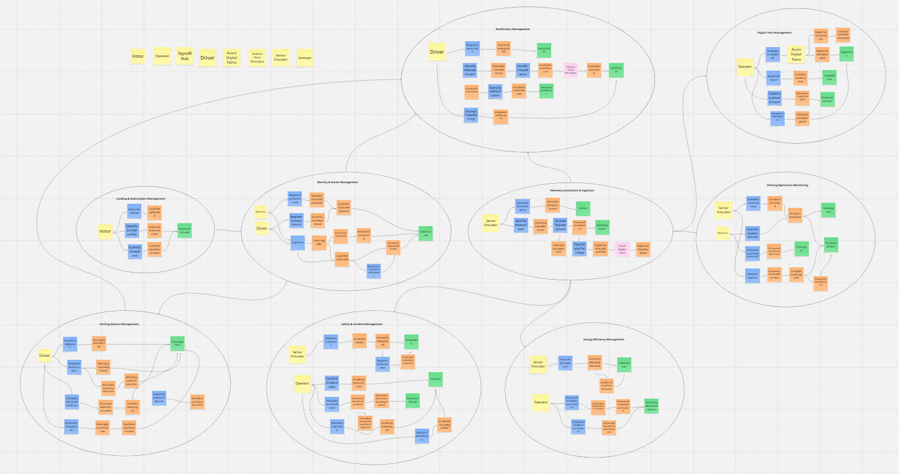

La vista general muestra que Telemetry Simulation & Ingestion origina eventos consumidos por monitoreo operativo, seguridad, eficiencia energética y gemelo digital. A su vez, Notification Management comunica alertas a los conductores.

**Landing & Subscription Management**

Este bounded context gestiona la captación comercial de visitantes interesados en la plataforma.

Se identificaron comandos como `ViewLandingPage`, `SelectSubscriptionPlan` y `SubmitContactForm`, que generan eventos como `LandingPageViewed`, `SubscriptionPlanSelected` y `ContactRequestSubmitted`.

El agregado principal es `SubscriptionLead`.

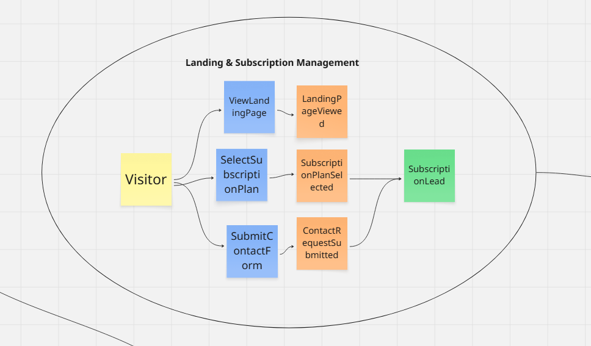

**Identity & Access Management**

Este bounded context administra registro, autenticación y control de acceso de usuarios.

Incluye comandos como `RegisterOperatorAccount`, `RegisterDriverAccount`, `LoginUser` y `RefreshAccessToken`, generando eventos como `UserLoggedIn`, `AccessTokenIssued` y `AccountTemporarilyBlocked`.

El agregado principal es `UserAccount`.

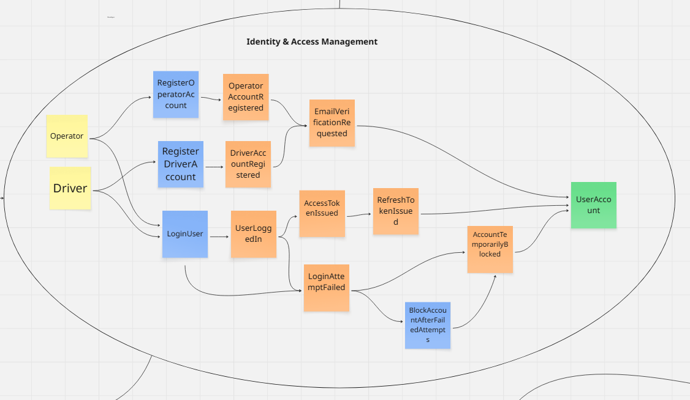

**Telemetry Simulation & Ingestion**

Este bounded context recibe y procesa datos operativos provenientes de sensores simulados o futuros sensores físicos.

Se modelaron comandos como `GenerateSensorReading`, `SendTelemetryEvent` y `PatchDigitalTwinState`, generando eventos como `TelemetryEventReceived`, `TelemetryEventValidated` y `DigitalTwinStateUpdated`.

Los agregados principales son `Sensor` y `TelemetryEvent`.

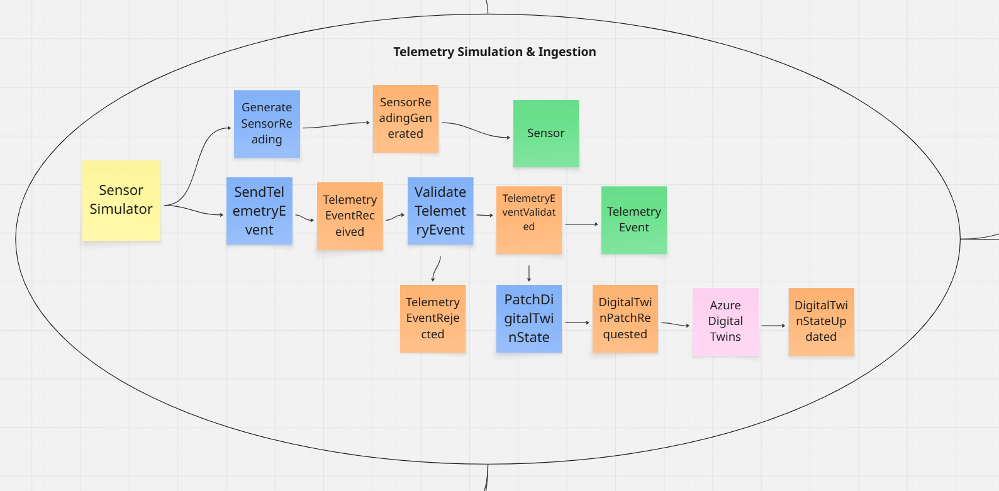

**Parking Operations Monitoring**

Este bounded context supervisa ocupación, disponibilidad y congestión vehicular.

Incluye comandos como `UpdateOccupancyStatus`, `QueryOccupancyByZone` y `DetectCongestion`, generando eventos como `OccupancyUpdated`, `ParkingZoneMarkedFull` y `CongestionAlertRaised`.

Los agregados principales son `ParkingLot`, `ParkingZone` y `OccupancyStatus`.

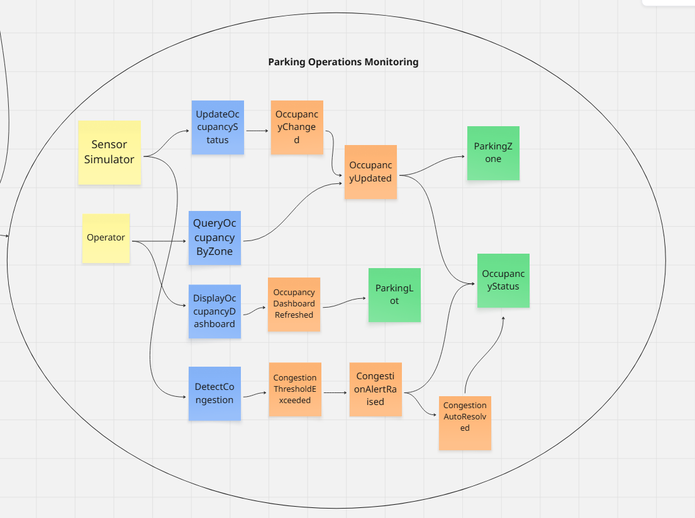

**Digital Twin Management**

Este bounded context administra la representación virtual del estacionamiento.

Se identificaron comandos como `LoadDigitalTwinModel`, `Render3DScene` y `SwitchVisualizationLayer`, produciendo eventos como `DigitalTwinModelLoaded`, `ThreeDSceneRendered` y `AffectedZoneHighlighted`.

Los agregados principales son `DigitalTwin`, `ThreeDScene` y `VisualizationLayer`.

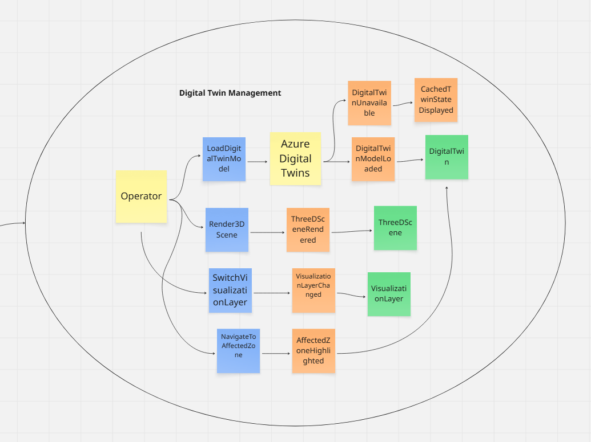

**Safety & Incident Management**

Este bounded context gestiona alertas críticas e incidentes de seguridad.

Incluye comandos como `RegisterSmokeAlert`, `ConfirmIncidentAlert` y `ResolveIncidentAlert`, generando eventos como `SmokeAlertRegistered`, `IncidentAlertConfirmed` e `IncidentAlertResolved`.

Los agregados principales son `Incident`, `SmokeAlert` y `EvacuationRoute`.

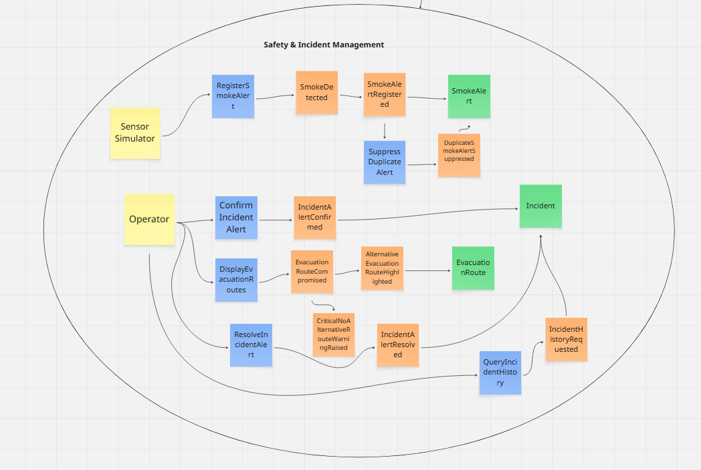

**Energy Efficiency Management**

Este bounded context transforma datos operativos en recomendaciones de ahorro energético.

Se modelaron comandos como `AnalyzeLightingByZone` y `GenerateDimmingRecommendation`, produciendo eventos como `LowOccupancyZoneDetected` y `DimmingRecommendationGenerated`.

Los agregados principales son `LightingZone` y `DimmingRecommendation`.

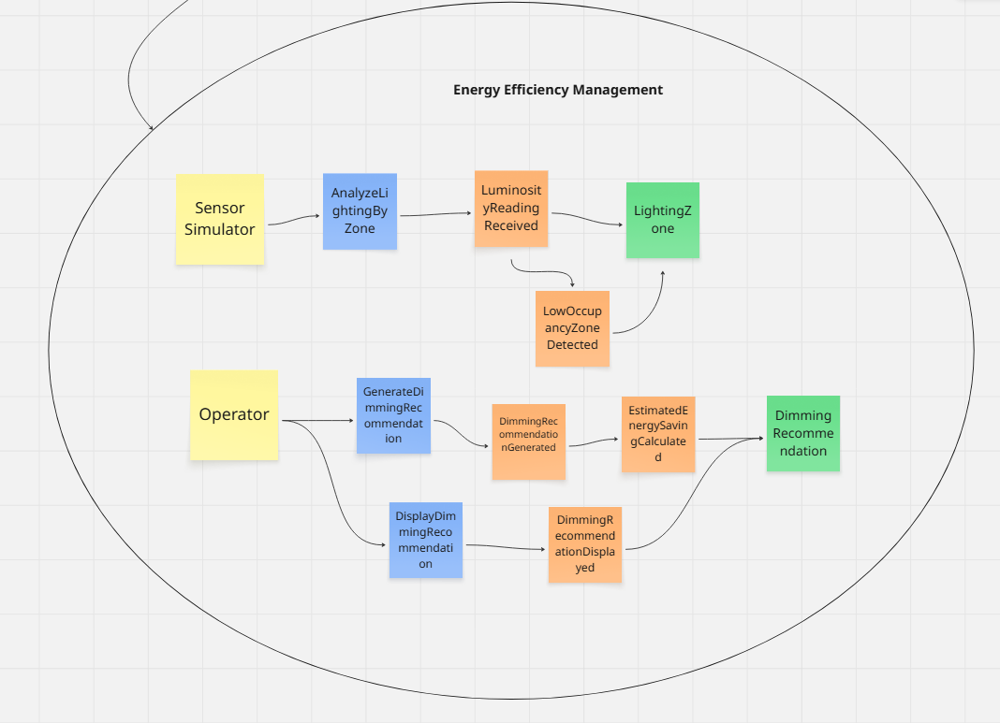

**Parking Session Management**

Este bounded context representa el ciclo de vida de la sesión de estacionamiento del conductor.

Incluye comandos como `StartParkingSession`, `RegisterVehicleLocation` y `FinalizeParkingSession`, generando eventos como `ParkingSessionStarted`, `AccumulatedCostCalculated` y `ParkingSessionFinalized`.

El agregado principal es `ParkingSession`.

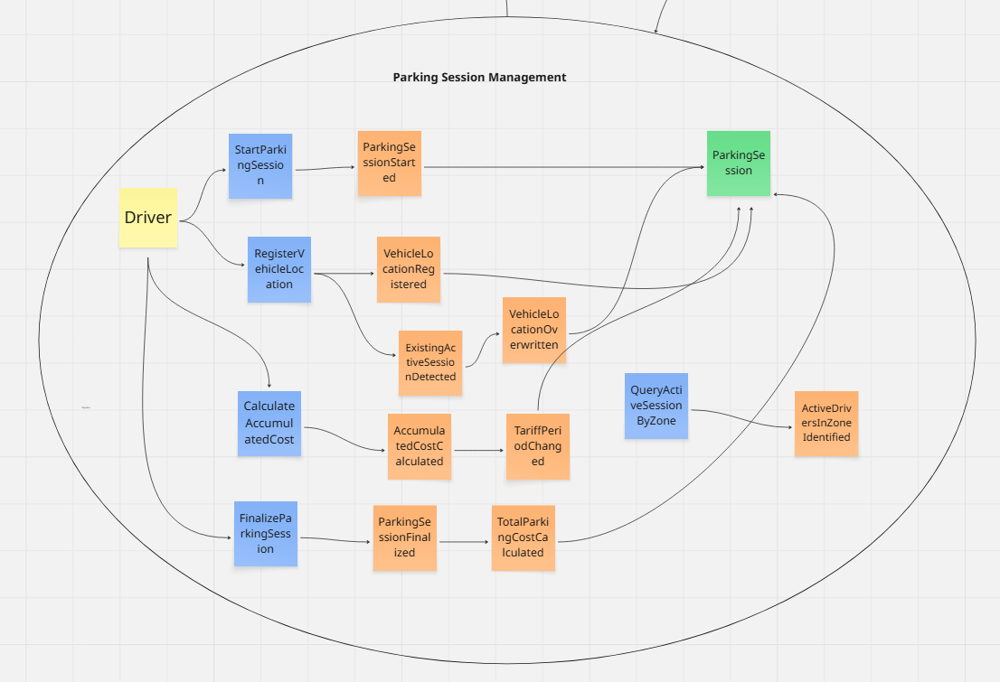

**Notification Management**

Este bounded context administra la comunicación reactiva hacia conductores.

Se identificaron comandos como `RegisterDeviceToken`, `IdentifyAffectedDrivers` y `SendPushNotification`, generando eventos como `PushNotificationSent`, `PushNotificationFailed` e `InAppWarningDisplayed`.

Los agregados principales son `DeviceToken`, `Notification` y `NotificationAttempt`.

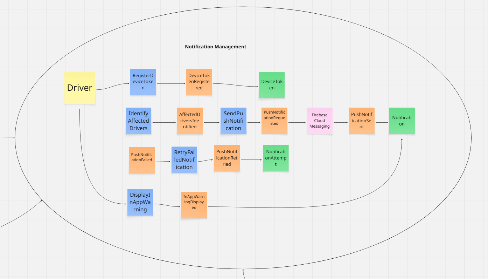

### 4.2.2. Candidate Context Discovery

A partir del EventStorming desarrollado, se realizó la identificación de bounded contexts candidatos para SmartPark. Este proceso consistió en agrupar eventos de dominio, comandos, actores y agregados que compartían una misma intención de negocio, evitando organizar el sistema únicamente por capas técnicas.

Para descubrir los contextos se aplicaron principalmente tres criterios: **start-with-value**, para partir de las capacidades que generan mayor valor para los stakeholders; **look-for-pivotal-events**, para identificar eventos que cambian el estado relevante del negocio; y **start-with-simple**, para separar primero los flujos más evidentes antes de refinar dependencias entre contextos.

En primer lugar, mediante **start-with-value**, se identificaron las capacidades principales que entregan valor directo a los usuarios: monitoreo de ocupación, visualización del gemelo digital, gestión de incidentes, sesión de estacionamiento del conductor y notificaciones de seguridad. Estas capacidades dieron origen a contextos como `Parking Operations Monitoring`, `Digital Twin Management`, `Safety & Incident Management`, `Parking Session Management` y `Notification Management`.

Luego, con **look-for-pivotal-events**, se analizaron eventos que representan cambios importantes dentro del dominio, tales como `DigitalTwinStateUpdated`, `OccupancyUpdated`, `SmokeAlertRegistered`, `IncidentAlertConfirmed`, `ParkingSessionStarted`, `ParkingSessionFinalized` y `PushNotificationSent`. Estos eventos permitieron detectar límites naturales entre responsabilidades, ya que cada uno pertenece a una preocupación distinta del negocio.

Finalmente, mediante **start-with-simple**, se separaron los flujos más directos y fáciles de aislar, como registro de usuarios, selección de planes, recepción de telemetría y generación de recomendaciones energéticas. Esto permitió definir contextos de soporte como `Landing & Subscription Management`, `Identity & Access Management`, `Telemetry Simulation & Ingestion` y `Energy Efficiency Management`.

Como resultado, se identificaron los siguientes bounded contexts candidatos:

| Bounded Context candidato         | Justificación                                                            |
|-----------------------------------|--------------------------------------------------------------------------|
| Landing & Subscription Management | Gestiona la captación de visitantes y selección de planes.               |
| Identity & Access Management      | Administra registro, autenticación, tokens y roles.                      |
| Telemetry Simulation & Ingestion  | Recibe, valida y sincroniza eventos de sensores simulados o físicos.     |
| Parking Operations Monitoring     | Supervisa ocupación, disponibilidad y congestión.                        |
| Digital Twin Management           | Representa visualmente el estacionamiento mediante el gemelo digital 3D. |
| Safety & Incident Management      | Gestiona alertas de humo, evacuación e incidentes.                       |
| Energy Efficiency Management      | Genera recomendaciones de atenuación y ahorro energético.                |
| Parking Session Management        | Administra la sesión de estacionamiento del Driver.                      |
| Notification Management           | Envía alertas push y gestiona reintentos de notificación.                |

En conclusión, el descubrimiento de contextos candidatos permitió transformar los eventos identificados en el EventStorming en límites de dominio más claros, alineados con responsabilidades de negocio y preparados para una arquitectura modular y orientada a eventos.

### 4.2.3. Domain Message Flows Modeling

Con los bounded contexts candidatos ya identificados, se procedió a modelar los flujos de colaboración entre dominios mediante **Domain Storytelling**, técnica orientada a representar cómo distintos actores y contextos cooperan para ejecutar procesos relevantes del negocio. A diferencia del EventStorming, centrado en eventos internos, esta etapa permitió visualizar mensajes, dependencias y secuencia de interacción entre bounded contexts.

El objetivo principal fue comprender cómo viaja la información dentro de SmartPark desde que ocurre un estímulo operativo hasta que se genera una respuesta útil para operadores o conductores. Para ello, se modelaron historias de dominio clave relacionadas con monitoreo en tiempo real, incidentes críticos, sesiones de estacionamiento y eficiencia energética.

Se utilizó una notación simple basada en actores, acciones y objetos intercambiados entre bounded contexts. Cada historia fue construida desde la perspectiva del negocio, evitando detalles técnicos de implementación y enfocándose en la colaboración entre capacidades del sistema.

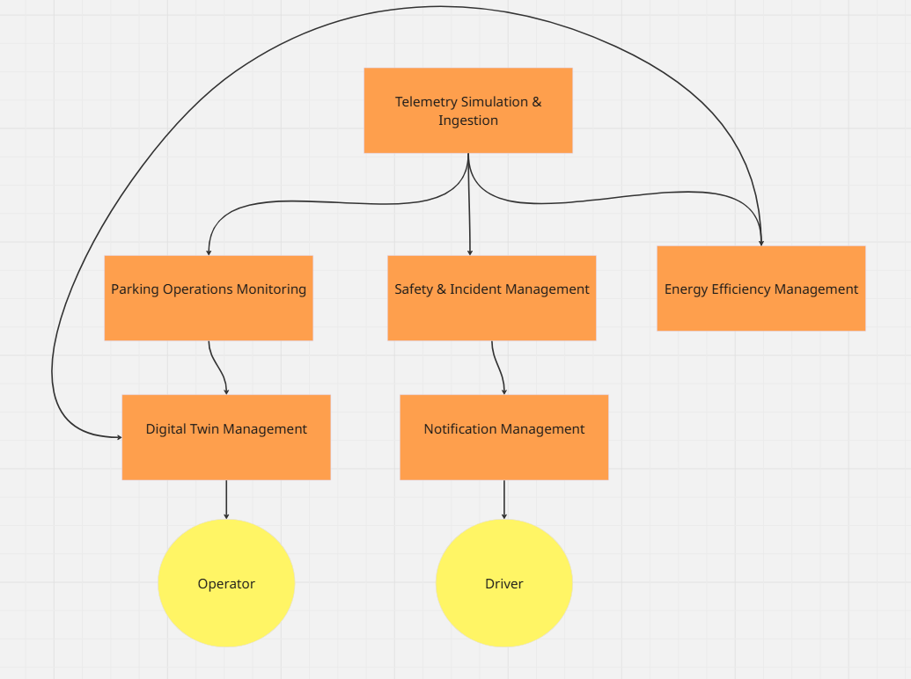

A partir del modelado realizado, se identificaron los siguientes flujos principales:

**Flujo 1: Actualización de ocupación en tiempo real**

El `Sensor Simulator` genera lecturas periódicas que son recibidas por `Telemetry Simulation & Ingestion`. Luego, la información validada es enviada a `Parking Operations Monitoring`, donde se recalcula la ocupación por zonas. Finalmente, `Digital Twin Management` actualiza la visualización 3D mostrada al operador.

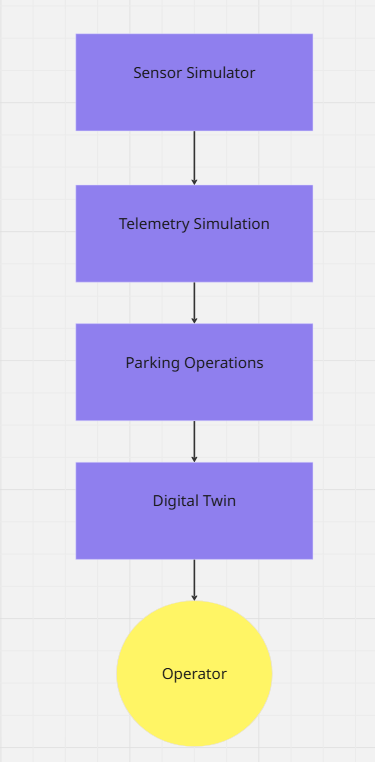

**Flujo 2: Gestión de alerta de humo**

Cuando un sensor detecta humo, `Telemetry Simulation & Ingestion` comunica el evento a `Safety & Incident Management`, donde se registra y confirma la alerta. Paralelamente, `Telemetry Simulation & Ingestion` publica el evento `DigitalTwinStateUpdated` que consume `Digital Twin Management` para resaltar la zona afectada. Adicionalmente, `Notification Management` recibe el evento de incidente confirmado y envía alertas push a los conductores impactados.

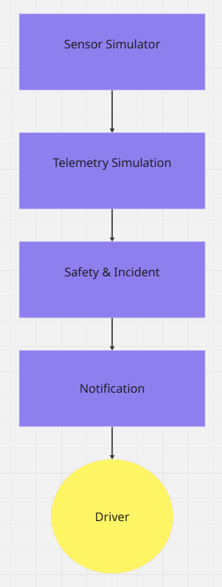

**Flujo 3: Inicio y cierre de sesión de estacionamiento**

El `Driver` inicia una sesión desde la aplicación móvil. `Parking Session Management` registra ubicación, calcula costo acumulado y finalmente procesa el cierre de la sesión cuando el usuario abandona el estacionamiento.

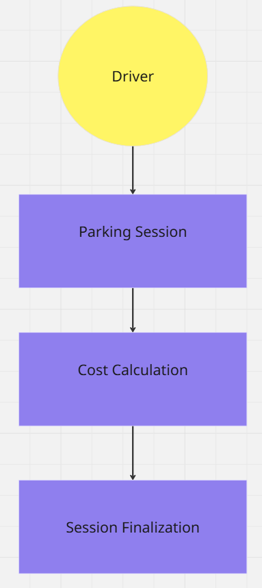

**Flujo 4: Optimización energética**

Los datos de luminosidad y ocupación son procesados por `Energy Efficiency Management`, que genera recomendaciones de atenuación visualizadas posteriormente en el gemelo digital para el operador.

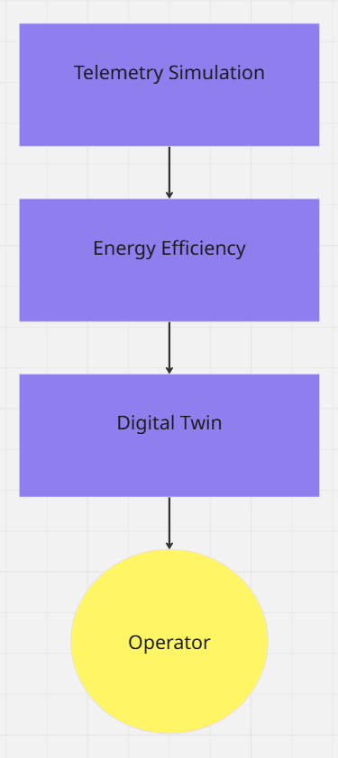

El ejercicio permitió detectar relaciones críticas entre bounded contexts y confirmar que SmartPark requiere comunicación desacoplada basada en mensajes y eventos de dominio. Asimismo, evidenció que contextos como `Telemetry Simulation & Ingestion` y `Notification Management` cumplen roles transversales dentro del ecosistema.

### 4.2.4. Bounded Context Canvases

Con los bounded contexts ya identificados y validados mediante EventStorming y Domain Message Flows, se procedió a elaborar los **Bounded Context Canvases**. Esta herramienta permitió describir cada contexto desde una perspectiva estratégica, detallando su propósito, responsabilidades, actores principales, modelos internos, relaciones externas y nivel de importancia dentro del ecosistema SmartPark.

El uso de canvases facilitó consolidar decisiones de diseño, reducir ambigüedad entre dominios y dejar explícitos los límites funcionales de cada contexto antes de avanzar hacia el Context Map y el diseño táctico posterior.

A continuación, se presentan los canvases de los nueve bounded contexts del sistema.

#### Landing & Subscription Management Canvas

| Elemento              | Descripción                                                                                                                                       |
|-----------------------|---------------------------------------------------------------------------------------------------------------------------------------------------|
| Nombre del Contexto   | Landing & Subscription Management                                                                                                                 |
| Propósito             | Captar visitantes interesados en la plataforma y gestionar la selección de planes de suscripción.                                                 |
| Responsabilidades     | Presentar el modelo de negocio de SmartPark, gestionar formularios de contacto, registrar leads de suscripción y redirigir al registro de cuenta. |
| Actores Principales   | Visitor                                                                                                                                           |
| Objetos de Negocio    | SubscriptionLead, SubscriptionPlan                                                                                                                |
| Eventos Clave         | LandingPageViewed, SubscriptionPlanSelected, ContactRequestSubmitted                                                                              |
| Relaciones            | Consume interfaces públicas de Identity & Access Management vía Open Host Service para el registro de nuevas cuentas de Operator                  |
| Tipo de Subdominio    | Generic                                                                                                                                           |
| Prioridad Estratégica | Media                                                                                                                                             |

#### Identity & Access Management Canvas

| Elemento              | Descripción                                                                                                                                                                |
|-----------------------|----------------------------------------------------------------------------------------------------------------------------------------------------------------------------|
| Nombre del Contexto   | Identity & Access Management                                                                                                                                               |
| Propósito             | Administrar el registro, autenticación, autorización y control de acceso de todos los usuarios del sistema.                                                                |
| Responsabilidades     | Registro de cuentas Operator y Driver, emisión y renovación de tokens JWT, bloqueo por intentos fallidos consecutivos, validación de roles mediante claims.                |
| Actores Principales   | Operator, Driver                                                                                                                                                           |
| Objetos de Negocio    | UserAccount, AccessToken, RefreshToken                                                                                                                                     |
| Eventos Clave         | UserRegistered, UserLoggedIn, AccessTokenIssued, AccountTemporarilyBlocked                                                                                                 |
| Relaciones            | Actúa como Shared Kernel para Parking Session Management, Digital Twin Management y Notification Management; expone Open Host Service al Landing & Subscription Management |
| Tipo de Subdominio    | Generic                                                                                                                                                                    |
| Prioridad Estratégica | Alta                                                                                                                                                                       |

#### Telemetry Simulation & Ingestion Canvas

| Elemento              | Descripción                                                                                                                                 |
|-----------------------|---------------------------------------------------------------------------------------------------------------------------------------------|
| Nombre del Contexto   | Telemetry Simulation & Ingestion                                                                                                            |
| Propósito             | Recibir, validar y distribuir datos provenientes de sensores simulados o físicos.                                                           |
| Responsabilidades     | Generación de lecturas, validación de eventos, sincronización con Azure Digital Twins.                                                      |
| Actores Principales   | Sensor Simulator, Developer                                                                                                                 |
| Objetos de Negocio    | Sensor, TelemetryEvent                                                                                                                      |
| Eventos Clave         | TelemetryEventReceived, TelemetryEventValidated, DigitalTwinStateUpdated                                                                    |
| Relaciones            | Proveedor de datos para Parking Operations Monitoring, Safety & Incident Management, Energy Efficiency Management y Digital Twin Management |
| Tipo de Subdominio    | Supporting                                                                                                                                  |
| Prioridad Estratégica | Alta                                                                                                                                        |

#### Parking Operations Monitoring Canvas

| Elemento              | Descripción                                                                                 |
|-----------------------|---------------------------------------------------------------------------------------------|
| Nombre del Contexto   | Parking Operations Monitoring                                                               |
| Propósito             | Supervisar ocupación, disponibilidad y congestión vehicular.                                |
| Responsabilidades     | Recalcular ocupación, detectar zonas llenas, alertar congestión.                            |
| Actores Principales   | Operator                                                                                    |
| Objetos de Negocio    | ParkingLot, ParkingZone, OccupancyStatus                                                    |
| Eventos Clave         | OccupancyUpdated, ParkingZoneMarkedFull, CongestionAlertRaised                              |
| Relaciones            | Consume telemetría de Telemetry Simulation & Ingestion y alimenta a Digital Twin Management |
| Tipo de Subdominio    | Core                                                                                        |
| Prioridad Estratégica | Muy Alta                                                                                    |

#### Digital Twin Management Canvas

| Elemento              | Descripción                                                                                                                                     |
|-----------------------|-------------------------------------------------------------------------------------------------------------------------------------------------|
| Nombre del Contexto   | Digital Twin Management                                                                                                                         |
| Propósito             | Representar visualmente el estado operativo del estacionamiento en 3D.                                                                          |
| Responsabilidades     | Renderizar escena, cambiar capas, resaltar zonas críticas.                                                                                      |
| Actores Principales   | Operator                                                                                                                                        |
| Objetos de Negocio    | DigitalTwin, ThreeDScene, VisualizationLayer                                                                                                    |
| Eventos Clave         | ThreeDSceneRendered, AffectedZoneHighlighted                                                                                                    |
| Relaciones            | Consume eventos de Telemetry Simulation & Ingestion, Parking Operations Monitoring, Safety & Incident Management y Energy Efficiency Management |
| Tipo de Subdominio    | Core                                                                                                                                            |
| Prioridad Estratégica | Muy Alta                                                                                                                                        |

#### Safety & Incident Management Canvas

| Elemento              | Descripción                                                                                                                              |
|-----------------------|------------------------------------------------------------------------------------------------------------------------------------------|
| Nombre del Contexto   | Safety & Incident Management                                                                                                             |
| Propósito             | Detectar, confirmar y resolver incidentes críticos.                                                                                      |
| Responsabilidades     | Gestión de humo, evacuación, trazabilidad de incidentes.                                                                                 |
| Actores Principales   | Operator, Sensor Simulator                                                                                                               |
| Objetos de Negocio    | Incident, SmokeAlert, EvacuationRoute                                                                                                    |
| Eventos Clave         | SmokeAlertRegistered, IncidentAlertConfirmed, IncidentAlertResolved                                                                      |
| Relaciones            | Consume telemetría de Telemetry Simulation & Ingestion; publica eventos de incidente a Notification Management y Digital Twin Management |
| Tipo de Subdominio    | Core                                                                                                                                     |
| Prioridad Estratégica | Muy Alta                                                                                                                                 |

#### Parking Session Management Canvas

| Elemento              | Descripción                                                                                                                                         |
|-----------------------|-----------------------------------------------------------------------------------------------------------------------------------------------------|
| Nombre del Contexto   | Parking Session Management                                                                                                                          |
| Propósito             | Gestionar la sesión activa del conductor dentro del estacionamiento.                                                                                |
| Responsabilidades     | Inicio de sesión, ubicación del vehículo, costo acumulado, cierre.                                                                                  |
| Actores Principales   | Driver                                                                                                                                              |
| Objetos de Negocio    | ParkingSession                                                                                                                                      |
| Eventos Clave         | ParkingSessionStarted, AccumulatedCostCalculated, ParkingSessionFinalized                                                                           |
| Relaciones            | Actúa como upstream de Notification Management; Notification consulta sesiones activas para identificar conductores afectados en zonas de incidente |
| Tipo de Subdominio    | Core                                                                                                                                                |
| Prioridad Estratégica | Alta                                                                                                                                                |

#### Notification Management Canvas

| Elemento                | Descripción                                                                                                                                    |
|-------------------------|------------------------------------------------------------------------------------------------------------------------------------------------|
| Nombre del Contexto     | Notification Management                                                                                                                        |
| Propósito               | Comunicar alertas relevantes a conductores.                                                                                                    |
| Responsabilidades       | Registro de tokens, envío push, reintentos y warnings in-app.                                                                                  |
| Actores Principales     | Driver                                                                                                                                         |
| Objetos de Negocio      | DeviceToken, Notification, NotificationAttempt                                                                                                 |
| Eventos Clave           | PushNotificationSent, PushNotificationFailed                                                                                                   |
| Relaciones              | Consume eventos de Safety & Incident Management; consulta sesiones activas a Parking Session Management para identificar conductores afectados |
| Tipo de Subdominio      | Supporting                                                                                                                                     |
| Prioridad Estratégica   | Alta                                                                                                                                           |

#### Energy Efficiency Management Canvas

| Elemento              | Descripción                                                                                                                  |
|-----------------------|------------------------------------------------------------------------------------------------------------------------------|
| Nombre del Contexto   | Energy Efficiency Management                                                                                                 |
| Propósito             | Generar recomendaciones de ahorro energético por zona.                                                                       |
| Responsabilidades     | Analizar luminosidad, detectar baja ocupación, recomendar atenuación.                                                        |
| Actores Principales   | Operator                                                                                                                     |
| Objetos de Negocio    | LightingZone, DimmingRecommendation                                                                                          |
| Eventos Clave         | LowOccupancyZoneDetected, DimmingRecommendationGenerated                                                                     |
| Relaciones            | Consume telemetría de Telemetry Simulation & Ingestion; alimenta a Digital Twin Management con recomendaciones de atenuación |
| Tipo de Subdominio    | Supporting                                                                                                                   |
| Prioridad Estratégica | Media                                                                                                                        |

Los Bounded Context Canvases permitieron consolidar la visión estratégica de SmartPark, definiendo responsabilidades claras para cada dominio y facilitando la siguiente etapa de diseño: el Context Map y las relaciones formales entre contextos.

### 4.2.5. Context Mapping

Con los bounded contexts previamente identificados, se elaboró el **Context Map** de SmartPark con el propósito de representar visualmente las relaciones estratégicas entre dominios, sus dependencias funcionales y los mecanismos de colaboración necesarios para mantener una arquitectura desacoplada y escalable.

Para su construcción, primero se identificaron los bounded contexts que actúan como proveedores de información (**upstream**) y aquellos que consumen capacidades o datos (**downstream**). Posteriormente, se analizaron los flujos definidos en EventStorming y Domain Message Flows, especialmente los relacionados con telemetría operativa, monitoreo de ocupación, gestión de incidentes, sesiones activas y notificaciones a conductores.

A partir de dicho análisis, se seleccionaron los patrones de relación más adecuados para cada interacción. Se aplicó **Published Language** para intercambio de eventos mediante contratos comunes, **Customer/Supplier** cuando existe dependencia funcional entre proveedor y consumidor, **Conformist** cuando un contexto adopta el modelo externo existente, **Shared Kernel** para elementos compartidos como autenticación y seguridad, y **Open Host Service** para interfaces públicas reutilizables.

La siguiente figura presenta el Context Map general de SmartPark, mientras que en la tabla posterior se detallan las relaciones identificadas entre bounded contexts, junto con el patrón aplicado y su respectiva justificación.

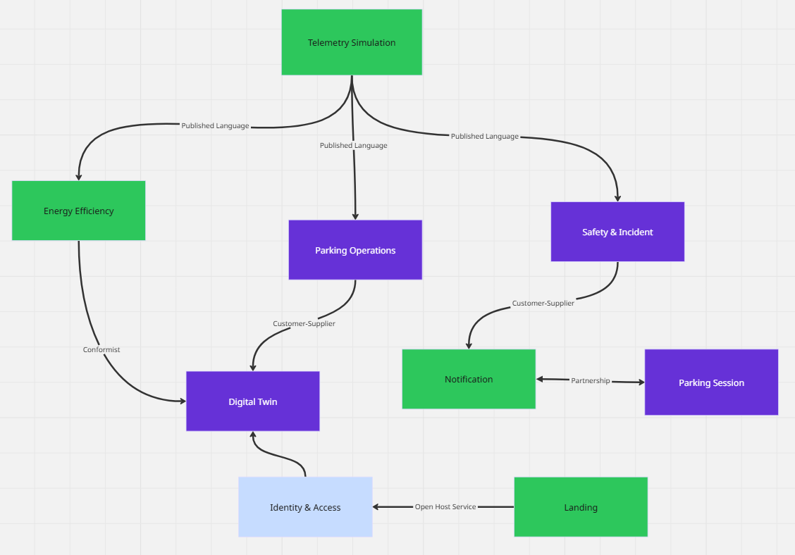

**Relaciones entre Bounded Contexts:**

| Upstream                          | Downstream                    | Patrón             | Justificación                                                                                                                                                                                                                    |
|-----------------------------------|-------------------------------|--------------------|----------------------------------------------------------------------------------------------------------------------------------------------------------------------------------------------------------------------------------|
| Telemetry Simulation & Ingestion  | Parking Operations Monitoring | Published Language | Publica eventos de ocupación y flujo vehicular consumidos por monitoreo operativo.                                                                                                                                               |
| Telemetry Simulation & Ingestion  | Safety & Incident Management  | Published Language | Publica eventos críticos de sensores utilizados para detección de humo e incidentes.                                                                                                                                             |
| Telemetry Simulation & Ingestion  | Energy Efficiency Management  | Published Language | Comparte lecturas de luminosidad y ocupación usadas para recomendaciones energéticas.                                                                                                                                            |
| Telemetry Simulation & Ingestion  | Digital Twin Management       | Published Language | Publica el evento DigitalTwinStateUpdated que Digital Twin Management consume para mantener el grafo de twins sincronizado con el estado en vivo del estacionamiento.                                                            |
| Parking Operations Monitoring     | Digital Twin Management       | Customer/Supplier  | Digital Twin Management depende de los datos de ocupación calculados por Parking Operations para actualizar la capa visual de ocupación del modelo 3D.                                                                           |
| Safety & Incident Management      | Notification Management       | Customer/Supplier  | Notification Management consume incidentes confirmados para alertar a conductores afectados.                                                                                                                                     |
| Parking Session Management        | Notification Management       | Customer/Supplier  | Parking Session Management actúa como upstream publicando eventos de sesiones activas; Notification Management los consume para identificar qué conductores tienen vehículos en zonas de incidente sin acoplar Sesiones con FCM. |
| Energy Efficiency Management      | Digital Twin Management       | Conformist         | Digital Twin Management adopta las recomendaciones energéticas generadas sin modificar el modelo origen.                                                                                                                         |
| Identity & Access Management      | Parking Session Management    | Shared Kernel      | Comparte autenticación, roles y validación de tokens.                                                                                                                                                                            |
| Identity & Access Management      | Digital Twin Management       | Shared Kernel      | El acceso del operador depende de identidad y autorización centralizadas.                                                                                                                                                        |
| Identity & Access Management      | Notification Management       | Shared Kernel      | El acceso a preferencias y seguridad reutiliza el modelo común de identidad.                                                                                                                                                     |
| Landing & Subscription Management | Identity & Access Management  | Open Host Service  | Landing & Subscription Management consume interfaces públicas de registro y creación de cuentas expuestas por Identity & Access Management.                                                                                      |


## 4.3. Software Architecture

En esta sección se presenta la representación de la arquitectura de software de la plataforma SmartPark, aplicando el C4 Model y utilizando Structurizr como herramienta de modelado. La arquitectura refleja las decisiones de diseño tomadas durante el proceso de Attribute-Driven Design y Domain-Driven Design documentados en las secciones previas de este capítulo, y responde a los Quality Attribute Scenarios priorizados —en particular latencia sub-segundo para alertas de humo, disponibilidad del 99.5% para el dashboard del operador y escalabilidad para el procesamiento continuo de telemetría de sensores IoT.

Los diagramas se organizan en cuatro niveles de abstracción: System Landscape (contexto global del ecosistema), Context (interacciones del sistema con usuarios y sistemas externos), Container (componentes de alto nivel y sus tecnologías) y Deployment (distribución física sobre la infraestructura cloud).

---

### 4.3.1. Software Architecture System Landscape Diagram

El diagrama de System Landscape muestra el ecosistema completo en el que opera la plataforma SmartPark, incluyendo los sistemas de software, los usuarios que interactúan con ellos y las relaciones entre todos los elementos del panorama tecnológico. Este nivel de vista permite comprender cómo SmartPark se inserta en el contexto más amplio de la operación de un centro comercial.

El ecosistema se compone de tres actores principales y tres sistemas. Los **operadores de estacionamiento** —jefes de operaciones, supervisores de seguridad y facility managers— interactúan con la plataforma SmartPark a través de la aplicación web para monitorear el estado integral del estacionamiento. Los **conductores frecuentes** utilizan la aplicación móvil para consultar disponibilidad, registrar la ubicación de su vehículo y recibir alertas de seguridad. El **simulador IoT** actúa como fuente de datos que alimenta al sistema con telemetría sintética de sensores de ocupación, detectores de humo, contadores de flujo vehicular y sensores de luminosidad.

La plataforma SmartPark constituye el sistema central del landscape, encargada de procesar la telemetría, mantener el gemelo digital sincronizado, exponer la lógica de negocio a través de APIs RESTful y servir las experiencias de usuario para ambos segmentos. El sistema interactúa con dos sistemas externos: **Azure Digital Twins**, que actúa como single source of truth del estado espacial del estacionamiento mediante un grafo de twins modelado en DTDL, y **Firebase Cloud Messaging (FCM)**, que gestiona el envío de notificaciones push a los dispositivos móviles de los conductores cuando se detectan incidentes de seguridad en la zona donde se encuentra su vehículo.


**Código Structurizr DSL:**

```dsl
workspace "SmartPark - System Landscape" {

    model {
        // Personas
        operator = person "Operador de Estacionamiento" "Jefe de operaciones, supervisor de seguridad o facility manager del centro comercial. Monitorea ocupación, seguridad, flujo vehicular y eficiencia energética." "Operator"
        driver = person "Conductor Frecuente" "Persona entre 25-55 años que visita centros comerciales semanalmente con vehículo propio. Consulta disponibilidad y registra ubicación." "Driver"

        // Sistema principal
        parkSenseSystem = softwareSystem "SmartPark Platform" "Plataforma SaaS de gestión inteligente de estacionamientos basada en gemelos digitales. Integra ocupación, seguridad, flujo vehicular y eficiencia energética en un modelo 3D unificado." "SmartPark"

        // Sistemas externos
        azureDigitalTwins = softwareSystem "Azure Digital Twins" "Servicio de Azure que mantiene el grafo de gemelos digitales del estacionamiento, modelado en DTDL. Almacena el estado espacial de plazas, zonas, niveles, detectores y accesos." "External"
        firebaseCM = softwareSystem "Firebase Cloud Messaging" "Servicio de Google para el envío de notificaciones push a dispositivos móviles Android e iOS." "External"

        // Componente de simulación
        iotSimulator = softwareSystem "Simulador IoT" "Servicio Node.js que genera datos sintéticos de sensores (ocupación, humo, flujo, luminosidad) siguiendo patrones realistas y los sincroniza con Azure Digital Twins." "IoTSimulator"

        // Relaciones
        operator -> parkSenseSystem "Monitorea el estacionamiento, gestiona incidentes y consulta indicadores operativos" "HTTPS"
        driver -> parkSenseSystem "Consulta disponibilidad, registra ubicación del vehículo, consulta costo y recibe alertas de seguridad" "HTTPS"
        parkSenseSystem -> azureDigitalTwins "Consulta y actualiza el estado del grafo de twins" "HTTPS / Azure SDK"
        parkSenseSystem -> firebaseCM "Envía notificaciones push a conductores ante incidentes de seguridad" "HTTPS / FCM API"
        iotSimulator -> azureDigitalTwins "Envía telemetría simulada de sensores mediante JSON Patch" "HTTPS / Azure SDK"
        iotSimulator -> parkSenseSystem "Notifica eventos de alerta de humo al Web Service" "HTTPS / REST"
    }

    views {
        systemLandscape "SystemLandscape" "Panorama del ecosistema SmartPark" {
            include *
            autoLayout
        }

        styles {
            element "Person" {
                shape Person
            }
            element "SmartPark" {
                background #1168bd
                color #ffffff
            }
            element "External" {
                background #999999
                color #ffffff
            }
            element "IoTSimulator" {
                background #438dd5
                color #ffffff
            }
        }
    }
}
```

---

### 4.3.2. Software Architecture Context Level Diagram

El diagrama de contexto presenta la plataforma SmartPark como un único recuadro central, rodeada por los usuarios y sistemas externos con los que interactúa. Este nivel de abstracción permite comprender los límites del sistema y las dependencias externas sin entrar en el detalle de su composición interna.

El operador de estacionamiento accede a la plataforma mediante un navegador web (Google Chrome, desde una estación de trabajo con monitor grande en el centro de control del estacionamiento) para visualizar el gemelo digital 3D, monitorear la ocupación en tiempo real, gestionar alertas de humo, supervisar el flujo vehicular y consultar las recomendaciones de eficiencia energética. La comunicación se establece sobre HTTPS.

El conductor frecuente accede a la plataforma mediante la aplicación móvil construida en Microsoft PowerApps, instalada en su smartphone Android. A través de esta aplicación consulta la disponibilidad de plazas por nivel y zona, registra la ubicación de su vehículo, consulta el costo acumulado de su estancia y recibe alertas de seguridad. La comunicación con el backend se realiza sobre HTTPS mediante un conector HTTP custom de PowerApps.

La plataforma SmartPark se comunica con Azure Digital Twins para consultar y actualizar el estado del grafo de gemelos digitales que representa la estructura espacial del estacionamiento (plazas, zonas, niveles, detectores de humo, puntos de acceso, rampas y zonas de iluminación). El simulador IoT alimenta directamente a Azure Digital Twins con telemetría simulada y notifica al Web Service de SmartPark cuando se producen eventos de alerta de humo. Firebase Cloud Messaging recibe solicitudes del Web Service para despachar notificaciones push a los conductores cuyos vehículos se encuentran en zonas afectadas por un incidente de seguridad.


**Código Structurizr DSL:**

```dsl
workspace "SmartPark - Context Diagram" {

    model {
        operator = person "Operador de Estacionamiento" "Monitorea ocupación, gestiona incidentes de seguridad, supervisa flujo vehicular y consulta eficiencia energética desde el centro de control." "Operator"
        driver = person "Conductor Frecuente" "Consulta disponibilidad de plazas, registra ubicación del vehículo, consulta costo acumulado y recibe alertas de seguridad desde su smartphone." "Driver"

        parkSenseSystem = softwareSystem "SmartPark Platform" "Plataforma SaaS que integra ocupación, seguridad, flujo vehicular y eficiencia energética en un gemelo digital 3D unificado para la gestión inteligente de estacionamientos en centros comerciales." {
            // Containers se definen en el siguiente diagrama
        }

        azureDigitalTwins = softwareSystem "Azure Digital Twins" "Servicio PaaS de Microsoft Azure que almacena y gestiona el grafo de gemelos digitales del estacionamiento, modelado en DTDL (Digital Twin Definition Language)." "External"
        firebaseCM = softwareSystem "Firebase Cloud Messaging" "Servicio de Google para el envío de notificaciones push multiplataforma a dispositivos móviles." "External"
        iotSimulator = softwareSystem "Simulador IoT" "Servicio Node.js que genera telemetría sintética de sensores siguiendo patrones realistas de ocupación, humo, flujo y luminosidad." "External"

        // Relaciones
        operator -> parkSenseSystem "Visualiza dashboard 3D, gestiona alertas de humo, monitorea flujo vehicular y consulta eficiencia energética" "HTTPS / Web Browser"
        driver -> parkSenseSystem "Consulta disponibilidad, registra ubicación, consulta costo y recibe alertas" "HTTPS / PowerApps"
        parkSenseSystem -> azureDigitalTwins "Lee y actualiza el estado de los twins del estacionamiento" "HTTPS / Azure.DigitalTwins.Core SDK"
        parkSenseSystem -> firebaseCM "Despacha notificaciones push a conductores en zonas afectadas por incidentes" "HTTPS / FCM Admin SDK"
        iotSimulator -> azureDigitalTwins "Publica telemetría simulada de sensores mediante operaciones JSON Patch" "HTTPS / @azure/digital-twins-core SDK"
        iotSimulator -> parkSenseSystem "Envía eventos de alerta de humo al endpoint POST /api/v1/alerts/smoke" "HTTPS / REST"
    }

    views {
        systemContext parkSenseSystem "ContextDiagram" "Diagrama de contexto de la plataforma SmartPark" {
            include *
            autoLayout
        }

        styles {
            element "Person" {
                shape Person
            }
            element "Software System" {
                background #1168bd
                color #ffffff
            }
            element "External" {
                background #999999
                color #ffffff
            }
        }
    }
}
```

---

### 4.3.3. Software Architecture Container Level Diagram

El diagrama de contenedores muestra los elementos de alto nivel de la arquitectura de software de SmartPark, cómo se distribuyen las responsabilidades entre ellos, las principales decisiones de tecnología y cómo los containers se comunican entre sí. Un container en el modelo C4 representa una unidad ejecutable o desplegable por separado: una aplicación, un almacén de datos, un servicio.

La plataforma SmartPark se descompone en seis containers principales:

El **Landing Page** es un sitio web estático construido con HTML5, CSS3 y JavaScript vanilla, desplegado en GitHub Pages. Presenta el modelo de negocio de SmartPark a visitantes de ambos segmentos objetivo (operadores y conductores), con contenido diferenciado, planes de suscripción, testimonios y llamadas a acción que redirigen al registro de la Web Application o a la descarga de la Mobile Application. Implementa internacionalización (i18n) con soporte para inglés (en_US) como idioma por defecto y español latinoamericano (es_419), y accesibilidad (a11y) mediante atributos ARIA.

La **Web Application del Operador** es una Single Page Application desarrollada en Angular con PrimeNG como biblioteca de componentes de UI, siguiendo el lenguaje de diseño Material Design. Su funcionalidad central es la visualización del gemelo digital 3D del estacionamiento, embebido mediante un iframe de Azure Digital Twins 3D Scenes Studio, complementada con paneles de datos para ocupación en tiempo real, alertas de seguridad con localización espacial, flujo vehicular en accesos y rampas, y recomendaciones de eficiencia energética. Se comunica con el Web Service vía HTTPS/REST para datos tabulares y vía SignalR (WebSocket) para la recepción de alertas en tiempo real. Se despliega en Azure Static Web Apps.

La **Mobile Application del Conductor** es una Canvas App construida en Microsoft PowerApps como solución low-code. Permite al conductor consultar la disponibilidad de plazas por nivel y zona, registrar la ubicación de su vehículo con un toque, monitorear el costo acumulado de su estancia, consultar su historial de sesiones y recibir alertas de seguridad. Se comunica con el Web Service a través de un conector HTTP custom configurado en PowerApps. Las notificaciones push se reciben vía Firebase Cloud Messaging.

El **Web Service (API)** es una aplicación RESTful construida con ASP.NET Core 8 y C#, organizada como modular monolith siguiendo los bounded contexts identificados en el proceso de Domain-Driven Design: Parking Occupancy, Safety & Incidents, Traffic Flow, Energy Management, Parking Session, Notifications, Identity & Access Management y Digital Twin Synchronization. Expone endpoints RESTful documentados con OpenAPI/Swagger, implementa autenticación basada en JWT, comunica alertas en tiempo real al dashboard del operador mediante SignalR, y orquesta el despacho de notificaciones push vía Firebase Cloud Messaging. El contexto de Digital Twin Synchronization actúa como capa anti-corrupción que abstrae las llamadas al SDK de Azure Digital Twins, de modo que los demás bounded contexts no interactúan directamente con el servicio externo. Se despliega en Azure App Service (tier F1/B1).

La **Base de Datos de Sesiones** es una instancia de PostgreSQL alojada en Azure Database for PostgreSQL (tier flexible). Almacena los datos transaccionales que no pertenecen al gemelo digital: sesiones de estacionamiento de los conductores (con hora de entrada, hora de salida, ubicación registrada, tarifa aplicada y costo total), credenciales de usuarios (operadores y conductores), device tokens de FCM y el log de incidentes de seguridad. El Web Service accede a esta base de datos mediante Entity Framework Core.

El **Simulador IoT** es un servicio Node.js independiente que genera datos sintéticos de cuatro tipos de sensores: ocupación por plaza (variando según hora del día y patrones de demanda), detección de humo (eventos aleatorios de baja probabilidad), conteo de flujo vehicular en accesos y rampas (correlacionado con horarios pico), y luminosidad ambiental por zona. Utiliza el SDK `@azure/digital-twins-core` con autenticación `DefaultAzureCredential` para enviar operaciones JSON Patch directamente a Azure Digital Twins. Cuando genera un evento de humo, adicionalmente envía una solicitud POST al endpoint `/api/v1/alerts/smoke` del Web Service para disparar la cadena de notificación. Se ejecuta localmente durante el desarrollo y puede desplegarse en Azure Container Apps para demostraciones.


**Código Structurizr DSL:**

```dsl
workspace "SmartPark - Container Diagram" {

    model {
        operator = person "Operador de Estacionamiento" "Monitorea el estacionamiento desde el centro de control vía navegador web." "Operator"
        driver = person "Conductor Frecuente" "Usa la app móvil PowerApps desde su smartphone Android." "Driver"

        parkSenseSystem = softwareSystem "SmartPark Platform" "Plataforma SaaS de gestión inteligente de estacionamientos basada en gemelos digitales." {

            landingPage = container "Landing Page" "Sitio web estático que presenta el modelo de negocio, planes de suscripción y CTAs segmentados por tipo de usuario. Soporta i18n (en_US, es_419) y a11y (ARIA)." "HTML5, CSS3, JavaScript" "WebBrowser"
            webApp = container "Web Application" "SPA del operador con dashboard 3D del gemelo digital, paneles de ocupación, alertas, flujo vehicular y eficiencia energética." "Angular 17, PrimeNG, SignalR Client" "WebBrowser"
            mobileApp = container "Mobile Application" "Canvas App del conductor para consulta de disponibilidad, registro de ubicación, costo acumulado y alertas de seguridad." "Microsoft PowerApps" "MobileApp"
            webService = container "Web Service (API)" "API RESTful que orquesta la lógica de negocio, organizada como modular monolith con 8 bounded contexts. Documenta con OpenAPI/Swagger." "ASP.NET Core 8, C#, SignalR, EF Core" "API"
            database = container "Base de Datos de Sesiones" "Almacena sesiones de estacionamiento, usuarios, device tokens FCM y log de incidentes." "PostgreSQL 16" "Database"
        }

        // Sistemas externos
        azureDigitalTwins = softwareSystem "Azure Digital Twins" "Grafo de gemelos digitales del estacionamiento modelado en DTDL." "External"
        adt3dScenes = softwareSystem "ADT 3D Scenes Studio" "Servicio de visualización 3D de Azure Digital Twins. Renderiza el modelo 3D interactivo del estacionamiento." "External"
        firebaseCM = softwareSystem "Firebase Cloud Messaging" "Servicio de notificaciones push multiplataforma." "External"
        iotSimulator = softwareSystem "Simulador IoT" "Servicio Node.js que genera telemetría sintética de sensores y la publica en Azure Digital Twins." "External"

        // Relaciones: Personas → Containers
        operator -> landingPage "Visita para conocer el producto y registrarse" "HTTPS"
        operator -> webApp "Visualiza dashboard 3D, gestiona alertas, monitorea ocupación, flujo y energía" "HTTPS"
        driver -> landingPage "Visita para conocer el producto y descargar la app" "HTTPS"
        driver -> mobileApp "Consulta disponibilidad, registra ubicación, consulta costo, recibe alertas" "HTTPS"

        // Relaciones: Containers internos
        webApp -> webService "Consulta datos de ocupación, alertas, flujo y energía" "HTTPS / REST + JSON"
        webApp -> webService "Recibe alertas de humo en tiempo real" "WSS / SignalR"
        webApp -> adt3dScenes "Embebe el visor 3D del gemelo digital" "HTTPS / iframe"
        mobileApp -> webService "Crea sesiones, consulta disponibilidad, registra ubicación, consulta costo" "HTTPS / REST + JSON (Custom Connector)"
        webService -> database "Lee y escribe sesiones, usuarios, tokens e incidentes" "TCP / EF Core"

        // Relaciones: Containers → Sistemas externos
        webService -> azureDigitalTwins "Consulta estado de ocupación, flujo, energía y detectores desde el grafo de twins" "HTTPS / Azure.DigitalTwins.Core SDK"
        webService -> firebaseCM "Despacha notificaciones push a conductores en zonas afectadas" "HTTPS / FCM Admin SDK"

        // Relaciones: Simulador → Externos
        iotSimulator -> azureDigitalTwins "Publica telemetría simulada de sensores (JSON Patch cada 5s)" "HTTPS / @azure/digital-twins-core SDK"
        iotSimulator -> webService "Envía eventos de alerta de humo" "HTTPS / POST /api/v1/alerts/smoke"

        // Relaciones: FCM → Conductor
        firebaseCM -> mobileApp "Entrega notificaciones push de alertas de seguridad" "FCM Protocol"
    }

    views {
        container parkSenseSystem "ContainerDiagram" "Diagrama de contenedores de la plataforma SmartPark" {
            include *
            autoLayout
        }

        styles {
            element "Person" {
                shape Person
            }
            element "Container" {
                background #438dd5
                color #ffffff
            }
            element "WebBrowser" {
                shape WebBrowser
            }
            element "MobileApp" {
                shape MobileDeviceLandscape
            }
            element "Database" {
                shape Cylinder
            }
            element "API" {
                shape RoundedBox
            }
            element "External" {
                background #999999
                color #ffffff
            }
        }
    }
}
```

---

### 4.3.4. Software Architecture Deployment Diagrams

El diagrama de despliegue muestra cómo los containers de la plataforma SmartPark se distribuyen sobre la infraestructura de ejecución. La estrategia de despliegue se organiza en torno a Microsoft Azure como cloud provider principal, complementado con GitHub Pages para el hosting del Landing Page y Firebase (Google Cloud) para las notificaciones push.

La decisión de utilizar Azure como proveedor principal responde a la coherencia arquitectónica con Azure Digital Twins, que constituye el núcleo del sistema. Esta elección minimiza la latencia entre el Web Service y el grafo de twins, simplifica la gestión de identidad mediante Azure Active Directory y permite aprovechar el crédito de Azure for Students (USD 100) sin requerir tarjeta de crédito.

El despliegue se organiza en los siguientes nodos:

**GitHub Pages** aloja el Landing Page como sitio estático. Se despliega automáticamente desde el branch `main` del repositorio `landing-page` en la organización de GitHub del equipo, lo que integra el despliegue con el flujo de GitFlow establecido.

**Azure Static Web Apps** aloja la Web Application del operador (Angular SPA). El servicio sirve los archivos estáticos de la aplicación Angular compilada y gestiona el enrutamiento de la SPA. El despliegue se realiza mediante GitHub Actions desde el repositorio `web-application`.

**Azure App Service (Tier B1)** aloja el Web Service (ASP.NET Core 8). Este nodo ejecuta la API RESTful y el hub de SignalR para comunicación en tiempo real con los dashboards de operadores. Se despliega mediante GitHub Actions desde el repositorio `web-services`. El tier B1 proporciona 1.75 GB de RAM y soporte para custom domains con SSL, suficiente para la carga del proyecto académico.

**Azure Database for PostgreSQL (Flexible Server)** aloja la base de datos de sesiones. Se configura con el tier Burstable B1ms (1 vCore, 2 GB RAM) que incluye 32 GB de almacenamiento. La conexión desde el Web Service se establece mediante una cadena de conexión con SSL enforced.

**Azure Digital Twins** aloja la instancia del gemelo digital del estacionamiento. El grafo de twins se modela en DTDL con interfaces para ParkingSpace, ParkingZone, ParkingLevel, SmokeDetector, AccessPoint, Ramp, LightingZone y LuminositySensor. Un Azure Storage Account asociado almacena los archivos de escena 3D utilizados por ADT 3D Scenes Studio.

**Microsoft Power Platform** aloja la Mobile Application del conductor como Canvas App de PowerApps. La distribución se realiza mediante el mecanismo de compartición de PowerApps, donde los conductores acceden a la app mediante un enlace directo o código QR publicado en el Landing Page.

**Firebase (Google Cloud)** aloja el proyecto de Firebase Cloud Messaging que gestiona el envío de notificaciones push. El Web Service se autentica con FCM mediante una service account key almacenada como secreto en la configuración de Azure App Service.

**Entorno local del desarrollador** ejecuta el Simulador IoT durante las sesiones de desarrollo y demostración. El servicio Node.js se conecta a la instancia de Azure Digital Twins en la nube mediante DefaultAzureCredential (que resuelve automáticamente las credenciales del desarrollador autenticado en Azure CLI). Para demostraciones automatizadas, el simulador puede desplegarse opcionalmente en Azure Container Apps.


**Código Structurizr DSL:**

```dsl
workspace "SmartPark - Deployment Diagram" {

    model {
        parkSenseSystem = softwareSystem "SmartPark Platform" {
            landingPage = container "Landing Page" "" "HTML5, CSS3, JavaScript"
            webApp = container "Web Application" "" "Angular 17, PrimeNG"
            mobileApp = container "Mobile Application" "" "Microsoft PowerApps"
            webService = container "Web Service (API)" "" "ASP.NET Core 8, C#"
            database = container "Base de Datos de Sesiones" "" "PostgreSQL 16"
        }
        iotSimulatorSystem = softwareSystem "Simulador IoT" "" "External" {
            iotSimService = container "IoT Simulator Service" "" "Node.js 20"
        }

        // Deployment - Producción
        production = deploymentEnvironment "Producción" {

            deploymentNode "GitHub Pages" "" "GitHub" {
                deploymentNode "Servidor Estático" "" "CDN Global" {
                    containerInstance landingPage
                }
            }

            deploymentNode "Microsoft Azure" "" "Azure Cloud" {

                deploymentNode "Azure Static Web Apps" "" "PaaS" {
                    containerInstance webApp
                }

                deploymentNode "Azure App Service" "" "Plan B1 (1.75 GB RAM, 1 vCPU)" {
                    deploymentNode "ASP.NET Core Runtime 8.0" "" "Linux" {
                        containerInstance webService
                    }
                }

                deploymentNode "Azure Database for PostgreSQL" "" "Flexible Server, Burstable B1ms" {
                    containerInstance database
                }

                deploymentNode "Azure Digital Twins" "" "PaaS" {
                    infrastructureNode "Instancia ADT" "Grafo de twins del estacionamiento modelado en DTDL. Interfaces: ParkingSpace, ParkingZone, ParkingLevel, SmokeDetector, AccessPoint, Ramp, LightingZone, LuminositySensor."
                }

                deploymentNode "Azure Storage Account" "" "Blob Storage" {
                    infrastructureNode "3D Scenes Studio Files" "Archivos de escena 3D (.glb) y configuración de escena para el visor embebido del gemelo digital."
                }
            }

            deploymentNode "Microsoft Power Platform" "" "Cloud" {
                containerInstance mobileApp
            }

            deploymentNode "Google Cloud Platform" "" "Firebase" {
                infrastructureNode "Firebase Cloud Messaging" "Servicio de notificaciones push. Proyecto configurado con service account key para autenticación server-to-server desde el Web Service."
            }

            deploymentNode "Dispositivo del Operador" "" "PC con monitor grande, Google Chrome" {
                infrastructureNode "Navegador Web" "Google Chrome. Accede a la Web Application y al visor 3D embebido."
            }

            deploymentNode "Smartphone del Conductor" "" "Android, PowerApps Client" {
                infrastructureNode "PowerApps Mobile" "Cliente de PowerApps que ejecuta la Canvas App del conductor y recibe push notifications vía FCM."
            }

            deploymentNode "Entorno Local del Desarrollador" "" "Windows/macOS/Linux" {
                deploymentNode "Node.js 20 Runtime" "" "" {
                    containerInstance iotSimService
                }
            }
        }
    }

    views {
        deployment parkSenseSystem production "DeploymentDiagram" "Diagrama de despliegue de la plataforma SmartPark en producción" {
            include *
            autoLayout
        }

        styles {
            element "Infrastructure Node" {
                shape RoundedBox
                background #999999
                color #ffffff
            }
        }
    }
}
```

---

### Resumen de decisiones tecnológicas reflejadas en la arquitectura

| Decisión                                         | Justificación                                                                                                                                                                                       |
|--------------------------------------------------|-----------------------------------------------------------------------------------------------------------------------------------------------------------------------------------------------------|
| Azure como cloud provider principal              | Coherencia con Azure Digital Twins (core del sistema). Minimiza latencia entre Web Service y grafo de twins. Crédito Azure for Students disponible.                                                 |
| ASP.NET Core 8 + C# para Web Service             | SDK nativo de Azure Digital Twins (`Azure.DigitalTwins.Core`) en C#. Soporte nativo de SignalR para comunicación en tiempo real. Entity Framework Core para acceso a PostgreSQL.                    |
| Angular + PrimeNG para Web Application           | Requerimiento del enunciado (Angular Framework con PrimeNG). Integración con iframe de 3D Scenes Studio. Lenguaje de diseño Material Design.                                                        |
| Microsoft PowerApps para Mobile Application      | Plataforma low-code permitida por el enunciado. Coherencia con el ecosistema Microsoft/Azure. Conector HTTP custom para consumo de API REST.                                                        |
| PostgreSQL para persistencia transaccional       | Datos de sesiones, usuarios e incidentes son transaccionales y no pertenecen al grafo del gemelo digital. PostgreSQL es open-source y tiene tier gratuito en Azure.                                 |
| Node.js para Simulador IoT                       | SDK `@azure/digital-twins-core` disponible en JavaScript. Naturaleza asíncrona de Node.js adecuada para un loop de generación de telemetría con I/O hacia Azure. Ejecución ligera en entorno local. |
| GitHub Pages para Landing Page                   | Despliegue gratuito, integrado con el repositorio Git del equipo, automático desde branch `main`.                                                                                                   |
| Firebase Cloud Messaging para push notifications | Servicio gratuito para el volumen del proyecto. Servicio externo de terceros requerido por el enunciado. Integrable con PowerApps mediante registro de device token en el backend.                  |
| iframe para visor 3D                             | Ruta pragmática para integrar Azure Digital Twins 3D Scenes Studio en Angular sin necesidad de reescribir el componente React nativo. Permite enfocar el esfuerzo en la lógica de negocio.          |
| SignalR para alertas en tiempo real              | Protocolo WebSocket gestionado, nativo de ASP.NET Core. Permite que las alertas de humo lleguen al dashboard del operador en menos de 2 segundos end-to-end sin polling.                            |

# Capítulo V: Tactical-Level Software Design

En el presente capítulo se desarrolla el diseño táctico de los nueve bounded contexts de SmartPark. Estos contextos fueron identificados en la sección 4.2 del Capítulo IV. Para cada uno se documentan las cuatro capas arquitectónicas (Domain, Application, Interface, Infrastructure) siguiendo los principios de Domain-Driven Design (Evans, 2003; Vernon, 2013) y la arquitectura hexagonal (ports & adapters), complementadas con un Component Diagram que muestra la estructura interna del módulo, un Class Diagram del modelo de dominio y un Database Diagram que detalla la persistencia.

## 5.1. Bounded Context: Parking Operations Monitoring

El contexto **Parking Operations Monitoring** es responsable de supervisar la ocupación, la disponibilidad y la congestión vehicular del estacionamiento del centro comercial. Sus responsabilidades concretas son: (a) mantener el estado de ocupación por nivel, zona y plaza individual; (b) detectar transiciones relevantes —plaza ocupada, plaza liberada, zona llena, capacidad de nivel alcanzada—; (c) monitorear el flujo vehicular en puntos de acceso (entradas, salidas) y rampas internas; (d) aplicar la regla de negocio que define congestión severa (flujo > 80% de capacidad por más de tres minutos consecutivos); (e) exponer endpoints REST para consulta por parte de la Web Application del operador y de la app móvil PowerApps del conductor; y (f) publicar eventos de dominio in-process (`OccupancyUpdated`, `ParkingZoneMarkedFull`, `CongestionAlertRaised`) que el contexto **Digital Twin Management** consume para actualizar la visualización 3D, y que el contexto **Notification Management** consume para evaluar si corresponde notificar a conductores.

Este contexto soporta las historias **US-16** (Dashboard de Ocupación en Tiempo Real), **US-17** (Ocupación por Nivel y Zona), **US-18** (Mapa de Disponibilidad para Conductores), **US-23** (Dashboard de Flujo Vehicular) y **US-24** (Alerta de Congestión Vehicular), y las technical stories **TS-01** (Endpoint de Consulta de Ocupación) y **TS-06** (Endpoint de Consulta de Flujo Vehicular). Recibe insumos del contexto **Telemetry Simulation & Ingestion** mediante el evento de dominio `DigitalTwinStateUpdated`.

### 5.1.1. Domain Layer

La capa de dominio contiene la lógica de negocio pura: agregados, entidades, value objects, eventos de dominio y las interfaces (puertos) de los repositorios. No depende de ningún framework ni de detalles de infraestructura. En este bounded context se identifican dos agregados raíz: `ParkingLot` para la dimensión ocupacional y `AccessPoint` para la dimensión de flujo vehicular.

**Agregado raíz: `ParkingLot`**

```csharp
namespace ApexTwin.SmartPark.WebApi.Modules.ParkingOperations.Domain.Model;

public sealed class ParkingLot
{
    private readonly Dictionary<ZoneId, ParkingZone> _zones = new();
    private readonly List<IDomainEvent> _domainEvents = new();

    public ParkingLotId Id { get; }
    public string Name { get; }
    public int TotalSpaces { get; }
    public DateTimeOffset LastUpdatedAt { get; private set; }
    public IReadOnlyCollection<ParkingZone> Zones => _zones.Values.ToList().AsReadOnly();
    public IReadOnlyCollection<IDomainEvent> DomainEvents => _domainEvents.AsReadOnly();

    private ParkingLot() { /* EF Core */ }

    public ParkingLot(ParkingLotId id, string name, int totalSpaces, IEnumerable<ParkingZone> zones)
    {
        if (string.IsNullOrWhiteSpace(name))
            throw new ArgumentException("Name is required", nameof(name));
        if (totalSpaces <= 0)
            throw new ArgumentException("Total spaces must be positive", nameof(totalSpaces));

        Id = id;
        Name = name;
        TotalSpaces = totalSpaces;
        foreach (var z in zones) _zones[z.Id] = z;
        LastUpdatedAt = DateTimeOffset.UtcNow;
    }

    public void UpdateSpaceState(ZoneId zoneId, SpaceCode spaceCode, OccupancyState newState)
    {
        if (!_zones.TryGetValue(zoneId, out var zone))
            throw new ZoneNotFoundException(zoneId);

        var events = zone.UpdateSpaceState(spaceCode, newState);
        LastUpdatedAt = DateTimeOffset.UtcNow;
        _domainEvents.AddRange(events);

        if (newState == OccupancyState.Occupied && IsFullyOccupied())
            _domainEvents.Add(new ParkingLotCapacityReached(Id, LastUpdatedAt));
    }

    public OccupancyPercentage OccupancyPercentage()
    {
        var occupied = _zones.Values.Sum(z => z.OccupiedCount);
        return new OccupancyPercentage((occupied * 100.0) / TotalSpaces);
    }

    public bool IsFullyOccupied() => OccupancyPercentage().Value >= 100.0;

    public void ClearDomainEvents() => _domainEvents.Clear();
}
```

**Entidad: `ParkingZone`**

```csharp
namespace ApexTwin.SmartPark.WebApi.Modules.ParkingOperations.Domain.Model;

public sealed class ParkingZone
{
    private readonly Dictionary<SpaceCode, ParkingSpace> _spaces = new();

    public ZoneId Id { get; }
    public string Name { get; }
    public IReadOnlyCollection<ParkingSpace> Spaces => _spaces.Values.ToList().AsReadOnly();
    public int OccupiedCount => _spaces.Values.Count(s => s.State == OccupancyState.Occupied);
    public int AvailableCount => _spaces.Count - OccupiedCount;

    private ParkingZone() { /* EF Core */ }

    public ParkingZone(ZoneId id, string name, IEnumerable<ParkingSpace> spaces)
    {
        Id = id;
        Name = name;
        foreach (var s in spaces) _spaces[s.Code] = s;
    }

    public List<IDomainEvent> UpdateSpaceState(SpaceCode spaceCode, OccupancyState newState)
    {
        if (!_spaces.TryGetValue(spaceCode, out var space))
            throw new SpaceNotFoundException(spaceCode);

        var oldState = space.State;
        space.ChangeStateTo(newState);

        var events = new List<IDomainEvent>();
        if (oldState == OccupancyState.Available && newState == OccupancyState.Occupied)
            events.Add(new OccupancyUpdated(Id, spaceCode, oldState, newState, DateTimeOffset.UtcNow));
        else if (oldState == OccupancyState.Occupied && newState == OccupancyState.Available)
            events.Add(new OccupancyUpdated(Id, spaceCode, oldState, newState, DateTimeOffset.UtcNow));

        if (newState == OccupancyState.Occupied && AvailableCount == 0)
            events.Add(new ParkingZoneMarkedFull(Id, DateTimeOffset.UtcNow));

        return events;
    }
}
```

**Entidad: `ParkingSpace`**

```csharp
namespace ApexTwin.SmartPark.WebApi.Modules.ParkingOperations.Domain.Model;

public sealed class ParkingSpace
{
    public SpaceCode Code { get; }
    public OccupancyState State { get; private set; }
    public DateTimeOffset LastChangedAt { get; private set; }

    private ParkingSpace() { /* EF Core */ }

    public ParkingSpace(SpaceCode code, OccupancyState initialState)
    {
        Code = code;
        State = initialState;
        LastChangedAt = DateTimeOffset.UtcNow;
    }

    public void ChangeStateTo(OccupancyState newState)
    {
        if (State == newState) return;
        State = newState;
        LastChangedAt = DateTimeOffset.UtcNow;
    }
}
```

**Agregado raíz: `AccessPoint`**

```csharp
namespace ApexTwin.SmartPark.WebApi.Modules.ParkingOperations.Domain.Model;

public sealed class AccessPoint
{
    private const int MeasurementWindowSize = 10;
    private const int CongestionConsecutiveMinutes = 3;
    private const double CongestionRatioThreshold = 0.80;

    private readonly List<FlowMeasurement> _recentMeasurements = new();
    private readonly List<IDomainEvent> _domainEvents = new();

    public AccessPointId Id { get; }
    public string Name { get; }
    public AccessPointType Type { get; }
    public FlowThreshold Threshold { get; }
    public FlowStatus CurrentStatus { get; private set; }
    public CongestionEvent? ActiveCongestion { get; private set; }
    public IReadOnlyCollection<IDomainEvent> DomainEvents => _domainEvents.AsReadOnly();

    private AccessPoint() { /* EF Core */ }

    public AccessPoint(AccessPointId id, string name, AccessPointType type, FlowThreshold threshold)
    {
        Id = id;
        Name = name;
        Type = type;
        Threshold = threshold;
        CurrentStatus = FlowStatus.Normal;
    }

    public void RecordMeasurement(int vehiclesPerMinute, DateTimeOffset when)
    {
        var measurement = new FlowMeasurement(vehiclesPerMinute, when);
        _recentMeasurements.Add(measurement);
        if (_recentMeasurements.Count > MeasurementWindowSize)
            _recentMeasurements.RemoveAt(0);

        CurrentStatus = EvaluateStatus(vehiclesPerMinute);

        if (ShouldRaiseCongestion())
        {
            ActiveCongestion = new CongestionEvent(Id, when);
            _domainEvents.Add(new CongestionAlertRaised(Id, vehiclesPerMinute, when));
        }
        else if (ShouldResolveCongestion())
        {
            ActiveCongestion = null;
            _domainEvents.Add(new CongestionResolved(Id, when));
        }
    }

    public int CurrentFlowRate => _recentMeasurements.LastOrDefault()?.VehiclesPerMinute ?? 0;

    private FlowStatus EvaluateStatus(int vpm)
    {
        var ratio = (double)vpm / Threshold.Capacity;
        return ratio switch
        {
            >= CongestionRatioThreshold => FlowStatus.Congested,
            >= 0.6 => FlowStatus.Moderate,
            _ => FlowStatus.Normal
        };
    }

    private bool ShouldRaiseCongestion()
    {
        if (ActiveCongestion is not null) return false;
        if (_recentMeasurements.Count < CongestionConsecutiveMinutes) return false;
        var lastN = _recentMeasurements.TakeLast(CongestionConsecutiveMinutes);
        return lastN.All(m => (double)m.VehiclesPerMinute / Threshold.Capacity >= CongestionRatioThreshold);
    }

    private bool ShouldResolveCongestion()
    {
        if (ActiveCongestion is null) return false;
        var latest = _recentMeasurements.Last();
        return (double)latest.VehiclesPerMinute / Threshold.Capacity < CongestionRatioThreshold;
    }

    public void ClearDomainEvents() => _domainEvents.Clear();
}
```

**Value Objects**

```csharp
namespace ApexTwin.SmartPark.WebApi.Modules.ParkingOperations.Domain.Model;

public sealed record ParkingLotId(string Value)
{
    public ParkingLotId : this(Value)
    {
        if (string.IsNullOrWhiteSpace(Value))
            throw new ArgumentException("Invalid ParkingLotId");
    }
}

public sealed record ZoneId(string Value);
public sealed record SpaceCode(string Value);
public sealed record AccessPointId(string Value);

public enum OccupancyState { Available, Occupied, Reserved, OutOfService }
public enum AccessPointType { EntryExitGate, InternalRamp }
public enum FlowStatus { Normal, Moderate, Congested, Offline }

public sealed record OccupancyPercentage(double Value)
{
    public OccupancyPercentage : this(Value)
    {
        if (Value < 0.0 || Value > 100.0)
            throw new ArgumentException("Percentage must be 0..100");
    }
}

public sealed record FlowThreshold(int Capacity)
{
    public FlowThreshold : this(Capacity)
    {
        if (Capacity <= 0) throw new ArgumentException("Capacity must be positive");
    }
}

public sealed record FlowMeasurement(int VehiclesPerMinute, DateTimeOffset RecordedAt);
public sealed record CongestionEvent(AccessPointId AccessPointId, DateTimeOffset StartedAt);
```

**Eventos de dominio**

```csharp
namespace ApexTwin.SmartPark.WebApi.Modules.ParkingOperations.Domain.Events;

using MediatR;
using ApexTwin.SmartPark.WebApi.Shared.Kernel;

public sealed record OccupancyUpdated(
    ZoneId ZoneId,
    SpaceCode SpaceCode,
    OccupancyState OldState,
    OccupancyState NewState,
    DateTimeOffset OccurredAt
) : IDomainEvent, INotification;

public sealed record ParkingZoneMarkedFull(
    ZoneId ZoneId,
    DateTimeOffset OccurredAt
) : IDomainEvent, INotification;

public sealed record ParkingLotCapacityReached(
    ParkingLotId ParkingLotId,
    DateTimeOffset OccurredAt
) : IDomainEvent, INotification;

public sealed record CongestionAlertRaised(
    AccessPointId AccessPointId,
    int VehiclesPerMinute,
    DateTimeOffset OccurredAt
) : IDomainEvent, INotification;

public sealed record CongestionResolved(
    AccessPointId AccessPointId,
    DateTimeOffset OccurredAt
) : IDomainEvent, INotification;
```

**Repositorios (puertos)**

```csharp
namespace ApexTwin.SmartPark.WebApi.Modules.ParkingOperations.Domain.Repositories;

public interface IParkingLotRepository
{
    Task<ParkingLot?> FindByIdAsync(ParkingLotId id, CancellationToken ct = default);
    Task<IReadOnlyList<ParkingLot>> FindAllAsync(CancellationToken ct = default);
    Task SaveAsync(ParkingLot lot, CancellationToken ct = default);
}

public interface IAccessPointRepository
{
    Task<AccessPoint?> FindByIdAsync(AccessPointId id, CancellationToken ct = default);
    Task<IReadOnlyList<AccessPoint>> FindByTypeAsync(AccessPointType type, CancellationToken ct = default);
    Task SaveAsync(AccessPoint ap, CancellationToken ct = default);
}
```

### 5.1.2. Application Layer

La capa de aplicación orquesta los casos de uso mediante comandos y queries siguiendo CQRS con MediatR. Cada comando representa una intención de cambio de estado; cada query representa una intención de lectura. Los handlers son delgados: cargan agregados, invocan métodos del dominio, persisten y publican eventos.

**Comandos y Queries**

```csharp
namespace ApexTwin.SmartPark.WebApi.Modules.ParkingOperations.Application.Commands;

using MediatR;

public sealed record UpdateOccupancyStatusCommand(
    string ParkingLotId,
    string ZoneId,
    string SpaceCode,
    string NewState
) : IRequest;

public sealed record RecordFlowMeasurementCommand(
    string AccessPointId,
    int VehiclesPerMinute,
    DateTimeOffset RecordedAt
) : IRequest;
```

```csharp
namespace ApexTwin.SmartPark.WebApi.Modules.ParkingOperations.Application.Queries;

using MediatR;
using ApexTwin.SmartPark.WebApi.Modules.ParkingOperations.Application.Dtos;

public sealed record GetAllLevelsOccupancyQuery() : IRequest<IReadOnlyList<LevelOccupancyDto>>;

public sealed record GetZoneOccupancyQuery(string ParkingLotId, string ZoneId)
    : IRequest<ZoneOccupancyDto>;

public sealed record GetAccessPointsFlowQuery(string Type)
    : IRequest<IReadOnlyList<AccessPointFlowDto>>;
```

**Command Handlers**

```csharp
namespace ApexTwin.SmartPark.WebApi.Modules.ParkingOperations.Application.Handlers;

using MediatR;
using ApexTwin.SmartPark.WebApi.Modules.ParkingOperations.Application.Commands;
using ApexTwin.SmartPark.WebApi.Modules.ParkingOperations.Domain.Model;
using ApexTwin.SmartPark.WebApi.Modules.ParkingOperations.Domain.Repositories;

public sealed class UpdateOccupancyStatusHandler : IRequestHandler<UpdateOccupancyStatusCommand>
{
    private readonly IParkingLotRepository _repository;
    private readonly IPublisher _publisher;

    public UpdateOccupancyStatusHandler(IParkingLotRepository repository, IPublisher publisher)
    {
        _repository = repository;
        _publisher = publisher;
    }

    public async Task Handle(UpdateOccupancyStatusCommand cmd, CancellationToken ct)
    {
        var lotId = new ParkingLotId(cmd.ParkingLotId);
        var lot = await _repository.FindByIdAsync(lotId, ct)
            ?? throw new ParkingLotNotFoundException(lotId);

        lot.UpdateSpaceState(
            new ZoneId(cmd.ZoneId),
            new SpaceCode(cmd.SpaceCode),
            Enum.Parse<OccupancyState>(cmd.NewState));

        await _repository.SaveAsync(lot, ct);

        foreach (var domainEvent in lot.DomainEvents)
            await _publisher.Publish(domainEvent, ct);
        lot.ClearDomainEvents();
    }
}

public sealed class RecordFlowMeasurementHandler : IRequestHandler<RecordFlowMeasurementCommand>
{
    private readonly IAccessPointRepository _repository;
    private readonly IPublisher _publisher;

    public RecordFlowMeasurementHandler(IAccessPointRepository repository, IPublisher publisher)
    {
        _repository = repository;
        _publisher = publisher;
    }

    public async Task Handle(RecordFlowMeasurementCommand cmd, CancellationToken ct)
    {
        var id = new AccessPointId(cmd.AccessPointId);
        var ap = await _repository.FindByIdAsync(id, ct)
            ?? throw new AccessPointNotFoundException(id);

        ap.RecordMeasurement(cmd.VehiclesPerMinute, cmd.RecordedAt);
        await _repository.SaveAsync(ap, ct);

        foreach (var domainEvent in ap.DomainEvents)
            await _publisher.Publish(domainEvent, ct);
        ap.ClearDomainEvents();
    }
}
```

**Query Handlers**

```csharp
namespace ApexTwin.SmartPark.WebApi.Modules.ParkingOperations.Application.Handlers;

public sealed class GetAllLevelsOccupancyHandler
    : IRequestHandler<GetAllLevelsOccupancyQuery, IReadOnlyList<LevelOccupancyDto>>
{
    private readonly IParkingLotRepository _repository;
    public GetAllLevelsOccupancyHandler(IParkingLotRepository r) => _repository = r;

    public async Task<IReadOnlyList<LevelOccupancyDto>> Handle(
        GetAllLevelsOccupancyQuery q, CancellationToken ct)
    {
        var lots = await _repository.FindAllAsync(ct);
        return lots.Select(MapToDto).ToList();
    }

    private static LevelOccupancyDto MapToDto(ParkingLot lot) =>
        new(
            lot.Id.Value,
            lot.Name,
            lot.TotalSpaces,
            lot.Zones.Sum(z => z.OccupiedCount),
            lot.Zones.Sum(z => z.AvailableCount),
            lot.OccupancyPercentage().Value,
            lot.LastUpdatedAt);
}
```

**DTOs de aplicación**

```csharp
namespace ApexTwin.SmartPark.WebApi.Modules.ParkingOperations.Application.Dtos;

public sealed record LevelOccupancyDto(
    string ParkingLotId,
    string Name,
    int TotalSpaces,
    int OccupiedSpaces,
    int AvailableSpaces,
    double OccupancyPercentage,
    DateTimeOffset LastUpdatedAt);

public sealed record ZoneOccupancyDto(
    string ZoneId,
    string ZoneName,
    int TotalSpaces,
    int OccupiedSpaces,
    int AvailableSpaces,
    IReadOnlyList<SpaceStateDto> Spaces);

public sealed record SpaceStateDto(string Code, string State, DateTimeOffset LastChangedAt);

public sealed record AccessPointFlowDto(
    string AccessPointId,
    string Name,
    int CurrentFlowRate,
    string Status,
    DateTimeOffset LastUpdated);
```

### 5.1.3. Interface Layer

La capa de interfaz expone los casos de uso al exterior mediante controladores REST. Los controladores son delgados: validan el modelo de entrada, envían un comando o query al `IMediator`, y traducen la respuesta a un código HTTP apropiado.

**Controlador**

```csharp
namespace ApexTwin.SmartPark.WebApi.Modules.ParkingOperations.Interfaces.Rest;

using Microsoft.AspNetCore.Mvc;
using MediatR;
using ApexTwin.SmartPark.WebApi.Modules.ParkingOperations.Application.Commands;
using ApexTwin.SmartPark.WebApi.Modules.ParkingOperations.Application.Queries;

[ApiController]
[Route("api/v1/occupancy")]
public sealed class OccupancyController : ControllerBase
{
    private readonly IMediator _mediator;
    public OccupancyController(IMediator mediator) => _mediator = mediator;

    [HttpGet("parking-lots")]
    public async Task<IActionResult> GetAllLevels(CancellationToken ct)
    {
        var result = await _mediator.Send(new GetAllLevelsOccupancyQuery(), ct);
        return Ok(result);
    }

    [HttpGet("parking-lots/{parkingLotId}/zones/{zoneId}")]
    public async Task<IActionResult> GetZone(
        string parkingLotId, string zoneId, CancellationToken ct)
    {
        var result = await _mediator.Send(new GetZoneOccupancyQuery(parkingLotId, zoneId), ct);
        return Ok(result);
    }

    [HttpPatch("parking-lots/{parkingLotId}/zones/{zoneId}/spaces/{spaceCode}")]
    public async Task<IActionResult> UpdateSpaceState(
        string parkingLotId, string zoneId, string spaceCode,
        [FromBody] UpdateSpaceRequest request, CancellationToken ct)
    {
        await _mediator.Send(new UpdateOccupancyStatusCommand(
            parkingLotId, zoneId, spaceCode, request.NewState), ct);
        return NoContent();
    }
}

[ApiController]
[Route("api/v1/traffic")]
public sealed class TrafficController : ControllerBase
{
    private readonly IMediator _mediator;
    public TrafficController(IMediator mediator) => _mediator = mediator;

    [HttpGet("access-points")]
    public async Task<IActionResult> GetAccessPoints(CancellationToken ct)
    {
        var result = await _mediator.Send(new GetAccessPointsFlowQuery("EntryExitGate"), ct);
        return Ok(result);
    }

    [HttpGet("ramps")]
    public async Task<IActionResult> GetRamps(CancellationToken ct)
    {
        var result = await _mediator.Send(new GetAccessPointsFlowQuery("InternalRamp"), ct);
        return Ok(result);
    }

    [HttpPost("access-points/{accessPointId}/measurements")]
    public async Task<IActionResult> RecordMeasurement(
        string accessPointId,
        [FromBody] RecordFlowRequest request, CancellationToken ct)
    {
        await _mediator.Send(new RecordFlowMeasurementCommand(
            accessPointId, request.VehiclesPerMinute, request.RecordedAt), ct);
        return Accepted();
    }
}
```

**Request DTOs y validación con FluentValidation**

```csharp
namespace ApexTwin.SmartPark.WebApi.Modules.ParkingOperations.Interfaces.Rest.Dtos;

public sealed record UpdateSpaceRequest(string NewState);
public sealed record RecordFlowRequest(int VehiclesPerMinute, DateTimeOffset RecordedAt);
```

```csharp
namespace ApexTwin.SmartPark.WebApi.Modules.ParkingOperations.Interfaces.Rest.Validation;

using FluentValidation;

public sealed class UpdateSpaceRequestValidator : AbstractValidator<UpdateSpaceRequest>
{
    public UpdateSpaceRequestValidator()
    {
        RuleFor(x => x.NewState)
            .NotEmpty()
            .Must(s => new[] { "Available", "Occupied", "Reserved", "OutOfService" }.Contains(s))
            .WithMessage("Invalid state. Allowed: Available, Occupied, Reserved, OutOfService.");
    }
}
```

**Manejador de excepciones (filter global)**

```csharp
namespace ApexTwin.SmartPark.WebApi.Modules.ParkingOperations.Interfaces.Rest;

using Microsoft.AspNetCore.Mvc;
using Microsoft.AspNetCore.Mvc.Filters;

public sealed class ParkingOperationsExceptionFilter : IExceptionFilter
{
    public void OnException(ExceptionContext context)
    {
        context.Result = context.Exception switch
        {
            ParkingLotNotFoundException ex => new NotFoundObjectResult(
                new { error = "ParkingLot not found", detail = ex.Message }),
            ZoneNotFoundException ex => new NotFoundObjectResult(
                new { error = "Zone not found", detail = ex.Message }),
            SpaceNotFoundException ex => new NotFoundObjectResult(
                new { error = "Space not found", detail = ex.Message }),
            AccessPointNotFoundException ex => new NotFoundObjectResult(
                new { error = "AccessPoint not found", detail = ex.Message }),
            _ => context.Result
        };
        context.ExceptionHandled = context.Result is not null;
    }
}
```

### 5.1.4. Infrastructure Layer

La capa de infraestructura implementa los puertos del dominio (repositorios) y gestiona la integración con tecnologías concretas: PostgreSQL vía Entity Framework Core 8 y empuje al dashboard Angular vía SignalR.

**DbContext del módulo**

```csharp
namespace ApexTwin.SmartPark.WebApi.Modules.ParkingOperations.Infrastructure.Persistence;

using Microsoft.EntityFrameworkCore;
using ApexTwin.SmartPark.WebApi.Modules.ParkingOperations.Domain.Model;

public sealed class ParkingOperationsDbContext : DbContext
{
    public DbSet<ParkingLot> ParkingLots => Set<ParkingLot>();
    public DbSet<AccessPoint> AccessPoints => Set<AccessPoint>();

    public ParkingOperationsDbContext(DbContextOptions<ParkingOperationsDbContext> options)
        : base(options) { }

    protected override void OnModelCreating(ModelBuilder modelBuilder)
    {
        modelBuilder.HasDefaultSchema("parking_operations");
        modelBuilder.ApplyConfigurationsFromAssembly(typeof(ParkingOperationsDbContext).Assembly);
    }
}
```

**Configuración EF Core de `ParkingLot`**

```csharp
namespace ApexTwin.SmartPark.WebApi.Modules.ParkingOperations.Infrastructure.Persistence.Configurations;

using Microsoft.EntityFrameworkCore;
using Microsoft.EntityFrameworkCore.Metadata.Builders;

public sealed class ParkingLotConfiguration : IEntityTypeConfiguration<ParkingLot>
{
    public void Configure(EntityTypeBuilder<ParkingLot> builder)
    {
        builder.ToTable("parking_lots");
        builder.HasKey("Id");
        builder.Property(p => p.Id)
            .HasConversion(id => id.Value, value => new ParkingLotId(value))
            .HasColumnName("parking_lot_id")
            .HasMaxLength(50);
        builder.Property(p => p.Name).HasMaxLength(150).IsRequired();
        builder.Property(p => p.TotalSpaces).IsRequired();
        builder.Property(p => p.LastUpdatedAt).IsRequired();
        builder.OwnsMany<ParkingZone>("_zones", b =>
        {
            b.ToTable("parking_zones");
            b.WithOwner().HasForeignKey("parking_lot_id");
            b.Property(z => z.Id)
                .HasConversion(id => id.Value, value => new ZoneId(value))
                .HasColumnName("zone_id");
            b.HasKey("parking_lot_id", "Id");
        });
        builder.Ignore(p => p.DomainEvents);
    }
}
```

**Implementación del repositorio**

```csharp
namespace ApexTwin.SmartPark.WebApi.Modules.ParkingOperations.Infrastructure.Persistence;

using Microsoft.EntityFrameworkCore;
using ApexTwin.SmartPark.WebApi.Modules.ParkingOperations.Domain.Model;
using ApexTwin.SmartPark.WebApi.Modules.ParkingOperations.Domain.Repositories;

public sealed class EfParkingLotRepository : IParkingLotRepository
{
    private readonly ParkingOperationsDbContext _context;
    public EfParkingLotRepository(ParkingOperationsDbContext c) => _context = c;

    public Task<ParkingLot?> FindByIdAsync(ParkingLotId id, CancellationToken ct = default)
        => _context.ParkingLots
            .Include("_zones")
            .FirstOrDefaultAsync(p => p.Id == id, ct);

    public async Task<IReadOnlyList<ParkingLot>> FindAllAsync(CancellationToken ct = default)
        => await _context.ParkingLots.Include("_zones").ToListAsync(ct);

    public async Task SaveAsync(ParkingLot lot, CancellationToken ct = default)
    {
        var existing = await _context.ParkingLots.FindAsync(new object[] { lot.Id }, ct);
        if (existing is null) await _context.ParkingLots.AddAsync(lot, ct);
        else _context.Entry(existing).CurrentValues.SetValues(lot);
        await _context.SaveChangesAsync(ct);
    }
}
```

**Notificador SignalR (consume eventos del dominio y empuja al dashboard Angular)**

```csharp
namespace ApexTwin.SmartPark.WebApi.Modules.ParkingOperations.Infrastructure.RealTime;

using MediatR;
using Microsoft.AspNetCore.SignalR;
using ApexTwin.SmartPark.WebApi.Shared.Infrastructure.SignalR;
using ApexTwin.SmartPark.WebApi.Modules.ParkingOperations.Domain.Events;

public sealed class OccupancyUpdatedNotifier : INotificationHandler<OccupancyUpdated>
{
    private readonly IHubContext<DashboardHub> _hub;
    public OccupancyUpdatedNotifier(IHubContext<DashboardHub> hub) => _hub = hub;

    public Task Handle(OccupancyUpdated notification, CancellationToken ct)
        => _hub.Clients.Group("operators").SendAsync("OccupancyChanged", new
        {
            zoneId = notification.ZoneId.Value,
            spaceCode = notification.SpaceCode.Value,
            newState = notification.NewState.ToString(),
            occurredAt = notification.OccurredAt
        }, ct);
}

public sealed class CongestionAlertNotifier : INotificationHandler<CongestionAlertRaised>
{
    private readonly IHubContext<DashboardHub> _hub;
    public CongestionAlertNotifier(IHubContext<DashboardHub> hub) => _hub = hub;

    public Task Handle(CongestionAlertRaised notification, CancellationToken ct)
        => _hub.Clients.Group("operators").SendAsync("CongestionAlert", new
        {
            accessPointId = notification.AccessPointId.Value,
            vehiclesPerMinute = notification.VehiclesPerMinute,
            occurredAt = notification.OccurredAt
        }, ct);
}
```

**Registro del módulo**

```csharp
namespace ApexTwin.SmartPark.WebApi.Modules.ParkingOperations;

using Microsoft.Extensions.DependencyInjection;
using Microsoft.EntityFrameworkCore;
using ApexTwin.SmartPark.WebApi.Modules.ParkingOperations.Domain.Repositories;
using ApexTwin.SmartPark.WebApi.Modules.ParkingOperations.Infrastructure.Persistence;

public static class ParkingOperationsModule
{
    public static IServiceCollection AddParkingOperationsModule(
        this IServiceCollection services, IConfiguration config)
    {
        services.AddDbContext<ParkingOperationsDbContext>(opt =>
            opt.UseNpgsql(config.GetConnectionString("SmartParkDb")));
        services.AddScoped<IParkingLotRepository, EfParkingLotRepository>();
        services.AddScoped<IAccessPointRepository, EfAccessPointRepository>();
        return services;
    }
}
```

### 5.1.5. Component Diagram — Parking Operations Monitoring

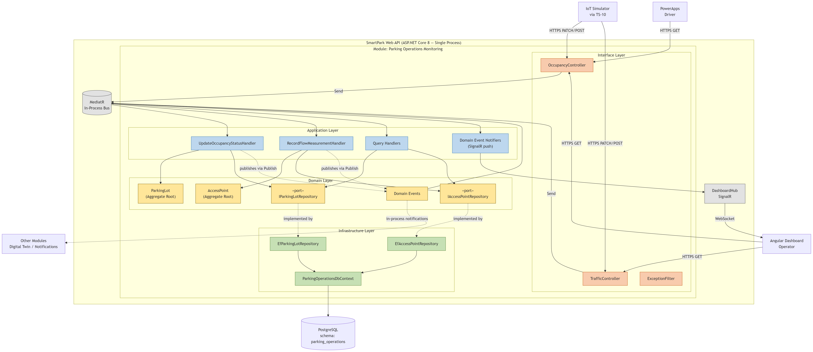

### 5.1.6. Class Diagram — Parking Operations Monitoring

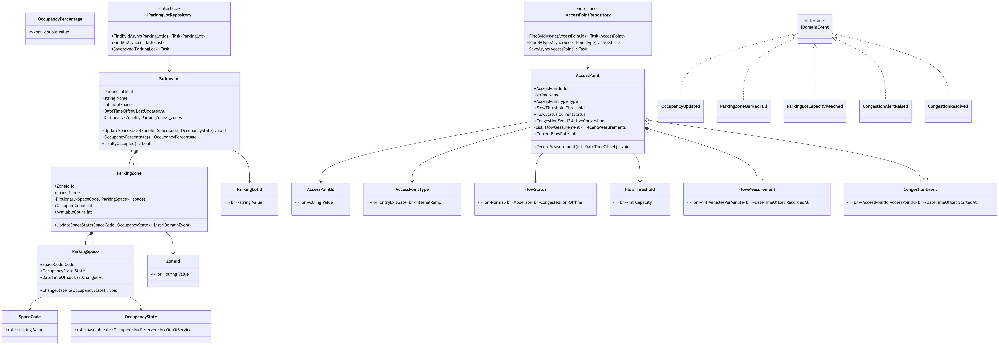

### 5.1.7. Database Diagram — Parking Operations Monitoring

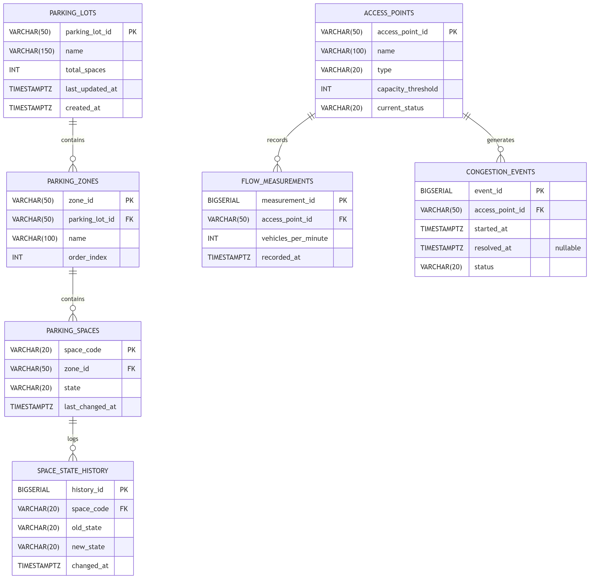

---

## 5.2. Bounded Context: Energy Efficiency Management

El contexto **Energy Efficiency Management** transforma datos operativos en recomendaciones de ahorro energético. Sus responsabilidades son: (a) recibir lecturas de luminosidad por zona desde el contexto **Telemetry Simulation & Ingestion**; (b) consultar la ocupación correspondiente desde **Parking Operations Monitoring** mediante un Anti-Corruption Layer; (c) aplicar la regla de negocio que detecta oportunidad de atenuación (ocupación < 20% y luminosidad normalizada > 50%); (d) generar recomendaciones de atenuación con el ahorro energético estimado; y (e) exponer endpoints REST para que el dashboard del operador muestre las recomendaciones contextualizadas en el modelo 3D.

Este contexto soporta las historias **US-25** (Dashboard de Eficiencia Energética) y **US-26** (Visualización de Recomendaciones de Atenuación), y la technical story **TS-07** (Endpoint de Consulta de Gestión Energética).

### 5.2.1. Domain Layer

**Agregado raíz: `LightingZone`**

```csharp
namespace ApexTwin.SmartPark.WebApi.Modules.EnergyEfficiency.Domain.Model;

public sealed class LightingZone
{
    private const double OccupancyThreshold = 0.20;
    private const double LuminosityThreshold = 0.50;

    private readonly List<IDomainEvent> _domainEvents = new();

    public LightingZoneId Id { get; }
    public ZoneReference ParkingZoneRef { get; }
    public LampCount InstalledLamps { get; }
    public PowerRating RatedPower { get; }
    public LuminosityReading? CurrentLuminosity { get; private set; }
    public OccupancyRatio? CurrentOccupancy { get; private set; }
    public DimmingRecommendation? ActiveRecommendation { get; private set; }
    public IReadOnlyCollection<IDomainEvent> DomainEvents => _domainEvents.AsReadOnly();

    private LightingZone() { /* EF Core */ }

    public LightingZone(LightingZoneId id, ZoneReference parkingZoneRef,
                        LampCount lamps, PowerRating power)
    {
        Id = id;
        ParkingZoneRef = parkingZoneRef;
        InstalledLamps = lamps;
        RatedPower = power;
    }

    public void RecordReading(LuminosityReading luminosity, OccupancyRatio occupancy)
    {
        CurrentLuminosity = luminosity;
        CurrentOccupancy = occupancy;
        _domainEvents.Add(new LowOccupancyZoneDetected(Id, occupancy, DateTimeOffset.UtcNow));

        if (ShouldRecommendDimming() && ActiveRecommendation is null)
        {
            var savings = CalculateEstimatedSavings();
            ActiveRecommendation = new DimmingRecommendation(Id, savings, DateTimeOffset.UtcNow);
            _domainEvents.Add(new DimmingRecommendationGenerated(Id, savings, DateTimeOffset.UtcNow));
        }
        else if (!ShouldRecommendDimming() && ActiveRecommendation is not null)
        {
            ActiveRecommendation = null;
            _domainEvents.Add(new DimmingRecommendationCleared(Id, DateTimeOffset.UtcNow));
        }
    }

    private bool ShouldRecommendDimming()
    {
        if (CurrentLuminosity is null || CurrentOccupancy is null) return false;
        return CurrentOccupancy.Value < OccupancyThreshold
            && CurrentLuminosity.NormalizedValue > LuminosityThreshold;
    }

    private EstimatedSavings CalculateEstimatedSavings()
    {
        var currentConsumption = InstalledLamps.Count * RatedPower.Watts
                                 * CurrentLuminosity!.NormalizedValue;
        var dimmedConsumption = InstalledLamps.Count * RatedPower.Watts * 0.30;
        var savedWatts = currentConsumption - dimmedConsumption;
        var savedPercentage = (savedWatts / currentConsumption) * 100;
        return new EstimatedSavings(savedWatts, savedPercentage);
    }

    public void ClearDomainEvents() => _domainEvents.Clear();
}
```

**Value Objects**

```csharp
namespace ApexTwin.SmartPark.WebApi.Modules.EnergyEfficiency.Domain.Model;

public sealed record LightingZoneId(string Value);

public sealed record ZoneReference(string ParkingLotId, string ZoneId)
{
    public ZoneReference : this(ParkingLotId, ZoneId)
    {
        if (string.IsNullOrWhiteSpace(ParkingLotId) || string.IsNullOrWhiteSpace(ZoneId))
            throw new ArgumentException("Invalid ZoneReference");
    }
}

public sealed record LampCount(int Count)
{
    public LampCount : this(Count)
    {
        if (Count <= 0) throw new ArgumentException("Lamp count must be positive");
    }
}

public sealed record PowerRating(double Watts)
{
    public PowerRating : this(Watts)
    {
        if (Watts <= 0) throw new ArgumentException("Power must be positive");
    }
}

public sealed record LuminosityReading(int LuxValue)
{
    private const int MaxLux = 1000;

    public LuminosityReading : this(LuxValue)
    {
        if (LuxValue < 0) throw new ArgumentException("Lux cannot be negative");
    }

    public double NormalizedValue => Math.Min((double)LuxValue / MaxLux, 1.0);
}

public sealed record OccupancyRatio(double Value)
{
    public OccupancyRatio : this(Value)
    {
        if (Value < 0.0 || Value > 1.0)
            throw new ArgumentException("Ratio must be 0..1");
    }
}

public sealed record EstimatedSavings(double SavedWatts, double SavedPercentage);

public sealed record DimmingRecommendation(
    LightingZoneId ZoneId,
    EstimatedSavings Savings,
    DateTimeOffset RecommendedAt);
```

**Eventos de dominio**

```csharp
namespace ApexTwin.SmartPark.WebApi.Modules.EnergyEfficiency.Domain.Events;

using MediatR;
using ApexTwin.SmartPark.WebApi.Shared.Kernel;

public sealed record LowOccupancyZoneDetected(
    LightingZoneId ZoneId,
    OccupancyRatio Occupancy,
    DateTimeOffset OccurredAt) : IDomainEvent, INotification;

public sealed record DimmingRecommendationGenerated(
    LightingZoneId ZoneId,
    EstimatedSavings Savings,
    DateTimeOffset OccurredAt) : IDomainEvent, INotification;

public sealed record DimmingRecommendationCleared(
    LightingZoneId ZoneId,
    DateTimeOffset OccurredAt) : IDomainEvent, INotification;
```

**Puertos (repository + ACL)**

```csharp
namespace ApexTwin.SmartPark.WebApi.Modules.EnergyEfficiency.Domain.Repositories;

public interface ILightingZoneRepository
{
    Task<LightingZone?> FindByIdAsync(LightingZoneId id, CancellationToken ct = default);
    Task<IReadOnlyList<LightingZone>> FindAllAsync(CancellationToken ct = default);
    Task SaveAsync(LightingZone zone, CancellationToken ct = default);
}

// Anti-Corruption Layer hacia Parking Operations Monitoring
public interface IParkingOccupancyGateway
{
    Task<OccupancyRatio> FetchOccupancyForZoneAsync(ZoneReference reference, CancellationToken ct = default);
}
```

### 5.2.2. Application Layer

```csharp
namespace ApexTwin.SmartPark.WebApi.Modules.EnergyEfficiency.Application.Commands;

using MediatR;

public sealed record AnalyzeLightingByZoneCommand(string LightingZoneId, int LuxValue) : IRequest;
```

```csharp
namespace ApexTwin.SmartPark.WebApi.Modules.EnergyEfficiency.Application.Handlers;

using MediatR;
using ApexTwin.SmartPark.WebApi.Modules.EnergyEfficiency.Application.Commands;
using ApexTwin.SmartPark.WebApi.Modules.EnergyEfficiency.Domain.Model;
using ApexTwin.SmartPark.WebApi.Modules.EnergyEfficiency.Domain.Repositories;

public sealed class AnalyzeLightingByZoneHandler : IRequestHandler<AnalyzeLightingByZoneCommand>
{
    private readonly ILightingZoneRepository _repository;
    private readonly IParkingOccupancyGateway _occupancyGateway;
    private readonly IPublisher _publisher;

    public AnalyzeLightingByZoneHandler(
        ILightingZoneRepository repository,
        IParkingOccupancyGateway occupancyGateway,
        IPublisher publisher)
    {
        _repository = repository;
        _occupancyGateway = occupancyGateway;
        _publisher = publisher;
    }

    public async Task Handle(AnalyzeLightingByZoneCommand cmd, CancellationToken ct)
    {
        var id = new LightingZoneId(cmd.LightingZoneId);
        var zone = await _repository.FindByIdAsync(id, ct)
            ?? throw new LightingZoneNotFoundException(id);

        // ACL: fetch occupancy from sibling module
        var occupancy = await _occupancyGateway.FetchOccupancyForZoneAsync(zone.ParkingZoneRef, ct);
        var reading = new LuminosityReading(cmd.LuxValue);

        zone.RecordReading(reading, occupancy);
        await _repository.SaveAsync(zone, ct);

        foreach (var domainEvent in zone.DomainEvents)
            await _publisher.Publish(domainEvent, ct);
        zone.ClearDomainEvents();
    }
}
```

```csharp
namespace ApexTwin.SmartPark.WebApi.Modules.EnergyEfficiency.Application.Queries;

using MediatR;
using ApexTwin.SmartPark.WebApi.Modules.EnergyEfficiency.Application.Dtos;
using ApexTwin.SmartPark.WebApi.Modules.EnergyEfficiency.Domain.Repositories;

public sealed record GetAllEnergyZonesQuery : IRequest<IReadOnlyList<EnergyZoneDto>>;

public sealed class GetAllEnergyZonesHandler
    : IRequestHandler<GetAllEnergyZonesQuery, IReadOnlyList<EnergyZoneDto>>
{
    private readonly ILightingZoneRepository _repository;
    public GetAllEnergyZonesHandler(ILightingZoneRepository r) => _repository = r;

    public async Task<IReadOnlyList<EnergyZoneDto>> Handle(
        GetAllEnergyZonesQuery q, CancellationToken ct)
    {
        var zones = await _repository.FindAllAsync(ct);
        return zones.Select(z => new EnergyZoneDto(
            z.Id.Value,
            z.ParkingZoneRef.ParkingLotId,
            z.ParkingZoneRef.ZoneId,
            (z.CurrentOccupancy?.Value ?? 0.0) * 100,
            z.CurrentLuminosity?.LuxValue ?? 0,
            z.ActiveRecommendation is not null,
            z.ActiveRecommendation?.Savings.SavedPercentage ?? 0.0
        )).ToList();
    }
}
```

```csharp
namespace ApexTwin.SmartPark.WebApi.Modules.EnergyEfficiency.Application.Dtos;

public sealed record EnergyZoneDto(
    string LightingZoneId,
    string ParkingLotId,
    string ParkingZoneId,
    double OccupancyPercentage,
    int CurrentLuminosity,
    bool DimmingRecommended,
    double EstimatedSavingsPercentage);
```

### 5.2.3. Interface Layer

```csharp
namespace ApexTwin.SmartPark.WebApi.Modules.EnergyEfficiency.Interfaces.Rest;

using Microsoft.AspNetCore.Mvc;
using MediatR;
using ApexTwin.SmartPark.WebApi.Modules.EnergyEfficiency.Application.Commands;
using ApexTwin.SmartPark.WebApi.Modules.EnergyEfficiency.Application.Queries;
using ApexTwin.SmartPark.WebApi.Modules.EnergyEfficiency.Interfaces.Rest.Dtos;

[ApiController]
[Route("api/v1/energy")]
public sealed class EnergyController : ControllerBase
{
    private readonly IMediator _mediator;
    public EnergyController(IMediator m) => _mediator = m;

    [HttpGet("zones")]
    public async Task<IActionResult> GetZones(CancellationToken ct)
    {
        var result = await _mediator.Send(new GetAllEnergyZonesQuery(), ct);
        return Ok(result);
    }

    [HttpPost("zones/{lightingZoneId}/readings")]
    public async Task<IActionResult> RecordReading(
        string lightingZoneId,
        [FromBody] RecordLuminosityRequest request,
        CancellationToken ct)
    {
        await _mediator.Send(new AnalyzeLightingByZoneCommand(lightingZoneId, request.LuxValue), ct);
        return Accepted();
    }
}

namespace Dtos { public sealed record RecordLuminosityRequest(int LuxValue); }
```

### 5.2.4. Infrastructure Layer

**DbContext y repositorio**

```csharp
namespace ApexTwin.SmartPark.WebApi.Modules.EnergyEfficiency.Infrastructure.Persistence;

using Microsoft.EntityFrameworkCore;
using ApexTwin.SmartPark.WebApi.Modules.EnergyEfficiency.Domain.Model;

public sealed class EnergyEfficiencyDbContext : DbContext
{
    public DbSet<LightingZone> LightingZones => Set<LightingZone>();

    public EnergyEfficiencyDbContext(DbContextOptions<EnergyEfficiencyDbContext> options)
        : base(options) { }

    protected override void OnModelCreating(ModelBuilder modelBuilder)
    {
        modelBuilder.HasDefaultSchema("energy_efficiency");
        modelBuilder.ApplyConfigurationsFromAssembly(typeof(EnergyEfficiencyDbContext).Assembly);
    }
}

public sealed class EfLightingZoneRepository : ILightingZoneRepository
{
    private readonly EnergyEfficiencyDbContext _context;
    public EfLightingZoneRepository(EnergyEfficiencyDbContext c) => _context = c;

    public Task<LightingZone?> FindByIdAsync(LightingZoneId id, CancellationToken ct = default)
        => _context.LightingZones.FirstOrDefaultAsync(z => z.Id == id, ct);

    public async Task<IReadOnlyList<LightingZone>> FindAllAsync(CancellationToken ct = default)
        => await _context.LightingZones.ToListAsync(ct);

    public async Task SaveAsync(LightingZone zone, CancellationToken ct = default)
    {
        var existing = await _context.LightingZones.FindAsync(new object[] { zone.Id }, ct);
        if (existing is null) await _context.LightingZones.AddAsync(zone, ct);
        else _context.Entry(existing).CurrentValues.SetValues(zone);
        await _context.SaveChangesAsync(ct);
    }
}
```

**Implementación del ACL hacia Parking Operations Monitoring**

```csharp
namespace ApexTwin.SmartPark.WebApi.Modules.EnergyEfficiency.Infrastructure.Acl;

using MediatR;
using ApexTwin.SmartPark.WebApi.Modules.EnergyEfficiency.Domain.Model;
using ApexTwin.SmartPark.WebApi.Modules.EnergyEfficiency.Domain.Repositories;
using ApexTwin.SmartPark.WebApi.Modules.ParkingOperations.Application.Queries;
using ApexTwin.SmartPark.WebApi.Modules.ParkingOperations.Application.Dtos;

public sealed class ParkingOccupancyGateway : IParkingOccupancyGateway
{
    private readonly IMediator _mediator;
    public ParkingOccupancyGateway(IMediator m) => _mediator = m;

    public async Task<OccupancyRatio> FetchOccupancyForZoneAsync(
        ZoneReference reference, CancellationToken ct = default)
    {
        // ACL: query the Parking Operations module via in-process mediator
        // and translate the external representation into our domain VO.
        ZoneOccupancyDto external = await _mediator.Send(
            new GetZoneOccupancyQuery(reference.ParkingLotId, reference.ZoneId), ct);
        var ratio = (double)external.OccupiedSpaces / external.TotalSpaces;
        return new OccupancyRatio(ratio);
    }
}
```

### 5.2.5. Component Diagram — Energy Efficiency Management

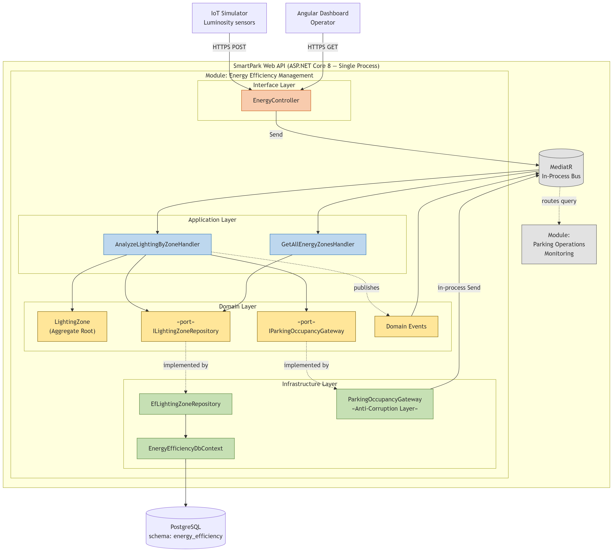

### 5.2.6. Class Diagram — Energy Efficiency Management

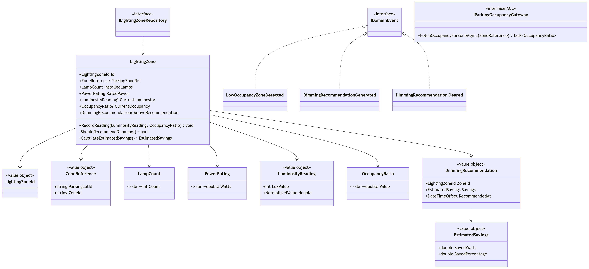

### 5.2.7. Database Diagram — Energy Efficiency Management

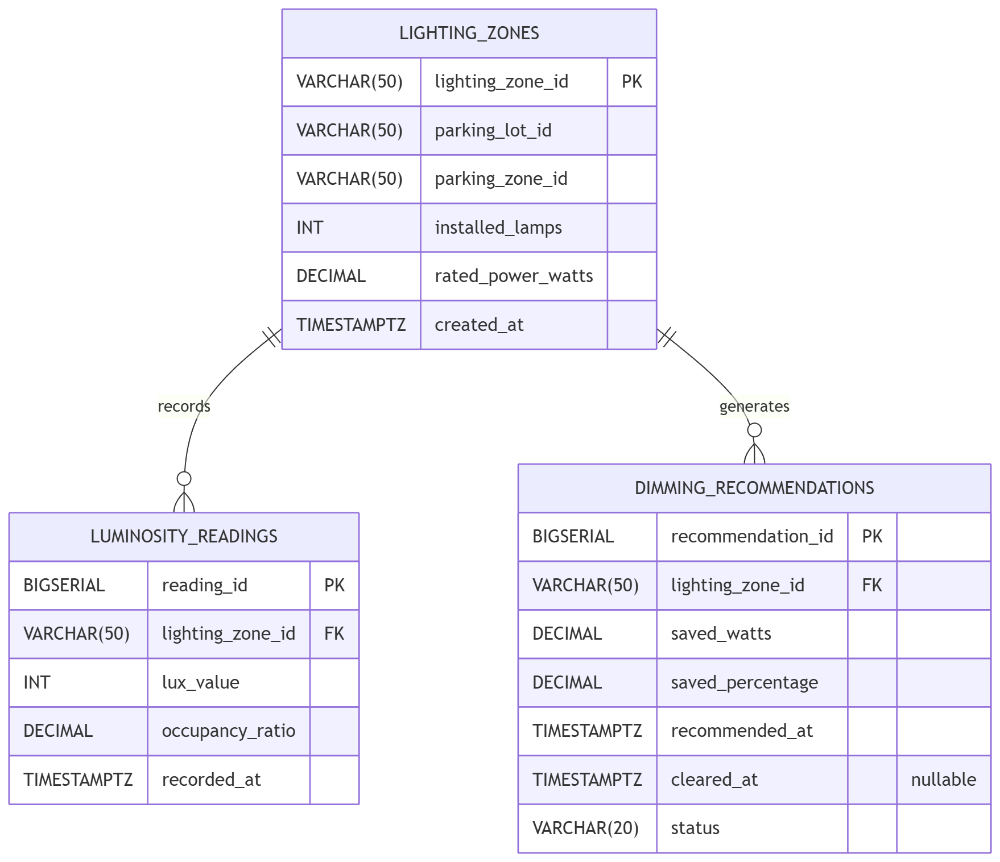


---

## 5.3. Bounded Context: Landing & Subscription Management

El contexto **Landing & Subscription Management** gestiona la captación comercial de visitantes interesados en SmartPark. Sus responsabilidades son: (a) registrar el recorrido del visitante por el Landing Page mediante el agregado `SubscriptionLead`, capturando los hitos relevantes (visualización del landing, selección de plan, envío del formulario de contacto); (b) ofrecer el catálogo público de planes de suscripción —Basic (≤500 plazas), Professional (≤1,500 plazas) y Enterprise (>1,500 plazas)—; (c) emitir eventos de dominio (`LandingPageViewed`, `SubscriptionPlanSelected`, `ContactRequestSubmitted`) que el equipo comercial de Apex Twin podrá usar para activar acciones de seguimiento; y (d) marcar la conversión del lead cuando el contexto **Identity & Access Management** notifica que el operador asociado ha completado su registro.

Este contexto soporta principalmente la historia **US-04** (Visualización de Planes de Suscripción) y la historia **US-05** (Envío de Formulario de Contacto), y de manera transversal el resto del catálogo del Landing Page (US-01 a US-10), que en términos arquitectónicos se resuelven mayormente en el repositorio `landing-page` (sitio estático sobre Azure Static Web Apps); este bounded context aporta el backend que sustenta la captación de leads.

### 5.3.1. Domain Layer

**Agregado raíz: `SubscriptionLead`**

```csharp
namespace ApexTwin.SmartPark.WebApi.Modules.LandingSubscription.Domain.Model;

public sealed class SubscriptionLead
{
    private readonly List<IDomainEvent> _domainEvents = new();

    public SubscriptionLeadId Id { get; }
    public LeadStatus Status { get; private set; }
    public SubscriptionTier? SelectedPlan { get; private set; }
    public ContactInfo? Contact { get; private set; }
    public string? Message { get; private set; }
    public DateTimeOffset FirstSeenAt { get; }
    public DateTimeOffset? ContactedAt { get; private set; }
    public DateTimeOffset? ConvertedAt { get; private set; }
    public string? ConvertedOperatorId { get; private set; }
    public IReadOnlyCollection<IDomainEvent> DomainEvents => _domainEvents.AsReadOnly();

    private SubscriptionLead() { /* EF Core */ }

    public SubscriptionLead(SubscriptionLeadId id)
    {
        Id = id;
        Status = LeadStatus.Viewing;
        FirstSeenAt = DateTimeOffset.UtcNow;
        _domainEvents.Add(new LandingPageViewed(Id, FirstSeenAt));
    }

    public void SelectPlan(SubscriptionTier tier)
    {
        if (Status == LeadStatus.Converted || Status == LeadStatus.Discarded)
            throw new InvalidLeadTransitionException(Status, nameof(SelectPlan));
        SelectedPlan = tier;
        Status = LeadStatus.PlanSelected;
        _domainEvents.Add(new SubscriptionPlanSelected(Id, tier, DateTimeOffset.UtcNow));
    }

    public void SubmitContact(ContactInfo contact, string message)
    {
        if (string.IsNullOrWhiteSpace(message))
            throw new ArgumentException("Message is required");
        if (Status == LeadStatus.Converted || Status == LeadStatus.Discarded)
            throw new InvalidLeadTransitionException(Status, nameof(SubmitContact));
        Contact = contact;
        Message = message;
        Status = LeadStatus.Contacted;
        ContactedAt = DateTimeOffset.UtcNow;
        _domainEvents.Add(new ContactRequestSubmitted(Id, contact.Email, SelectedPlan, ContactedAt.Value));
    }

    public void MarkAsConverted(string operatorId)
    {
        if (Status != LeadStatus.Contacted)
            throw new InvalidLeadTransitionException(Status, nameof(MarkAsConverted));
        ConvertedOperatorId = operatorId;
        ConvertedAt = DateTimeOffset.UtcNow;
        Status = LeadStatus.Converted;
        _domainEvents.Add(new SubscriptionLeadConverted(Id, operatorId, ConvertedAt.Value));
    }

    public void Discard(string reason)
    {
        if (Status == LeadStatus.Converted) return;
        Status = LeadStatus.Discarded;
        _domainEvents.Add(new SubscriptionLeadDiscarded(Id, reason, DateTimeOffset.UtcNow));
    }

    public void ClearDomainEvents() => _domainEvents.Clear();
}
```

**Value Objects y enumeraciones**

```csharp
namespace ApexTwin.SmartPark.WebApi.Modules.LandingSubscription.Domain.Model;

public sealed record SubscriptionLeadId(string Value);

public enum LeadStatus { Viewing, PlanSelected, Contacted, Converted, Discarded }

public sealed record ContactInfo(string FullName, string Email, string Company, string Phone)
{
    public ContactInfo : this(FullName, Email, Company, Phone)
    {
        if (string.IsNullOrWhiteSpace(FullName))
            throw new ArgumentException("Full name is required");
        if (string.IsNullOrWhiteSpace(Email) || !Email.Contains('@'))
            throw new ArgumentException("Valid email is required");
        if (string.IsNullOrWhiteSpace(Company))
            throw new ArgumentException("Company is required");
    }
}

public enum SubscriptionTier { Basic, Professional, Enterprise }

public static class SubscriptionTierCatalog
{
    public static IReadOnlyDictionary<SubscriptionTier, PlanSpecification> Catalog =>
        new Dictionary<SubscriptionTier, PlanSpecification>
        {
            [SubscriptionTier.Basic] = new(
                Tier: SubscriptionTier.Basic,
                PresentationName: "Basic — Hasta 500 plazas",
                MaxSpaces: 500,
                MonthlyPriceUsd: 99.00m,
                Features: new[]
                {
                    "Dashboard de ocupación en tiempo real",
                    "App móvil para conductores",
                    "Hasta 500 plazas"
                }),
            [SubscriptionTier.Professional] = new(
                Tier: SubscriptionTier.Professional,
                PresentationName: "Professional — Hasta 1,500 plazas",
                MaxSpaces: 1500,
                MonthlyPriceUsd: 299.00m,
                Features: new[]
                {
                    "Todo lo del plan Basic",
                    "Alertas de humo con visualización 3D",
                    "Monitoreo de flujo vehicular",
                    "Hasta 1,500 plazas"
                }),
            [SubscriptionTier.Enterprise] = new(
                Tier: SubscriptionTier.Enterprise,
                PresentationName: "Enterprise — Más de 1,500 plazas",
                MaxSpaces: int.MaxValue,
                MonthlyPriceUsd: 799.00m,
                Features: new[]
                {
                    "Todo lo del plan Professional",
                    "Gestión energética con recomendaciones",
                    "Soporte 24/7",
                    "Plazas ilimitadas"
                })
        };
}

public sealed record PlanSpecification(
    SubscriptionTier Tier,
    string PresentationName,
    int MaxSpaces,
    decimal MonthlyPriceUsd,
    IReadOnlyList<string> Features);
```

**Eventos de dominio**

```csharp
namespace ApexTwin.SmartPark.WebApi.Modules.LandingSubscription.Domain.Events;

using MediatR;
using ApexTwin.SmartPark.WebApi.Shared.Kernel;

public sealed record LandingPageViewed(SubscriptionLeadId LeadId, DateTimeOffset OccurredAt)
    : IDomainEvent, INotification;

public sealed record SubscriptionPlanSelected(
    SubscriptionLeadId LeadId, SubscriptionTier Tier, DateTimeOffset OccurredAt)
    : IDomainEvent, INotification;

public sealed record ContactRequestSubmitted(
    SubscriptionLeadId LeadId, string Email, SubscriptionTier? SelectedTier, DateTimeOffset OccurredAt)
    : IDomainEvent, INotification;

public sealed record SubscriptionLeadConverted(
    SubscriptionLeadId LeadId, string OperatorId, DateTimeOffset OccurredAt)
    : IDomainEvent, INotification;

public sealed record SubscriptionLeadDiscarded(
    SubscriptionLeadId LeadId, string Reason, DateTimeOffset OccurredAt)
    : IDomainEvent, INotification;
```

**Repositorio (puerto)**

```csharp
namespace ApexTwin.SmartPark.WebApi.Modules.LandingSubscription.Domain.Repositories;

public interface ISubscriptionLeadRepository
{
    Task<SubscriptionLead?> FindByIdAsync(SubscriptionLeadId id, CancellationToken ct = default);
    Task<IReadOnlyList<SubscriptionLead>> FindByStatusAsync(LeadStatus status, CancellationToken ct = default);
    Task SaveAsync(SubscriptionLead lead, CancellationToken ct = default);
}
```

### 5.3.2. Application Layer

```csharp
namespace ApexTwin.SmartPark.WebApi.Modules.LandingSubscription.Application.Commands;

using MediatR;

public sealed record ViewLandingPageCommand : IRequest<string>;

public sealed record SelectSubscriptionPlanCommand(string LeadId, string Tier) : IRequest;

public sealed record SubmitContactFormCommand(
    string LeadId,
    string FullName,
    string Email,
    string Company,
    string Phone,
    string Message) : IRequest;
```

```csharp
namespace ApexTwin.SmartPark.WebApi.Modules.LandingSubscription.Application.Handlers;

using MediatR;
using ApexTwin.SmartPark.WebApi.Modules.LandingSubscription.Application.Commands;
using ApexTwin.SmartPark.WebApi.Modules.LandingSubscription.Domain.Model;
using ApexTwin.SmartPark.WebApi.Modules.LandingSubscription.Domain.Repositories;

public sealed class ViewLandingPageHandler : IRequestHandler<ViewLandingPageCommand, string>
{
    private readonly ISubscriptionLeadRepository _repository;
    private readonly IPublisher _publisher;

    public ViewLandingPageHandler(ISubscriptionLeadRepository r, IPublisher p)
    {
        _repository = r;
        _publisher = p;
    }

    public async Task<string> Handle(ViewLandingPageCommand cmd, CancellationToken ct)
    {
        var lead = new SubscriptionLead(new SubscriptionLeadId(Guid.NewGuid().ToString()));
        await _repository.SaveAsync(lead, ct);
        foreach (var ev in lead.DomainEvents) await _publisher.Publish(ev, ct);
        lead.ClearDomainEvents();
        return lead.Id.Value;
    }
}

public sealed class SubmitContactFormHandler : IRequestHandler<SubmitContactFormCommand>
{
    private readonly ISubscriptionLeadRepository _repository;
    private readonly IPublisher _publisher;

    public SubmitContactFormHandler(ISubscriptionLeadRepository r, IPublisher p)
    {
        _repository = r;
        _publisher = p;
    }

    public async Task Handle(SubmitContactFormCommand cmd, CancellationToken ct)
    {
        var lead = await _repository.FindByIdAsync(new SubscriptionLeadId(cmd.LeadId), ct)
            ?? throw new SubscriptionLeadNotFoundException(cmd.LeadId);

        var contact = new ContactInfo(cmd.FullName, cmd.Email, cmd.Company, cmd.Phone);
        lead.SubmitContact(contact, cmd.Message);
        await _repository.SaveAsync(lead, ct);
        foreach (var ev in lead.DomainEvents) await _publisher.Publish(ev, ct);
        lead.ClearDomainEvents();
    }
}
```

```csharp
namespace ApexTwin.SmartPark.WebApi.Modules.LandingSubscription.Application.Queries;

using MediatR;
using ApexTwin.SmartPark.WebApi.Modules.LandingSubscription.Application.Dtos;
using ApexTwin.SmartPark.WebApi.Modules.LandingSubscription.Domain.Model;

public sealed record GetPlanCatalogQuery : IRequest<IReadOnlyList<PlanDto>>;

public sealed class GetPlanCatalogHandler : IRequestHandler<GetPlanCatalogQuery, IReadOnlyList<PlanDto>>
{
    public Task<IReadOnlyList<PlanDto>> Handle(GetPlanCatalogQuery q, CancellationToken ct)
    {
        var plans = SubscriptionTierCatalog.Catalog.Values
            .Select(p => new PlanDto(
                p.Tier.ToString(),
                p.PresentationName,
                p.MaxSpaces == int.MaxValue ? -1 : p.MaxSpaces,
                p.MonthlyPriceUsd,
                p.Features.ToList()))
            .ToList();
        return Task.FromResult<IReadOnlyList<PlanDto>>(plans);
    }
}
```

```csharp
namespace ApexTwin.SmartPark.WebApi.Modules.LandingSubscription.Application.Dtos;

public sealed record PlanDto(
    string TierCode,
    string PresentationName,
    int MaxSpaces,
    decimal MonthlyPriceUsd,
    IReadOnlyList<string> Features);
```

### 5.3.3. Interface Layer

```csharp
namespace ApexTwin.SmartPark.WebApi.Modules.LandingSubscription.Interfaces.Rest;

using Microsoft.AspNetCore.Mvc;
using MediatR;
using ApexTwin.SmartPark.WebApi.Modules.LandingSubscription.Application.Commands;
using ApexTwin.SmartPark.WebApi.Modules.LandingSubscription.Application.Queries;
using ApexTwin.SmartPark.WebApi.Modules.LandingSubscription.Interfaces.Rest.Dtos;

[ApiController]
[Route("api/v1/landing")]
public sealed class LandingController : ControllerBase
{
    private readonly IMediator _mediator;
    public LandingController(IMediator m) => _mediator = m;

    [HttpGet("plans")]
    public async Task<IActionResult> GetPlans(CancellationToken ct)
    {
        var result = await _mediator.Send(new GetPlanCatalogQuery(), ct);
        return Ok(result);
    }

    [HttpPost("leads")]
    public async Task<IActionResult> RegisterVisit(CancellationToken ct)
    {
        var leadId = await _mediator.Send(new ViewLandingPageCommand(), ct);
        return CreatedAtAction(nameof(GetLead), new { leadId }, new { leadId });
    }

    [HttpGet("leads/{leadId}")]
    public IActionResult GetLead(string leadId) => Ok(new { leadId });

    [HttpPost("leads/{leadId}/plan-selection")]
    public async Task<IActionResult> SelectPlan(
        string leadId, [FromBody] SelectPlanRequest request, CancellationToken ct)
    {
        await _mediator.Send(new SelectSubscriptionPlanCommand(leadId, request.Tier), ct);
        return NoContent();
    }

    [HttpPost("leads/{leadId}/contact")]
    public async Task<IActionResult> SubmitContact(
        string leadId, [FromBody] ContactFormRequest request, CancellationToken ct)
    {
        await _mediator.Send(new SubmitContactFormCommand(
            leadId, request.FullName, request.Email, request.Company,
            request.Phone, request.Message), ct);
        return Accepted();
    }
}

namespace Dtos
{
    public sealed record SelectPlanRequest(string Tier);
    public sealed record ContactFormRequest(
        string FullName, string Email, string Company, string Phone, string Message);
}
```

**Validadores FluentValidation**

```csharp
namespace ApexTwin.SmartPark.WebApi.Modules.LandingSubscription.Interfaces.Rest.Validation;

using FluentValidation;

public sealed class ContactFormRequestValidator : AbstractValidator<ContactFormRequest>
{
    public ContactFormRequestValidator()
    {
        RuleFor(x => x.FullName).NotEmpty().MaximumLength(150);
        RuleFor(x => x.Email).NotEmpty().EmailAddress();
        RuleFor(x => x.Company).NotEmpty().MaximumLength(200);
        RuleFor(x => x.Message).NotEmpty().MaximumLength(2000);
    }
}
```

### 5.3.4. Infrastructure Layer

```csharp
namespace ApexTwin.SmartPark.WebApi.Modules.LandingSubscription.Infrastructure.Persistence;

using Microsoft.EntityFrameworkCore;
using ApexTwin.SmartPark.WebApi.Modules.LandingSubscription.Domain.Model;
using ApexTwin.SmartPark.WebApi.Modules.LandingSubscription.Domain.Repositories;

public sealed class LandingSubscriptionDbContext : DbContext
{
    public DbSet<SubscriptionLead> SubscriptionLeads => Set<SubscriptionLead>();
    public LandingSubscriptionDbContext(DbContextOptions<LandingSubscriptionDbContext> opt) : base(opt) { }

    protected override void OnModelCreating(ModelBuilder modelBuilder)
    {
        modelBuilder.HasDefaultSchema("landing_subscription");
        modelBuilder.Entity<SubscriptionLead>(b =>
        {
            b.ToTable("subscription_leads");
            b.HasKey("Id");
            b.Property(s => s.Id)
                .HasConversion(id => id.Value, value => new SubscriptionLeadId(value))
                .HasColumnName("lead_id").HasMaxLength(50);
            b.Property(s => s.Status).HasConversion<string>().HasMaxLength(20);
            b.Property(s => s.SelectedPlan).HasConversion<string>().HasMaxLength(20);
            b.OwnsOne(s => s.Contact, c =>
            {
                c.Property(p => p.FullName).HasColumnName("contact_full_name").HasMaxLength(150);
                c.Property(p => p.Email).HasColumnName("contact_email").HasMaxLength(200);
                c.Property(p => p.Company).HasColumnName("contact_company").HasMaxLength(200);
                c.Property(p => p.Phone).HasColumnName("contact_phone").HasMaxLength(20);
            });
            b.Ignore(s => s.DomainEvents);
        });
    }
}

public sealed class EfSubscriptionLeadRepository : ISubscriptionLeadRepository
{
    private readonly LandingSubscriptionDbContext _context;
    public EfSubscriptionLeadRepository(LandingSubscriptionDbContext c) => _context = c;

    public Task<SubscriptionLead?> FindByIdAsync(SubscriptionLeadId id, CancellationToken ct = default)
        => _context.SubscriptionLeads.FirstOrDefaultAsync(s => s.Id == id, ct);

    public async Task<IReadOnlyList<SubscriptionLead>> FindByStatusAsync(LeadStatus status, CancellationToken ct = default)
        => await _context.SubscriptionLeads.Where(s => s.Status == status).ToListAsync(ct);

    public async Task SaveAsync(SubscriptionLead lead, CancellationToken ct = default)
    {
        var existing = await _context.SubscriptionLeads.FindAsync(new object[] { lead.Id }, ct);
        if (existing is null) await _context.SubscriptionLeads.AddAsync(lead, ct);
        else _context.Entry(existing).CurrentValues.SetValues(lead);
        await _context.SaveChangesAsync(ct);
    }
}
```

**Listener para conversión cuando IAM registra al operador**

```csharp
namespace ApexTwin.SmartPark.WebApi.Modules.LandingSubscription.Infrastructure.Integration;

using MediatR;
using ApexTwin.SmartPark.WebApi.Modules.LandingSubscription.Domain.Model;
using ApexTwin.SmartPark.WebApi.Modules.LandingSubscription.Domain.Repositories;
using ApexTwin.SmartPark.WebApi.Modules.IdentityAccess.Domain.Events;

public sealed class OperatorRegistrationListener : INotificationHandler<OperatorAccountRegistered>
{
    private readonly ISubscriptionLeadRepository _repository;
    private readonly IPublisher _publisher;

    public OperatorRegistrationListener(ISubscriptionLeadRepository r, IPublisher p)
    {
        _repository = r;
        _publisher = p;
    }

    public async Task Handle(OperatorAccountRegistered notification, CancellationToken ct)
    {
        if (notification.SourceLeadId is null) return;
        var lead = await _repository.FindByIdAsync(new SubscriptionLeadId(notification.SourceLeadId), ct);
        if (lead is null) return;
        lead.MarkAsConverted(notification.OperatorId);
        await _repository.SaveAsync(lead, ct);
        foreach (var ev in lead.DomainEvents) await _publisher.Publish(ev, ct);
        lead.ClearDomainEvents();
    }
}
```

### 5.3.5. Component Diagram — Landing & Subscription Management

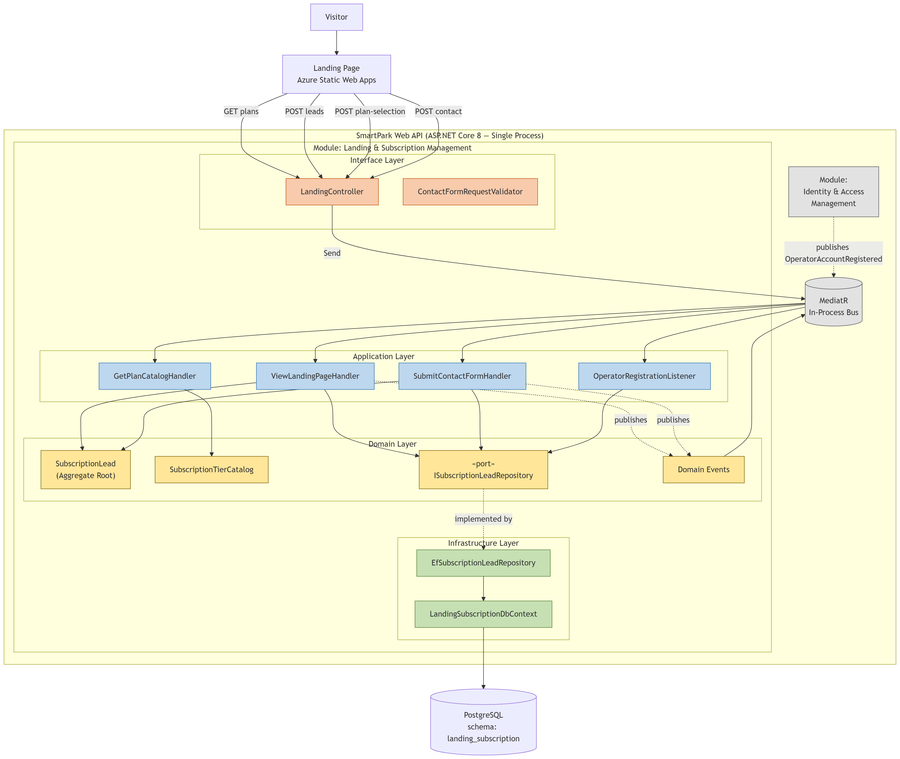

### 5.3.6. Class Diagram — Landing & Subscription Management

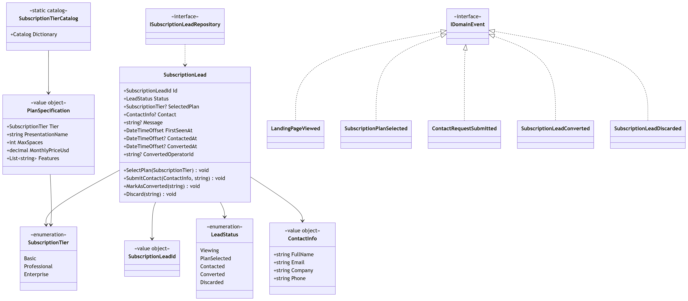

### 5.3.7. Database Diagram — Landing & Subscription Management

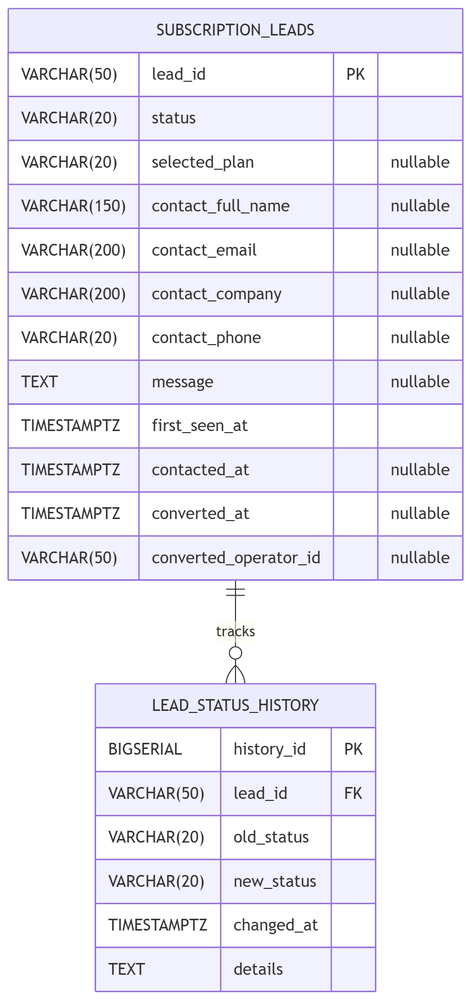


---

## 5.4. Bounded Context: Telemetry Simulation & Ingestion

El contexto **Telemetry Simulation & Ingestion** es la puerta de entrada al sistema para todos los datos provenientes del simulador IoT (TS-10) y, en un futuro, de sensores físicos reales. Sus responsabilidades son: (a) mantener el catálogo de sensores instalados con su metadata (tipo, ubicación, twin asociado en Azure Digital Twins, estado); (b) recibir eventos de telemetría enviados por el simulador externo; (c) validar cada evento contra las reglas del sensor que lo emitió (rangos válidos, frecuencia esperada, sensor activo); (d) aplicar la actualización al gemelo digital de Azure Digital Twins mediante JSON Patch; y (e) publicar el evento de dominio `DigitalTwinStateUpdated` que el contexto **Digital Twin Management** consume para actualizar la visualización 3D, y que **Parking Operations Monitoring**, **Safety & Incident Management** y **Energy Efficiency Management** consumen para actualizar sus propios agregados.

Este contexto soporta la technical story **TS-10** (Sincronización del Simulador IoT con el Twin) y la technical story **TS-02** (Endpoint de Actualización de Estado del Twin), y actúa como infraestructura compartida que alimenta a los demás bounded contexts.

### 5.4.1. Domain Layer

**Agregado raíz: `Sensor`**

```csharp
namespace ApexTwin.SmartPark.WebApi.Modules.TelemetryIngestion.Domain.Model;

public sealed class Sensor
{
    public SensorId Id { get; }
    public SensorType Type { get; }
    public SensorLocationRef Location { get; }
    public string TwinId { get; }
    public SensorStatus Status { get; private set; }
    public DateTimeOffset? LastReadingAt { get; private set; }
    public ReadingRange ValidRange { get; }

    private Sensor() { /* EF Core */ }

    public Sensor(SensorId id, SensorType type, SensorLocationRef location,
                  string twinId, ReadingRange validRange)
    {
        if (string.IsNullOrWhiteSpace(twinId))
            throw new ArgumentException("TwinId is required");
        Id = id;
        Type = type;
        Location = location;
        TwinId = twinId;
        ValidRange = validRange;
        Status = SensorStatus.Active;
    }

    public bool IsValidReading(double value)
    {
        if (Status != SensorStatus.Active) return false;
        return value >= ValidRange.Min && value <= ValidRange.Max;
    }

    public void MarkAsOffline() => Status = SensorStatus.Offline;
    public void Activate() => Status = SensorStatus.Active;
    public void Deactivate() => Status = SensorStatus.Inactive;
    public void NotifyReadingReceived() => LastReadingAt = DateTimeOffset.UtcNow;
}
```

**Agregado raíz: `TelemetryEvent`**

```csharp
namespace ApexTwin.SmartPark.WebApi.Modules.TelemetryIngestion.Domain.Model;

public sealed class TelemetryEvent
{
    private readonly List<IDomainEvent> _domainEvents = new();

    public TelemetryEventId Id { get; }
    public SensorId SensorId { get; }
    public ReadingValue Reading { get; }
    public DateTimeOffset ReceivedAt { get; }
    public DateTimeOffset? ValidatedAt { get; private set; }
    public DateTimeOffset? AppliedAt { get; private set; }
    public TelemetryEventStatus Status { get; private set; }
    public string? RejectionReason { get; private set; }
    public IReadOnlyCollection<IDomainEvent> DomainEvents => _domainEvents.AsReadOnly();

    private TelemetryEvent() { /* EF Core */ }

    public TelemetryEvent(TelemetryEventId id, SensorId sensorId, ReadingValue reading)
    {
        Id = id;
        SensorId = sensorId;
        Reading = reading;
        ReceivedAt = DateTimeOffset.UtcNow;
        Status = TelemetryEventStatus.Received;
        _domainEvents.Add(new TelemetryEventReceived(Id, SensorId, Reading, ReceivedAt));
    }

    public void Validate(Sensor sensor)
    {
        if (sensor.Id != SensorId)
            throw new InvalidOperationException("Sensor mismatch");

        if (!sensor.IsValidReading(Reading.NumericValue))
        {
            Status = TelemetryEventStatus.Rejected;
            RejectionReason = $"Reading {Reading.NumericValue} outside valid range " +
                              $"[{sensor.ValidRange.Min}, {sensor.ValidRange.Max}] " +
                              $"or sensor inactive (status={sensor.Status}).";
            _domainEvents.Add(new TelemetryEventRejected(Id, RejectionReason, DateTimeOffset.UtcNow));
            return;
        }

        Status = TelemetryEventStatus.Validated;
        ValidatedAt = DateTimeOffset.UtcNow;
        _domainEvents.Add(new TelemetryEventValidated(Id, SensorId, Reading, ValidatedAt.Value));
    }

    public void MarkAsAppliedToTwin(string twinId)
    {
        if (Status != TelemetryEventStatus.Validated)
            throw new InvalidOperationException("Only validated events can be applied to twin");

        Status = TelemetryEventStatus.AppliedToTwin;
        AppliedAt = DateTimeOffset.UtcNow;
        _domainEvents.Add(new DigitalTwinStateUpdated(
            Id, SensorId, twinId, Reading, AppliedAt.Value));
    }

    public void ClearDomainEvents() => _domainEvents.Clear();
}
```

**Value Objects y enumeraciones**

```csharp
namespace ApexTwin.SmartPark.WebApi.Modules.TelemetryIngestion.Domain.Model;

public sealed record SensorId(string Value);
public sealed record TelemetryEventId(string Value);

public enum SensorType { Occupancy, Smoke, FlowVehicular, Luminosity }
public enum SensorStatus { Active, Inactive, Offline }
public enum TelemetryEventStatus { Received, Validated, Rejected, AppliedToTwin }

public sealed record SensorLocationRef(string ParkingLotId, string ZoneId, string? SpaceCode);

public sealed record ReadingRange(double Min, double Max)
{
    public ReadingRange : this(Min, Max)
    {
        if (Min >= Max) throw new ArgumentException("Min must be < Max");
    }
}

public sealed record ReadingValue(double NumericValue, string Unit)
{
    public ReadingValue : this(NumericValue, Unit)
    {
        if (string.IsNullOrWhiteSpace(Unit))
            throw new ArgumentException("Unit is required");
    }
}
```

**Eventos de dominio**

```csharp
namespace ApexTwin.SmartPark.WebApi.Modules.TelemetryIngestion.Domain.Events;

using MediatR;
using ApexTwin.SmartPark.WebApi.Shared.Kernel;

public sealed record TelemetryEventReceived(
    TelemetryEventId Id, SensorId SensorId, ReadingValue Reading, DateTimeOffset OccurredAt)
    : IDomainEvent, INotification;

public sealed record TelemetryEventValidated(
    TelemetryEventId Id, SensorId SensorId, ReadingValue Reading, DateTimeOffset OccurredAt)
    : IDomainEvent, INotification;

public sealed record TelemetryEventRejected(
    TelemetryEventId Id, string Reason, DateTimeOffset OccurredAt)
    : IDomainEvent, INotification;

public sealed record DigitalTwinStateUpdated(
    TelemetryEventId Id, SensorId SensorId, string TwinId,
    ReadingValue Reading, DateTimeOffset OccurredAt)
    : IDomainEvent, INotification;
```

**Puertos**

```csharp
namespace ApexTwin.SmartPark.WebApi.Modules.TelemetryIngestion.Domain.Repositories;

public interface ISensorRepository
{
    Task<Sensor?> FindByIdAsync(SensorId id, CancellationToken ct = default);
    Task<IReadOnlyList<Sensor>> FindByTypeAsync(SensorType type, CancellationToken ct = default);
    Task SaveAsync(Sensor sensor, CancellationToken ct = default);
}

public interface ITelemetryEventRepository
{
    Task AppendAsync(TelemetryEvent telemetryEvent, CancellationToken ct = default);
    Task UpdateAsync(TelemetryEvent telemetryEvent, CancellationToken ct = default);
}

// Port to Azure Digital Twins
public interface IDigitalTwinPatcher
{
    Task PatchTwinAsync(string twinId, ReadingValue reading, SensorType sensorType, CancellationToken ct = default);
}
```

### 5.4.2. Application Layer

```csharp
namespace ApexTwin.SmartPark.WebApi.Modules.TelemetryIngestion.Application.Commands;

using MediatR;

public sealed record SendTelemetryEventCommand(
    string SensorId,
    double NumericValue,
    string Unit) : IRequest<string>;

public sealed record PatchDigitalTwinStateCommand(string TelemetryEventId) : IRequest;
```

```csharp
namespace ApexTwin.SmartPark.WebApi.Modules.TelemetryIngestion.Application.Handlers;

using MediatR;
using ApexTwin.SmartPark.WebApi.Modules.TelemetryIngestion.Application.Commands;
using ApexTwin.SmartPark.WebApi.Modules.TelemetryIngestion.Domain.Model;
using ApexTwin.SmartPark.WebApi.Modules.TelemetryIngestion.Domain.Repositories;
using ApexTwin.SmartPark.WebApi.Modules.TelemetryIngestion.Domain.Events;

public sealed class SendTelemetryEventHandler : IRequestHandler<SendTelemetryEventCommand, string>
{
    private readonly ISensorRepository _sensorRepo;
    private readonly ITelemetryEventRepository _eventRepo;
    private readonly IDigitalTwinPatcher _patcher;
    private readonly IPublisher _publisher;

    public SendTelemetryEventHandler(
        ISensorRepository sensorRepo,
        ITelemetryEventRepository eventRepo,
        IDigitalTwinPatcher patcher,
        IPublisher publisher)
    {
        _sensorRepo = sensorRepo;
        _eventRepo = eventRepo;
        _patcher = patcher;
        _publisher = publisher;
    }

    public async Task<string> Handle(SendTelemetryEventCommand cmd, CancellationToken ct)
    {
        var sensorId = new SensorId(cmd.SensorId);
        var sensor = await _sensorRepo.FindByIdAsync(sensorId, ct)
            ?? throw new SensorNotFoundException(sensorId);

        var telemetryEvent = new TelemetryEvent(
            new TelemetryEventId(Guid.NewGuid().ToString()),
            sensorId,
            new ReadingValue(cmd.NumericValue, cmd.Unit));

        telemetryEvent.Validate(sensor);

        if (telemetryEvent.Status == TelemetryEventStatus.Validated)
        {
            await _patcher.PatchTwinAsync(sensor.TwinId, telemetryEvent.Reading, sensor.Type, ct);
            telemetryEvent.MarkAsAppliedToTwin(sensor.TwinId);
            sensor.NotifyReadingReceived();
            await _sensorRepo.SaveAsync(sensor, ct);
        }

        await _eventRepo.AppendAsync(telemetryEvent, ct);

        foreach (var domainEvent in telemetryEvent.DomainEvents)
            await _publisher.Publish(domainEvent, ct);
        telemetryEvent.ClearDomainEvents();

        return telemetryEvent.Id.Value;
    }
}
```

### 5.4.3. Interface Layer

```csharp
namespace ApexTwin.SmartPark.WebApi.Modules.TelemetryIngestion.Interfaces.Rest;

using Microsoft.AspNetCore.Mvc;
using MediatR;
using ApexTwin.SmartPark.WebApi.Modules.TelemetryIngestion.Application.Commands;
using ApexTwin.SmartPark.WebApi.Modules.TelemetryIngestion.Interfaces.Rest.Dtos;

[ApiController]
[Route("api/v1/telemetry")]
public sealed class TelemetryController : ControllerBase
{
    private readonly IMediator _mediator;
    public TelemetryController(IMediator m) => _mediator = m;

    [HttpPost("events")]
    public async Task<IActionResult> ReceiveEvent(
        [FromBody] TelemetryEventRequest request, CancellationToken ct)
    {
        var eventId = await _mediator.Send(new SendTelemetryEventCommand(
            request.SensorId, request.NumericValue, request.Unit), ct);
        return Accepted(new { eventId });
    }
}

namespace Dtos
{
    public sealed record TelemetryEventRequest(string SensorId, double NumericValue, string Unit);
}
```

**Validador**

```csharp
namespace ApexTwin.SmartPark.WebApi.Modules.TelemetryIngestion.Interfaces.Rest.Validation;

using FluentValidation;

public sealed class TelemetryEventRequestValidator : AbstractValidator<TelemetryEventRequest>
{
    public TelemetryEventRequestValidator()
    {
        RuleFor(x => x.SensorId).NotEmpty();
        RuleFor(x => x.Unit).NotEmpty().MaximumLength(20);
        RuleFor(x => x.NumericValue).NotEqual(double.NaN);
    }
}
```

### 5.4.4. Infrastructure Layer

**Persistencia**

```csharp
namespace ApexTwin.SmartPark.WebApi.Modules.TelemetryIngestion.Infrastructure.Persistence;

using Microsoft.EntityFrameworkCore;
using ApexTwin.SmartPark.WebApi.Modules.TelemetryIngestion.Domain.Model;
using ApexTwin.SmartPark.WebApi.Modules.TelemetryIngestion.Domain.Repositories;

public sealed class TelemetryIngestionDbContext : DbContext
{
    public DbSet<Sensor> Sensors => Set<Sensor>();
    public DbSet<TelemetryEvent> TelemetryEvents => Set<TelemetryEvent>();

    public TelemetryIngestionDbContext(DbContextOptions<TelemetryIngestionDbContext> opt) : base(opt) { }

    protected override void OnModelCreating(ModelBuilder modelBuilder)
    {
        modelBuilder.HasDefaultSchema("telemetry_ingestion");
        modelBuilder.Entity<Sensor>(b =>
        {
            b.ToTable("sensors");
            b.HasKey("Id");
            b.Property(s => s.Id)
                .HasConversion(id => id.Value, v => new SensorId(v))
                .HasColumnName("sensor_id").HasMaxLength(50);
            b.Property(s => s.Type).HasConversion<string>().HasMaxLength(20);
            b.Property(s => s.Status).HasConversion<string>().HasMaxLength(20);
            b.Property(s => s.TwinId).HasMaxLength(100);
            b.OwnsOne(s => s.Location);
            b.OwnsOne(s => s.ValidRange);
        });
        modelBuilder.Entity<TelemetryEvent>(b =>
        {
            b.ToTable("telemetry_events");
            b.HasKey("Id");
            b.Property(e => e.Id)
                .HasConversion(id => id.Value, v => new TelemetryEventId(v))
                .HasColumnName("event_id");
            b.Property(e => e.SensorId).HasConversion(id => id.Value, v => new SensorId(v));
            b.OwnsOne(e => e.Reading);
            b.Property(e => e.Status).HasConversion<string>().HasMaxLength(20);
            b.Ignore(e => e.DomainEvents);
        });
    }
}
```

**Cliente de Azure Digital Twins (puerto implementado)**

```csharp
namespace ApexTwin.SmartPark.WebApi.Modules.TelemetryIngestion.Infrastructure.Adt;

using Azure;
using Azure.DigitalTwins.Core;
using ApexTwin.SmartPark.WebApi.Modules.TelemetryIngestion.Domain.Model;
using ApexTwin.SmartPark.WebApi.Modules.TelemetryIngestion.Domain.Repositories;

public sealed class AdtDigitalTwinPatcher : IDigitalTwinPatcher
{
    private readonly DigitalTwinsClient _client;
    private readonly ILogger<AdtDigitalTwinPatcher> _logger;

    public AdtDigitalTwinPatcher(DigitalTwinsClient client, ILogger<AdtDigitalTwinPatcher> logger)
    {
        _client = client;
        _logger = logger;
    }

    public async Task PatchTwinAsync(
        string twinId, ReadingValue reading, SensorType sensorType, CancellationToken ct = default)
    {
        var propertyName = sensorType switch
        {
            SensorType.Occupancy => "/occupancyState",
            SensorType.Smoke => "/smokeDetected",
            SensorType.FlowVehicular => "/vehiclesPerMinute",
            SensorType.Luminosity => "/luxValue",
            _ => throw new InvalidOperationException("Unknown sensor type")
        };

        var patch = new JsonPatchDocument();
        patch.AppendReplace(propertyName, reading.NumericValue);
        patch.AppendReplace("/lastUpdatedAt", DateTimeOffset.UtcNow.ToString("o"));

        try
        {
            await _client.UpdateDigitalTwinAsync(twinId, patch, cancellationToken: ct);
        }
        catch (RequestFailedException ex)
        {
            _logger.LogError(ex, "Failed to patch twin {TwinId}: {Status}", twinId, ex.Status);
            throw new DigitalTwinPatchFailedException(twinId, ex);
        }
    }
}
```

### 5.4.5. Component Diagram — Telemetry Simulation & Ingestion

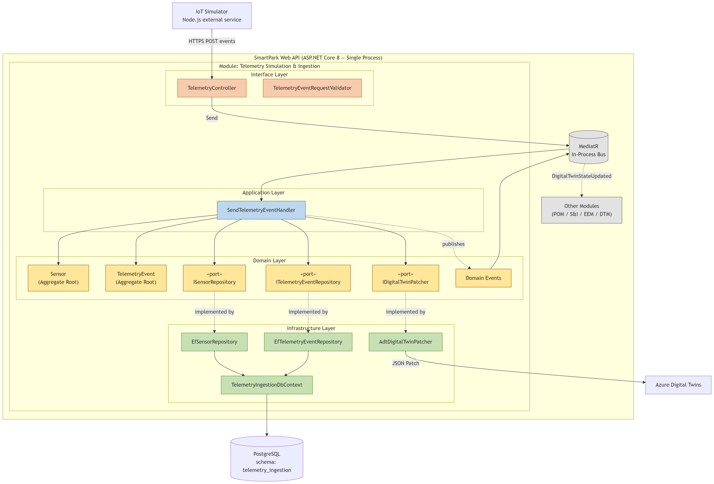

### 5.4.6. Class Diagram — Telemetry Simulation & Ingestion

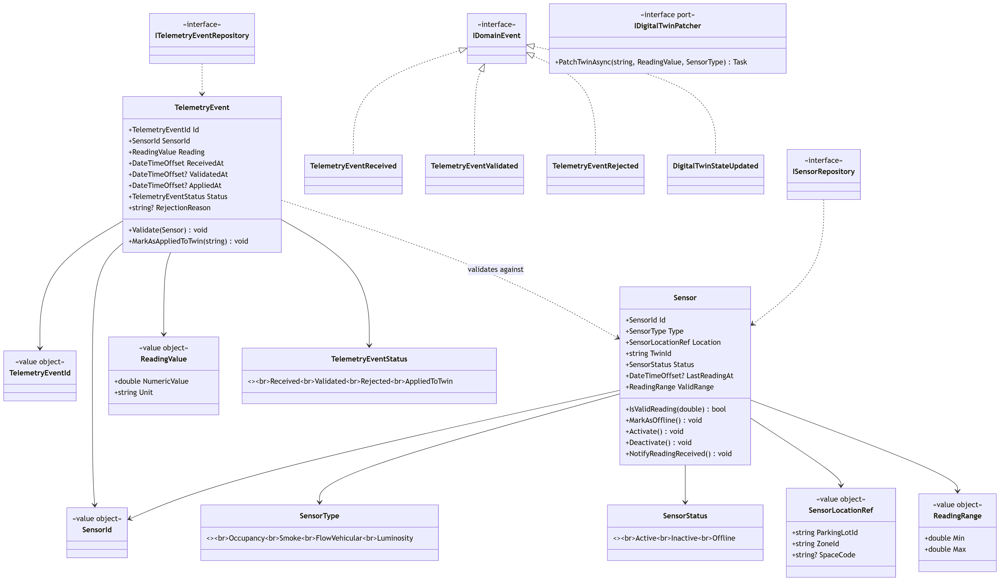

### 5.4.7. Database Diagram — Telemetry Simulation & Ingestion

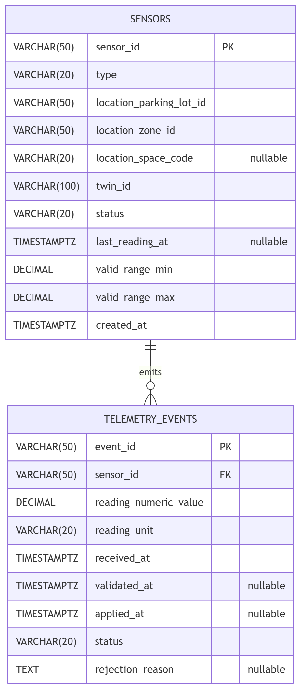


## 5.5. Bounded Context: Safety & Incidents

El contexto **Safety & Incidents** es responsable de gestionar la detección, registro, seguimiento, escalamiento y resolución de incidentes de seguridad dentro del estacionamiento inteligente. Sus responsabilidades concretas son: (a) recibir alertas de humo provenientes del sistema de telemetría; (b) transformar dichas alertas en incidentes operativos; (c) clasificar los incidentes según severidad, ubicación y estado; (d) permitir que el operador confirme, escale o resuelva incidentes desde la Web Application; y (e) publicar eventos de dominio que el contexto **Notifications** consume para alertar a operadores y conductores afectados, y que **Digital Twin Synchronization** utiliza para reflejar el incidente dentro del modelo 3D.

Este contexto soporta las historias relacionadas con la visualización de alertas de humo, gestión de incidentes de seguridad y notificación de eventos críticos al operador y al conductor. Además, se integra con **Digital Twin Synchronization** mediante eventos de actualización de estado y con **Notifications** mediante eventos como `IncidentCreated` e `IncidentResolved`.

### 5.5.1 Domain Layer

La capa de dominio contiene la lógica de negocio relacionada con el ciclo de vida de los incidentes de seguridad. En este bounded context se identifica como agregado raíz `Incident`, encargado de registrar la alerta inicial, controlar el estado del incidente, gestionar su severidad y almacenar su resolución.

**Agregado raíz: `Incident`**

```csharp
namespace ApexTwin.SmartPark.WebApi.Modules.SafetyIncidents.Domain.Model;

public sealed class Incident
{
    private readonly List<IDomainEvent> _domainEvents = new();

    public IncidentId Id { get; }
    public SmokeAlert Alert { get; }
    public LocationReference Location { get; }
    public IncidentSeverity Severity { get; private set; }
    public IncidentStatus Status { get; private set; }
    public DateTimeOffset CreatedAt { get; }
    public DateTimeOffset? ResolvedAt { get; private set; }
    public IncidentResolution? Resolution { get; private set; }
    public IReadOnlyCollection<IDomainEvent> DomainEvents => _domainEvents.AsReadOnly();

    private Incident() { }

    public Incident(IncidentId id, SmokeAlert alert, LocationReference location, IncidentSeverity severity)
    {
        Id = id;
        Alert = alert;
        Location = location;
        Severity = severity;
        Status = IncidentStatus.Active;
        CreatedAt = DateTimeOffset.UtcNow;
        _domainEvents.Add(new IncidentCreated(Id, Location, Severity, CreatedAt));
    }

    public void Escalate(IncidentSeverity newSeverity)
    {
        if (Status == IncidentStatus.Resolved)
            throw new InvalidOperationException("Resolved incidents cannot be escalated");

        Severity = newSeverity;
        _domainEvents.Add(new IncidentEscalated(Id, Severity, DateTimeOffset.UtcNow));
    }

    public void Resolve(string operatorId, string notes)
    {
        if (Status == IncidentStatus.Resolved)
            return;

        Resolution = new IncidentResolution(operatorId, notes, DateTimeOffset.UtcNow);
        Status = IncidentStatus.Resolved;
        ResolvedAt = Resolution.ResolvedAt;
        _domainEvents.Add(new IncidentResolved(Id, operatorId, ResolvedAt.Value));
    }

    public void ClearDomainEvents() => _domainEvents.Clear();
}

```

**Entidad: `SmokeAlert`**

```csharp

namespace ApexTwin.SmartPark.WebApi.Modules.SafetyIncidents.Domain.Model;

public sealed class SmokeAlert
{
    public SmokeAlertId Id { get; }
    public string SensorId { get; }
    public double SmokeLevel { get; }
    public DateTimeOffset DetectedAt { get; }

    private SmokeAlert() { }

    public SmokeAlert(SmokeAlertId id, string sensorId, double smokeLevel)
    {
        Id = id;
        SensorId = sensorId;
        SmokeLevel = smokeLevel;
        DetectedAt = DateTimeOffset.UtcNow;
    }
}

```

**Entidad: `IncidentResolution`**

```csharp
namespace ApexTwin.SmartPark.WebApi.Modules.SafetyIncidents.Domain.Model;

public sealed class IncidentResolution
{
    public string OperatorId { get; }
    public string Notes { get; }
    public DateTimeOffset ResolvedAt { get; }

    private IncidentResolution() { }

    public IncidentResolution(string operatorId, string notes, DateTimeOffset resolvedAt)
    {
        OperatorId = operatorId;
        Notes = notes;
        ResolvedAt = resolvedAt;
    }
}
```


**Value Objects y enumeraciones**

```csharp
namespace ApexTwin.SmartPark.WebApi.Modules.SafetyIncidents.Domain.Events;

using MediatR;
using ApexTwin.SmartPark.WebApi.Shared.Kernel;
using ApexTwin.SmartPark.WebApi.Modules.SafetyIncidents.Domain.Model;

public sealed record SmokeDetected(
    SmokeAlertId AlertId,
    string SensorId,
    double SmokeLevel,
    DateTimeOffset OccurredAt
) : IDomainEvent, INotification;

public sealed record IncidentCreated(
    IncidentId IncidentId,
    LocationReference Location,
    IncidentSeverity Severity,
    DateTimeOffset OccurredAt
) : IDomainEvent, INotification;

public sealed record IncidentEscalated(
    IncidentId IncidentId,
    IncidentSeverity Severity,
    DateTimeOffset OccurredAt
) : IDomainEvent, INotification;

public sealed record IncidentResolved(
    IncidentId IncidentId,
    string OperatorId,
    DateTimeOffset OccurredAt
) : IDomainEvent, INotification;

```


**Repositorio**

```csharp

namespace ApexTwin.SmartPark.WebApi.Modules.SafetyIncidents.Domain.Repositories;

using ApexTwin.SmartPark.WebApi.Modules.SafetyIncidents.Domain.Model;

public interface IIncidentRepository
{
    Task<Incident?> FindByIdAsync(IncidentId id, CancellationToken ct = default);
    Task<IReadOnlyList<Incident>> FindActiveAsync(CancellationToken ct = default);
    Task SaveAsync(Incident incident, CancellationToken ct = default);
}

```

### 5.5.2. Application Layer

La capa de aplicación orquesta los casos de uso mediante comandos, queries y handlers. Los comandos modifican el estado del incidente, mientras que las queries permiten consultar incidentes activos o revisar el detalle de un incidente específico.


```csharp
namespace ApexTwin.SmartPark.WebApi.Modules.SafetyIncidents.Application.Commands;

using MediatR;

public sealed record RegisterSmokeAlertCommand(
    string SensorId,
    double SmokeLevel,
    string ParkingLotId,
    string ZoneId,
    string? SpaceCode
) : IRequest<string>;

public sealed record ResolveIncidentCommand(
    string IncidentId,
    string OperatorId,
    string Notes
) : IRequest;
```

```csharp
namespace ApexTwin.SmartPark.WebApi.Modules.SafetyIncidents.Application.Queries;

using MediatR;
using ApexTwin.SmartPark.WebApi.Modules.SafetyIncidents.Application.Dtos;

public sealed record GetActiveIncidentsQuery() : IRequest<IReadOnlyList<IncidentDto>>;

public sealed record GetIncidentByIdQuery(string IncidentId) : IRequest<IncidentDto>;
```


**Command Handlers**

```csharp
namespace ApexTwin.SmartPark.WebApi.Modules.SafetyIncidents.Application.Handlers;

using MediatR;
using ApexTwin.SmartPark.WebApi.Modules.SafetyIncidents.Application.Commands;
using ApexTwin.SmartPark.WebApi.Modules.SafetyIncidents.Domain.Model;
using ApexTwin.SmartPark.WebApi.Modules.SafetyIncidents.Domain.Repositories;

public sealed class RegisterSmokeAlertHandler : IRequestHandler<RegisterSmokeAlertCommand, string>
{
    private readonly IIncidentRepository _repository;
    private readonly IPublisher _publisher;

    public RegisterSmokeAlertHandler(IIncidentRepository repository, IPublisher publisher)
    {
        _repository = repository;
        _publisher = publisher;
    }

    public async Task<string> Handle(RegisterSmokeAlertCommand cmd, CancellationToken ct)
    {
        var alert = new SmokeAlert(
            new SmokeAlertId(Guid.NewGuid().ToString()),
            cmd.SensorId,
            cmd.SmokeLevel);

        var location = new LocationReference(cmd.ParkingLotId, cmd.ZoneId, cmd.SpaceCode);
        var severity = cmd.SmokeLevel >= 80 ? IncidentSeverity.Critical : IncidentSeverity.High;

        var incident = new Incident(
            new IncidentId(Guid.NewGuid().ToString()),
            alert,
            location,
            severity);

        await _repository.SaveAsync(incident, ct);

        foreach (var domainEvent in incident.DomainEvents)
            await _publisher.Publish(domainEvent, ct);

        incident.ClearDomainEvents();
        return incident.Id.Value;
    }
}

public sealed class ResolveIncidentHandler : IRequestHandler<ResolveIncidentCommand>
{
    private readonly IIncidentRepository _repository;
    private readonly IPublisher _publisher;

    public ResolveIncidentHandler(IIncidentRepository repository, IPublisher publisher)
    {
        _repository = repository;
        _publisher = publisher;
    }

    public async Task Handle(ResolveIncidentCommand cmd, CancellationToken ct)
    {
        var id = new IncidentId(cmd.IncidentId);
        var incident = await _repository.FindByIdAsync(id, ct)
            ?? throw new InvalidOperationException("Incident not found");

        incident.Resolve(cmd.OperatorId, cmd.Notes);
        await _repository.SaveAsync(incident, ct);

        foreach (var domainEvent in incident.DomainEvents)
            await _publisher.Publish(domainEvent, ct);

        incident.ClearDomainEvents();
    }
}

```

**Query Handlers**

```csharp

namespace ApexTwin.SmartPark.WebApi.Modules.SafetyIncidents.Application.Handlers;

using MediatR;
using ApexTwin.SmartPark.WebApi.Modules.SafetyIncidents.Application.Dtos;
using ApexTwin.SmartPark.WebApi.Modules.SafetyIncidents.Application.Queries;
using ApexTwin.SmartPark.WebApi.Modules.SafetyIncidents.Domain.Repositories;

public sealed class GetActiveIncidentsHandler
    : IRequestHandler<GetActiveIncidentsQuery, IReadOnlyList<IncidentDto>>
{
    private readonly IIncidentRepository _repository;

    public GetActiveIncidentsHandler(IIncidentRepository repository)
    {
        _repository = repository;
    }

    public async Task<IReadOnlyList<IncidentDto>> Handle(GetActiveIncidentsQuery query, CancellationToken ct)
    {
        var incidents = await _repository.FindActiveAsync(ct);
        return incidents.Select(i => new IncidentDto(
            i.Id.Value,
            i.Location.ParkingLotId,
            i.Location.ZoneId,
            i.Location.SpaceCode,
            i.Severity.ToString(),
            i.Status.ToString(),
            i.CreatedAt,
            i.ResolvedAt
        )).ToList();
    }
}
```
**DTOs de aplicación**

```csharp

namespace ApexTwin.SmartPark.WebApi.Modules.SafetyIncidents.Application.Dtos;

public sealed record IncidentDto(
    string IncidentId,
    string ParkingLotId,
    string ZoneId,
    string? SpaceCode,
    string Severity,
    string Status,
    DateTimeOffset CreatedAt,
    DateTimeOffset? ResolvedAt);

public sealed record SmokeAlertDto(
    string AlertId,
    string SensorId,
    double SmokeLevel,
    DateTimeOffset DetectedAt);
```

### 5.5.3. Interface Layer

La capa de interfaz expone los casos de uso mediante controladores REST. Los controladores reciben solicitudes desde la Web Application del operador, envían comandos o queries mediante MediatR y devuelven respuestas HTTP adecuadas.

**Controlador**

```csharp
namespace ApexTwin.SmartPark.WebApi.Modules.SafetyIncidents.Interfaces.Rest;

using Microsoft.AspNetCore.Mvc;
using MediatR;
using ApexTwin.SmartPark.WebApi.Modules.SafetyIncidents.Application.Commands;
using ApexTwin.SmartPark.WebApi.Modules.SafetyIncidents.Application.Queries;

[ApiController]
[Route("api/v1/incidents")]
public sealed class IncidentsController : ControllerBase
{
    private readonly IMediator _mediator;

    public IncidentsController(IMediator mediator)
    {
        _mediator = mediator;
    }

    [HttpGet]
    public async Task<IActionResult> GetActiveIncidents(CancellationToken ct)
    {
        var result = await _mediator.Send(new GetActiveIncidentsQuery(), ct);
        return Ok(result);
    }

    [HttpGet("{incidentId}")]
    public async Task<IActionResult> GetIncidentById(string incidentId, CancellationToken ct)
    {
        var result = await _mediator.Send(new GetIncidentByIdQuery(incidentId), ct);
        return Ok(result);
    }

    [HttpPost("smoke-alerts")]
    public async Task<IActionResult> RegisterSmokeAlert(
        [FromBody] RegisterSmokeAlertRequest request,
        CancellationToken ct)
    {
        var incidentId = await _mediator.Send(new RegisterSmokeAlertCommand(
            request.SensorId,
            request.SmokeLevel,
            request.ParkingLotId,
            request.ZoneId,
            request.SpaceCode), ct);

        return Accepted(new { incidentId });
    }

    [HttpPatch("{incidentId}/resolve")]
    public async Task<IActionResult> ResolveIncident(
        string incidentId,
        [FromBody] ResolveIncidentRequest request,
        CancellationToken ct)
    {
        await _mediator.Send(new ResolveIncidentCommand(
            incidentId,
            request.OperatorId,
            request.Notes), ct);

        return NoContent();
    }
}

```


**Request DTOs y validación**

```csharp
namespace ApexTwin.SmartPark.WebApi.Modules.SafetyIncidents.Interfaces.Rest.Dtos;

public sealed record RegisterSmokeAlertRequest(
    string SensorId,
    double SmokeLevel,
    string ParkingLotId,
    string ZoneId,
    string? SpaceCode);

public sealed record ResolveIncidentRequest(
    string OperatorId,
    string Notes);

```

```csharp
namespace ApexTwin.SmartPark.WebApi.Modules.SafetyIncidents.Interfaces.Rest.Validation;

using FluentValidation;

public sealed class RegisterSmokeAlertRequestValidator : AbstractValidator<RegisterSmokeAlertRequest>
{
    public RegisterSmokeAlertRequestValidator()
    {
        RuleFor(x => x.SensorId).NotEmpty();
        RuleFor(x => x.SmokeLevel).GreaterThanOrEqualTo(0);
        RuleFor(x => x.ParkingLotId).NotEmpty();
        RuleFor(x => x.ZoneId).NotEmpty();
    }
}

```

### 5.5.4. Infrastructure Layer

La capa de infraestructura implementa los puertos del dominio y gestiona la persistencia mediante Entity Framework Core. También integra SignalR para informar incidentes en tiempo real al dashboard del operador.

**DbContext del módulo**

```csharp

namespace ApexTwin.SmartPark.WebApi.Modules.SafetyIncidents.Infrastructure.Persistence;

using Microsoft.EntityFrameworkCore;
using ApexTwin.SmartPark.WebApi.Modules.SafetyIncidents.Domain.Model;

public sealed class SafetyIncidentsDbContext : DbContext
{
    public DbSet<Incident> Incidents => Set<Incident>();

    public SafetyIncidentsDbContext(DbContextOptions<SafetyIncidentsDbContext> options)
        : base(options) { }

    protected override void OnModelCreating(ModelBuilder modelBuilder)
    {
        modelBuilder.HasDefaultSchema("safety_incidents");
        modelBuilder.ApplyConfigurationsFromAssembly(typeof(SafetyIncidentsDbContext).Assembly);
    }
}
```

**Notificador SignalR**

```csharp
namespace ApexTwin.SmartPark.WebApi.Modules.SafetyIncidents.Infrastructure.RealTime;

using MediatR;
using Microsoft.AspNetCore.SignalR;
using ApexTwin.SmartPark.WebApi.Shared.Infrastructure.SignalR;
using ApexTwin.SmartPark.WebApi.Modules.SafetyIncidents.Domain.Events;

public sealed class IncidentCreatedNotifier : INotificationHandler<IncidentCreated>
{
    private readonly IHubContext<DashboardHub> _hub;

    public IncidentCreatedNotifier(IHubContext<DashboardHub> hub)
    {
        _hub = hub;
    }

    public Task Handle(IncidentCreated notification, CancellationToken ct)
        => _hub.Clients.Group("operators").SendAsync("IncidentCreated", new
        {
            incidentId = notification.IncidentId.Value,
            parkingLotId = notification.Location.ParkingLotId,
            zoneId = notification.Location.ZoneId,
            spaceCode = notification.Location.SpaceCode,
            severity = notification.Severity.ToString(),
            occurredAt = notification.OccurredAt
        }, ct);
}

```

### 5.5.5 Component Diagram — Safety & Incidents

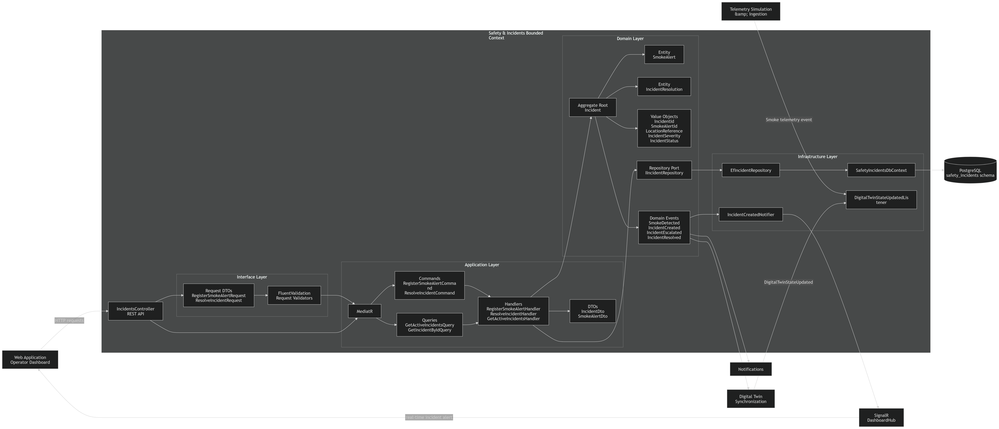

### 5.5.6 Class Diagram — Safety & Incidents

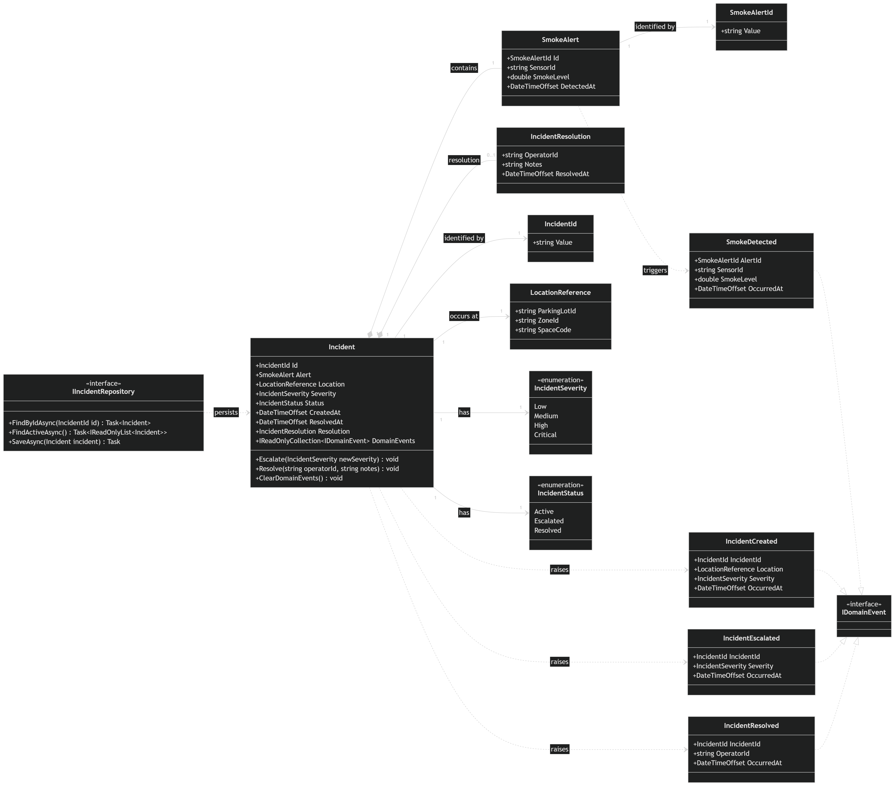

### 5.5.7 Database Diagram — Safety & Incidents

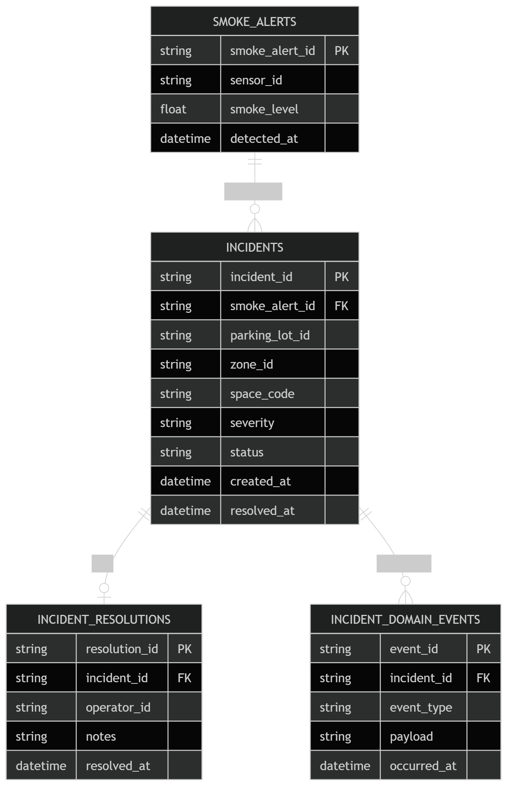


## 5.6 Bounded Context: Parking Session

El contexto Parking Session es responsable de gestionar la sesión de estacionamiento del conductor desde el ingreso hasta la finalización de su permanencia. Sus responsabilidades concretas son: (a) iniciar una sesión de estacionamiento asociada a un conductor y vehículo; (b) registrar la ubicación del vehículo dentro del estacionamiento; (c) consultar la sesión activa del conductor; (d) finalizar la sesión cuando el conductor abandona el estacionamiento; y (e) publicar eventos que pueden ser consumidos por Notifications y Parking Operations Monitoring.

## 5.6.1 Domain Layer

La capa de dominio contiene la lógica relacionada con el ciclo de vida de una sesión de estacionamiento. El agregado raíz es ParkingSession, encargado de controlar el inicio, registro de ubicación y cierre de la sesión.

**Entidad: `SmokeAlert`**

```csharp
namespace ApexTwin.SmartPark.WebApi.Modules.ParkingSessions.Domain.Model;

public sealed class ParkingSession
{
    private readonly List<IDomainEvent> _domainEvents = new();

    public ParkingSessionId Id { get; }
    public DriverId DriverId { get; }
    public Vehicle Vehicle { get; }
    public ParkingSpaceReference? AssignedSpace { get; private set; }
    public SessionStatus Status { get; private set; }
    public DateTimeOffset StartedAt { get; }
    public DateTimeOffset? FinishedAt { get; private set; }
    public IReadOnlyCollection<IDomainEvent> DomainEvents => _domainEvents.AsReadOnly();

    private ParkingSession() { }

    public ParkingSession(ParkingSessionId id, DriverId driverId, Vehicle vehicle)
    {
        Id = id;
        DriverId = driverId;
        Vehicle = vehicle;
        Status = SessionStatus.Active;
        StartedAt = DateTimeOffset.UtcNow;
        _domainEvents.Add(new ParkingSessionStarted(Id, DriverId, Vehicle.Plate, StartedAt));
    }

    public void RegisterLocation(ParkingSpaceReference space)
    {
        if (Status != SessionStatus.Active)
            throw new InvalidOperationException("Only active sessions can register location");

        AssignedSpace = space;
        _domainEvents.Add(new VehicleLocationRegistered(Id, DriverId, space, DateTimeOffset.UtcNow));
    }

    public void Finish()
    {
        if (Status == SessionStatus.Finished)
            return;

        Status = SessionStatus.Finished;
        FinishedAt = DateTimeOffset.UtcNow;
        _domainEvents.Add(new ParkingSessionFinished(Id, DriverId, FinishedAt.Value));
    }

    public void ClearDomainEvents() => _domainEvents.Clear();
}
```

**Entidad: `Vehicle`**

```csharp
namespace ApexTwin.SmartPark.WebApi.Modules.ParkingSessions.Domain.Model;

public sealed class Vehicle
{
    public VehiclePlate Plate { get; }
    public string? Brand { get; }
    public string? Color { get; }

    private Vehicle() { }

    public Vehicle(VehiclePlate plate, string? brand, string? color)
    {
        Plate = plate;
        Brand = brand;
        Color = color;
    }
}
```

**Value Objects y enumeraciones**

```csharp
namespace ApexTwin.SmartPark.WebApi.Modules.ParkingSessions.Domain.Model;

public sealed record ParkingSessionId(string Value);
public sealed record DriverId(string Value);
public sealed record VehiclePlate(string Value);
public sealed record ParkingSpaceReference(string ParkingLotId, string ZoneId, string SpaceCode);

public enum SessionStatus { Active, Finished, Cancelled }
```

**Eventos de dominio**

```csharp
namespace ApexTwin.SmartPark.WebApi.Modules.ParkingSessions.Domain.Events;

using MediatR;
using ApexTwin.SmartPark.WebApi.Shared.Kernel;
using ApexTwin.SmartPark.WebApi.Modules.ParkingSessions.Domain.Model;

public sealed record ParkingSessionStarted(
    ParkingSessionId SessionId,
    DriverId DriverId,
    VehiclePlate Plate,
    DateTimeOffset OccurredAt
) : IDomainEvent, INotification;

public sealed record VehicleLocationRegistered(
    ParkingSessionId SessionId,
    DriverId DriverId,
    ParkingSpaceReference Space,
    DateTimeOffset OccurredAt
) : IDomainEvent, INotification;

public sealed record ParkingSessionFinished(
    ParkingSessionId SessionId,
    DriverId DriverId,
    DateTimeOffset OccurredAt
) : IDomainEvent, INotification;
```

**Repositorio**

```csharp
namespace ApexTwin.SmartPark.WebApi.Modules.ParkingSessions.Domain.Repositories;

using ApexTwin.SmartPark.WebApi.Modules.ParkingSessions.Domain.Model;

public interface IParkingSessionRepository
{
    Task<ParkingSession?> FindByIdAsync(ParkingSessionId id, CancellationToken ct = default);
    Task<ParkingSession?> FindActiveByDriverAsync(DriverId driverId, CancellationToken ct = default);
    Task SaveAsync(ParkingSession session, CancellationToken ct = default);
}
```

### 5.6.2. Application Layer


**Comandos y Queries**

```csharp
namespace ApexTwin.SmartPark.WebApi.Modules.ParkingSessions.Application.Commands;

using MediatR;

public sealed record StartParkingSessionCommand(
    string DriverId,
    string Plate,
    string? Brand,
    string? Color
) : IRequest<string>;

public sealed record RegisterVehicleLocationCommand(
    string SessionId,
    string ParkingLotId,
    string ZoneId,
    string SpaceCode
) : IRequest;

public sealed record FinishParkingSessionCommand(string SessionId) : IRequest;
```

```csharp
namespace ApexTwin.SmartPark.WebApi.Modules.ParkingSessions.Application.Queries;

using MediatR;
using ApexTwin.SmartPark.WebApi.Modules.ParkingSessions.Application.Dtos;

public sealed record GetParkingSessionByIdQuery(string SessionId) : IRequest<ParkingSessionDto>;

public sealed record GetActiveSessionByDriverQuery(string DriverId) : IRequest<ParkingSessionDto?>;
```

**EntiCommand Handler**

```csharp
namespace ApexTwin.SmartPark.WebApi.Modules.ParkingSessions.Application.Handlers;

using MediatR;
using ApexTwin.SmartPark.WebApi.Modules.ParkingSessions.Application.Commands;
using ApexTwin.SmartPark.WebApi.Modules.ParkingSessions.Domain.Model;
using ApexTwin.SmartPark.WebApi.Modules.ParkingSessions.Domain.Repositories;

public sealed class StartParkingSessionHandler : IRequestHandler<StartParkingSessionCommand, string>
{
    private readonly IParkingSessionRepository _repository;
    private readonly IPublisher _publisher;

    public StartParkingSessionHandler(IParkingSessionRepository repository, IPublisher publisher)
    {
        _repository = repository;
        _publisher = publisher;
    }

    public async Task<string> Handle(StartParkingSessionCommand cmd, CancellationToken ct)
    {
        var session = new ParkingSession(
            new ParkingSessionId(Guid.NewGuid().ToString()),
            new DriverId(cmd.DriverId),
            new Vehicle(new VehiclePlate(cmd.Plate), cmd.Brand, cmd.Color));

        await _repository.SaveAsync(session, ct);

        foreach (var domainEvent in session.DomainEvents)
            await _publisher.Publish(domainEvent, ct);

        session.ClearDomainEvents();
        return session.Id.Value;
    }
}
```

**DTOs de aplicación**

```csharp
namespace ApexTwin.SmartPark.WebApi.Modules.ParkingSessions.Application.Dtos;

public sealed record ParkingSessionDto(
    string SessionId,
    string DriverId,
    string Plate,
    string? ParkingLotId,
    string? ZoneId,
    string? SpaceCode,
    string Status,
    DateTimeOffset StartedAt,
    DateTimeOffset? FinishedAt);
```

### 5.6.3. Interface Layer


**Controlador**

```csharp
namespace ApexTwin.SmartPark.WebApi.Modules.ParkingSessions.Interfaces.Rest;

using Microsoft.AspNetCore.Mvc;
using MediatR;
using ApexTwin.SmartPark.WebApi.Modules.ParkingSessions.Application.Commands;
using ApexTwin.SmartPark.WebApi.Modules.ParkingSessions.Application.Queries;

[ApiController]
[Route("api/v1/parking-sessions")]
public sealed class ParkingSessionsController : ControllerBase
{
    private readonly IMediator _mediator;

    public ParkingSessionsController(IMediator mediator)
    {
        _mediator = mediator;
    }

    [HttpPost]
    public async Task<IActionResult> StartSession([FromBody] StartParkingSessionRequest request, CancellationToken ct)
    {
        var sessionId = await _mediator.Send(new StartParkingSessionCommand(
            request.DriverId,
            request.Plate,
            request.Brand,
            request.Color), ct);

        return CreatedAtAction(nameof(GetSessionById), new { sessionId }, new { sessionId });
    }

    [HttpGet("{sessionId}")]
    public async Task<IActionResult> GetSessionById(string sessionId, CancellationToken ct)
    {
        var result = await _mediator.Send(new GetParkingSessionByIdQuery(sessionId), ct);
        return Ok(result);
    }

    [HttpPatch("{sessionId}/location")]
    public async Task<IActionResult> RegisterLocation(
        string sessionId,
        [FromBody] RegisterVehicleLocationRequest request,
        CancellationToken ct)
    {
        await _mediator.Send(new RegisterVehicleLocationCommand(
            sessionId,
            request.ParkingLotId,
            request.ZoneId,
            request.SpaceCode), ct);

        return NoContent();
    }

    [HttpPatch("{sessionId}/finish")]
    public async Task<IActionResult> FinishSession(string sessionId, CancellationToken ct)
    {
        await _mediator.Send(new FinishParkingSessionCommand(sessionId), ct);
        return NoContent();
    }
}
```

**Request DTOs**

```csharp
namespace ApexTwin.SmartPark.WebApi.Modules.ParkingSessions.Interfaces.Rest.Dtos;

public sealed record StartParkingSessionRequest(
    string DriverId,
    string Plate,
    string? Brand,
    string? Color);

public sealed record RegisterVehicleLocationRequest(
    string ParkingLotId,
    string ZoneId,
    string SpaceCode);
```

### 5.6.4 Infrastructure Layer

**DbContext del módulo**

```csharp
namespace ApexTwin.SmartPark.WebApi.Modules.ParkingSessions.Infrastructure.Persistence;

using Microsoft.EntityFrameworkCore;
using ApexTwin.SmartPark.WebApi.Modules.ParkingSessions.Domain.Model;

public sealed class ParkingSessionsDbContext : DbContext
{
    public DbSet<ParkingSession> ParkingSessions => Set<ParkingSession>();

    public ParkingSessionsDbContext(DbContextOptions<ParkingSessionsDbContext> options)
        : base(options) { }

    protected override void OnModelCreating(ModelBuilder modelBuilder)
    {
        modelBuilder.HasDefaultSchema("parking_sessions");
        modelBuilder.ApplyConfigurationsFromAssembly(typeof(ParkingSessionsDbContext).Assembly);
    }
}
```

**Implementación del repositorio**

```csharp
namespace ApexTwin.SmartPark.WebApi.Modules.ParkingSessions.Infrastructure.Persistence;

using Microsoft.EntityFrameworkCore;
using ApexTwin.SmartPark.WebApi.Modules.ParkingSessions.Domain.Model;
using ApexTwin.SmartPark.WebApi.Modules.ParkingSessions.Domain.Repositories;

public sealed class EfParkingSessionRepository : IParkingSessionRepository
{
    private readonly ParkingSessionsDbContext _context;

    public EfParkingSessionRepository(ParkingSessionsDbContext context)
    {
        _context = context;
    }

    public Task<ParkingSession?> FindByIdAsync(ParkingSessionId id, CancellationToken ct = default)
        => _context.ParkingSessions.FirstOrDefaultAsync(s => s.Id == id, ct);

    public Task<ParkingSession?> FindActiveByDriverAsync(DriverId driverId, CancellationToken ct = default)
        => _context.ParkingSessions.FirstOrDefaultAsync(
            s => s.DriverId == driverId && s.Status == SessionStatus.Active, ct);

    public async Task SaveAsync(ParkingSession session, CancellationToken ct = default)
    {
        var existing = await _context.ParkingSessions.FindAsync(new object[] { session.Id }, ct);
        if (existing is null) await _context.ParkingSessions.AddAsync(session, ct);
        else _context.Entry(existing).CurrentValues.SetValues(session);
        await _context.SaveChangesAsync(ct);
    }
}
```

### 5.6.5. Component Diagram — Parking Session

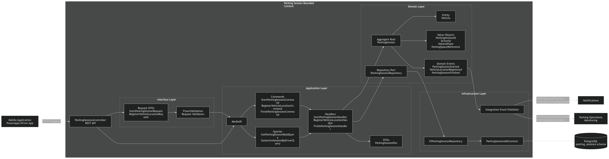

### 5.6.6. Class Diagram — Parking Session

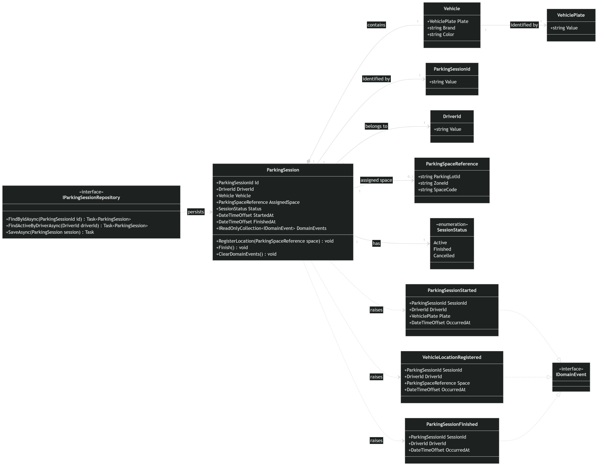

### 5.6.7. Database Diagram — Parking Session

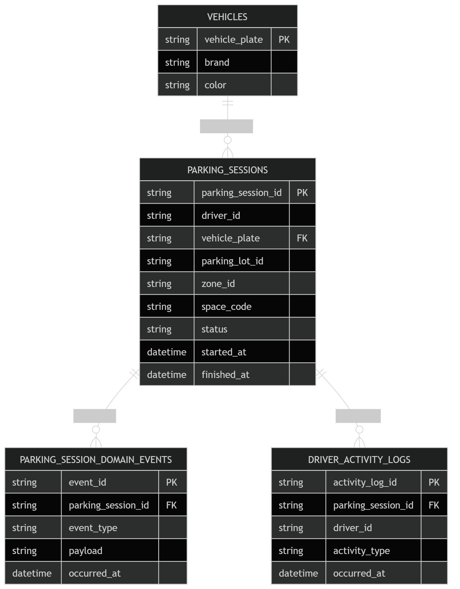


## 5.7. Bounded Context: Notifications

El contexto **Notifications** es responsable de gestionar la creación, envío, seguimiento y lectura de notificaciones dirigidas a operadores y conductores. Sus responsabilidades concretas son: (a) recibir solicitudes de notificación desde otros bounded contexts; (b) clasificar las notificaciones según canal, prioridad y destinatario; (c) enviar alertas mediante SignalR o Firebase Cloud Messaging; (d) registrar intentos de entrega; y (e) permitir que los usuarios consulten y marquen sus notificaciones como leídas.

Este contexto consume eventos como `IncidentCreated`, `IncidentResolved`, `ParkingSessionStarted` y `VehicleLocationRegistered`, provenientes de los contextos **Safety & Incidents** y **Parking Session**.

### 5.7.1. Domain Layer

La capa de dominio contiene la lógica relacionada con el ciclo de vida de una notificación. El agregado raíz es `Notification`, encargado de controlar el contenido, destinatario, prioridad, estado y canal de entrega.

**Agregado raíz: `Notification`**

```csharp
namespace ApexTwin.SmartPark.WebApi.Modules.Notifications.Domain.Model;

public sealed class Notification
{
    private readonly List<DeliveryAttempt> _attempts = new();
    private readonly List<IDomainEvent> _domainEvents = new();

    public NotificationId Id { get; }
    public RecipientId RecipientId { get; }
    public string Title { get; }
    public string Message { get; }
    public NotificationChannel Channel { get; }
    public NotificationPriority Priority { get; }
    public NotificationStatus Status { get; private set; }
    public DateTimeOffset CreatedAt { get; }
    public DateTimeOffset? ReadAt { get; private set; }
    public IReadOnlyCollection<DeliveryAttempt> Attempts => _attempts.AsReadOnly();
    public IReadOnlyCollection<IDomainEvent> DomainEvents => _domainEvents.AsReadOnly();

    private Notification() { }

    public Notification(NotificationId id, RecipientId recipientId, string title, string message, NotificationChannel channel, NotificationPriority priority)
    {
        Id = id;
        RecipientId = recipientId;
        Title = title;
        Message = message;
        Channel = channel;
        Priority = priority;
        Status = NotificationStatus.Pending;
        CreatedAt = DateTimeOffset.UtcNow;
        _domainEvents.Add(new NotificationRequested(Id, RecipientId, Channel, CreatedAt));
    }

    public void MarkAsSent()
    {
        Status = NotificationStatus.Sent;
        _attempts.Add(new DeliveryAttempt(Channel, true, DateTimeOffset.UtcNow));
        _domainEvents.Add(new NotificationSent(Id, RecipientId, DateTimeOffset.UtcNow));
    }

    public void MarkAsFailed(string reason)
    {
        Status = NotificationStatus.Failed;
        _attempts.Add(new DeliveryAttempt(Channel, false, DateTimeOffset.UtcNow, reason));
        _domainEvents.Add(new NotificationFailed(Id, RecipientId, reason, DateTimeOffset.UtcNow));
    }

    public void MarkAsRead()
    {
        if (Status == NotificationStatus.Read)
            return;

        Status = NotificationStatus.Read;
        ReadAt = DateTimeOffset.UtcNow;
        _domainEvents.Add(new NotificationRead(Id, RecipientId, ReadAt.Value));
    }

    public void ClearDomainEvents() => _domainEvents.Clear();
}
```

**Entidad: `DeliveryAttempt`**

```csharp
namespace ApexTwin.SmartPark.WebApi.Modules.Notifications.Domain.Model;

public sealed class DeliveryAttempt
{
    public NotificationChannel Channel { get; }
    public bool Success { get; }
    public DateTimeOffset AttemptedAt { get; }
    public string? FailureReason { get; }

    private DeliveryAttempt() { }

    public DeliveryAttempt(NotificationChannel channel, bool success, DateTimeOffset attemptedAt, string? failureReason = null)
    {
        Channel = channel;
        Success = success;
        AttemptedAt = attemptedAt;
        FailureReason = failureReason;
    }
}
```

**Value Objects y enumeraciones**

```csharp
namespace ApexTwin.SmartPark.WebApi.Modules.Notifications.Domain.Model;

public sealed record NotificationId(string Value);
public sealed record RecipientId(string Value);

public enum NotificationChannel { SignalR, FirebasePush, Email }
public enum NotificationPriority { Low, Normal, High, Critical }
public enum NotificationStatus { Pending, Sent, Failed, Read }
```

**Eventos de dominio**

```csharp
namespace ApexTwin.SmartPark.WebApi.Modules.Notifications.Domain.Events;

using MediatR;
using ApexTwin.SmartPark.WebApi.Shared.Kernel;
using ApexTwin.SmartPark.WebApi.Modules.Notifications.Domain.Model;

public sealed record NotificationRequested(
    NotificationId NotificationId,
    RecipientId RecipientId,
    NotificationChannel Channel,
    DateTimeOffset OccurredAt
) : IDomainEvent, INotification;

public sealed record NotificationSent(
    NotificationId NotificationId,
    RecipientId RecipientId,
    DateTimeOffset OccurredAt
) : IDomainEvent, INotification;

public sealed record NotificationFailed(
    NotificationId NotificationId,
    RecipientId RecipientId,
    string Reason,
    DateTimeOffset OccurredAt
) : IDomainEvent, INotification;

public sealed record NotificationRead(
    NotificationId NotificationId,
    RecipientId RecipientId,
    DateTimeOffset OccurredAt
) : IDomainEvent, INotification;
```

**Repositorio**

```csharp
namespace ApexTwin.SmartPark.WebApi.Modules.Notifications.Domain.Repositories;

using ApexTwin.SmartPark.WebApi.Modules.Notifications.Domain.Model;

public interface INotificationRepository
{
    Task<Notification?> FindByIdAsync(NotificationId id, CancellationToken ct = default);
    Task<IReadOnlyList<Notification>> FindByRecipientAsync(RecipientId recipientId, CancellationToken ct = default);
    Task SaveAsync(Notification notification, CancellationToken ct = default);
}
```

### 5.7.2. Application Layer

**Comandos y Queries**

```csharp
namespace ApexTwin.SmartPark.WebApi.Modules.Notifications.Application.Commands;

using MediatR;

public sealed record RequestNotificationCommand(
    string RecipientId,
    string Title,
    string Message,
    string Channel,
    string Priority
) : IRequest<string>;

public sealed record MarkNotificationAsReadCommand(string NotificationId) : IRequest;
```

```csharp
namespace ApexTwin.SmartPark.WebApi.Modules.Notifications.Application.Queries;

using MediatR;
using ApexTwin.SmartPark.WebApi.Modules.Notifications.Application.Dtos;

public sealed record GetUserNotificationsQuery(string RecipientId) : IRequest<IReadOnlyList<NotificationDto>>;
```

**Command Handler**

```csharp
namespace ApexTwin.SmartPark.WebApi.Modules.Notifications.Application.Handlers;

using MediatR;
using ApexTwin.SmartPark.WebApi.Modules.Notifications.Application.Commands;
using ApexTwin.SmartPark.WebApi.Modules.Notifications.Domain.Model;
using ApexTwin.SmartPark.WebApi.Modules.Notifications.Domain.Repositories;

public sealed class RequestNotificationHandler : IRequestHandler<RequestNotificationCommand, string>
{
    private readonly INotificationRepository _repository;
    private readonly IPublisher _publisher;

    public RequestNotificationHandler(INotificationRepository repository, IPublisher publisher)
    {
        _repository = repository;
        _publisher = publisher;
    }

    public async Task<string> Handle(RequestNotificationCommand cmd, CancellationToken ct)
    {
        var notification = new Notification(
            new NotificationId(Guid.NewGuid().ToString()),
            new RecipientId(cmd.RecipientId),
            cmd.Title,
            cmd.Message,
            Enum.Parse<NotificationChannel>(cmd.Channel),
            Enum.Parse<NotificationPriority>(cmd.Priority));

        await _repository.SaveAsync(notification, ct);

        foreach (var domainEvent in notification.DomainEvents)
            await _publisher.Publish(domainEvent, ct);

        notification.ClearDomainEvents();
        return notification.Id.Value;
    }
}
```

**DTOs de aplicación**

```csharp
namespace ApexTwin.SmartPark.WebApi.Modules.Notifications.Application.Dtos;

public sealed record NotificationDto(
    string NotificationId,
    string RecipientId,
    string Title,
    string Message,
    string Channel,
    string Priority,
    string Status,
    DateTimeOffset CreatedAt,
    DateTimeOffset? ReadAt);
```

### 5.7.3. 

**Controlador**

```csharp
namespace ApexTwin.SmartPark.WebApi.Modules.Notifications.Interfaces.Rest;

using Microsoft.AspNetCore.Mvc;
using MediatR;
using ApexTwin.SmartPark.WebApi.Modules.Notifications.Application.Commands;
using ApexTwin.SmartPark.WebApi.Modules.Notifications.Application.Queries;

[ApiController]
[Route("api/v1/notifications")]
public sealed class NotificationsController : ControllerBase
{
    private readonly IMediator _mediator;

    public NotificationsController(IMediator mediator)
    {
        _mediator = mediator;
    }

    [HttpGet("user/{recipientId}")]
    public async Task<IActionResult> GetUserNotifications(string recipientId, CancellationToken ct)
    {
        var result = await _mediator.Send(new GetUserNotificationsQuery(recipientId), ct);
        return Ok(result);
    }

    [HttpPost]
    public async Task<IActionResult> RequestNotification([FromBody] RequestNotificationRequest request, CancellationToken ct)
    {
        var notificationId = await _mediator.Send(new RequestNotificationCommand(
            request.RecipientId,
            request.Title,
            request.Message,
            request.Channel,
            request.Priority), ct);

        return Accepted(new { notificationId });
    }

    [HttpPatch("{notificationId}/read")]
    public async Task<IActionResult> MarkAsRead(string notificationId, CancellationToken ct)
    {
        await _mediator.Send(new MarkNotificationAsReadCommand(notificationId), ct);
        return NoContent();
    }
}
```

**Request DTOs**

```csharp
namespace ApexTwin.SmartPark.WebApi.Modules.Notifications.Interfaces.Rest.Dtos;

public sealed record RequestNotificationRequest(
    string RecipientId,
    string Title,
    string Message,
    string Channel,
    string Priority);
```

### 5.7.4. Infrastructure Layer

**DbContext del módulo**

```csharp
namespace ApexTwin.SmartPark.WebApi.Modules.Notifications.Infrastructure.Persistence;

using Microsoft.EntityFrameworkCore;
using ApexTwin.SmartPark.WebApi.Modules.Notifications.Domain.Model;

public sealed class NotificationsDbContext : DbContext
{
    public DbSet<Notification> Notifications => Set<Notification>();

    public NotificationsDbContext(DbContextOptions<NotificationsDbContext> options)
        : base(options) { }

    protected override void OnModelCreating(ModelBuilder modelBuilder)
    {
        modelBuilder.HasDefaultSchema("notifications");
        modelBuilder.ApplyConfigurationsFromAssembly(typeof(NotificationsDbContext).Assembly);
    }
}
```

**Implementación del repositorio**

```csharp
namespace ApexTwin.SmartPark.WebApi.Modules.Notifications.Infrastructure.Persistence;

using Microsoft.EntityFrameworkCore;
using ApexTwin.SmartPark.WebApi.Modules.Notifications.Domain.Model;
using ApexTwin.SmartPark.WebApi.Modules.Notifications.Domain.Repositories;

public sealed class EfNotificationRepository : INotificationRepository
{
    private readonly NotificationsDbContext _context;

    public EfNotificationRepository(NotificationsDbContext context)
    {
        _context = context;
    }

    public Task<Notification?> FindByIdAsync(NotificationId id, CancellationToken ct = default)
        => _context.Notifications.FirstOrDefaultAsync(n => n.Id == id, ct);

    public async Task<IReadOnlyList<Notification>> FindByRecipientAsync(RecipientId recipientId, CancellationToken ct = default)
        => await _context.Notifications.Where(n => n.RecipientId == recipientId).ToListAsync(ct);

    public async Task SaveAsync(Notification notification, CancellationToken ct = default)
    {
        var existing = await _context.Notifications.FindAsync(new object[] { notification.Id }, ct);
        if (existing is null) await _context.Notifications.AddAsync(notification, ct);
        else _context.Entry(existing).CurrentValues.SetValues(notification);
        await _context.SaveChangesAsync(ct);
    }
}
```

### 5.7.5. Component Diagram — Notifications

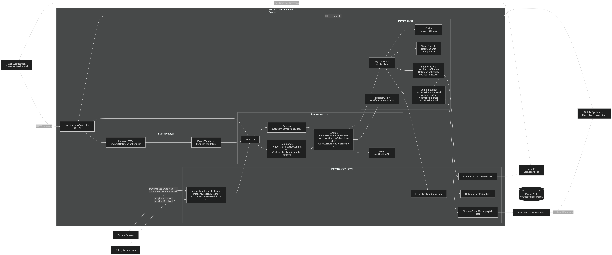


### 5.7.6. Class Diagram — Notifications

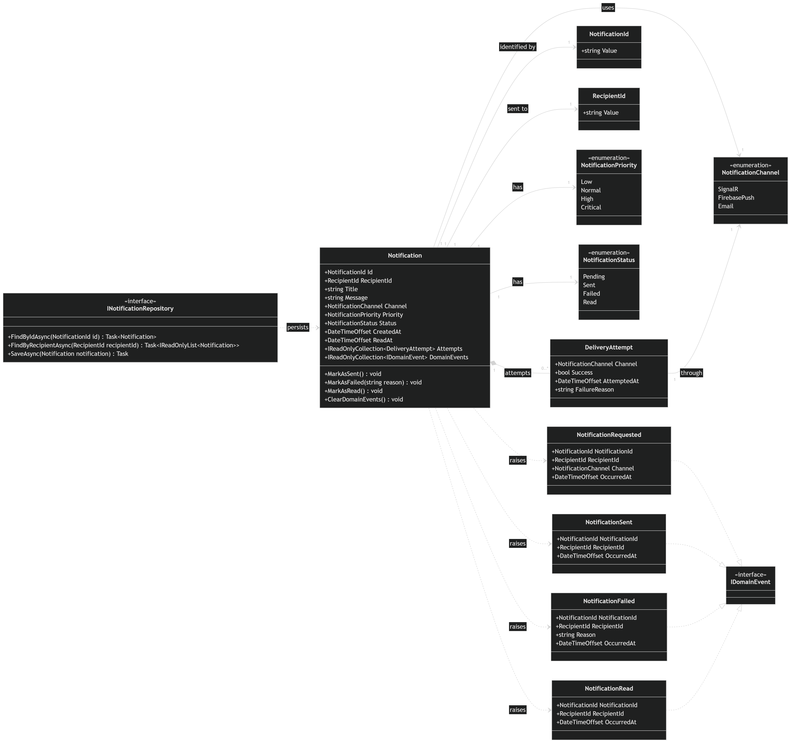

### 5.7.7. Database Diagram — Notifications

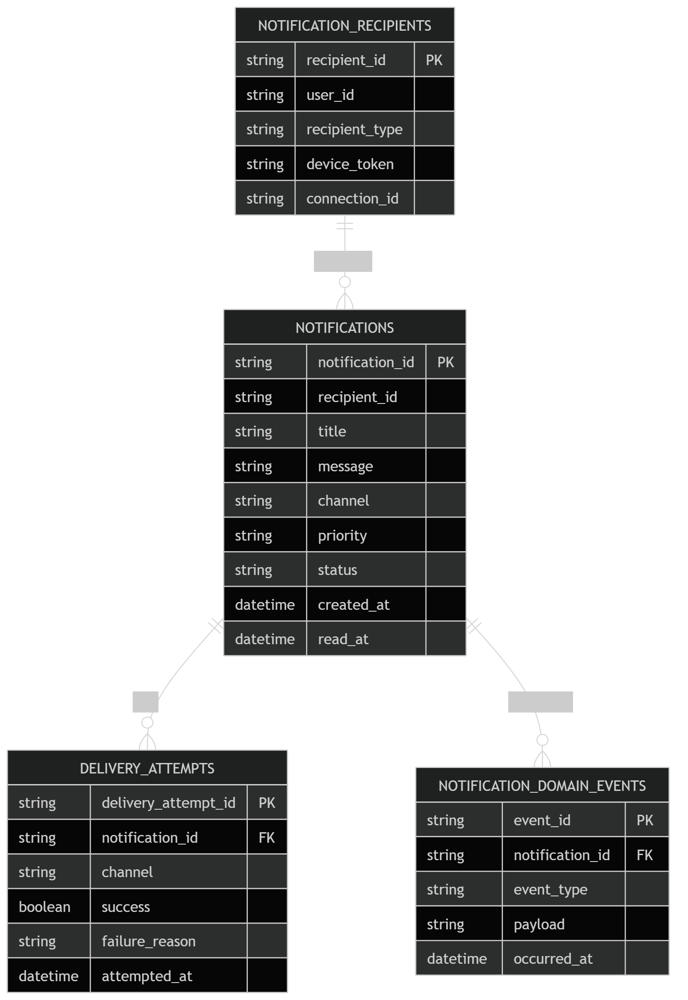


## 5.8. Bounded Context: Identity & Access Management

El contexto Identity & Access Management es responsable de gestionar la identidad, autenticación, autorización y control de acceso de los usuarios de SmartPark. Sus responsabilidades concretas son: (a) registrar cuentas de operadores y conductores; (b) autenticar usuarios mediante credenciales; (c) asignar roles y permisos; (d) emitir tokens de acceso; y (e) publicar eventos de dominio cuando una cuenta es registrada, autenticada o actualizada.

## 5.8.1. Domain Layer

La capa de dominio contiene las reglas relacionadas con la cuenta de usuario, sus credenciales, roles y estado. El agregado raíz es UserAccount, encargado de controlar la identidad principal del usuario dentro del sistema.

**Agregado raíz: `UserAccount`**

```csharp
namespace ApexTwin.SmartPark.WebApi.Modules.IdentityAccess.Domain.Model;

public sealed class UserAccount
{
    private readonly List<Role> _roles = new();
    private readonly List<IDomainEvent> _domainEvents = new();

    public UserId Id { get; }
    public EmailAddress Email { get; }
    public PasswordHash PasswordHash { get; private set; }
    public AccountStatus Status { get; private set; }
    public DateTimeOffset CreatedAt { get; }
    public IReadOnlyCollection<Role> Roles => _roles.AsReadOnly();
    public IReadOnlyCollection<IDomainEvent> DomainEvents => _domainEvents.AsReadOnly();

    private UserAccount() { }

    public UserAccount(UserId id, EmailAddress email, PasswordHash passwordHash)
    {
        Id = id;
        Email = email;
        PasswordHash = passwordHash;
        Status = AccountStatus.Active;
        CreatedAt = DateTimeOffset.UtcNow;
        _domainEvents.Add(new UserRegistered(Id, Email, CreatedAt));
    }

    public void AssignRole(Role role)
    {
        if (_roles.Any(r => r.Name == role.Name))
            return;

        _roles.Add(role);
        _domainEvents.Add(new UserRoleChanged(Id, role.Name, DateTimeOffset.UtcNow));
    }

    public void Disable()
    {
        Status = AccountStatus.Disabled;
        _domainEvents.Add(new AccountDisabled(Id, DateTimeOffset.UtcNow));
    }

    public void ClearDomainEvents() => _domainEvents.Clear();
}
```

**Entidad: `Role`**

```csharp
namespace ApexTwin.SmartPark.WebApi.Modules.IdentityAccess.Domain.Model;

public sealed class Role
{
    private readonly List<Permission> _permissions = new();

    public RoleName Name { get; }
    public IReadOnlyCollection<Permission> Permissions => _permissions.AsReadOnly();

    private Role() { }

    public Role(RoleName name, IEnumerable<Permission> permissions)
    {
        Name = name;
        _permissions.AddRange(permissions);
    }
}
```

**Entidad: `Permission`**

```csharp
namespace ApexTwin.SmartPark.WebApi.Modules.IdentityAccess.Domain.Model;

public sealed class Permission
{
    public string Code { get; }
    public string Description { get; }

    private Permission() { }

    public Permission(string code, string description)
    {
        Code = code;
        Description = description;
    }
}
```

**Value Objects y enumeraciones**

```csharp
namespace ApexTwin.SmartPark.WebApi.Modules.IdentityAccess.Domain.Model;

public sealed record UserId(string Value);
public sealed record EmailAddress(string Value);
public sealed record PasswordHash(string Value);
public sealed record RoleName(string Value);

public enum AccountStatus { Active, Disabled, Locked }
```

**Eventos de dominio**

```csharp
namespace ApexTwin.SmartPark.WebApi.Modules.IdentityAccess.Domain.Events;

using MediatR;
using ApexTwin.SmartPark.WebApi.Shared.Kernel;
using ApexTwin.SmartPark.WebApi.Modules.IdentityAccess.Domain.Model;

public sealed record UserRegistered(
    UserId UserId,
    EmailAddress Email,
    DateTimeOffset OccurredAt
) : IDomainEvent, INotification;

public sealed record UserLoggedIn(
    UserId UserId,
    DateTimeOffset OccurredAt
) : IDomainEvent, INotification;

public sealed record UserRoleChanged(
    UserId UserId,
    RoleName Role,
    DateTimeOffset OccurredAt
) : IDomainEvent, INotification;

public sealed record AccountDisabled(
    UserId UserId,
    DateTimeOffset OccurredAt
) : IDomainEvent, INotification;
```

**Repositorio**

```csharp
namespace ApexTwin.SmartPark.WebApi.Modules.IdentityAccess.Domain.Repositories;

using ApexTwin.SmartPark.WebApi.Modules.IdentityAccess.Domain.Model;

public interface IUserAccountRepository
{
    Task<UserAccount?> FindByIdAsync(UserId id, CancellationToken ct = default);
    Task<UserAccount?> FindByEmailAsync(EmailAddress email, CancellationToken ct = default);
    Task SaveAsync(UserAccount account, CancellationToken ct = default);
}
```
### 5.8.2. Application Layer


**Comandos y Queries**

```csharp
namespace ApexTwin.SmartPark.WebApi.Modules.IdentityAccess.Application.Commands;

using MediatR;

public sealed record RegisterUserCommand(
    string Email,
    string Password,
    string Role
) : IRequest<string>;

public sealed record LoginUserCommand(
    string Email,
    string Password
) : IRequest<AuthResponseDto>;

public sealed record AssignRoleCommand(
    string UserId,
    string Role
) : IRequest;
```

```csharp
namespace ApexTwin.SmartPark.WebApi.Modules.IdentityAccess.Application.Queries;

using MediatR;
using ApexTwin.SmartPark.WebApi.Modules.IdentityAccess.Application.Dtos;

public sealed record GetUserProfileQuery(string UserId) : IRequest<UserProfileDto>;
```


**Command Handler**

```csharp
namespace ApexTwin.SmartPark.WebApi.Modules.IdentityAccess.Application.Handlers;

using MediatR;
using ApexTwin.SmartPark.WebApi.Modules.IdentityAccess.Application.Commands;
using ApexTwin.SmartPark.WebApi.Modules.IdentityAccess.Domain.Model;
using ApexTwin.SmartPark.WebApi.Modules.IdentityAccess.Domain.Repositories;

public sealed class RegisterUserHandler : IRequestHandler<RegisterUserCommand, string>
{
    private readonly IUserAccountRepository _repository;
    private readonly IPasswordHasher _passwordHasher;
    private readonly IPublisher _publisher;

    public RegisterUserHandler(IUserAccountRepository repository, IPasswordHasher passwordHasher, IPublisher publisher)
    {
        _repository = repository;
        _passwordHasher = passwordHasher;
        _publisher = publisher;
    }

    public async Task<string> Handle(RegisterUserCommand cmd, CancellationToken ct)
    {
        var account = new UserAccount(
            new UserId(Guid.NewGuid().ToString()),
            new EmailAddress(cmd.Email),
            new PasswordHash(_passwordHasher.Hash(cmd.Password)));

        account.AssignRole(new Role(new RoleName(cmd.Role), Array.Empty<Permission>()));

        await _repository.SaveAsync(account, ct);

        foreach (var domainEvent in account.DomainEvents)
            await _publisher.Publish(domainEvent, ct);

        account.ClearDomainEvents();
        return account.Id.Value;
    }
}
```

**DTOs de aplicación**

```csharp
namespace ApexTwin.SmartPark.WebApi.Modules.IdentityAccess.Application.Dtos;

public sealed record AuthResponseDto(
    string UserId,
    string Email,
    string AccessToken,
    IReadOnlyList<string> Roles);

public sealed record UserProfileDto(
    string UserId,
    string Email,
    string Status,
    IReadOnlyList<string> Roles);
```

### 5.8.3. Interface Layer

**Controlador**

```csharp
namespace ApexTwin.SmartPark.WebApi.Modules.IdentityAccess.Interfaces.Rest;

using Microsoft.AspNetCore.Mvc;
using MediatR;
using ApexTwin.SmartPark.WebApi.Modules.IdentityAccess.Application.Commands;
using ApexTwin.SmartPark.WebApi.Modules.IdentityAccess.Application.Queries;

[ApiController]
[Route("api/v1/auth")]
public sealed class AuthController : ControllerBase
{
    private readonly IMediator _mediator;

    public AuthController(IMediator mediator)
    {
        _mediator = mediator;
    }

    [HttpPost("register")]
    public async Task<IActionResult> Register([FromBody] RegisterUserRequest request, CancellationToken ct)
    {
        var userId = await _mediator.Send(new RegisterUserCommand(
            request.Email,
            request.Password,
            request.Role), ct);

        return Created("", new { userId });
    }

    [HttpPost("login")]
    public async Task<IActionResult> Login([FromBody] LoginUserRequest request, CancellationToken ct)
    {
        var result = await _mediator.Send(new LoginUserCommand(request.Email, request.Password), ct);
        return Ok(result);
    }
}
```

```csharp
namespace ApexTwin.SmartPark.WebApi.Modules.IdentityAccess.Interfaces.Rest;

using Microsoft.AspNetCore.Mvc;
using MediatR;
using ApexTwin.SmartPark.WebApi.Modules.IdentityAccess.Application.Commands;
using ApexTwin.SmartPark.WebApi.Modules.IdentityAccess.Application.Queries;

[ApiController]
[Route("api/v1/users")]
public sealed class UsersController : ControllerBase
{
    private readonly IMediator _mediator;

    public UsersController(IMediator mediator)
    {
        _mediator = mediator;
    }

    [HttpGet("{userId}")]
    public async Task<IActionResult> GetProfile(string userId, CancellationToken ct)
    {
        var result = await _mediator.Send(new GetUserProfileQuery(userId), ct);
        return Ok(result);
    }

    [HttpPatch("{userId}/roles")]
    public async Task<IActionResult> AssignRole(string userId, [FromBody] AssignRoleRequest request, CancellationToken ct)
    {
        await _mediator.Send(new AssignRoleCommand(userId, request.Role), ct);
        return NoContent();
    }
}
```

**Request DTOs**

```csharp
namespace ApexTwin.SmartPark.WebApi.Modules.IdentityAccess.Interfaces.Rest.Dtos;

public sealed record RegisterUserRequest(
    string Email,
    string Password,
    string Role);

public sealed record LoginUserRequest(
    string Email,
    string Password);

public sealed record AssignRoleRequest(string Role);
```

### 5.8.4. Infrastructure Layer

**DbContext del módulo**

```csharp
namespace ApexTwin.SmartPark.WebApi.Modules.IdentityAccess.Infrastructure.Persistence;

using Microsoft.EntityFrameworkCore;
using ApexTwin.SmartPark.WebApi.Modules.IdentityAccess.Domain.Model;

public sealed class IdentityAccessDbContext : DbContext
{
    public DbSet<UserAccount> UserAccounts => Set<UserAccount>();

    public IdentityAccessDbContext(DbContextOptions<IdentityAccessDbContext> options)
        : base(options) { }

    protected override void OnModelCreating(ModelBuilder modelBuilder)
    {
        modelBuilder.HasDefaultSchema("identity_access");
        modelBuilder.ApplyConfigurationsFromAssembly(typeof(IdentityAccessDbContext).Assembly);
    }
}
```

**Implementación del repositorio**

```csharp
namespace ApexTwin.SmartPark.WebApi.Modules.IdentityAccess.Infrastructure.Persistence;

using Microsoft.EntityFrameworkCore;
using ApexTwin.SmartPark.WebApi.Modules.IdentityAccess.Domain.Model;
using ApexTwin.SmartPark.WebApi.Modules.IdentityAccess.Domain.Repositories;

public sealed class EfUserAccountRepository : IUserAccountRepository
{
    private readonly IdentityAccessDbContext _context;

    public EfUserAccountRepository(IdentityAccessDbContext context)
    {
        _context = context;
    }

    public Task<UserAccount?> FindByIdAsync(UserId id, CancellationToken ct = default)
        => _context.UserAccounts.FirstOrDefaultAsync(u => u.Id == id, ct);

    public Task<UserAccount?> FindByEmailAsync(EmailAddress email, CancellationToken ct = default)
        => _context.UserAccounts.FirstOrDefaultAsync(u => u.Email == email, ct);

    public async Task SaveAsync(UserAccount account, CancellationToken ct = default)
    {
        var existing = await _context.UserAccounts.FindAsync(new object[] { account.Id }, ct);
        if (existing is null) await _context.UserAccounts.AddAsync(account, ct);
        else _context.Entry(existing).CurrentValues.SetValues(account);
        await _context.SaveChangesAsync(ct);
    }
}
```

**Servicios de seguridad**

```csharp
namespace ApexTwin.SmartPark.WebApi.Modules.IdentityAccess.Infrastructure.Security;

public interface IPasswordHasher
{
    string Hash(string password);
    bool Verify(string password, string hash);
}

public interface IJwtTokenService
{
    string GenerateToken(string userId, string email, IReadOnlyList<string> roles);
}
```

### 5.8.5. Component Diagram — Identity & Access Management

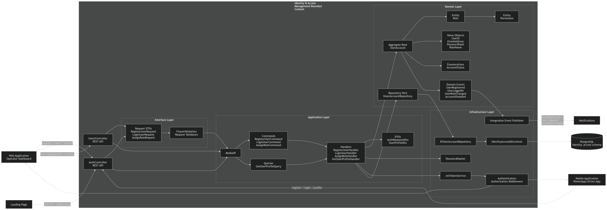


### 5.8.6. Class Diagram — Identity & Access Management

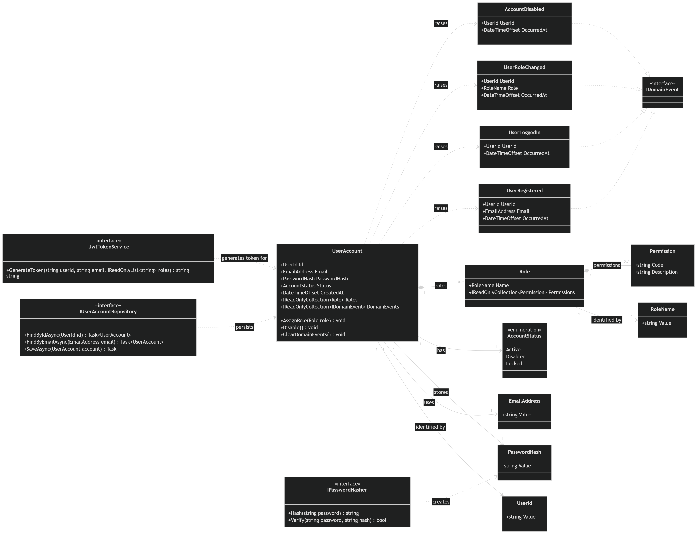

### 5.8.7. Database Diagram — Identity & Access Management

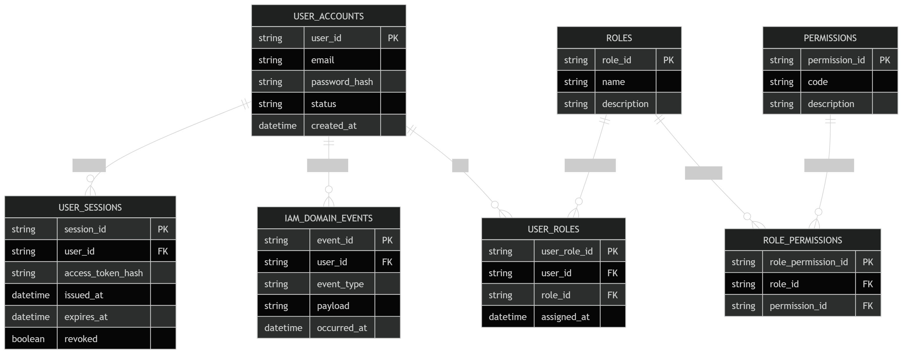


## 5.9. Bounded Context: Digital Twin Synchronization

El contexto Digital Twin Synchronization es responsable de mantener sincronizado el estado operativo de SmartPark con el gemelo digital del estacionamiento. Sus responsabilidades concretas son: (a) recibir solicitudes de actualización de estado; (b) construir operaciones de actualización compatibles con Azure Digital Twins; (c) aplicar cambios sobre el twin correspondiente; (d) registrar snapshots del estado sincronizado; y (e) exponer endpoints para consultar el estado y el historial de sincronización.

### 5.9.1. Domain Layer

La capa de dominio contiene la lógica relacionada con las sincronizaciones del gemelo digital. El agregado raíz es TwinSynchronization, encargado de controlar la solicitud, aplicación y resultado de una sincronización.

**EnAgregado raíz: `TwinSynchronization`**

```csharp
namespace ApexTwin.SmartPark.WebApi.Modules.DigitalTwinSynchronization.Domain.Model;

public sealed class TwinSynchronization
{
    private readonly List<TwinPatchOperation> _operations = new();
    private readonly List<IDomainEvent> _domainEvents = new();

    public SynchronizationId Id { get; }
    public TwinId TwinId { get; }
    public PatchStatus Status { get; private set; }
    public DateTimeOffset RequestedAt { get; }
    public DateTimeOffset? AppliedAt { get; private set; }
    public IReadOnlyCollection<TwinPatchOperation> Operations => _operations.AsReadOnly();
    public IReadOnlyCollection<IDomainEvent> DomainEvents => _domainEvents.AsReadOnly();

    private TwinSynchronization() { }

    public TwinSynchronization(SynchronizationId id, TwinId twinId, IEnumerable<TwinPatchOperation> operations)
    {
        Id = id;
        TwinId = twinId;
        _operations.AddRange(operations);
        Status = PatchStatus.Pending;
        RequestedAt = DateTimeOffset.UtcNow;
        _domainEvents.Add(new TwinPatchRequested(Id, TwinId, RequestedAt));
    }

    public void MarkAsApplied()
    {
        Status = PatchStatus.Applied;
        AppliedAt = DateTimeOffset.UtcNow;
        _domainEvents.Add(new TwinPatchApplied(Id, TwinId, AppliedAt.Value));
    }

    public void MarkAsFailed(string reason)
    {
        Status = PatchStatus.Failed;
        _domainEvents.Add(new TwinSynchronizationFailed(Id, TwinId, reason, DateTimeOffset.UtcNow));
    }

    public void ClearDomainEvents() => _domainEvents.Clear();
}
```

**Entidad: `TwinPatchOperation`**

```csharp
namespace ApexTwin.SmartPark.WebApi.Modules.DigitalTwinSynchronization.Domain.Model;

public sealed class TwinPatchOperation
{
    public string Path { get; }
    public string Operation { get; }
    public object Value { get; }

    private TwinPatchOperation() { }

    public TwinPatchOperation(string path, string operation, object value)
    {
        Path = path;
        Operation = operation;
        Value = value;
    }
}
```

**Entidad: `TwinStateSnapshot`**

```csharp
namespace ApexTwin.SmartPark.WebApi.Modules.DigitalTwinSynchronization.Domain.Model;

public sealed class TwinStateSnapshot
{
    public TwinId TwinId { get; }
    public string SerializedState { get; }
    public DateTimeOffset CapturedAt { get; }

    private TwinStateSnapshot() { }

    public TwinStateSnapshot(TwinId twinId, string serializedState)
    {
        TwinId = twinId;
        SerializedState = serializedState;
        CapturedAt = DateTimeOffset.UtcNow;
    }
}
```

**Value Objects y enumeraciones**

```csharp
namespace ApexTwin.SmartPark.WebApi.Modules.DigitalTwinSynchronization.Domain.Model;

public sealed record SynchronizationId(string Value);
public sealed record TwinId(string Value);
public sealed record TwinModelReference(string Value);

public enum PatchStatus { Pending, Applied, Failed }
```

**Eventos de dominio**

```csharp
namespace ApexTwin.SmartPark.WebApi.Modules.DigitalTwinSynchronization.Domain.Events;

using MediatR;
using ApexTwin.SmartPark.WebApi.Shared.Kernel;
using ApexTwin.SmartPark.WebApi.Modules.DigitalTwinSynchronization.Domain.Model;

public sealed record TwinPatchRequested(
    SynchronizationId SynchronizationId,
    TwinId TwinId,
    DateTimeOffset OccurredAt
) : IDomainEvent, INotification;

public sealed record TwinPatchApplied(
    SynchronizationId SynchronizationId,
    TwinId TwinId,
    DateTimeOffset OccurredAt
) : IDomainEvent, INotification;

public sealed record TwinSynchronizationFailed(
    SynchronizationId SynchronizationId,
    TwinId TwinId,
    string Reason,
    DateTimeOffset OccurredAt
) : IDomainEvent, INotification;

public sealed record TwinStateSnapshotCreated(
    TwinId TwinId,
    DateTimeOffset OccurredAt
) : IDomainEvent, INotification;
```
**Repositorio y puerto externo**

```csharp
namespace ApexTwin.SmartPark.WebApi.Modules.DigitalTwinSynchronization.Domain.Repositories;

using ApexTwin.SmartPark.WebApi.Modules.DigitalTwinSynchronization.Domain.Model;

public interface ITwinSynchronizationRepository
{
    Task<TwinSynchronization?> FindByIdAsync(SynchronizationId id, CancellationToken ct = default);
    Task<IReadOnlyList<TwinSynchronization>> FindByTwinIdAsync(TwinId twinId, CancellationToken ct = default);
    Task SaveAsync(TwinSynchronization synchronization, CancellationToken ct = default);
}

public interface IDigitalTwinClient
{
    Task ApplyPatchAsync(TwinId twinId, IReadOnlyCollection<TwinPatchOperation> operations, CancellationToken ct = default);
    Task<string> GetStateAsync(TwinId twinId, CancellationToken ct = default);
}
```

### 5.9.2. Application Layer

**Comandos y Queries**

```csharp
namespace ApexTwin.SmartPark.WebApi.Modules.DigitalTwinSynchronization.Application.Commands;

using MediatR;

public sealed record RequestTwinSynchronizationCommand(
    string TwinId,
    IReadOnlyList<TwinPatchOperationDto> Operations
) : IRequest<string>;

public sealed record CreateTwinStateSnapshotCommand(string TwinId) : IRequest;
```

```csharp
namespace ApexTwin.SmartPark.WebApi.Modules.DigitalTwinSynchronization.Application.Queries;

using MediatR;
using ApexTwin.SmartPark.WebApi.Modules.DigitalTwinSynchronization.Application.Dtos;

public sealed record GetTwinStateQuery(string TwinId) : IRequest<TwinStateDto>;

public sealed record GetSynchronizationHistoryQuery(string TwinId) : IRequest<IReadOnlyList<TwinSynchronizationDto>>;
```

**Command Handler**

```csharp
namespace ApexTwin.SmartPark.WebApi.Modules.DigitalTwinSynchronization.Application.Handlers;

using MediatR;
using ApexTwin.SmartPark.WebApi.Modules.DigitalTwinSynchronization.Application.Commands;
using ApexTwin.SmartPark.WebApi.Modules.DigitalTwinSynchronization.Domain.Model;
using ApexTwin.SmartPark.WebApi.Modules.DigitalTwinSynchronization.Domain.Repositories;

public sealed class RequestTwinSynchronizationHandler : IRequestHandler<RequestTwinSynchronizationCommand, string>
{
    private readonly ITwinSynchronizationRepository _repository;
    private readonly IDigitalTwinClient _client;
    private readonly IPublisher _publisher;

    public RequestTwinSynchronizationHandler(
        ITwinSynchronizationRepository repository,
        IDigitalTwinClient client,
        IPublisher publisher)
    {
        _repository = repository;
        _client = client;
        _publisher = publisher;
    }

    public async Task<string> Handle(RequestTwinSynchronizationCommand cmd, CancellationToken ct)
    {
        var operations = cmd.Operations
            .Select(o => new TwinPatchOperation(o.Path, o.Operation, o.Value))
            .ToList();

        var synchronization = new TwinSynchronization(
            new SynchronizationId(Guid.NewGuid().ToString()),
            new TwinId(cmd.TwinId),
            operations);

        try
        {
            await _client.ApplyPatchAsync(synchronization.TwinId, operations, ct);
            synchronization.MarkAsApplied();
        }
        catch (Exception ex)
        {
            synchronization.MarkAsFailed(ex.Message);
        }

        await _repository.SaveAsync(synchronization, ct);

        foreach (var domainEvent in synchronization.DomainEvents)
            await _publisher.Publish(domainEvent, ct);

        synchronization.ClearDomainEvents();
        return synchronization.Id.Value;
    }
}
```

**EnDTOs de aplicación**

```csharp
namespace ApexTwin.SmartPark.WebApi.Modules.DigitalTwinSynchronization.Application.Dtos;

public sealed record TwinPatchOperationDto(
    string Path,
    string Operation,
    object Value);

public sealed record TwinStateDto(
    string TwinId,
    string SerializedState,
    DateTimeOffset RetrievedAt);

public sealed record TwinSynchronizationDto(
    string SynchronizationId,
    string TwinId,
    string Status,
    DateTimeOffset RequestedAt,
    DateTimeOffset? AppliedAt);
```

### 5.9.3. Interface Layer


**Controlador**

```csharp
namespace ApexTwin.SmartPark.WebApi.Modules.DigitalTwinSynchronization.Interfaces.Rest;

using Microsoft.AspNetCore.Mvc;
using MediatR;
using ApexTwin.SmartPark.WebApi.Modules.DigitalTwinSynchronization.Application.Commands;
using ApexTwin.SmartPark.WebApi.Modules.DigitalTwinSynchronization.Application.Queries;

[ApiController]
[Route("api/v1/digital-twins")]
public sealed class DigitalTwinsController : ControllerBase
{
    private readonly IMediator _mediator;

    public DigitalTwinsController(IMediator mediator)
    {
        _mediator = mediator;
    }

    [HttpPost("{twinId}/sync")]
    public async Task<IActionResult> SynchronizeTwin(
        string twinId,
        [FromBody] SynchronizeTwinRequest request,
        CancellationToken ct)
    {
        var synchronizationId = await _mediator.Send(new RequestTwinSynchronizationCommand(
            twinId,
            request.Operations), ct);

        return Accepted(new { synchronizationId });
    }

    [HttpGet("{twinId}/state")]
    public async Task<IActionResult> GetTwinState(string twinId, CancellationToken ct)
    {
        var result = await _mediator.Send(new GetTwinStateQuery(twinId), ct);
        return Ok(result);
    }

    [HttpGet("{twinId}/synchronizations")]
    public async Task<IActionResult> GetSynchronizationHistory(string twinId, CancellationToken ct)
    {
        var result = await _mediator.Send(new GetSynchronizationHistoryQuery(twinId), ct);
        return Ok(result);
    }
}
```

**Request DTOs**

```csharp
namespace ApexTwin.SmartPark.WebApi.Modules.DigitalTwinSynchronization.Interfaces.Rest.Dtos;

using ApexTwin.SmartPark.WebApi.Modules.DigitalTwinSynchronization.Application.Dtos;

public sealed record SynchronizeTwinRequest(
    IReadOnlyList<TwinPatchOperationDto> Operations);
```

### 5.9.4. Infrastructure Layer

**DbContext del módulo**

```csharp
namespace ApexTwin.SmartPark.WebApi.Modules.DigitalTwinSynchronization.Infrastructure.Persistence;

using Microsoft.EntityFrameworkCore;
using ApexTwin.SmartPark.WebApi.Modules.DigitalTwinSynchronization.Domain.Model;

public sealed class DigitalTwinSynchronizationDbContext : DbContext
{
    public DbSet<TwinSynchronization> TwinSynchronizations => Set<TwinSynchronization>();
    public DbSet<TwinStateSnapshot> TwinStateSnapshots => Set<TwinStateSnapshot>();

    public DigitalTwinSynchronizationDbContext(DbContextOptions<DigitalTwinSynchronizationDbContext> options)
        : base(options) { }

    protected override void OnModelCreating(ModelBuilder modelBuilder)
    {
        modelBuilder.HasDefaultSchema("digital_twin_synchronization");
        modelBuilder.ApplyConfigurationsFromAssembly(typeof(DigitalTwinSynchronizationDbContext).Assembly);
    }
}
```

**Implementación del repositorio**

```csharp
namespace ApexTwin.SmartPark.WebApi.Modules.DigitalTwinSynchronization.Infrastructure.Persistence;

using Microsoft.EntityFrameworkCore;
using ApexTwin.SmartPark.WebApi.Modules.DigitalTwinSynchronization.Domain.Model;
using ApexTwin.SmartPark.WebApi.Modules.DigitalTwinSynchronization.Domain.Repositories;

public sealed class EfTwinSynchronizationRepository : ITwinSynchronizationRepository
{
    private readonly DigitalTwinSynchronizationDbContext _context;

    public EfTwinSynchronizationRepository(DigitalTwinSynchronizationDbContext context)
    {
        _context = context;
    }

    public Task<TwinSynchronization?> FindByIdAsync(SynchronizationId id, CancellationToken ct = default)
        => _context.TwinSynchronizations.FirstOrDefaultAsync(s => s.Id == id, ct);

    public async Task<IReadOnlyList<TwinSynchronization>> FindByTwinIdAsync(TwinId twinId, CancellationToken ct = default)
        => await _context.TwinSynchronizations.Where(s => s.TwinId == twinId).ToListAsync(ct);

    public async Task SaveAsync(TwinSynchronization synchronization, CancellationToken ct = default)
    {
        var existing = await _context.TwinSynchronizations.FindAsync(new object[] { synchronization.Id }, ct);
        if (existing is null) await _context.TwinSynchronizations.AddAsync(synchronization, ct);
        else _context.Entry(existing).CurrentValues.SetValues(synchronization);
        await _context.SaveChangesAsync(ct);
    }
}
```

**Cliente de Azure Digital Twins**

```csharp
namespace ApexTwin.SmartPark.WebApi.Modules.DigitalTwinSynchronization.Infrastructure.Adt;

using ApexTwin.SmartPark.WebApi.Modules.DigitalTwinSynchronization.Domain.Model;
using ApexTwin.SmartPark.WebApi.Modules.DigitalTwinSynchronization.Domain.Repositories;

public sealed class AzureDigitalTwinClient : IDigitalTwinClient
{
    public Task ApplyPatchAsync(TwinId twinId, IReadOnlyCollection<TwinPatchOperation> operations, CancellationToken ct = default)
    {
        return Task.CompletedTask;
    }

    public Task<string> GetStateAsync(TwinId twinId, CancellationToken ct = default)
    {
        return Task.FromResult("{}");
    }
}
```

### 5.9.5. Component Diagram — Digital Twin Synchronization

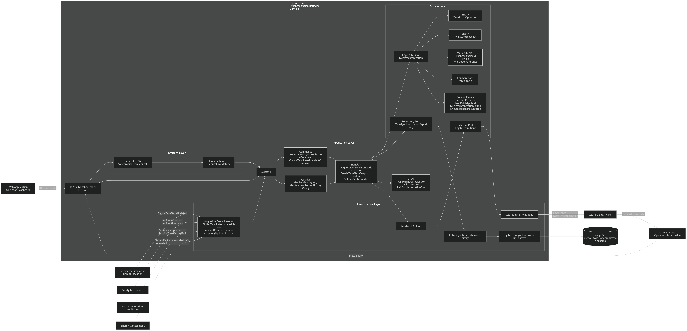


### 5.9.6. Class Diagram — Digital Twin Synchronization

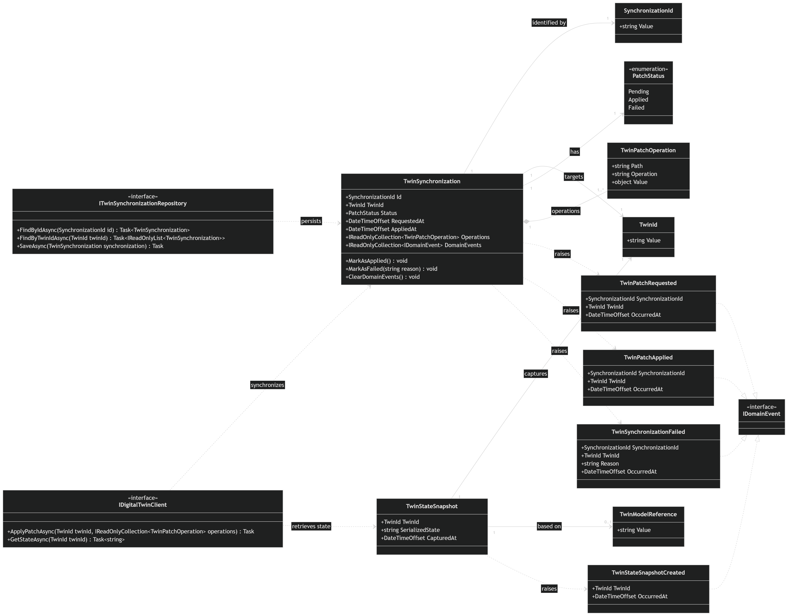

### 5.9.7. Database Diagram — Digital Twin Synchronization

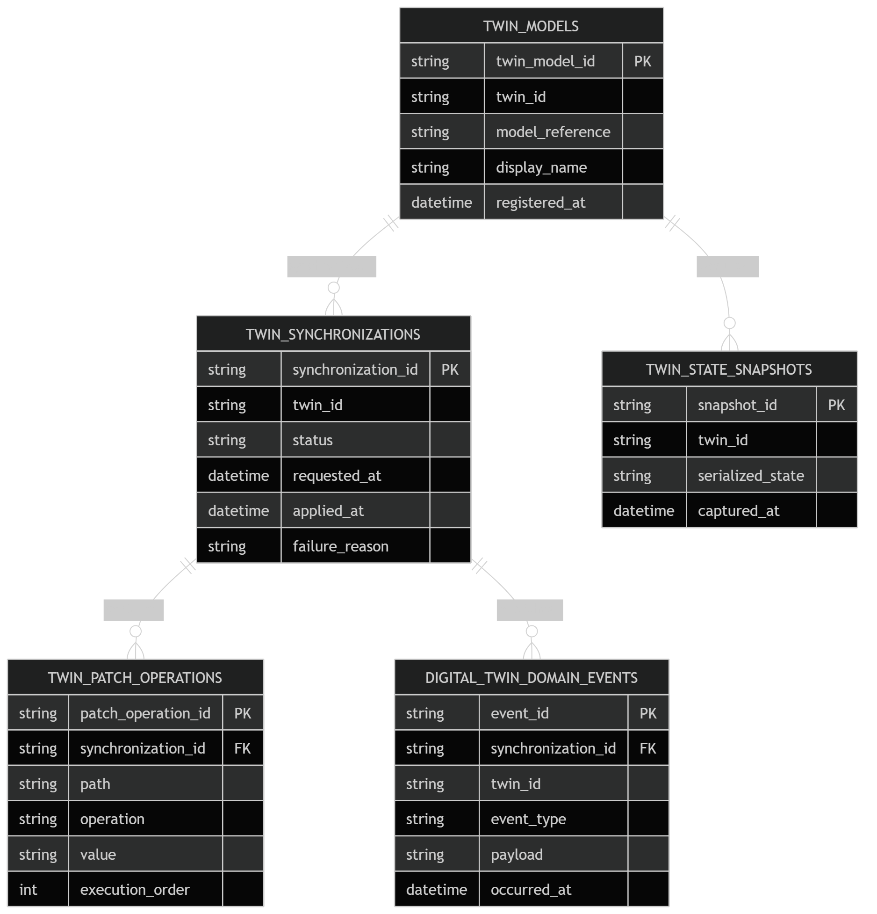


# Capítulo VI: Solution UX Design

## 6.1. Style Guidelines

### 6.1.1. General Style Guidelines

A continuación, se definen las decisiones de diseño visual y comunicacional que guiarán la construcción de la interfaz de usuario de SmartPark, tanto para la plataforma web (operadores) como para la aplicación móvil (conductores). 

**Branding:**
- Nombre del producto: SmartPark
- Logotipo: 


- Tagline: Digital Twin Solutions
- Propuesta visual: Modernidad, tecnología, confianza y precisión. Transmite control inteligente a través de gemelos digitales.

**Typography:**

La elección tipográfica para SmartPark es un componente esencial que complementa la identidad visual de la marca. Se han seleccionado dos familias tipográficas que juntas ofrecen versatilidad y coherencia, asegurando que la comunicación sea clara y efectiva en todos los medios.
- Fuente primaria: 
  - Inter (sans-serif) - Limpia, moderna, altamente legible en pantallas de escritorio y móviles.
- Fuente secundaria: 
  - Inter (misma familia) para consistencia, variando pesos (Regular 400, Medium 500, Bold 700).
- Escala tipográfica: Tamaños basados en progresión 1.25 (major third)
  - Títulos principales (H1): 32px / 40px (web) - 24px / 32px (móvil)
  - Subtítulos (H2): 24px / 32px (web) - 20px / 28px (móvil)
  - Encabezados de sección (H3): 20px / 28px (web) - 18px / 24px (móvil)
  - Texto base (Body): 16px / 24px
  - Texto pequeño (Caption): 14px / 20px
  - Texto auxiliar (Helper): 12px / 16px

**Colors:**

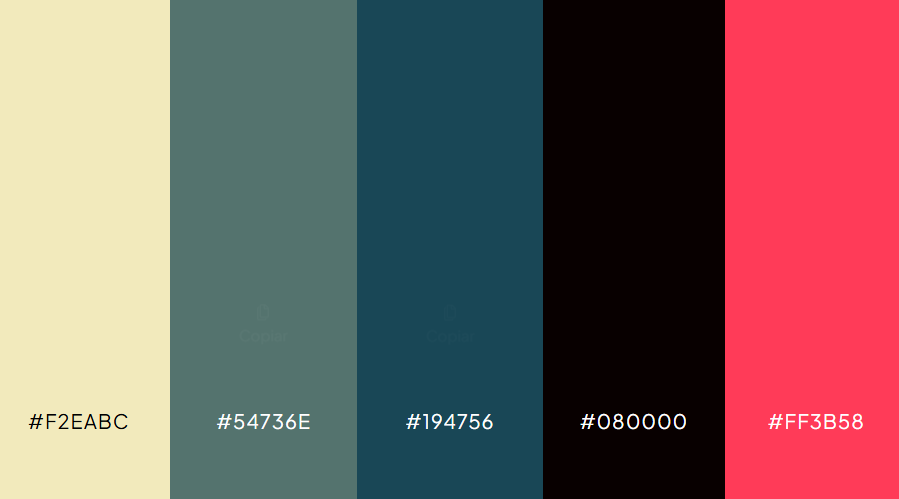

| Token | Color | Uso Principal |
|---|---|---|
| Primary | #194756 | Botones principales, encabezados, enlaces, elementos de navegación activos. |
| Secondary | #54736E | Fondos secundarios, bordes, elementos de soporte, íconos no principales.|
| Background Light | #F2EABC | Fondos de secciones alternas, tarjetas destacadas, modales informativos.|
| Dark / Text | #080000 | Texto principal sobre fondos claros, elementos de alto contraste. |
| Alert/Danger | #FF3B58 | Alertas de humo, errores críticos, estados de emergencia, notificaciones de alta prioridad. |
| Success | #2E7D32 | Estados de éxito, confirmaciones, plazas disponibles, operación normal. |
| Warning | #FFC107 | Advertencias, congestión moderada, atención preventiva. |
| Neutral Gray | #6C757D | Texto secundario, placeholders, deshabilitados, separadores. |
| White | #FFFFFF | Fondos principales, tarjetas, contenedores de contenido. |

**Spacing:** Sistema basado en múltiplos de 8px (8, 16, 24, 32, 48, 64).

| Token | Valor | Uso |
|---|---|---|
| spacing-1 | 4px | Espaciado mínimo entre elementos muy cercanos |
| spacing-2 | 8px| Espaciado interno de componentes pequeños (padding) |
| spacing-3 | 16px | Espaciado estándar entre elementos relacionados |
| spacing-4 | 24px | Margen entre secciones, padding de tarjetas |
| spacing-5 | 32px | Separación entre bloques funcionales |
| spacing-6 | 48px | Separación entre secciones principales |
| spacing-7 | 64px| Separación entre pantallas o grandes bloques |

**Grillas:** Sistema de 12 columnas para web (con gutters de 24px) y 4 columnas para móvil.

**Tono de comunicación:** 

| Aspecto | Decisión | 
|---|---|
| Estilo general| Profesional, claro, orientado a acción. |
| Formalidad | Formal pero accesible. No excesivamente técnico. |
| Para operadores | Tono directo, preciso, orientado a datos y eficiencia. Uso de términos como "monitoreo", "alerta", "reporte", "optimización". |
| Para conductores| Tono amigable, cercano, útil. Uso de términos como "encontrar mi auto", "cuánto voy pagando", "estoy seguro".|
| Comunicación de errores/alertas | Clara, urgente pero no alarmista. Acción recomendada siempre presente. | 
| Mensajes de éxito | Positivos, breves, reforzantes. | 

**Ejemplos de tono:**
|Contexto | Ejemplo de mensaje | 
|---|---|
| Alerta de humo (operador) | "Alerta de humo detectada en Zona B, Nivel B2. Haga clic para ver ubicación exacta." | 
|Alerta de humo (conductor) | "Alerta de seguridad: humo detectado en su zona de estacionamiento. Diríjase a la salida más cercana." |
|Registro exitoso de ubicación | "¡Ubicación guardada! Nivel B2, Zona A. ¿Necesitas encontrarlo? Usa 'Encontrar mi vehículo'." |
|Consulta de disponibilidad | "Hay 24 plazas disponibles en Nivel B1. ¿Te diriges allí?" |
|Error de conexión | "No pudimos cargar los datos. Verifica tu conexión e intenta de nuevo." |

### 6.1.2. Web, Mobile & Devices Style Guidelines

A continuación, se definen los estilos particulares para cada plataforma, considerando los diferentes contextos de uso, dispositivos y necesidades de cada segmento objetivo.

### **Web Platform (Operadores)**
**Contexto de uso:** Centro de control del estacionamiento, PC de escritorio con monitor grande, jornadas laborales de 8-12 horas.

|Elemento | Especificación | 
|---|---|
|Resolución objetivo | 1920 x 1080 (Full HD). Mínimo soportado: 1366 x 768. | 
|Layout principal | Dashboard con barra lateral fija (sidebar) + área de contenido principal. | 
|Header | Altura 64px. Fondo blanco. Sombra sutil. Contiene: selector de nivel, fecha/hora, perfil de usuario.  | 
| Visor 3D (Gemelo Digital) | Ocupa al menos 60% del área principal. Resolución mínima 800x600. Controles de zoom, rotación y desplazamiento.  | 
| Paneles de datos | Tarjetas blancas con sombra ligera (box-shadow: 0 2px 8px rgba(0,0,0,0.08)). Bordes redondeados 8px.  | 
| Tipografía web | Inter, tamaños: Títulos (20px/28px), Body (14px/20px), Auxiliar (12px/16px). | 
| Espaciado web |  | 
|Estado de alerta (humo) | Fondo pulsante rojo (#FF3B58 con opacidad 0.2) + borde rojo + icono de alerta. | 
| Tablas de datos| Bordes horizontales. Filas alternadas con fondo #F9FAFB. Hover con fondo #F2EABC. | 
|Botones de peligro | Fondo #FF3B58, texto blanco. Para resolución de alertas.  | 
| Indicadores de flujo | Círculo de color: Verde (#2E7D32) = Normal, Amarillo (#FFC107) = Moderado, Rojo (#FF3B58) = Congestionado.  | 

### **Mobile Platform (Conductores)**
**Contexto de uso:** En el vehículo o caminando, sesiones cortas (30 seg - 2 min), condiciones de baja luminación (estacionamientos subterráneos).

|Elemento | Especificación | 
|---|---|
|SO objetivo |	iOS 15+ y Android 11+ | 
|Tamaños de pantalla |	375 x 667 (iPhone SE) a 428 x 926 (iPhone 14 Pro Max). Soporte a tablets con adaptación responsiva. | 
|Layout principal	| Tab bar inferior (4-5 íconos) + área de contenido. Sin sidebar. | 
|Tab bar	|  Fondo blanco, íconos Primary #194756 (activo) o Neutral Gray #6C757D (inactivo). Altura 56px. | 
|Modo oscuro | 	No requerido en fase inicial, pero se recomienda adaptación a modo oscuro del sistema para uso nocturno. | 
|Tipografía móvil	| Inter, tamaños: Títulos (22px/28px), Body (16px/24px), Auxiliar (13px/18px). Mínimo 16px para texto legible. | 
|Mapa de disponibilidad	| Vista simplificada. Niveles como cards expandibles. Porcentaje de disponibilidad en círculo de color. | 
|Registro de ubicación |	Botón flotante grande (FAB) de 56x56px, fondo Primary #194756, ícono blanco de ubicación. Fácil de alcanzar con el pulgar. | 
|Costo acumulado	|  Tarjeta fija o sticky en parte inferior (o superior) mostrando costo actualizado automáticamente. | 
|Push notifications | 	Alerta de humo: título "Alerta de Seguridad", cuerpo con zona y acción recomendada. Al tocar, abre la app en pantalla de alerta. | 
|Alerta de humo en app	|  Banner rojo fijo en parte superior. Fondo #FF3B58, texto blanco. Botón "Ver más" o "Evacuar". | 
|Encontrar mi vehículo | 	Pantalla con mapa simple de la zona guardada. Indicación de nivel, zona y código de plaza. Botón "Iniciar ruta" (abre Google Maps / Waze con coordenadas aproximadas). | 

## 6.2. Information Architecture

La arquitectura de la información, también conocida como Information Architecture (IA), implica la organización de la información de manera clara y lógica, de modo que los usuarios puedan comprender su ubicación, lo que han descubierto, qué pueden esperar y qué está disponible a su alrededor. Esto tiene como objetivo permitir a los usuarios encontrar con facilidad lo que están buscando, y a los clientes, comprender las capacidades de la plataforma. Además, la arquitectura de la información posibilita la incorporación de nuevas funciones y la expansión del producto sin generar una estructura compleja o de difícil comprensión (Rosenfeld, Morville & Arango 2015).

### 6.2.1. Organization Systems

La arquitectura de organización de SmartPark está diseñada siguiendo principios de agrupación lógica y progresiva de la información, permitiendo a los usuarios acceder rápidamente a las funciones necesarias según su rol (operador o conductor) y contexto de uso.

**Esquemas de organización aplicados**

| Esquema | Aplicación en SmartPark |
|---|---|
| Jerárquica | Navegación principal del dashboard web del operador: Niveles > Zonas > Plazas individuales. |
| Secuencial | Flujo del conductor en la app móvil: Ingreso > Buscar plaza > Estacionar > Registrar ubicación > Finalizar sesión. |
| Matricial | Panel de gestión de incidentes: cruce entre tipo de incidente (humo, congestión) y ubicación (nivel, zona, rampa). |
| Por tópicos | Módulos del dashboard: Ocupación, Seguridad, Flujo vehicular y Eficiencia energética. |
| Cronológico | Historial de incidentes del operador y sesiones del conductor ordenados por fecha descendente. |
| Por audiencia | Diferenciación entre contenido para operadores (dashboard web) y conductores (app móvil). |

**Estructura organizacional principal**

**Plataforma Web (Operadores)**

| Módulo | Descripción | Funciones Principales | Acceso por Rol |
|---|---|---|---|
| Dashboard Ocupación | Vista consolidada del estado del estacionamiento en tiempo real | Resumen ejecutivo de ocupación; mapa de calor por nivel y zona; estado por plaza individual; métricas en tiempo real | Jefe de Operaciones, Supervisor |
| Gemelo Digital 3D | Visualización interactiva del estacionamiento en modelo 3D | Visor 3D con zoom, rotación y desplazamiento; capas de datos (ocupación, seguridad, flujo, energía); geolocalización de alertas de humo | Jefe de Operaciones, Supervisor |
| Seguridad e Incidentes | Gestión de alertas de humo y otros incidentes | Panel de alertas activas; localización espacial en mapa 3D; rutas de evacuación comprometidas; historial de incidentes con filtros por fecha, zona y estado | Jefe de Operaciones, Supervisor de Seguridad |
| Flujo Vehicular | Monitoreo de tráfico interno en accesos y rampas | Indicadores de flujo por punto de acceso y rampa; alertas de congestión; historial de congestión por horario | Jefe de Operaciones |
| Eficiencia Energética | Gestión de iluminación por zona | Ocupación vs luminosidad por zona; recomendaciones de atenuación; ahorro energético estimado y logrado | Jefe de Operaciones, Facility Manager |
| Reportes | Generación y exportación de datos históricos | Reportes de incidentes, ocupación y flujo; exportación a PDF/Excel; análisis de patrones de congestión | Jefe de Operaciones, Gerencia |

**Aplicación Móvil (Conductores)**

| Módulo | Descripción | Funciones Principales | Acceso por Rol |
|---|---|---|---|
| Disponibilidad | Consulta de plazas libres antes de ingresar | Mapa simplificado de disponibilidad por nivel y zona; porcentaje de disponibilidad por nivel; zona con mayor disponibilidad resaltada | Conductor (usuario autenticado) |
| Mi Sesión | Gestión de la sesión de estacionamiento activa | Registro de ubicación del vehículo (nivel + zona + QR); visualización de ubicación guardada; costo acumulado en tiempo real; botón Finalizar sesión | Conductor (usuario autenticado) |
| Alertas | Notificaciones de seguridad y eventos | Alerta de humo en zona del vehículo; recomendaciones de evacuación; historial de alertas recibidas | Conductor (usuario autenticado) |
| Historial | Registro de sesiones pasadas | Lista de sesiones anteriores; detalle de cada sesión; comprobante de pago | Conductor (usuario autenticado) |
| Perfil | Configuración de cuenta y preferencias | Datos personales; preferencias de notificación; método de pago predeterminado; cerrar sesión | Conductor (usuario autenticado) |

**Principios de organización aplicados**

| Principio | Aplicación en SmartPark |
|---|---|
| Agrupación por funcionalidad | Las características se organizan según su propósito común: ocupación, seguridad, flujo y energía. Cada módulo agrupa funciones relacionadas, reduciendo la carga cognitiva. |
| Jerarquía visual progresiva | La información se presenta desde lo general hacia lo específico: resumen general > nivel > zona > plaza individual, con drill-down controlado. |
| Contextualización dinámica | Las opciones disponibles se adaptan según el rol del usuario y el módulo activo. Un conductor no ve opciones de gestión operativa y un operador no ve opciones de pago. |
| Consistencia transversal | Los mismos patrones organizativos se aplican en todos los módulos. Por ejemplo, los indicadores de estado usan el mismo código de colores (verde/amarillo/rojo) en ocupación, flujo y energía. |
| Priorización de tareas críticas | Las funciones más importantes, como alertas de humo y congestión severa, se presentan de forma prominente y accesible desde cualquier módulo. |

**Organización de contenido por módulo**

**Módulo de Ocupación (Operador - Web)**

| Nivel de agrupación | Criterio |
|---|---|
| Agrupación primaria | Por nivel de estacionamiento (Nivel B1, B2, B3, etc.) |
| Agrupación secundaria | Por zona dentro del nivel (Zona A, B, C, D) |
| Agrupación terciaria | Por plaza individual (código de plaza + estado) |
| Agrupación por estado | Plazas disponibles, ocupadas, reservadas, fuera de servicio |

**Módulo de Seguridad e Incidentes (Operador - Web)**

| Nivel de agrupación | Criterio |
|---|---|
| Agrupación primaria | Por estado de alerta (Activa, Confirmada, Resuelta) |
| Agrupación secundaria | Por tipo de incidente (Humo, Congestión, Otro) |
| Agrupación terciaria | Por ubicación (Nivel > Zona > Detector específico) |
| Agrupación temporal | Por fecha y hora de detección (cronológico descendente) |

**Módulo de Disponibilidad (Conductor - Móvil)**

| Nivel de agrupación | Criterio |
|---|---|
| Agrupación primaria | Por nivel de estacionamiento (ordenado por disponibilidad descendente) |
| Agrupación secundaria | Por zona dentro del nivel |
| Destacado visual | Zona con mayor disponibilidad resaltada en verde |
| Indicador | Porcentaje de disponibilidad en círculo de color |

**Módulo de Historial de Sesiones (Conductor - Móvil)**

| Nivel de agrupación | Criterio |
|---|---|
| Agrupación primaria | Cronológico descendente (más reciente primero) |
| Agrupación secundaria | Por centro comercial (si aplica múltiples sedes) |
| Filtros sugeridos | Por rango de fechas (semana, mes, personalizado) |

### 6.2.2. Labeling Systems

El sistema de etiquetado en SmartPark sigue principios de claridad, consistencia y contexto, asegurando que los usuarios comprendan inmediatamente la función de cada elemento. Se adapta ligeramente entre la plataforma web (operadores) y la aplicación móvil (conductores), manteniendo una base común.

**Principios de Etiquetado**

| Principio | Aplicación en SmartPark |
|---|---|
| Lenguaje Natural | Usamos términos del dominio del usuario: "plazas", "niveles", "zonas", "alertas de humo", "flujo vehicular" y "sesión de estacionamiento". |
| Consistencia | El mismo término significa lo mismo en toda la aplicación. "Disponible" se interpreta igual en web y móvil, y "Ocupado" siempre se representa en rojo. |
| Jerarquía Visual | El tamaño y peso tipográfico reflejan importancia. Las etiquetas críticas, como "ALERTA DE HUMO", se muestran en mayúsculas y color rojo. |
| Contexto | Las etiquetas cambian según el módulo y las acciones disponibles. Un operador ve "Gestionar incidentes"; un conductor ve "Mi sesión". |
| Brevedad | Se usa el mínimo número de palabras sin perder claridad. Por ejemplo, "Plazas libres" en lugar de "Número de espacios de estacionamiento disponibles actualmente". |

### **Sistema de Iconografía**

**Acciones Principales (Web y Móvil)**

| Acción | Etiqueta | Icono sugerido |
|---|---|---|
| Agregar/Registrar | "Registrar" / "Guardar ubicación" | ➕ o 📍 |
| Editar/Modificar | "Editar" / "Modificar" | ✏️ |
| Eliminar/Descartar | "Eliminar" / "Cancelar" | 🗑️ o ✖️ |
| Buscar/Filtrar | "Buscar" / "Filtrar" | 🔍 o ⚙️ |
| Confirmar | "Confirmar" / "Aceptar" | ✓ |
| Cancelar | "Cancelar" | ✖️ |
| Cerrar | "Cerrar" | ✖️ |
| Exportar | "Exportar" / "Descargar" | 📎 o ⬇️ |
| Refrescar | "Actualizar" | 🔄 |
| Ver más | "Ver más" / "Ver detalles" | 👁️ o → |

### **Etiquetas por Módulo y Plataforma**

**Plataforma Web (Operadores)**

| Módulo | Etiquetas principales |
|---|---|
| Navegación principal | Dashboard / Ocupación / Gemelo 3D / Seguridad / Flujo / Energía / Reportes / Configuración |
| Dashboard Ocupación | Total de plazas / Ocupadas / Disponibles / Porcentaje de ocupación / Última actualización / Ver por nivel / Ver por zona |
| Gemelo Digital 3D | Vista 3D / Capas / Ocupación / Seguridad / Flujo / Energía / Zoom / Rotar / Centrar / Reset / Leyenda |
| Seguridad e Incidentes | Alertas activas / Historial de incidentes / Humo / Congestión / Confirmar / Resolver / Ver ruta de evacuación / Zona afectada / Nivel / Fecha / Hora / Estado / Acciones |
| Flujo Vehicular | Puntos de acceso / Rampas / Flujo actual (veh/min) / Estado / Normal / Congestión moderada / Congestión severa / Última hora / Pico máximo |
| Eficiencia Energética | Zona de iluminación / Ocupación / Luminosidad actual / Atenuación recomendada / Ahorro estimado / Ahorro logrado / Aplicar / Programar |
| Reportes | Generar reporte / Rango de fechas / Tipo de reporte / Incidentes / Ocupación / Flujo / Energía / Exportar a PDF / Exportar a Excel |

**Aplicación Móvil (Conductores)**

| Módulo | Etiquetas principales |
|---|---|
| Tab Bar (navegación) | Disponibilidad / Mi Sesión / Alertas / Historial / Perfil |
| Disponibilidad | Plazas libres / Nivel / Zona / Disponibilidad / % disponible / Ver mapa / Ver lista / Mejor opción |
| Mi Sesión | Sesión activa / Hora de entrada / Duración / Costo acumulado / Tarifa aplicable / Registrar ubicación / Nivel / Zona / Código de plaza / Escanear QR / Guardar / Encontrar mi vehículo / Finalizar sesión |
| Alertas | Alertas de seguridad / Alerta de humo / Zona afectada / Nivel / Estado / Activa / Resuelta / Ver más / Acciones recomendadas / Evacuar / Estar atento |
| Historial | Sesiones pasadas / Fecha / Ubicación / Duración / Costo total / Ver detalle / Comprobante / Repetir visita |
| Perfil | Mi cuenta / Nombre completo / Correo electrónico / Teléfono / Método de pago / Notificaciones / Activar / Desactivar / Cerrar sesión / Editar perfil |

**Estados del Sistema**

| Estado | Etiqueta | Color asociado | Uso |
|---|---|---|---|
| Completado/Éxito | "Completado" / "Éxito" / "Guardado" | Verde (#2E7D32) | Registro exitoso, pago completado, sesión finalizada |
| Advertencia/Alerta | "Advertencia" / "Atención" / "Precaución" | Amarillo (#FFC107) | Ocupación alta, congestión moderada, batería baja |
| Error/Problema | "Error" / "Fallo" / "No disponible" | Rojo (#FF3B58) | Sensor fuera de línea, conexión fallida, credenciales inválidas |
| Procesando/En curso | "Cargando" / "Procesando" / "Actualizando" | Azul (#194756) | Actualización de datos, envío de formulario, escaneo de QR |
| Información | "Info" / "Nota" / "Ayuda" | Gris (#6C757D) | Mensajes informativos, tooltips, guías contextuales |
| Inactivo/Deshabilitado | "Inactivo" / "Deshabilitado" / "Sin datos" | Gris claro (#D3D3D3) | Funcionalidad no disponible, sensor sin datos |

**Estados de Plazas y Sensores**

| Entidad | Estado | Etiqueta | Color |
|---|---|---|---|
| Plaza | Libre | "Disponible" / "Libre" | Verde |
| Plaza | Ocupada | "Ocupada" / "En uso" | Rojo o Azul oscuro |
| Plaza | Reservada | "Reservada" | Amarillo |
| Plaza | Fuera de servicio | "Fuera de servicio" / "Mantenimiento" | Gris |
| Detector de humo | Normal | "Normal" / "Sin actividad" | Verde |
| Detector de humo | Alerta activa | "ALERTA DE HUMO" / "ACTIVO" | Rojo pulsante |
| Sensor de flujo | Online | "Activo" / "En línea" | Verde |
| Sensor de flujo | Offline | "Fuera de línea" / "Sin conexión" | Gris |
| Luminaria | Encendida | "Encendida" / "100%" | Blanco/Azul |
| Luminaria | Atenuada | "Atenuada" / "X%" | Azul claro |

### 6.2.3. SEO Tags and Meta Tags

SEO (Search Engine Optimization) Tags son elementos de HTML que ayudan a los motores de búsqueda a entender el contenido y la estructura de una página web. Estos tags influyen en cómo los motores de búsqueda indexan y clasifican tu sitio en los resultados de búsqueda.

A continuación, se definen los tags SEO para las páginas de aterrizaje (Landing Pages) de SmartPark y los elementos ASO (App Store Optimization) para la aplicación móvil desarrollada en Microsoft PowerApps.

### **SEO Tags para Landing Pages**

| Página | Title | Description | Keywords | Author |
|---|---|---|---|---|
| Landing Home | SmartPark - Gestión Inteligente de Estacionamientos con Gemelo Digital | Plataforma SaaS con gemelo digital 3D para centros comerciales. Optimiza ocupación, seguridad, flujo vehicular y eficiencia energética en tiempo real. | gemelo digital estacionamiento, smart parking, gestión estacionamientos, Azure Digital Twins, IoT estacionamiento, centros comerciales Lima | Apex Twin |
| Landing For Operators | SmartPark para Operadores - Dashboard y Gemelo Digital 3D | Controla tu estacionamiento desde un gemelo digital 3D. Monitoreo en tiempo real, alertas de humo geolocalizadas, flujo vehicular y ahorro energético. | operadores estacionamiento, dashboard gestión, alertas humo geolocalizadas, flujo vehicular, eficiencia energética estacionamiento | Apex Twin |
| Landing For Drivers | SmartPark para Conductores - Encuentra tu plaza fácil y seguro | App móvil para conductores: consulta disponibilidad, registra tu ubicación, monitorea costo acumulado y recibe alertas de seguridad. Descarga gratis. | app estacionamiento, encontrar plaza libre, registrar ubicación vehículo, alertas seguridad estacionamiento, costo acumulado | Apex Twin |
| Web App Dashboard | SmartPark Dashboard - Panel de Control para Operadores | Panel de control en tiempo real para gestión de estacionamientos. Visualización 3D, gestión de incidentes, reportes y analytics. | dashboard estacionamiento, gemelo digital, gestión incidentes, reportes ocupación, analytics estacionamiento | Apex Twin |

### **Header Tags Estructurados**
**Landing Home**

```html
<h1>SmartPark - Gestión Inteligente de Estacionamientos con Gemelo Digital 3D</h1>
<h2>La plataforma SaaS que transforma la gestión operativa de estacionamientos en centros comerciales</h2>
<h3>Monitoreo en tiempo real de ocupación, seguridad, flujo vehicular y eficiencia energética</h3>
```

**Landing For Operators**
```html
<h1>SmartPark para Operadores - Control Total desde un Gemelo Digital 3D</h1>
<h2>Visualiza, analiza y actúa sobre el estado integral de tu estacionamiento en tiempo real</h2>
<h3>Alertas de humo con localización espacial | Flujo vehicular | Eficiencia energética</h3>
```
**Landing For Drivers**
```html
<h1>SmartPark para Conductores - Encuentra tu plaza fácil y seguro</h1>
<h2>La app móvil que te acompaña desde que ingresas hasta que retiras tu vehículo</h2>
<h3>Disponibilidad en tiempo real | Registro de ubicación | Costo acumulado | Alertas de seguridad</h3>
```

### **Meta Tags Optimizadas**
**Landing Home**

```html
<meta name="description" content="SmartPark - Plataforma SaaS con gemelo digital 3D para centros comerciales. Optimiza ocupación, seguridad, flujo vehicular y eficiencia energética en tiempo real. Ideal para operadores y conductores." />
<meta name="keywords" content="gemelo digital estacionamiento, smart parking, gestión estacionamientos, Azure Digital Twins, IoT estacionamiento, centros comerciales Lima, Apex Twin" />
<meta name="author" content="Apex Twin" />
<meta name="robots" content="index, follow" />
```
**Landing For Operators**
```html
<meta name="description" content="Controla tu estacionamiento desde un gemelo digital 3D. Monitoreo en tiempo real, alertas de humo geolocalizadas, flujo vehicular y ahorro energético. Solicita una demo." />
<meta name="keywords" content="operadores estacionamiento, dashboard gestión, alertas humo geolocalizadas, flujo vehicular, eficiencia energética estacionamiento, centro comercial" />
<meta name="author" content="Apex Twin" />
<meta name="robots" content="index, follow" />
```
**Landing For Drivers**
```html
<meta name="description" content="Encuentra estacionamiento fácil y seguro. Consulta disponibilidad en tiempo real, registra la ubicación de tu vehículo, monitorea el costo acumulado y recibe alertas de seguridad. Descarga gratis." />
<meta name="keywords" content="app estacionamiento, encontrar plaza libre, registrar ubicación vehículo, alertas seguridad estacionamiento, costo acumulado, conductores" />
<meta name="author" content="Apex Twin" />
<meta name="robots" content="index, follow" />
```
**Web App Dashboard**
```html
<meta name="description" content="Panel de control en tiempo real para gestión de estacionamientos. Visualización 3D, gestión de incidentes, reportes y analytics. Acceso exclusivo para operadores." />
<meta name="keywords" content="dashboard estacionamiento, gemelo digital, gestión incidentes, reportes ocupación, analytics estacionamiento" />
<meta name="author" content="Apex Twin" />
<meta name="robots" content="noindex, nofollow" />
```

**Open Graph Tags para Redes Sociales (Landing Home)**
```html
<meta property="og:title" content="SmartPark - Gestión Inteligente de Estacionamientos con Gemelo Digital 3D" />
<meta property="og:description" content="Plataforma SaaS que transforma la gestión de estacionamientos en centros comerciales. Ocupación, seguridad, flujo y energía en tiempo real." />
<meta property="og:image" content="https://www.smartpark.com/assets/social-preview.png" />
<meta property="og:url" content="https://www.smartpark.com" />
<meta property="og:type" content="website" />
<meta property="og:site_name" content="SmartPark by Apex Twin" />

<meta name="twitter:card" content="summary_large_image" />
<meta name="twitter:title" content="SmartPark - Gestión Inteligente de Estacionamientos" />
<meta name="twitter:description" content="Gemelo digital 3D para centros comerciales. Optimiza ocupación, seguridad, flujo y energía." />
<meta name="twitter:image" content="https://www.smartpark.com/assets/twitter-preview.png" />
```

### 6.2.4. Searching Systems

El sistema de búsqueda de SmartPark está diseñado para ser intuitivo y eficiente, permitiendo a los usuarios encontrar rápidamente la información que necesitan según su rol y contexto de uso. Se diferencia entre la plataforma web (operadores) y la aplicación móvil (conductores), adaptando las opciones de búsqueda y filtros a las necesidades específicas de cada segmento.

### **Sistema de Búsqueda para Operadores (Web)**

**Características generales:**

| Característica | Descripción |
|---|---|
| Búsqueda global | Barra de búsqueda en el header, accesible desde cualquier módulo. |
| Búsqueda inteligente | Búsqueda por texto libre en múltiples campos. |
| Búsqueda predictiva | Sugerencias en tiempo real mientras el usuario escribe. |
| Resultados agrupados | Los resultados se agrupan por categoría (plazas, incidentes, zonas). |
| Acceso rápido | Atajo de teclado Ctrl + K para abrir la búsqueda. |

**Campos de búsqueda por módulo:**

| Módulo | Campos de búsqueda |
|---|---|
| Ocupación | Nivel, Zona, Código de plaza, Estado (libre/ocupada/reservada) |
| Seguridad | Tipo (humo/congestión), Estado (activa/confirmada/resuelta), Zona, Fecha |
| Flujo | Punto de acceso, Rampa, Estado (normal/moderado/severo) |
| Energía | Zona de iluminación, Estado (atenuación recomendada/óptimo) |
| Reportes | Rango de fechas, Tipo de reporte, Zona |

**Filtros disponibles:**

| Módulo | Filtros |
|---|---|
| Ocupación | Por nivel, zona, estado de plaza, rango de ocupación (<30% / 30-60% / 60-85% / >85%) |
| Seguridad | Por tipo, estado, nivel, zona, rango de fechas (Hoy / 7 días / 30 días / Personalizado) |
| Flujo | Por tipo (accesos/rampas), estado, nivel |
| Energía | Por nivel, zona, estado de atenuación |

### **Sistema de Búsqueda para Conductores (Móvil)**
**Características generales:**

| Característica | Descripción |
|---|---|
| Búsqueda simplificada | Enfocada en encontrar centro comercial o nivel rápidamente. |
| Ubicación GPS | Detección automática del centro comercial más cercano. |
| Resultados táctiles | Tarjetas grandes y fáciles de tocar. |

**Campos de búsqueda por módulo:**

| Módulo | Campos de búsqueda |
|---|---|
| Disponibilidad | Centro comercial, Nivel (búsqueda por texto o GPS) |
| Historial | Centro comercial, Rango de fechas (semana / mes / personalizado) |
| Alertas | Estado (activa/resuelta), Fecha |

**Filtros disponibles:**

| Módulo | Filtros |
|---|---|
| Disponibilidad | Por nivel (ordenado por disponibilidad), "Mostrar solo niveles con plazas libres" (toggle) |
| Historial | Por rango de fechas, por centro comercial |
| Alertas | Por estado (activas/resueltas), por fecha |

### 6.2.5. Navigation Systems

El sistema de navegación de SmartPark está optimizado para cada plataforma y usuario, priorizando la accesibilidad, la eficiencia en las tareas diarias y la claridad en la ubicación del usuario.

### **Patrones de Navegación - Plataforma Web (Operadores)**
**Navegación Principal (Sidebar Lateral):**

La navegación principal se organiza en una barra lateral fija (sidebar) con los siguientes módulos:
- Dashboard   
- Ocupación   
- Gemelo 3D   
- Seguridad   
- Flujo      
- Energía     
- Reportes    
- Configuración

| Elemento | Especificación |
|---|---|
| Posición | Izquierda, fija al hacer scroll |
| Ancho | 260px (expandido) / 72px (colapsado en íconos) |
| Fondo | Primary (#194756) |
| Texto | Blanco |
| Ícono activo | Resaltado con acento blanco y fondo semitransparente (opacidad 0.2) |
| Tooltip | En modo colapsado, mostrar nombre del módulo al hacer hover |

### **Patrones de Navegación - Aplicación Móvil (Conductores - PowerApps)**
**Navegación Principal (Bottom Tab Bar):**

La navegación principal se organiza en una barra inferior (tab bar) con 5 opciones principales:
- Dispon.  
- Sesión  
- Alertas  
- Historial  
- Perfil    
  
| Elemento | Especificación |
|---|---|
| Posición | Inferior, fija |
| Altura | 56px |
| Fondo | Blanco (#FFFFFF) |
| Ícono activo | Primary (#194756) |
| Ícono inactivo | Neutral Gray (#6C757D) |
| Texto | 12px, debajo del ícono |

Navegación por Gestos (Móvil):

| Gesto | Acción |
|---|---|
| Deslizar hacia la derecha | Volver a pantalla anterior (solo en pantallas secundarias) |
| Deslizar hacia abajo | Recargar / actualizar contenido (pull-to-refresh) |
| Deslizar hacia arriba | Scroll para ver más resultados |
| Toque largo | Opciones contextuales (ej. eliminar del historial) |
| Deslizar elemento lateral | En listas (historial), deslizar para eliminar o repetir |

### **Patrones de Navegación - Landing Page (Web Pública)**
**Navegación Principal (Header Superior):**

[Logo] SmartPark  [Funcionalidades]  [Precios] [Contacto] 
                                              [Demo] [Idioma] 

| Elemento | Especificación |
|---|---|
| Posición | Superior, fija al hacer scroll (sticky) |
| Fondo | Blanco con sombra ligera |
| CTA principal | Botón "Solicitar demo" (Primary) |
| Selector de idioma | ES / EN |
| Responsive | En móvil, colapsar a menú hamburguesa (☰) |

**Navegación por Call-to-Action (CTA):**

| CTA | Destino |
|---|---|
| "Solicitar demo" (operadores) | Formulario de contacto para operadores |
| "Descargar app" (conductores) | Enlace a PowerApps / Google Play / App Store |
| "Ver planes" | Scroll a sección de precios |
| "Contactar" | Scroll a formulario de contacto |


## 6.3. Landing Page UI Design

### 6.3.1. Landing Page Wireframe

#### Desktop Web Browser
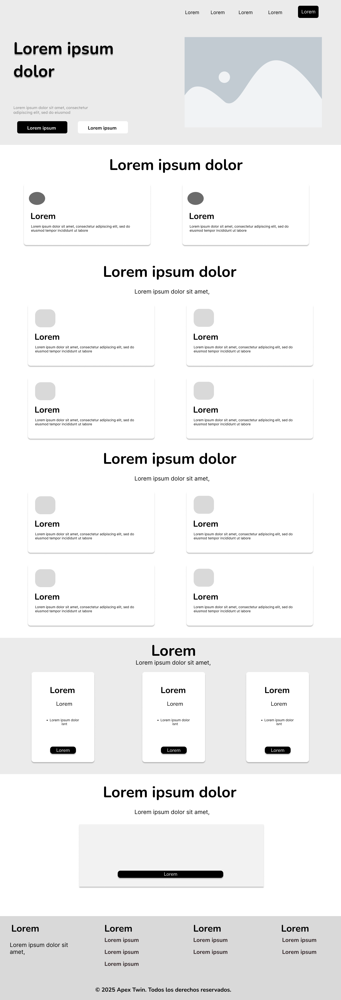

#### Mobile Web Browser
.png)

### 6.3.2. Landing Page Mock-up

#### Desktop Web Browser
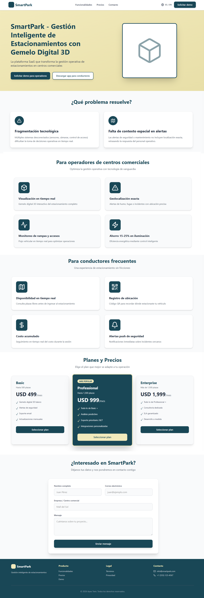

#### Mobile Web Browser


## 6.4. Applications UX/UI Design

### 6.4.1. Applications Wireframes

#### Web Application (Operador)

Esta sección presenta los wireframes de baja fidelidad de la aplicación web destinada al operador, mostrando la estructura y jerarquía de los módulos de monitoreo y gestión del estacionamiento.

#### Wireframe de Inicio de Sesión (Login)
Pantalla de acceso para el operador, con campos de credenciales y opciones de recuperación de contraseña para ingresar al panel administrativo.

<p align="center">
  
  <br>
  <b>Figura:</b> Esquema de la pantalla de autenticación del operador.
</p>

#### Wireframe de Registro
Formulario para el alta de nuevos operadores, contemplando los datos esenciales y la validación necesaria para crear una cuenta administrativa.

<p align="center">
  
  <br>
  <b>Figura:</b> Maqueta del formulario de registro de operadores.
</p>

#### Wireframe de Dashboard Principal
Vista general del panel de control, que centraliza los indicadores clave de desempeño y el resumen del estado operativo del estacionamiento.

<p align="center">
  
  <br>
  <b>Figura:</b> Esquema del tablero principal de monitoreo.
</p>

#### Wireframe de Ocupación por Nivel
Representación visual de la distribución de espacios ocupados y disponibles por cada nivel del estacionamiento, facilitando la lectura del estado en tiempo real.

<p align="center">
  
  <br>
  <b>Figura:</b> Estructura del módulo de ocupación por niveles.
</p>

#### Wireframe de Alertas de Seguridad
Listado cronológico de las alertas de seguridad detectadas, organizadas por prioridad y tipo de evento para una rápida atención del operador.

<p align="center">
  
  <br>
  <b>Figura:</b> Esquema del centro de alertas de seguridad.
</p>

#### Wireframe de Flujo Vehicular
Visualización del flujo de entradas y salidas de vehículos, presentando métricas temporales y picos de movimiento dentro del estacionamiento.

<p align="center">
  
  <br>
  <b>Figura:</b> Maqueta del módulo de análisis de flujo vehicular.
</p>

#### Wireframe de Eficiencia Energética
Panel de seguimiento del consumo energético del estacionamiento, mostrando indicadores de uso, ahorro y comparativas históricas.

<p align="center">
  
  <br>
  <b>Figura:</b> Estructura del módulo de eficiencia energética.
</p>

#### Wireframe de Historial de Incidentes
Registro detallado de incidentes ocurridos, con filtros por fecha, tipo y estado para auditoría y seguimiento por parte del operador.

<p align="center">
  
  <br>
  <b>Figura:</b> Esquema del historial de incidentes registrados.
</p>

#### Mobile Application (Conductor — PowerApps)

Esta sección detalla la arquitectura de información y el diseño estructural de baja fidelidad (wireframes) de la aplicación móvil.

#### Wireframe de Inicio de Sesión (Login)
Interfaz que permite a los usuarios acceder a su cuenta mediante credenciales (correo y contraseña) o a través de opciones de autenticación social. Incluye enlaces para recuperación de contraseña y creación de cuenta.

<p align="center">
  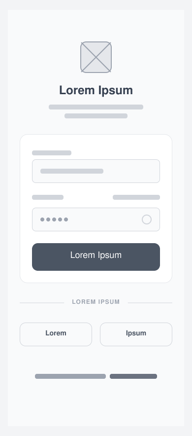
  <br>
  <b>Figura:</b> Esquema de la pantalla de acceso y autenticación.
</p>


#### Wireframe de Registro de Usuario
Formulario diseñado para captar los datos esenciales del nuevo conductor, incluyendo validación de contraseña y aceptación de términos y condiciones para la creación de una nueva cuenta.

<p align="center">
  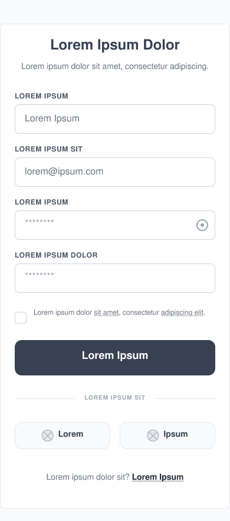
  <br>
  <b>Figura:</b> Maqueta del formulario de registro para nuevos usuarios.
</p>

#### Wireframe de Inicio (Dashboard)
Representación esquemática de la vista principal que organiza los módulos de disponibilidad de zonas y el resumen de la sesión de estacionamiento activa.

<p align="center">
  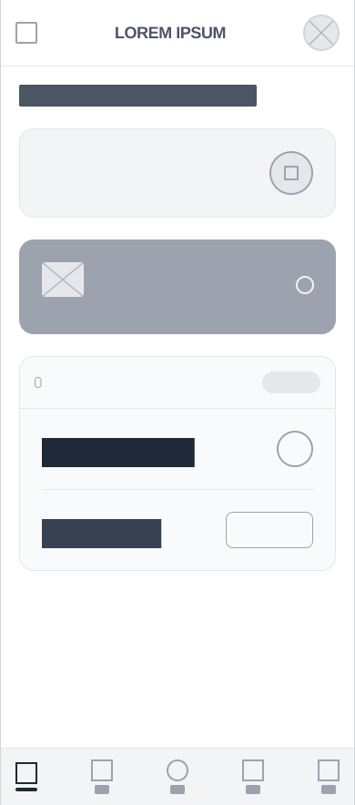
  <br>
  <b>Figura:</b> Esquema del dashboard principal y estado de ocupación.
</p>


#### Wireframe de Mapas Interactivos
Maqueta funcional de la navegación por niveles, mostrando la distribución de espacios y la jerarquía de los elementos de búsqueda.

<p align="center">
  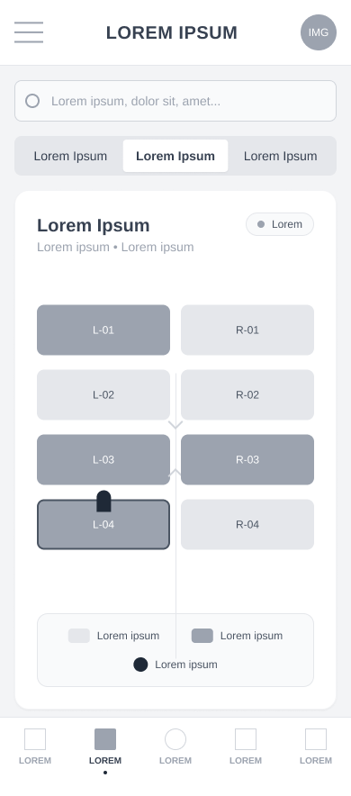
  <br>
  <b>Figura:</b> Estructura visual del mapa de niveles y spots.
</p>

#### Wireframe de Localizador de Vehículo
Esquema diseñado para priorizar la información de ubicación del auto, integrando el espacio para la imagen de referencia y botones de acción rápida.

<p align="center">
  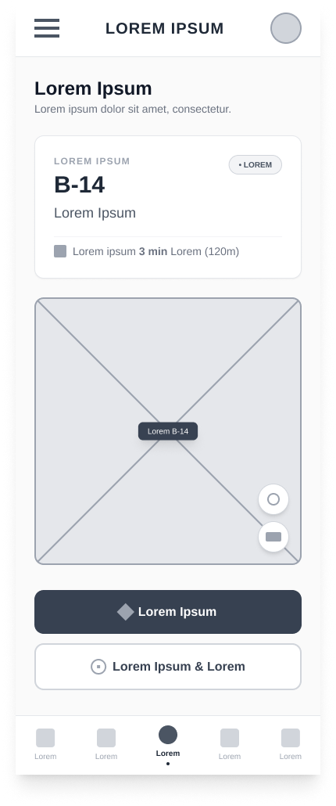
  <br>
  <b>Figura:</b> Maqueta de la interfaz de localización y asistencia remota.
</p>

#### Wireframe de Gestión de Pagos
Estructura del módulo financiero que detalla el desglose de costos, la selección de métodos de pago y el listado de transacciones históricas.

<p align="center">
  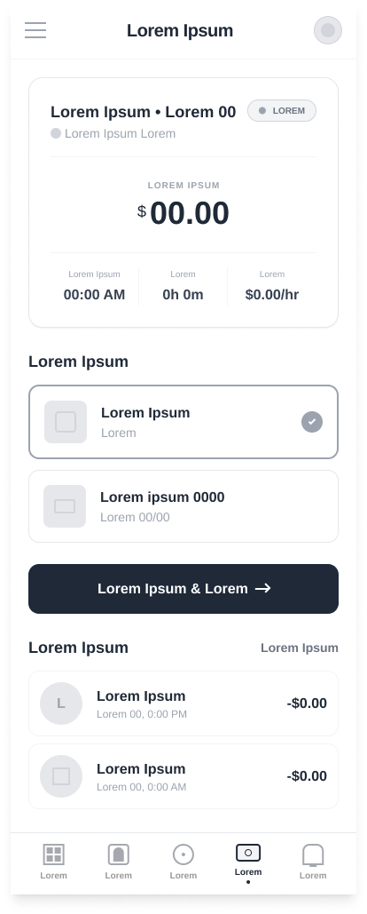
  <br>
  <b>Figura:</b> Diseño estructural del centro de pagos y recibos.
</p>

#### Wireframe de Centro de Alertas
Maqueta de la lista de notificaciones, organizada de forma cronológica para mostrar avisos de seguridad, mantenimiento y promociones.

<p align="center">
  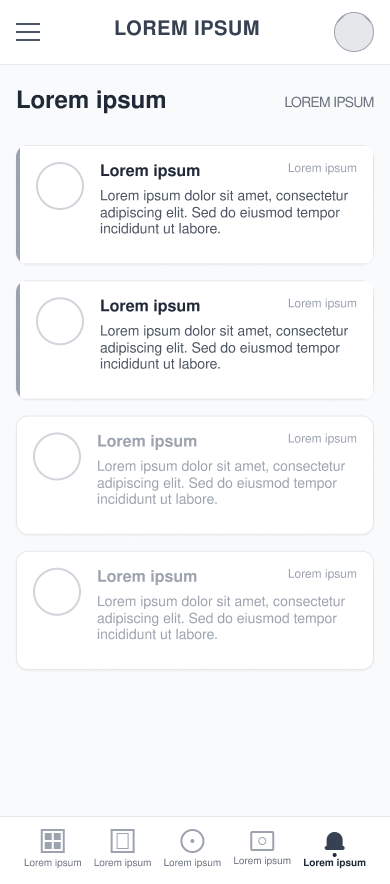
  <br>
  <b>Figura:</b> Esquema del registro de notificaciones y alertas.
</p>

#### Wireframe de Perfil de Usuario
Representación de la cuenta del usuario, jerarquizando la información del miembro, los vehículos registrados y los detalles de la suscripción.

<p align="center">
  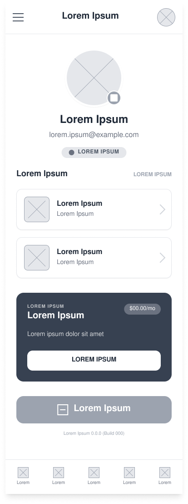
  <br>
  <b>Figura:</b> Estructura del perfil de usuario y gestión de flota.
</p>

#### Wireframe de Edición de Perfil
Esquema del formulario de actualización de datos, diseñado para facilitar la entrada de texto y el cambio de la imagen de perfil.

<p align="center">
  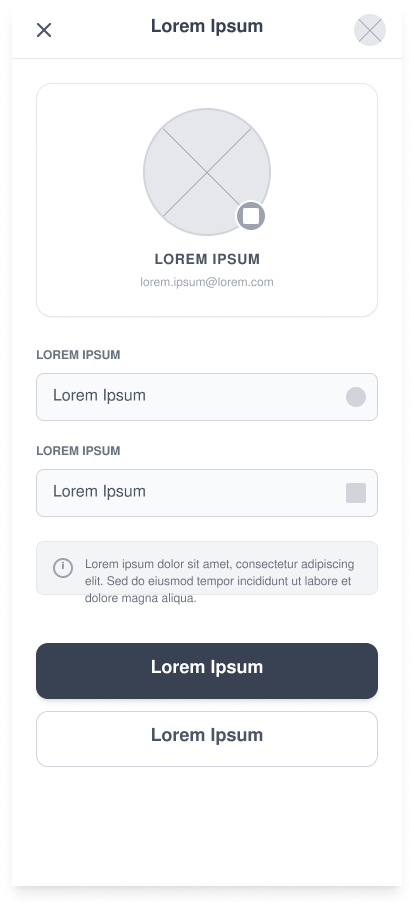
  <br>
  <b>Figura:</b> Maqueta del formulario de edición de información personal.
</p>

#### Wireframe de Menú Lateral
Diseño del panel desplegable que organiza los accesos secundarios a configuraciones, métodos de pago y soporte técnico.

<p align="center">
  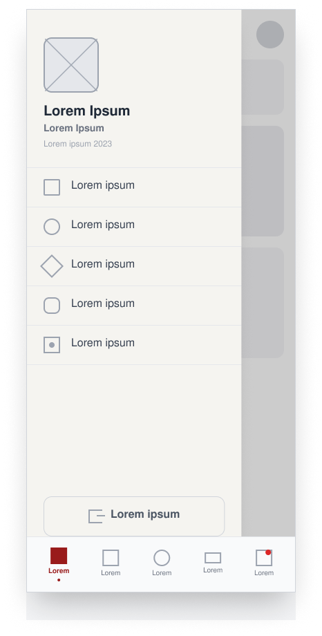
  <br>
  <b>Figura:</b> Estructura del menú de navegación y ajustes de cuenta.
</p>

### 6.4.2. Applications Wireflow Diagrams

### Wireflow Operador

#### Wireflow Operador: Registro e Inicio de Sesión

Este wireflow representa el proceso que sigue un nuevo operador para registrarse en la plataforma e iniciar sesión en el panel administrativo. El flujo parte del formulario de registro, valida los datos ingresados y, una vez confirmados, redirige al dashboard principal. También contempla el escenario alternativo donde credenciales inválidas obligan al usuario a corregir los datos.

<p align="center">
  
  <br>
  <b>Figura:</b> Flujo de registro, validación e inicio de sesión del operador.
</p>

#### Wireflow Operador: Monitoreo de Ocupación

Este wireflow describe el recorrido que realiza el operador para consultar el estado de ocupación del estacionamiento por niveles. Desde el dashboard principal, accede al módulo de ocupación, filtra por nivel y obtiene métricas en tiempo real sobre la disponibilidad de espacios.

<p align="center">
  
  <br>
  <b>Figura:</b> Flujo de consulta y análisis de la ocupación por niveles.
</p>

#### Wireflow Operador: Gestión de Alerta de Humo

Este wireflow representa el flujo que sigue el operador al recibir una alerta de humo dentro del estacionamiento. Desde el centro de alertas accede al detalle del evento, identifica la zona afectada y ejecuta el protocolo de atención correspondiente para mitigar el incidente.

<p align="center">
  
  <br>
  <b>Figura:</b> Flujo de identificación, localización y atención de una alerta de humo.
</p>

#### Wireflow Operador: Flujo Vehicular

Este wireflow muestra el proceso mediante el cual el operador analiza el flujo de entradas y salidas de vehículos. Permite consultar métricas temporales, identificar picos de tráfico y revisar patrones de movimiento dentro del estacionamiento.

<p align="center">
  
  <br>
  <b>Figura:</b> Flujo de análisis del tráfico de entradas y salidas de vehículos.
</p>

#### Wireflow Operador: Eficiencia Energética

Este wireflow detalla el flujo de seguimiento del consumo energético del estacionamiento por parte del operador. Desde el panel principal accede al módulo energético, revisa indicadores de uso y consulta comparativas históricas para optimizar la operación.

<p align="center">
  
  <br>
  <b>Figura:</b> Flujo de monitoreo y análisis del consumo energético del estacionamiento.
</p>

### Wireflow Driver 

#### Wireflow Driver: Registro de cuenta e inicio de sesión

Este wireflow presenta el proceso general que sigue un usuario nuevo para registrarse en SmartPark e iniciar sesión en la aplicación. El flujo parte desde la creación de cuenta, continúa con la validación de los datos ingresados y finaliza con el acceso a la pantalla principal cuando las credenciales son correctas. Además, se considera el escenario alternativo en el que el sistema detecta datos inválidos y solicita al usuario corregir la información antes de continuar.

<p align="center">
  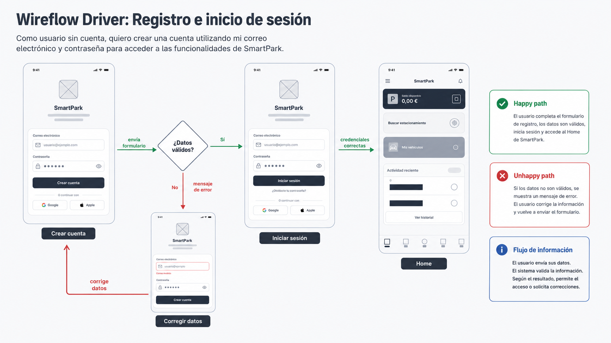
  <br>
  <b>Figura:</b> Flujo de registro, validación e inicio de sesión en la aplicación.
</p>

#### Wireflow Driver: Búsqueda y registro de espacio de estacionamiento

Este wireflow describe el recorrido principal del conductor para buscar un espacio de estacionamiento disponible dentro de SmartPark. El usuario inicia desde la pantalla principal, accede al mapa, selecciona una plaza y el sistema valida su disponibilidad antes de registrar la sesión. También se contempla el caso en que el espacio deje de estar disponible, permitiendo al conductor recibir una alerta y elegir una alternativa cercana.

<p align="center">
  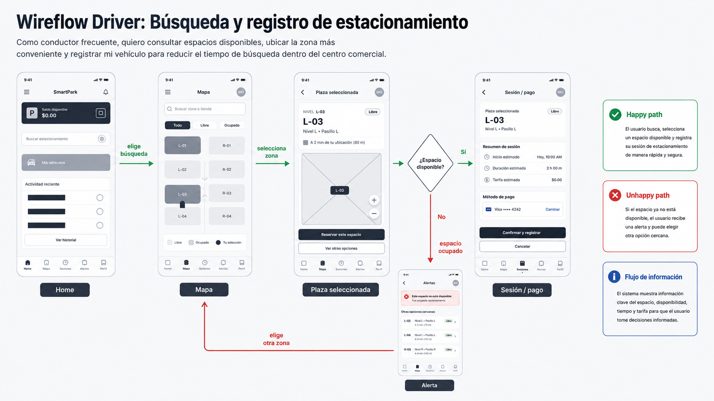
  <br>
  <b>Figura:</b> Flujo de búsqueda, selección y registro de un espacio de estacionamiento en la aplicación.
</p>

#### Wireflow Driver: Gestión de perfil y preferencias

Este wireflow muestra el proceso general mediante el cual un conductor registrado consulta, edita y actualiza la información de su perfil dentro de SmartPark. El flujo permite visualizar los datos del usuario, modificar información personal o de cuenta, y acceder a opciones relacionadas desde el menú lateral. Asimismo, se considera la validación de campos para asegurar que los cambios ingresados sean correctos antes de guardarlos.

<p align="center">
  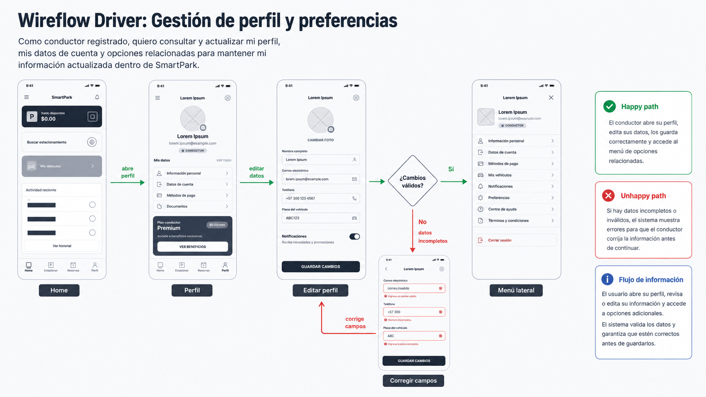
  <br>
  <b>Figura:</b> Flujo de gestión, validación y actualización del perfil del conductor en la aplicación.
</p>

### 6.4.3. Applications Mock-ups

#### Web Application (Operador)


#### Mobile Application (Conductor)


### 6.4.4. Applications User Flow Diagrams

#### User Flow: Operator manages an active smoke incident
**User Goal:** Gestionar un incidente de humo desde detección hasta resolución.


#### User Flow: Driver completes a parking session
**User Goal:** Completar una sesión de estacionamiento desde ingreso hasta pago de salida.


## 6.5. Applications Prototyping

_(Prototipos de UI con simulación de interacción y navegación. Para cada aplicación: 1 screenshot del video y enlace al video subido en Microsoft Stream.)_

### Prototype: Web Application (Operador)


**URL del video:** `https://web.microsoftstream.com/...`

### Prototype: Mobile Application (Conductor)


**URL del video:** `https://web.microsoftstream.com/...`

---

# Capítulo VII: Product Implementation, Validation & Deployment

## 7.1. Software Configuration Management

### 7.1.1. Software Development Environment Configuration

| Categoría | Producto | Propósito | Ruta de referencia/descarga |
|---|---|---|---|
| Project Management | Pivotal Tracker | Product Backlog y Sprint tracking | `https://www.pivotaltracker.com/` |
| Requirements Management | UXPressia | User Personas, Empathy Maps, Impact Maps | `https://uxpressia.com/` |
| Domain Modeling | Miro / LucidChart | EventStorming, Bounded Context Canvases, Domain Storytelling | `https://miro.com/` |
| Software Architecture (C4) | Structurizr | C4 Model diagrams | `https://structurizr.com/` |
| UML Design | LucidChart | UML class diagrams | `https://lucidchart.com/` |
| Database Design | Vertabelo | DB design diagrams | `https://vertabelo.com/` |
| UI/UX Design | Figma | Wireframes, mockups, prototypes | `https://figma.com/` |
| IDE Backend | Visual Studio 2022 / JetBrains Rider | ASP.NET Core 8 development | `https://visualstudio.microsoft.com/` |
| IDE Frontend | Visual Studio Code | Angular, Node.js, HTML/CSS/JS | `https://code.visualstudio.com/` |
| Mobile Development | Microsoft PowerApps Studio | Low-code mobile app | `https://make.powerapps.com/` |
| API Documentation | Swagger UI | OpenAPI documentation | Embebido en ASP.NET Core |
| Source Control | Git + GitHub | Version control con GitFlow | `https://github.com/` |
| Cloud Provider | Microsoft Azure | Web Services hosting, Digital Twins, Storage | `https://portal.azure.com/` |
| Notifications | Firebase Cloud Messaging | Push notifications | `https://firebase.google.com/` |
| Video Hosting | Microsoft Stream + YouTube | Videos de entrevistas y producto | — |

### 7.1.2. Source Code Management

**Repositorios:**

| Producto | Repositorio | Branches base |
|---|---|---|
| Report | `https://github.com/<org>/report` | main, develop |
| Landing Page | `https://github.com/<org>/landing-page` | main, develop |
| Web Application | `https://github.com/<org>/web-application` | main, develop |
| Web Services | `https://github.com/<org>/web-services` | main, develop |
| IoT Simulator | `https://github.com/<org>/iot-simulator` | main, develop |
| Mobile App | `https://github.com/<org>/mobile-app` | main, develop |

**GitFlow Workflow:**

- `main`: rama principal con releases estables. Protected, solo merges desde `release/*` o `hotfix/*`.
- `develop`: rama de integración. Default branch.
- `feature/*`: una rama por feature/user story. Naming: `feature/<chapter-or-module>-<short-description>` para el report; `feature/us-<id>-<short-description>` para productos digitales.
- `release/*`: ramas de preparación de release. Naming con semantic versioning: `release/v0.1.0-tb1`, `release/v0.2.0-tp1`, `release/v0.3.0-tb2`, `release/v1.0.0-tf1`.
- `hotfix/*`: correcciones urgentes post-entrega. Naming: `hotfix/<short-description>`.

**Conventional Commits:** Se aplica `https://www.conventionalcommits.org/`.

| Tipo | Uso |
|---|---|
| `feat` | Nueva funcionalidad |
| `fix` | Corrección de bug |
| `docs` | Cambios de documentación |
| `style` | Formato, sin cambios de lógica |
| `refactor` | Refactorización sin cambio funcional |
| `test` | Añadir o corregir tests |
| `chore` | Tareas auxiliares |
| `perf` | Mejoras de performance |

**Semantic Versioning:** Se aplica `https://semver.org/` (MAJOR.MINOR.PATCH).

### 7.1.3. Source Code Style Guide & Conventions

| Lenguaje | Guía adoptada | Referencia |
|---|---|---|
| C# (ASP.NET Core) | Microsoft C# Coding Conventions | `https://learn.microsoft.com/en-us/dotnet/csharp/fundamentals/coding-style/coding-conventions` |
| TypeScript (Angular) | Google TypeScript Style Guide | `https://google.github.io/styleguide/tsguide.html` |
| JavaScript (Node, Landing) | Airbnb JavaScript Style Guide | `https://github.com/airbnb/javascript` |
| HTML5 / CSS3 | Google HTML/CSS Style Guide | `https://google.github.io/styleguide/htmlcssguide.html` |
| Gherkin (.feature) | Gherkin Conventions for Readable Specifications | `https://specflow.org/gherkin/gherkin-conventions-for-readable-specifications/` |

Toda nomenclatura en inglés.

### 7.1.4. Software Deployment Configuration

_(Pasos para desplegar cada producto digital desde sus repositorios.)_

#### Landing Page → Azure Static Web Apps
1. Push a `main` dispara GitHub Actions workflow.
2. Azure Static Web Apps build & deploy.

#### Web Application (Angular) → Azure Static Web Apps
1. `ng build --configuration production`.
2. Deploy automatizado vía GitHub Actions.

#### Web Services (ASP.NET Core) → Azure App Service
1. `dotnet publish -c Release`.
2. Deploy vía Azure Pipelines o GitHub Actions.

#### IoT Simulator (Node.js) → Azure Container Apps
1. `docker build -t iot-simulator .`.
2. Push a Azure Container Registry.
3. Deploy a Container Apps.

#### Mobile App (PowerApps)
1. Export & Import via PowerApps Solution.

#### Azure Digital Twins
1. Deploy via ARM template / Bicep.
2. Upload DTDL models via CLI.

**Deployment Diagram (C4):**


## 7.2. Solution Implementation

### 7.2.1. Sprint 1

#### 7.2.1.1. Sprint Planning 1

| Sprint Planning Background | |
|---|---|
| **Sprint #** | Sprint 1 |
| **Date** | YYYY-MM-DD |
| **Time** | HH:MM AM/PM |
| **Location** | _(Virtual / Física)_ |
| **Prepared By** | _(Team Leader)_ |
| **Attendees** | _(Lista de asistentes)_ |
| **Sprint 0 Review Summary** | N/A (primer sprint) |
| **Sprint 0 Retrospective Summary** | N/A (primer sprint) |

| Sprint Goal & User Stories | |
|---|---|
| **Sprint 1 Goal** | _(Definir el goal y la métrica de cumplimiento.)_ |
| **Sprint 1 Velocity** | _(N story points)_ |
| **Sum of Story Points** | _(N)_ |

#### 7.2.1.2. Sprint Backlog 1

**URL del Board:** `https://trello.com/b/...` _(o herramienta equivalente)_


| Sprint # | Sprint 1 | | | | | | |
|---|---|---|---|---|---|---|---|
| **User Story** | | | **Work-Item / Task** | | | | |
| Id | Title | Id | Title | Description | Estimation (Hours) | Assigned To | Status |
| US-07 | View Landing Page as Mall Operator | T-01 | Setup landing page repo | _(...)_ | 2 | _(Nombre)_ | Done |
| US-07 | View Landing Page as Mall Operator | T-02 | Build hero section | _(...)_ | 4 | _(Nombre)_ | Done |
| US-08 | View Landing Page as Driver | T-03 | Build "For Drivers" section | _(...)_ | 4 | _(Nombre)_ | Done |
| TS-01 | Twin State Update Endpoint | T-04 | Setup ASP.NET Core project | _(...)_ | 3 | _(Nombre)_ | Done |
| TS-01 | Twin State Update Endpoint | T-05 | Implement PATCH /api/v1/twins/{id} | _(...)_ | 6 | _(Nombre)_ | Done |
| _(...)_ | | | | | | | |

#### 7.2.1.3. Development Evidence for Sprint Review

_(Resumen de avances en implementación. Tabla de commits por repositorio.)_

| Repository | Branch | Commit Id | Commit Message | Commit Message Body | Committed on |
|---|---|---|---|---|---|
| `<org>/landing-page` | `feature/hero-section` | `abc1234` | feat: add hero section | Implements landing page hero with primary CTA | YYYY-MM-DD |
| `<org>/web-services` | `feature/ts-01-twin-update` | `def5678` | feat(twins): add PATCH endpoint for twin state updates | Implements UpdateOccupancyStateCommand and handler | YYYY-MM-DD |
| _(...)_ | | | | | |

#### 7.2.1.4. Testing Suite Evidence for Sprint Review

_(Conjunto de Unit Tests, Integration Tests y Acceptance Tests automatizados, para Web Services.)_

**Unit Tests implementados:**
- `ParkingSpaceTests` — valida transiciones de estado.
- `OccupancyCalculationServiceTests` — valida cálculos agregados.

**Acceptance Tests (.feature):**

```gherkin
Feature: Twin State Update
  As a developer
  I want to update twin state via PATCH endpoint
  So that the simulator can send telemetry

  Scenario: Successful twin update
    Given a valid twin with id "space-001"
    When I send PATCH /api/v1/twins/space-001 with valid JSON Patch
    Then the response status is 204

  Scenario: Twin not found
    Given a twin id "nonexistent" does not exist
    When I send PATCH /api/v1/twins/nonexistent
    Then the response status is 404
```

| Repository | Branch | Commit Id | Commit Message | Commit Message Body | Committed on |
|---|---|---|---|---|---|
| `<org>/web-services` | `feature/ts-01-tests` | `ghi9012` | test(twins): add acceptance tests for twin update | Includes successful and not-found scenarios | YYYY-MM-DD |

#### 7.2.1.5. Execution Evidence for Sprint Review

_(Screenshots de las principales vistas implementadas + enlace a video demo.)_


**URL del video demo:** `https://web.microsoftstream.com/...`

#### 7.2.1.6. Services Documentation Evidence for Sprint Review

_(Endpoints documentados con OpenAPI relacionados con el alcance del sprint.)_

| Endpoint | HTTP Verb | Description | Parameters | Example Response |
|---|---|---|---|---|
| `/api/v1/twins/{id}` | PATCH | Updates a twin state | `id` (path), JSON Patch (body) | `204 No Content` |
| `/api/v1/occupancy/levels/{levelId}` | GET | Returns occupancy by level | `levelId` (path) | `200 OK` with JSON array |


#### 7.2.1.7. Software Deployment Evidence for Sprint Review

_(Capturas de procesos de deployment ejecutados durante el sprint.)_


**URLs desplegadas:**
- Landing Page: `https://...`
- Web Services: `https://...`
- Web App: `https://...`

#### 7.2.1.8. Team Collaboration Insights during Sprint


_(Análisis de la colaboración de cada miembro durante el sprint.)_

---

### 7.2.2. Sprint 2

#### 7.2.2.1. Sprint Planning 2

| Sprint Planning Background | |
|---|---|
| **Sprint #** | Sprint 2 |
| **Date** | YYYY-MM-DD |
| **Time** | HH:MM AM/PM |
| **Location** | _(Virtual / Física)_ |
| **Prepared By** | _(Team Leader)_ |
| **Attendees** | _(Lista de asistentes)_ |
| **Sprint 1 Review Summary** | _(Resumen del Sprint 1: resultados a nivel de productos de software, opiniones de miembros y feedback del product owner.)_ |
| **Sprint 1 Retrospective Summary** | _(Resumen del Sprint 1: opiniones del equipo sobre aciertos y oportunidades de mejora en su forma de trabajo.)_ |

| Sprint Goal & User Stories | |
|---|---|
| **Sprint 2 Goal** | _(Definir el goal y la métrica de cumplimiento.)_ |
| **Sprint 2 Velocity** | _(N story points)_ |
| **Sum of Story Points** | _(N)_ |

#### 7.2.2.2. Sprint Backlog 2

**URL del Board:** `https://trello.com/b/...` _(o herramienta equivalente)_


| Sprint # | Sprint 2 | | | | | | |
|---|---|---|---|---|---|---|---|
| **User Story** | | | **Work-Item / Task** | | | | |
| Id | Title | Id | Title | Description | Estimation (Hours) | Assigned To | Status |
| US-01 | View 3D Parking Occupancy Map | T-01 | Setup Angular project with Material | _(...)_ | 3 | _(Nombre)_ | Done |
| US-01 | View 3D Parking Occupancy Map | T-02 | Embed 3D Scenes Studio viewer via iframe | _(...)_ | 5 | _(Nombre)_ | Done |
| US-03 | View Available Spaces by Zone | T-03 | Build PowerApps availability screen | _(...)_ | 4 | _(Nombre)_ | Done |
| US-04 | Register Vehicle Location | T-04 | Implement vehicle location registration | _(...)_ | 5 | _(Nombre)_ | Done |
| TS-02 | Occupancy Query Endpoint | T-05 | Implement GET /api/v1/occupancy | _(...)_ | 4 | _(Nombre)_ | Done |
| _(...)_ | | | | | | | |

#### 7.2.2.3. Development Evidence for Sprint Review

_(Resumen de avances en implementación. Tabla de commits por repositorio.)_

| Repository | Branch | Commit Id | Commit Message | Commit Message Body | Committed on |
|---|---|---|---|---|---|
| `<org>/web-application` | `feature/us-01-3d-viewer` | `a1b2c3d` | feat(dashboard): embed 3D Scenes Studio viewer | Adds iframe-based viewer for the parking digital twin | YYYY-MM-DD |
| `<org>/mobile-app` | `feature/us-04-location-register` | `e4f5g6h` | feat(driver): add vehicle location registration screen | Implements zone/level selector and confirmation flow | YYYY-MM-DD |
| `<org>/web-services` | `feature/ts-02-occupancy-query` | `i7j8k9l` | feat(occupancy): add GET endpoint for occupancy aggregation | Implements GetOccupancyByLevelQuery and handler | YYYY-MM-DD |
| _(...)_ | | | | | |

#### 7.2.2.4. Testing Suite Evidence for Sprint Review

_(Conjunto de Unit Tests, Integration Tests y Acceptance Tests automatizados, para Web Services.)_

**Unit Tests implementados:**
- `OccupancyControllerTests` — valida respuesta de endpoint de ocupación.
- `GetOccupancyByLevelQueryHandlerTests` — valida lógica de agregación.

**Acceptance Tests (.feature):**

```gherkin
Feature: Occupancy Query
  As an operator
  I want to query parking occupancy by level
  So that I can see the current state of each level

  Scenario: Successful occupancy query
    Given I am authenticated as an operator
    When I send GET /api/v1/occupancy/levels/B1
    Then the response status is 200
    And the response contains the count of free, occupied, and reserved spaces

  Scenario: Level not found
    Given level "Z9" does not exist
    When I send GET /api/v1/occupancy/levels/Z9
    Then the response status is 404
```

| Repository | Branch | Commit Id | Commit Message | Commit Message Body | Committed on |
|---|---|---|---|---|---|
| `<org>/web-services` | `feature/ts-02-tests` | `m1n2o3p` | test(occupancy): add acceptance tests for occupancy query | Includes successful and not-found scenarios | YYYY-MM-DD |

#### 7.2.2.5. Execution Evidence for Sprint Review

_(Screenshots de las principales vistas implementadas + enlace a video demo.)_


**URL del video demo:** `https://web.microsoftstream.com/...`

#### 7.2.2.6. Services Documentation Evidence for Sprint Review

_(Endpoints documentados con OpenAPI relacionados con el alcance del sprint.)_

| Endpoint | HTTP Verb | Description | Parameters | Example Response |
|---|---|---|---|---|
| `/api/v1/occupancy/levels/{levelId}` | GET | Returns aggregated occupancy by level | `levelId` (path) | `200 OK` with JSON object |
| `/api/v1/occupancy/zones/{zoneId}` | GET | Returns aggregated occupancy by zone | `zoneId` (path) | `200 OK` with JSON object |
| `/api/v1/sessions` | POST | Registers a new parking session | Body (driver, location) | `201 Created` |


#### 7.2.2.7. Software Deployment Evidence for Sprint Review

_(Capturas de procesos de deployment ejecutados durante el sprint.)_


**URLs desplegadas:**
- Web Services: `https://...`
- Web Application: `https://...`
- IoT Simulator: `https://...`

#### 7.2.2.8. Team Collaboration Insights during Sprint


_(Análisis de la colaboración de cada miembro durante el sprint.)_

---

### 7.2.3. Sprint 3

#### 7.2.3.1. Sprint Planning 3

| Sprint Planning Background | |
|---|---|
| **Sprint #** | Sprint 3 |
| **Date** | YYYY-MM-DD |
| **Time** | HH:MM AM/PM |
| **Location** | _(Virtual / Física)_ |
| **Prepared By** | _(Team Leader)_ |
| **Attendees** | _(Lista de asistentes)_ |
| **Sprint 2 Review Summary** | _(Resumen del Sprint 2: resultados a nivel de productos de software, opiniones de miembros y feedback del product owner.)_ |
| **Sprint 2 Retrospective Summary** | _(Resumen del Sprint 2: opiniones del equipo sobre aciertos y oportunidades de mejora en su forma de trabajo.)_ |

| Sprint Goal & User Stories | |
|---|---|
| **Sprint 3 Goal** | _(Definir el goal y la métrica de cumplimiento. Foco en cierre: integración de alertas en tiempo real, push notifications, gestión energética y refinamiento UX.)_ |
| **Sprint 3 Velocity** | _(N story points)_ |
| **Sum of Story Points** | _(N)_ |

#### 7.2.3.2. Sprint Backlog 3

**URL del Board:** `https://trello.com/b/...` _(o herramienta equivalente)_


| Sprint # | Sprint 3 | | | | | | |
|---|---|---|---|---|---|---|---|
| **User Story** | | | **Work-Item / Task** | | | | |
| Id | Title | Id | Title | Description | Estimation (Hours) | Assigned To | Status |
| US-02 | Receive Smoke Alert with Spatial Context | T-01 | Implement SignalR Hub for real-time alerts | _(...)_ | 6 | _(Nombre)_ | Done |
| US-02 | Receive Smoke Alert with Spatial Context | T-02 | Subscribe operator dashboard to alert channel | _(...)_ | 4 | _(Nombre)_ | Done |
| US-05 | Receive Safety Alerts Near Vehicle | T-03 | Integrate Firebase Cloud Messaging in backend | _(...)_ | 5 | _(Nombre)_ | Done |
| US-05 | Receive Safety Alerts Near Vehicle | T-04 | Configure FCM device token registration in PowerApps | _(...)_ | 4 | _(Nombre)_ | Done |
| TS-03 | Push Notification Trigger | T-05 | Implement notifications service for active sessions | _(...)_ | 5 | _(Nombre)_ | Done |
| US-06 | Identify Low-Occupancy Zones for Lighting Adjustment | T-06 | Implement energy view in dashboard | _(...)_ | 4 | _(Nombre)_ | Done |
| _(...)_ | | | | | | | |

#### 7.2.3.3. Development Evidence for Sprint Review

_(Resumen de avances en implementación. Tabla de commits por repositorio.)_

| Repository | Branch | Commit Id | Commit Message | Commit Message Body | Committed on |
|---|---|---|---|---|---|
| `<org>/web-services` | `feature/us-02-signalr-alerts` | `q1r2s3t` | feat(alerts): add SignalR Hub for real-time smoke alerts | Implements push channel for operator dashboard | YYYY-MM-DD |
| `<org>/web-services` | `feature/ts-03-fcm-integration` | `u4v5w6x` | feat(notifications): integrate Firebase Cloud Messaging | Implements FcmNotificationService and device token registry | YYYY-MM-DD |
| `<org>/web-application` | `feature/us-02-alert-overlay` | `y7z8a9b` | feat(dashboard): subscribe to SignalR alert channel | Renders alert overlay on 3D viewer when smoke detected | YYYY-MM-DD |
| `<org>/mobile-app` | `feature/us-05-push-alerts` | `c1d2e3f` | feat(driver): handle FCM push notifications for safety alerts | Displays in-app evacuation instructions on alert receipt | YYYY-MM-DD |
| `<org>/web-application` | `feature/us-06-energy-view` | `g4h5i6j` | feat(dashboard): add energy management view | Highlights low-occupancy zones with dimming recommendations | YYYY-MM-DD |
| _(...)_ | | | | | | | |

#### 7.2.3.4. Testing Suite Evidence for Sprint Review

_(Conjunto de Unit Tests, Integration Tests y Acceptance Tests automatizados, para Web Services.)_

**Unit Tests implementados:**
- `FcmNotificationServiceTests` — valida envío correcto a FCM.
- `SmokeAlertHandlerTests` — valida detección de sesiones afectadas por zona.
- `EnergyRecommendationServiceTests` — valida lógica de recomendación de atenuación.

**Acceptance Tests (.feature):**

```gherkin
Feature: Smoke Alert End-to-End
  As an operator
  I want to receive smoke alerts with spatial context in real time
  So that I can coordinate the response immediately

  Scenario: Alert reaches operator dashboard within 2 seconds
    Given a smoke detector "SD-001" in zone "B1-A"
    When the simulator emits a smoke detection event
    Then within 2 seconds the operator dashboard receives the alert
    And the affected zone is highlighted on the 3D viewer

  Scenario: Driver with active session receives push notification
    Given a driver with an active parking session in zone "B1-A"
    When a smoke alert is triggered in zone "B1-A"
    Then within 5 seconds the driver receives a push notification
    And the notification includes evacuation instructions
```

| Repository | Branch | Commit Id | Commit Message | Commit Message Body | Committed on |
|---|---|---|---|---|---|
| `<org>/web-services` | `feature/us-02-tests` | `k7l8m9n` | test(alerts): add end-to-end tests for smoke alerts | Validates 2s latency for dashboard and 5s for FCM push | YYYY-MM-DD |

#### 7.2.3.5. Execution Evidence for Sprint Review

_(Screenshots de las principales vistas implementadas + enlace a video demo.)_


**URL del video demo:** `https://web.microsoftstream.com/...`

#### 7.2.3.6. Services Documentation Evidence for Sprint Review

_(Endpoints documentados con OpenAPI relacionados con el alcance del sprint.)_

| Endpoint | HTTP Verb | Description | Parameters | Example Response |
|---|---|---|---|---|
| `/api/v1/alerts` | GET | Returns active alerts | Query: `zoneId`, `levelId` | `200 OK` with JSON array |
| `/api/v1/alerts/{id}/acknowledge` | POST | Acknowledges an alert by operator | `id` (path) | `204 No Content` |
| `/api/v1/notifications/devices` | POST | Registers a device token for push notifications | Body: `driverId`, `token` | `201 Created` |
| `/api/v1/energy/recommendations` | GET | Returns lighting dimming recommendations by zone | Query: `levelId` | `200 OK` with JSON array |
| `/hubs/alerts` | WebSocket | SignalR Hub for real-time alert channel | — | Real-time alert events |


#### 7.2.3.7. Software Deployment Evidence for Sprint Review

_(Capturas de procesos de deployment ejecutados durante el sprint. Esta es la versión final desplegada de los productos digitales.)_


**URLs desplegadas (versión final):**
- Landing Page: `https://...`
- Web Application: `https://...`
- Web Services: `https://...`
- IoT Simulator: `https://...`
- Swagger Docs: `https://.../swagger`

**Configuración de Firebase Cloud Messaging:**
- FCM Project: `<project-id>`
- Server Key configurado en App Service settings.

**Configuración de Azure Digital Twins:**
- ADT Instance: `<instance-name>.api.<region>.digitaltwins.azure.net`
- 3D Scenes Storage Container: `<container-name>`

#### 7.2.3.8. Team Collaboration Insights during Sprint


_(Análisis de la colaboración de cada miembro durante el sprint final.)_

## 7.3. Validation Interviews

### 7.3.1. Diseño de Entrevistas

_(Elementos a validar por segmento objetivo, incluyendo Landing Page y aplicaciones. User flows que formarán parte de la validación.)_

### 7.3.2. Registro de Entrevistas

#### Entrevista de Validación 1 — Operador
| Campo | Dato |
|---|---|
| Nombres y Apellidos | _(...)_ |
| Edad | _(...)_ |
| Distrito | _(...)_ |
| Cargo | _(...)_ |
| Fecha de entrevista | YYYY-MM-DD |
| URL del video | `https://web.microsoftstream.com/...` |
| Timing inicio | HH:MM:SS |
| Duración | MM:SS |


**Resumen:** _(Apreciaciones del entrevistado respecto a las tareas asignadas.)_

_(Repetir para todas las entrevistas de validación, 3-5 por segmento.)_

### 7.3.3. Evaluaciones según heurísticas

**UX Heuristics & Principles Evaluation**  
**Usability – Inclusive Design – Information Architecture**

| Campo | Valor |
|---|---|
| **CARRERA** | Ingeniería de Software |
| **CURSO** | Arquitecturas de Software Emergentes |
| **SECCIÓN** | _(...)_ |
| **PROFESORES** | _(...)_ |
| **AUDITOR** | _(Nombre del Grupo)_ |
| **CLIENTE(S)** | _(Nombres de los participantes)_ |

**SITE/APP A EVALUAR:** _(Web Application del Operador / Mobile App del Conductor)_

**TAREAS A EVALUAR:**
1. _(Login del operador)_
2. _(Visualización de mapa 3D de ocupación)_
3. _(Atención de alerta de humo)_
4. _(Registro de ubicación de vehículo en app móvil)_
5. _(Recepción de alerta de seguridad en app móvil)_
6. _(...)_

**TAREAS NO INCLUIDAS:**
1. _(...)_

**ESCALA DE SEVERIDAD:**

| Nivel | Descripción |
|---|---|
| 1 | Problema superficial: puede ser fácilmente superado por el usuario o ocurre con muy poca frecuencia. |
| 2 | Problema menor: ocurre un poco más frecuentemente o es más difícil de superar. Prioridad baja. |
| 3 | Problema mayor: ocurre frecuentemente o los usuarios no pueden resolverlo. Prioridad alta. |
| 4 | Problema muy grave: error de gran impacto que impide el uso. Imperativo corregir antes del lanzamiento. |

**TABLA RESUMEN:**

| # | Problema | Escala de severidad | Heurística/Principio violada(o) |
|---|---|---|---|
| 1 | _(Descripción del problema)_ | _(1-4)_ | _(Heurística violada)_ |
| 2 | _(...)_ | _(...)_ | _(...)_ |

**DESCRIPCIÓN DE PROBLEMAS:**

**PROBLEMA #1:** _(Título)_

- **Severidad:** _(1-4)_
- **Heurística violada:** _(...)_
- **Problema:** _(Descripción detallada con captura)_
- **Recomendación:** _(...)_

_(Repetir para cada problema identificado.)_

## 7.4. Video About-the-Product

_(Introducción y descripción del contenido del video. Tono consistente con el producto. Incluye al menos un testimonio positivo de un usuario que haya participado en las entrevistas de validación.)_


- **URL Microsoft Stream:** `https://web.microsoftstream.com/...`
- **URL YouTube:** `https://youtube.com/...`
- **Duración:** MM:SS

---

# Conclusiones

## Conclusiones y recomendaciones

### Conclusiones por entrega

#### TB1

1. **Los Problem Statements fueron validados empíricamente mediante las entrevistas.** Las seis entrevistas realizadas a operadores y conductores confirmaron los pain points identificados en el Lean UX: errores en el conteo de vehículos, ausencia de visibilidad en tiempo real por zonas, tiempos de búsqueda de plaza de entre 5 y 30 minutos, y desconfianza en los indicadores luminosos existentes. Esta triangulación entre la hipótesis inicial y el testimonio real de los usuarios otorga solidez al planteamiento del problema y justifica la inversión en la solución.

2. **Las Hypothesis Statements guiaron directamente el diseño de los User Stories y la arquitectura de bounded contexts.** Los seis enunciados de hipótesis —reducción del tiempo de respuesta ante incidentes (H1), reducción del tiempo de búsqueda de plaza (H2), optimización energética (H3), localización del vehículo (H4), seguridad proactiva (H5) y adopción comercial (H6)— se materializaron en las épicas EP-01 a EP-10 del Product Backlog, y cada una de ellas encontró correspondencia directa en los bounded contexts definidos en la sección 4.2: Safety & Incidents (H1), Parking Occupancy (H2), Energy Management (H3), Parking Session (H4), Notifications (H5) e Identity & Access Management (H6).

3. **El Attribute-Driven Design (ADD) demostró que la arquitectura puede acomodar los quality attribute scenarios más críticos sin sacrificar la modularidad.** Los escenarios priorizados —disponibilidad del 99,5 %, latencia de telemetría inferior a 500 ms y desacoplamiento entre bounded contexts— se satisfacen mediante una arquitectura de microservicios con Azure Digital Twins como núcleo de sincronización, mensajería asíncrona vía Azure Service Bus y despliegue en contenedores sobre Azure Kubernetes Service. Estas decisiones de diseño fueron tomadas con base en trade-offs explícitos documentados en la sección 4.1.4.

4. **El proceso de Domain-Driven Design alineó el modelo de dominio con el lenguaje de los usuarios.** El EventStorming reveló nueve bounded contexts cohesivos y con responsabilidades claras, sin acoplamiento innecesario. El Context Map definió relaciones de Customer/Supplier y Conformist que protegen la integridad del Digital Twin Synchronization Context como núcleo estratégico de la plataforma. El Ubiquitous Language formalizado en la sección 2.4 garantiza que los términos de dominio como *Parking Session*, *Occupancy State* o *Smoke Alert* sean consistentes entre el equipo técnico y los stakeholders.

5. **El equipo cumplió con la distribución de responsabilidades planificada para TB1.** Los cinco integrantes cubrieron la totalidad de los capítulos I al IV del informe, con evidencia de colaboración continua en el repositorio GitHub (24 commits no-merge sobre develop desde el 15 de abril al 26 de abril de 2026). La arquitectura del repositorio, el historial de ramas y los pull requests reflejan un flujo de trabajo colaborativo basado en feature branches con integración continua hacia develop.

#### TP1
_(Conclusiones acumulables.)_

#### TB2
_(Conclusiones acumulables.)_

#### TF1
_(Conclusiones finales del proyecto.)_

### Recomendaciones de roadmap

1. **Priorizar la implementación del Parking Occupancy y Safety & Incidents bounded contexts en TP1.** Estos dos contextos son los de mayor impacto validado en las entrevistas y los que sustentan las hipótesis H1 y H2. Contar con un prototipo funcional —aunque sea con sensores simulados— permitirá realizar pruebas de usabilidad con operadores reales y obtener feedback cuantitativo para contrastar las métricas de éxito definidas en el Lean UX.

2. **Avanzar en la integración del simulador IoT antes de involucrar hardware real.** La Business Assumption 11 establece explícitamente que el piloto debe demostrar valor sin inversión inicial en hardware. Desarrollar un simulador de telemetría realista que alimente el Azure Digital Twin permitirá demostrar la propuesta de valor a centros comerciales potenciales sin barreras de infraestructura, reduciendo el ciclo de ventas.

3. **Diseñar y ejecutar pruebas de usabilidad con conductores para la aplicación móvil PowerApps.** Los User Personas y el As-Is Scenario Mapping evidencian que los conductores interactúan con la app en condiciones de baja iluminación y alta carga cognitiva. Las pruebas deben evaluar específicamente el tiempo de registro de ubicación (meta: menos de 15 segundos, un toque) y la comprensibilidad del mapa de disponibilidad por zona.

4. **Establecer un acuerdo de piloto con al menos un centro comercial de Lima Metropolitana para TB2.** La Hypothesis Statement 6 establece como criterio de éxito la firma de 5 contratos en 12 meses. Para alcanzar esa meta, el equipo debe iniciar conversaciones comerciales en paralelo al desarrollo técnico, utilizando el demo con datos simulados como herramienta de prospección. La arquitectura multi-tenant definida en el Container Diagram facilita este despliegue desde la fase de piloto.

5. **Incorporar analítica predictiva de ocupación como diferenciador competitivo en TF1.** Ninguno de los competidores analizados en la sección 2.1 —ParkHelp, Cleverciti, SpotHero ni Park Assist— ofrece predicción de demanda basada en históricos. Integrar modelos de series de tiempo sobre los datos acumulados por el gemelo digital representaría una ventaja competitiva sostenible y daría sustento cuantitativo a la Business Assumption 9.

## Video About-the-Team

_(Resumen del proceso de trabajo, pauta de secuencias con timing, screenshot del video.)_


**Pauta de secuencias:**

| Inicio (hh:mm:ss) | Sección |
|---|---|
| 00:00:00 | Introducción |
| 00:00:30 | Sesiones de trabajo del equipo |
| 00:02:00 | Testimonio integrante 1 |
| 00:03:00 | Testimonio integrante 2 |
| 00:04:00 | Testimonio integrante 3 |
| 00:05:00 | Testimonio integrante 4 |
| 00:06:00 | Conclusiones grupales |

- **URL Microsoft Stream:** `https://web.microsoftstream.com/...`
- **URL YouTube:** `https://youtube.com/...`

---

# Bibliografía

Asociación de Centros Comerciales y Entretenimiento del Perú (ACCEP). (2025). Declaraciones de su presidente José Antonio Contreras. Citadas en: Gestión. (2025, diciembre). *Centros comerciales alcanzarían ventas por S/ 40 000 millones este año y crecerían 10%, según ACCEP*. https://gestion.pe/economia/centros-comerciales-alcanzarian-ventas-por-s-40000-millones-este-ano-y-crecerian-10-segun-accep-noticia/

Asociación Peruana de Empresas de Inteligencia de Mercados (APEIM). (2023). *Niveles socioeconómicos 2023-2024: Lima Metropolitana*. APEIM. https://apeim.com.pe/wp-content/uploads/2024/01/APEIM-Informe-de-Niveles-Socioeconomicos-2023-2024-Version-WEB.pdf

Banco Interamericano de Desarrollo (BID). (2020, 13 de abril). *La pesadilla de buscar estacionamiento, sobre la mesa* [Entrada de blog]. Moviliblog. https://blogs.iadb.org/transporte/es/la-pesadilla-de-buscar-estacionamiento-sobre-la-mesa/

Len Bass, Paul Clements, & Rick Kazman. (2021). *Software Architecture in Practice*, 4th Edition. Addison-Wesley Professional. https://catalogo.upc.edu.pe/permalink/51UPC_INST/7catuc/cdi_safari_books_v2_9780136885979

Cámara de Comercio de Lima — Instituto de Economía y Desarrollo Empresarial (IEDEP). (2024). Proyecciones de apertura de nuevos centros comerciales 2023–2025. Citadas en: Gestión. (2024, 17 de enero). *Ventas de malls del 2023 superaron las del año anterior, según ACCEP*. https://gestion.pe/economia/empresas/ventas-de-malls-del-2023-superaron-las-del-ano-anterior-segun-accep-centros-comerciales-empresas-noticia/

Cervantes, H., & Kazman, R. (2016). *Designing software architectures: A practical approach*. Addison-Wesley Professional. https://www.oreilly.com/library/view/designing-software-architectures/9780134390857/

Grieves, M., & Vickers, J. (2017). Digital twin: Mitigating unpredictable, undesirable emergent behavior in complex systems. In F.-J. Kahlen, S. Flumerfelt, & A. Alves (Eds.), *Transdisciplinary perspectives on complex systems: New findings and approaches* (pp. 85–113). Springer. https://doi.org/10.1007/978-3-319-38756-7_4

Intellisoft Parking. (s.f.). *Mall del Sur*. Recuperado el 16 de abril de 2026, de https://intellisoftparking.com/park/index.php/proyectos/mall-del-sur.html

INRIX Research. (2017, 12 de julio). *Searching for parking costs Americans $73 billion a year* [Nota de prensa]. INRIX. https://inrix.com/press-releases/parking-pain-us/

Millard-Ball, A., Weinberger, R., & Hampshire, R. C. (2014). Is the curb 80% full or 20% empty? Assessing the impacts of San Francisco's parking pricing experiment. *Transportation Research Part A: Policy and Practice*, *63*, 76–92. Citado en BID (2020).

Ministerio de Vivienda, Construcción y Saneamiento. (2006). *Reglamento Nacional de Edificaciones: Norma técnica EM.010 Instalaciones eléctricas interiores*. Diario Oficial El Peruano.

Richardson, C. (2018). *Microservices Patterns: With examples in Java* (1st ed.). Manning. https://catalogo.upc.edu.pe/permalink/51UPC_INST/7catuc/cdi_ieee_books_10280260

Parklio. (2023). *Soluciones de administración de estacionamientos para centro comercial*. https://parklio.com/es/casos-de-uso/soluciones-y-sistemas-de-gestion-de-estacionamientos-para-centro-comercial

Perú21. (2023, 10 de noviembre). *Recesión golpeará más al nivel socioeconómico C*. https://peru21.pe/economia/recesion-golpeara-mas-al-nivel-socioeconomico-c-noticia/

El Universal Puebla. (2025, February 15). Parkimovil retoma la operación de parquímetros en el Centro, Analco, Juárez y El Carmen en Puebla. *El Universal Puebla*. https://www.eluniversalpuebla.com.mx/ciudad/parkimovil-retoma-la-operacion-de-parquimetros-en-el-centro-analco-juarez-y-el-carmen-en-puebla/ 

Kigo. (2024). *Kigo - Parkimovil* (Version [versión]) [Mobile app]. App Store. https://apps.apple.com/it/app/kigo-parkimovil/id954503274

Kigo. (2025). *Kigo - Parkimovil - Apps en Google Play* [Mobile app]. Google Play. https://play.google.com/store/apps/details?id=com.parkimovil.app&hl=es_US

San Francisco Municipal Transportation Agency (SFMTA). (2014). *SFpark: Putting theory into practice*. Citado en BID (2020).

Shoup, D. C. (2006). Cruising for parking. *Transport Policy*, *13*(6), 479–486. Citado en BID (2020).

Evans, E. (2003). *Domain-Driven Design: Tackling complexity in the heart of software*. Addison-Wesley Professional. https://www.oreilly.com/library/view/domain-driven-design/0321125215/

Vernon, V. (2013). *Implementing Domain-Driven Design*. Addison-Wesley Professional. https://www.oreilly.com/library/view/implementing-domain-driven-design/9780133039900/

---

# Anexos

## Anexo A: Videos de Exposiciones

| Entrega   | URL del video                                                                                                                                                                                                                                                                                                           |
|-----------|-------------------------------------------------------------------------------------------------------------------------------------------------------------------------------------------------------------------------------------------------------------------------------------------------------------------------| 
| TB1       | https://upcedupe-my.sharepoint.com/:v:/g/personal/u202220829_upc_edu_pe/IQDfmsdTK4ZdSIU8ECom5_5JAXUBPnSRpT98GJE9M9IkMGo?e=RNI7Dn&nav=eyJyZWZlcnJhbEluZm8iOnsicmVmZXJyYWxBcHAiOiJTdHJlYW1XZWJBcHAiLCJyZWZlcnJhbFZpZXciOiJTaGFyZURpYWxvZy1MaW5rIiwicmVmZXJyYWxBcHBQbGF0Zm9ybSI6IldlYiIsInJlZmVycmFsTW9kZSI6InZpZXcifX0%3D |
| TP1       | `https://web.microsoftstream.com/...`                                                                                                                                                                                                                                                                                   |
| TB2       | `https://web.microsoftstream.com/...`                                                                                                                                                                                                                                                                                   |
| TF1       | `https://web.microsoftstream.com/...`                                                                                                                                                                                                                                                                                   |

## Anexo B: Términos y Condiciones del Servicio

_(Texto completo de los Terms of Service expuestos en el footer del Landing Page y aplicaciones, redactados con responsabilidad ética y profesional según los principios del código de ética de software engineering de ACM/IEEE y del CIP.)_

## Anexo C: Configuración de Internacionalización (i18n) y Accesibilidad (a11y)

_(Detalle de la configuración de i18n para English (en_US) y Latin American Spanish (es_419), y configuración de ARIA attributes en Landing Page y Web Application.)_

## Anexo D: DTDL Models de Azure Digital Twins

_(Listado de los Twin Models definidos en DTDL para el grafo del estacionamiento.)_

```json
{
  "@id": "dtmi:smartpark:ParkingSpace;1",
  "@type": "Interface",
  "@context": "dtmi:dtdl:context;2",
  "displayName": "Parking Space",
  "contents": [
    {
      "@type": "Property",
      "name": "code",
      "schema": "string"
    },
    {
      "@type": "Property",
      "name": "occupancyState",
      "schema": "string"
    },
    {
      "@type": "Property",
      "name": "lastUpdated",
      "schema": "dateTime"
    }
  ]
}
```

_(Continuar con los modelos de ParkingZone, ParkingLevel, SmokeDetector, etc.)_
