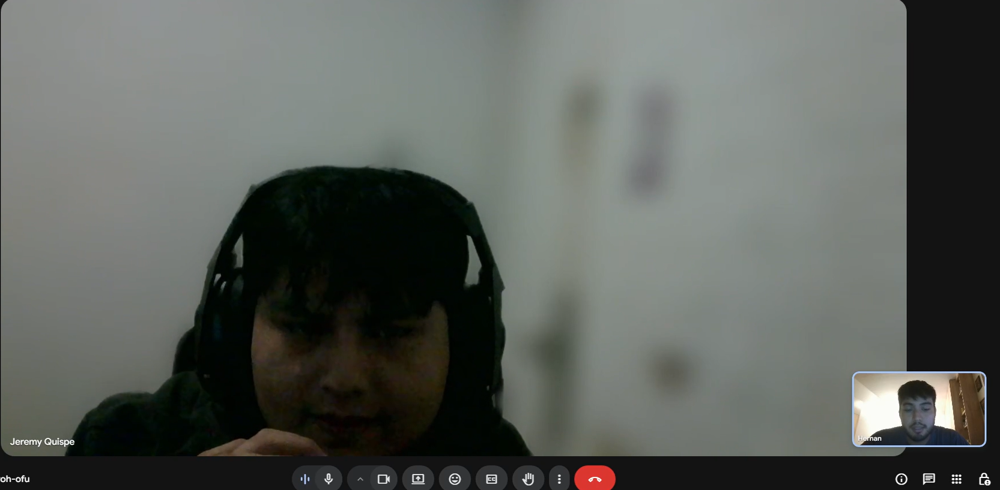
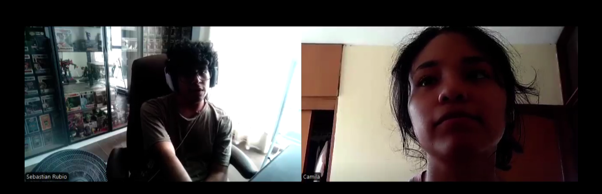
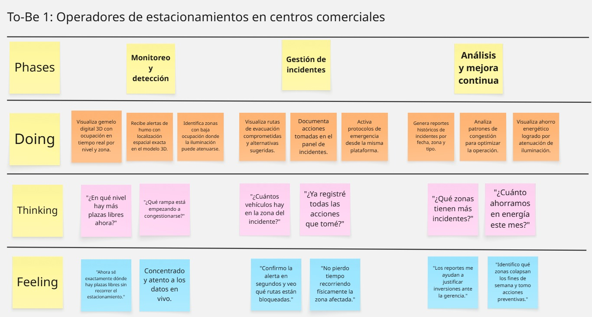
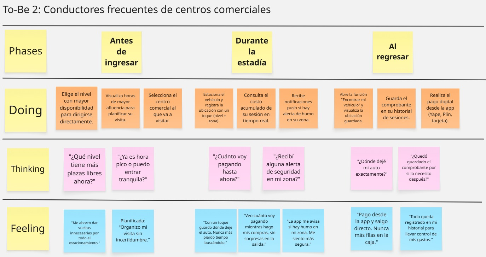

# UNIVERSIDAD PERUANA DE CIENCIAS APLICADAS

## Facultad de Ingeniería
### Carrera de Ingeniería de Software

**CICLO:** 202601  
**CURSO:** Arquitecturas de Software Emergentes  
**SECCIÓN:** 10042  
**PROFESOR:** Royer Edelwer Rojas Malasquez

---

## INFORME DE TRABAJO FINAL

**Startup:** _Apex Twin_  
**Producto:** _SmartPark_

### Plataforma de gestión inteligente de estacionamientos en centros comerciales basada en Digital Twins

---

### Relación de Integrantes

| Código     | Apellidos y Nombres             |
|------------|---------------------------------|
| U202220829 | Riva Rodriguez, Elmer Augusto   |
| u202216263 | Morales Calderon, Hernan Emilio |
| U20211g671 | Qqueso Rodriguez, Britney Delhy |
| U202210973 | Sanchez Rios, Camila Cristina   |
| U202210297 | Valle Zuta, Abel Andrés         |

**Lima, Perú — Abril de 2026**

---

## Registro de Versiones del Informe

| Versión | Fecha      | Autor      | Descripción de modificación                                                      |
|---------|------------|------------|----------------------------------------------------------------------------------|
| TB1   | 24-04-2026 | <li>Riva Rodriguez, Elmer Augusto</li>  <li>Morales Calderon, Hernan Emilio</li> <li>Qqueso Rodriguez, Britney Delhy</li>  <li>Sanchez Rios, Camila Cristina</li> <li>Valle Zuta, Abel Andrés</li>| Versión inicial del informe para entrega TB1. Incluye Capítulos I, II, III y IV. |
|         |            |            |                                                                                  |
|         |            |            |                                                                                  |

---

## Project Report Collaboration Insights

**URL del repositorio del informe:** `https://github.com/upc-pre-202601-1ASI0728-10042-smartpark/report`

**URL de la organización GitHub:** `https://github.com/upc-pre-202601-1ASI0728-10042-smartpark`

### Repositorios de productos digitales

| Producto                   | Repositorio                                                                  |
|----------------------------|------------------------------------------------------------------------------|
| Landing Page               | `https://github.com/upc-pre-202601-1ASI0728-10042-smartpark/landing-page`    |
| Web Application (Operador) | `https://github.com/upc-pre-202601-1ASI0728-10042-smartpark/web-application` |
| Web Services (API)         | `https://github.com/upc-pre-202601-1ASI0728-10042-smartpark/web-services`    |
| IoT Simulator              | `https://github.com/upc-pre-202601-1ASI0728-10042-smartpark/iot-simulator`   |
| Mobile App (PowerApps)     | `https://github.com/upc-pre-202601-1ASI0728-10042-smartpark/mobile-app`      |

### Evidencias de colaboración

#### TB1
_(Pendiente)_

---

## Tabla de Contenidos

- [UNIVERSIDAD PERUANA DE CIENCIAS APLICADAS](#universidad-peruana-de-ciencias-aplicadas)
- [Capítulo I: Introducción](#capítulo-i-introducción)
- [Capítulo II: Requirements Elicitation \& Analysis](#capítulo-ii-requirements-elicitation--analysis)
- [Capítulo III: Requirements Specification](#capítulo-iii-requirements-specification)
- [Capítulo IV: Strategic-Level Software Design](#capítulo-iv-strategic-level-software-design)
- [Capítulo V: Tactical-Level Software Design](#capítulo-v-tactical-level-software-design)
- [Capítulo VI: Solution UX Design](#capítulo-vi-solution-ux-design)
- [Capítulo VII: Product Implementation, Validation \& Deployment](#capítulo-vii-product-implementation-validation--deployment)
- [Conclusiones](#conclusiones)
- [Bibliografía](#bibliografía)
- [Anexos](#anexos)

---

# Capítulo I: Introducción

## 1.1. Startup Profile

### 1.1.1. Descripción de la Startup

Apex Twin es una startup tecnológica dedicada al desarrollo de soluciones de gestión inteligente basadas en Digital Twins (Gemelos Digitales) para la optimización de infraestructuras comerciales y urbanas. Nuestra visión es liderar la transformación digital del sector retail en Latinoamérica a través de visualización espacial en tiempo real y analítica predictiva.

### 1.1.2. Perfiles de integrantes del equipo

| Foto | Nombre completo | Código | Carrera | Aporte al equipo |
|---|---|---|---|---|
| _(Imagen)_ | Riva Rodriguez, Elmer Augusto | U202220829 | Ingeniería de Software | Arquitectura de Backend y Azure Digital Twins. |
| _(Imagen)_ | Morales Calderon, Hernan Emilio | u202216263 | Ingeniería de Software | Desarrollo de IoT Simulator y Sincronización. |
| _(Imagen)_ | Qqueso Rodriguez, Britney Delhy | U20211g671 | Ingeniería de Software | Mobile Development y UX Design. |
| _(Imagen)_ | Sanchez Rios, Camila Cristina | U202210973 | Ingeniería de Software | Frontend Development y Modelado de Datos. |
| _(Imagen)_ | Valle Zuta, Abel Andrés | U202210297 | Ingeniería de Software | Product Management y Quality Assurance. |

## 1.2. Solution Profile

### 1.2.1. Antecedentes y problemática

#### What (¿Qué?)
Dificultad en la gestión y uso de estacionamientos en grandes centros comerciales de Lima Metropolitana.

#### When (¿Cuándo?)
Especialmente en horas pico (fines de semana, feriados, tardes de semana).

#### Where (¿Dónde?)
Centros comerciales con alta afluencia vehicular (Jockey Plaza, Real Plaza Puruchuco, Mall del Sur).

#### Who (¿Quién?)
Afecta a operadores (gestión ineficiente) y conductores (pérdida de tiempo y estrés).

#### Why (¿Por qué?)
Falta de visibilidad en tiempo real, sensores descalibrados y ausencia de integración con seguridad y energía.

#### How (¿Cómo?)
Se manifiesta en congestión interna, incidentes de seguridad detectados tarde y alto consumo energético.

#### How Much (¿Cuánto?)
Tiempos de búsqueda entre 15-30 minutos y pérdidas operativas por ineficiencia.

### 1.2.2. Lean UX Process

#### 1.2.2.1. Lean UX Problem Statements

**(Problem Statement 1 — Operadores)**: Los operadores carecen de una vista unificada del estacionamiento que integre ocupación y seguridad, lo que retrasa la respuesta ante incidentes.

**(Problem Statement 2 — Conductores)**: Los conductores pierden tiempo valioso buscando plazas libres por falta de información precisa al ingresar.

---

# Capítulo II: Requirements Elicitation & Analysis

## 2.2. Entrevistas

### 2.2.2. Registro de entrevistas

#### Segmento 1: Operadores de estacionamientos en centros comerciales

**Entrevista 1 — Operador**

<table border="1">
  <tr>
    <th>Entrevista</th>
    <td>1</td>
    <th>Nombre</th>
    <td>Sebastian Silva</td>
  </tr>
  <tr>
    <th>Edad</th>
    <td>25</td>
    <th>Distrito</th>
    <td>Surco</td>
  </tr>
  <tr>
    <th>Captura de la entrevista: </th>
    <td colspan="3">
        El entrevistado, operador de estacionamientos con un año de experiencia, trabaja en la gestión y control de un estacionamiento de aproximadamente 100 plazas distribuidas en dos sótanos. Sus principales funciones son supervisar el ingreso y salida de vehículos, mantener el orden en horas pico y coordinar incidentes de seguridad mediante cámaras, sirenas y comunicación por radio. Señala que el sistema actual de sensores presenta errores al detectar espacios libres y existe un pequeño retraso en la actualización de datos, lo que dificulta la gestión eficiente. Considera importante contar con una plataforma tecnológica más precisa que permita asignar espacios automáticamente, mostrar disponibilidad en tiempo real y mejorar la experiencia del usuario. También destaca que sus mayores preocupaciones al implementar una nueva solución serían el costo, la integración con el sistema actual y la capacitación del personal.
    </td>
  </tr>
  <tr>
    <th>URL de la grabación</th>
    <td colspan="3">
      <a href="https://upcedupe-my.sharepoint.com/:v:/g/personal/u202210973_upc_edu_pe/IQC-7VJgcFQ7SqAUpkX0d2a7AVgYj6Xm8-epfEkyVjptlTc?nav=eyJyZWZlcnJhbEluZm8iOnsicmVmZXJyYWxBcHAiOiJTdHJlYW1XZWJBcHAiLCJyZWZlcnJhbFZpZXciOiJTaGFyZURpYWxvZy1MaW5rIiwicmVmZXJyYWxBcHBQbGF0Zm9ybSI6IldlYiIsInJlZmVycmFsTW9kZSI6InZpZXcifX0%3D&e=Kw4mkf">
        Ver grabación
      </a>
    </td>
  </tr>
  <tr>
   <th>Timing</th>
    <td colspan="3">
         9:37
    </td>
  </tr>
  <tr>
    <th>Entrevistador</th>
    <td colspan="3">Sebastian Silva</td>
  </tr>
</table>

**Entrevista 2 — Operador**  
<table>
  <tr>
    <td><strong>Entrevista</strong></td>
    <td>2</td>
    <td><strong>Nombre</strong></td>
    <td>Jeremy Joel Quispe Andia</td>
  </tr>
  <tr>
    <td><strong>Edad</strong></td>
    <td>25</td>
    <td><strong>Distrito</strong></td>
    <td>San Juan de Lurigancho, Lima</td>
  </tr>
  <tr>
    <td><strong>Captura de la entrevista:</strong>  </td>
    <td colspan="3">Jeremy es jefe de operaciones con cuatro años de experiencia y gestiona un estacionamiento de aproximadamente 1,200 plazas en un centro comercial. Supervisa ocupación, flujo vehicular, seguridad y personal operativo, apoyándose en cámaras CCTV, radios, barreras automáticas y reportes manuales. Sin embargo, identifica limitaciones importantes, como errores frecuentes en el conteo de vehículos y falta de visibilidad en tiempo real sobre la disponibilidad exacta por zonas.Ante incidentes como accidentes, humo o robos, el equipo depende de reportes del personal y revisión de cámaras, lo que retrasa la ubicación del problema entre tres y siete minutos. Asimismo, las mayores congestiones ocurren en fines de semana y feriados, resolviéndose mediante redirección manual y apoyo de orientadores.Finalmente, Jeremy señala una gestión energética poco eficiente, ya que la iluminación funciona mayormente con horarios fijos y sin automatización en zonas vacías. Considera clave implementar una plataforma que permita monitorear ocupación, alertas y congestión en tiempo real para tomar decisiones más proactivas.</td>
  </tr>
  <tr>
    <td><strong>URL de la grabación</strong></td>
    <td colspan="3"><a href="https://upcedupe-my.sharepoint.com/:v:/g/personal/u202216263_upc_edu_pe/IQB2AaFWtAp3TL58UwEXAlu2ARz4YzAm_o1UZWJrDLK0XGI?e=poyF6t&nav=eyJyZWZlcnJhbEluZm8iOnsicmVmZXJyYWxBcHAiOiJTdHJlYW1XZWJBcHAiLCJyZWZlcnJhbFZpZXciOiJTaGFyZURpYWxvZy1MaW5rIiwicmVmZXJyYWxBcHBQbGF0Zm9ybSI6IldlYiIsInJlZmVycmFsTW9kZSI6InZpZXcifX0%3D">Ver grabación</a></td>
  </tr>
  <tr>
    <td><strong>Timing</strong></td>
    <td colspan="3">6 minutos con 56 segundos</td>
  </tr>
  <tr>
    <td><strong>Entrevistador</strong></td>
    <td colspan="3">Hernan Morales Calderón</td>
  </tr>
</table>

**Entrevista 3 — Operador**  
<table>
  <tr>
    <td><strong>Entrevista</strong></td>
    <td>3</td>
    <td><strong>Nombre</strong></td>
    <td>Juan Alarcon Ramirez</td>
  </tr>
  <tr>
    <td><strong>Edad</strong></td>
    <td>25</td>
    <td><strong>Distrito</strong></td>
    <td>Wanchaq, Cusco</td>
  </tr>
  <tr>
    <td><strong>Captura de la entrevista:</strong>  </td>
    <td colspan="3">Juan es técnico de operaciones con tres años de experiencia, gestiona un estacionamiento de entre 30 y 50 plazas donde se encarga del mantenimiento de maquinaria y la fluidez del tráfico. A pesar de contar con cámaras de vigilancia, barreras y sensores, Juan identifica limitaciones tecnológicas, como errores en el conteo de vehículos que generan molestias en los usuarios y la falta de visibilidad en tiempo real sobre la ocupación específica de cada pasillo. Ante incidentes de seguridad o congestiones en rampas que suelen ocurrir en fines de semana y feriados, el equipo depende del monitoreo manual por CCTV y la intervención directa de personal con señales manuales. Finalmente, destaca una gestión energética ineficiente, ya que la iluminación opera bajo horarios fijos sin sistemas de ahorro para zonas desocupadas, lo que resulta en un consumo elevado de electricidad.</td>
  </tr>
  <tr>
    <td><strong>URL de la grabación</strong></td>
    <td colspan="3"><a href="https://upcedupe-my.sharepoint.com/:v:/g/personal/u20211g671_upc_edu_pe/IQAMlLdlmF2pT75rc_E783gEAZ1O58GkQJQbV1O8t3DN02U?e=f1yiAz&nav=eyJyZWZlcnJhbEluZm8iOnsicmVmZXJyYWxBcHAiOiJTdHJlYW1XZWJBcHAiLCJyZWZlcnJhbFZpZXciOiJTaGFyZURpYWxvZy1MaW5rIiwicmVmZXJyYWxBcHBQbGF0Zm9ybSI6IldlYiIsInJlZmVycmFsTW9kZSI6InZpZXcifX0%3D">Ver grabación</a></td>
  </tr>
  <tr>
    <td><strong>Timing</strong></td>
    <td colspan="3">4 minutos con 40 segundos</td>
  </tr>
  <tr>
    <td><strong>Entrevistador</strong></td>
    <td colspan="3">Britney Qqueso Rodriguez</td>
  </tr>
</table>

#### Segmento 2: Conductores frecuentes de centros comerciales

**Entrevista 1 — Conductor**

<table border="1">
  <tr>
    <th>Entrevista</th>
    <td>1</td>
    <th>Nombre</th>
    <td>Sebastian Rubio</td>
  </tr>
  <tr>
    <th>Edad</th>
    <td>20</td>
    <th>Distrito</th>
    <td>Surco</td>
  </tr>
  <tr>
    <th>Captura de la entrevista: </th>
    <td colspan="3">
        El entrevistado, de 20 años, visita centros comerciales como Jockey Plaza entre 1 y 2 veces por semana, principalmente los fines de semana, para ir al cine, comer o comprar ropa. Señala que encontrar estacionamiento suele ser complicado en horas pico, demorando entre 5 y 10 minutos, por lo que prefiere ir directamente a los niveles superiores, donde hay más espacios disponibles. También considera importante conocer el costo acumulado del estacionamiento en tiempo real y recibir alertas de seguridad ante incidentes. Además, estaría dispuesto a usar una aplicación móvil que le permita ubicar espacios libres, registrar dónde dejó su vehículo y acceder a un mapa interactivo con información precisa sobre la disponibilidad de estacionamientos.
    </td>
  </tr>
  <tr>
    <th>URL de la grabación</th>
    <td colspan="3">
      <a href="https://upcedupe-my.sharepoint.com/:v:/g/personal/u202210973_upc_edu_pe/IQDczbI-ti9ARrdbBQuNVIxDAUpsh_TZarox-GgCpR_0Tbs?nav=eyJyZWZlcnJhbEluZm8iOnsicmVmZXJyYWxBcHAiOiJTdHJlYW1XZWJBcHAiLCJyZWZlcnJhbFZpZXciOiJTaGFyZURpYWxvZy1MaW5rIiwicmVmZXJyYWxBcHBQbGF0Zm9ybSI6IldlYiIsInJlZmVycmFsTW9kZSI6InZpZXcifX0%3D&e=fyFeXn">
        Ver grabación
      </a>
    </td>
  </tr>
  <tr>
   <th>Timing</th>
    <td colspan="3">
         7:51
    </td>
  </tr>
  <tr>
    <th>Entrevistador</th>
    <td colspan="3">Sebastian Rubio</td>
  </tr>
</table>

**Entrevista 2 — Conductor**

<table>
  <tr>
    <td><strong>Entrevista</strong></td>
    <td>2</td>
    <td><strong>Nombre</strong></td>
    <td>Luis Chinchihualpa Saldarriaga</td>
  </tr>
  <tr>
    <td><strong>Edad</strong></td>
    <td>25</td>
    <td><strong>Distrito</strong></td>
    <td>La Molina</td>
  </tr>
  <tr>
    <td><strong>Captura de la entrevista:</strong>  </td>
    <td colspan="3">Luis es un conductor frecuente de centros comerciales, a los que asiste todos los fines de semana. Enfrenta múltiples dificultades al estacionar: desconoce el precio hasta después de ingresar y desconfía de los indicadores de luz. Su búsqueda toma entre 15 y 30 minutos. Está muy interesado en conocer el costo acumulado en tiempo real y alertas de seguridad.</td>
  </tr>
  <tr>
    <td><strong>URL de la grabación</strong></td>
    <td colspan="3"><a href="https://upcedupe-my.sharepoint.com/:v:/g/personal/u202210297_upc_edu_pe/IQBwF8-wNd6GT4icNCBDmTLBAZoUCIvODFg4ZUDDZFs4shQ?nav=eyJyZWZlcnJhbEluZm8iOnsicmVmZXJyYWxBcHAiOiJTdHJlYW1XZWJBcHAiLCJyZWZlcnJhbFZpZXciOiJTaGFyZURpYWxvZy1MaW5rIiwicmVmZXJyYWxBcHBQbGF0Zm9ybSI6IldlYiIsInJlZmVycmFsTW9kZSI6InZpZXcifX0%3D&e=klWNvR">Ver grabación</a></td>
  </tr>
  <tr>
    <td><strong>Timing</strong></td>
    <td colspan="3">16:46</td>
  </tr>
  <tr>
    <td><strong>Entrevistador</strong></td>
    <td colspan="3">Abel Andrés Valle Zuta</td>
  </tr>
</table>

**Entrevista 3 — Conductor**  

<table>
  <tr>
    <td><strong>Entrevista</strong></td>
    <td>3</td>
    <td><strong>Nombre</strong></td>
    <td>Edward Rodriguez</td>
  </tr>
  <tr>
    <td><strong>Edad</strong></td>
    <td>28</td>
    <td><strong>Distrito</strong></td>
    <td>Yanahuara, Arequipa</td>
  </tr>
  <tr>
    <td><strong>Captura de la entrevista:</strong>  </td>
    <td colspan="3">Edward describe su experiencia como frustrante y congestionada. Utiliza fotos y Google Maps para recordar la ubicación. Necesita soluciones para consultar costo en tiempo real y recibir notificaciones ante incidentes.</td>
  </tr>
  <tr>
    <td><strong>URL de la grabación</strong></td>
    <td colspan="3"><a href="https://upcedupe-my.sharepoint.com/:v:/g/personal/u20211g671_upc_edu_pe/IQDN3psHgYEbSJJE8h4T0B3HASpKNaqWqCPhXezHu2zqDPo?e=ky3NJO&nav=eyJyZWZlcnJhbEluZm8iOnsicmVmZXJyYWxBcHAiOiJTdHJlYW1XZWJBcHAiLCJyZWZlcnJhbFZpZXciOiJTaGFyZURpYWxvZy1MaW5rIiwicmVmZXJyYWxBcHBQbGF0Zm9ybSI6IldlYiIsInJlZmVycmFsTW9kZSI6InZpZXcifX0%3D">Ver grabación</a></td>
  </tr>
  <tr>
    <td><strong>Timing</strong></td>
    <td colspan="3">5:55</td>
  </tr>
  <tr>
    <td><strong>Entrevistador</strong></td>
    <td colspan="3">Britney Qqueso Rodriguez</td>
  </tr>
</table>

### 2.2.3. Análisis de entrevistas

| Atributo | Operadores (S1) | Conductores (S2) |
|---|---|---|
| Principal Dolor | Falta de precisión en tiempo real. | Tiempo de búsqueda excesivo (>15 min). |
| Necesidad Clave | Vista unificada y alertas espaciales. | Costo en tiempo real y alertas de seguridad. |
| Disposición tecnológica | Alta, preocupa costo e integración. | Alta, debe ser simple y rápida. |

## 2.3. Needfinding

### 2.3.1. User Personas

### 2.3.4. As-is Scenario Mapping

---

# Capítulo III: Requirements Specification

## 3.1. To-Be Scenario Mapping

## 3.3. Impact Mapping

**Business Goals (SMART):**
- **BG-01:** Alcanzar 5 contratos con C.C. en 12 meses.
- **BG-02:** 10,000 descargas de la app en 8 meses.
- **BG-03:** Reducir 30% tiempo de búsqueda en 6 meses.

---

# Capítulo IV: Strategic-Level Software Design

## 4.3. Software Architecture

### 4.3.1. System Landscape Diagram

### 4.3.2. Context Level Diagram

### 4.3.3. Container Level Diagram

### 4.3.4. Deployment Diagram

