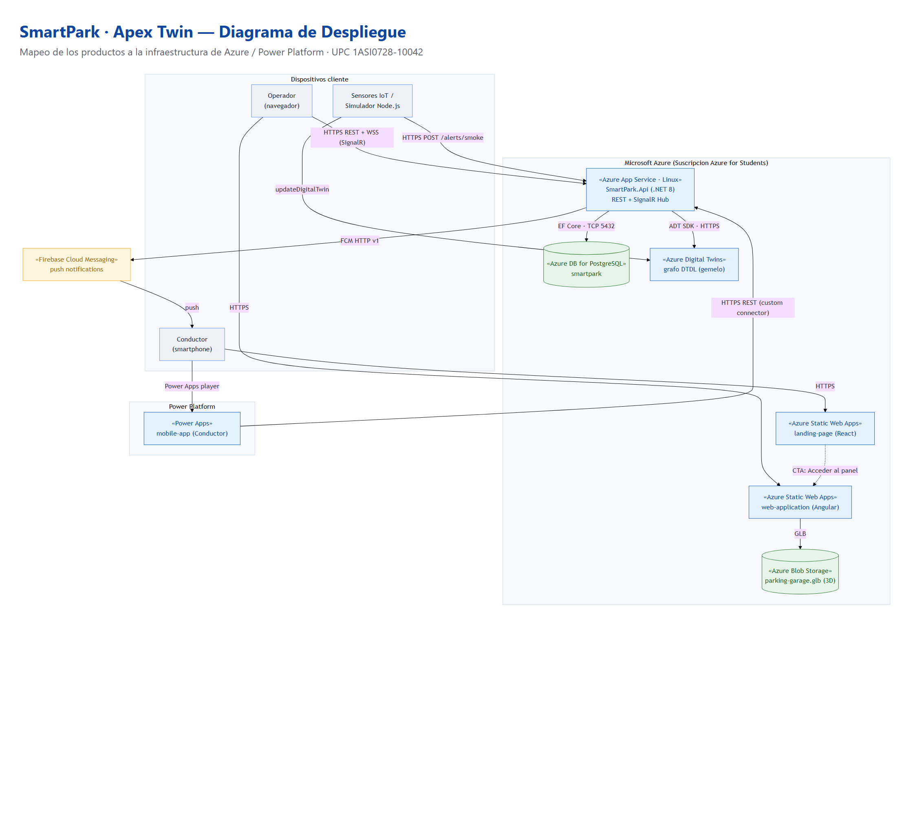
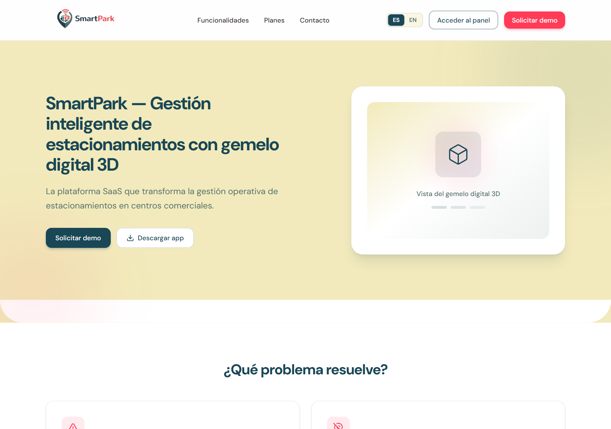
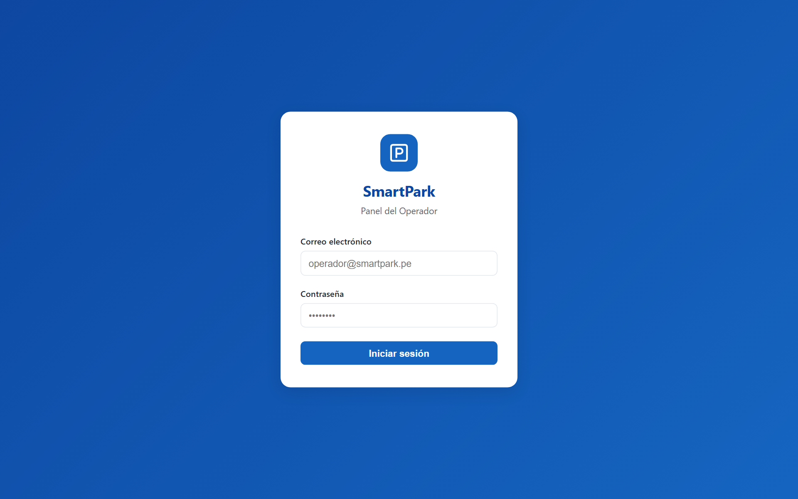
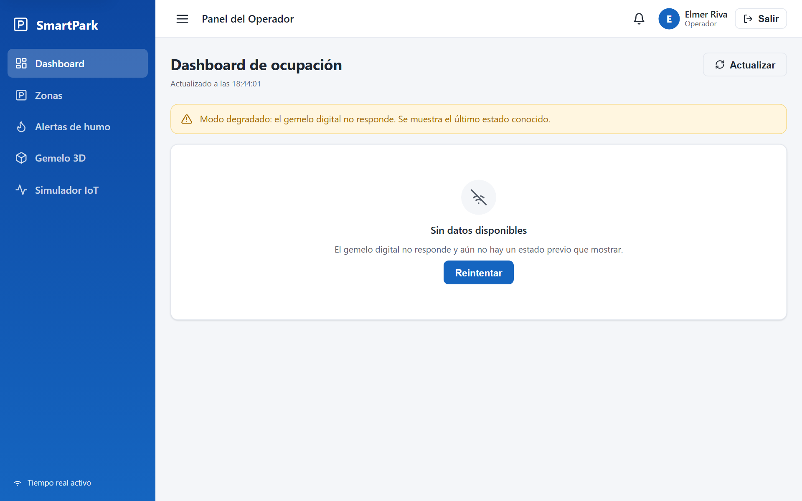

# Despliegue (Deployment)



## Estado del despliegue (Azure for Students, RG `rg-smartpark`)

| Componente | Estado | Evidencia |
|---|---|---|
| **landing-page** | ✅ **En vivo** | https://stsmartparkland01.z20.web.core.windows.net/ —  |
| **web-application** | ✅ **En vivo** | https://stsmartparkweb01.z20.web.core.windows.net/ —  |
| **Azure Digital Twins** | ✅ Provisionado | `adt-smartpark` (eastus2) |
| **Azure Blob Storage** (3D) | ✅ Provisionado | `stsmartparkvhrz` (eastus2) |
| **web-services (API)** | ✅ **En vivo** | https://smartpark-api.azurewebsites.net/swagger — login JWT verificado |
| **Base de datos** | ✅ **En vivo** | SQLite en App Service (ver nota) |

Los frontends se publicaron como **Azure Storage static websites** y el API en **Azure App
Service (Linux, .NET 8, B1)** — todo vía **Az PowerShell**, que valida TLS con schannel y por
eso atraviesa el proxy de la UPC (a diferencia de `az` CLI, bloqueado por el OpenSSL estricto).

**Verificación end-to-end en la nube:** la web-app desplegada inicia sesión contra el API
desplegado (CORS + JWT + SignalR) y abre el panel del operador
().

> **Decisión sobre la base de datos:** *Azure Database for PostgreSQL Flexible Server* y
> *Azure SQL* están **restringidos por cuota/capacidad** en la suscripción gratuita
> *Azure for Students* (todas las regiones probadas: eastus, eastus2, centralus, westus2/3,
> southcentralus…), y un contenedor PostgreSQL con IP pública se descartó por seguridad. Para
> que el despliegue quedara **funcional**, el backend se hizo **multi-proveedor EF Core**
> (PostgreSQL · SQL Server · SQLite) y en Azure usa **SQLite embebido en el App Service**
> (`/home/smartpark.db`), sin servidor de BD que provisionar. En producción real se usaría
> PostgreSQL/SQL Server gestionado (basta cambiar `Database:Provider` + la cadena de conexión).

## Mapeo de productos a infraestructura

| Producto | Nodo de despliegue | Tecnología | Notas |
|---|---|---|---|
| **web-services** (API) | Azure App Service (Linux) | .NET 8 | Expone REST `/api/v1/*` + SignalR `/hubs/alerts` |
| **Base de datos** | Azure Database for PostgreSQL (Flexible Server) | PostgreSQL 16 | Accedida por EF Core (TCP 5432) |
| **Gemelo digital** | Azure Digital Twins | DTDL | Grafo de twins; el API lo consulta vía ACL |
| **Modelo 3D** | Azure Blob Storage | GLB | Servido al visor 3D de la web-app |
| **web-application** (Operador) | Azure Static Web Apps | Angular 20 | SPA estática; consume el API |
| **landing-page** | Azure Static Web Apps | React/Vite | Enlaza al panel del operador |
| **mobile-app** (Conductor) | Power Platform | Power Apps Canvas | Consume el API vía custom connector |
| **Notificaciones push** | Firebase Cloud Messaging | FCM HTTP v1 | El API empuja alertas a los conductores |
| **Simulador IoT** | Node.js (on-demand / Azure Functions) | Node 18+ | Actualiza ADT y POSTea alertas al API |

## Protocolos por conexión
- Operador (navegador) → API: **HTTPS/REST** + **WSS (SignalR)** para alertas en tiempo real.
- Mobile (Power Apps) → API: **HTTPS/REST** mediante custom connector.
- API → PostgreSQL: **EF Core / TCP 5432**.
- API → Azure Digital Twins: **ADT SDK / HTTPS** (Anti-Corruption Layer).
- API → Firebase → Conductor: **FCM HTTP v1** (push).
- Simulador IoT → ADT (`updateDigitalTwin`) y → API (`POST /alerts/smoke`, header `X-Api-Key`).
- web-app (visor 3D) → Blob Storage: **HTTPS** (GLB).

## Procedimiento de despliegue (Azure CLI)

> Suscripción: *Azure for Students* (UPC). Región sugerida: `eastus2`.

```bash
# 0) Grupo de recursos
az group create -n rg-smartpark -l eastus2

# 1) PostgreSQL Flexible Server
az postgres flexible-server create -g rg-smartpark -n smartpark-pg \
  --tier Burstable --sku-name Standard_B1ms --version 16 \
  --admin-user sparkadmin --admin-password '<PWD>' --public-access 0.0.0.0
az postgres flexible-server db create -g rg-smartpark -s smartpark-pg -d smartpark

# 2) App Service (API .NET 8)
az appservice plan create -g rg-smartpark -n plan-smartpark --is-linux --sku B1
az webapp create -g rg-smartpark -p plan-smartpark -n smartpark-api --runtime "DOTNETCORE:8.0"
az webapp config connection-string set -g rg-smartpark -n smartpark-api -t PostgreSQL \
  --settings SmartParkDb="Host=smartpark-pg.postgres.database.azure.com;Database=smartpark;Username=sparkadmin;Password=<PWD>;Ssl Mode=Require"
az webapp config appsettings set -g rg-smartpark -n smartpark-api --settings \
  Jwt__Key="<SECRET>" Adt__HostName="<adt-host>" Ingest__ApiKey="<KEY>" \
  Cors__WebApp="https://<web-app>.azurestaticapps.net"
# publicar:
dotnet publish src/SmartPark.Api -c Release -o ./publish
cd publish && zip -r ../api.zip . && cd ..
az webapp deploy -g rg-smartpark -n smartpark-api --src-path api.zip --type zip

# 3) Static Web Apps (web-application y landing-page)
az staticwebapp create -g rg-smartpark -n smartpark-web   -l eastus2
az staticwebapp create -g rg-smartpark -n smartpark-landing -l eastus2
# build + deploy con la SWA CLI (npx @azure/static-web-apps-cli):
#   web:     ng build --configuration production && swa deploy ./dist/web-application/browser --deployment-token <token>
#   landing: npm run build && swa deploy ./dist --deployment-token <token>

# 4) Azure Digital Twins y Blob Storage ya existen (provisionados con los scripts de iot-simulator).
```

> **Nota de entorno (UPC):** el `az` CLI no autentica desde la red de la universidad porque el
> proxy de la UPC intercepta TLS con una CA cuyo `BasicConstraints` no es crítico, y el OpenSSL
> aislado (`-I`) de `az` la rechaza. El despliegue debe ejecutarse con **Azure PowerShell**
> (módulo `Az`, que valida con schannel) o desde una **red sin ese proxy**.
